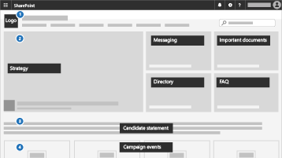

Microsoft 365 voor kleine bedrijven en campagnes
===========================

Als u Microsoft 365 Business Premium hebt, zijn de instructies in deze bibliotheek de snelste manier om uw beveiliging in te stellen en te beginnen met veilig samenwerken. In de wereld van vandaag is het beveiligen van gegevens en communicatie een prioriteit, zeker voor medische en juridische praktijken, politieke campagnes en vele andere kleine bedrijven. Deze oplossing biedt een resem aanbevelingen die ontworpen zijn om je te helpen bij de bescherming van jezelf en je gegevens. Deze bibliotheek bevat hulp voor het instellen en gebruiken van deze aanbevelingen omgeving, ongeacht het type van je bedrijf.

Deze configuratie bevat de volgende richtlijnen voor productiviteit, samenwerking, bestandsopslag, e-mail, apparaten en identiteit voor de bescherming van je bedrijf:

| Bescherming voor | Omschrijving | Koppelingen |
| ----- | ----- | ----- | ----- |
|E-mail | Gebruik meervoudige verificatie en ATP Advanced Phishing Protection en ATP-veilige koppelingen en veilige bijlagen en gebruik versleutelde e-mail voor gevoelige informatie.| [Meervoudige verificatie instellen](m365-campaigns-multifactor-authenication.md), [Bescherming tegen phishing-aanvallen](m365-campaigns-phishing-and-attacks.md), [Gevoelige e-mail versleutelen of labelen](send-encrypted-email.md) |
|iPhones en Android-apparaten |Meervoudige verificatie gebruiken, Microsoft mobiele apps instellen en een PIN vereisen. | [Meervoudige verificatie instellen](m365-campaigns-multifactor-authenication.md), [Mobiele apparaten instellen](../business/set-up-mobile-devices.md?toc=/microsoft-365/campaigns/toc.json)|
|Bring-your-own-devices (BYOD) Macs en Windows 10 pc's |Office en besturingssystemen up-to-date houden en beveiligingsfuncties inschakelen. | [Niet-beheerde Windows 10 pc's en Macs beveiligen](m365-campaigns-protect-pcs-macs.md) |
|Bestanden veilig opslaan en delen | Bestanden en video's delen uit Microsoft Teams, OneDrive, SharePoint en Microsoft Stream en gevoelige informatie beveiligen.| [Bestanden en video's delen](share-files-and-videos.md) |
|Beheerde Windows 10-apparaten beveiligen |Beheerde apparaten gebruiken voor essentieel personeel en apparaten beveiligen. | [Beheerde apparaten instellen](../business/set-up-windows-devices.md?toc=/microsoft-365/campaigns/toc.json) |

Een aanbevolen beveiligingsconfiguratie voor Microsoft 365 Business Premium
------------------------------------

Met deze aanbevolen beveiligingsconfiguratie voor Microsoft 365 Business Premium kan je:

- kunt vertrouwen op betrouwbare hulpprogramma's voor bedrijfsproductiviteit en samenwerking, zoals Outlook, Word, Excel en andere Office-producten.
- uw werkbestanden op al uw iOS-, Android- en Windows 10-apparaten kunt beschermen met eenvoudig te beheren beveiliging op bedrijfsniveau.
- extra beveiliging kunt toepassen op gebruikersaccounts en -identiteiten.

> [!VIDEO https://www.microsoft.com/videoplayer/embed/RE3clbH]

Hoewel federale verkiezingscampagnes in de Verenigde Staten in aanmerking komen voor [speciale prijzen](get-microsoft-365-campaigns.md) voor het aanbod voor Microsoft 365 voor Campagnes van Microsoft 365 Business Premium, kan elke organisatie met dit abonnement profiteren van deze richtlijn voor het configureren van een betere beveiliging en meer informatie over hoe je veilig kunt samenwerken.

Dit pakket bevat het volgende:

- Richtlijnen voor het instellen van een betere beveiliging.
- Hulp voor gebruikers bij het instellen van beveiligde toegang.
- Richtlijnen voor veilig samenwerken en delen.

Raadpleeg [Microsoft 365 Business Premium](https://www.microsoft.com/microsoft-365/business) voor meer informatie over de inhoud.

Aan de slag
--------------------------

Ga aan de hand van deze stappen aan de slag:

- Voor campagnes: [Microsoft 365-campagnes ophalen](get-microsoft-365-campaigns.md)
- Voor alle bedrijven: [Meer informatie over hoe je gebruikers met Microsoft 365 zullen werken](m365-campaigns-users.md)
- Voor alle bedrijven: [Microsoft 365 instellen](microsoft-365-campaigns-setup-overview.md)

Oplossingen voor jouw bedrijf
--------------------------

Na het instellen van de veilige Microsoft 365-omgeving, kunt u de volgende oplossingen gebruiken om aan de slag te gaan:

| Teams voor samenwerking aanmaken | Onlinevergaderingen instellen |
| ------------- | ------------- |
|  |  |
| Werk samen met teams voor belangrijke medewerkers, alle medewerkers en partners of leveranciers. [Uw team maken](create-teams-for-collaboration.md) | Een vergadering plannen met audio, video en delen met Microsoft Teams. [Een vergadering organiseren](set-up-meetings.md) |

| Uw gevoelige e-mailberichten versleutelen of labelen | Een communicatiesite maken |
| ------------- | ------------- |
|  |  |
| Gebruik labels voor versleuteling en gevoeligheid om e-mailberichten te beveiligen die vertrouwelijke of gevoelige informatie bevatten. [Versleutelde e-mail verzenden](send-encrypted-email.md) | Deel gebeurtenissen, berichten, afbeeldingen en meer met uw team op een interne communicatiepagina die is aangemaakt met SharePoint. [Een pagina aanmaken](create-communications-site.md) |

| Bestanden en video's delen |
| ------------- |
|  |
| Sla je bestanden en video's op in de cloud, zodat deze beschikbaar zijn  voor alle gepaste personen. [Begin met delen](share-files-and-videos.md) |
