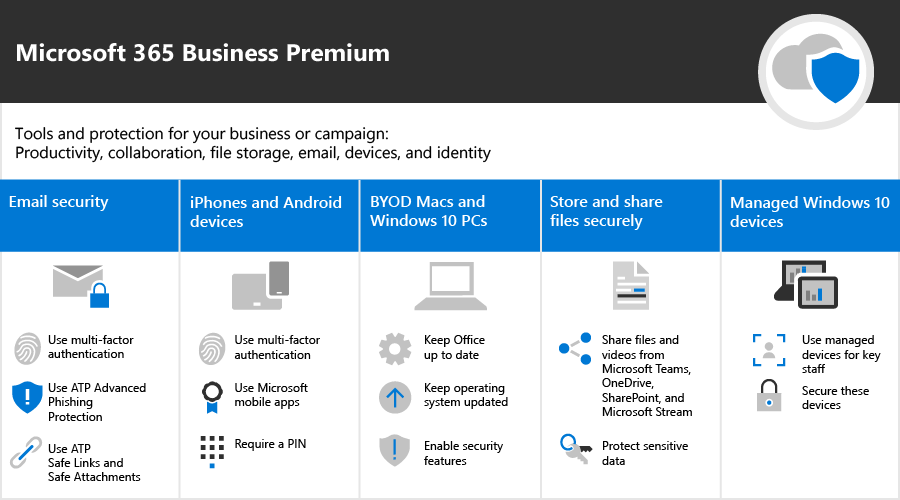

Microsoft 365 voor campagnes
===========================

In onze huidige wereld is het beveiligen van gegevens en communicatie een prioriteit, met name voor politieke campagnes, medische en juridische praktijken en vele andere bedrijven. Microsoft 365 voor campagnes wordt geleverd met een reeks aanbevelingen die zijn ontworpen om u en uw gegevens te beschermen. Deze bibliotheek bevat hulp bij het instellen en gebruiken van deze aanbevolen omgeving, zelfs als u geen campagne bent.

> [!VIDEO https://www.microsoft.com/videoplayer/embed/RE3clbH] 

**Wat is Microsoft 365 voor campagnes?** Het is een aanbevolen beveiligde configuratie die Microsoft 365 Business bevat, zodat u:
- Vertrouw op vertrouwde hulpprogramma's voor bedrijfsproductiviteit en samenwerking, zoals Outlook, Word, Excel en andere Office-producten 
- Bescherm uw werkbestanden op al uw iOS-, Android- en Windows 10-apparaten met beveiliging op bedrijfsniveau die eenvoudig te beheren is 
- Extra bescherming toepassen voor gebruikersaccounts en -identiteit 

Terwijl federale verkiezingscampagnes in de Verenigde Staten in aanmerking komen voor speciale prijzen voor Microsoft 365 Business, kan elke organisatie met dit plan profiteren van deze richtlijnen om meer beveiliging te configureren en te leren hoe u veilig samenwerken.

Deze bibliotheek bevat het volgende:
- Vooraf beschrijvende richtlijnen voor het instellen van instellingen voor het toevoegen van meer beveiliging.
- Help gebruikers om apparaten in te stellen voor veilige toegang.
- Richtlijnen voor veilig samenwerken en delen.

Zie [Microsoft 365 Business](https://www.microsoft.com/microsoft-365/business)voor meer informatie over wat er is inbegrepen. 

Aan de slag
--------------------------

<ul class="panelContent cardsJ">
    <li>
        

            

                

                    

                        

                            
                        

                    

                    

                        
<b>Volg de volgende stappen om aan de slag te gaan:</b>

                        
<a href="get-microsoft-365-campaigns.md">Microsoft 365-campagnes weergeven</a>

                        
<a href="m365-campaigns-users.md">Meer informatie over hoe uw gebruikers werken met Microsoft 365</a>

                        
<a href="microsoft-365-campaigns-setup-overview.md">Microsoft 365-campagnes instellen</a>

                    

                

            

        

    </li>
</ul>

Oplossingen voor uw campagne of kleine bedrijven
--------------------------

Nadat u uw beveiligde Microsoft 365-omgeving hebt ingesteld, u de volgende oplossingen gebruiken om aan de slag te gaan:

<ul class="panelContent cardsW cols cols2">
    <li>
        

            

                

                    

                        

                            
                        

                    

                    

                        <h3>Teams maken voor samenwerking</h3>
                        
Maak ruimte voor communicatie en samenwerking met specifieke teams voor belangrijke medewerkers, alle medewerkers en partners of leveranciers met Microsoft Teams.

                        
<a href="create-teams-for-collaboration.md">Maak je team</a>

                    

                

            

        

    </li>
    <li>
        

            

                

                    

                        

                            
                        

                    

                    

                        <h3>Online vergaderingen instellen</h3>
                        
Plan een vergadering met audio, video en delen met Microsoft Teams.

                        
<a href="set-up-meetings.md">Een vergadering instellen</a>

                    

                

            

        

    </li>
    <li>
        

            

                

                    

                        

                            
                        

                    

                    

                        <h3>Uw gevoelige e-mail versleutelen of labelen</h3>
                        
Gebruik versleutelings- en gevoeligheidslabels om e-mail te beschermen die vertrouwelijke of gevoelige informatie bevat.

                        
<a href="send-encrypted-email.md">Versleutelde e-mail verzenden</a>

                    

                

            

        

    </li>
    <li>
        

            

                

                    

                        

                            
                        

                    

                    

                        <h3>Een communicatiesite maken</h3>
                        
Deel gebeurtenissen, berichten, afbeeldingen en meer met uw team op een interne communicatiesite die is gemaakt met SharePoint.

                        
<a href="create-communications-site.md">Uw site maken</a>

                    

                

            

        

    </li>
    <li>
        

            

                

                    

                        

                            
                        

                    

                    

                        <h3>Bestanden en video's delen</h3>
                        
Sla uw bestanden en video's op in de cloud, zodat ze beschikbaar zijn voor alle juiste mensen.

                        
<a href="share-files-and-videos.md">Beginnen met delen</a>

                    

                

            

        

    </li>
</ul>
