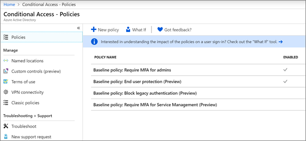

# Meervoudige verificatie vereisen en beleid voor voorwaardelijke toegang instellen

U beschermt de toegang tot uw gegevens met multi-factor authenticatie en beleid voor voorwaardelijke toegang. Deze voegen aanzienlijke extra beveiliging toe. Microsoft biedt een set voorwaardelijke toegangsbeleid voor basislijnen die worden aanbevolen voor alle klanten. Basislijnbeleid is een set vooraf gedefinieerde beleidsregels die organisaties helpen beschermen tegen veelvoorkomende aanvallen. Deze veelvoorkomende aanvallen kunnen wachtwoordspray, replay en phishing omvatten.

Voor dit beleid moeten beheerders en gebruikers een tweede vorm van verificatie invoeren (multi-factor authenticatie of MFA) wanneer aan bepaalde voorwaarden is voldaan. Als een gebruiker in uw organisatie zich bijvoorbeeld probeert aan te melden bij Microsoft 365 vanuit een ander land of vanaf een onbekend apparaat, kan de aanmelding als riskant worden beschouwd. De gebruiker moet een extra vorm van authenticatie (zoals een vingerafdruk of een code) om hun identiteit te bewijzen. 

Momenteel omvat het basislijnbeleid het volgende:
- Instellen in het Microsoft 365-beheercentrum:
    - **MFA vereisen voor beheerders** : vereist meervoudige verificatie voor de meest bevoorrechte beheerdersrollen, inclusief globale beheerder.
    - **Bescherming van eindgebruikers** : vereist multi-factor authenticatie voor gebruikers alleen wanneer een aanmelding riskant is. 
- Instellen in Azure Active Directory-portal:
    - **Verouderde verificatie blokkeren** : oudere client-apps en sommige nieuwe apps maken geen gebruik van nieuwere, veiligere verificatieprotocollen. Deze oudere apps kunnen het beleid voor voorwaardelijke toegang omzeilen en ongeautoriseerde toegang tot uw omgeving krijgen. Dit beleid blokkeert de toegang van clients die geen voorwaardelijke toegang ondersteunen. 
    - **MFA vereisen voor servicebeheer** : vereist meervoudige verificatie voor toegang tot beheerprogramma's, waaronder Azure-portal (waarbij u basislijnbeleid configureert). 

Microsoft raadt u aan al deze basislijnbeleidsregels in te schakelen. Nadat dit beleid is ingeschakeld, worden beheerders en gebruikers gevraagd zich te registreren voor Azure Multi-Factor-verificatie.

Zie [Wat zijn basislijnbeleid](https://docs.microsoft.com/azure/active-directory/conditional-access/concept-baseline-protection)voor meer informatie over dit beleid?

## MFA vereisen

U moet eisen dat alle gebruikers zich aanmelden met een tweede vorm van id:

1. Ga naar het <a href="https://go.microsoft.com/fwlink/p/?linkid=837890" target="_blank">https://admin.microsoft.com</a> beheercentrum bij en kies **Setup**.

2. Kies op de pagina Setup de optie **Weergeven** op de **aanmeldingskaart maken.**

    
3. Kies op de pagina Aanmelden maken de optie **Aan de slag**.
 
4. Schakel in het beveiligingsupdatevenster Voor meerdere factoren de selectievakjes naast **Multifactorverificatie voor beheerders vereisen** in en **gebruikers vereisen zich te registreren voor meervoudige verificatie en toegang te blokkeren als er risico's worden gedetecteerd.**
    Sluit het [nood-](m365-campaigns-protect-admin-accounts.md#create-an-emergency-admin-account) of 'break-glass'-beheerdersaccount uit van de MFA-vereiste in het vak **Gebruikers zoeken.**
    
    

5. Kies **Beleid maken** onder aan de pagina.

## Basislijnbeleid instellen

1. Ga naar [Azure-portal](https://portal.azure.com)en navigeer naar Voorwaardelijke **toegang** **voor Azure Active Directory** \> .
    
    Het basislijnbeleid wordt op de pagina weergegeven en u zien dat **MFA vereisen voor beheerders** en beveiliging van **eindgebruikers** al zijn ingeschakeld nadat u de stappen hebt voltooid in [MFA vereisen](#require-mfa).

    
2. Zie de volgende specifieke instructies voor elk beleid:

    - [MFA vereisen voor beheerders](https://docs.microsoft.com/azure/active-directory/conditional-access/howto-baseline-protect-administrators)
    - [MFA vereisen voor gebruikers](https://docs.microsoft.com/azure/active-directory/conditional-access/howto-baseline-protect-end-users)  
    - [Verouderde verificatie blokkeren](https://docs.microsoft.com/azure/active-directory/conditional-access/howto-baseline-protect-legacy-auth)
    - [MFA vereisen voor servicebeheer](https://docs.microsoft.com/azure/active-directory/conditional-access/howto-baseline-protect-azure)

U extra beleidsregels instellen, zoals het vereisen van goedgekeurde client-apps. Zie de documentatie [voor voorwaardelijke toegang](https://docs.microsoft.com/azure/active-directory/conditional-access/)voor meer informatie .
