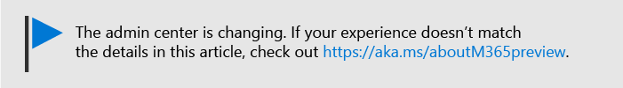

# De bescherming van bedreigingen vergroten

Met dit artikel u de bescherming in uw Microsoft 365-abonnement verhogen om u te beschermen tegen phishing, malware en andere bedreigingen. Deze aanbevelingen zijn geschikt voor organisaties met een verhoogde behoefte aan veiligheid, zoals politieke campagnes, advocatenkantoren en klinieken voor gezondheidszorg. 

Controleer voordat u begint de beveiligde score van Office 365. Office 365 Secure Score analyseert de beveiliging van uw Office 365-organisatie op basis van uw reguliere activiteiten en beveiligingsinstellingen en wijst een score toe. Begin met het noteren van uw huidige score. Het nemen van de acties aanbevolen in dit artikel verhoogt uw score. Het doel is niet om de maximale score te bereiken, maar om je bewust te zijn van mogelijkheden om je omgeving te beschermen die de productiviteit voor uw gebruikers niet negatief beïnvloeden. 

Zie [Microsoft Secure Score](https://docs.microsoft.com/office365/securitycompliance/microsoft-secure-score)voor meer informatie.

## Verhoog het niveau van bescherming tegen malware in e-mail

Uw Office 365- of Microsoft 365-omgeving bevat bescherming tegen malware, maar u deze bescherming verhogen door bijlagen met bestandstypen te blokkeren die vaak worden gebruikt voor malware. Om malwarebescherming in e-mail te verhogen:
  
1. Ga [https://protection.office.com](https://protection.office.com) naar en meld u aan met uw beheerdersaccountgegevens. 
    
2. Kies in het Office &amp; 365 Security Compliance Center in het linkernavigatiedeelvenster onder **Bedreigingsbeheer**de optie \> **Anti-Malware**beleid . **Policy**
    
3. Dubbelklik op het standaardbeleid om dit bedrijfsbrede beleid te bewerken.
    
4. Klik op **Instellingen**.
    
5. Selecteer Onder **Teksttype's ,** selecteer **Aan**. De bestandstypen die worden geblokkeerd, worden weergegeven in het venster direct onder dit besturingselement.  Zorg ervoor dat u deze bestandstypen toevoegt:
   - ade, adp, ani, bas, vleermuis, chm, cmd, com, cpl, crt, hlp, ht, hta, inf, ins, isp, job, js, jse, lnk, mda, mdb, mde, mdz, msc, msi, msp, mst, pcd, reg, scr, sct, shs, url, vb, vbe, vbs, wsc, wsf, wsh, exe, pif    Indien nodig u bestandstypen later toevoegen of verwijderen.
    
6. Klik op **Opslaan.**
    
Zie [Anti-malwarebescherming voor](https://go.microsoft.com/fwlink/?linkid=2015692&amp;clcid=0x409)meer informatie.
  

## Beschermen tegen ransomware

Ransomware beperkt de toegang tot gegevens door het versleutelen van bestanden of het vergrendelen van computerschermen. Het probeert vervolgens om geld af te persen van slachtoffers door te vragen om "losgeld", meestal in de vorm van cryptocurrencies zoals Bitcoin, in ruil voor toegang tot gegevens. 
  
U beschermen tegen ransomware door het creëren van een of meer mail flow regels om bestandsextensies die vaak worden gebruikt voor ransomware te blokkeren (deze werden toegevoegd in de [verhoging van het niveau van bescherming tegen malware in e-mail](#raise-the-level-of-protection-against-malware-in-mail) stap), of om gebruikers die deze bijlagen ontvangen in e-mail te waarschuwen.

Naast de bestanden die u in de vorige stap hebt geblokkeerd, is het ook een goede gewoonte om een regel te maken om gebruikers te waarschuwen voordat office-bestandsbijlagen worden geopend die macro's bevatten. Ransomware kan worden verborgen in macro's, dus waarschuw gebruikers om deze bestanden niet te openen van mensen die ze niet kennen.

Ga als u een regel voor e-mailtransport maken:
  
1. Ga naar het <a href="https://go.microsoft.com/fwlink/p/?linkid=837890" target="_blank">https://admin.microsoft.com</a> beheercentrum bij en kies **Admin centers** \> **Exchange**.
    
2. Klik in de categorie **e-mailstroom** op **regels**.
    
3. Klik **+** op en klik vervolgens op **Een nieuwe regel maken**.
    
4. Klik op **Meer opties** onder aan het dialoogvenster om de volledige set opties te bekijken. 
    
5. Pas de instellingen in de volgende tabel toe voor de regel. Laat de rest van de instellingen standaard staan, tenzij u ze wilt wijzigen.
    
6. Klik op **Opslaan**.
    
|**Instelling**|**Gebruikers waarschuwen voordat bijlagen van Office-bestanden worden geopend**||
|:-----|:-----|:-----|
|Name    |Anti-ransomware regel: waarschuw gebruikers     |
|Pas deze regel toe als . . .    |Elke bijlage. . . bestandsextensie komt overeen . . .    |
|Woorden of zinnen opgeven    |Voeg deze bestandstypen toe:    dotm, docm, xlsm, sltm, xla, xlam, xll, pptm, potm, ppam, ppsm, sldm   |
|Ga als volgt te werk. . .    |De ontvanger op de hoogte stellen met een bericht    |
|Berichttekst verstrekken    |Open dit soort bestanden niet van mensen die u niet kent, omdat ze macro's met kwaadaardige code kunnen bevatten.    |
   
Zie voor meer informatie:
  
- [Hoe om te gaan met ransomware](https://go.microsoft.com/fwlink/?linkid=2016501&amp;clcid=0x409)
    
- [Uw OneDrive herstellen](https://support.office.com/article/fa231298-759d-41cf-bcd0-25ac53eb8a15.aspx)
    

## Automatisch doorsturen voor e-mail stoppen

Hackers die toegang krijgen tot het postvak van een gebruiker kunnen uw e-mail stelen door het postvak in te stellen om e-mail automatisch door te sturen. Dit kan zelfs gebeuren zonder het bewustzijn van de gebruiker. U dit voorkomen door een e-mailstroomregel te configureren. 
  
Als u een regel voor e-mailtransport wilt maken, bekijkt u [deze korte video](https://support.office.com/article/f9d693ba-5c78-47c0-b156-8e461e062aa7) of volgt u de volgende stappen:
  
1. Klik in het Microsoft 365-beheercentrum op **Beheerderscentra** \> **Exchange**.
    
2. Klik in de categorie **e-mailstroom** op **regels**.
    
3. Klik **+** op en klik vervolgens op **Een nieuwe regel maken**.
    
4. Klik op **Meer opties** onder aan het dialoogvenster om de volledige set opties te bekijken. 
    
5. Pas de instellingen toe in de volgende tabel. Laat de rest van de instellingen standaard staan, tenzij u ze wilt wijzigen.
    
6. Klik op **Opslaan**.
    
|**Instelling**|**Gebruikers waarschuwen voordat bijlagen van Office-bestanden worden geopend**|
|:-----|:-----|
|Name    |Automatische doorzending van e-mail naar externe domeinen voorkomen    |
|Pas deze regel toe als ...    |De afzender. . . is extern/intern . . . Binnen de organisatie    |
|Voorwaarde toevoegen    |De eigenschappen van het bericht . . . het berichttype opnemen . . . Automatisch doorsturen    |
|Doe het volgende ...    |Het bericht blokkeren. . . het bericht afwijzen en een uitleg bevatten.    |
|Berichttekst verstrekken    |E-mail automatisch doorsturen buiten deze organisatie wordt om veiligheidsredenen voorkomen.    |

## Bescherm uw e-mail tegen phishing-aanvallen

Als u een of meer aangepaste domeinen hebt geconfigureerd voor uw Office 365- of Microsoft 365-omgeving, u gerichte anti-phishingbescherming configureren. ATP-anti-phishingbescherming, onderdeel van Office 365 Advanced Threat Protection, kan uw organisatie helpen beschermen tegen kwaadaardige phishingaanvallen op basis van imitatie en andere phishing-aanvallen. Als u een aangepast domein niet hebt geconfigureerd, hoeft u dit niet te doen.
  
We raden u aan aan de slag te gaan met deze bescherming door een beleid te maken om uw belangrijkste gebruikers en uw aangepaste domein te beschermen. 

Als u een ATP-antiphishingbeleid wilt maken, bekijkt u [deze korte trainingsvideo](https://support.office.com/article/86c425e1-1686-430a-9151-f7176cce4f2c)of voert u de volgende stappen uit:
  
1. Ga naar [https://protection.office.com](https://protection.office.com). 
    
2. Kies Beleid in het &amp; Office 365 Security Compliance Center in **Policy**het linkernavigatiedeelvenster onder **Bedreigingsbeheer.**
    
3. Kies op de pagina **Beleid** de optie **ATP anti-phishing**.
    
4. Selecteer **+ Maken**op de antiphishingpagina op de **antiphishingpagina.** Een wizard start die u door het definiëren van uw anti-phishing beleid.
    
5. Geef de naam, beschrijving en instellingen voor uw beleid op zoals aanbevolen in de onderstaande grafiek. Zie [Meer informatie over de opties voor het antiphishingbeleid](https://docs.microsoft.com/microsoft-365/security/office-365-security/set-up-anti-phishing-policies)van ATP . 
    
6. Nadat u uw instellingen hebt beoordeeld, kiest u **Dit beleid maken** of **Opslaan,** waar nodig.
    

|**Instelling of optie** |**Aanbevolen instelling**  |
|:-----|:-----|
|Name    |Domein en meest waardevolle campagnemedewerkers    |
|Beschrijving    |Zorg ervoor dat de belangrijkste medewerkers en ons domein niet worden nagebootst.    |
|Gebruikers toevoegen om te beschermen    |Selecteer **+ Voeg een voorwaarde toe, de ontvanger is**. Typ gebruikersnamen of voer het e-mailadres in van de kandidaat, campagnemanager en andere belangrijke medewerkers. U maximaal 20 interne en externe adressen toevoegen die u wilt beschermen tegen imitatie.    |
|Domeinen toevoegen om te beschermen    |Selecteer **+ Een voorwaarde toevoegen, het domein van de geadresseerde is**. Voer het aangepaste domein in dat is gekoppeld aan uw Microsoft 365-abonnement als u er een hebt gedefinieerd. U meer dan één domein invoeren.    |
|Acties kiezen    |Als e-mail wordt verzonden door een gebruiker die zich voordoet: kies **Bericht omleiden naar een ander e-mailadres**en typ vervolgens het e-mailadres van de beveiligingsbeheerder. Bijvoorbeeld *Alice @contoso.com*.          Als e-mail wordt verzonden door een geïmiteerd domein: **Quarantainebericht**kiezen .    |
|Postvakintelligentie    |Standaard wordt postvakinformatie geselecteerd wanneer u een nieuw antiphishingbeleid maakt. Laat deze instelling **aan** voor de beste resultaten.    |
|Vertrouwde afzenders en domeinen toevoegen    |Hier u uw eigen domein of andere vertrouwde domeinen toevoegen.    |
|Toegepast op    |Selecteer **Het geadresseerde domein is**. Selecteer onder **een van deze**opties **Kiezen**. Selecteren **+ Toevoegen**. Schakel het selectievakje in naast de naam van het domein, bijvoorbeeld *contoso. com,* in de lijst, en selecteer vervolgens **Toevoegen**. Selecteer **Gereed**.    |
   
Zie [Office 365 ATP-antiphishingbeleid instellen](https://docs.microsoft.com/microsoft-365/security/office-365-security/set-up-anti-phishing-policies)voor meer informatie.
  
## Beschermen tegen schadelijke bijlagen, bestanden en koppelingen met Advanced Threat Protection (ATP)

Controleer eerst, in het beheercentrum op <a href="https://go.microsoft.com/fwlink/p/?linkid=837890" target="_blank">https://admin.microsoft.com</a> dat u de nieuwe preview van het beheercentrum hebt ingeschakeld. Schakel de schakelaar in naast de tekst **Het nieuwe beheercentrum**.

   

Als u de pagina **Setup** met kaarten in uw tenant nog niet ziet, raadpleegt u hoe u deze stappen uitvoeren in Office 365 Security &amp; Compliance Center. Zie [Veilige ATP-bijlagen instellen in het Security & Compliance Center](#set-up-atp-safe-attachments-in-the-security--compliance-center) en ATP Safe Links instellen in het Security & Compliance [Center](#set-up-atp-safe-links-in-the-security--compliance-center).

1.  Kies **Setup**in het linkernavigatienav.
2. Kies op de pagina **Setup** **weergave** op de **lijst Meer bescherming tegen geavanceerde bedreigingen.**  
     

3. Kies op de pagina **Bescherming tegen geavanceerde bedreigingen vergroten** de optie Aan de **slag**.
4. Schakel in het deelvenster dat wordt geopend de selectievakjes in naast **Koppelingen en bijlagen in e-mail**, Bestanden scannen in **SharePoint, OneDrive en Teams en**Koppelingen scannen in **Office-bureaublad- en Office Online-apps** onder **Items scannen op schadelijke inhoud**.

      - Onder **Links en bijlagen in e-mail**, Typ in Alle gebruikers of de specifieke gebruikers waarvan de e-mail u wilt scannen.

    
5. Kies **Beleid maken** om veilige ATP-bijlagen en atp-veilige koppelingen in te schakelen.

### ATP-veilige bijlagen instellen in het Security & Compliance Center

Mensen verzenden, ontvangen en delen regelmatig bijlagen, zoals documenten, presentaties, spreadsheets en meer. Het is niet altijd gemakkelijk om te zeggen of een bijlage veilig of kwaadaardig is door alleen maar te kijken naar een e-mailbericht. Office 365 Advanced Threat Protection bevat ATP Safe Attachment-beveiliging, maar deze beveiliging is niet standaard ingeschakeld. We raden u aan een nieuwe regel te maken om deze bescherming te gaan gebruiken. Deze beveiliging strekt zich uit tot bestanden in SharePoint, OneDrive en Microsoft Teams.
  
Als u een ATP-beleid voor veilige bijlagen wilt maken, bekijkt u [deze korte video](https://support.office.com/article/e7e68934-23dc-4b9c-b714-e82e27a8f8a5)of voert u de volgende stappen uit:
  
1. Ga [https://protection.office.com](https://protection.office.com) naar en meld je aan met je beheerdersaccount. 
    
2. Kies Beleid in het &amp; Office 365 Security Compliance Center in **Policy**het linkernavigatiedeelvenster onder **Bedreigingsbeheer.**
    
3. Kies op de pagina Beleid **de optie Veilige ATP-bijlagen**.
    
4. Pas deze beveiliging op de pagina Veilige bijlagen in grote lijnen toe door het selectievakje **ATP inschakelen voor SharePoint, OneDrive en Microsoft Teams** in te schakelen. 
    
5. Selecteer **+** om een nieuw beleid te maken. 
    
6. Pas de instellingen toe in de volgende tabel. 
    
7. Nadat u uw instellingen hebt bekeken, kiest u **Dit beleid maken** of **Opslaan,** waar nodig.
    

|**Instelling of optie**|**Aanbevolen instelling**  |
|:-----|:-----|
|Name    |Blokkeer huidige en toekomstige e-mails met gedetecteerde malware.    |
|Beschrijving    |Blokkeer huidige en toekomstige e-mails en bijlagen met gedetecteerde malware.    |
|Bijlagen van onbekende malware opslaan    |Selecteer **Blok - Blokkeer de huidige en toekomstige e-mails en bijlagen met gedetecteerde malware.**    |
|Bijlage omleiden bij detectie    |Omleiding inschakelen (selecteer dit vak) Voer het beheerdersaccount of een postvakinstelling in voor quarantaine.          Pas de bovenstaande selectie toe als malware scannen op bijlagen een tijd of fout optreedt (selecteer dit vak).    |
|Toegepast op    |Het ontvangende domein is . . . selecteer uw domein.    |
   
Zie [Office 365 ATP-antiphishingbeleid instellen](https://docs.microsoft.com/microsoft-365/security/office-365-security/set-up-anti-phishing-policies)voor meer informatie.
  
### ATP Safe Links instellen in het Security & Compliance Center

Hackers verbergen soms kwaadaardige websites in links in e-mail of andere bestanden. Office 365 ATP Safe Links (ATP Safe Links), onderdeel van Office 365 Advanced Threat Protection, kan uw organisatie helpen beschermen door tijd te bieden voor verificatie van webadressen (URL's) in e-mailberichten en Office-documenten. Bescherming wordt gedefinieerd door middel van ATP Safe Links beleid.
  
We raden u aan het volgende te doen:
  
- Wijzig het standaardbeleid om de beveiliging te verhogen.
    
- Voeg een nieuw beleid toe dat is gericht aan alle ontvangers in uw domein.
    
Als u ATP Safe Links wilt instellen, bekijkt u [deze korte trainingsvideo](https://support.office.com/article/61492713-53c2-47da-a6e7-fa97479e97fa)of voert u de volgende stappen uit:
  
1. Ga [https://protection.office.com](https://protection.office.com) naar en meld je aan met je beheerdersaccount. 
    
2. Kies Beleid in het &amp; Office 365 Security Compliance Center in **Policy**het linkernavigatiedeelvenster onder **Bedreigingsbeheer.**
    
3. Kies op de pagina Beleid de optie **ATP Safe Links**.
    
Ga als reactie op het standaardbeleid:
  
1. Selecteer op de pagina Veilige koppelingen onder **Beleid dat van toepassing is op de hele organisatie**het **standaardbeleid.** 
    
2. Selecteer onder **Instellingen die van toepassing zijn op inhoud behalve e-mail**de optie Office **365 ProPlus, Office voor iOS en Android**.
    
3. Klik op **Opslaan**. 
    
Ga als reactie op een nieuw beleid dat is gericht op alle ontvangers in uw domein:
  
1. Klik **+** op de pagina Veilige koppelingen onder **Beleid dat van toepassing is op de hele organisatie**om een nieuw beleid te maken. 
    
2. Pas de instellingen in de volgende tabel toe.
    
3. Klik op **Opslaan**. 

|**Instelling of optie**|**Aanbevolen instelling**  |
|:-----|:-----|
|Name    |Beleid voor veilige koppelingen voor alle ontvangers in het domein    |
|De actie selecteren voor onbekende mogelijk schadelijke URL's in berichten    |Selecteer **Aan - URL's worden herschreven en gecontroleerd aan de hand van een lijst met bekende schadelijke links wanneer de gebruiker op de link klikt.**    |
|Veilige bijlagen gebruiken om downloadbare inhoud te scannen    |Selecteer dit vak.    |
|Toegepast op    |Het ontvangende domein is . . . selecteer uw domein.    |
   
Zie veilige koppelingen naar [Office 365 ATP](https://go.microsoft.com/fwlink/?linkid=2016138&amp;clcid=0x409)voor meer informatie.
  
## Het uniform controlelogboek inschakelen

Nadat u de zoekopdracht voor het &amp; controlelogboek in het Security Compliance Center hebt ingeschakeld, u de beheerder en andere gebruikersactiviteit in het logboek behouden en zoeken. 

U moet de rol Controlelogboeken in Exchange Online toegewezen krijgen om het zoeken naar controlelogboeken in of uit te schakelen in uw Microsoft 365 Business-abonnement. Deze rol wordt standaard toegewezen aan de rolgroepen Compliance Management en Organisatiebeheer op de pagina Machtigingen in het Exchange-beheercentrum. Globale beheerders in Microsoft 365 zijn standaard lid van deze groep.

1. Als u de zoekopdracht van het controlelogboek <a href="https://go.microsoft.com/fwlink/p/?linkid=837890" target="_blank">https://admin.microsoft.com</a> wilt inschakelen, gaat u naar het beheercentrum bij en kiest u **Naleving** onder **beheercentra** in de linkernavigatie. 
2. Kies op de nalevingspagina van **Microsoft 365** **Meer bronnen**en **open** vervolgens op de **Office &amp; 365-beveiligingscentrumkaart.**

    
3. Kies op de pagina beveiliging en naleving **zoeken** en vervolgens **controleren d.m.v.**
1. Kies **controle inschakelen**boven aan de **zoekpagina van het logboek controleren.**

Nadat de functie is ingeschakeld, u zoeken naar bestanden, mappen en vele activiteiten. Zie voor meer informatie [het controlelogboek](https://docs.microsoft.com/office365/securitycompliance/search-the-audit-log-in-security-and-compliance)doorzoeken.

## Instellingen voor anoniem delen voor SharePoint- en OneDrive-bestanden en -mappen afstemmen

(standaard anonieme koppeling sexpireren wijzigen in 14 dagen, standaardtype delen wijzigen in 'Specifieke personen') Ga als nog maar naar de instellingen voor delen voor OneDrive en SharePoint:
1. Ga naar het <a href="https://go.microsoft.com/fwlink/p/?linkid=837890" target="_blank">https://admin.microsoft.com</a> beheercentrum bij en kies **SharePoint** onder **Beheercentra** in de linkernavigatie. 
2. Ga in het SharePoint-beheercentrum naar **Delen** **van beleid** \> .
3. Selecteer op de pagina **Delen** onder **Koppelingen bestanden en mappen**de optie Specifieke **personen**en selecteer onder Geavanceerde instellingen voor **koppelingen 'Iedereen'** **deze koppelingen moeten binnen deze vele dagen verlopen**en typ in 14 (of een ander aantal dagen waarop u de levensduur van de koppeling wilt beperken).

    

## Activiteitswaarschuwingen

U activiteitswaarschuwingen gebruiken om beheerders- en gebruikersactiviteiten bij te houden en malware- en gegevensverliespreventieincidenten in uw organisatie te detecteren. Uw abonnement bevat een set standaardbeleidsregels, maar u ook aangepaste beleidsregels maken. Zie [waarschuwingsbeleid](https://docs.microsoft.com/office365/securitycompliance/alert-policies)voor meer informatie . Als u bijvoorbeeld een belangrijk bestand opslaat in SharePoint dat u niet extern wilt delen door iemand, u een melding maken waarin u wordt gewaarschuwd als iemand het deelt.

In de volgende afbeelding ziet u het standaardbeleid dat is opgenomen bij Microsoft 365 Business.   
    

## Agendadelen uitschakelen of beheren

U voorkomen dat mensen in uw organisatie hun agenda's delen, of u ook beheren wat ze kunnen delen. U het delen bijvoorbeeld beperken tot alleen vrije/drukke tijden.

1. Ga naar het <a href="https://go.microsoft.com/fwlink/p/?linkid=837890" target="_blank">https://admin.microsoft.com</a> beheercentrum en kies **Instellingen** \> **services & invoegtoepassing .**
2. Kies op de pagina **Services & invoegtoepassing** **Agenda**en kies of mensen in uw organisatie hun agenda's kunnen delen met mensen buiten die Office 365 of Exchange hebben, of met iemand. 
    Als u het aandeel met iemand kiest, u besluiten om ook alleen gratis/drukke informatie te delen.

3. Kies **Wijzigingen** opslaan onder aan de pagina.

    In de volgende afbeelding ziet u dat het delen van agenda's niet is toegestaan.   
    

    De volgende afbeelding toont de instellingen wanneer het delen van agenda's is toegestaan met een e-maillink met alleen gratis/drukke informatie.

   

Als uw gebruikers hun agenda's mogen delen, [raadpleegt](https://support.office.com/article/7ecef8ae-139c-40d9-bae2-a23977ee58d5) u deze instructies voor het delen vanuit de webversie van Outlook.
