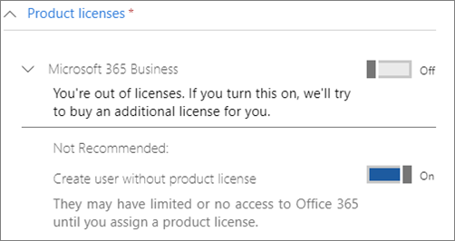

# Uw beheerdersaccounts beveiligenProtect your administrator accounts

Omdat admin accounts worden geleverd met verhoogde privileges, ze zijn waardevolle doelen voor hackers en cybercriminelen.Because admin accounts come with elevated privileges, they're valuable targets for hackers and cyber criminals. Dit artikel beschrijft:This article describes:

- Hoe stel je een extra beheerdersaccount in voor noodgevallen.How to set up an additional administrator account for emergencies.
- Hoe deze accounts te beschermen.How to protect these accounts.
 
Wanneer u zich aanmeldt voor Microsoft 365 en uw gegevens invoert, wordt u automatisch de globale beheerder. Een globale beheerder heeft de ultieme controle over gebruikersaccounts en alle andere instellingen in het Microsoft-beheercentrum, maar er zijn veel verschillende soorten beheerdersaccounts met verschillende mate van toegang.When you sign up for Microsoft 365 and enter your information, you automatically become the global admin. A global admin has the ultimate control of user accounts and all the other settings in the Microsoft admin center, but there are many different kinds of admin accounts with varying degrees of access. Zie [meer over beheerdersrollen](https://docs.microsoft.com/office365/admin/add-users/about-admin-roles) voor informatie over de verschillende toegangsniveaus voor elk soort beheerdersrol.See [about admin roles](https://docs.microsoft.com/office365/admin/add-users/about-admin-roles) for information about the different access levels for each kind of admin role.

## Extra beheerdersaccounts makenCreate additional admin accounts

Gebruik alleen beheerdersaccounts voor beheer.Use admin accounts only for administration. Beheerders moeten een apart gebruikersaccount hebben voor regelmatig gebruik van Office-apps en hun administratieve account alleen gebruiken wanneer dat nodig is om accounts en apparaten te beheren en tijdens het werken aan andere beheerdersfuncties.Admins should have a separate user account for regular use of Office apps and only use their administrative account when necessary to manage accounts and devices, and while working on other admin functions. Het is ook een goed idee om de Microsoft 365-licentie te verwijderen uit de admin-accounts, zodat u niet hoeft te betalen voor hen.It's also a good idea to remove the Microsoft 365 license from the admin accounts so you don't have to pay for them.

U wilt ten minste één extra globaal beheerdersaccount instellen om beheerders toegang te geven tot een andere vertrouwde werknemer.You'll want to set up at least one additional global admin account to give admin access to another trusted employee. U ook afzonderlijke beheerdersaccounts maken voor gebruikersbeheer (deze rol wordt **beheerder van gebruikersbeheer**genoemd).You can also create separate admin accounts for user management (this role is called **User management administrator**). Zie voor meer informatie [over beheerdersrollen](https://docs.microsoft.com/office365/admin/add-users/about-admin-roles).For more information, see [about admin roles](https://docs.microsoft.com/office365/admin/add-users/about-admin-roles).

Ga als volgt te werk om extra beheerdersaccounts te maken:To create additional admin accounts:

 1. Ga naar het <a href="https://go.microsoft.com/fwlink/p/?linkid=837890" target="_blank">beheercentrum</a> en kies **Users** \> **Gebruikers Actieve gebruikers** in het linkernavigatiesysteem.Go to the <a href="https://go.microsoft.com/fwlink/p/?linkid=837890" target="_blank">admin center</a> and then choose **Users** \> **Active users** in the left nav.

    

2. Selecteer op de pagina **Actieve gebruikers** de optie Een gebruiker boven aan de pagina **toevoegen** en voer in het deelvenster **Nieuwe gebruikers** de naam en andere informatie in.On the **Active users** page, select **Add a user** at the top of the page, and on the **New user** panel, enter the name and other information.
3. Vouw de sectie **Rollen** uit en kies **Globale beheerder** om deze gebruiker algemene beheerderstoegang te geven.Expand the **Roles** section, and choose **Global administrator** to give this user global admin access. U ook **aangepaste beheerder** kiezen en een van de rollen kiezen die worden weergegeven.You can also choose **Customized administrator** and choose any of the roles that are displayed.

    Voer een alternatieve e-mail in het tekstvak **Alternatief e-mailadres** in.Enter an alternate email in the **Alternative email address** text box. U dit adres gebruiken om uw wachtwoordgegevens te herstellen als u buitengesloten wordt. Voor globale beheerders wordt ook een factureringsverklaring naar dit adres verzonden.You can use this address to recover your password information if you get locked out. For global admins, a billing statement will also be sent to this address.

    
    
4. Verplaats in de sectie **Productlicenties** de kiezer voor **Microsoft 365 Business** naar **Uit** en de gebruiker maken **zonder productlicentie** naar **Aan**.In the **Product licenses** section, move the selector for **Microsoft 365 Business** to **Off** and the **Create user without product license** to **On**.

    

## Een noodbeheerderaccount makenCreate an emergency admin account

U moet ook een back-upaccount maken dat niet is ingesteld met multi-factor authenticatie (MFA), zodat u uzelf niet per ongeluk vergrendelt (bijvoorbeeld als u uw telefoon verliest die u als tweede vorm van verificatie gebruikt).You should also create a backup account that isn't set up with multi-factor authentication (MFA) so you don't accidentally lock yourself out (for example if you lose your phone that you're using as a second form of verification). Zorg ervoor dat het wachtwoord voor dit account een zin of ten minste 16 tekens lang is.Make sure that the password for this account is a phrase or at least 16 characters long. Dit wordt vaak aangeduid als een "break-glass account."This is often referred to as a "break-glass account."

## Zelf een gebruikersaccount makenCreate a user account for yourself

Gebruik uw gebruikersaccount om deel te nemen aan samenwerking met uw organisatie, inclusief het controleren van e-mail.Use your user account to participate in collaboration with your organization, including checking mail. Dit betekent dat uw beheerdersreferenties vergelijkbaar kunnen zijn met *Alice.Chavez  @Contoso.org* en dat uw gewone gebruikersaccount vergelijkbaar is met *Alice  @Contoso.com*.This means your admin credentials might be similar to  *Alice.Chavez@Contoso.org* and your regular user account might be similar to *Alice@Contoso.com*.

Ga als u een nieuw gebruikersaccount aanmaken:To create a new user account:
1. Ga naar het <a href="https://go.microsoft.com/fwlink/p/?linkid=837890" target="_blank">beheercentrum</a> en kies **Users** \> **Gebruikers Actieve gebruikers** in het linkernavigatiesysteem.Go to the <a href="https://go.microsoft.com/fwlink/p/?linkid=837890" target="_blank">admin center</a> and then choose **Users** \> **Active users** in the left nav.
2. Selecteer op de pagina **Actieve gebruikers** de optie Een gebruiker boven aan de pagina **toevoegen** en voer in het deelvenster **Nieuwe gebruikers** de naam en andere informatie in.On the **Active users** page, select **Add a user** at the top of the page, and on the **New user** panel, enter the name and other information.
3. Vouw de sectie **Rollen** uit en kies **Gebruiker (geen beheerderstoegang).**Expand the **Roles** section, and choose **User (no administrative access)**.
1. Verplaats in de sectie **Productlicenties** de kiezer voor **Microsoft 365 Business** naar **Aan**.In the **Product licenses** section, move the selector for **Microsoft 365 Business** to **On**. 

## Elk van deze accounts registreren voor meervoudige verificatieRegister each of these accounts for multi-factor authentication

## Aanvullende aanbevelingenAdditional recommendations

- Zorg ervoor dat beheerdersaccounts ook zijn ingesteld voor meervoudige verificatie.Be sure that admin accounts are also set up for multi-factor authentication. We laten je zien hoe je dit doen in [Het beleid voor voorwaardelijke toegang configureren.](m365-campaigns-conditional-access.md)We'll show you how to do this in [Configure conditional access policies](m365-campaigns-conditional-access.md).
- Voordat u beheerdersaccounts gebruikt, sluit u alle niet-gerelateerde browsersessies en -apps, inclusief persoonlijke e-mailaccounts.Before using admin accounts, close out all unrelated browser sessions and apps, including personal email accounts. U ook gebruiken in privé- of incognitobrowservensters.You can also use in private, or incognito browser windows.
- Nadat u beheerderstaken hebt voltooid, moet u zich afmelden bij de browsersessie.After completing admin tasks, be sure to sign out of the browser session.
