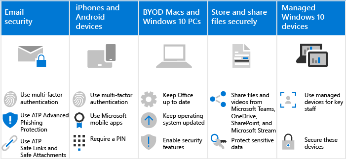

# Hoe Microsoft 365 voor campagnes uw gebruikers beïnvloedt

Microsoft 365 voor campagnes maakt het veel moeilijker voor hackers om toegang te krijgen tot uw omgeving. De afweging is dat uw gebruikers zich bewust moeten zijn van hoe te werken binnen deze veiligere omgeving. We begrijpen dat er wat extra geduld nodig is, maar het is de moeite waard om uw organisatie beschermd te houden.

## Veilige e-mailpraktijken gebruiken
Alle gebruikers moeten zich bewust zijn van en gebruik maken van deze e-mailpraktijken om hun e-mail veilig te houden:
- Stel e-mail in om meervoudige verificatie te gebruiken met de authenticator-app.
- Controleer legitieme e-mails en zoek naar veiligheidstips van ATP Advanced Phishing Protection.
- Open alleen veilige koppelingen en bijlagen, zoals geverifieerd door ATP Safe Links en ATP Safe Attachments.

Meer informatie over [phishing en andere aanvallen.](m365-campaigns-phishing-and-attacks.md) 

Download een [infographic](m365-campaigns-protect-campaign-infographic.md) met tips voor jou en de leden van je campagneteam.

## IPhones en Android-apparaten instellen
Alle gebruikers die u aan uw omgeving toevoegt, moeten een paar minuten de tijd nemen om [iPhones en Android-apparaten](../business/set-up-mobile-devices.md?toc=%2Fmicrosoft-365%2Fcampaigns%2Ftoc.json) in te stellen om veilig te werken:
- Stel apparaten in om meervoudige verificatie te gebruiken met de authenticator-app.
- Gebruik mobiele Apps van Microsoft, waaronder Outlook Mobile, Word, OneDrive en andere Microsoft-apps in de App Store. De native mail-apps die zijn opgenomen op iPhones en Android-apparaten worden niet ondersteund. 
- Gebruikers moeten een pincode gebruiken om hun apparaat te ontgrendelen.

Nadat deze zijn ingesteld, worden uw gebruikers gevraagd de authenticator-app te gebruiken wanneer ze toegang krijgen tot uw organisatiegegevens op deze apparaten, waaronder e-mail. 

## Houd BYOD Macs en Windows 10-pc's fris 
Het is ook belangrijk dat gebruikers hun primaire werkapparaat up-to-date houden:
- Installeer de nieuwste versies van Office-bureaubladapps en houd deze vers met updates, wanneer daarom wordt gevraagd. 
- Blijf op de hoogte van updates van het besturingssysteem, zoals Windows-updates.

Voor [onbeheerde Windows 10- en Mac-apparaten](m365-campaigns-protect-pcs-macs.md)hebben gebruikers de verantwoordelijkheid om ervoor te zorgen dat basisbeveiligingsfuncties zijn ingeschakeld.

**Basisbeveiligingsmogelijkheden inschakelen op BYOD Windows 10- en Mac-apparaten**

||||
|:-----|:-----|:------|
||**Windows 10**|**Mac**|
|Beveiligingsmogelijkheden|Bebeveiliging van BitLocker-apparaten inschakelen

 Ervoor zorgen dat Windows Defender blijft ingeschakeld 
Windows Firewall inschakelen| FileVault gebruiken om de Mac-schijf te versleutelen 

Gebruik een betrouwbare antivirussoftware 
Firewallbeveiliging inschakelen|

Zie Uw account en [apparaten beschermen tegen hackers en malware voor](https://support.office.com/article/Protect-your-account-and-devices-from-hackers-and-malware-066d6216-a56b-4f90-9af3-b3a1e9a327d6#ID0EAABAAA=Windows_10)meer informatie over deze aanbevelingen.

## Samenwerken met Microsoft Teams, OneDrive, SharePoint Online en andere hulpprogramma's
Uw gebruikers kunnen in de verleiding komen om uw organisatiebestanden te delen en op te slaan op andere plaatsen dan Microsoft 365. Microsoft 365 maakt het zo eenvoudig mogelijk om veilig samen te werken en te delen. U [bestanden en video's](share-files-and-videos.md) rechtstreeks vanuit Microsoft Teams, OneDrive, Stream en zelfs vanuit een bestand delen. Delen vanuit deze tools zorgt ervoor dat uw gegevens niet lekken. U extra beveiliging toevoegen aan gevoelige gegevens om te voorkomen dat ze buiten uw organisatie worden gedeeld. 

## Beheerde Windows 10-apparaten instellen
We raden uw belangrijkste medewerkers aan om vers aangeschafte Windows 10-apparaten te gebruiken die u beheert. We laten je zien hoe je [deze apparaten beheren en beveiligen.](../business/set-up-windows-devices.md?toc=/microsoft-365/campaigns/toc.json) Dit zorgt ervoor dat medewerkers die het hoogste doelwit zijn voor hackers de meeste bescherming krijgen. 
