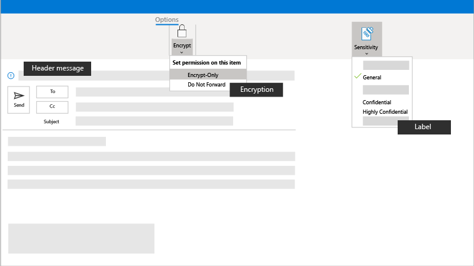

# Uw gevoelige e-mail versleutelen of labelen

Uw gegevens en campagne-informatie zijn belangrijk en vaak vertrouwelijk. Help deze gevoelige informatie te beschermen door versleutelings- en gevoeligheidslabels te gebruiken, zodat u en uw e-mailontvangers de informatie behandelen met de gevoeligheid die deze vereist.

## Aanbevolen procedures

Voordat u e-mail met vertrouwelijke of gevoelige informatie verzendt, u overwegen het nieuwe in te schakelen:

- **Versleuteling:** U uw e-mail versleutelen om de privacy van de informatie in de e-mail te beschermen. Wanneer u een e-mailbericht versleutelt, wordt het omgezet van leesbare platte tekst in gecodeerde cyphertekst. Alleen de ontvanger die de privésleutel heeft die overeenkomt met de openbare sleutel die wordt gebruikt om het bericht te versleutelen, kan het bericht ontcijferen om te lezen. Elke ontvanger zonder de bijbehorende privésleutel ziet echter onleesbare tekst. Uw beheerder kan regels definiëren om berichten die aan bepaalde criteria voldoen automatisch te versleutelen. Uw beheerder kan bijvoorbeeld een regel maken waarmee alle berichten die buiten uw organisatie worden verzonden of alle berichten met specifieke woorden of zinnen worden versleuteld. Versleutelingsregels worden automatisch toegepast.
- **Gevoeligheidslabels:** Uw campagne kan ook gevoeligheidslabels instellen die u toepassen op uw bestanden en e-mail om ze in overeenstemming te houden met het beleid voor informatiebescherming van uw campagne. Wanneer u een label instelt, blijft het label bij uw e-mail, zelfs wanneer deze wordt verzonden, bijvoorbeeld door te worden weergegeven als een koptekst voor uw bericht.

## Instellen

Als u een bericht wilt versleutelen dat niet voldoet aan een vooraf gedefinieerde regel of als uw beheerder geen regels heeft ingesteld, u verschillende versleutelingsregels toepassen voordat u het bericht verzendt. Als u een versleuteld bericht wilt verzenden vanuit Outlook 2013 of 2016 of Outlook 2016 voor Mac, selecteert u **Opties > machtigingen**en selecteert u vervolgens de gewenste beveiligingsoptie. U ook een versleuteld bericht verzenden door de knop Beveiligen in de webversie **van** Outlook te selecteren. Zie [Versleutelde berichten verzenden, weergeven en beantwoorden in Outlook voor pc voor](https://support.microsoft.com/en-us/office/send-view-and-reply-to-encrypted-messages-in-outlook-for-pc-eaa43495-9bbb-4fca-922a-df90dee51980)meer informatie.

## Beheerinstellingen

U alles te weten komen over het instellen van e-mailversleuteling bij [e-mailversleuteling in Office 365.](https://docs.microsoft.com/microsoft-365/compliance/email-encryption)

### E-mailberichten automatisch versleutelen

Beheerders kunnen regels voor e-mailstromen maken om e-mailberichten die vanuit uw campagne worden verzonden en ontvangen, automatisch te beschermen. Stel regels in om uitgaande e-mailberichten te versleutelen en versleuteling te verwijderen uit versleutelde berichten die afkomstig zijn van uw organisatie of uit antwoorden op versleutelde berichten die vanuit uw organisatie worden verzonden. 

U maakt regels voor e-mailstromen om e-mailberichten te versleutelen met de nieuwe OME-mogelijkheden (Office 365 Message Encryption). Definieer e-mailstroomregels voor het activeren van berichtversleuteling met de nieuwe OME-mogelijkheden met behulp van het Exchange Admin Center (EAC). 

1. Meld u in een webbrowser aan met een werk- of schoolaccount waaraan algemene beheerdersmachtigingen zijn verleend, en meld u aan bij Office 365. 
2. Kies de tegel Beheerder. 
3. Kies in het beheercentrum **Beheercentra > Exchange**. 

Zie [Regels voor e-mailstroom definiëren om e-mailberichten in Office 365 te versleutelen](https://docs.microsoft.com/microsoft-365/compliance/define-mail-flow-rules-to-encrypt-email)voor meer informatie.

### Merk uw versleutelingsberichten

U ook uw campagnebranding toepassen om het uiterlijk en de tekst in de e-mailberichten aan te passen. Zie [Het merk van uw organisatie toevoegen aan uw versleutelde berichten voor](https://docs.microsoft.com/microsoft-365/compliance/email-encryption)meer informatie.

