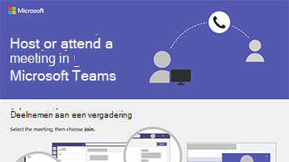

# Vergaderingen instellenSet up meetings

Vergaderingen in Microsoft Teams zijn audio, video en delen.Meetings in Microsoft Teams include audio, video, and sharing. En omdat ze online zijn, hebt u altijd een vergaderruimte (zonder dat u een ruimte of projector nodig hebt!), zelfs als uw personeel geografisch is verdeeld of op afstand werkt.And because they're online, you'll always have a meeting space (without needing a room or projector!), even if your staff is geographically distributed or working remotely. Microsoft Teams vergaderingen zijn een geweldige manier om samen te komen met uw medewerkers, zowel binnen als buiten uw organisatie.Microsoft Teams meetings are a great way to come together with your staff both inside and outside of your organization. U hoeft geen lid van uw organisatie te zijn of zelfs geen account te hebben om deel te nemen aan een vergadering.You don’t need to be a member of your organization or even have an account to join a meeting. U kunt onlinevergaderingen plannen en uitvoeren met Microsoft Teams.You can schedule and run online meetings using Microsoft Teams. Tijdens een vergadering kunt u uw scherm delen, bestanden delen, taken toewijzen en meer.During a meeting, you can share your screen, share files, assign tasks, and more. Politieke campagnes kunnen personeel, vrijwilligers en gasten buiten uw organisatie omvatten in de vergadering.Political campaigns can include staff, volunteers, and guests outside your organization in the meeting. Kleine bedrijven of praktijken kunnen vergaderen met hun personeel of met klanten of partners Microsoft Teams.Small firms or practices can meet with their staff, or meet with clients or partners over Microsoft Teams.

Download een infographic in [PDF](https://go.microsoft.com/fwlink/?linkid=2078712) of [PowerPoint](https://go.microsoft.com/fwlink/?linkid=2079515) om snel een overzicht te krijgen van hoe u deel kunt nemen aan een onlinevergadering met Microsoft Teams.Download an infographic in [PDF](https://go.microsoft.com/fwlink/?linkid=2078712) or [PowerPoint](https://go.microsoft.com/fwlink/?linkid=2079515) to get a quick overview of how to join or host an online meeting with Microsoft Teams.

## Aanbevolen proceduresBest practices

Volg deze best practices voor uw onlinevergaderingen:Follow these best practices for your online meetings:

- Plan uw onlinevergaderingen direct in Microsoft Teams.Schedule your online meetings right in Microsoft Teams. U kunt een team en kanaal kiezen en Teams de deelnemers in dat team of kanaal automatisch uitnodigen.You can choose a team and channel, and Teams will invite the participants in that team or channel automatically.
- Hebt u een geïmproviseerde vergadering nodig?Need an impromptu meeting? Als u een een-op-een-chat  hebt, kiest u Nu vergaderen om een video- of audiogesprek te starten met de persoon met wie u aan het chatten bent.If you're in a one-on-one chat, choose **Meet now** to start a video or audio call with the person you're chatting with.

## Een vergadering plannenSchedule a meeting

> [!VIDEO https://www.microsoft.com/videoplayer/embed/RE1FOhP]

## Deelnemen aan een vergaderingJoin a meeting

> [!VIDEO https://www.microsoft.com/videoplayer/embed/RE1FYWn]

Meer informatie over vergaderen in Microsoft Teams:Learn more about meeting in Microsoft Teams:

> [!VIDEO https://www.microsoft.com/videoplayer/embed/RWeokQ]
