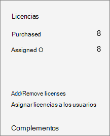
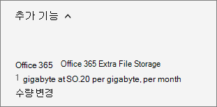

# Opslagruimte voor uw abonnement toevoegenAdd storage space for your subscription

Als de opslagruimte voor uw SharePoint Online-siteverzamelingen begint vol te raken, kunt u opslagruimte aan uw abonnement toevoegen als uw abonnement daarvoor in aanmerking komt. If you start to run out of storage for your SharePoint Online site collections, you can add storage to your subscription if your plan is eligible. Als u de **Extra bestandsopslag van Office 365** niet ziet in de lijst met beschikbare invoegtoepassingen, betekent dit dat uw abonnement niet in aanmerking komt.If you don't see the **Office 365 Extra File Storage** in the list of available add-ons, it means your plan is not eligible. Zie Komt mijn abonnement in aanmerking voor meer [informatie?](#is-my-plan-eligible-for-office-365-extra-file-storage)For more information, see [Is my plan eligible?](#is-my-plan-eligible-for-office-365-extra-file-storage)

## Beschikbare opslagruimte weergevenView available storage

::: moniker range="o365-worldwide"

1. Ga naar de [pagina Actieve sites van het nieuwe SharePoint-beheercentrum](https://admin.microsoft.com/sharepoint?page=siteManagement&modern=true)en meld u aan met een account met [beheerdersmachtigingen](https://docs.microsoft.com/sharepoint/sharepoint-admin-role) voor uw organisatie.Go to the [Active sites page of the new SharePoint admin center](https://admin.microsoft.com/sharepoint?page=siteManagement&modern=true), and sign in with an account that has [admin permissions](https://docs.microsoft.com/sharepoint/sharepoint-admin-role) for your organization.

2. Zie rechtsboven op de pagina de hoeveelheid opslagruimte die op alle sites wordt gebruikt en de totale opslagruimte voor uw abonnement.In the upper right of the page, see the amount of storage used across all sites, and the total storage for your subscription. (Als uw organisatie Multi-Geo heeft geconfigureerd in Office 365, wordt op de balk ook de hoeveelheid opslagruimte weergegeven die op alle geolocaties wordt gebruikt.)(If your organization has configured Multi-Geo in Office 365, the bar also shows the amount of storage used across all geo locations.) 

::: moniker-end

::: moniker range="o365-germany"

1. Meld u https://portal.office.de aan als globale of SharePoint-beheerder en selecteer vervolgens de tegel Beheerder om het beheercentrum te openen.Sign in to https://portal.office.de as a global or SharePoint admin, and then select the Admin tile to open the admin center. (Als u een bericht ziet dat u geen toestemming hebt om toegang te krijgen tot de pagina, hebt u geen microsoft 365-beheerdersmachtigingen in uw organisatie.)(If you see a message that you don't have permission to access the page, you don't have Microsoft 365 administrator permissions in your organization.)

2. Selecteer **SharePoint**in het linkerdeelvenster onder **Beheercentra**.In the left pane, under **Admin centers**, select **SharePoint**. Als het klassieke SharePoint-beheercentrum wordt weergegeven, selecteert u **Nu** openen boven aan de pagina om het nieuwe SharePoint-beheercentrum te openen.If the classic SharePoint admin center appears, select **Open it now** at the top of the page to open the new SharePoint admin center.

3. Selecteer **Actieve sites**in het linkerdeelvenster van het nieuwe SharePoint-beheercentrum .In the left pane of the new SharePoint admin center, select **Active sites**.

4. Zie rechtsboven op de pagina de hoeveelheid opslagruimte die op alle sites wordt gebruikt en de totale opslagruimte voor uw abonnement.In the upper right of the page, see the amount of storage used across all sites, and the total storage for your subscription.

::: moniker-end

::: moniker range="o365-21vianet"

1. Meld u https://login.partner.microsoftonline.cn/ aan als globale of SharePoint-beheerder en selecteer vervolgens de tegel Beheerder om het beheercentrum te openen.Sign in to https://login.partner.microsoftonline.cn/ as a global or SharePoint admin, and then select the Admin tile to open the admin center. (Als u een bericht ziet dat u geen toestemming hebt om toegang te krijgen tot de pagina, hebt u geen microsoft 365-beheerdersmachtigingen in uw organisatie.)(If you see a message that you don't have permission to access the page, you don't have Microsoft 365 administrator permissions in your organization.)

2. Selecteer **SharePoint**in het linkerdeelvenster onder **Beheercentra**.In the left pane, under **Admin centers**, select **SharePoint**. Als het klassieke SharePoint-beheercentrum wordt weergegeven, selecteert u **Nu** openen boven aan de pagina om het nieuwe SharePoint-beheercentrum te openen.If the classic SharePoint admin center appears, select **Open it now** at the top of the page to open the new SharePoint admin center.

3. Selecteer **Actieve sites**in het linkerdeelvenster van het nieuwe SharePoint-beheercentrum .In the left pane of the new SharePoint admin center, select **Active sites**.

4. Zie rechtsboven op de pagina de hoeveelheid opslagruimte die op alle sites wordt gebruikt en de totale opslagruimte voor uw abonnement.In the upper right of the page, see the amount of storage used across all sites, and the total storage for your subscription.  

::: moniker-end

> [!NOTE]
> De gebruikte opslag bevat geen wijzigingen die in de afgelopen 24-48 uur zijn aangebracht.The storage used doesn't include changes made within the last 24-48 hours.

Nadat u hebt vastgesteld hoeveel opslagruimte u gebruikt, kunt u opslagruimte voor uw abonnement toevoegen of verwijderen. Volg de stappen in dit artikel als u wilt weten wat het kost om opslagruimte toe te voegen, en bekijk de prijsinformatie voordat u iets koopt.After you've determined how much storage you're using, you can add or remove storage space for your subscription. To find out how much it will cost to add storage space, follow the steps in this article, and review the pricing information before you purchase.
  
Zie [Opslaglimieten voor siteverzamelingen beheren](https://docs.microsoft.com/sharepoint/manage-site-collection-storage-limits) voor informatie over het instellen van opslaglimieten voor siteverzamelingen.For information about setting site collection storage limits, see [Manage site collection storage limits](https://docs.microsoft.com/sharepoint/manage-site-collection-storage-limits).
  
## Opslag toevoegen aan uw abonnementAdd storage to your subscription

Als u nog geen extra opslagruimte voor uw abonnement hebt gekocht, u dat doen.If you haven't yet purchased extra storage for your subscription, you can do that.

::: moniker range="o365-worldwide"

1. Ga in het beheercentrum naar de pagina Services <a href="https://go.microsoft.com/fwlink/p/?linkid=868433" target="_blank">voor factureringsaankopen.</a> **Billing** \>In the admin center, go to the **Billing** \> <a href="https://go.microsoft.com/fwlink/p/?linkid=868433" target="_blank">Purchase services</a> page.

2. Selecteer Onder aan de pagina **Inkoopservices** de optie **Invoegtoepassingen**.At the bottom of the **Purchase services** page, select **Add-ons**.

3. Selecteer **Extra bestandsopslag van Office 365**.Select **Office 365 Extra File Storage**.

4. Kies op de pagina Extra bestandsopslag van **Office 365,** als deze wordt weergegeven, het basisabonnement en voer vervolgens het aantal gigabytes opslagruimte in dat u wilt toevoegen.On the **Office 365 Extra File Storage** page, if shown, choose the base subscription, then enter the number of gigabytes of storage you want to add.

5. Selecteer **Uitchecken nu**.Select **Check out now**.

6. Controleer op de pagina **Hoe ziet deze er?** **Next**On the **How does this look?** page, verify the number of gigabytes of storage you selected, review the pricing information, and then select **Next**.

7. Controleer op de pagina **Bestelling voltooien** het totaal.On the **Complete order** page, verify the total. Als u wijzigingen wilt aanbrengen, selecteert u **Volgorde bewerken**.If you need to make any changes, select **Edit order**. Als de bestelling een kredietcontrole vereist, schakelt u het selectievakje in.If the order requires a credit check, select the check box. Wanneer u klaar bent, selecteert u **Plaatsorder** \> **Ga naar Beheerstartpagina**.When you're finished, select **Place order** \> **Go to Admin Home**.

::: moniker-end

::: moniker range="o365-germany"

1. Ga in het beheercentrum naar de pagina \> <a href="https://go.microsoft.com/fwlink/p/?linkid=847745" target="_blank">Factureringsabonnementen.</a> **Billing**  In the admin center, go to the **Billing** \>  <a href="https://go.microsoft.com/fwlink/p/?linkid=847745" target="_blank">Subscriptions</a> page.

2. Kies **op** de pagina Abonnementen het abonnement waaraan u opslagruimte wilt toevoegen en selecteer **vervolgens Invoegtoepassingen**.On the **Subscriptions** page, choose the subscription to which  you want to add storage space, then select **Add-ons**.

    
  
    > [!NOTE]
    > Als u **Add-ons**niet ziet en uw abonnement is gekocht via een partner, selecteert u **Volume Licensing Service Center (VLSC).**If you don't see **Add-ons**, and your subscription was purchased through a partner, select **Volume Licensing Service Center (VLSC)**.
  
3. Selecteer **Invoegtoepassingen kopen**.Select **Buy add-ons**.

    
  
4. Klik op de pagina **Services kopen** met de muis over of tik op **Extra bestandsopslag van Office 365**en selecteer **Nu kopen**.On the **Purchase services** page, mouse over or tap **Office 365 Extra File Storage**, then select **Buy now**.
  
5. Voer het aantal gebruikerslicenties in dat u nodig hebt en kies, indien aangegeven, een basisabonnement.Enter the number of user licenses that you need and, if shown, choose a base subscription. Selecteer **Uitchecken nu**.Select **Check out now**.
  
6. Controleer op de pagina **Hoe ziet deze er?** **Next**On the **How does this look?** page, verify the number of gigabytes of storage you selected, review the pricing information, and then select **Next**.

7. Selecteer op de pagina **Bestelling voltooien** de optie **Volgorde plaatsen**.On the **Complete order** page, select **Place order**.

::: moniker-end

::: moniker range="o365-21vianet"

1. Ga in het beheercentrum naar de pagina **Facturering**\><a href="https://go.microsoft.com/fwlink/p/?linkid=850626" target="_blank">Abonnementen</a>.In the admin center, go to the **Billing** \> <a href="https://go.microsoft.com/fwlink/p/?linkid=850626" target="_blank">Subscriptions</a> page.

2. Kies **op** de pagina Abonnementen het abonnement waaraan u opslagruimte wilt toevoegen en selecteer **vervolgens Invoegtoepassingen**.On the **Subscriptions** page, choose the subscription to which  you want to add storage space, then select **Add-ons**.

    
  
    > [!NOTE]
    > Als u **Add-ons**niet ziet en uw abonnement is gekocht via een partner, selecteert u **Volume Licensing Service Center (VLSC).**If you don't see **Add-ons**, and your subscription was purchased through a partner, select **Volume Licensing Service Center (VLSC)**.
  
3. Selecteer **Invoegtoepassingen kopen**.Select **Buy add-ons**.

    
  
4. Klik op de pagina **Services kopen** met de muis over of tik op **Extra bestandsopslag van Office 365**en selecteer **Nu kopen**.On the **Purchase services** page, mouse over or tap **Office 365 Extra File Storage**, then select **Buy now**.
  
5. Voer het aantal gebruikerslicenties in dat u nodig hebt en kies, indien aangegeven, een basisabonnement.Enter the number of user licenses that you need and, if shown, choose a base subscription. Selecteer **Uitchecken nu**.Select **Check out now**.
  
6. Controleer op de pagina **Hoe ziet deze er?** **Next**On the **How does this look?** page, verify the number of gigabytes of storage you selected, review the pricing information, and then select **Next**.

7. Selecteer op de pagina **Bestelling voltooien** de optie **Volgorde plaatsen**.On the **Complete order** page, select **Place order**.

::: moniker-end

## Opslagruimte vergroten of verkleinenIncrease or decrease storage

Als u al extra bestandsopslag hebt aangeschaft via de add-on **Extra bestandsopslag van Office 365 Extra Bestandsopslag,** u deze stappen gebruiken om de extra opslagruimte voor uw abonnement te vergroten of te verkleinen.If you have already purchased extra file storage via the **Office 365 Extra File Storage** add-on, you can use these steps to increase or decrease the extra storage space for your subscription. U de opslag terugbrengen tot 1 gigabyte.You can reduce the storage to as low as 1 gigabyte. Als u alle extra opslagruimte wilt verwijderen, neemt u [contact op met ondersteuning](../admin/contact-support-for-business-products.md).To remove all of the extra storage space, you need to [contact support](../admin/contact-support-for-business-products.md).

::: moniker range="o365-worldwide"

1. Ga in het beheercentrum naar de pagina **Facturering** \> <a href="https://go.microsoft.com/fwlink/p/?linkid=842054" target="_blank">uw producten.</a>In the admin center, go to the **Billing** \> <a href="https://go.microsoft.com/fwlink/p/?linkid=842054" target="_blank">Your products</a> page.

2. Kies het abonnement dat de add-on Voor extra bestandsopslag van **Office 365 Extra bestandsopslag** bevat.Choose the subscription that contains the **Office 365 Extra File Storage** add-on.

3. Selecteer **Invoegtoepassingen**en kies **Hoeveelheid wijzigen**.Select **Add-ons**, then choose **Change quantity**.

4. Voer in het deelvenster **Gigabytes toevoegen/verwijderen** de gewenste gigabytes voor het abonnement in en selecteer **Wijzigen verzenden**.In the **Add/Remove gigabytes** pane, enter the total gigabytes you want for the subscription, then select **Submit change**.

::: moniker-end

::: moniker range="o365-germany"

1. Ga in het beheercentrum naar de pagina **Facturering**\><a href="https://go.microsoft.com/fwlink/p/?linkid=847745" target="_blank">Abonnementen</a>.In the admin center, go to the **Billing** \> <a href="https://go.microsoft.com/fwlink/p/?linkid=847745" target="_blank">Subscriptions</a> page.

2. Selecteer **op** de pagina Abonnementen de optie **Invoegtoepassingen**.On the **Subscriptions** page, select **Add-ons**.

    
  
    > [!NOTE]
    > Als u **Add-ons**niet ziet en uw abonnement is gekocht via een partner, selecteert u **Volume Licensing Service Center (VLSC).**If you don't see **Add-ons**, and your subscription was purchased through a partner, select **Volume Licensing Service Center (VLSC)**.
  
3. Selecteer onder **Office 365 Extra bestandsopslag**de optie **Hoeveelheid wijzigen**.Under **Office 365 Extra File Storage**, select **Change quantity**.

    
  
4. Voer in het rechterdeelvenster het totale aantal gigabytes in dat u nodig hebt en selecteer **Verzenden**.In the right pane, enter the total number of gigabytes that you need, then select **Submit**.

    Als u bijvoorbeeld momenteel 200 GB extra opslagruimte hebt, maar slechts 100 gigabyte nodig hebt, typt u **100** in het vak.For example, if you currently have 200 gigabytes of extra file storage but you only need 100 gigabytes, then you would enter **100** in the box.

5. Selecteer **Sluiten**.Select **Close**.

::: moniker-end

::: moniker range="o365-21vianet"

1. Ga in het beheercentrum naar de pagina **Facturering**\><a href="https://go.microsoft.com/fwlink/p/?linkid=850626" target="_blank">Abonnementen</a>.In the admin center, go to the **Billing** \> <a href="https://go.microsoft.com/fwlink/p/?linkid=850626" target="_blank">Subscriptions</a> page.

2. Selecteer **op** de pagina Abonnementen de optie **Invoegtoepassingen**.On the **Subscriptions** page, select **Add-ons**.

    
  
    > [!NOTE]
    > Als u **Add-ons**niet ziet en uw abonnement is gekocht via een partner, selecteert u **Volume Licensing Service Center (VLSC).**If you don't see **Add-ons**, and your subscription was purchased through a partner, select **Volume Licensing Service Center (VLSC)**.
  
3. Selecteer onder **Office 365 Extra bestandsopslag**de optie **Hoeveelheid wijzigen**.Under **Office 365 Extra File Storage**, select **Change quantity**.

    
  
4. Voer in het rechterdeelvenster het totale aantal gigabytes in dat u nodig hebt en selecteer **Verzenden**.In the right pane, enter the total number of gigabytes that you need, then select **Submit**.

    Als u bijvoorbeeld momenteel 200 GB extra opslagruimte hebt, maar slechts 100 gigabyte nodig hebt, typt u **100** in het vak.For example, if you currently have 200 gigabytes of extra file storage but you only need 100 gigabytes, then you would enter **100** in the box.

5. Selecteer **Sluiten**.Select **Close**.

::: moniker-end

## Komt mijn abonnement in aanmerking voor Office 365 Extra Bestandsopslag?Is my plan eligible for Office 365 Extra File Storage?

Office 365 Extra Bestandsopslag is beschikbaar voor de volgende abonnementen:Office 365 Extra File Storage is available for the following subscriptions:
  
- Office 365 Enterprise E1Office 365 Enterprise E1

- Office 365 Enterprise E2Office 365 Enterprise E2

- Office 365 Enterprise E3Office 365 Enterprise E3

- Office 365 Enterprise E4Office 365 Enterprise E4

- Office 365 Enterprise E5Office 365 Enterprise E5

- Office voor het web met SharePoint-abonnement 1Office for the web with SharePoint Plan 1

- Office voor het web met SharePoint-abonnement 2Office for the web with SharePoint Plan 2

- SharePoint Online, abonnement 1SharePoint Online Plan 1

- SharePoint Online, abonnement 2SharePoint Online Plan 2

- Microsoft 365 Business BasicMicrosoft 365 Business Basic

- Microsoft 365 Business StandardMicrosoft 365 Business Standard

- Microsoft 365 Business PremiumMicrosoft 365 Business Premium

- Microsoft 365 E3Microsoft 365 E3

- Microsoft 365 E5Microsoft 365 E5

- Microsoft 365 F1Microsoft 365 F1

> [!NOTE]
> Office 365 Extra Bestandsopslag is ook beschikbaar voor GCC-, GCC High- en DOD-abonnementen.Office 365 Extra File Storage is also available for GCC, GCC High, and DOD plans.
