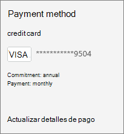
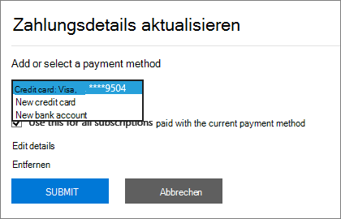
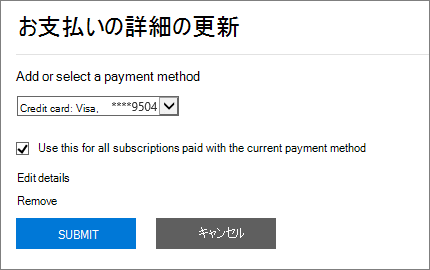

# Uw betalingsmethoden toevoegen, bijwerken of verwijderen

::: moniker range="o365-worldwide"
U producten en services bij Microsoft kopen met een creditcard of bankpas of bankrekening. U uw betalingsgegevens invoeren op de pagina **Betalingsmethoden** of wanneer u een aankoop doet.

U alleen betalingsmethoden beheren die u hebt toegevoegd.

> [!NOTE]
> De optie om te betalen met een bankrekening is niet beschikbaar in sommige landen of regio's.
>
> U moet een creditcard gebruiken die is uitgegeven uit hetzelfde land als uw huurder.

**Komt de interface die u ziet niet overeen met de interface die in dit artikel wordt beschreven?** Zie Zo ja, zie [Betalingsmethoden beheren](manage-payment-methods.md).

## Een betalingsmethode toevoegen

1. Ga in het beheercentrum naar de pagina <a href="https://go.microsoft.com/fwlink/p/?linkid=2018806" target="_blank">Betalingsmethoden</a> **voor facturen** > **& betalingen.** >
2. Selecteer **Betaalmethode toevoegen**.
3. Kies op de pagina **Betalingsmethoden** een betalingsmethode uit het vervolgkeuzemenu.
4. Voer de gegevens voor de nieuwe kaart of bankrekening in en selecteer **Toevoegen**.

## Een bestaande betalingsmethode bijwerken

U het nummer op een bestaande kaart of bankrekening niet wijzigen. Als de kaart of het bankrekeningnummer is gewijzigd, voegt u deze toe als een nieuwe betalingsmethode. Kies het vervolgens als de betalingsoptie voor uw abonnement en verwijder vervolgens de bestaande kaart of bankrekening. U moet een kaart gebruiken die is uitgegeven uit hetzelfde land als uw huurder.

1. Ga in het beheercentrum naar de pagina <a href="https://go.microsoft.com/fwlink/p/?linkid=2018806" target="_blank">Betalingsmethoden</a> **voor facturen** > **& betalingen.** >
2. Kies op de pagina **Betalingsmethoden** de kaart of bankrekening om bij te werken en selecteer **Bewerken**.
3. Werk uw betalingsmethodegegevens bij (naam op de kaart of bankrekening, factuuradres, telefoonnummer of vervaldatum) en selecteer **Opslaan**.

## Een betalingsmethode wijzigen

U de betalingsmethode wijzigen die wordt gebruikt om voor één abonnement te betalen. U ook alle abonnementen van de ene betalingsmethode naar de andere verplaatsen.

### De betalingsmethode wijzigen die voor één abonnement wordt gebruikt

1. Ga in het beheercentrum naar de pagina **Facturering** > <a href="https://go.microsoft.com/fwlink/p/?linkid=842054" target="_blank">Producten en services</a>.
2. Selecteer het abonnement waarvoor u wilt betalen met de nieuwe kaart of bankrekening. Selecteer **onder Facturering**naast de betalingsmethode de optie **Bewerken**.
3. Selecteer naast uw bestaande betalingsmethode **wijzigen**.
4. Selecteer in de vervolgkeuzelijst een alternatieve betalingsmethode of kies ervoor om een betalingsmethode toe te voegen.
5. Als u een betalingsmethode toevoegt, voert u de kaart- of accountgegevens in en selecteert u **Opslaan**.
6. Controleer of de geselecteerde betalingsmethode juist is en selecteer **Opslaan**.

### De betalingsmethode wijzigen die voor meerdere abonnementen wordt gebruikt

1. Ga in het beheercentrum naar de pagina <a href="https://go.microsoft.com/fwlink/p/?linkid=2018806" target="_blank">Betalingsmethoden</a> **voor facturen** > **& betalingen.** >
2. Selecteer naast de betalingsmethode die u wilt wijzigen het menu **Meer** (drie puntjes) en selecteer **Abonnementen wijzigen**.
3. In het deelvenster **Betalingsmethode wijzigen** worden bestaande abonnementen weergegeven die die betalingsmethode gebruiken.
4. Selecteer in de vervolgkeuzelijst **Betalingsmethode selecteren** een andere betalingsmethode en selecteer **Opslaan**.

> [!NOTE]
> U alleen wijzigen tussen bestaande betalingsmethoden in het deelvenster **Betalingsmethode wijzigen.** Zie [Wijzigen van creditcard of bankrekening naar factuur](change-payment-method.md#change-from-credit-card-or-bank-account-to-invoice)als u wilt overstappen op betaling per factuur.

## Een betalingsmethode verwijderen

U alleen een creditcard of betaalkaart of bankrekening van uw lijst met betalingsmethoden verwijderen als deze niet aan een abonnement is gekoppeld. Dit geldt voor alle abonnementen, ongeacht hun status. Voeg een betalingsmethode voor het abonnement toe en verwijder het oude abonnement uit dat abonnement. Als de betalingsmethode is gekoppeld aan een factureringsprofiel, wijzigt u de betalingsmethode die wordt gebruikt voor het factureringsprofiel en verwijdert u de betalingsmethode.

### Een betalingsmethode verwijderen

Als uw betalingsmethode niet is gekoppeld aan abonnementen, u deze onmiddellijk verwijderen.

1. Ga in het beheercentrum naar de pagina <a href="https://go.microsoft.com/fwlink/p/?linkid=2018806" target="_blank">Betalingsmethoden</a> **voor facturen** > **& betalingen.** >
2. Plaats de plaats van de kaart of bankrekening en selecteer vervolgens het pictogram verwijderen.
3. Selecteer Onder aan het deelvenster **Betalingsmethode verwijderen** de optie **Verwijderen**.

### Een alternatieve betalingsmethode toevoegen die wordt gebruikt om voor abonnementen te betalen

Als uw betalingsmethode is gekoppeld aan abonnementen en u geen alternatieve betalingsmethode in het bestand hebt, voegt u eerst een betalingsmethode toe. Wijzig vervolgens de betalingsmethode die wordt gebruikt om de abonnementen te betalen. Vervolgens u de betalingsmethode verwijderen.

1. Ga in het beheercentrum naar de pagina <a href="https://go.microsoft.com/fwlink/p/?linkid=2018806" target="_blank">Betalingsmethoden</a> **voor facturen** > **& betalingen.** >
2. Plaats de plaats van de kaart of bankrekening en selecteer vervolgens het pictogram verwijderen.
3. In het deelvenster **Betalingsmethode verwijderen** worden bestaande abonnementen weergegeven die die betalingsmethode gebruiken.
4. Selecteer **Betaalmethode toevoegen**.
5. Selecteer het type betalingsmethode dat u wilt toevoegen, voer de accountgegevens in en selecteer **Toevoegen**.
6. Selecteer de nieuwe betalingsmethode in de vervolgkeuzelijst en selecteer **Wijzigen**.
    > [!WARNING]
    > Hiermee worden alle abonnementen verplaatst naar de nieuwe betaalmethode.
7. Selecteer **Verwijderen**.

### De betalingsmethode wijzigen die wordt gebruikt om voor abonnementen te betalen

Als uw betalingsmethode is gekoppeld aan abonnementen en u ten minste één alternatieve betalingsmethode in het bestand hebt, wijzigt u eerst de betalingsmethode die wordt gebruikt om voor de abonnementen te betalen. Vervolgens u de betalingsmethode verwijderen.

1. Ga in het beheercentrum naar de pagina <a href="https://go.microsoft.com/fwlink/p/?linkid=2018806" target="_blank">Betalingsmethoden</a> **voor facturen** > **& betalingen.** >
2. Plaats de plaats van de kaart of bankrekening en selecteer vervolgens het pictogram verwijderen.
3. In het deelvenster **Betalingsmethode verwijderen** worden bestaande abonnementen weergegeven die die betalingsmethode gebruiken.
4. Selecteer **Betalingsmethode wijzigen**.
5. Selecteer een alternatieve betalingsmethode in de vervolgkeuzelijst en selecteer **Wijzigen**.
    > [!WARNING]
    > Hiermee worden alle abonnementen verplaatst naar de alternatieve betalingsmethode.
6. Selecteer **Verwijderen**.

### De betalingsmethode voor een factureringsprofiel wijzigen

Als uw betalingsmethode is gekoppeld aan een factureringsprofiel en niet wordt gebruikt om rechtstreeks voor andere abonnementen te betalen, wijzigt u eerst de betalingsmethode die eraan is gekoppeld. Vervolgens u de betalingsmethode verwijderen.

1. Ga in het beheercentrum naar de pagina > <a href="https://go.microsoft.com/fwlink/p/?linkid=2103629" target="_blank">Factureringsfacturen factureringsprofielen</a> van ** &amp; factureringsfacturen.** **Billing** >
2. Selecteer het factureringsprofiel dat u wilt bijwerken.
3. Selecteer op de pagina details van het factureringsprofiel onder **Betalingsmethode**de optie **Bewerken**.
4. Als u een alternatieve betalingsmethode toevoegt, selecteert u **Een betalingsmethode toevoegen**. Voer uw accountgegevens in en selecteer **Toevoegen**.
5. Selecteer **in** de vervolgkeuzelijst Een betalingsmethode selecteren een andere betalingsmethode en selecteer **Opslaan**.
6. Volg de stappen in [Een betalingsmethode verwijderen](#delete-a-payment-method).

### De betalingsmethode wijzigen die wordt gebruikt voor zowel een factureringsprofiel als abonnementen

Als uw betalingsmethode is gekoppeld aan een factureringsprofiel en ook wordt gebruikt om rechtstreeks te betalen voor abonnementen, wijzigt u eerst de betalingsmethode die is gekoppeld aan het factureringsprofiel. Wijzig vervolgens de betalingsmethode die wordt gebruikt om de abonnementen te betalen. Vervolgens u de betalingsmethode verwijderen.

1. Volg de stappen 1 tot en met 5 in [De betalingsmethode voor een factureringsprofiel wijzigen](#change-the-payment-method-for-a-billing-profile).
2. Als u geen alternatieve betalingsmethode hebt, volgt u de stappen in [Een alternatieve betalingsmethode toevoegen die wordt gebruikt om voor abonnementen te betalen.](#add-an-alternate-payment-method-used-to-pay-for-subscriptions)
3. Als u al andere betalingsmethoden beschikbaar hebt, volgt u de stappen in [Een betalingsmethode wijzigen](#change-a-payment-method).

## Betalingsmethoden oplossen

|**Probleem**|**Stappen voor probleemoplossing**|
|:-----|:-----|
|**Ik krijg een foutmelding met de tekst: "De browser is momenteel ingesteld om cookies te blokkeren."**   |Laat uw browser cookies van derden toestaan en probeer het opnieuw.    |
|**Mijn creditcard of betaalkaart is geweigerd.**   |Als u met een creditcard of betaalkaart betaalt en uw kaart wordt geweigerd, ontvangt u een e-mail met de tekst dat Microsoft de betaling niet heeft kunnen verwerken. Controleer of het &mdash; kaartnummer, de vervaldatum, de naam op de kaart en het adres, inclusief plaats, staat en postcode, precies zo worden weergegeven als op de kaart en uw afschrift. U uw kaartgegevens bijwerken en de betaling onmiddellijk indienen via de koppeling **Saldo vereffenen** in het gedeelte **Facturering** van de pagina met abonnementsgegevens. Zie [Wat als mijn creditcard is geweigerd en mijn betaling achterstallig is?](pay-for-your-subscription.md#what-if-my-credit-card-was-declined-and-my-payment-is-past-due).      Neem contact op met uw bank als u het bericht 'geweigerd' blijft zien. Het is mogelijk dat uw kaart niet actief is. Als u de kaart onlangs in de e-mail hebt ontvangen met een bijgewerkte vervaldatum, controleert u of deze is geactiveerd. Uw bank kan u ook vertellen of uw kaart niet is goedgekeurd voor online, internationale of terugkerende transacties.    |
|**Ik wil een kaart of bankrekeningnummer bijwerken.**   |U het nummer op een bestaande kaart of bankrekening niet wijzigen. Als uw kaart of bankrekeningnummer is gewijzigd, voegt u een ander kaartnummer of bankrekening toe. Verplaats vervolgens actieve abonnementen van de oude kaart of account naar de nieuwe. Verwijder vervolgens de oude kaart of account. Zie [Een betalingsmethode toevoegen](#add-a-payment-method) of [Betalingsmethode wijzigen](#change-a-payment-method)voor meer informatie . |
|**Ik heb slechts één kaart of bankrekening op mijn rekening en ik wil deze verwijderen.**   |Als u slechts één kaart of bankrekening hebt, ziet u een foutmelding wanneer u deze probeert te verwijderen. Als u de fout wilt verhelpen, controleert u of u een andere betalingsmethode gebruikt om voor al uw abonnementen te betalen en probeert u de kaart of bankrekening opnieuw te verwijderen.    |
|**Ik kan mijn kaart of bankrekening niet toevoegen.**   |Als u problemen ondervindt bij het invoeren van uw kaart- of bankrekeninggegevens, u [contact opnemen met de ondersteuning.](../../admin/contact-support-for-business-products.md)    |

::: moniker-end

::: moniker range="o365-21vianet"

U moet een globale beheerder of factureringsbeheerder zijn om de taken in dit artikel uit te voeren.
  
 **Bent u geen beheerder?** Neem contact op met uw IT-beheerder voor hulp. [Wie heeft beheerdersmachtigingen in mijn bedrijf?](../../admin/admin-overview/admin-overview.md#who-has-admin-permissions-in-my-business)

> [!NOTE]
> De optie om te betalen met een bankrekening is niet beschikbaar in sommige landen of regio's.
>
> U moet een creditcard gebruiken die is uitgegeven uit hetzelfde land als uw huurder.

## Een creditcard of bankrekening toevoegen

1. Ga in het beheercentrum naar de pagina **Facturering**\><a href="https://go.microsoft.com/fwlink/p/?linkid=850626" target="_blank">Abonnementen</a>.

2. Kies het abonnement waarvoor u wilt betalen met de nieuwe creditcard of bankrekening en selecteer **betalingsgegevens bijwerken.**

    
  
3. Selecteer de vervolgkeuzepijl onder **Een betalingsmethode toevoegen of selecteren**en selecteer vervolgens Nieuwe **creditcard** of **Nieuwe bankrekening**.

    
  
4. Voer de gegevens voor de nieuwe creditcard of bankrekening in en selecteer **Verzenden**.

    > [!NOTE]
    > De nieuwe creditcard of bankrekening wordt alleen gebruikt voor het abonnement dat u in stap 2 hebt gekozen. Als u de nieuwe creditcard of bankrekening voor een van uw andere abonnementen wilt gebruiken, volgt u de stappen in dit artikel om de creditcard of bankrekening voor elk abonnement te wijzigen.

::: moniker-end

::: moniker range="o365-germany"
## Een creditcard of bankrekening toevoegen

U moet een globale beheerder of factureringsbeheerder zijn om de taken in dit artikel uit te voeren.
  
 **Bent u geen beheerder?** Neem contact op met uw IT-beheerder. [Wie heeft beheerdersmachtigingen in mijn bedrijf?](../../admin/admin-overview/admin-overview.md#who-has-admin-permissions-in-my-business)
  
> [!NOTE]
> De optie om te betalen met een bankrekening is niet beschikbaar in sommige landen of regio's.
>
> U moet een creditcard gebruiken die is uitgegeven uit hetzelfde land als uw huurder.

1. Ga in het beheercentrum naar de pagina **Facturering**\><a href="https://go.microsoft.com/fwlink/p/?linkid=847745" target="_blank">Abonnementen</a>.

2. Kies het abonnement waarvoor u wilt betalen met de nieuwe creditcard of bankrekening en selecteer **betalingsgegevens bijwerken.**

    
  
3. Selecteer de vervolgkeuzepijl onder **Een betalingsmethode toevoegen of selecteren**en selecteer vervolgens Nieuwe **creditcard** of **Nieuwe bankrekening**.

    
  
4. Voer de gegevens voor de nieuwe creditcard of bankrekening in en selecteer **Verzenden**.

    > [!NOTE]
    > De nieuwe creditcard of bankrekening wordt alleen gebruikt voor het abonnement dat u in stap 2 hebt gekozen. Als u de nieuwe creditcard of bankrekening voor een van uw andere abonnementen wilt gebruiken, volgt u de stappen in dit artikel om de creditcard of bankrekening voor elk abonnement te wijzigen.

::: moniker-end

::: moniker range="o365-21vianet"
## Een bestaande creditcard of bankrekening bijwerken

> [!NOTE]
> U kunt het nummer van een bestaande creditcard of bankrekening niet wijzigen. Als het creditcard- of bankrekeningnummer is gewijzigd, voegt u deze toe als een nieuwe creditcard of bankrekening. Kies het vervolgens als betalingsoptie voor uw abonnement en verwijder vervolgens de bestaande creditcard of bankrekening.
> U moet een creditcard gebruiken die is uitgegeven uit hetzelfde land als uw huurder.

1. Ga in het beheercentrum naar de pagina **Facturering**\><a href="https://go.microsoft.com/fwlink/p/?linkid=850626" target="_blank">Abonnementen</a>.

2. Kies het abonnement dat u hebt gekocht met de creditcardbankrekening die u wilt bijwerken en selecteer **betalingsgegevens bijwerken**.

    > [!NOTE]
    > Als een abonnement is gekocht door een andere beheerder in uw organisatie, kunt u de creditcard- of bankrekeninggegevens voor dat abonnement niet bijwerken. Als de creditcard bijna verloopt en de andere beheerder deze niet kan bijwerken, u onderbreking van de service voorkomen als u een andere creditcard of nieuwe bankrekening voor het abonnement toevoegt.
  
    
  
3. Selecteer de vervolgkeuzepijl onder **Een betalingsmethode toevoegen of selecteren**. Selecteer de creditcard of bankrekening die u wilt bijwerken en selecteer vervolgens **Details bewerken**.

    
  
4. Werk uw creditcard- of bankrekeninggegevens bij (naam op de creditcard of bankrekening, factuuradres. telefoonnummer of vervaldatum) selecteert u indien nodig **Verzenden**.

5. Er verschijnt een bevestigingsbericht. Als dat niet gebeurt, gaat u naar [Problemen met creditcards en bankrekeningen oplossen](#troubleshooting-credit-cards-and-bank-accounts).

    

::: moniker-end

::: moniker range="o365-germany"
## Een bestaande creditcard of bankrekening bijwerken

> [!NOTE]
> U kunt het nummer van een bestaande creditcard of bankrekening niet wijzigen. Als het creditcard- of bankrekeningnummer is gewijzigd, voegt u deze toe als een nieuwe creditcard of bankrekening. Kies het vervolgens als betalingsoptie voor uw abonnement en verwijder vervolgens de bestaande creditcard of bankrekening.
> U moet een creditcard gebruiken die is uitgegeven uit hetzelfde land als uw huurder.

1. Ga in het beheercentrum naar de pagina **Facturering**\><a href="https://go.microsoft.com/fwlink/p/?linkid=847745" target="_blank">Abonnementen</a>.

2. Kies het abonnement dat u hebt gekocht met de creditcardbankrekening die u wilt bijwerken en selecteer **betalingsgegevens bijwerken**.

    > [!NOTE]
    > Als een abonnement is gekocht door een andere beheerder in uw organisatie, kunt u de creditcard- of bankrekeninggegevens voor dat abonnement niet bijwerken. Als de creditcard bijna verloopt en de andere beheerder deze niet kan bijwerken, u onderbreking van de service voorkomen als u een andere creditcard of nieuwe bankrekening voor het abonnement toevoegt.
  
    
  
3. Selecteer de vervolgkeuzepijl onder **Een betalingsmethode toevoegen of selecteren**. Selecteer de creditcard of bankrekening die u wilt bijwerken en selecteer vervolgens **Details bewerken**.

    
  
4. Werk uw creditcard- of bankrekeninggegevens bij (naam op de creditcard of bankrekening, factuuradres. telefoonnummer of vervaldatum) selecteert u indien nodig **Verzenden**.

5. Er verschijnt een bevestigingsbericht. Als dat niet gebeurt, gaat u naar [Problemen met creditcards en bankrekeningen oplossen](#troubleshooting-credit-cards-and-bank-accounts).

    

::: moniker-end

::: moniker range="o365-21vianet"
## Een creditcard of bankrekening verwijderen

1. Ga in het beheercentrum naar de pagina **Facturering**\><a href="https://go.microsoft.com/fwlink/p/?linkid=850626" target="_blank">Abonnementen</a>.

2. Kies een abonnement en selecteer **Betalingsgegevens bijwerken**.

    
  
3. Selecteer de vervolgkeuzepijl onder **Een betalingsmethode toevoegen of selecteren**.

4. Selecteer de creditcard of bankrekening en selecteer **Verwijderen**.

    
  
5. Selecteer Opnieuw **verwijderen** om de creditcard of bankrekening te verwijderen.

    
  
    > [!NOTE]
    > U een creditcard of bankrekening niet verwijderen als deze momenteel wordt gebruikt om voor een abonnement te betalen. Als u het probeert, ziet   
    > Als u de creditcard of bankrekening wilt verwijderen, selecteert u **Terug** en volgt u de stappen in dit artikel om de creditcard of bankrekening te wijzigen die u gebruikt om voor het abonnement te betalen. Probeer de creditcard of bankrekening vervolgens nogmaals te verwijderen.

::: moniker-end

::: moniker range="o365-germany"
## Een creditcard of bankrekening verwijderen

1. Ga in het beheercentrum naar de pagina **Facturering**\><a href="https://go.microsoft.com/fwlink/p/?linkid=847745" target="_blank">Abonnementen</a>.

2. Kies een abonnement en selecteer **Betalingsgegevens bijwerken**.

    
  
3. Selecteer de vervolgkeuzepijl onder **Een betalingsmethode toevoegen of selecteren**.

4. Selecteer de creditcard of bankrekening en selecteer **Verwijderen**.

    

5. Selecteer Opnieuw **verwijderen** om de creditcard of bankrekening te verwijderen.

    
  
    > [!NOTE]
    > U een creditcard of bankrekening niet verwijderen als deze momenteel wordt gebruikt om voor een abonnement te betalen. Als u het probeert, ziet   
    > Als u de creditcard of bankrekening wilt verwijderen, selecteert u **Terug** en volgt u de stappen in dit artikel om de creditcard of bankrekening te wijzigen die u gebruikt om voor het abonnement te betalen. Probeer de creditcard of bankrekening vervolgens nogmaals te verwijderen.

::: moniker-end

::: moniker range="o365-21vianet"
## De creditcard of bankrekening wijzigen die wordt gebruikt om voor een abonnement te betalen

1. Ga in het beheercentrum naar de pagina **Facturering**\><a href="https://go.microsoft.com/fwlink/p/?linkid=850626" target="_blank">Abonnementen</a>.

2. Kies het abonnement waarvoor u wilt betalen met de nieuwe creditcard of bankrekening en selecteer **betalingsgegevens bijwerken**.

    
  
3. Selecteer de vervolgkeuzepijl onder **Een betalingsmethode toevoegen of selecteren** en selecteer de creditcard of bankrekening die u wilt gebruiken.

    
  
4. Selecteer **Verzenden**. Als de creditcard of bankrekening die u wilt gebruiken nog niet wordt vermeld, kiest u **Nieuwe creditcard** of **Nieuwe bankrekening** om deze toe te voegen.

::: moniker-end

::: moniker range="o365-germany"
## De creditcard of bankrekening wijzigen die wordt gebruikt om voor een abonnement te betalen

1. Ga in het beheercentrum naar de pagina **Facturering**\><a href="https://go.microsoft.com/fwlink/p/?linkid=847745" target="_blank">Abonnementen</a>.

2. Kies het abonnement waarvoor u wilt betalen met de nieuwe creditcard of bankrekening en selecteer **betalingsgegevens bijwerken**.

    
  
3. Selecteer de vervolgkeuzepijl onder **Een betalingsmethode toevoegen of selecteren** en selecteer de creditcard of bankrekening die u wilt gebruiken.

    
  
4. Selecteer **Verzenden**. Als de creditcard of bankrekening die u wilt gebruiken nog niet wordt vermeld, kiest u **Nieuwe creditcard** of **Nieuwe bankrekening** om deze toe te voegen.

::: moniker-end

::: moniker range="o365-21vianet"
## Problemen met creditcards en bankrekeningen oplossen

|**Probleem**|**Stappen voor probleemoplossing**|
|:-----|:-----|
|**Ik krijg een foutbericht met de tekst 'De browser is momenteel ingesteld op het blokkeren van cookies.'**   |Laat uw browser cookies van derden toestaan en probeer het opnieuw.    |
|**Mijn creditcard is geweigerd.**   |Als u met een creditcard betaalt en uw creditcard wordt geweigerd, ontvangt u een e-mail dat we de betaling niet hebben kunnen verwerken. Controleer of de creditcardgegevens (kaartnummer, vervaldatum, naam op de creditcard en adres, inclusief plaats, staat en postcode) precies zo worden weergegeven als op de creditcard en uw creditcardafschrift. U uw creditcardgegevens bijwerken en de betaling onmiddellijk indienen met de functie **Nu betalen.** Zie [Wat als mijn creditcard is geweigerd en mijn betaling achterstallig is?](pay-for-your-subscription.md#what-if-my-credit-card-was-declined-and-my-payment-is-past-due).      Neem contact op met uw bank als u het bericht 'geweigerd' blijft zien. Het is mogelijk dat uw creditcard niet actief is. Als u onlangs de creditcard in de e-mail hebt ontvangen met een bijgewerkte vervaldatum, controleert u of deze is geactiveerd. Uw bank kan u ook vertellen of uw creditcard niet is goedgekeurd voor online, internationale of terugkerende transacties.    |
|**Ik wil een creditcard of bankrekeningnummer bijwerken.**   |U kunt het nummer van een bestaande creditcard of bankrekening niet wijzigen. Als uw creditcard- of bankrekeningnummer is gewijzigd, [voegt u een nieuwe creditcard of bankrekening toe,](#add-a-credit-card-or-bank-account) [wijzigt u uw abonnement op die kaart of bankrekening](#change-the-credit-card-or-bank-account-used-to-pay-for-a-subscription)en verwijdert u de oude creditcard of [bankrekening](#remove-a-credit-card-or-bank-account). |
|**Ik heb maar één creditcard of bankrekening in mijn account en die wil ik verwijderen.**   |Als u slechts één creditcard of bankrekening hebt, ziet u een foutmelding wanneer u deze probeert te verwijderen. Als u fouten wilt oplossen, controleert u of u een andere betalingsmethode gebruikt om voor al uw abonnementen te betalen en vervolgens de creditcard of bankrekening opnieuw te verwijderen.    |
|**Betalen via creditcard of bankrekening**   |Als u problemen ondervindt met het invoeren van de gegevens van uw creditcard of bankrekening, kunt [contact opnemen met ondersteuning](../../admin/contact-support-for-business-products.md).  |

::: moniker-end

::: moniker range="o365-germany"
## Problemen met creditcards en bankrekeningen oplossen

|**Probleem**|**Stappen voor probleemoplossing**|
|:-----|:-----|
|**Ik krijg een foutbericht met de tekst 'De browser is momenteel ingesteld op het blokkeren van cookies.'**   |Laat uw browser cookies van derden toestaan en probeer het opnieuw.    |
|**Mijn creditcard is geweigerd.**   |Als u met een creditcard betaalt en uw creditcard wordt geweigerd, ontvangt u een e-mail dat we de betaling niet hebben kunnen verwerken. Controleer of de creditcardgegevens (kaartnummer, vervaldatum, naam op de creditcard en adres, inclusief plaats, staat en postcode) precies zo worden weergegeven als op de creditcard en uw creditcardafschrift. U uw creditcardgegevens bijwerken en de betaling onmiddellijk indienen met de functie **Nu betalen.** Zie [Wat als mijn creditcard is geweigerd en mijn betaling achterstallig is?](pay-for-your-subscription.md#what-if-my-credit-card-was-declined-and-my-payment-is-past-due).      Neem contact op met uw bank als u het bericht 'geweigerd' blijft zien. Het is mogelijk dat uw creditcard niet actief is. Als u onlangs de creditcard in de e-mail hebt ontvangen met een bijgewerkte vervaldatum, controleert u of deze is geactiveerd. Uw bank kan u ook vertellen of uw creditcard niet is goedgekeurd voor online, internationale of terugkerende transacties.    |
|**Ik wil een creditcard of bankrekeningnummer bijwerken.**   |U kunt het nummer van een bestaande creditcard of bankrekening niet wijzigen. Als uw creditcard- of bankrekeningnummer is gewijzigd, [voegt u een nieuwe creditcard of bankrekening toe,](#add-a-credit-card-or-bank-account-1) [wijzigt u uw abonnement op de creditcard of bankrekening](#change-the-credit-card-or-bank-account-used-to-pay-for-a-subscription-1)en verwijdert u vervolgens de oude creditcard of [bankrekening](#remove-a-credit-card-or-bank-account-1). |
|**Ik heb maar één creditcard of bankrekening in mijn account en die wil ik verwijderen.**   |Als u slechts één creditcard of bankrekening hebt, ziet u een foutmelding wanneer u deze probeert te verwijderen. Als u fouten wilt oplossen, controleert u of u een andere betalingsmethode gebruikt om voor al uw abonnementen te betalen en vervolgens de creditcard of bankrekening opnieuw te verwijderen.    |
|**Betalen via creditcard of bankrekening**   |Als u problemen ondervindt met het invoeren van de gegevens van uw creditcard of bankrekening, kunt [contact opnemen met ondersteuning](../../admin/contact-support-for-business-products.md).  |

::: moniker-end

## Verwante artikelen

[Uw factuuradressen wijzigen](change-your-billing-addresses.md)
  
[Uw abonnement opzeggen](../subscriptions/cancel-your-subscription.md)
