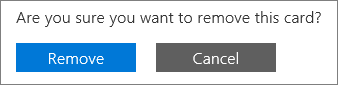

# Uw betalingsmethoden toevoegen, bijwerken of verwijderenAdd, update, or remove your payment methods

::: moniker range="o365-21vianet"

> [!NOTE]
> Het beheercentrum verandert.The admin center is changing. Als uw ervaring niet overeenkomt met de hier gepresenteerde details, raadpleegt u [Over het nieuwe Microsoft 365-beheercentrum](https://docs.microsoft.com/microsoft-365/admin/microsoft-365-admin-center-preview?view=o365-21vianet).If your experience doesn't match the details presented here, see [About the new Microsoft 365 admin center](https://docs.microsoft.com/microsoft-365/admin/microsoft-365-admin-center-preview?view=o365-21vianet).

::: moniker-end

::: moniker range="o365-worldwide"
U producten en services bij Microsoft kopen met een creditcard of bankpas of bankrekening.You can purchase products and services from Microsoft with a credit or debit card, or bank account. U kunt uw betalingsgegevens invullen op de pagina **Betalingsmethoden** of wanneer u een aankoop doet.You can enter your payment information on the **Payment methods** page, or when you make a purchase.

U alleen betalingsmethoden beheren die u hebt toegevoegd.You can only manage payment methods that you've added.

> [!NOTE]
> De optie om te betalen met een bankrekening is niet beschikbaar in sommige landen of regio's.The option to pay with a bank account is not available in some countries or regions.
>
> U moet een creditcard gebruiken die is uitgegeven uit hetzelfde land als uw huurder.You must use a credit card issued from the same country as your tenant.

**Komt de interface die u ziet niet overeen met de interface die in dit artikel wordt beschreven?****Does the interface you see not match the one described in this article?** Zie Zo ja, zie [Betalingsmethoden beheren](manage-payment-methods.md).If so, see [Manage payment methods](manage-payment-methods.md).

## Een betalingsmethode toevoegenAdd a payment method

1. Ga in het beheercentrum naar de pagina <a href="https://go.microsoft.com/fwlink/p/?linkid=2018806" target="_blank">Betalingsmethoden</a> **voor facturen** > **& betalingen.** >In the admin center, go to the **Billing** > **Bills & payments** > <a href="https://go.microsoft.com/fwlink/p/?linkid=2018806" target="_blank">Payment methods</a> page.
2. Selecteer **Betaalmethode toevoegen**.Select **Add a payment method**.
3. Kies op de pagina **Betalingsmethoden** een betalingsmethode uit het vervolgkeuzemenu.On the **Payment methods** page, pick a payment method from the drop-down menu.
4. Voer de gegevens voor de nieuwe kaart of bankrekening in en selecteer **Toevoegen**.Enter the information for the new card or bank account, then select **Add**.

## Een bestaande betalingsmethode bijwerkenUpdate an existing payment method

U het nummer op een bestaande kaart of bankrekening niet wijzigen.You can't change the number on an existing card or bank account. Als de kaart of het bankrekeningnummer is gewijzigd, voegt u deze toe als een nieuwe betalingsmethode.If the card or bank account number has changed, add it as a new payment method. Kies het vervolgens als de betalingsoptie voor uw abonnement en verwijder vervolgens de bestaande kaart of bankrekening.Next, pick it as the payment option for your subscription, then remove the existing card or bank account. U moet een kaart gebruiken die is uitgegeven uit hetzelfde land als uw huurder.You must use a card issued from the same country as your tenant.

1. Ga in het beheercentrum naar de pagina <a href="https://go.microsoft.com/fwlink/p/?linkid=2018806" target="_blank">Betalingsmethoden</a> **voor facturen** > **& betalingen.** >In the admin center, go to the **Billing** > **Bills & payments** > <a href="https://go.microsoft.com/fwlink/p/?linkid=2018806" target="_blank">Payment methods</a> page.
2. Kies op de pagina **Betalingsmethoden** de kaart of bankrekening om bij te werken en selecteer **Bewerken**.On the **Payment methods** page, pick the card or bank account to update, then select **Edit**.
3. Werk uw betalingsmethodegegevens bij (naam op de kaart of bankrekening, factuuradres, telefoonnummer of vervaldatum) en selecteer **Opslaan**.Update your payment method information (name on the card or bank account, billing address, phone number, or expiration date), then select **Save**.

## Een betalingsmethode wijzigenChange a payment method

U de betalingsmethode wijzigen die wordt gebruikt om voor één abonnement te betalen.You can change the payment method that is used to pay for a single subscription. U ook alle abonnementen van de ene betalingsmethode naar de andere verplaatsen.You can also move all subscriptions from one payment method to another.

### De betalingsmethode wijzigen die voor één abonnement wordt gebruiktChange the payment method used for a single subscription

1. Ga in het beheercentrum naar de pagina **Facturering** > <a href="https://go.microsoft.com/fwlink/p/?linkid=842054" target="_blank">uw producten.</a>In the admin center, go to the **Billing** > <a href="https://go.microsoft.com/fwlink/p/?linkid=842054" target="_blank">Your products</a> page.
2. Selecteer het abonnement waarvoor u wilt betalen met de nieuwe kaart of bankrekening.Select the subscription that you want to pay for with the new card or bank account. Selecteer **onder Facturering**naast de betalingsmethode de optie **Bewerken**.Under **Billing**, next to the payment method, select **Edit**.
3. Selecteer naast uw bestaande betalingsmethode **wijzigen**.Next to your existing payment method, select **Change**.
4. Selecteer in de vervolgkeuzelijst een alternatieve betalingsmethode of kies ervoor om een betalingsmethode toe te voegen.From the drop-down menu, select an alternate payment method, or choose to add a payment method.
5. Als u een betalingsmethode toevoegt, voert u de kaart- of accountgegevens in en selecteert u **Opslaan**.If you add a payment method, enter the card or account details, then select **Save**.
6. Controleer of de geselecteerde betalingsmethode juist is en selecteer **Opslaan**.Verify that the selected payment method is correct, then select **Save**.

### De betalingsmethode wijzigen die voor meerdere abonnementen wordt gebruiktChange the payment method used for multiple subscriptions

1. Ga in het beheercentrum naar de pagina <a href="https://go.microsoft.com/fwlink/p/?linkid=2018806" target="_blank">Betalingsmethoden</a> **voor facturen** > **& betalingen.** >In the admin center, go to the **Billing** > **Bills & payments** > <a href="https://go.microsoft.com/fwlink/p/?linkid=2018806" target="_blank">Payment methods</a> page.
2. Selecteer naast de betalingsmethode die u wilt wijzigen het menu **Meer** (drie puntjes) en selecteer **Abonnementen wijzigen**.Next to the payment method you want to change, select the **More** menu (three dots), and then select **Change subscriptions**.
3. In het deelvenster **Betalingsmethode wijzigen** worden bestaande abonnementen weergegeven die die betalingsmethode gebruiken.The **Change payment method** pane lists existing subscriptions that use that payment method.
4. Selecteer in de vervolgkeuzelijst **Betalingsmethode selecteren** een andere betalingsmethode en selecteer **Opslaan**.From the **Select payment method** drop-down, select a different payment method, then select **Save**.

> [!NOTE]
> U alleen wijzigen tussen bestaande betalingsmethoden in het deelvenster **Betalingsmethode wijzigen.**You can only change between existing payment methods in the **Change payment method** pane. Zie [Wijzigen van creditcard of bankrekening naar factuur](change-payment-method.md#change-from-credit-card-or-bank-account-to-invoice)als u wilt overstappen op betaling per factuur.If you want to change to pay by invoice, see [Change from credit card or bank account to invoice](change-payment-method.md#change-from-credit-card-or-bank-account-to-invoice).

## Een betalingsmethode verwijderenRemove a payment method

U alleen een creditcard of betaalkaart of bankrekening van uw lijst met betalingsmethoden verwijderen als deze niet aan een abonnement is gekoppeld.You can only remove a credit or debit card or bank account from your list of payment methods if it's not attached to a subscription. Dit geldt voor alle abonnementen, ongeacht hun status.This applies to all subscriptions, whatever their status. Voeg een betalingsmethode voor het abonnement toe en verwijder het oude abonnement uit dat abonnement.Add a payment method for the subscription, then remove the old one from that subscription. Als de betalingsmethode is gekoppeld aan een factureringsprofiel, wijzigt u de betalingsmethode die wordt gebruikt voor het factureringsprofiel en verwijdert u de betalingsmethode.If the payment method is associated with a billing profile, change the payment method used for the billing profile, and then remove the payment method.

### Een betalingsmethode verwijderenDelete a payment method

Als uw betalingsmethode niet is gekoppeld aan een abonnement, kunt u deze direct verwijderen.If your payment method isn't associated with any subscriptions, you can immediately delete it.

1. Ga in het beheercentrum naar de pagina <a href="https://go.microsoft.com/fwlink/p/?linkid=2018806" target="_blank">Betalingsmethoden</a> **voor facturen** > **& betalingen.** >In the admin center, go to the **Billing** > **Bills & payments** > <a href="https://go.microsoft.com/fwlink/p/?linkid=2018806" target="_blank">Payment methods</a> page.
2. Plaats de muisaanwijzer op de kaart of bankrekening en selecteer vervolgens het pictogram voor verwijderen.Hover over the card or bank account, then select the delete icon.
3. Selecteer Onder aan het deelvenster **Betalingsmethode verwijderen** de optie **Verwijderen**.At the bottom of the **Delete payment method** pane, select **Delete**.

### Een alternatieve betalingsmethode toevoegen die wordt gebruikt om voor abonnementen te betalenAdd an alternate payment method used to pay for subscriptions

Als uw betalingsmethode is gekoppeld aan abonnementen en u geen alternatieve betalingsmethode in het bestand hebt, voegt u eerst een betalingsmethode toe.If your payment method is associated with any subscriptions and you don't have an alternate payment method on file, first add a payment method. Wijzig vervolgens de betalingsmethode die wordt gebruikt om de abonnementen te betalen.Next, change the payment method used to pay for the subscriptions. Vervolgens u de betalingsmethode verwijderen.Then you can delete the payment method.

1. Ga in het beheercentrum naar de pagina <a href="https://go.microsoft.com/fwlink/p/?linkid=2018806" target="_blank">Betalingsmethoden</a> **voor facturen** > **& betalingen.** >In the admin center, go to the **Billing** > **Bills & payments** > <a href="https://go.microsoft.com/fwlink/p/?linkid=2018806" target="_blank">Payment methods</a> page.
2. Plaats de muisaanwijzer op de kaart of bankrekening en selecteer vervolgens het pictogram voor verwijderen.Hover over the card or bank account, then select the delete icon.
3. In het deelvenster **Betalingsmethode verwijderen** worden bestaande abonnementen weergegeven die die betalingsmethode gebruiken.The **Delete payment method** pane lists existing subscriptions that use that payment method.
4. Selecteer **Betaalmethode toevoegen**.Select **Add a payment method**.
5. Selecteer het type betalingsmethode dat u wilt toevoegen, voer de accountgegevens in en selecteer **Toevoegen**.Select the type of payment method you want to add, enter the account information, then select **Add**.
6. Selecteer de nieuwe betalingsmethode in de vervolgkeuzelijst en selecteer **Wijzigen**.Select the new payment method from the drop-down list, then select **Change**.
    > [!WARNING]
    > Hiermee worden alle abonnementen verplaatst naar de nieuwe betaalmethode.This will move all subscriptions to the new payment method.
7. Selecteer **Verwijderen**.Select **Delete**.

### De betalingsmethode wijzigen die wordt gebruikt om voor abonnementen te betalenChange the payment method used to pay for subscriptions

Als uw betalingsmethode is gekoppeld aan abonnementen en u ten minste één alternatieve betalingsmethode in het bestand hebt, wijzigt u eerst de betalingsmethode die wordt gebruikt om voor de abonnementen te betalen.If your payment method is associated with any subscriptions, and you have at least one alternate payment method on file, first change the payment method used to pay for the subscriptions. Vervolgens u de betalingsmethode verwijderen.Then you can delete the payment method.

1. Ga in het beheercentrum naar de pagina <a href="https://go.microsoft.com/fwlink/p/?linkid=2018806" target="_blank">Betalingsmethoden</a> **voor facturen** > **& betalingen.** >In the admin center, go to the **Billing** > **Bills & payments** > <a href="https://go.microsoft.com/fwlink/p/?linkid=2018806" target="_blank">Payment methods</a> page.
2. Plaats de muisaanwijzer op de kaart of bankrekening en selecteer vervolgens het pictogram voor verwijderen.Hover over the card or bank account, then select the delete icon.
3. In het deelvenster **Betalingsmethode verwijderen** worden bestaande abonnementen weergegeven die die betalingsmethode gebruiken.The **Delete payment method** pane lists existing subscriptions that use that payment method.
4. Selecteer **Betalingsmethode wijzigen**.Select **Change payment method**.
5. Selecteer een alternatieve betalingsmethode in de vervolgkeuzelijst en selecteer **Wijzigen**.Select an alternate payment method from the drop-down list, then select **Change**.
    > [!WARNING]
    > Hiermee worden alle abonnementen verplaatst naar de alternatieve betalingsmethode.This will move all subscriptions to the alternate payment method.
6. Selecteer **Verwijderen**.Select **Delete**.

### De betalingsmethode voor een factureringsprofiel wijzigenChange the payment method for a billing profile

Als uw betalingsmethode is gekoppeld aan een factureringsprofiel en niet wordt gebruikt om rechtstreeks voor andere abonnementen te betalen, wijzigt u eerst de betalingsmethode die eraan is gekoppeld.If your payment method is associated with a billing profile and isn't also used to directly pay for other subscriptions, first change the payment method associated with it. Vervolgens u de betalingsmethode verwijderen.Then you can delete the payment method.

1. Ga in het beheercentrum naar de pagina > <a href="https://go.microsoft.com/fwlink/p/?linkid=2103629" target="_blank">Factureringsfacturen factureringsprofielen</a> van \*\* &amp; factureringsfacturen.\*\* **Billing** >In the admin center, go to the **Billing** > **Bills &amp; payments** > <a href="https://go.microsoft.com/fwlink/p/?linkid=2103629" target="_blank">Billing profiles</a> page.
2. Selecteer het factureringsprofiel dat u wilt bijwerken.Select the billing profile you want to update.
3. Selecteer op de pagina details van het factureringsprofiel onder **Betalingsmethode**de optie **Bewerken**.On the billing profile details page, under **Payment method**, select **Edit**.
4. Als u een alternatieve betalingsmethode toevoegt, selecteert u **Een betalingsmethode toevoegen**.If you add an alternate payment method, select **Add a payment method**. Voer uw accountgegevens in en selecteer **Toevoegen**.Enter your account information, then select **Add**.
5. Selecteer **in** de vervolgkeuzelijst Een betalingsmethode selecteren een andere betalingsmethode en selecteer **Opslaan**.From the **Select a payment method** drop-down, select a different payment method, then select **Save**.
6. Volg de stappen in [Een betalingsmethode verwijderen](#delete-a-payment-method).Follow the steps in [Delete a payment method](#delete-a-payment-method).

### De betalingsmethode wijzigen die wordt gebruikt voor zowel een factureringsprofiel als abonnementenChange the payment method used for both a billing profile and subscriptions

Als uw betalingsmethode is gekoppeld aan een factureringsprofiel en ook wordt gebruikt om rechtstreeks te betalen voor abonnementen, wijzigt u eerst de betalingsmethode die is gekoppeld aan het factureringsprofiel.If your payment method is associated with a billing profile and is also used to directly pay for any subscriptions, first change the payment method associated with the billing profile. Wijzig vervolgens de betalingsmethode die wordt gebruikt om de abonnementen te betalen.Next, change the payment method used to pay for the subscriptions. Vervolgens u de betalingsmethode verwijderen.Then you can delete the payment method.

1. Volg de stappen 1 tot en met 5 in [De betalingsmethode voor een factureringsprofiel wijzigen](#change-the-payment-method-for-a-billing-profile).Follow steps 1 through 5 in [Change the payment method for a billing profile](#change-the-payment-method-for-a-billing-profile).
2. Als u geen alternatieve betalingsmethode hebt, volgt u de stappen in [Een alternatieve betalingsmethode toevoegen die wordt gebruikt om voor abonnementen te betalen.](#add-an-alternate-payment-method-used-to-pay-for-subscriptions)If you have no alternate payment method, follow the steps in [Add an alternate payment method used to pay for subscriptions](#add-an-alternate-payment-method-used-to-pay-for-subscriptions).
3. Als u al andere betalingsmethoden beschikbaar hebt, volgt u de stappen in [Een betalingsmethode wijzigen](#change-a-payment-method).If you already have other payment methods available, follow the steps in [Change a payment method](#change-a-payment-method).

## Problemen met betalingsmethoden oplossenTroubleshoot payment methods

|**Probleem****Issue**|**Stappen voor probleemoplossing****Troubleshooting steps**|
|:-----|:-----|
|**Ik krijg een foutmelding met de tekst: "De browser is momenteel ingesteld om cookies te blokkeren."****I get an error message that says, "The browser is currently set to block cookies."**   |Laat uw browser cookies van derden toestaan en probeer het opnieuw.Set your browser to allow third-party cookies and try again.    |
|**Mijn creditcard of betaalkaart is geweigerd.****My credit or debit card was declined.**   |Als u met een creditcard of betaalkaart betaalt en uw kaart wordt geweigerd, ontvangt u een e-mail met de tekst dat Microsoft de betaling niet heeft kunnen verwerken.If you pay by credit or debit card, and your card is declined, you receive an email that says Microsoft was unable to process the payment. Controleer of het &mdash; kaartnummer, de vervaldatum, de naam op de kaart en het adres, inclusief plaats, staat en postcode, precies zo worden weergegeven als op de kaart en uw afschrift.Double-check that the card details &mdash; card number, expiration date, name on the card, and address, including city, state, and ZIP code — appear exactly as they do on the card and your statement. U uw kaartgegevens bijwerken en de betaling onmiddellijk indienen via de koppeling **Saldo vereffenen** in het gedeelte **Facturering** van de pagina met abonnementsgegevens.You can update your card information and immediately submit the payment by using the **Settle balance** link in the **Billing** section of the subscription details page. Zie [Wat als mijn creditcard is geweigerd en mijn betaling achterstallig is?](pay-for-your-subscription.md#what-if-my-credit-card-was-declined-and-my-payment-is-past-due).For more information, see [What if my credit card was declined and my payment is past due?](pay-for-your-subscription.md#what-if-my-credit-card-was-declined-and-my-payment-is-past-due).      Neem contact op met uw bank als u het bericht 'geweigerd' blijft zien.If you continue to see the "declined" message, contact your bank. Het is mogelijk dat uw kaart niet actief is.It's possible that your card isn't active. Als u de kaart onlangs in de e-mail hebt ontvangen met een bijgewerkte vervaldatum, controleert u of deze is geactiveerd.If you recently received the card in the mail with an updated expiration date, make sure it's activated. Uw bank kan u ook vertellen of uw kaart niet is goedgekeurd voor online, internationale of terugkerende transacties.Your bank can also tell you whether your card isn't approved for online, international, or recurring transactions.    |
|**Ik wil een kaart of bankrekeningnummer bijwerken.****I want to update a card or bank account number.**   |U het nummer op een bestaande kaart of bankrekening niet wijzigen.You can't change the number on an existing card or bank account. Als uw kaart of bankrekeningnummer is gewijzigd, voegt u een ander kaartnummer of bankrekening toe.If your card or bank account number has changed, add another card number or bank account. Verplaats vervolgens actieve abonnementen van de oude kaart of account naar de nieuwe.Next, move any active subscriptions from the old card or account to the new one. Verwijder vervolgens de oude kaart of account.Then delete the old card or account. Zie [Een betalingsmethode toevoegen](#add-a-payment-method) of [Betalingsmethode wijzigen](#change-a-payment-method)voor meer informatie .For more information, see [Add a payment method](#add-a-payment-method) or [Change a payment method](#change-a-payment-method). |
|**Ik heb slechts één kaart of bankrekening op mijn rekening en ik wil deze verwijderen.****I only have one card or bank account on my account and I want to remove it.**   |Als u slechts één kaart of bankrekening hebt, ziet u een foutmelding wanneer u deze probeert te verwijderen.If you only have one card or bank account, you see an error message when you try to remove it. Als u de fout wilt verhelpen, controleert u of u een andere betalingsmethode gebruikt om voor al uw abonnementen te betalen en probeert u de kaart of bankrekening opnieuw te verwijderen.To fix the error, make sure that you're using a different payment method to pay for all your subscriptions, then try removing the card or bank account again.    |
|**Ik kan mijn kaart of bankrekening niet toevoegen.****I can't add my card or bank account.**   |Als u problemen ondervindt bij het invoeren van uw kaart- of bankrekeninggegevens, u [contact opnemen met de ondersteuning.](../../admin/contact-support-for-business-products.md)If you have trouble entering your card or bank account information, you can [contact support](../../admin/contact-support-for-business-products.md).    |

::: moniker-end

::: moniker range="o365-21vianet"

U moet een globale beheerder of factureringsbeheerder zijn om de taken in dit artikel uit te voeren.You must be a Global Admin or a Billing Admin to do the tasks described in this article.
  
 **Bent u geen beheerder?****Not an admin?** Neem contact op met uw IT-beheerder voor hulp. [Wie heeft beheerdersmachtigingen in mijn bedrijf?](../../admin/admin-overview/admin-overview.md#who-has-admin-permissions-in-my-business)Contact your IT administrator for help.[Who has admin permissions in my business?](../../admin/admin-overview/admin-overview.md#who-has-admin-permissions-in-my-business)

> [!NOTE]
> De optie om te betalen met een bankrekening is niet beschikbaar in sommige landen of regio's.The option to pay with a bank account is not available in some countries or regions.
>
> U moet een creditcard gebruiken die is uitgegeven uit hetzelfde land als uw huurder.You must use a credit card issued from the same country as your tenant.

## Een creditcard of bankrekening toevoegenAdd a credit card or bank account

1. Ga in het beheercentrum naar de pagina **Facturering**\><a href="https://go.microsoft.com/fwlink/p/?linkid=850626" target="_blank">Abonnementen</a>.In the admin center, go to the **Billing** \> <a href="https://go.microsoft.com/fwlink/p/?linkid=850626" target="_blank">Subscriptions</a> page.

2. Kies het abonnement waarvoor u wilt betalen met de nieuwe creditcard of bankrekening en selecteer **betalingsgegevens bijwerken.**Pick the subscription you want to pay for with the new credit card or bank account, then select **Update payment details**.

    
  
3. Selecteer de vervolgkeuzepijl onder **Een betalingsmethode toevoegen of selecteren**en selecteer vervolgens Nieuwe **creditcard** of **Nieuwe bankrekening**.Select the drop-down arrow under **Add or select a payment method**, then select **New credit card** or **New bank account**.

    
  
4. Voer de gegevens voor de nieuwe creditcard of bankrekening in en selecteer **Verzenden**.Enter the information for the new credit card or bank account, then select **Submit**.

    > [!NOTE]
    > De nieuwe creditcard of bankrekening wordt alleen gebruikt voor het abonnement dat u in stap 2 hebt gekozen.The new credit card or bank account will only be used for the subscription you chose in step 2. Als u de nieuwe creditcard of bankrekening voor een van uw andere abonnementen wilt gebruiken, volgt u de stappen in dit artikel om de creditcard of bankrekening voor elk abonnement te wijzigen.If you have other subscriptions that you want to use the new credit card or bank account for, follow the steps in this article to change the credit card or bank account used to pay for each subscription.

::: moniker-end

::: moniker range="o365-germany"
## Een creditcard of bankrekening toevoegenAdd a credit card or bank account

U moet een globale beheerder of factureringsbeheerder zijn om de taken in dit artikel uit te voeren.You must be a Global Admin or a Billing Admin to do the tasks described in this article.
  
 **Bent u geen beheerder?** Neem contact op met uw IT-beheerder. [Wie heeft beheerdersmachtigingen in mijn bedrijf?](../../admin/admin-overview/admin-overview.md#who-has-admin-permissions-in-my-business)**Not an admin?** Contact your IT administrator for help. [Who has admin permissions in my business?](../../admin/admin-overview/admin-overview.md#who-has-admin-permissions-in-my-business)
  
> [!NOTE]
> De optie om te betalen met een bankrekening is niet beschikbaar in sommige landen of regio's.The option to pay with a bank account is not available in some countries or regions.
>
> U moet een creditcard gebruiken die is uitgegeven uit hetzelfde land als uw huurder.You must use a credit card issued from the same country as your tenant.

1. Ga in het beheercentrum naar de pagina **Facturering**\><a href="https://go.microsoft.com/fwlink/p/?linkid=847745" target="_blank">Abonnementen</a>.In the admin center, go to the **Billing** \> <a href="https://go.microsoft.com/fwlink/p/?linkid=847745" target="_blank">Subscriptions</a> page.

2. Kies het abonnement waarvoor u wilt betalen met de nieuwe creditcard of bankrekening en selecteer **betalingsgegevens bijwerken.**Pick the subscription you want to pay for with the new credit card or bank account, then select **Update payment details**.

    
  
3. Selecteer de vervolgkeuzepijl onder **Een betalingsmethode toevoegen of selecteren**en selecteer vervolgens Nieuwe **creditcard** of **Nieuwe bankrekening**.Select the drop-down arrow under **Add or select a payment method**, then select **New credit card** or **New bank account**.

    
  
4. Voer de gegevens voor de nieuwe creditcard of bankrekening in en selecteer **Verzenden**.Enter the information for the new credit card or bank account, then select **Submit**.

    > [!NOTE]
    > De nieuwe creditcard of bankrekening wordt alleen gebruikt voor het abonnement dat u in stap 2 hebt gekozen.The new credit card or bank account will only be used for the subscription you chose in step 2. Als u de nieuwe creditcard of bankrekening voor een van uw andere abonnementen wilt gebruiken, volgt u de stappen in dit artikel om de creditcard of bankrekening voor elk abonnement te wijzigen.If you have other subscriptions that you want to use the new credit card or bank account for, follow the steps in this article to change the credit card or bank account used to pay for each subscription.

::: moniker-end

::: moniker range="o365-21vianet"
## Een bestaande creditcard of bankrekening bijwerkenUpdate an existing credit card or bank account

> [!NOTE]
> U kunt het nummer van een bestaande creditcard of bankrekening niet wijzigen.You can't change the number on an existing credit card or bank account. Als het creditcard- of bankrekeningnummer is gewijzigd, voegt u deze toe als een nieuwe creditcard of bankrekening.If the credit card or bank account number has changed, add it as a new credit card or bank account. Kies het vervolgens als betalingsoptie voor uw abonnement en verwijder vervolgens de bestaande creditcard of bankrekening.Next, pick it as the payment option for your subscription, then remove the existing credit card or bank account.
> U moet een creditcard gebruiken die is uitgegeven uit hetzelfde land als uw huurder.You must use a credit card issued from the same country as your tenant.

1. Ga in het beheercentrum naar de pagina **Facturering**\><a href="https://go.microsoft.com/fwlink/p/?linkid=850626" target="_blank">Abonnementen</a>.In the admin center, go to the **Billing** \> <a href="https://go.microsoft.com/fwlink/p/?linkid=850626" target="_blank">Subscriptions</a> page.

2. Kies het abonnement dat u hebt gekocht met de creditcardbankrekening die u wilt bijwerken en selecteer **betalingsgegevens bijwerken**.Pick the subscription you bought with the credit card bank account that you want to update, then select **Update payment details**.

    > [!NOTE]
    > Als een abonnement is gekocht door een andere beheerder in uw organisatie, kunt u de creditcard- of bankrekeninggegevens voor dat abonnement niet bijwerken.If another admin purchased the subscription, you won't be able to update the credit card or bank account information for it. Als de creditcard bijna verloopt en de andere beheerder deze niet kan bijwerken, u onderbreking van de service voorkomen als u een andere creditcard of nieuwe bankrekening voor het abonnement toevoegt.If the credit card is about to expire and the other administrator isn't able to update it, you can prevent service interruption if you add a different credit card or new bank account for the subscription.
  
    
  
3. Selecteer de vervolgkeuzepijl onder **Een betalingsmethode toevoegen of selecteren**.Select the drop-down arrow under **Add or select a payment method**. Selecteer de creditcard of bankrekening die u wilt bijwerken en selecteer vervolgens **Details bewerken**.Select the credit card or bank account that you want to update, then select **Edit details**.

    
  
4. Werk uw creditcard- of bankrekeninggegevens bij (naam op de creditcard of bankrekening, factuuradres.Update your credit card or bank account information (name on the credit card or bank account, billing address. telefoonnummer of vervaldatum) selecteert u indien nodig **Verzenden**.phone number, or expiration date) as needed, then select **Submit**.

5. Er verschijnt een bevestigingsbericht.A confirmation message appears. Als dit niet het zo is, raadpleegt u 'Creditcard en bankrekeningen oplossen' later in dit artikel.If it doesn't, see "Troubleshooting credit cards and bank accounts" later in this article.

    

::: moniker-end

::: moniker range="o365-germany"
## Een bestaande creditcard of bankrekening bijwerkenUpdate an existing credit card or bank account

> [!NOTE]
> U kunt het nummer van een bestaande creditcard of bankrekening niet wijzigen.You can't change the number on an existing credit card or bank account. Als het creditcard- of bankrekeningnummer is gewijzigd, voegt u deze toe als een nieuwe creditcard of bankrekening.If the credit card or bank account number has changed, add it as a new credit card or bank account. Kies het vervolgens als betalingsoptie voor uw abonnement en verwijder vervolgens de bestaande creditcard of bankrekening.Next, pick it as the payment option for your subscription, then remove the existing credit card or bank account.
> U moet een creditcard gebruiken die is uitgegeven uit hetzelfde land als uw huurder.You must use a credit card issued from the same country as your tenant.

1. Ga in het beheercentrum naar de pagina **Facturering**\><a href="https://go.microsoft.com/fwlink/p/?linkid=847745" target="_blank">Abonnementen</a>.In the admin center, go to the **Billing** \> <a href="https://go.microsoft.com/fwlink/p/?linkid=847745" target="_blank">Subscriptions</a> page.

2. Kies het abonnement dat u hebt gekocht met de creditcardbankrekening die u wilt bijwerken en selecteer **betalingsgegevens bijwerken**.Pick the subscription you bought with the credit card bank account that you want to update, then select **Update payment details**.

    > [!NOTE]
    > Als een abonnement is gekocht door een andere beheerder in uw organisatie, kunt u de creditcard- of bankrekeninggegevens voor dat abonnement niet bijwerken.If another admin purchased the subscription, you won't be able to update the credit card or bank account information for it. Als de creditcard bijna verloopt en de andere beheerder deze niet kan bijwerken, u onderbreking van de service voorkomen als u een andere creditcard of nieuwe bankrekening voor het abonnement toevoegt.If the credit card is about to expire and the other administrator isn't able to update it, you can prevent service interruption if you add a different credit card or new bank account for the subscription.
  
    
  
3. Selecteer de vervolgkeuzepijl onder **Een betalingsmethode toevoegen of selecteren**.Select the drop-down arrow under **Add or select a payment method**. Selecteer de creditcard of bankrekening die u wilt bijwerken en selecteer vervolgens **Details bewerken**.Select the credit card or bank account that you want to update, then select **Edit details**.

    
  
4. Werk uw creditcard- of bankrekeninggegevens bij (naam op de creditcard of bankrekening, factuuradres.Update your credit card or bank account information (name on the credit card or bank account, billing address. telefoonnummer of vervaldatum) selecteert u indien nodig **Verzenden**.phone number, or expiration date) as needed, then select **Submit**.

5. Er verschijnt een bevestigingsbericht.A confirmation message appears. Als dit niet het zo is, raadpleegt u 'Creditcard en bankrekeningen oplossen' later in dit artikel.If it doesn't, see "Troubleshooting credit cards and bank accounts" later in this article.

    

::: moniker-end

::: moniker range="o365-21vianet"
## Een creditcard of bankrekening verwijderenRemove a credit card or bank account

1. Ga in het beheercentrum naar de pagina **Facturering**\><a href="https://go.microsoft.com/fwlink/p/?linkid=850626" target="_blank">Abonnementen</a>.In the admin center, go to the **Billing** \> <a href="https://go.microsoft.com/fwlink/p/?linkid=850626" target="_blank">Subscriptions</a> page.

2. Kies een abonnement en selecteer **Betalingsgegevens bijwerken**.Pick any subscription, then select **Update payment details**.

    
  
3. Selecteer de vervolgkeuzepijl onder **Een betalingsmethode toevoegen of selecteren**.Select the drop-down arrow under **Add or select a payment method**.

4. Selecteer de creditcard of bankrekening en selecteer **Verwijderen**.Select the credit card or bank account, then select **Remove**.

    
  
5. Selecteer Opnieuw **verwijderen** om de creditcard of bankrekening te verwijderen.Select **Remove** again to delete the credit card or bank account.

    
  
    > [!NOTE]
    > U een creditcard of bankrekening niet verwijderen als deze momenteel wordt gebruikt om voor een abonnement te betalen.You won't be able to remove a credit card or bank account if it's currently used to pay for a subscription. Als u het probeert, ziet If you try, you see a message like this:   
    > Als u de creditcard of bankrekening wilt verwijderen, selecteert u **Terug** en volgt u de stappen in dit artikel om de creditcard of bankrekening te wijzigen die u gebruikt om voor het abonnement te betalen.To remove the credit card or bank account, select **Back** and follow the steps in this article to change the credit card or bank account that you use to pay for the subscription. Probeer de creditcard of bankrekening vervolgens nogmaals te verwijderen.Then try removing the credit card or bank account again.

::: moniker-end

::: moniker range="o365-germany"
## Een creditcard of bankrekening verwijderenRemove a credit card or bank account

1. Ga in het beheercentrum naar de pagina **Facturering**\><a href="https://go.microsoft.com/fwlink/p/?linkid=847745" target="_blank">Abonnementen</a>.In the admin center, go to the **Billing** \> <a href="https://go.microsoft.com/fwlink/p/?linkid=847745" target="_blank">Subscriptions</a> page.

2. Kies een abonnement en selecteer **Betalingsgegevens bijwerken**.Pick any subscription, then select **Update payment details**.

    
  
3. Selecteer de vervolgkeuzepijl onder **Een betalingsmethode toevoegen of selecteren**.Select the drop-down arrow under **Add or select a payment method**.

4. Selecteer de creditcard of bankrekening en selecteer **Verwijderen**.Select the credit card or bank account, then select **Remove**.

    

5. Selecteer Opnieuw **verwijderen** om de creditcard of bankrekening te verwijderen.Select **Remove** again to delete the credit card or bank account.

    
  
    > [!NOTE]
    > U een creditcard of bankrekening niet verwijderen als deze momenteel wordt gebruikt om voor een abonnement te betalen.You won't be able to remove a credit card or bank account if it's currently used to pay for a subscription. Als u het probeert, ziet If you try, you see a message like this:   
    > Als u de creditcard of bankrekening wilt verwijderen, selecteert u **Terug** en volgt u de stappen in dit artikel om de creditcard of bankrekening te wijzigen die u gebruikt om voor het abonnement te betalen.To remove the credit card or bank account, select **Back** and follow the steps in this article to change the credit card or bank account that you use to pay for the subscription. Probeer de creditcard of bankrekening vervolgens nogmaals te verwijderen.Then try removing the credit card or bank account again.

::: moniker-end

::: moniker range="o365-21vianet"
## De creditcard of bankrekening wijzigen die wordt gebruikt om voor een abonnement te betalenChange the credit card or bank account used to pay for a subscription

1. Ga in het beheercentrum naar de pagina **Facturering**\><a href="https://go.microsoft.com/fwlink/p/?linkid=850626" target="_blank">Abonnementen</a>.In the admin center, go to the **Billing** \> <a href="https://go.microsoft.com/fwlink/p/?linkid=850626" target="_blank">Subscriptions</a> page.

2. Kies het abonnement waarvoor u wilt betalen met de nieuwe creditcard of bankrekening en selecteer **betalingsgegevens bijwerken**.Pick the subscription that you want to pay for with the new credit card or bank account, then select **Update payment details**.

    
  
3. Selecteer de vervolgkeuzepijl onder **Een betalingsmethode toevoegen of selecteren** en selecteer de creditcard of bankrekening die u wilt gebruiken.Select the drop-down arrow under **Add or select a payment method** and select the credit card or bank account that you want to use.

    
  
4. Selecteer **Verzenden**.Select **Submit**. Als de creditcard of bankrekening die u wilt gebruiken nog niet wordt vermeld, kiest u **Nieuwe creditcard** of **Nieuwe bankrekening** om deze toe te voegen.If the credit card or bank account that you want to use isn't listed yet, pick **New credit card** or **New bank account** to add it.

::: moniker-end

::: moniker range="o365-germany"
## De creditcard of bankrekening wijzigen die wordt gebruikt om voor een abonnement te betalenChange the credit card or bank account used to pay for a subscription

1. Ga in het beheercentrum naar de pagina **Facturering**\><a href="https://go.microsoft.com/fwlink/p/?linkid=847745" target="_blank">Abonnementen</a>.In the admin center, go to the **Billing** \> <a href="https://go.microsoft.com/fwlink/p/?linkid=847745" target="_blank">Subscriptions</a> page.

2. Kies het abonnement waarvoor u wilt betalen met de nieuwe creditcard of bankrekening en selecteer **betalingsgegevens bijwerken**.Pick the subscription that you want to pay for with the new credit card or bank account, then select **Update payment details**.

    
  
3. Selecteer de vervolgkeuzepijl onder **Een betalingsmethode toevoegen of selecteren** en selecteer de creditcard of bankrekening die u wilt gebruiken.Select the drop-down arrow under **Add or select a payment method** and select the credit card or bank account that you want to use.

    
  
4. Selecteer **Verzenden**.Select **Submit**. Als de creditcard of bankrekening die u wilt gebruiken nog niet wordt vermeld, kiest u **Nieuwe creditcard** of **Nieuwe bankrekening** om deze toe te voegen.If the credit card or bank account that you want to use isn't listed yet, pick **New credit card** or **New bank account** to add it.

::: moniker-end

::: moniker range="o365-21vianet"
## Problemen met creditcards en bankrekeningen oplossenTroubleshooting credit cards and bank accounts

|**Probleem****Issue**|**Stappen voor probleemoplossing****Troubleshooting steps**|
|:-----|:-----|
|**Ik krijg een foutbericht met de tekst 'De browser is momenteel ingesteld op het blokkeren van cookies.'****I get an error message that says "The browser is currently set to block cookies."**   |Laat uw browser cookies van derden toestaan en probeer het opnieuw.Set your browser to allow third-party cookies and try again.    |
|**Mijn creditcard is geweigerd.****My credit card was declined.**   |Als u met een creditcard betaalt en uw creditcard wordt geweigerd, ontvangt u een e-mail dat we de betaling niet hebben kunnen verwerken.If you pay by credit card, and your credit card is declined, you receive an email that we were unable to process the payment. Controleer of de creditcardgegevens (kaartnummer, vervaldatum, naam op de creditcard en adres, inclusief plaats, staat en postcode) precies zo worden weergegeven als op de creditcard en uw creditcardafschrift.Verify that the credit card details (card number, expiration date, name on the credit card, and address, including city, state, and ZIP code) appear exactly as they do on the credit card and your credit card statement. U uw creditcardgegevens bijwerken en de betaling onmiddellijk indienen met de functie **Nu betalen.**You can update your credit card information and immediately submit the payment by using the **Pay now** feature. Zie [Wat als mijn creditcard is geweigerd en mijn betaling achterstallig is?](pay-for-your-subscription.md#what-if-my-credit-card-was-declined-and-my-payment-is-past-due).For more information, see [What if my credit card was declined and my payment is past due?](pay-for-your-subscription.md#what-if-my-credit-card-was-declined-and-my-payment-is-past-due).      Neem contact op met uw bank als u het bericht 'geweigerd' blijft zien.If you continue to see the "declined" message, contact your bank. Het is mogelijk dat uw creditcard niet actief is.It's possible that your credit card isn't active. Als u onlangs de creditcard in de e-mail hebt ontvangen met een bijgewerkte vervaldatum, controleert u of deze is geactiveerd.If you recently received the credit card in the mail with an updated expiration date, make sure it's activated. Uw bank kan u ook vertellen of uw creditcard niet is goedgekeurd voor online, internationale of terugkerende transacties.Your bank can also tell you whether your credit card isn't approved for online, international, or recurring transactions.    |
|**Ik wil een creditcard of bankrekeningnummer bijwerken.****I want to update a credit card or bank account number.**   |U kunt het nummer van een bestaande creditcard of bankrekening niet wijzigen.You can't change the number on an existing credit card or bank account. Als uw creditcard- of bankrekeningnummer is gewijzigd, [voegt u een nieuwe creditcard of bankrekening toe,](#add-a-credit-card-or-bank-account) [wijzigt u uw abonnement op die kaart of bankrekening](#change-the-credit-card-or-bank-account-used-to-pay-for-a-subscription)en verwijdert u de oude creditcard of [bankrekening](#remove-a-credit-card-or-bank-account).If your credit card or bank account number has changed, [add a new credit card or bank account](#add-a-credit-card-or-bank-account), [change your subscription to that card or bank account](#change-the-credit-card-or-bank-account-used-to-pay-for-a-subscription), and then [delete the old credit card or bank account](#remove-a-credit-card-or-bank-account). |
|**Ik heb maar één creditcard of bankrekening in mijn account en die wil ik verwijderen.****I only have one credit card or bank account on my account and I want to remove it.**   |Als u slechts één creditcard of bankrekening hebt, ziet u een foutmelding wanneer u deze probeert te verwijderen.If you only have one credit card or bank account, you see an error message when you try to remove it. Als u fouten wilt oplossen, controleert u of u een andere betalingsmethode gebruikt om voor al uw abonnementen te betalen en vervolgens de creditcard of bankrekening opnieuw te verwijderen.To fix error, make sure that you're using a different payment method to pay for all of your subscriptions, then try removing the credit card or bank account again.    |
|**Betalen via creditcard of bankrekening****I can't add my credit card or bank account.**   |Als u problemen ondervindt met het invoeren van de gegevens van uw creditcard of bankrekening, kunt [contact opnemen met ondersteuning](../../admin/contact-support-for-business-products.md).If you have trouble entering your credit card or bank account information, you can [contact support](../../admin/contact-support-for-business-products.md).    |

::: moniker-end

::: moniker range="o365-germany"
## Problemen met creditcards en bankrekeningen oplossenTroubleshooting credit cards and bank accounts

|**Probleem****Issue**|**Stappen voor probleemoplossing****Troubleshooting steps**|
|:-----|:-----|
|**Ik krijg een foutbericht met de tekst 'De browser is momenteel ingesteld op het blokkeren van cookies.'****I get an error message that says "The browser is currently set to block cookies."**   |Laat uw browser cookies van derden toestaan en probeer het opnieuw.Set your browser to allow third-party cookies and try again.    |
|**Mijn creditcard is geweigerd.****My credit card was declined.**   |Als u met een creditcard betaalt en uw creditcard wordt geweigerd, ontvangt u een e-mail dat we de betaling niet hebben kunnen verwerken.If you pay by credit card, and your credit card is declined, you receive an email that we were unable to process the payment. Controleer of de creditcardgegevens (kaartnummer, vervaldatum, naam op de creditcard en adres, inclusief plaats, staat en postcode) precies zo worden weergegeven als op de creditcard en uw creditcardafschrift.Verify that the credit card details (card number, expiration date, name on the credit card, and address, including city, state, and ZIP code) appear exactly as they do on the credit card and your credit card statement. U uw creditcardgegevens bijwerken en de betaling onmiddellijk indienen met de functie **Nu betalen.**You can update your credit card information and immediately submit the payment by using the **Pay now** feature. Zie [Wat als mijn creditcard is geweigerd en mijn betaling achterstallig is?](pay-for-your-subscription.md#what-if-my-credit-card-was-declined-and-my-payment-is-past-due).For more information, see [What if my credit card was declined and my payment is past due?](pay-for-your-subscription.md#what-if-my-credit-card-was-declined-and-my-payment-is-past-due).      Neem contact op met uw bank als u het bericht 'geweigerd' blijft zien.If you continue to see the "declined" message, contact your bank. Het is mogelijk dat uw creditcard niet actief is.It's possible that your credit card isn't active. Als u onlangs de creditcard in de e-mail hebt ontvangen met een bijgewerkte vervaldatum, controleert u of deze is geactiveerd.If you recently received the credit card in the mail with an updated expiration date, make sure it's activated. Uw bank kan u ook vertellen of uw creditcard niet is goedgekeurd voor online, internationale of terugkerende transacties.Your bank can also tell you whether your credit card isn't approved for online, international, or recurring transactions.    |
|**Ik wil een creditcard of bankrekeningnummer bijwerken.****I want to update a credit card or bank account number.**   |U kunt het nummer van een bestaande creditcard of bankrekening niet wijzigen.You can't change the number on an existing credit card or bank account. Als uw creditcard- of bankrekeningnummer is gewijzigd, [voegt u een nieuwe creditcard of bankrekening toe,](#add-a-credit-card-or-bank-account-1) [wijzigt u uw abonnement op de creditcard of bankrekening](#change-the-credit-card-or-bank-account-used-to-pay-for-a-subscription-1)en verwijdert u vervolgens de oude creditcard of [bankrekening](#remove-a-credit-card-or-bank-account-1).If your credit card or bank account number has changed, [add a new credit card or bank account](#add-a-credit-card-or-bank-account-1), [change your subscription to that the credit card or bank account](#change-the-credit-card-or-bank-account-used-to-pay-for-a-subscription-1), and then [delete the old credit card or bank account](#remove-a-credit-card-or-bank-account-1). |
|**Ik heb maar één creditcard of bankrekening in mijn account en die wil ik verwijderen.****I only have one credit card or bank account on my account and I want to remove it.**   |Als u slechts één creditcard of bankrekening hebt, ziet u een foutmelding wanneer u deze probeert te verwijderen.If you only have one credit card or bank account, you see an error message when you try to remove it. Als u fouten wilt oplossen, controleert u of u een andere betalingsmethode gebruikt om voor al uw abonnementen te betalen en vervolgens de creditcard of bankrekening opnieuw te verwijderen.To fix error, make sure that you're using a different payment method to pay for all of your subscriptions, then try removing the credit card or bank account again.    |
|**Betalen via creditcard of bankrekening****I can't add my credit card or bank account.**   |Als u problemen ondervindt met het invoeren van de gegevens van uw creditcard of bankrekening, kunt [contact opnemen met ondersteuning](../../admin/contact-support-for-business-products.md).If you have trouble entering your credit card or bank account information, you can [contact support](../../admin/contact-support-for-business-products.md).    |

::: moniker-end

## Verwante artikelenRelated articles

[Uw factuuradressen wijzigenChange your billing addresses](change-your-billing-addresses.md)
  
[Uw abonnement opzeggenCancel your subscription](../subscriptions/cancel-your-subscription.md)
