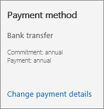

# Uw factuuradressen wijzigen

::: moniker range="o365-21vianet"

> [!NOTE]
> Het beheercentrum wordt gewijzigd. Als de informatie die hier wordt weergegeven, niet overeenkomt met wat u gewend bent, raadpleegt u [Over het nieuwe Microsoft 365-beheercentrum](https://docs.microsoft.com/microsoft-365/admin/microsoft-365-admin-center-preview?view=o365-21vianet).

::: moniker-end

Uw rekening of factuur bevat drie adressen:
  
- **Het adres onder Verkocht aan** De naam en het adres van uw organisatie, zoals weergegeven in uw organisatieprofiel.

- **Factuuradres** Het adres van uw factuurafdeling. Dit is doorgaans hetzelfde adres als onder **Verkocht aan**.

- **Adres voor servicegebruik** Het adres waarop de service wordt gebruikt. Dit is doorgaans hetzelfde adres als het adres onder **Verkocht aan**. Als uw organisatie externe gebruikers of meerdere kantoren heeft, gebruikt u het adres waar zich de meeste gebruikers bevinden.

In de meeste gevallen komen deze adressen overeen. Als u een of meer van deze adressen wilt wijzigen, is dat mogelijk. U kunt ook een alternatief e-mailadres invoeren om facturerings meldingen te ontvangen en het alternatieve e-mailadres voor andere beheerders te wijzigen.
  
::: moniker range="o365-worldwide"

Zie [uw rekening of factuur bekijken](view-your-bill-or-invoice.md) en [uw factuur of factuur begrijpen](understand-your-invoice2.md)voor meer informatie over uw rekening of factuur.

::: moniker-end

::: moniker range="o365-germany"

Zie [uw rekening of factuur bekijken](view-your-bill-or-invoice.md) en [uw factuur orinvoice](understand-your-invoice2.md)voor meer informatie over uw rekening of factuur.

::: moniker-end

::: moniker range="o365-21vianet"

Als u Office 365 gebruikt dat wordt beheerd door 21Vianet in China, raadpleegt u [uw factuur weergeven of Get fapiaos voor Office 365 beheerd door 21vianet](../../admin/services-in-china/view-your-bill-or-get-a-fapiao.md).

::: moniker-end

## Uw adres onder Verkocht aan wijzigen

1. Ga **in het Beheercentrum naar de** \> pagina <a href="https://go.microsoft.com/fwlink/p/?linkid=2084771" target="_blank">facturerings accounts</a> .

2. Selecteer de gegevens van het **factuur account bewerken**.

3. Werk de gegevens van uw organisatie bij en selecteer **Opslaan**.
  
## Uw factuuradres wijzigen

::: moniker range="o365-worldwide"

1. Ga in het Beheercentrum naar de pagina betaalmethoden voor **facturering** \> <a href="https://go.microsoft.com/fwlink/p/?linkid=2018806" target="_blank">Payment methods</a> .

2. Selecteer de creditcard of bankrekening die u wilt wijzigen.

3. Selecteer **bewerken**op de pagina **Details van betaalmethode** .

4. Werk uw factuuradres bij en selecteer vervolgens klaar met **Opslaan** \> **Done**.

::: moniker-end

::: moniker range="o365-germany"

1. Ga in het beheercentrum naar de pagina **Facturering**\><a href="https://go.microsoft.com/fwlink/p/?linkid=847745" target="_blank">Abonnementen</a>.

2. Selecteer het abonnement dat u wilt wijzigen en selecteer vervolgens **Betalingsgegevens wijzigen**.

    
  
3. *Klanten met een creditcard of bankrekening:*  Selecteer op de pagina **Betalingsgegevens wijzigen** de creditcard of bankrekening die u wilt bijwerken, selecteer **Details bewerken**, werk uw factuuradres bij en klik op **verzenden**.
  
    > [!NOTE]
    > De mogelijkheid om te betalen via een bankrekening is niet beschikbaar in sommige landen of regio's.

     *Factuurklanten:*  Werk op de pagina **Betalingsgegevens wijzigen** uw factuuradres bij en selecteer **verzenden**.
  
    > [!NOTE]
    > De mogelijkheid om een factuur te betalen per cheque is niet beschikbaar in sommige landen of regio's.

::: moniker-end

::: moniker range="o365-21vianet"

1. Ga in het beheercentrum naar de pagina **Facturering**\><a href="https://go.microsoft.com/fwlink/p/?linkid=850626" target="_blank">Abonnementen</a>.

2. Selecteer het abonnement dat u wilt wijzigen en selecteer vervolgens **Betalingsgegevens wijzigen**.

    
  
3. Werk op de pagina **Betalingsgegevens wijzigen** uw factuuradres bij en selecteer **verzenden**.

    U kunt [uw betaalmethode voor Office 365 beheerd door 21Vianet wijzigen](change-payment-method.md) van Factuur naar Onlinebetaling met Alipay of China UnionPay, of omgekeerd.

::: moniker-end

## Uw adres voor servicegebruik wijzigen

::: moniker range="o365-worldwide"

1. Ga in het beheercentrum naar de pagina **Facturering** \> <a href="https://go.microsoft.com/fwlink/p/?linkid=842054" target="_blank">Mijn producten</a>.
2. Selecteer op het tabblad **Products** het abonnement dat u wilt wijzigen.
3. Selecteer op de pagina Details van abonnement in de sectie **adres voor service gebruik** de optie **adres voor service gebruik bewerken**.
4. Werk in het deelvenster **adres voor service gebruik wijzigen** uw adres bij en selecteer vervolgens **Opslaan**.

::: moniker-end

::: moniker range="o365-germany"

1. Ga in het beheercentrum naar de pagina **Facturering**\><a href="https://go.microsoft.com/fwlink/p/?linkid=847745" target="_blank">Abonnementen</a>.

2. Selecteer het abonnement dat u wilt wijzigen, selecteer **meer acties**en kies vervolgens **adres voor service gebruik bewerken**.

    
  
3. Werk in het deelvenster **uw adres voor service gebruik wijzigen** uw adres bij en selecteer **verzenden**.

::: moniker-end

::: moniker range="o365-21vianet"

1. Ga in het beheercentrum naar de pagina **Facturering**\><a href="https://go.microsoft.com/fwlink/p/?linkid=850626" target="_blank">Abonnementen</a>.

2. Selecteer het abonnement dat u wilt wijzigen, selecteer **meer acties**en kies vervolgens **adres voor service gebruik bewerken**.

    
  
3. Werk in het deelvenster **uw adres voor service gebruik wijzigen** uw adres bij en selecteer **verzenden**.

::: moniker-end

## Het alternatieve e-mailadres waarnaar uw factuurmeldingen worden verzonden, wijzigen

Standaard worden de facturerings meldingen van uw organisatie verzonden naar het Microsoft-e-mailadres en het alternatieve e-mailadres van elke globale beheerder en factureringsbeheerder in uw organisatie. Elke beheerder kan het alternatieve e-mailadres wijzigen door de profielgegevens ervan bij te werken.
  
1. Meld u aan bij Microsoft 365 met uw werk-of schoolaccount als globale beheerder. [meer informatie over hoe u zich kunt aanmelden](https://support.microsoft.com/office/e9eb7d51-5430-4929-91ab-6157c5a050b4).

2. Selecteer het **gebruikers pictogram**en selecteer **Mijn account**.
  
3. Selecteer **persoonlijke gegevens**.
  
4. Selecteer **bewerken**in het dialoogvenster **contact gegevens** .

5. Typ in het vak **alternatief e-mail** adres het alternatieve e-mailadres dat u wilt gebruiken en selecteer vervolgens **Opslaan**.
  
## Het alternatieve e-mailadres voor een andere beheerder wijzigen

U kunt ook het alternatieve e-mailadres van andere globale en factureringsbeheerders in uw organisatie wijzigen.

::: moniker range="o365-worldwide"
  
1. Ga in het Beheercentrum naar de pagina **facturerings** \> <a href="https://go.microsoft.com/fwlink/p/?linkid=853212" target="_blank">meldingen</a> .

::: moniker-end

::: moniker range="o365-germany"

1. Ga in het Beheercentrum naar de pagina **facturerings** \> <a href="https://go.microsoft.com/fwlink/p/?linkid=853213" target="_blank">meldingen</a> .

::: moniker-end

::: moniker range="o365-21vianet"

1. Ga in het Beheercentrum naar de pagina **facturerings** \> <a href="https://go.microsoft.com/fwlink/p/?linkid=853215" target="_blank">meldingen</a> .

::: moniker-end

2. Selecteer op de pagina **facturerings meldingen** de beheerder die u wilt wijzigen.

3. Typ in het deelvenster **gebruikersrollen bewerken** het alternatieve e-mailadres dat u wilt gebruiken en selecteer vervolgens **Opslaan**.

## Verwante artikelen

[Uw rekening of factuur weergeven](view-your-bill-or-invoice.md)

[Inzicht in uw rekening of factuur](understand-your-invoice2.md)

[Betalen voor uw abonnement](pay-for-your-subscription.md)

[Abonnementen en facturering-Help voor beheerders](../index.yml)
