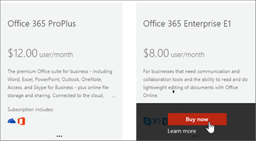

# Nog een abonnement op Office 365 voor Bedrijven nemenBuy another Office 365 for business subscription

Als u al een Abonnement op Office 365 voor Bedrijven hebt en u een ander abonnement voor uw organisatie wilt kopen, u dit het beste doen via het beheercentrum.If you already have an Office 365 for business subscription and you want to buy another subscription for your organization, the best way is to do it is through the admin center. Als u het eerste Office 365 voor Bedrijven-abonnement voor uw organisatie nog niet hebt gekocht, gaat u [hier](https://products.office.com/business/compare-office-365-for-business-plans) om een abonnement te kiezen.If you haven't yet purchased the first Office 365 for business subscription for your organization, go [here](https://products.office.com/business/compare-office-365-for-business-plans) to choose a plan.
  
Wanneer u een ander abonnement koopt via het beheercentrum, bent u verzekerd dat het nieuwe abonnement wordt gekoppeld aan dezelfde organisatie (domeinnaamruimte) als uw bestaande abonnement.When you buy another subscription through the admin center, you're guaranteed that the new subscription will be associated with the same organization (domain name space) as your existing subscription. Dit maakt het eenvoudiger om gebruikers binnen uw organisatie tussen abonnementen te verplaatsen of hen een gebruikerslicentie toe te wijzen voor het aanvullende abonnement dat ze nodig hebben.This makes it easier to move users within your organization between subscriptions or assign them a user license for the additional subscription they need.
  
Nadat u een nieuw abonnement hebt aangenomen, moet u de gebruikers die u dat abonnement wilt gebruiken, een gebruikerslicentie voor het abonnement toewijzen.After purchasing a new subscription, you'll need to assign the users who you want to use that subscription a user license for it. Zie [Licenties toewijzen aan gebruikers in Office 365 voor Bedrijven voor](../admin/manage/assign-licenses-to-users.md)meer informatie.To learn how, see [Assign licenses to users in Office 365 for business](../admin/manage/assign-licenses-to-users.md).
  
## Nog een abonnement kopenBuy another subscription

::: moniker range="o365-worldwide"

1. Ga in het beheercentrum naar de pagina Services <a href="https://go.microsoft.com/fwlink/p/?linkid=868433" target="_blank">voor factureringsaankopen.</a> **Billing** \>In the admin center, go to the **Billing** \> <a href="https://go.microsoft.com/fwlink/p/?linkid=868433" target="_blank">Purchase services</a> page.

2. Selecteer **op** de pagina Services kopen het abonnement dat u wilt kopen en selecteer **Kopen**.On the **Purchase services** page, select the subscription that you want to buy, then select **Buy**.

3. Voer het aantal benodigde gebruikerslicenties in en kies of u per maand of voor het hele jaar wilt betalen.Enter the number of licenses that you need, and choose whether to pay each month or for the whole year. Kies of u automatisch licenties wilt toewijzen aan alle gebruikers zonder licentie.Choose whether you want to automatically assign licenses to everyone who does not currently have a license. Selecteer vervolgens **Nu uitchecken**.Then select **Check out now**.

4. Uw winkelwagen wordt geopend.Your cart opens. Als uw winkelwagentje van het scherm verdwijnt, selecteert u **Winkelwagentje** om het opnieuw te openen, bekijkt u de volgorde en selecteert **u Uitchecken**.If your cart disappears from the screen, select **Cart** to reopen it, review the order and then select **Check Out**.

5. Bekijk de prijsinformatie en selecteer **Volgende**.Review the pricing information and select **Next**.

6. Geef uw betalingsgegevens op en selecteer **Vervolgens Plaatsorder** \> **Ga naar Beheerhuis**.Provide your payment information, and then select **Place order** \> **Go to Admin Home**.

::: moniker-end

::: moniker range="o365-germany"

1. Ga in het beheercentrum naar de pagina **Facturering**\><a href="https://go.microsoft.com/fwlink/p/?linkid=847745" target="_blank">Abonnementen</a>.In the admin center, go to the **Billing** \> <a href="https://go.microsoft.com/fwlink/p/?linkid=847745" target="_blank">Subscriptions</a> page.

2. Selecteer **op** de pagina Abonnement de optie **Abonnementen toevoegen**.On the **Subscription** page, select **Add subscriptions**.

    U ziet de abonnementen die beschikbaar zijn voor uw organisatie.You'll see the subscriptions that are available to your organization. Alle abonnementen die u al hebt gekocht, worden als volgt geïdentificeerd.Any subscriptions that you've already purchased are identified like this.

    
  
3. Muis over of tik op het abonnement dat u wilt kopen en selecteer **Nu kopen**.Mouse over or tap the subscription that you want to buy, and then select **Buy Now**.

    
  
4. Voer het aantal gebruikerslicenties in dat u nodig hebt, kies of u elke maand of het hele jaar wilt betalen en selecteer **Toevoegen aan winkelwagentje.**Enter the number of user licenses you need, chose whether to pay each month or for the whole year, and then select **Add to Cart**.

5. Uw winkelwagen wordt geopend.Your cart opens. Als uw winkelwagentje van het scherm verdwijnt, selecteert u **Winkelwagentje** om het opnieuw te openen, bekijkt u de volgorde en selecteert **u Uitchecken**.If your cart disappears from the screen, select **Cart** to reopen it, review the order and then select **Check Out**.

6. Bekijk de prijsinformatie en selecteer **Volgende**.Review the pricing information and select **Next**.

7. Geef uw betalingsgegevens op en selecteer **Vervolgens Bestelling plaatsen**.Provide your payment information, and then select **Place order**.

8. Selecteer op de bevestigingspagina **Ga naar Beheerstartpagina**.On the confirmation page, select **Go to Admin Home**.

::: moniker-end

::: moniker range="o365-21vianet"

1. Ga in het beheercentrum naar de pagina **Facturering**\><a href="https://go.microsoft.com/fwlink/p/?linkid=850626" target="_blank">Abonnementen</a>.In the admin center, go to the **Billing** \> <a href="https://go.microsoft.com/fwlink/p/?linkid=850626" target="_blank">Subscriptions</a> page.

2. Selecteer **op** de pagina Abonnement de optie **Abonnementen toevoegen**.On the **Subscription** page, select **Add subscriptions**.

    U ziet de abonnementen die beschikbaar zijn voor uw organisatie.You'll see the subscriptions that are available to your organization. Alle abonnementen die u al hebt gekocht, worden als volgt geïdentificeerd.Any subscriptions that you've already purchased are identified like this.

    
  
3. Muis over of tik op het abonnement dat u wilt kopen en selecteer **Nu kopen**.Mouse over or tap the subscription that you want to buy, and then select **Buy Now**.

    
  
4. Voer het aantal gebruikerslicenties in dat u nodig hebt, kies of u elke maand of het hele jaar wilt betalen en selecteer **Toevoegen aan winkelwagentje.**Enter the number of user licenses you need, chose whether to pay each month or for the whole year, and then select **Add to Cart**.

5. Uw winkelwagen wordt geopend.Your cart opens. Als uw winkelwagentje van het scherm verdwijnt, selecteert u **Winkelwagentje** om het opnieuw te openen, bekijkt u de volgorde en selecteert **u Uitchecken**.If your cart disappears from the screen, select **Cart** to reopen it, review the order and then select **Check Out**.

6. Bekijk de prijsinformatie en selecteer **Volgende**.Review the pricing information and select **Next**.

7. Geef uw betalingsgegevens op en selecteer **Vervolgens Bestelling plaatsen**.Provide your payment information, and then select **Place order**.

8. Selecteer op de bevestigingspagina **Ga naar Beheerstartpagina**.On the confirmation page, select **Go to Admin Home**.

::: moniker-end

## Verwante artikelenRelated articles

[Licenties toewijzen aan gebruikersAssign licenses to users](../admin/manage/assign-licenses-to-users.md)
  
[Licenties van gebruikers verwijderenRemove licenses from users](../admin/manage/remove-licenses-from-users.md)