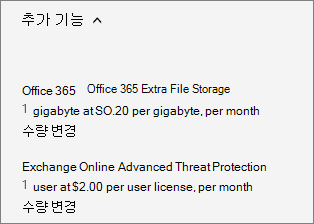

# Een invoegtoepassing voor Office 365 voor Bedrijven kopen of bewerkenBuy or edit an add-on for Office 365 for business

Een aantal abonnementen voor Office 365 voor Bedrijven bevatten invoegtoepassingen die u voor het abonnement kunt kopen. Met een invoegtoepassing beschikt u over aanvullende functionaliteit voor het abonnement waarvoor u het koopt.Several of the Office 365 for business plans have add-ons that you can buy for your subscription. An add-on provides additional functionality to the subscription that you buy it for.

::: moniker range="o365-worldwide"

> [!NOTE]
> Als u het nieuwe Microsoft 365-beheercentrum niet gebruikt, kunt u dit inschakelen door de wisselknop **Probeer het nieuwe beheercentrum** bovenaan de startpagina te selecteren.If you're not using the new Microsoft 365 admin center, you can turn it on by selecting the **Try the new admin center** toggle located at the top of the Home page.

::: moniker-end 

## Een invoegtoepassing kopenBuy an add-on

::: moniker range="o365-worldwide"

1. Ga in het beheercentrum naar de pagina Services <a href="https://go.microsoft.com/fwlink/p/?linkid=868433" target="_blank">voor factureringsaankopen.</a> **Billing** \>In the admin center, go to the **Billing** \> <a href="https://go.microsoft.com/fwlink/p/?linkid=868433" target="_blank">Purchase services</a> page.

2. Selecteer Onder aan de pagina **Inkoopservices** de optie **Invoegtoepassingen**.At the bottom of the **Purchase services** page, select **Add-ons**.

3. Selecteer **op** de pagina Services kopen het invoegabonnement dat u wilt kopen.On the **Purchase services** page, select the add-on subscription that you want to buy.

4. Voer het aantal benodigde gebruikerslicenties in en kies of u per maand of voor het hele jaar wilt betalen.Enter the number of licenses that you need, and choose whether to pay each month or for the whole year. Kies of u automatisch licenties wilt toewijzen aan alle gebruikers zonder licentie.Choose whether you want to automatically assign licenses to everyone who does not currently have a license. Selecteer indien weergegeven een basisabonnement.If shown, select a base subscription.

5. Selecteer **Uitchecken nu**.Select **Check out now**.

6. Bekijk de prijsinformatie en selecteer **Volgende**.Review the pricing information, then select **Next**.

7. Geef uw betalingsgegevens op en selecteer **Vervolgens Plaatsorder** \> **Ga naar Beheerhuis**.Provide your payment information, and then select **Place order** \> **Go to Admin Home**.

::: moniker-end

::: moniker range="o365-germany"

1. Ga in het beheercentrum naar de pagina **Facturering**\><a href="https://go.microsoft.com/fwlink/p/?linkid=847745" target="_blank">Abonnementen</a>.In the admin center, go to the **Billing** \> <a href="https://go.microsoft.com/fwlink/p/?linkid=847745" target="_blank">Subscriptions</a> page.

2. Selecteer op de pagina **Abonnementen** het abonnement waarvoor u een invoegtoepassing wilt kopen.On the **Subscriptions** page, select the subscription for which you want to buy an add-on.

3. **Selecteer** \> Invoegtoepassingen invoegen kopen in de linkerbenedenhoek van de **abonnementsgegevens.**On the bottom-left corner of the subscription details, select **Add-ons** \> **Buy add-ons**.

    
  
4. Plaats op de pagina **Services kopen** de muis over of tik op het invoegabonnement dat u wilt kopen en selecteer **Nu kopen**.On the **Purchase services** page, mouse over or tap the add-on subscription that you want to buy, and then select **Buy now**.

5. Voer het aantal benodigde gebruikerslicenties in en kies of u per maand of voor het hele jaar wilt betalen.Enter the number of licenses that you need, and choose whether to pay each month or for the whole year. Kies of u automatisch licenties wilt toewijzen aan alle gebruikers zonder licentie.Choose whether you want to automatically assign licenses to everyone who does not currently have a license. Selecteer indien weergegeven een basisabonnement.If shown, select a base subscription.

6. Selecteer **Uitchecken nu**.Select **Check out now**.

7. Bekijk de prijsinformatie en selecteer **Volgende**.Review the pricing information, and then select **Next**.

8. Geef uw betalingsgegevens op en selecteer **Vervolgens Plaatsorder** \> **Ga naar Beheerhuis**.Provide your payment information, and then select **Place order** \> **Go to Admin Home**.

::: moniker-end

::: moniker range="o365-21vianet"

1. Ga in het beheercentrum naar de pagina **Facturering**\><a href="https://go.microsoft.com/fwlink/p/?linkid=850626" target="_blank">Abonnementen</a>.In the admin center, go to the **Billing** \> <a href="https://go.microsoft.com/fwlink/p/?linkid=850626" target="_blank">Subscriptions</a> page.

2. Selecteer op de pagina **Abonnementen** het abonnement waarvoor u een invoegtoepassing wilt kopen.On the **Subscriptions** page, select the subscription for which you want to buy an add-on.

3. **Selecteer** \> Invoegtoepassingen invoegen kopen in de linkerbenedenhoek van de **abonnementsgegevens.**On the bottom-left corner of the subscription details, select **Add-ons** \> **Buy add-ons**.

    
  
4. Plaats op de pagina **Services kopen** de muis over of tik op het invoegabonnement dat u wilt kopen en selecteer **Nu kopen**.On the **Purchase services** page, mouse over or tap the add-on subscription that you want to buy, and then select **Buy now**.

5. Voer het aantal benodigde gebruikerslicenties in en kies of u per maand of voor het hele jaar wilt betalen.Enter the number of licenses that you need, and choose whether to pay each month or for the whole year. Kies of u automatisch licenties wilt toewijzen aan alle gebruikers zonder licentie.Choose whether you want to automatically assign licenses to everyone who does not currently have a license. Selecteer indien weergegeven een basisabonnement.If shown, select a base subscription.

6. Selecteer **Uitchecken nu**.Select **Check out now**.

7. Bekijk de prijsinformatie en selecteer **Volgende**.Review the pricing information, and then select **Next**.

8. Geef uw betalingsgegevens op en selecteer **Vervolgens Plaatsorder** \> **Ga naar Beheerhuis**.Provide your payment information, and then select **Place order** \> **Go to Admin Home**.

::: moniker-end

## Een invoegtoepassing bijwerkenUpdate an add-on

Welke stappen u volgt om een invoegtoepassingen bij te werken hangt af van de invoegtoepassing die u gebruikt: een traditionele invoegtoepassing of een zelfstandige invoegtoepassing.The steps that you use to update an add-on depend on whether the add-on is a traditional add-on, or a standalone add-on. 

*Traditionele add-ons* zijn gekoppeld aan een specifiek abonnement.*Traditional add-ons* are linked to a specific subscription. Als u het abonnement opzegt, wordt ook de bijbehorende add-on geannuleerd.If you cancel the subscription, the associated add-on is also cancelled.
  
*Zelfstandige add-ons* zijn niet gekoppeld aan een specifiek abonnement.*Standalone add-ons* are not linked to a specific subscription. Zelfstandige invoegtoepassingen worden weergegeven als een afzonderlijk abonnement op de pagina **Abonnementen** (of op de pagina **Producten & services** in het nieuwe beheercentrum) en hebben hun eigen vervaldatum.Standalone add-ons appear as a separate subscription on the **Subscriptions** page (or on the **Products & services** page in the new admin center), and have their own expiration date. U beheert een zelfstandige invoegtoepassing op dezelfde wijze als u andere abonnementen beheert.You manage a standalone add-on the same way that you manage any other subscription.
  
### Een traditionele invoegtoepassing bijwerkenUpdate a traditional add-on

::: moniker range="o365-worldwide"

1. Ga in het beheercentrum naar de pagina **Facturering** \> <a href="https://go.microsoft.com/fwlink/p/?linkid=842054" target="_blank">Producten en services</a>.In the admin center, go to the **Billing** \> <a href="https://go.microsoft.com/fwlink/p/?linkid=842054" target="_blank">Products & services</a> page.

2. Selecteer **op** de pagina Producten & services het abonnement waarvoor u een add-on wilt bijwerken.On the **Products & services** page, select the subscription for which you want to update an add-on.

3. Selecteer **Invoegtoepassingen**.Select **Add-ons**. De add-ons die u hebt gekocht, worden weergegeven.The add-ons that you have purchased are shown.

4. Selecteer **Aantal wijzigen** voor de invoegtoepassing die u wilt wijzigen.Select **Change quantity** for the add-on you want to change.

5. Voer de gewenste hoeveelheidswijziging in voor het abonnement en selecteer **Wijziging verzenden**.Enter the quantity change you want for the subscription, then select **Submit change**.

::: moniker-end

::: moniker range="o365-germany"

1. Ga in het beheercentrum naar de pagina **Facturering**\><a href="https://go.microsoft.com/fwlink/p/?linkid=847745" target="_blank">Abonnementen</a>.In the admin center, go to the **Billing** \> <a href="https://go.microsoft.com/fwlink/p/?linkid=847745" target="_blank">Subscriptions</a> page.

2. Selecteer op de pagina **Abonnementen** het abonnement waarvoor u een invoegtoepassing wilt bijwerken.On the **Subscriptions** page, select the subscription for which you want to update an add-on.

3. Selecteer **Invoegtoepassingen**.Select **Add-ons**.

    De invoegtoepassingen die u hebt gekocht, worden weergegeven en onder elk ervan bevindt zich de koppeling **Aantal wijzigen**.The add-ons that you have purchased are shown and each of the add-ons will have a **Change quantity** link below it.

4. Selecteer de koppeling **Hoeveelheid wijzigen** voor de invoegtoepassing die u wilt bijwerken.Select the **Change quantity** link for the add-on that you want to update. 

    
  
5. Voer het aantal gebruikerslicenties in dat u nodig hebt in het vak in en selecteer **Verzenden**.Enter the number of user licenses that you need in the box, and then select **Submit**.

    > [!TIP]
    > U kunt het aantal gebruikerslicenties ook wijzigen met de toetsen pijl-omhoog en pijl-omlaag of gewoon het aantal in het vak invoeren.You can also use the up-arrow and down-arrow to change the quantity of user licenses or just enter the number you want in the box.
  
    

::: moniker-end

::: moniker range="o365-21vianet"

1. Ga in het beheercentrum naar de pagina **Facturering**\><a href="https://go.microsoft.com/fwlink/p/?linkid=850626" target="_blank">Abonnementen</a>.In the admin center, go to the **Billing** \> <a href="https://go.microsoft.com/fwlink/p/?linkid=850626" target="_blank">Subscriptions</a> page.

2. Selecteer op de pagina **Abonnementen** het abonnement waarvoor u een invoegtoepassing wilt bijwerken.On the **Subscriptions** page, select the subscription for which you want to update an add-on.

3. Selecteer **Invoegtoepassingen**.Select **Add-ons**.

    De invoegtoepassingen die u hebt gekocht, worden weergegeven en onder elk ervan bevindt zich de koppeling **Aantal wijzigen**.The add-ons that you have purchased are shown and each of the add-ons will have a **Change quantity** link below it.

4. Selecteer de koppeling **Hoeveelheid wijzigen** voor de invoegtoepassing die u wilt bijwerken.Select the **Change quantity** link for the add-on that you want to update. 

    
  
5. Voer het aantal gebruikerslicenties in dat u nodig hebt in het vak in en selecteer **Verzenden**.Enter the number of user licenses that you need in the box, and then select **Submit**.

    > [!TIP]
    > U kunt het aantal gebruikerslicenties ook wijzigen met de toetsen pijl-omhoog en pijl-omlaag of gewoon het aantal in het vak invoeren.You can also use the up-arrow and down-arrow to change the quantity of user licenses or just enter the number you want in the box.
  
    

::: moniker-end

### Een zelfstandige invoegtoepassing bijwerkenUpdate a standalone add-on

::: moniker range="o365-worldwide"

1. Ga in het beheercentrum naar de pagina **Facturering** \> <a href="https://go.microsoft.com/fwlink/p/?linkid=842054" target="_blank">Producten en services</a>.In the admin center, go to the **Billing** \> <a href="https://go.microsoft.com/fwlink/p/?linkid=842054" target="_blank">Products & services</a> page.

2. Selecteer op de pagina **Producten & services** het invoegabonnement dat u wilt bijwerken en selecteer vervolgens Licenties **toevoegen/verwijderen.**On the **Products & services** page, select the add-on subscription that you want to update, and then select **Add/Remove licenses**.

3. Voer het aantal licenties in dat u nodig hebt in het vak en selecteer **Wijzigen verzenden**.Enter the number of licenses that you need in the box, and then select **Submit change**.

::: moniker-end

::: moniker range="o365-germany"

1. Ga in het beheercentrum naar de pagina **Facturering**\><a href="https://go.microsoft.com/fwlink/p/?linkid=847745" target="_blank">Abonnementen</a>.In the admin center, go to the **Billing** \> <a href="https://go.microsoft.com/fwlink/p/?linkid=847745" target="_blank">Subscriptions</a> page.

2. Selecteer **op** de pagina Abonnementen het invoegabonnement dat u wilt bijwerken en selecteer vervolgens **Licenties toevoegen/verwijderen.**On the **Subscriptions** page, select the add-on subscription that you want to update, and then select **Add/Remove licenses**.

3. Voer het aantal licenties in dat u nodig hebt in het vak en selecteer **Verzenden**.Enter the number of licenses that you need in the box, and then select **Submit**.

    > [!TIP]
    > U kunt het aantal gebruikerslicenties ook wijzigen met de toetsen pijl-omhoog en pijl-omlaag, of gewoon het aantal in het vak invoeren.You can also use the up-arrow and down-arrow to change the quantity of licenses or just enter the number you want in the box.
  
    

::: moniker-end

::: moniker range="o365-21vianet"

1. Ga in het beheercentrum naar de pagina **Facturering**\><a href="https://go.microsoft.com/fwlink/p/?linkid=850626" target="_blank">Abonnementen</a>.In the admin center, go to the **Billing** \> <a href="https://go.microsoft.com/fwlink/p/?linkid=850626" target="_blank">Subscriptions</a> page.

2. Selecteer **op** de pagina Abonnementen het invoegabonnement dat u wilt bijwerken en selecteer vervolgens **Licenties toevoegen/verwijderen.**On the **Subscriptions** page, select the add-on subscription that you want to update, and then select **Add/Remove licenses**.

3. Voer het aantal licenties in dat u nodig hebt in het vak en selecteer **Verzenden**.Enter the number of licenses that you need in the box, and then select **Submit**.

    > [!TIP]
    > U kunt het aantal gebruikerslicenties ook wijzigen met de toetsen pijl-omhoog en pijl-omlaag, of gewoon het aantal in het vak invoeren.You can also use the up-arrow and down-arrow to change the quantity of licenses or just enter the number you want in the box.
  
    

::: moniker-end

## Een invoegtoepassing verwijderenRemove an add-on

U annuleert een zelfstandige invoegtoepassing op dezelfde wijze als u [abonnementen annuleert](subscriptions/cancel-your-subscription.md).You can cancel a standalone add-on the same way that you [cancel a subscription](subscriptions/cancel-your-subscription.md). Ook kunt u **terugkerende facturering** voor een zelfstandige invoegtoepassing uitschakelen met behulp van de bovenstaande stappen.Or you can set **Recurring billing** to off for a standalone add-on by using the steps above. U kunt echter een traditionele invoegtoepassing niet verwijderen nadat u deze hebt aangeschaft.However, you cannot remove a traditional add-on after it's been bought. Als u een traditionele add-on moet verwijderen, neem dan [contact op met de ondersteuning voor hulp.](../admin/contact-support-for-business-products.md)If you need to remove a traditional add-on, please [contact support for help](../admin/contact-support-for-business-products.md).
  
## Beschikbare invoegtoepassingenAvailable add-ons

In de volgende tabel worden invoegtoepassingen weergegeven die beschikbaar zijn voor verschillende edities van Office 365 voor Bedrijven.The following table lists add-ons that are available for different editions of Office 365 for business.
  
Zie [Invoeglicenties voor Skype voor Bedrijven en Microsoft Teams voor](https://docs.microsoft.com/SkypeForBusiness/skype-for-business-and-microsoft-teams-add-on-licensing/skype-for-business-and-microsoft-teams-add-on-licensing)informatie over invoegtoepassingen voor Skype voor Bedrijven .For information about Skype for Business add-ons, see [Skype for Business and Microsoft Teams add-on licensing](https://docs.microsoft.com/SkypeForBusiness/skype-for-business-and-microsoft-teams-add-on-licensing/skype-for-business-and-microsoft-teams-add-on-licensing).
  
****

|**Invoegtoepassing****Add-on**|**Beschikbaar bij deze abonnementen****Available in these subscriptions**|
|:-----|:-----|
|Klanten-lockboxCustomer Lockbox    | Office 365 Enterprise E1Office 365 Enterprise E1     Office 365 Enterprise E3Office 365 Enterprise E3     Office 365 Enterprise E4Office 365 Enterprise E4    |
|[Geavanceerde bedreigingsbeveiliging van Office 365 OnlineOffice 365 Online Advanced Threat Protection](https://go.microsoft.com/fwlink/p/?LinkId=691156)   | Office 365 Enterprise E1Office 365 Enterprise E1     Office 365 Enterprise E3Office 365 Enterprise E3     Office 365 Enterprise E4Office 365 Enterprise E4    |
|[Exchange Online ArchivingExchange Online Archiving](https://go.microsoft.com/fwlink/p/?LinkId=691157)   | Office 365 Business EssentialsOffice 365 Business Essentials     Office 365 Business PremiumOffice 365 Business Premium     Office 365 Enterprise E1Office 365 Enterprise E1     Office 365 Enterprise F1Office 365 Enterprise F1    |
|Microsoft MyAnalyticsMicrosoft MyAnalytics    | Office 365 Enterprise E1Office 365 Enterprise E1     Office 365 Enterprise E3Office 365 Enterprise E3     Office 365 Enterprise E4Office 365 Enterprise E4    |
|Office 365 Geavanceerde complianceOffice 365 Advanced Compliance    | Office 365 Enterprise E1Office 365 Enterprise E1     Office 365 Enterprise E3Office 365 Enterprise E3     Office 365 Enterprise E4Office 365 Enterprise E4    |
|Office 365 Office 365 Extra bestandsopslagOffice 365 Extra File Storage    | Office 365 BusinessOffice 365 Business     Office 365 Business EssentialsOffice 365 Business Essentials     Office 365 Business PremiumOffice 365 Business Premium     Office 365 Enterprise E1Office 365 Enterprise E1     Office 365 Enterprise E2Office 365 Enterprise E2     Office 365 Enterprise E3Office 365 Enterprise E3     Office 365 Enterprise E4Office 365 Enterprise E4     Office 365 Enterprise E5Office 365 Enterprise E5     Office voor het web met SharePoint-abonnement 1Office for the web with SharePoint Plan 1     Office voor het web met SharePoint-abonnement 2Office for the web with SharePoint Plan 2     SharePoint Online, abonnement 1SharePoint Online Plan 1     SharePoint Online, abonnement 2SharePoint Online Plan 2    |
|Telefoonsysteem in Office 365Phone System in Office 365    | Office 365 Enterprise E1Office 365 Enterprise E1     Office 365 Enterprise E3Office 365 Enterprise E3     Office 365 Enterprise E4Office 365 Enterprise E4     Office 365 Enterprise E5Office 365 Enterprise E5    |
|Audiovergadering in Office 365Audio Conferencing in Office 365    |  Office 365 Business EssentialsOffice 365 Business Essentials   Office 365 Business PremiumOffice 365 Business Premium   Office 365 Enterprise E1Office 365 Enterprise E1   Office 365 Enterprise E3Office 365 Enterprise E3   Office 365 Enterprise E4Office 365 Enterprise E4   Office 365 Enterprise E5 zonder audiovergaderingenOffice 365 Enterprise E5 without Audio Conferencing   Microsoft 365 BusinessMicrosoft 365 Business   Microsoft 365 E3Microsoft 365 E3   Microsoft 365 E5Microsoft 365 E5    |
|Communicatietegoed in Office 365Communications Credits in Office 365    | Office 365 Enterprise E5Office 365 Enterprise E5    |
|Abonnement voor binnenlandse gesprekken in Office 365Domestic Calling Plan in Office 365    | Office 365 Enterprise E5Office 365 Enterprise E5    |
|Abonnement voor internationale gesprekken in Office 365International Calling Plan in Office 365    | Office 365 Enterprise E5Office 365 Enterprise E5    |
  
## Verwante artikelenRelated articles

[Opslagruimte voor uw abonnement toevoegenAdd storage space for your subscription](add-storage-space.md)
