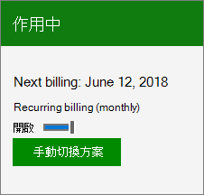

# Microsoft 365 vernieuwen voor bedrijvenRenew Microsoft 365 for business

Dit artikel is van toepassing op de meest betaalde Microsoft 365 voor zakelijke abonnementen.This article applies to most paid Microsoft 365 for business subscriptions.
  
Zie [Uw productcode zoeken en invoeren](../enter-your-product-key.md)als u wilt verlengen met een productcode die u bij een winkel of Microsoft-partner hebt gekocht.To renew by using a product key that you bought from a retail store or Microsoft partner, see [Find and enter your product key](../enter-your-product-key.md).

> [!NOTE]
> Betalen per bankrekening is niet beschikbaar in sommige landen of regio's.Paying by bank account isn't available in some countries or regions.
  
## Terugkerende facturering uitschakelen of inschakelenTurn Recurring billing off or on

Als u met een creditcard of bankrekening betaalt, is **Terugkerende facturering** standaard ingeschakeld.If you pay by credit card or bank account, **Recurring billing** is turned on by default. Wanneer **Terugkerende facturering** is ingeschakeld, wordt uw abonnement elk jaar op de dag dat u zich hebt geabonneerd, in rekening gebracht.When **Recurring billing** is on, your subscription will continue to be billed each year on the day you subscribed. U het uitschakelen of opnieuw inschakelen in het beheercentrum als uw abonnement actief is.You can turn it off or back on again in the admin center if your subscription is active.
  
Als u een prepaid abonnement hebt betaald met een productcode, verloopt uw abonnement aan het einde van de abonnementsperiode.If you prepaid for your subscription with a product key, your subscription will expire at the end of subscription term. U **Terugkerende facturering** inschakelen en creditcard- of bankrekeninggegevens verstrekken, zodat uw abonnement elk jaar op de dag dat u zich hebt geabonneerd, in rekening wordt gebracht.You can turn on **Recurring billing** and provide credit card or bank account information so that your subscription will continue to be billed every year on the day you subscribed. Je hebt ook de mogelijkheid om elke maand te betalen, of om het hele jaar vooraf te betalen.You also have the option to pay every month, or to pay for the entire year up front. Uw creditcard of bankrekening wordt pas in rekening gebracht nadat uw oorspronkelijke abonnementstermijn is verstreken.Your credit card or bank account will not be charged until your initial subscription term has expired.

::: moniker range="o365-worldwide"

1. Ga in het beheercentrum naar de pagina **Facturering** \> <a href="https://go.microsoft.com/fwlink/p/?linkid=842054" target="_blank">Producten en services</a>.In the admin center, go to the **Billing** \> <a href="https://go.microsoft.com/fwlink/p/?linkid=842054" target="_blank">Products & services</a> page.

2. Kies het abonnement waarvan u de terugkerende facturering wilt beheren.Choose the subscription for which you want to manage recurring billing.

3. Selecteer **onder Facturering**naast **Vernieuwing op** of Aflopen **op**bewerken . **edit**Under **Billing**, next to **Renews on** or **Expiring on**, select **edit**.

4. Selecteer In het deelvenster **Terugkerende factureringsinstellingen** de optie **Uitschakelen** om het uit te schakelen.In the **Recurring billing settings** pane, select **Turn OFF** to turn it off. Als terugkerende facturering al is uitgeschakeld, selecteert u **Maandelijks** of **Eenmaal** om deze in te schakelen.If recurring billing is already turned off, select **Monthly** or **Once** to turn it on.

5. Selecteer **Wijziging verzenden**.Select **Submit change**.

    > [!NOTE]
    > - U alleen de instelling **Terugkerende facturering** voor actieve abonnementen wijzigen.You can only change the **Recurring billing** setting for active subscriptions. Als uw abonnement al is verlopen of is uitgeschakeld, moet u [het opnieuw activeren](reactivate-your-subscription.md) voordat u Terugkerende **facturering** in- of uitschakelen.If your subscription has already expired or is disabled, you will need to [reactivate it](reactivate-your-subscription.md) before you can turn **Recurring billing** on or off.
    > - Wanneer **Terugkerende facturering** is uitgeschakeld, wordt het abonnement niet meteen opgezegd.When **Recurring billing** is turned off, the subscription isn't cancelled right away. Het blijft actief totdat het verloopt.It remains active until it expires. U de vervaldatum bekijken in het gedeelte **Facturering** van de abonnementsgegevens op de pagina **Producten & services.**You can view the expiration date in the **Billing** section of the subscription details on the **Products & services** page.
    > - Zie [Mijn abonnement opzeggen](cancel-your-subscription.md)voor meer informatie over het opzeggen van het abonnement.To learn how to cancel the subscription right away, see [Cancel my subscription](cancel-your-subscription.md).

::: moniker-end

::: moniker range="o365-germany"
  
1. Ga in het beheercentrum naar de pagina **Facturering**\><a href="https://go.microsoft.com/fwlink/p/?linkid=847745" target="_blank">Abonnementen</a>.In the admin center, go to the **Billing** \> <a href="https://go.microsoft.com/fwlink/p/?linkid=847745" target="_blank">Subscriptions</a> page.

2. Kies het abonnement waarvan u de terugkerende facturering wilt beheren.Choose the subscription for which you want to manage recurring billing.
 
3. Als u **Terugkerende facturering**wilt inschakelen, schakelt u over op **Aan**.To turn on **Recurring billing**, switch the toggle to **On**.

    
  
    U **Terugkerende facturering** uitschakelen door de schakelfunctie in **te schakelen**naar Uitschakelen.You can turn off **Recurring billing** by switching the toggle to **Off**.

    > [!NOTE]
    > - U alleen de instelling **Terugkerende facturering** voor actieve abonnementen wijzigen.You can only change the **Recurring billing** setting for active subscriptions. Als uw abonnement al is verlopen of is uitgeschakeld, moet u [het opnieuw activeren](reactivate-your-subscription.md) voordat u Terugkerende **facturering** in- of uitschakelen.If your subscription has already expired or is disabled, you will need to [reactivate it](reactivate-your-subscription.md) before you can turn **Recurring billing** on or off.
    > - Wanneer **Terugkerende facturering** is uitgeschakeld, wordt het abonnement niet meteen opgezegd.When **Recurring billing** is turned off, the subscription isn't cancelled right away. Het blijft actief totdat het verloopt.It remains active until it expires. U de vervaldatum bekijken op de abonnementskaartYou can view the expiration date on the subscription card
    > - Zie [Mijn abonnement opzeggen](cancel-your-subscription.md)voor meer informatie over het opzeggen van het abonnement.To learn how to cancel the subscription right away, see [Cancel my subscription](cancel-your-subscription.md).

::: moniker-end

::: moniker range="o365-21vianet"
  
1. Ga in het beheercentrum naar de pagina **Facturering**\><a href="https://go.microsoft.com/fwlink/p/?linkid=850626" target="_blank">Abonnementen</a>.In the admin center, go to the **Billing** \> <a href="https://go.microsoft.com/fwlink/p/?linkid=850626" target="_blank">Subscriptions</a> page.

2. Kies het abonnement waarvan u de terugkerende facturering wilt beheren.Choose the subscription for which you want to manage recurring billing.

3. Als u **Terugkerende facturering**wilt inschakelen, schakelt u over op **Aan**.To turn on **Recurring billing**, switch the toggle to **On**.

    
  
    U **Terugkerende facturering** uitschakelen door de schakelfunctie in **te schakelen**naar Uitschakelen.You can turn off **Recurring billing** by switching the toggle to **Off**.

    > [!NOTE]
    > - U alleen de instelling **Terugkerende facturering** voor actieve abonnementen wijzigen.You can only change the **Recurring billing** setting for active subscriptions. Als uw abonnement al is verlopen of is uitgeschakeld, moet u [het opnieuw activeren](reactivate-your-subscription.md) voordat u Terugkerende **facturering** in- of uitschakelen.If your subscription has already expired or is disabled, you will need to [reactivate it](reactivate-your-subscription.md) before you can turn **Recurring billing** on or off.
    > - Wanneer **Terugkerende facturering** is uitgeschakeld, wordt het abonnement niet meteen opgezegd.When **Recurring billing** is turned off, the subscription isn't cancelled right away. Het blijft actief totdat het verloopt.It remains active until it expires. U de vervaldatum bekijken op de abonnementskaart.You can view the expiration date on the subscription card.
    > - Zie [Mijn abonnement opzeggen](cancel-your-subscription.md)voor meer informatie over het opzeggen van het abonnement.To learn how to cancel the subscription right away, see [Cancel my subscription](cancel-your-subscription.md).

::: moniker-end

## Verwante artikelenRelated articles

[Uw abonnement opnieuw activerenReactivate your subscription](reactivate-your-subscription.md)
  
[Wat gebeurt er met mijn gegevens en toegang wanneer mijn abonnement afloopt?What happens to my data and access when my subscription ends?](what-if-my-subscription-expires.md)

[Uw betalingsmethoden toevoegen, bijwerken of verwijderenAdd, update, or remove your payment methods](../billing-and-payments/add-update-or-remove-credit-card-or-bank-account.md)

[Uw betalingsmethode wijzigenChange your payment method](../billing-and-payments/change-payment-method.md)
  
[Voer uw productcode inEnter your product key](../enter-your-product-key.md)
  
[Uw proefversie van Microsoft 365 voor bedrijven kopenBuy your trial version of Microsoft 365 for business](../buy-a-subscription-from-your-free-trial.md)