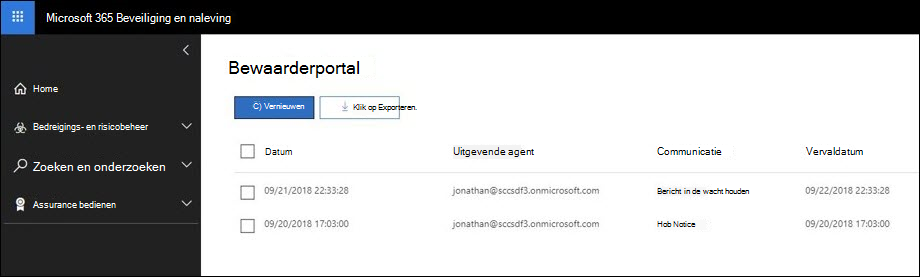

# Een bewaringsmelding bevestigenAcknowledge a hold notification

Wanneer u reageert op een regelgevend verzoek of onderzoek, moet u mogelijk de bewaarders informeren over hun verplichting om elektronisch opgeslagen gegevens (ESI) te bewaren en materiaal dat relevant kan zijn voor een actieve of op handen zijnde juridische kwestie.When responding to a regulatory request or investigation, you may be required to inform custodians of their obligation to preserve electronically stored information (ESI) and any material that may be relevant to an active or imminent legal matter. Zodra deze zijn verzonden, moeten juridische teams weten dat elke bewaarder de opgegeven instructies heeft ontvangen, gelezen, begrepen en heeft ingestemd met het volgen van de opgegeven instructies.Once sent, legal teams must know that each custodian has received, read, understood, and agreed to follow the given instructions.

Om de tijd, kosten en moeite van het volgen met uw beheerders te verminderen, kunt u Advanced eDiscovery meldingen over juridische wacht houden verzenden en volgen via e-mail.To help reduce the time, cost, and effort of following up with your custodians,  Advanced eDiscovery allows you to send and follow up on legal hold notifications through email. Naast e-mailmeldingen heeft elke bewaarder toegang tot een individuele complianceportal, zodat bewaarders op de hoogte kunnen worden gehouden van wijzigingen in hun verplichtingsstatus.In addition to email notices, each custodian will have access to an individualized Compliance Portal, allowing custodians to be kept informed of changes to their obligation status.

## E-mailmeldingenEmail notifications

Nadat een melding voor wettelijke bewaartermijn is uitgegeven, ontvangt elke bewaarder een unieke en persoonlijke e-mail met uw gedefinieerde kennisgeving van wettelijke bewaartermijn en toegevoegde instructies.After a Legal Hold Notification has been issued, each custodian will receive a unique and personalized email containing your defined legal hold notice and added instructions. 

> [!TIP]
> Bekijk hoe u de ingebouwde  [Communicatie-editor](using-communications-editor.md) kunt gebruiken om uw beheerders in staat te stellen hun kennisgeving te bevestigen of rechtstreeks vanuit hun e-mail toegang te krijgen tot hun complianceportal.See how you can use the built-in  [Communication Editor](using-communications-editor.md) to allow your custodians to acknowledge their notice or access their Compliance Portal directly from their email.

Op basis van de configuratie van uw melding over de wettelijke bewaartermijn kunnen uw bewaarders de volgende kennisgevingen ontvangen:Based on the configuration of your legal hold notification, your custodians may receive the following notices: 

- **Uitgiftebericht:** De eerste kennisgeving die naar uw voogd is verzonden.**Issuance notice:** The first notice sent to your custodian. Deze melding bevat de uitgifte-instructies en de aan het einde van het bericht toegevoegd aan de wachttermijn.This notice will contain your issuance instructions and the hold notice appended to the end of your message.

- **Herinneringsbericht:** Als dit is ingeschakeld, wordt er een herinneringsbericht verzonden naar uw beheerders op basis van de opgegeven frequentie en het interval.**Reminder notice:** If enabled, a reminder notice will be sent to your custodians based on the specified frequency and interval. De herinneringen blijven worden verzonden totdat de bewaarder zijn kennisgeving heeft bevestigd of totdat het aantal herinneringen is opgebruikt.The reminders will continue to be sent either until the custodian has acknowledged their notice or until the number of reminders have been exhausted.

- **Melding escalatie:** Als dit is ingeschakeld, wordt er een escalatiebericht verzonden naar uw voogd en hun manager nadat de herinneringsopzegingen zijn opgebruikt.**Escalation notice:** If enabled, an escalation notice will be sent to your custodian and their manager after the reminder notices have been exhausted. Het systeem verzendt automatisch escalatiemeldingen totdat het opgegeven aantal escalaties is voltooid of totdat de bewaarder de melding van de bewaartermijn heeft bevestigd.The system will automatically send escalation notices until the specified number of escalations have been completed or until the custodian acknowledges their hold notification.

- **Kennisgeving heruitgave:** Als tijdens een onderzoek de inhoud van de bewaartermijn wordt bijgewerkt, wordt de bijgewerkte melding automatisch naar de bewaarder verzonden.**Reissue notice:** During the course of an investigation, if the contents of the hold notice are updated, then the updated notice will automatically be sent to the custodian.

- **Releasebericht:** Wanneer een bewaarder uit de zaak wordt vrijgelaten, wordt deze de releaseverklaring verzonden.**Release notice:** When a custodian is released from the case, they'll be sent the release notice. 

## ComplianceportalCompliance Portal

Naast de e-mailmeldingen heeft elke bewaarder toegang tot een unieke complianceportal.In addition to the email notifications, each custodian will have access to a unique Compliance Portal. Via de portal kan elke bewaarder meldingen voor actieve wacht houden bekijken, openen en bevestigen.Through the portal, each custodian can view, access, and acknowledge their active hold notifications.

