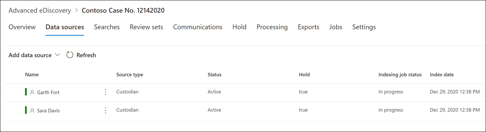

# Beheerders toevoegen aan een Advanced eDiscovery zaak

Gebruik het ingebouwde beheerprogramma voor beheerders in Advanced eDiscovery om uw werkstromen rond het beheren van beheerders te coördineren en relevante, bewaardergegevensbronnen te identificeren die aan een zaak zijn gekoppeld. Wanneer u een bewaarder toevoegt, kan het systeem automatisch het postvak en het Exchange in OneDrive voor Bedrijven houden. Tijdens het detectieproces van uw onderzoek kunt u ook andere gegevensbronnen identificeren (zoals postvakken, sites of Teams) die een bewaarder heeft geopend of heeft bijgedragen aan. In deze situatie kunt u het hulpprogramma voor beheer van beheerders gebruiken om deze gegevensbronnen te koppelen aan een specifieke bewaarder. Nadat u bewaarders aan een zaak hebt toevoegen en andere gegevensbron hieraan hebt koppelen, kunt u snel gegevens bewaren en de bewaargegevens doorzoeken.

In vier stappen kunt u beheerders in Advanced eDiscovery toevoegen en beheren:

1. Identificeer de bewaarders.

2. Kies bewaarlocaties voor gegevens.

3. Instellingen voor wacht houden configureren.

4. Controleer de bewaarders en voltooi het proces.

   

## Zorg ervoor dat u de benodigde machtigingen hebt

Als u beheerders aan een zaak wilt toevoegen, moet u lid zijn van de rollengroep eDiscovery Manager. Hiermee beschikt u over de benodigde machtigingen om beheerders toe te voegen aan een zaak en de bewaargegevensbronnen in de wacht te zetten. Zie [eDiscovery-machtigingen toewijzen](get-started-with-advanced-ediscovery.md#step-2-assign-ediscovery-permissions) voor meer informatie.

## Stap 1: beheerders identificeren

1. Ga naar en meld u aan met een gebruikersaccount dat is toegewezen aan de juiste [https://compliance.microsoft.com](https://compliance.microsoft.com) eDiscovery-machtigingen.

2. Klik in het linkernavigatiedeelvenster van het Microsoft 365 compliancecentrum op **Alles weergeven** en klik vervolgens op **eDiscovery > Geavanceerd.**

3. Klik op **Advanced eDiscovery** pagina op **het** tabblad Gevallen en selecteer vervolgens de zaak aan wie u bewaarders wilt toevoegen.

4. Klik op **het tabblad Gegevensbronnen** en klik vervolgens **op Gegevensbron toevoegen** Nieuwe beheerders  >  **toevoegen.**

5. Voeg een of meer gebruikers in uw organisatie als voogd toe aan de zaak door het eerste deel van de naam of alias van een persoon te typen. Nadat u de juiste persoon hebt gevonden, selecteert u de naam om deze toe te voegen aan de lijst.

## Stap 2: Locaties voor bewaargegevens kiezen

Nadat u beheerders hebt geselecteerd, probeert het systeem deze gebruikers en hun gegevensbronnen automatisch te identificeren en te verifiëren. Nadat u beheerders aan de lijst hebt toegevoegd, bevat het hulpprogramma automatisch het primaire postvak en OneDrive account voor elke bewaarder. U kunt ervoor kiezen deze gegevensbronnen niet op te nemen wanneer u beheerders toevoegt aan de zaak.

Naast het postvak en OneDrive-account van een bewaarder kunt u ook andere gegevenslocaties koppelen aan een bewaarder, zoals een SharePoint-site of een Microsoft-team waar de bewaarder lid van is. Op deze manier kunt u inhoud bewaren, verzamelen, analyseren en controleren in andere gegevensbronnen die zijn gekoppeld aan de bewaarders van de zaak.

Deselecteer het primaire postvak en OneDrive account voor een bewaarder:

1. Vouw de bewaarder uit om de primaire gegevenslocaties weer te geven die automatisch aan elke bewaarder zijn gekoppeld.

2. Selecteer **Verwijderen** naast **Postvak** of **OneDrive** om te verwijderen dat het postvak of OneDrive account van een beheerder is gekoppeld aan een gegevenslocatie voor deze bewaarder.

   

Als u andere postvakken, sites, Teams of Yammer wilt koppelen aan een specifieke bewaarder:

1. Vouw een bewaarder uit om de volgende services weer te geven om gegevenslocaties te koppelen aan de bewaarder. Klik **op Bewerken** naast een service om een gegevenslocatie toe te voegen.

   - **Exchange:** Gebruik dit om andere postvakken aan de beheerder te koppelen. Typ in het zoekvak de naam of alias (minimaal drie tekens) van gebruikerspostvakken of distributiegroepen. Selecteer de postvakken die u wilt toewijzen aan de beheerder en klik vervolgens op **Toevoegen.**

   - **SharePoint**: Gebruik deze SharePoint sites aan de beheerder. Selecteer een site in de lijst of zoek naar een site door een URL in het zoekvak te typen. Selecteer de sites die u wilt toewijzen aan de beheerder en klik vervolgens op **Toevoegen.**

   - **Teams**: Gebruik dit om de Microsoft Teams toe te wijzen waar de bewaarder momenteel lid van is. Selecteer de teams die u wilt toewijzen aan de bewaarder en klik vervolgens op **Toevoegen.** Nadat u een team hebt toevoegen, identificeert en zoekt het systeem automatisch de SharePoint site en het groepspostvak die aan dat team zijn gekoppeld en wijst het deze toe aan de beheerder.

   - **Yammer**: Gebruik deze Yammer groepen waar de bewaarder momenteel lid van is. Selecteer de groepen die u wilt toewijzen aan de beheerder en klik vervolgens op **Toevoegen.** Nadat u een team hebt toevoegen, identificeert en zoekt het systeem automatisch de SharePoint site en het groepspostvak dat aan die groep is gekoppeld en wijst het deze toe aan de beheerder.

   > [!NOTE]
   > U kunt de **Exchange** en **SharePoint** locatie pickers gebruiken om andere teams of Yammer groepen (waar een bewaarder geen lid van is) aan een bewaarder te koppelen. Hiervoor moet u zowel het postvak als de site toevoegen die aan elk team of elke groep Yammer gekoppeld.

2. U kunt het totale aantal postvakken, sites, Teams en Yammer groepen weergeven dat aan elke bewaarder is toegewezen door elke bewaarder in de tabel uit te breiden. Wanneer u de toegewezen gegevenslocaties voor elke bewaarder hebt afgerond, worden deze associaties bijgehouden en gebruikt tijdens het verzamelen, verwerken en controleren van stadia in de Advanced eDiscovery werkstroom.

3. Nadat u beheerders hebt toegevoegd en hun gegevenslocaties hebt geconfigureerd, klikt u op **Volgende** om naar de pagina Instellingen voor wacht **houden te** gaan.  

## Stap 3: Instellingen voor wacht houden configureren

 Nadat u de bewaarders en hun gegevenslocaties hebt afgerond, kunt u sommige of alle bewaarders in de wachtstand plaatsen. Wanneer u een bewaarder in de wacht zet, blijft alle inhoud op alle inhoudslocaties die aan de bewaarder zijn gekoppeld, bewaard totdat u de bewaarplaats verwijdert of de bewaarder uit de wacht houdt. In sommige gevallen wilt u mogelijk beheerders toevoegen aan een zaak zonder ze in de wacht te zetten.

De bewaarders en gegevensbronnen in de wacht zetten:

1. Op de **pagina Instellingen in** wacht houden kunt u een hold toepassen op afzonderlijke beheerders door het selectievakje onder de kolom Wacht houden in **te** selecteren.

   U kunt ook alle bewaarders in de wacht zetten door het **selectievakje** Wacht houden boven aan de kolom in te selecteren.

2. Controleer de bewaarselecties en klik vervolgens op **Volgende.**

   > [!NOTE]
   > Als u een bewaarder niet in de wacht houdt, worden de bewaarder en de bijbehorende gegevensbronnen aan de zaak toegevoegd, maar blijft de inhoud in deze gegevensbronnen niet behouden door de bewaarplaats die aan de zaak is gekoppeld.

## Stap 4: De beheerders controleren en het proces voltooien

Voordat u de bewaarders daadwerkelijk aan de zaak toevoegt, kunt u de lijst met bewaarders, de gegevenslocaties die aan hen zijn toegewezen en de bewaarinstellingen bekijken.

1. Controleer en controleer het aantal gegevensbronnen en de bewaarinstelling die is gekoppeld aan elke bewaarder in de tabel. Ga zo nodig terug naar de  **pagina's Instellingen** identificeren of Bewaren om wijzigingen aan te brengen.

2. Klik **op Verzenden** om bewaarders en hun gegevenslocaties aan de zaak toe te voegen en alle instellingen voor bewaarzorg toe te passen.

   De nieuwe bewaarders worden toegevoegd aan de zaak en worden weergegeven op het **tabblad Gegevensbronnen.**

   
