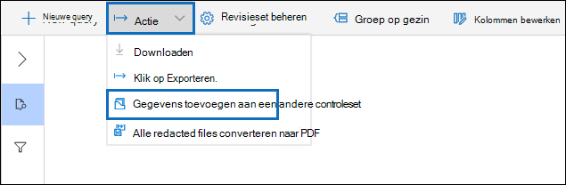
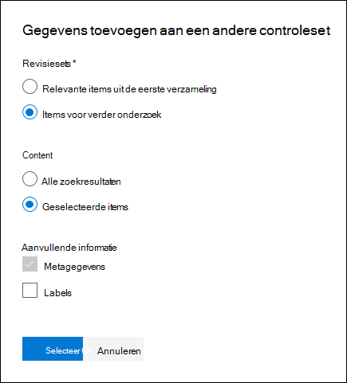

# Gegevens toevoegen aan een revisieset uit een andere revisieset

In sommige gevallen kan het nodig zijn om documenten uit de ene revisieset te selecteren en er afzonderlijk mee te werken in een andere revisieset. Dit is vooral handig als u inhoud hebt weggeruimd in een revisieset en analyses wilt uitvoeren op de subset met gegevens.

Volg de werkstroom in dit artikel om inhoud van de ene revisieset toe te voegen aan een andere.

## Een revisieset maken

Voordat u begint, moet u een revisieset maken om de gegevens aan toe te voegen.  Er kan een nieuwe revisieset worden toegevoegd op het tabblad **Revisiesets** van de zaak. Zie Een [revisieset maken voor meer informatie.](managing-review-sets.md#create-a-review-set)

## Stap 1: Inhoud identificeren die u wilt toevoegen aan een andere revisieset

U kunt inhoud uit de ene revisieset toevoegen aan een andere door specifieke documenten in de bronbeoordelingsset te selecteren of door alle items te selecteren die worden geretourneerd door de query Revisieset. Als u geselecteerde items toevoegt, selecteert u de items, **selecteert** u Actie en selecteert u **Toevoegen aan een andere revisieset.**

## Stap 2: Opties opgeven voor het toevoegen aan een andere revisieset

Kies op de flyoutpagina Opties voor een andere **revisieset** toevoegen de revisieset aan wie u de items wilt toevoegen. Kies of u Alle **zoekresultaten of** Geselecteerde items **wilt toevoegen.**  **Aanvullende informatie** bevat opties voor het opnemen van alle metagegevens  van de items en het opnemen van de tags (door het selectievakje Etiketten in te stellen) uit de broncontroleset wanneer de documenten worden toegevoegd aan de nieuwe revisieset.  

Nadat u op **Ok hebt geklikt,** wordt er een nieuwe taak (met de naam **Gegevens** toevoegen aan een andere revisieset) gemaakt om de inhoud toe te voegen aan een andere revisieset. U kunt naar het tabblad **Taken** gaan en de voortgang van deze taak controleren. Zie Taken [beheren voor meer informatie.](managing-jobs-ediscovery20.md)
