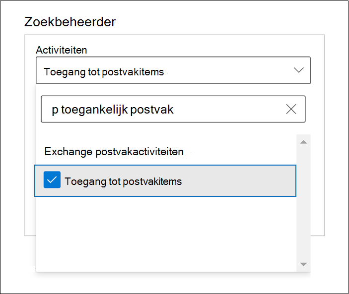
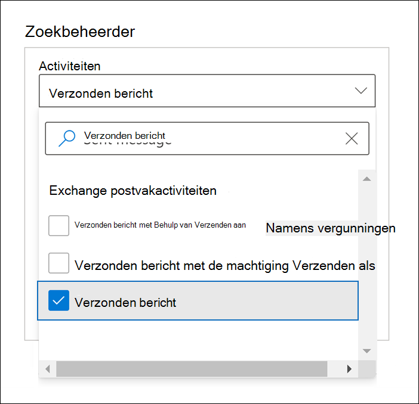
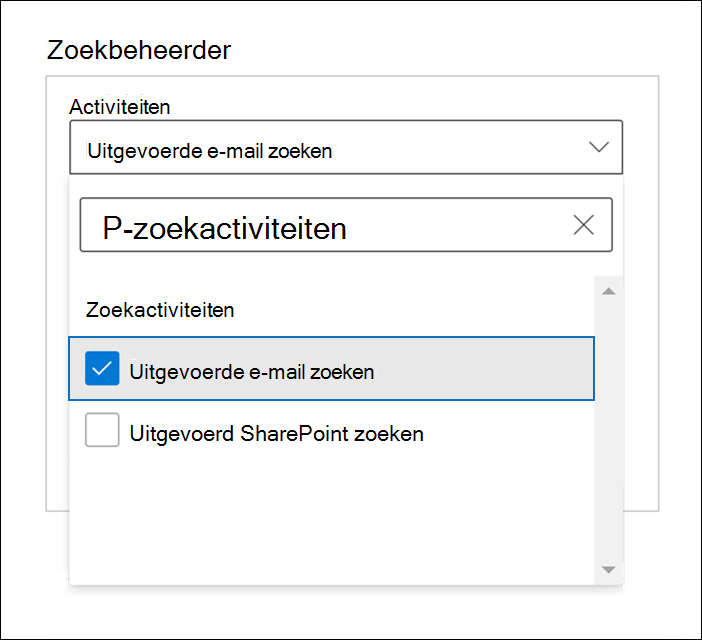
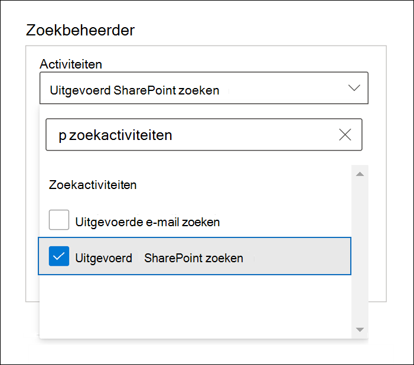

# Geavanceerde audit in Microsoft 365Advanced Audit in Microsoft 365

De [geïntegreerde auditfunctionaliteit](search-the-audit-log-in-security-and-compliance.md) in Microsoft 365 biedt organisaties inzicht in vele soorten gecontroleerde activiteiten voor veel verschillende services in Microsoft 365.The [unified auditing functionality](search-the-audit-log-in-security-and-compliance.md) in Microsoft 365 provides organizations with visibility into many types of audited activities across many different services in Microsoft 365. Met Geavanceerde audit kunnen organisaties forensisch en complianceonderzoek uitvoeren door de auditlogboekretentie te verhogen die nodig is voor het uitvoeren van een onderzoek. Hiermee heb je toegang tot belangrijke gebeurtenissen waarmee de omvang van de inbreuk kan worden bepaald en je sneller toegang hebt tot de Office 365 Management Activity-API.Advanced Audit helps organizations to conduct forensic and compliance investigations by increasing audit log retention required to conduct an investigation, providing access to crucial events that help determine scope of compromise, and faster access to Office 365 Management Activity API.

> [!NOTE]
> Geavanceerde audit is beschikbaar voor organisaties met een Office 365 E5/A5/G5- of Microsoft 365 Enterprise E5/A5/G5-abonnement.Advanced Audit is available for organizations with an Office 365 E5/A5/G5 or Microsoft 365 Enterprise E5/A5/G5 subscription. Daarnaast kan een Microsoft 365 E5/A5/G5 Compliance- of E5/A5/G5 eDiscovery and Audit-add-on-licentie worden toegewezen aan gebruikers wanneer een licentie per gebruiker vereist is voor Geavanceerde audit-functies, zoals langetermijnretentie van auditlogboeken en toegang tot belangrijke gebeurtenissen voor onderzoeken.Additionally, a Microsoft 365 E5/A5/G5 Compliance or E5/A5/G5 eDiscovery and Audit add-on license can be assigned to users when per-user licensing is required for Advanced Audit features as is the case for long-term retention of audit logs and access to crucial events for investigations. Zie voor meer informatie over licenties:For more information about licensing, see: - [Licentievereisten voor Geavanceerde audit](auditing-solutions-overview.md#licensing-requirements)- [Advanced Audit licensing requirements](auditing-solutions-overview.md#licensing-requirements) - [Richtlijnen voor Microsoft 365-licenties voor beveiliging en compliance](/office365/servicedescriptions/microsoft-365-service-descriptions/microsoft-365-tenantlevel-services-licensing-guidance/microsoft-365-security-compliance-licensing-guidance#advanced-audit).- [Microsoft 365 licensing guidance for security & compliance](/office365/servicedescriptions/microsoft-365-service-descriptions/microsoft-365-tenantlevel-services-licensing-guidance/microsoft-365-security-compliance-licensing-guidance#advanced-audit).

In dit artikel vind je een overzicht van de Geavanceerde audit-mogelijkheden en wordt beschreven hoe je gebruikers kunt instellen voor Geavanceerde audit.This article provides an overview of Advanced Audit capabilities and shows you how to set up users for Advanced Audit.

## Langetermijnretentie van auditlogboekenLong-term retention of audit logs

Met Geavanceerde audit blijven alle Exchange-, SharePoint- en Azure Active Directory-auditrecords één jaar bewaard.Advanced Audit retains all Exchange, SharePoint, and Azure Active Directory audit records for one year. Dit gebeurt via een standaardbewaarbeleid voor auditlogboeken waarin auditrecords gedurende één jaar worden bewaard die de waarde van **Exchange**, **SharePoint** of **AzureActiveDirectory** bevatten voor de eigenschap **Workload** (waarmee de service wordt aangegeven waarin de activiteit heeft plaatsgevonden).This is accomplished by a default audit log retention policy that retains any audit record that contains the value of **Exchange**, **SharePoint**, or **AzureActiveDirectory** for the **Workload** property (which indicates the service in which the activity occurred) for one year. Als auditrecords langer worden bewaard, kan dit handig zijn voor doorlopend forensisch en complianceonderzoek.Retaining audit records for longer periods can help with on-going forensic or compliance investigations. Zie de sectie 'Standaardbewaarbeleid voor auditlogboeken' in [Bewaarbeleid voor auditlogboek beheren](audit-log-retention-policies.md#default-audit-log-retention-policy).For more information, see the "Default audit log retention policy" section in [Manage audit log retention policies](audit-log-retention-policies.md#default-audit-log-retention-policy).

Binnenkort is er ook een optie beschikbaar om auditlogboeken tien jaar te bewaren.We're also releasing the capability to retain audit logs for 10 years. Dit is handig bij langetermijnonderzoeken en u kunt zo snel voldoen aan wettelijke en interne verplichtingen.The 10-year retention of audit logs helps support long running investigations and respond to regulatory, legal, and internal obligations.

> [!NOTE]
> Als u auditlogboeken tien jaar wilt bewaren, hebt u een extra licentie voor de invoegtoepassing nodig.Retaining audit logs for 10 years will require an additional add-on license. Zie de [veelgestelde vragen over Geavanceerde audit](#faqs-for-advanced-audit) in dit artikel voor meer informatie.For more information, see the [FAQs for Advanced Audit](#faqs-for-advanced-audit) section in this article.

### Bewaarbeleid voor auditlogboeken beherenAudit log retention policies

Alle auditrecords die worden gegenereerd in andere services die niet vallen onder het standaardbewaarbeleid voor auditlogboeken (beschreven in de vorige sectie), worden 90 dagen bewaard.All audit records generated in other services that aren't covered by the default audit log retention policy (described in the previous section) are retained for 90 days. Maar u kunt aangepast bewaarbeleid voor auditlogboeken maken om andere auditrecords gedurende langere perioden tot tien jaar te bewaren.But you can create customized audit log retention policies to retain other audit records for longer periods of time up to 10 years. U kunt een beleid maken om auditrecords te bewaren op basis van een of meer van de volgende criteria:You can create a policy to retain audit records based on one or more of the following criteria:

- De Microsoft 365-service waar de gecontroleerde activiteiten plaatsvinden.The Microsoft 365 service where the audited activities occur.

- Specifieke gecontroleerde activiteiten.Specific audited activities.

- De gebruiker die een gecontroleerde activiteit uitvoert.The user who performs an audited activity.

U kunt ook opgeven hoelang u auditrecords die overeenkomen met het beleid en een prioriteitsniveau, wilt bewaren, zodat specifiek beleid prioriteit krijgt boven ander beleid.You can also specify how long to retain audit records that match the policy and a priority level so that specific policies will take priority over other policies. Elk aangepast bewaarbeleid voor auditlogboeken heeft voorrang op het standaardbewaarbeleid voor auditlogboeken als u Exchange-, SharePoint- of Azure Active Directory-auditrecords minder dan een jaar (of gedurende tien jaar) wilt bewaren voor bepaalde of alle gebruikers in uw organisatie.Also note that any custom audit log retention policy will take precedence over the default audit retention policy in case you need retain Exchange, SharePoint, or Azure Active Directory audit records for less than a year (or for 10 years) for some or all users in your organization. Zie [Bewaarbeleid voor auditlogboeken beheren](audit-log-retention-policies.md) voor meer informatie.For more information, see [Manage audit log retention policies](audit-log-retention-policies.md).

## Toegang tot belangrijke gebeurtenissen voor onderzoekenAccess to crucial events for investigations

Met Geavanceerde audit kunnen organisaties forensisch en complianceonderzoek uitvoeren door toegang te bieden tot belangrijke gebeurtenissen, zoals wanneer e-mailitems zijn geopend, beantwoord en doorgestuurd, en wanneer en wat een gebruiker heeft gezocht in Exchange Online en SharePoint Online.Advanced Audit helps organizations to conduct forensic and compliance investigations by providing access to crucial events such as when mail items were accessed, or when mail items were replied to and forwarded, and when and what a user searched for in Exchange Online and SharePoint Online. Aan de hand van deze belangrijke gebeurtenissen kunt u mogelijke schendingen onderzoeken en de omvang van de inbreuk bepalen.These crucial events can help you investigate possible breaches and determine the scope of compromise.  Geavanceerde audit bevat de volgende belangrijke gebeurtenissen:Advanced Auditing provides the following crucial events:

- [MailItemsAccessedMailItemsAccessed](#mailitemsaccessed)

- [SendSend](#send)

- [SearchQueryInitiatedExchange](#searchqueryinitiatedexchange)\*[SearchQueryInitiatedExchange](#searchqueryinitiatedexchange)\*

- [SearchQueryInitiatedSharePoint](#searchqueryinitiatedsharepoint)\*[SearchQueryInitiatedSharePoint](#searchqueryinitiatedsharepoint)\*

> [!NOTE]
> \* Op dit moment is deze gebeurtenis niet beschikbaar in Office 365- en Microsoft 365 Government-omgevingen.\* At this time, this event isn't available in Office 365 and Microsoft 365 Government environments. Dit geldt ook voor GCC-, GCC High- en DoD-omgevingen.This includes GCC, GCC High, and DoD environments.

### MailItemsAccessedMailItemsAccessed

De gebeurtenis MailItemsAccessed is een auditactie voor postvakken en wordt geactiveerd wanneer e-mailgegevens worden gebruikt door e-mailprotocollen en e-mailclients.The MailItemsAccessed event is a mailbox auditing action and is triggered when mail data is accessed by mail protocols and mail clients. Met behulp van de actie MailItemsAccessed kunnen onderzoekers gegevenslekken identificeren en de omvang bepalen van berichten die mogelijk zijn gecompromitteerd.The MailItemsAccessed action can help investigators identify data breaches and determine the scope of messages that may have been compromised. Als een kwaadwillende gebruiker toegang heeft gekregen tot e-mailberichten, wordt de actie MailItemsAccessed geactiveerd, ook als er geen expliciet signaal is dat berichten daadwerkelijk zijn gelezen (met andere woorden het type toegang zoals een binding of synchronisatie wordt vastgelegd in de auditrecord).If an attacker gained access to email messages, the MailItemsAccessed action will be triggered even if there is no explicit signal that messages were actually read (in other words, the type of access such as a bind or sync is recorded in the audit record).

De postvakactie MailItemsAccessed vervangt MessageBind in de logboekregistratie voor postvakcontrole in Exchange Online en is op de volgende punten verbeterd:The MailItemsAccessed mailbox action replaces MessageBind in mailbox auditing logging in Exchange Online and provides these improvements:

- MessageBind kon alleen worden geconfigureerd voor het aanmeldingstype van de AuditAdmin-gebruiker en was niet van toepassing op acties van gedelegeerden of eigenaren.MessageBind was only configurable for AuditAdmin user logon type; it did not apply to delegate or owner actions. MailItemsAccessed is van toepassing op alle aanmeldingstypen.MailItemsAccessed applies to all logon types.

- MessageBind kon alleen worden gebruikt door een e-mailclient.MessageBind only covered access by a mail client. De actie was niet van toepassing op synchronisatieactiviteiten.It didn't apply to sync activities. MailItemsAccessed-gebeurtenissen worden geactiveerd door de toegangstypen binding en synchronisatie.MailItemsAccessed events are triggered by both bind and sync access types.

- Door MessageBind-acties werden er meerdere auditrecords gemaakt wanneer hetzelfde e-mailbericht werd geopend, waardoor de audit onsamenhangend werd.MessageBind actions would trigger the creation of multiple audit records when the same email message was accessed, which resulted in auditing "noise". MailItemsAccessed-gebeurtenissen worden echter samengevoegd in minder auditrecords.In contrast, MailItemsAccessed events are aggregated into fewer audit records.

Zie [Geavanceerde audit gebruiken om gecompromitteerde accounts te onderzoeken](mailitemsaccessed-forensics-investigations.md) voor informatie over auditrecords voor MailItemsAccessed-activiteiten.For information about audit records for MailItemsAccessed activities, see [Use Advanced Audit to investigate compromised accounts](mailitemsaccessed-forensics-investigations.md).

Als u MailItemsAccessed-auditrecords wilt zoeken, kunt u zoeken naar de activiteit **Geopende postvakitems** in de vervolgkeuzelijst **Activiteiten in Exchange-postvak** in het [hulpprogramma Zoeken in auditlogboek](search-the-audit-log-in-security-and-compliance.md) in het Microsoft 365-compliancecentrum.To search for MailItemsAccessed audit records, you can search for the **Accessed mailbox items** activity in the **Exchange mailbox activities** drop-down list in the [audit log search tool](search-the-audit-log-in-security-and-compliance.md) in the Microsoft 365 compliance center.

U kunt ook de opdracht [Search-UnifiedAuditLog -Operations MailItemsAccessed](/powershell/module/exchange/search-unifiedauditlog) of [Search-MailboxAuditLog -Operations MailItemsAccessed](/powershell/module/exchange/search-mailboxauditlog) uitvoeren in Exchange Online PowerShell.You can also run the [Search-UnifiedAuditLog -Operations MailItemsAccessed](/powershell/module/exchange/search-unifiedauditlog) or [Search-MailboxAuditLog -Operations MailItemsAccessed](/powershell/module/exchange/search-mailboxauditlog) commands in Exchange Online PowerShell.

### SendSend

De gebeurtenis Send is ook een auditactie voor postvakken en wordt geactiveerd wanneer een gebruiker een van de volgende acties uitvoert:The Send event is also a mailbox auditing action and is triggered when a user performs one of the following actions:

- Een e-mailbericht verzendtSends an email message

- Een e-mailbericht beantwoordtReplies to an email message

- Een e-mailbericht doorstuurtForwards an email message

Onderzoekers kunnen met behulp van de gebeurtenis Send e-mail identificeren die is verzonden vanaf een gecompromitteerd account.Investigators can use the Send event to identify email sent from a compromised account. De auditrecord voor een Send-gebeurtenis bevat informatie over het bericht, zoals wanneer het bericht is verzonden, de InternetMessage-id, de onderwerpregel en of het bericht bijlagen bevat.The audit record for a Send event contains information about the message, such as when the message was sent, the InternetMessage ID, the subject line, and if the message contained attachments. Met deze auditgegevens kunnen onderzoekers informatie identificeren over e-mailberichten die zijn verzonden vanaf een gecompromitteerd account of door kwaadwillende gebruikers.This auditing information can help investigators identify information about email messages sent from a compromised account or sent by an attacker. Bovendien kunnen onderzoekers een Microsoft 365 eDiscovery-hulpprogramma gebruiken om te zoeken naar het bericht (met behulp van de onderwerpregel of bericht-id) om de geadresseerden te identificeren naar wie het bericht is verzonden en de werkelijke inhoud van het verzonden bericht.Additionally, investigators can use a Microsoft 365 eDiscovery tool to search for the message (by using the subject line or message ID) to identify the recipients the message was sent to and the actual contents of the sent message.

Als u verzonden auditrecords wilt zoeken, kunt u zoeken naar de activiteit **Verzonden bericht** in de vervolgkeuzelijst **Activiteiten in Exchange-postvak** in het [hulpprogramma Zoeken in auditlogboek](search-the-audit-log-in-security-and-compliance.md) in het Microsoft 365-compliancecentrum.To search for Send audit records, you can search for the **Sent message** activity in the **Exchange mailbox activities** drop-down list in the [audit log search tool](search-the-audit-log-in-security-and-compliance.md) in the Microsoft 365 compliance center.

U kunt ook de opdracht [Search-UnifiedAuditLog -Operations Send](/powershell/module/exchange/search-unifiedauditlog) of [Search-MailboxAuditLog -Operations Send](/powershell/module/exchange/search-mailboxauditlog) uitvoeren in Exchange Online PowerShell.You can also run the [Search-UnifiedAuditLog -Operations Send](/powershell/module/exchange/search-unifiedauditlog) or [Search-MailboxAuditLog -Operations Send](/powershell/module/exchange/search-mailboxauditlog) commands in Exchange Online PowerShell.

### SearchQueryInitiatedExchangeSearchQueryInitiatedExchange

De gebeurtenis SearchQueryInitiatedExchange wordt geactiveerd wanneer een persoon Outlook gebruikt om te zoeken naar items in een postvak.The SearchQueryInitiatedExchange event is triggered when a person uses Outlook to search for items in a mailbox. Gebeurtenissen worden geactiveerd wanneer zoekopdrachten worden uitgevoerd in de volgende Outlook-omgevingen:Events are triggered when searches are performed in the following Outlook environments:

- Outlook (desktopclient)Outlook (desktop client)

- De webversie van OutlookOutlook on the web (OWA)

- Outlook voor iOSOutlook for iOS

- Outlook voor AndroidOutlook for Android

- Mail-app voor Windows 10Mail app for Windows 10

Onderzoekers kunnen via de gebeurtenis SearchQueryInitiatedExchange nagaan of een kwaadwillende gebruiker die mogelijk een account heeft gecompromitteerd, in het postvak heeft gezocht naar of geprobeerd toegang te krijgen tot gevoelige informatie.Investigators can use the SearchQueryInitiatedExchange event to determine if an attacker who may have compromised an account looked for or tried to access sensitive information in the mailbox. De auditrecord voor een gebeurtenis SearchQueryInitiatedExchange bevat informatie zoals de werkelijke tekst van de zoekquery.The audit record for a SearchQueryInitiatedExchange event contains information such as the actual text of the search query. De auditrecord geeft ook aan in welke Outlook-omgeving de zoekopdracht is uitgevoerd.The audit record also indicates the Outlook environment the search was performed in. Door de zoekquery's te analyseren die een kwaadwillende gebruiker mogelijk heeft uitgevoerd, kan een onderzoeker beter begrijpen waarom er naar bepaalde e-mailgegevens zijn gezocht.By looking at the search queries that an attacker may have performed, an investigator can better understand the intent of the email data that was searched for.

Als u SearchQueryInitiatedExchange-auditrecords wilt zoeken, kunt u zoeken naar de activiteit **Uitgevoerde zoekopdracht in e-mail** in de vervolgkeuzelijst **Activiteiten zoeken** in het [hulpprogramma Zoeken in auditlogboek](search-the-audit-log-in-security-and-compliance.md) in het compliancecentrum.To search for SearchQueryInitiatedExchange audit records, you can search for the **Performed email search** activity in the **Search activities** drop-down list in the [audit log search tool](search-the-audit-log-in-security-and-compliance.md) in the compliance center.

Je kunt ook de opdracht [Search-UnifiedAuditLog -Operations SearchQueryInitiatedExchange](/powershell/module/exchange/search-unifiedauditlog) uitvoeren in Exchange Online PowerShell.You can also run the [Search-UnifiedAuditLog -Operations SearchQueryInitiatedExchange](/powershell/module/exchange/search-unifiedauditlog) in Exchange Online PowerShell.

> [!NOTE]
> Je moet logboekregistratie inschakelen voor SearchQueryInitiatedExchange, zodat je deze gebeurtenis kunt zoeken in het auditlogboek.You must enable SearchQueryInitiatedExchange to be logged so you can search for this event in the audit log. Zie [Geavanceerde audit instellen](set-up-advanced-audit.md#step-2-enable-crucial-events) voor instructies.For instructions, see [Set up Advanced Audit](set-up-advanced-audit.md#step-2-enable-crucial-events).

### SearchQueryInitiatedSharePointSearchQueryInitiatedSharePoint

Net als bij het zoeken naar postvakitems wordt de gebeurtenis SearchQueryInitiatedSharePoint geactiveerd wanneer een persoon naar items zoekt in SharePoint.Similar to searching for mailbox items, the SearchQueryInitiatedSharePoint event is triggered when a person searches for items in SharePoint. Gebeurtenissen worden geactiveerd wanneer zoekopdrachten worden uitgevoerd in de volgende typen SharePoint-sites:Events are triggered when searches are performed in the following types of SharePoint sites:

- StartsitesHome sites

- CommunicatiesitesCommunication sites

- HubsitesHub sites

- Sites die zijn gekoppeld aan Microsoft TeamsSites associated with Microsoft Teams

Onderzoekers kunnen met behulp van de gebeurtenis SearchQueryInitiatedSharePoint nagaan of een kwaadwillende gebruiker naar gevoelige informatie heeft gezocht (en mogelijk hier toegang toe heeft gekregen) in SharePoint.Investigators can use the SearchQueryInitiatedSharePoint event to determine if an attacker tried to find (and possibly accessed) sensitive information in SharePoint. De auditrecord voor een gebeurtenis SearchQueryInitiatedSharePoint bevat ook informatie zoals de werkelijke tekst van de zoekquery.The audit record for a SearchQueryInitiatedSharePoint event contains also contains the actual text of the search query. De auditrecord geeft ook aan welk type SharePoint-site is doorzocht.The audit record also indicates the type of SharePoint site that was searched. Door de zoekquery's te analyseren die een kwaadwillende gebruiker mogelijk heeft uitgevoerd, kan een onderzoeker beter begrijpen waarom en in welke mate er naar bepaalde bestandsgegevens zijn gezocht.By looking at the search queries that an attacker may have performed, an investigator can better understand the intent and scope of the file data being searched for.

Als u SearchQueryInitiatedSharePoint-auditrecords wilt zoeken, kunt u zoeken naar de activiteit **Uitgevoerde zoekopdracht in SharePoint** in de vervolgkeuzelijst **Activiteiten zoeken** in het [hulpprogramma Zoeken in auditlogboek](search-the-audit-log-in-security-and-compliance.md) in het compliancecentrum.To search for SearchQueryInitiatedSharePoint audit records, you can search for the **Performed SharePoint search** activity in the **Search activities** drop-down list in the [audit log search tool](search-the-audit-log-in-security-and-compliance.md) in the compliance center.

Je kunt ook de opdracht [Search-UnifiedAuditLog -Operations SearchQueryInitiatedSharePoint](/powershell/module/exchange/search-unifiedauditlog) uitvoeren in Exchange Online PowerShell.You can also run the [Search-UnifiedAuditLog -Operations SearchQueryInitiatedSharePoint](/powershell/module/exchange/search-unifiedauditlog) in Exchange Online PowerShell.

> [!NOTE]
> Je moet logboekregistratie inschakelen voor SearchQueryInitiatedSharePoint, zodat je deze gebeurtenis kunt zoeken in het auditlogboek.You must enable SearchQueryInitiatedSharePoint to be logged so you can search for this event in the audit log. Zie [Geavanceerde audit instellen](set-up-advanced-audit.md#step-2-enable-crucial-events) voor instructies.For instructions, see [Set up Advanced Audit](set-up-advanced-audit.md#step-2-enable-crucial-events).

## Toegang met hoge bandbreedte tot de Office 365 Management Activity-APIHigh-bandwidth access to the Office 365 Management Activity API

Organisaties met toegang tot auditlogboeken via de Office 365 Management Activity-API hadden te maken met beperkingslimieten op uitgeversniveau.Organizations that access auditing logs through the Office 365 Management Activity API were restricted by throttling limits at the publisher level. Dit betekent dat voor een uitgever die gegevens ophaalt namens meerdere klanten, de limiet werd gedeeld door al die klanten.This means that for a publisher pulling data on behalf of multiple customers, the limit was shared by all those customers.

Met de release van Geavanceerde audit gaan we over van een limiet op uitgeversniveau naar een limiet op tenantniveau.With the release of Advanced Audit, we're moving from a publisher-level limit to a tenant-level limit. Hierdoor krijgt elke organisatie een eigen, volledig toegewezen bandbreedtequotum voor toegang tot de auditgegevens.The result is that each organization will get their own fully allocated bandwidth quota to access their auditing data. De bandbreedte is geen statische, vooraf gedefinieerde limiet, maar is gebaseerd op een combinatie van factoren, waaronder het aantal seats in de organisatie en dat E5/A5/G5-organisaties meer bandbreedte krijgen dan niet-E5/A5/G5-organisaties.The bandwidth is not a static, predefined limit but is modeled on a combination of factors including the number of seats in the organization and that E5/A5/G5 organizations will get more bandwidth than non-E5/A5/G5 organizations.

Aan alle organisaties wordt in eerste instantie een basislijn van 2000 aanvragen per minuut toegewezen.All organizations are initially allocated a baseline of 2,000 requests per minute. Deze limiet wordt dynamisch verhoogd, afhankelijk van het aantal seats en het licentieabonnement van een organisatie.This limit will dynamically increase depending on an organization's seat count and their licensing subscription. E5/A5/G5-organisaties krijgen ongeveer twee keer zoveel bandbreedte als niet-E5/A5/G5-organisaties.E5/A5/G5 organizations will get about twice as much bandwidth as non-E5/A5/G5 organizations. Er is ook een limiet voor de maximale bandbreedte om de status van de service te beschermen.There will also be cap on the maximum bandwidth to protect the health of the service.

Zie de sectie over API-beperking in de Engelstalige [Office 365 Management Activity-API-handleiding](/office/office-365-management-api/office-365-management-activity-api-reference#api-throttling) voor meer informatie.For more information, see the "API throttling" section in [Office 365 Management Activity API reference](/office/office-365-management-api/office-365-management-activity-api-reference#api-throttling).

## Veelgestelde vragen over Geavanceerde auditFAQs for Advanced Audit

**Heeft elke gebruiker een E5/A5/G5-licentie nodig om gebruik te kunnen maken van Geavanceerde audit?****Does every user need an E5/A5/G5 license to benefit from Advanced Audit?**

Om gebruik te kunnen maken van Geavanceerde audit-mogelijkheden op gebruikersniveau, moet aan een gebruiker een E5/A5/G5-licentie zijn toegewezen.To benefit from user-level Advanced Audit capabilities, a user needs to be assigned an E5/A5/G5 license. Er zijn bepaalde mogelijkheden waarmee kan worden gecontroleerd op de juiste licentie om de functie beschikbaar te maken voor de gebruiker.There are some capabilities that will check for the appropriate license to expose the feature for the user. Als je bijvoorbeeld de auditrecords wilt bewaren voor een gebruiker aan wie langer dan 90 dagen niet de juiste licentie is toegewezen, wordt er een foutbericht weergegeven.For example, if you're trying to retain the audit records for a user who isn't assigned the appropriate license for longer than 90 days, the system will return an error message.

**Mijn organisatie heeft een E5/A5/G5-abonnement. Moet ik iets doen om toegang te krijgen tot auditrecords voor belangrijke gebeurtenissen?****My organization has an E5/A5/G5 subscription, do I need to do anything to get access to audit records for crucial events?**

Voor in aanmerking komende klanten en gebruikers aan wie de juiste licentie is toegewezen, is er geen actie om toegang te krijgen tot belangrijke auditgebeurtenissen.For eligible customers and users that are assigned the appropriate license, there is no action to get access to crucial auditing events.

**Wat gebeurt er met de auditlogboekgegevens van mijn organisatie als ik een bewaarbeleid voor het auditlogboek van tien jaar heb gemaakt toen de functie algemeen beschikbaar werd, maar voordat de vereiste licentie voor de invoegtoepassing beschikbaar werd?****What happens to my organization's audit log data if I created a 10-year audit log retention policy when the feature was released to general availability but before the required add-on license was made available?**

Alle auditlogboekgegevens die vallen onder een bewaarbeleid voor auditlogboeken van tien jaar dat u hebt gemaakt nadat de functie in het laatste kwartaal van 2020 algemeen beschikbaar werd, blijven tien jaar bewaard.Any audit log data covered by a 10-year audit log retention policy that you created after the feature was released to general availability in the last quarter of 2020 will be retained for 10 years. Dit geldt ook voor bewaarbeleid voor auditlogboeken gedurende 10 jaar dat is gemaakt voordat de vereiste licentie voor de invoegtoepassing werd uitgebracht voor aankoop.This includes 10-yr audit log retention policies that were created before the required add-on license was released for purchase. Aangezien de licentie voor het bewaren van het auditlogboek gedurende tien jaar nu beschikbaar is, moet u deze invoeglicenties kopen en toewijzen aan alle gebruikers van wie de auditgegevens worden vallen onder een bewaarbeleid voor auditlogboeken van tien jaar.However, since the 10-Year Audit Log Retention Add On license is now available, you'll need to purchase and assign those add-on licenses for any users whose audit data is covered by a 10-year audit retention policy.

**Zijn de nieuwe gebeurtenissen in Geavanceerde audit beschikbaar in de Office 365 Management Activity-API?****Are the new events in Advanced Audit available in the Office 365 Management Activity API?**

Ja.Yes. Zolang auditrecords worden gegenereerd voor gebruikers met de juiste licentie, hebt u toegang tot deze records via de Office 365 Management Activity-API.As long as audit records are generated for users with the appropriate license, you'll be able to access these records via the Office 365 Management Activity API.

**Betekent hogere bandbreedte betere latentie of hogere SLA?****Does higher bandwidth mean better latency or higher SLA?**

Op dit moment biedt hoge bandbreedte een betere pijplijn, met name voor organisaties met een grote hoeveelheid controlesignalen en significante verbruikspatronen.At this time, high bandwidth provides a better pipeline, especially for organizations with a high volume of auditing signals and significant consumption patterns. Meer bandbreedte kan leiden tot betere latentie.More bandwidth can lead to better latency. Maar er is geen SLA gekoppeld aan hoge bandbreedte.But there isn't an SLA associated with high bandwidth. Standaardlatentie wordt beschreven en deze latentie verandert niet met de release van Geavanceerde audit.Standard latencies are documented, and these latencies don't change with the release of Advanced Audit.
