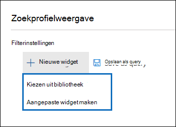

# Advanced eDiscovery dashboard voor revisiesets

In sommige gevallen Advanced eDiscovery, hebt u mogelijk een groot aantal documenten en e-mailberichten die moeten worden gecontroleerd. Voordat u het revisieproces start, wilt u mogelijk snel uw lichaam analyseren om trends of belangrijke statistieken te identificeren die u helpen bij het ontwikkelen van uw beoordelingsstrategie. Hiervoor kunt u het dashboard Advanced eDiscovery voor revisiesets gebruiken om uw lichaam snel te analyseren.

## Stap 1: Een widget maken op het dashboard van de revisieset

1. Ga in het & compliancecentrum naar **eDiscovery > Advanced eDiscovery** om de lijst met zaken in uw organisatie weer te geven.
  
2. Selecteer een bestaand geval.
  
3. Klik op **het tabblad Controleset** en selecteer vervolgens een revisieset.
  
4. Klik in **de vervolgkeuzelijst** Afzonderlijke resultaten op **Profielweergave zoeken.** 

   

   De **pagina Profielweergave zoeken** wordt weergegeven. de eerste keer dat u deze pagina wekt, worden er drie standaardwidgets weergegeven.

   
  
5. Klik op **de widget** Nieuw en selecteer een van de volgende items:

   

   - **Kies uit bibliotheek:** Hiermee wordt een standaardbibliotheek met widgets weergegeven. U klikt op een widget en vervolgens **op Toevoegen om** deze toe te voegen aan de widgets op de pagina **Profielweergave** zoeken.
  
   - **Aangepaste widget maken:** Hiermee wordt een flyoutpagina weergegeven die u kunt gebruiken om een aangepaste widget in te stellen. 

6. Als u een aangepaste widget wilt maken, gaat u als volgt te werk **op** de flyoutpagina Widget toevoegen:

   

    a. Typ een naam voor de widget, die wordt weergegeven op de titelbalk van de widget. Een widget een naam geven is vereist, maar het is handig om de widgetgegevens te identificeren.

    b. Selecteer een eigenschap in **de vervolgkeuzelijst Draaipunt** kiezen die wordt gebruikt voor de widgetgegevens. De items in deze lijst zijn de doorzoekbare eigenschappen voor de items in de revisieset. Zie Metagegevensvelden in documenten in Advanced eDiscovery voor een beschrijving van [deze eigenschappen.](document-metadata-fields-in-Advanced-eDiscovery.md) De draaiopties voor de widget worden weergegeven in de kolom **Zoekbare veldnaam** in dit onderwerp.

    c. Selecteer een grafiektype om de gegevens uit de geselecteerde draaitabel weer te geven.

  6. Klik **op Toevoegen** om de aangepaste widget te maken en deze weer te geven op de pagina **Profielweergave** zoeken.

## Stap 2: Een zoekquery voor revisiesets maken

1. Klik **op ...** in de titelbalk van de widget en klik vervolgens op Voorwaarde **toepassen.**

   

2. Klik op de flyoutpagina op een element in de widgettoets of widgetgrafiek om een filter te maken.

   

3. Herhaal stap 1-2 voor andere widgets met meerdere widgets. 

4. Wanneer u klaar bent, klikt u op **Opslaan als query om** uw voorwaarden op te slaan als een nieuwe zoekquery voor de revisieset.

   

5. Sluit de **weergave Zoekprofiel om** terug te keren naar de weergave zoekresultaten.

   Als u visuele filters hebt gemaakt, wordt de resulterende query toegepast op de zoekresultaten die worden weergegeven en wordt de zoekquery die u hebt opgeslagen in stap 4 weergegeven onder Opgeslagen **query's.** Zie Query's uitvoeren op de gegevens in een revisieset voor meer informatie over [revisiesetquery's.](review-set-search.md)
