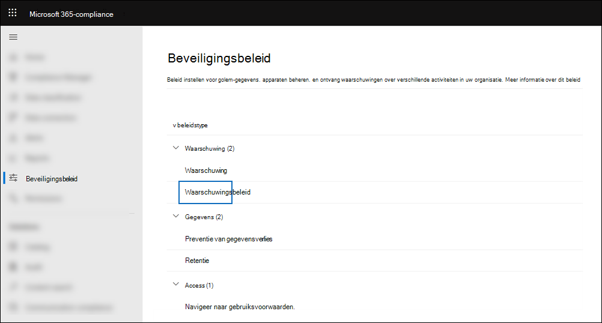
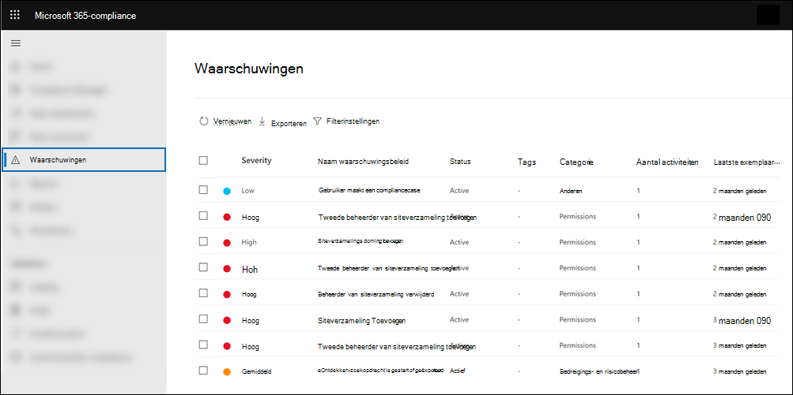
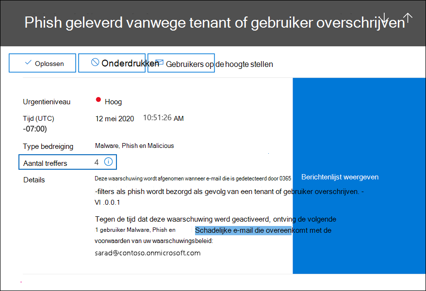
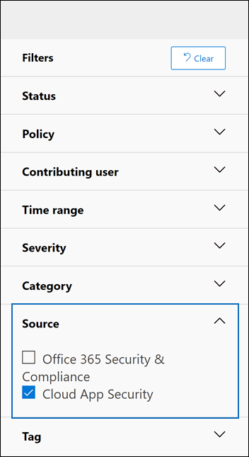

# <a name="alert-policies-in-the-microsoft-365-compliance-center"></a><span data-ttu-id="e216c-103">Waarschuwingsbeleid in de Microsoft 365-compliancecentrum</span><span class="sxs-lookup"><span data-stu-id="e216c-103">Alert policies in the Microsoft 365 compliance center</span></span>

<span data-ttu-id="e216c-104">U kunt de hulpmiddelen voor waarschuwingsbeleid en waarschuwingsdashboards in de Microsoft 365-compliancecentrum gebruiken om waarschuwingsbeleid te maken en vervolgens de waarschuwingen weer te geven die worden gegenereerd wanneer gebruikers activiteiten uitvoeren die voldoen aan de voorwaarden van een waarschuwingsbeleid.</span><span class="sxs-lookup"><span data-stu-id="e216c-104">You can use the alert policy and alert dashboard tools in the Microsoft 365 compliance center to create alert policies and then view the alerts generated when users perform activities that match the conditions of an alert policy.</span></span> <span data-ttu-id="e216c-105">Er zijn verschillende standaardwaarschuwingsbeleidsregels die u helpen bij het controleren van activiteiten, zoals het toewijzen van beheerdersbevoegdheden in Exchange Online, malwareaanvallen, phishingcampagnes en ongebruikelijke niveaus van bestandsverwijding en extern delen.</span><span class="sxs-lookup"><span data-stu-id="e216c-105">There are several default alert policies that help you monitor activities such as assigning admin privileges in Exchange Online, malware attacks, phishing campaigns, and unusual levels of file deletions and external sharing.</span></span>

<span data-ttu-id="e216c-106">Met waarschuwingsbeleid kunt u de waarschuwingen categoriseren die worden geactiveerd door een beleid, het beleid toepassen op alle gebruikers in uw organisatie, een drempelniveau instellen voor wanneer een waarschuwing wordt geactiveerd en bepalen of u e-mailmeldingen wilt ontvangen wanneer waarschuwingen worden geactiveerd.</span><span class="sxs-lookup"><span data-stu-id="e216c-106">Alert policies let you categorize the alerts that are triggered by a policy, apply the policy to all users in your organization, set a threshold level for when an alert is triggered, and decide whether to receive email notifications when alerts are triggered.</span></span> <span data-ttu-id="e216c-107">Er is ook  een pagina Waarschuwingen in het compliancecentrum waar u waarschuwingen kunt bekijken en filteren, een waarschuwingsstatus kunt instellen om waarschuwingen te beheren en waarschuwingen kunt verwijderen nadat u het onderliggende incident hebt opgelost of hebt opgelost.</span><span class="sxs-lookup"><span data-stu-id="e216c-107">There's also a **Alerts** page in the compliance center where you can view and filter alerts, set an alert status to help you manage alerts, and then dismiss alerts after you've addressed or resolved the underlying incident.</span></span>

> [!NOTE]
> <span data-ttu-id="e216c-108">Waarschuwingsbeleid is beschikbaar voor organisaties met een Microsoft 365 Enterprise-, Office 365 Enterprise- of Office 365 Us Government E1/F1/G1, E3/F3/G3- of E5/G5-abonnement.</span><span class="sxs-lookup"><span data-stu-id="e216c-108">Alert policies are available for organizations with a Microsoft 365 Enterprise, Office 365 Enterprise, or Office 365 US Government E1/F1/G1, E3/F3/G3, or E5/G5 subscription.</span></span> <span data-ttu-id="e216c-109">Geavanceerde functionaliteit is alleen beschikbaar voor organisaties met een E5/G5-abonnement of voor organisaties met een E1/F1/G1- of E3/F3/G3-abonnement en een Microsoft Defender voor Office 365 P2 of een Microsoft 365 E5 Compliance of een E5 eDiscovery- en Audit-invoegabonnement.</span><span class="sxs-lookup"><span data-stu-id="e216c-109">Advanced functionality is only available for organizations with an E5/G5 subscription, or for organizations that have an E1/F1/G1 or E3/F3/G3 subscription and a Microsoft Defender for Office 365 P2 or a Microsoft 365 E5 Compliance or an E5 eDiscovery and Audit add-on subscription.</span></span> <span data-ttu-id="e216c-110">De functionaliteit die een E5/G5- of invoegabonnement vereist, is gemarkeerd in dit onderwerp.</span><span class="sxs-lookup"><span data-stu-id="e216c-110">The functionality that requires an E5/G5 or add-on subscription is highlighted in this topic.</span></span> <span data-ttu-id="e216c-111">Houd er ook rekening mee dat waarschuwingsbeleid beschikbaar is in Office 365 GCC, GCC High en DoD Us government environments.</span><span class="sxs-lookup"><span data-stu-id="e216c-111">Also note that alert policies are available in Office 365 GCC, GCC High, and DoD US government environments.</span></span>

## <a name="how-alert-policies-work"></a><span data-ttu-id="e216c-112">Hoe waarschuwingsbeleid werkt</span><span class="sxs-lookup"><span data-stu-id="e216c-112">How alert policies work</span></span>

<span data-ttu-id="e216c-113">Hier wordt een kort overzicht gegeven van hoe waarschuwingsbeleid werkt en de waarschuwingen die worden triggers wanneer gebruikers- of beheerdersactiviteit overeenkomt met de voorwaarden van een waarschuwingsbeleid.</span><span class="sxs-lookup"><span data-stu-id="e216c-113">Here's a quick overview of how alert policies work and the alerts that are triggers when user or admin activity matches the conditions of an alert policy.</span></span>


1. <span data-ttu-id="e216c-115">Een beheerder in uw organisatie maakt, configureert en schakelt een waarschuwingsbeleid in met behulp van de pagina **Waarschuwingsbeleid** in het compliancecentrum.</span><span class="sxs-lookup"><span data-stu-id="e216c-115">An admin in your organization creates, configures, and turns on an alert policy by using the **Alert policies** page in the compliance center.</span></span> <span data-ttu-id="e216c-116">U kunt ook waarschuwingsbeleid maken met de [cmdlet New-ProtectionAlert](/powershell/module/exchange/new-protectionalert) in Security & Compliance Center PowerShell.</span><span class="sxs-lookup"><span data-stu-id="e216c-116">You can also create alert policies by using the [New-ProtectionAlert](/powershell/module/exchange/new-protectionalert) cmdlet in Security & Compliance Center PowerShell.</span></span>

   <span data-ttu-id="e216c-117">Als u waarschuwingsbeleid wilt maken, moet u de rol Waarschuwingen beheren of de rol Organisatieconfiguratie in het compliancecentrum krijgen toegewezen.</span><span class="sxs-lookup"><span data-stu-id="e216c-117">To create alert policies, you have to be assigned the Manage Alerts role or the Organization Configuration role in the compliance center.</span></span>

   > [!NOTE]
   > <span data-ttu-id="e216c-118">Het duurt maximaal 24 uur nadat u een waarschuwingsbeleid hebt gemaakt of bijgewerkt voordat waarschuwingen kunnen worden geactiveerd door het beleid.</span><span class="sxs-lookup"><span data-stu-id="e216c-118">It takes up to 24 hours after creating or updating an alert policy before alerts can be triggered by the policy.</span></span> <span data-ttu-id="e216c-119">Dit komt omdat het beleid moet worden gesynchroniseerd met de waarschuwingsdetectie-engine.</span><span class="sxs-lookup"><span data-stu-id="e216c-119">This is because the policy has to be synced to the alert detection engine.</span></span>

2. <span data-ttu-id="e216c-120">Een gebruiker voert een activiteit uit die overeenkomt met de voorwaarden van een waarschuwingsbeleid.</span><span class="sxs-lookup"><span data-stu-id="e216c-120">A user performs an activity that matches the conditions of an alert policy.</span></span> <span data-ttu-id="e216c-121">In het geval van malwareaanvallen worden geïnfecteerde e-mailberichten die naar gebruikers in uw organisatie worden verzonden, een waarschuwing uitgevoerd.</span><span class="sxs-lookup"><span data-stu-id="e216c-121">In the case of malware attacks, infected email messages sent to users in your organization trigger an alert.</span></span>

3. <span data-ttu-id="e216c-122">Microsoft 365 genereert een waarschuwing die wordt weergegeven op de pagina **Waarschuwingen** in Microsoft 365-compliancecentrum.</span><span class="sxs-lookup"><span data-stu-id="e216c-122">Microsoft 365 generates an alert that's displayed on the **Alerts** page in Microsoft 365 compliance center.</span></span> <span data-ttu-id="e216c-123">Als e-mailmeldingen zijn ingeschakeld voor het waarschuwingsbeleid, stuurt Microsoft een melding naar een lijst met geadresseerden.</span><span class="sxs-lookup"><span data-stu-id="e216c-123">Also, if email notifications are enabled for the alert policy, Microsoft sends a notification to a list of recipients.</span></span> <span data-ttu-id="e216c-124">De waarschuwingen die een beheerder of andere gebruikers kunnen zien, worden op de pagina Waarschuwingen bepaald door de rollen die aan de gebruiker zijn toegewezen.</span><span class="sxs-lookup"><span data-stu-id="e216c-124">The alerts that an admin or other users can see that on the Alerts page is determined by the roles assigned to the user.</span></span> <span data-ttu-id="e216c-125">Zie [RBAC-machtigingen die nodig zijn om](#rbac-permissions-required-to-view-alerts)waarschuwingen weer te geven voor meer informatie.</span><span class="sxs-lookup"><span data-stu-id="e216c-125">For more information, see [RBAC permissions required to view alerts](#rbac-permissions-required-to-view-alerts).</span></span>

4. <span data-ttu-id="e216c-126">Een beheerder beheert waarschuwingen in het compliancecentrum.</span><span class="sxs-lookup"><span data-stu-id="e216c-126">An admin manages alerts in the compliance center.</span></span> <span data-ttu-id="e216c-127">Het beheren van waarschuwingen bestaat uit het toewijzen van een waarschuwingsstatus om een onderzoek bij te houden en te beheren.</span><span class="sxs-lookup"><span data-stu-id="e216c-127">Managing alerts consists of assigning an alert status to help track and manage any investigation.</span></span>

## <a name="alert-policy-settings"></a><span data-ttu-id="e216c-128">Instellingen voor waarschuwingsbeleid</span><span class="sxs-lookup"><span data-stu-id="e216c-128">Alert policy settings</span></span>

<span data-ttu-id="e216c-129">Een waarschuwingsbeleid bestaat uit een set regels en voorwaarden die de activiteit van de gebruiker of beheerder definiëren die een waarschuwing genereert, een lijst met gebruikers die de waarschuwing activeren als ze de activiteit uitvoeren, en een drempelwaarde die bepaalt hoe vaak de activiteit moet plaatsvinden voordat een waarschuwing wordt geactiveerd.</span><span class="sxs-lookup"><span data-stu-id="e216c-129">An alert policy consists of a set of rules and conditions that define the user or admin activity that generates an alert, a list of users who trigger the alert if they perform the activity, and a threshold that defines how many times the activity has to occur before an alert is triggered.</span></span> <span data-ttu-id="e216c-130">U categoriseert ook het beleid en wijst het een ernstniveau toe.</span><span class="sxs-lookup"><span data-stu-id="e216c-130">You also categorize the policy and assign it a severity level.</span></span> <span data-ttu-id="e216c-131">Met deze twee instellingen kunt u waarschuwingsbeleid beheren (en de waarschuwingen die worden geactiveerd wanneer de beleidsvoorwaarden overeenkomen) omdat u op deze instellingen kunt filteren bij het beheren van beleidsregels en het weergeven van waarschuwingen in het compliancecentrum.</span><span class="sxs-lookup"><span data-stu-id="e216c-131">These two settings help you manage alert policies (and the alerts that are triggered when the policy conditions are matched) because you can filter on these settings when managing policies and viewing alerts in the compliance center.</span></span> <span data-ttu-id="e216c-132">U kunt bijvoorbeeld waarschuwingen weergeven die overeenkomen met de voorwaarden uit dezelfde categorie of waarschuwingen met hetzelfde ernstsniveau weergeven.</span><span class="sxs-lookup"><span data-stu-id="e216c-132">For example, you can view alerts that match the conditions from the same category or view alerts with the same severity level.</span></span>

<span data-ttu-id="e216c-133">**Waarschuwingsbeleid weergeven en maken:**</span><span class="sxs-lookup"><span data-stu-id="e216c-133">**To view and create alert policies:**</span></span>

<span data-ttu-id="e216c-134">Ga naar <https://compliance.microsoft.com> en selecteer **beleidsregels voor**  >    >  **waarschuwingsbeleid**.</span><span class="sxs-lookup"><span data-stu-id="e216c-134">Go to <https://compliance.microsoft.com> and then select **Policies** > **Alert** > **Alert policies**.</span></span> <span data-ttu-id="e216c-135">U kunt ook rechtstreeks naar <https://compliance.microsoft.com/alertpolicies> .</span><span class="sxs-lookup"><span data-stu-id="e216c-135">Alternatively, you can go directly to <https://compliance.microsoft.com/alertpolicies>.</span></span>



<span data-ttu-id="e216c-137">Een waarschuwingsbeleid bestaat uit de volgende instellingen en voorwaarden.</span><span class="sxs-lookup"><span data-stu-id="e216c-137">An alert policy consists of the following settings and conditions.</span></span>

- <span data-ttu-id="e216c-138">**Activiteit die de waarschuwing bij het bijhouden is.**</span><span class="sxs-lookup"><span data-stu-id="e216c-138">**Activity the alert is tracking**.</span></span> <span data-ttu-id="e216c-139">U maakt een beleid voor het bijhouden van een activiteit of in sommige gevallen een aantal verwante activiteiten, zoals het delen van een bestand met een externe gebruiker door het te delen, toegangsmachtigingen toe te wijzen of een anonieme koppeling te maken.</span><span class="sxs-lookup"><span data-stu-id="e216c-139">You create a policy to track an activity or in some cases a few related activities, such a sharing a file with an external user by sharing it, assigning access permissions, or creating an anonymous link.</span></span> <span data-ttu-id="e216c-140">Wanneer een gebruiker de activiteit uitvoert die door het beleid is gedefinieerd, wordt een waarschuwing geactiveerd op basis van de instellingen voor de drempelwaarde voor waarschuwingen.</span><span class="sxs-lookup"><span data-stu-id="e216c-140">When a user performs the activity defined by the policy, an alert is triggered based on the alert threshold settings.</span></span>

    > [!NOTE]
    > <span data-ttu-id="e216c-141">De activiteiten die u kunt bijhouden, zijn afhankelijk van het Office 365 Enterprise of Office 365 amerikaanse overheidsplan.</span><span class="sxs-lookup"><span data-stu-id="e216c-141">The activities that you can track depend on your organization's Office 365 Enterprise or Office 365 US Government plan.</span></span> <span data-ttu-id="e216c-142">Voor activiteiten met betrekking tot malwarecampagnes en phishingaanvallen is over het algemeen een E5/G5-abonnement of een E1/F1/G1- of E3/F3/G3-abonnement met een Defender voor [Office 365](../security/office-365-security/defender-for-office-365.md) Abonnement 2-invoegabonnement vereist.</span><span class="sxs-lookup"><span data-stu-id="e216c-142">In general, activities related to malware campaigns and phishing attacks require an E5/G5 subscription or an E1/F1/G1 or E3/F3/G3 subscription with an [Defender for Office 365](../security/office-365-security/defender-for-office-365.md) Plan 2 add-on subscription.</span></span>

- <span data-ttu-id="e216c-143">**Activiteitsvoorwaarden**.</span><span class="sxs-lookup"><span data-stu-id="e216c-143">**Activity conditions**.</span></span> <span data-ttu-id="e216c-144">Voor de meeste activiteiten kunt u aanvullende voorwaarden definiëren waar aan moet worden voldaan om een waarschuwing te activeren.</span><span class="sxs-lookup"><span data-stu-id="e216c-144">For most activities, you can define additional conditions that must be met to trigger an alert.</span></span> <span data-ttu-id="e216c-145">Veelvoorkomende voorwaarden zijn IP-adressen (zodat een waarschuwing wordt geactiveerd wanneer de gebruiker de activiteit uitvoert op een computer met een specifiek IP-adres of binnen een IP-adresbereik), of een waarschuwing wordt geactiveerd als een specifieke gebruiker of gebruikers die activiteit uitvoeren en of de activiteit wordt uitgevoerd op een specifieke bestandsnaam of URL.</span><span class="sxs-lookup"><span data-stu-id="e216c-145">Common conditions include IP addresses (so that an alert is triggered when the user performs the activity on a computer with a specific IP address or within an IP address range), whether an alert is triggered if a specific user or users perform that activity, and whether the activity is performed on a specific file name or URL.</span></span> <span data-ttu-id="e216c-146">U kunt ook een voorwaarde configureren die een waarschuwing activeert wanneer de activiteit wordt uitgevoerd door een gebruiker in uw organisatie.</span><span class="sxs-lookup"><span data-stu-id="e216c-146">You can also configure a condition that triggers an alert when the activity is performed by any user in your organization.</span></span> <span data-ttu-id="e216c-147">De beschikbare voorwaarden zijn afhankelijk van de geselecteerde activiteit.</span><span class="sxs-lookup"><span data-stu-id="e216c-147">The available conditions are dependent on the selected activity.</span></span>

- <span data-ttu-id="e216c-148">**Wanneer de waarschuwing wordt geactiveerd.**</span><span class="sxs-lookup"><span data-stu-id="e216c-148">**When the alert is triggered**.</span></span> <span data-ttu-id="e216c-149">U kunt een instelling configureren die definieert hoe vaak een activiteit kan plaatsvinden voordat een waarschuwing wordt geactiveerd.</span><span class="sxs-lookup"><span data-stu-id="e216c-149">You can configure a setting that defines how often an activity can occur before an alert is triggered.</span></span> <span data-ttu-id="e216c-150">Op deze manier kunt u een beleid instellen om een waarschuwing te genereren telkens wanneer een activiteit overeenkomt met de beleidsvoorwaarden, wanneer een bepaalde drempel wordt overschreden of wanneer het voorkomen van de activiteit die de waarschuwing bijwerkt ongebruikelijk wordt voor uw organisatie.</span><span class="sxs-lookup"><span data-stu-id="e216c-150">This allows you to set up a policy to generate an alert every time an activity matches the policy conditions, when a certain threshold is exceeded, or when the occurrence of the activity the alert is tracking becomes unusual for your organization.</span></span>

    

    <span data-ttu-id="e216c-152">Als u de instelling selecteert op basis van ongebruikelijke activiteit, stelt Microsoft een basislijnwaarde in die de normale frequentie voor de geselecteerde activiteit definieert.</span><span class="sxs-lookup"><span data-stu-id="e216c-152">If you select the setting based on unusual activity, Microsoft establishes a baseline value that defines the normal frequency for the selected activity.</span></span> <span data-ttu-id="e216c-153">Het duurt maximaal zeven dagen om deze basislijn vast te stellen, waarbij waarschuwingen niet worden gegenereerd.</span><span class="sxs-lookup"><span data-stu-id="e216c-153">It takes up to seven days to establish this baseline, during which alerts won't be generated.</span></span> <span data-ttu-id="e216c-154">Nadat de basislijn is ingesteld, wordt een waarschuwing geactiveerd wanneer de frequentie van de activiteit die door het waarschuwingsbeleid wordt bijgespoord, de basislijnwaarde sterk overschrijdt.</span><span class="sxs-lookup"><span data-stu-id="e216c-154">After the baseline is established, an alert is triggered when the frequency of the activity tracked by the alert policy greatly exceeds the baseline value.</span></span> <span data-ttu-id="e216c-155">Voor auditgerelateerde activiteiten (zoals bestands- en mapactiviteiten) kunt u een basislijn instellen op basis van één gebruiker of op basis van alle gebruikers in uw organisatie. voor malwaregerelateerde activiteiten kunt u een basislijn instellen op basis van één malwarefamilie, één geadresseerde of alle berichten in uw organisatie.</span><span class="sxs-lookup"><span data-stu-id="e216c-155">For auditing-related activities (such as file and folder activities), you can establish a baseline based on a single user or based on all users in your organization; for malware-related activities, you can establish a baseline based on a single malware family, a single recipient, or all messages in your organization.</span></span>

    > [!NOTE]
    > <span data-ttu-id="e216c-156">Voor het configureren van waarschuwingsbeleid op basis van een drempel of op basis van ongebruikelijke activiteiten is een E5/G5-abonnement of een E1/F1/G1- of E3/F3/G3-abonnement vereist met een Microsoft Defender-abonnement voor Office 365 P2, Microsoft 365 E5 Compliance of Microsoft 365 eDiscovery- en Audit-invoegabonnement.</span><span class="sxs-lookup"><span data-stu-id="e216c-156">The ability to configure alert policies based on a threshold or based on unusual activity requires an E5/G5 subscription, or an E1/F1/G1 or E3/F3/G3 subscription with a Microsoft Defender for Office 365 P2, Microsoft 365 E5 Compliance, or Microsoft 365 eDiscovery and Audit add-on subscription.</span></span> <span data-ttu-id="e216c-157">Organisaties met een E1/F1/G1- en E3/F3/G3-abonnement kunnen alleen waarschuwingsbeleid maken waarbij een waarschuwing wordt geactiveerd telkens wanneer een activiteit plaatsvindt.</span><span class="sxs-lookup"><span data-stu-id="e216c-157">Organizations with an E1/F1/G1 and E3/F3/G3 subscription can only create alert policies where an alert is triggered every time that an activity occurs.</span></span>

- <span data-ttu-id="e216c-158">**Waarschuwingscategorie**.</span><span class="sxs-lookup"><span data-stu-id="e216c-158">**Alert category**.</span></span> <span data-ttu-id="e216c-159">Als u wilt helpen bij het bijhouden en beheren van de waarschuwingen die door een beleid worden gegenereerd, kunt u een van de volgende categorieën aan een beleid toewijzen.</span><span class="sxs-lookup"><span data-stu-id="e216c-159">To help with tracking and managing the alerts generated by a policy, you can assign one of the following categories to a policy.</span></span>

  - <span data-ttu-id="e216c-160">Preventie van gegevensverlies</span><span class="sxs-lookup"><span data-stu-id="e216c-160">Data loss prevention</span></span>

  - <span data-ttu-id="e216c-161">Informatiebeheer</span><span class="sxs-lookup"><span data-stu-id="e216c-161">Information governance</span></span>

  - <span data-ttu-id="e216c-162">E-mailstroom</span><span class="sxs-lookup"><span data-stu-id="e216c-162">Mail flow</span></span>

  - <span data-ttu-id="e216c-163">Machtigingen</span><span class="sxs-lookup"><span data-stu-id="e216c-163">Permissions</span></span>

  - <span data-ttu-id="e216c-164">Bedreigingsbeheer</span><span class="sxs-lookup"><span data-stu-id="e216c-164">Threat management</span></span>

  - <span data-ttu-id="e216c-165">Anderen</span><span class="sxs-lookup"><span data-stu-id="e216c-165">Others</span></span>

  <span data-ttu-id="e216c-166">Wanneer een activiteit plaatsvindt die overeenkomt met de voorwaarden van het waarschuwingsbeleid, wordt de gegenereerde waarschuwing gelabeld met de categorie die in deze instelling is gedefinieerd.</span><span class="sxs-lookup"><span data-stu-id="e216c-166">When an activity occurs that matches the conditions of the alert policy, the alert that's generated is tagged with the category defined in this setting.</span></span> <span data-ttu-id="e216c-167">Hiermee kunt u waarschuwingen bijhouden en beheren die  dezelfde categorieinstelling hebben op de pagina Waarschuwingen in het compliancecentrum, omdat u waarschuwingen kunt sorteren en filteren op basis van categorie.</span><span class="sxs-lookup"><span data-stu-id="e216c-167">This allows you to track and manage alerts that have the same category setting on the **Alerts** page in the compliance center because you can sort and filter alerts based on category.</span></span>

- <span data-ttu-id="e216c-168">**Ernst van waarschuwing**.</span><span class="sxs-lookup"><span data-stu-id="e216c-168">**Alert severity**.</span></span> <span data-ttu-id="e216c-169">Net als bij de waarschuwingscategorie wijst u een ernstkenmerk **(Laag,** **Gemiddeld,** Hoog of **Informatief)** toe aan waarschuwingsbeleid.</span><span class="sxs-lookup"><span data-stu-id="e216c-169">Similar to the alert category, you assign a severity attribute (**Low**, **Medium**, **High**, or **Informational**) to alert policies.</span></span> <span data-ttu-id="e216c-170">Net als bij de waarschuwingscategorie wordt, wanneer een activiteit plaatsvindt die overeenkomt met de voorwaarden van het waarschuwingsbeleid, de gegenereerde waarschuwing gelabeld met hetzelfde ernstsniveau dat is ingesteld voor het waarschuwingsbeleid.</span><span class="sxs-lookup"><span data-stu-id="e216c-170">Like the alert category, when an activity occurs that matches the conditions of the alert policy, the alert that's generated is tagged with the same severity level that's set for the alert policy.</span></span> <span data-ttu-id="e216c-171">Nogmaals, hiermee kunt u waarschuwingen met dezelfde ernst op de pagina Waarschuwingen bijhouden **en** beheren.</span><span class="sxs-lookup"><span data-stu-id="e216c-171">Again, this allows you to track and manage alerts that have the same severity setting on the **Alerts** page.</span></span> <span data-ttu-id="e216c-172">U kunt bijvoorbeeld de lijst met waarschuwingen filteren,  zodat alleen waarschuwingen met een hoge ernst worden weergegeven.</span><span class="sxs-lookup"><span data-stu-id="e216c-172">For example, you can filter the list of alerts so that only alerts with a **High** severity are displayed.</span></span>

    > [!TIP]
    > <span data-ttu-id="e216c-173">Bij het instellen van een waarschuwingsbeleid kunt u overwegen om een hogere ernst toe te wijzen aan activiteiten die ernstige negatieve gevolgen kunnen hebben, zoals het opsporen van malware na de bezorging aan gebruikers, het weergeven van gevoelige of geclassificeerde gegevens, het delen van gegevens met externe gebruikers of andere activiteiten die kunnen leiden tot gegevensverlies of beveiligingsrisico's.</span><span class="sxs-lookup"><span data-stu-id="e216c-173">When setting up an alert policy, consider assigning a higher severity to activities that can result in severely negative consequences, such as detection of malware after delivery to users, viewing of sensitive or classified data, sharing data with external users, or other activities that can result in data loss or security threats.</span></span> <span data-ttu-id="e216c-174">Hiermee kunt u prioriteit geven aan waarschuwingen en de acties die u ondernomen om de onderliggende oorzaken te onderzoeken en op te lossen.</span><span class="sxs-lookup"><span data-stu-id="e216c-174">This can help you prioritize alerts and the actions you take to investigate and resolve the underlying causes.</span></span>

- <span data-ttu-id="e216c-175">**E-mailmeldingen**.</span><span class="sxs-lookup"><span data-stu-id="e216c-175">**Email notifications**.</span></span> <span data-ttu-id="e216c-176">U kunt het beleid zo instellen dat e-mailmeldingen worden verzonden (of niet) naar een lijst met gebruikers wanneer een waarschuwing wordt geactiveerd.</span><span class="sxs-lookup"><span data-stu-id="e216c-176">You can set up the policy so that email notifications are sent (or not sent) to a list of users when an alert is triggered.</span></span> <span data-ttu-id="e216c-177">U kunt ook een dagelijkse meldingslimiet instellen, zodat wanneer het maximum aantal meldingen is bereikt, er gedurende die dag geen meldingen meer worden verzonden voor de waarschuwing.</span><span class="sxs-lookup"><span data-stu-id="e216c-177">You can also set a daily notification limit so that once the maximum number of notifications has been reached, no more notifications are sent for the alert during that day.</span></span> <span data-ttu-id="e216c-178">Naast e-mailmeldingen kunnen u of andere beheerders de waarschuwingen bekijken die worden geactiveerd door een beleid op de **pagina Waarschuwingen.**</span><span class="sxs-lookup"><span data-stu-id="e216c-178">In addition to email notifications, you or other administrators can view the alerts that are triggered by a policy on the **Alerts** page.</span></span> <span data-ttu-id="e216c-179">U kunt e-mailmeldingen inschakelen voor waarschuwingsbeleid van een specifieke categorie of met een hogere ernst.</span><span class="sxs-lookup"><span data-stu-id="e216c-179">Consider enabling email notifications for alert policies of a specific category or that have a higher severity setting.</span></span>

## <a name="default-alert-policies"></a><span data-ttu-id="e216c-180">Standaardwaarschuwingsbeleid</span><span class="sxs-lookup"><span data-stu-id="e216c-180">Default alert policies</span></span>

<span data-ttu-id="e216c-181">Microsoft biedt ingebouwde waarschuwingsbeleiden die helpen bij het identificeren Exchange beheerdersmachtigingen misbruik, malwareactiviteit, potentiële externe en interne bedreigingen en risico's voor informatiebeheer.</span><span class="sxs-lookup"><span data-stu-id="e216c-181">Microsoft provides built-in alert policies that help identify Exchange admin permissions abuse, malware activity, potential external and internal threats, and information governance risks.</span></span> <span data-ttu-id="e216c-182">Op de **pagina Waarschuwingsbeleid** zijn de namen van deze ingebouwde beleidsregels vetgedrukt en wordt het beleidstype gedefinieerd als **Systeem.**</span><span class="sxs-lookup"><span data-stu-id="e216c-182">On the **Alert policies** page, the names of these built-in policies are in bold and the policy type is defined as **System**.</span></span> <span data-ttu-id="e216c-183">Deze beleidsregels zijn standaard ingeschakeld.</span><span class="sxs-lookup"><span data-stu-id="e216c-183">These policies are turned on by default.</span></span> <span data-ttu-id="e216c-184">U kunt dit beleid uitschakelen (of opnieuw in- of uitschakelen), een lijst met geadresseerden instellen om e-mailmeldingen naar te verzenden en een dagelijkse meldingslimiet instellen.</span><span class="sxs-lookup"><span data-stu-id="e216c-184">You can turn off these policies (or back on again), set up a list of recipients to send email notifications to, and set a daily notification limit.</span></span> <span data-ttu-id="e216c-185">De andere instellingen voor dit beleid kunnen niet worden bewerkt.</span><span class="sxs-lookup"><span data-stu-id="e216c-185">The other settings for these policies can't be edited.</span></span>

<span data-ttu-id="e216c-186">In de volgende tabel worden het beschikbare standaardwaarschuwingsbeleid en de categorie aan elk beleid beschreven.</span><span class="sxs-lookup"><span data-stu-id="e216c-186">The following table lists and describes the available default alert policies and the category each policy is assigned to.</span></span> <span data-ttu-id="e216c-187">De categorie wordt gebruikt om te bepalen welke waarschuwingen een gebruiker kan weergeven op de pagina Waarschuwingen.</span><span class="sxs-lookup"><span data-stu-id="e216c-187">The category is used to determine which alerts a user can view on the Alerts page.</span></span> <span data-ttu-id="e216c-188">Zie [RBAC-machtigingen die nodig zijn om](#rbac-permissions-required-to-view-alerts)waarschuwingen weer te geven voor meer informatie.</span><span class="sxs-lookup"><span data-stu-id="e216c-188">For more information, see [RBAC permissions required to view alerts](#rbac-permissions-required-to-view-alerts).</span></span>

<span data-ttu-id="e216c-189">In de tabel wordt ook aangegeven welke Office 365 Enterprise en Office 365 amerikaanse overheidsplan vereist zijn voor elk plan.</span><span class="sxs-lookup"><span data-stu-id="e216c-189">The table also indicates the Office 365 Enterprise and Office 365 US Government plan required for each one.</span></span> <span data-ttu-id="e216c-190">Sommige standaardwaarschuwingsbeleidsregels zijn beschikbaar als uw organisatie het juiste invoegabonnement heeft naast een E1/F1/G1- of E3/F3/G3-abonnement.</span><span class="sxs-lookup"><span data-stu-id="e216c-190">Some default alert policies are available if your organization has the appropriate add-on subscription in addition to an E1/F1/G1 or E3/F3/G3 subscription.</span></span>

| <span data-ttu-id="e216c-191">Standaardwaarschuwingsbeleid</span><span class="sxs-lookup"><span data-stu-id="e216c-191">Default alert policy</span></span> | <span data-ttu-id="e216c-192">Omschrijving</span><span class="sxs-lookup"><span data-stu-id="e216c-192">Description</span></span> | <span data-ttu-id="e216c-193">Categorie</span><span class="sxs-lookup"><span data-stu-id="e216c-193">Category</span></span> | <span data-ttu-id="e216c-194">Enterprise-abonnement</span><span class="sxs-lookup"><span data-stu-id="e216c-194">Enterprise subscription</span></span> |
|:-----|:-----|:-----|:-----|
|<span data-ttu-id="e216c-195">**Er is een potentieel schadelijke URL-klik gedetecteerd**</span><span class="sxs-lookup"><span data-stu-id="e216c-195">**A potentially malicious URL click was detected**</span></span>|<span data-ttu-id="e216c-196">Genereert een waarschuwing wanneer een gebruiker die is beveiligd Safe [koppelingen](../security/office-365-security/safe-links.md) in uw organisatie op een schadelijke koppeling klikt.</span><span class="sxs-lookup"><span data-stu-id="e216c-196">Generates an alert when a user protected by [Safe Links](../security/office-365-security/safe-links.md) in your organization clicks a malicious link.</span></span> <span data-ttu-id="e216c-197">Deze gebeurtenis wordt geactiveerd wanneer url-wijzigingswijzigingen worden geïdentificeerd door Microsoft Defender voor Office 365 of wanneer gebruikers de pagina's Safe Koppelingen overschrijven (op basis van het Microsoft 365 voor bedrijven Safe Koppelingenbeleid van uw organisatie).</span><span class="sxs-lookup"><span data-stu-id="e216c-197">This event is triggered when URL verdict changes are identified by Microsoft Defender for Office 365 or when users override the Safe Links pages (based on your organization's Microsoft 365 for business Safe Links policy).</span></span> <span data-ttu-id="e216c-198">Dit waarschuwingsbeleid heeft een **instelling met** hoge ernst.</span><span class="sxs-lookup"><span data-stu-id="e216c-198">This alert policy has a **High** severity setting.</span></span> <span data-ttu-id="e216c-199">Voor Klanten van Defender Office 365 P2, E5, G5, worden met deze waarschuwing automatisch automatisch onderzoek en antwoord [in](../security/office-365-security/office-365-air.md)Office 365.</span><span class="sxs-lookup"><span data-stu-id="e216c-199">For Defender for Office 365 P2, E5, G5 customers, this alert automatically triggers [automated investigation and response in Office 365](../security/office-365-security/office-365-air.md).</span></span> <span data-ttu-id="e216c-200">Zie Beleidsregels voor koppelingen instellen Safe voor meer informatie over gebeurtenissen [die deze waarschuwing activeren.](../security/office-365-security/set-up-safe-links-policies.md)</span><span class="sxs-lookup"><span data-stu-id="e216c-200">For more information on events that trigger this alert, see [Set up Safe Links policies](../security/office-365-security/set-up-safe-links-policies.md).</span></span>|<span data-ttu-id="e216c-201">Bedreigingsbeheer</span><span class="sxs-lookup"><span data-stu-id="e216c-201">Threat management</span></span>|<span data-ttu-id="e216c-202">E5/G5 of Defender voor Office 365 P2-invoegabonnement</span><span class="sxs-lookup"><span data-stu-id="e216c-202">E5/G5 or Defender for Office 365 P2 add-on subscription</span></span>|
|<span data-ttu-id="e216c-203">**Resultaat van indiening door beheerder voltooid**</span><span class="sxs-lookup"><span data-stu-id="e216c-203">**Admin Submission result completed**</span></span>|<span data-ttu-id="e216c-204">Genereert een waarschuwing wanneer een [beheerdersinzending](../security/office-365-security/admin-submission.md) de herscan van de ingediende entiteit voltooit.</span><span class="sxs-lookup"><span data-stu-id="e216c-204">Generates an alert when an [Admin Submission](../security/office-365-security/admin-submission.md) completes the rescan of the submitted entity.</span></span> <span data-ttu-id="e216c-205">Er wordt een waarschuwing geactiveerd telkens wanneer een rescanresultaat wordt weergegeven vanuit een beheerdersinzending.</span><span class="sxs-lookup"><span data-stu-id="e216c-205">An alert will be triggered every time a rescan result is rendered from an Admin Submission.</span></span> <span data-ttu-id="e216c-206">Deze waarschuwingen zijn bedoeld om u eraan te herinneren om de resultaten van eerdere inzendingen te bekijken, gerapporteerde berichten van gebruikers in te dienen om de meest recente beleidscontrole te krijgen en vonnissen opnieuw te scannen, en u te helpen bepalen [of](https://compliance.microsoft.com/reportsubmission)het filterbeleid in uw organisatie het beoogde effect heeft.</span><span class="sxs-lookup"><span data-stu-id="e216c-206">These alerts are meant to remind you to [review the results of previous submissions](https://compliance.microsoft.com/reportsubmission), submit user reported messages to get the latest policy check and rescan verdicts, and help you determine if the filtering policies in your organization are having the intended impact.</span></span> <span data-ttu-id="e216c-207">Dit beleid heeft een **instelling voor** de ernst van de informatie.</span><span class="sxs-lookup"><span data-stu-id="e216c-207">This policy has a **Informational** severity setting.</span></span>|<span data-ttu-id="e216c-208">Bedreigingsbeheer</span><span class="sxs-lookup"><span data-stu-id="e216c-208">Threat management</span></span>|<span data-ttu-id="e216c-209">E1/F1, E3/F3 of E5</span><span class="sxs-lookup"><span data-stu-id="e216c-209">E1/F1, E3/F3, or E5</span></span>|
|<span data-ttu-id="e216c-210">**Beheerder heeft handmatig onderzoek naar e-mail getriggerd**</span><span class="sxs-lookup"><span data-stu-id="e216c-210">**Admin triggered manual investigation of email**</span></span>|<span data-ttu-id="e216c-211">Genereert een waarschuwing wanneer een beheerder het handmatige onderzoek van een e-mailbericht vanuit Threat Explorer activeert.</span><span class="sxs-lookup"><span data-stu-id="e216c-211">Generates an alert when an admin triggers the manual investigation of an email from Threat Explorer.</span></span> <span data-ttu-id="e216c-212">Zie Voorbeeld: Een beveiligingsbeheerder activeert een onderzoek [vanuit Threat Explorer voor meer informatie.](../security/office-365-security/automated-investigation-response-office.md#example-a-security-administrator-triggers-an-investigation-from-threat-explorer)</span><span class="sxs-lookup"><span data-stu-id="e216c-212">For more information, see [Example: A security administrator triggers an investigation from Threat Explorer](../security/office-365-security/automated-investigation-response-office.md#example-a-security-administrator-triggers-an-investigation-from-threat-explorer).</span></span> <span data-ttu-id="e216c-213">Deze waarschuwing meldt uw organisatie dat het onderzoek is gestart.</span><span class="sxs-lookup"><span data-stu-id="e216c-213">This alert notifies your organization that the investigation was started.</span></span> <span data-ttu-id="e216c-214">De waarschuwing bevat informatie over wie de melding heeft geactiveerd en bevat een koppeling naar het onderzoek.</span><span class="sxs-lookup"><span data-stu-id="e216c-214">The alert provides information about who triggered it and includes a link to the investigation.</span></span> <span data-ttu-id="e216c-215">Dit beleid heeft een **instelling voor** de ernst van de informatie.</span><span class="sxs-lookup"><span data-stu-id="e216c-215">This policy has an **Informational** severity setting.</span></span>|<span data-ttu-id="e216c-216">Bedreigingsbeheer</span><span class="sxs-lookup"><span data-stu-id="e216c-216">Threat management</span></span>| <span data-ttu-id="e216c-217">E5/G5 of Microsoft Defender voor Office 365 P2-invoegabonnement</span><span class="sxs-lookup"><span data-stu-id="e216c-217">E5/G5 or Microsoft Defender for Office 365 P2 add-on subscription</span></span>| 
|<span data-ttu-id="e216c-218">**Doorstuur/omleidingsregel maken**</span><span class="sxs-lookup"><span data-stu-id="e216c-218">**Creation of forwarding/redirect rule**</span></span>|<span data-ttu-id="e216c-219">Hiermee wordt een waarschuwing gegenereerd wanneer iemand in uw organisatie een regel voor het Postvak IN maakt voor het postvak waarin berichten worden doorgestuurd of omgeleid naar een ander e-mailaccount.</span><span class="sxs-lookup"><span data-stu-id="e216c-219">Generates an alert when someone in your organization creates an inbox rule for their mailbox that forwards or redirects messages to another email account.</span></span> <span data-ttu-id="e216c-220">Met dit beleid worden alleen regels voor postvak IN bijgemaakt die worden gemaakt met webversie van Outlook (voorheen bekend als Outlook Web App) of Exchange Online PowerShell.</span><span class="sxs-lookup"><span data-stu-id="e216c-220">This policy only tracks inbox rules that are created using Outlook on the web (formerly known as Outlook Web App) or Exchange Online PowerShell.</span></span> <span data-ttu-id="e216c-221">Dit beleid heeft een **instelling voor** de ernst van de informatie.</span><span class="sxs-lookup"><span data-stu-id="e216c-221">This policy has a **Informational** severity setting.</span></span> <span data-ttu-id="e216c-222">Zie Regels in webversie van Outlook gebruiken om berichten automatisch door te sturen naar een ander [account](https://support.office.com/article/1433e3a0-7fb0-4999-b536-50e05cb67fed)voor meer informatie over het gebruik van regels voor postvak IN voor het doorsturen en omleiden van e-mail in webversie van Outlook.</span><span class="sxs-lookup"><span data-stu-id="e216c-222">For more information about using inbox rules to forward and redirect email in Outlook on the web, see [Use rules in Outlook on the web to automatically forward messages to another account](https://support.office.com/article/1433e3a0-7fb0-4999-b536-50e05cb67fed).</span></span>|<span data-ttu-id="e216c-223">Bedreigingsbeheer</span><span class="sxs-lookup"><span data-stu-id="e216c-223">Threat management</span></span>|<span data-ttu-id="e216c-224">E1/F1/G1, E3/F3/G3 of E5/G5</span><span class="sxs-lookup"><span data-stu-id="e216c-224">E1/F1/G1, E3/F3/G3, or E5/G5</span></span>|
|<span data-ttu-id="e216c-225">**eDiscovery-zoekopdracht is gestart of geëxporteerd**</span><span class="sxs-lookup"><span data-stu-id="e216c-225">**eDiscovery search started or exported**</span></span>|<span data-ttu-id="e216c-226">Hiermee wordt een waarschuwing gegenereerd wanneer iemand het zoekprogramma Inhoud gebruikt in het beveiligings- en compliancecentrum.</span><span class="sxs-lookup"><span data-stu-id="e216c-226">Generates an alert when someone uses the Content search tool in the Security and compliance center.</span></span> <span data-ttu-id="e216c-227">Er wordt een waarschuwing geactiveerd wanneer de volgende inhoudszoekactiviteiten worden uitgevoerd:</span><span class="sxs-lookup"><span data-stu-id="e216c-227">An alert is triggered when the following content search activities are performed:</span></span> <br/><br/><span data-ttu-id="e216c-228">\* Er wordt een inhoudszoekactie gestart</span><span class="sxs-lookup"><span data-stu-id="e216c-228">\* A content search is started</span></span><br/><span data-ttu-id="e216c-229">\* De resultaten van een inhoudszoekactie worden geëxporteerd</span><span class="sxs-lookup"><span data-stu-id="e216c-229">\* The results of a content search are exported</span></span><br/><span data-ttu-id="e216c-230">\* Een inhoudszoekrapport wordt geëxporteerd</span><span class="sxs-lookup"><span data-stu-id="e216c-230">\* A content search report is exported</span></span><br/><br/><span data-ttu-id="e216c-231">Waarschuwingen worden ook geactiveerd wanneer de vorige inhoudszoekactiviteiten worden uitgevoerd in samenwerking met een eDiscovery-zaak.</span><span class="sxs-lookup"><span data-stu-id="e216c-231">Alerts are also triggered when the previous content search activities are performed in association with an eDiscovery case.</span></span> <span data-ttu-id="e216c-232">Dit beleid heeft een **instelling voor** de ernst van de informatie.</span><span class="sxs-lookup"><span data-stu-id="e216c-232">This policy has a **Informational** severity setting.</span></span> <span data-ttu-id="e216c-233">Zie [EDiscovery-activiteiten](search-for-ediscovery-activities-in-the-audit-log.md#ediscovery-activities)zoeken in het auditlogboek voor meer informatie over inhoudszoekactiviteiten.</span><span class="sxs-lookup"><span data-stu-id="e216c-233">For more information about content search activities, see [Search for eDiscovery activities in the audit log](search-for-ediscovery-activities-in-the-audit-log.md#ediscovery-activities).</span></span>|<span data-ttu-id="e216c-234">Bedreigingsbeheer</span><span class="sxs-lookup"><span data-stu-id="e216c-234">Threat management</span></span>|<span data-ttu-id="e216c-235">E1/F1/G1, E3/F3/G3 of E5/G5</span><span class="sxs-lookup"><span data-stu-id="e216c-235">E1/F1/G1, E3/F3/G3, or E5/G5</span></span>|
|<span data-ttu-id="e216c-236">**Verheffing van Exchange beheerdersvoorrechten**</span><span class="sxs-lookup"><span data-stu-id="e216c-236">**Elevation of Exchange admin privilege**</span></span>|<span data-ttu-id="e216c-237">Genereert een waarschuwing wanneer iemand beheerdersmachtigingen heeft toegewezen in uw Exchange Online organisatie.</span><span class="sxs-lookup"><span data-stu-id="e216c-237">Generates an alert when someone is assigned administrative permissions in your Exchange Online organization.</span></span> <span data-ttu-id="e216c-238">Bijvoorbeeld wanneer een gebruiker wordt toegevoegd aan de rollengroep Organisatiebeheer in Exchange Online.</span><span class="sxs-lookup"><span data-stu-id="e216c-238">For example, when a user is added to the Organization Management role group in Exchange Online.</span></span> <span data-ttu-id="e216c-239">Dit beleid heeft de **instelling Lage** ernst.</span><span class="sxs-lookup"><span data-stu-id="e216c-239">This policy has a **Low** severity setting.</span></span>|<span data-ttu-id="e216c-240">Machtigingen</span><span class="sxs-lookup"><span data-stu-id="e216c-240">Permissions</span></span>|<span data-ttu-id="e216c-241">E1/F1/G1, E3/F3/G3 of E5/G5</span><span class="sxs-lookup"><span data-stu-id="e216c-241">E1/F1/G1, E3/F3/G3, or E5/G5</span></span>|
|<span data-ttu-id="e216c-242">**E-mailberichten met malware verwijderd na bezorging**</span><span class="sxs-lookup"><span data-stu-id="e216c-242">**Email messages containing malware removed after delivery**</span></span>|<span data-ttu-id="e216c-243">Genereert een waarschuwing wanneer berichten met malware worden bezorgd in postvakken in uw organisatie.</span><span class="sxs-lookup"><span data-stu-id="e216c-243">Generates an alert when any messages containing malware are delivered to mailboxes in your organization.</span></span> <span data-ttu-id="e216c-244">Als deze gebeurtenis optreedt, verwijdert Microsoft de geïnfecteerde berichten uit Exchange Online postvakken met [automatische nul-uurs purge](../security/office-365-security/zero-hour-auto-purge.md).</span><span class="sxs-lookup"><span data-stu-id="e216c-244">If this event occurs, Microsoft removes the infected messages from Exchange Online mailboxes using [Zero-hour auto purge](../security/office-365-security/zero-hour-auto-purge.md).</span></span> <span data-ttu-id="e216c-245">Dit beleid heeft een **instelling voor informationele** ernst en activeert automatisch automatisch onderzoek en [antwoord in Office 365.](../security/office-365-security/office-365-air.md)</span><span class="sxs-lookup"><span data-stu-id="e216c-245">This policy has an **Informational** severity setting and automatically triggers [automated investigation and response in Office 365](../security/office-365-security/office-365-air.md).</span></span>|<span data-ttu-id="e216c-246">Bedreigingsbeheer</span><span class="sxs-lookup"><span data-stu-id="e216c-246">Threat management</span></span>|<span data-ttu-id="e216c-247">E5/G5 of Microsoft Defender voor Office 365 P2-invoegabonnement</span><span class="sxs-lookup"><span data-stu-id="e216c-247">E5/G5 or Microsoft Defender for Office 365 P2 add-on subscription</span></span>|
|<span data-ttu-id="e216c-248">**E-mailberichten met schadelijke phishing-URL verwijderd na bezorging**</span><span class="sxs-lookup"><span data-stu-id="e216c-248">**Email messages containing phish URLs removed after delivery**</span></span>|<span data-ttu-id="e216c-249">Genereert een waarschuwing wanneer berichten met phish worden bezorgd in postvakken in uw organisatie.</span><span class="sxs-lookup"><span data-stu-id="e216c-249">Generates an alert when any messages containing phish are delivered to mailboxes in your organization.</span></span> <span data-ttu-id="e216c-250">Als deze gebeurtenis optreedt, verwijdert Microsoft de geïnfecteerde berichten uit Exchange Online postvakken met [automatische nul-uurs purge](../security/office-365-security/zero-hour-auto-purge.md).</span><span class="sxs-lookup"><span data-stu-id="e216c-250">If this event occurs, Microsoft removes the infected messages from Exchange Online mailboxes using [Zero-hour auto purge](../security/office-365-security/zero-hour-auto-purge.md).</span></span> <span data-ttu-id="e216c-251">Dit beleid heeft een **instelling voor informationele** ernst en activeert automatisch automatisch onderzoek en [antwoord in Office 365.](../security/office-365-security/office-365-air.md)</span><span class="sxs-lookup"><span data-stu-id="e216c-251">This policy has an **Informational** severity setting and automatically triggers [automated investigation and response in Office 365](../security/office-365-security/office-365-air.md).</span></span>|<span data-ttu-id="e216c-252">Bedreigingsbeheer</span><span class="sxs-lookup"><span data-stu-id="e216c-252">Threat management</span></span>|<span data-ttu-id="e216c-253">E5/G5 of Defender voor Office 365 P2-invoegabonnement</span><span class="sxs-lookup"><span data-stu-id="e216c-253">E5/G5 or Defender for Office 365 P2 add-on subscription</span></span>|
|<span data-ttu-id="e216c-254">**E-mail die door de gebruiker is gerapporteerd als malware of phishing**</span><span class="sxs-lookup"><span data-stu-id="e216c-254">**Email reported by user as malware or phish**</span></span>|<span data-ttu-id="e216c-255">Genereert een waarschuwing wanneer gebruikers in uw organisatie berichten rapporteren als phishing-e-mail met behulp van de invoeging Rapportbericht.</span><span class="sxs-lookup"><span data-stu-id="e216c-255">Generates an alert when users in your organization  report messages as phishing email using the Report Message add-in.</span></span> <span data-ttu-id="e216c-256">Dit beleid heeft de **instelling Lage** ernst.</span><span class="sxs-lookup"><span data-stu-id="e216c-256">This policy has an **Low** severity setting.</span></span> <span data-ttu-id="e216c-257">Zie De invoeging Rapportbericht gebruiken voor meer informatie over [deze invoeging.](https://support.office.com/article/b5caa9f1-cdf3-4443-af8c-ff724ea719d2)</span><span class="sxs-lookup"><span data-stu-id="e216c-257">For more information about this add-in, see [Use the Report Message add-in](https://support.office.com/article/b5caa9f1-cdf3-4443-af8c-ff724ea719d2).</span></span> <span data-ttu-id="e216c-258">Voor Klanten van Defender Office 365 P2, E5, G5, worden met deze waarschuwing automatisch automatisch onderzoek en antwoord [in](../security/office-365-security/office-365-air.md)Office 365.</span><span class="sxs-lookup"><span data-stu-id="e216c-258">For Defender for Office 365 P2, E5, G5 customers, this alert automatically triggers [automated investigation and response in Office 365](../security/office-365-security/office-365-air.md).</span></span>|<span data-ttu-id="e216c-259">Bedreigingsbeheer</span><span class="sxs-lookup"><span data-stu-id="e216c-259">Threat management</span></span>|<span data-ttu-id="e216c-260">E1/F1/G1, E3/F3/G3 of E5/G5</span><span class="sxs-lookup"><span data-stu-id="e216c-260">E1/F1/G1, E3/F3/G3, or E5/G5</span></span>|
|<span data-ttu-id="e216c-261">**Limiet voor het verzenden van e-mail overschreden**</span><span class="sxs-lookup"><span data-stu-id="e216c-261">**Email sending limit exceeded**</span></span>|<span data-ttu-id="e216c-262">Genereert een waarschuwing wanneer iemand in uw organisatie meer e-mail heeft verzonden dan is toegestaan door het uitgaande spambeleid.</span><span class="sxs-lookup"><span data-stu-id="e216c-262">Generates an alert when someone in your organization has sent more mail than is allowed by the outbound spam policy.</span></span> <span data-ttu-id="e216c-263">Dit is meestal een indicatie dat de gebruiker te veel e-mail verstuurt of dat het account mogelijk wordt gehackt.</span><span class="sxs-lookup"><span data-stu-id="e216c-263">This is usually an indication the user is sending too much email or that the account may be compromised.</span></span> <span data-ttu-id="e216c-264">Dit beleid heeft de **instelling Gemiddelde** ernst.</span><span class="sxs-lookup"><span data-stu-id="e216c-264">This policy has a **Medium** severity setting.</span></span> <span data-ttu-id="e216c-265">Als u een waarschuwing krijgt gegenereerd door dit waarschuwingsbeleid, is het een goed idee om te controleren of het [gebruikersaccount is gecompromitteerd.](../security/office-365-security/responding-to-a-compromised-email-account.md)</span><span class="sxs-lookup"><span data-stu-id="e216c-265">If you get an alert generated by this alert policy, it's a good idea to [check whether the user account is compromised](../security/office-365-security/responding-to-a-compromised-email-account.md).</span></span>|<span data-ttu-id="e216c-266">Bedreigingsbeheer</span><span class="sxs-lookup"><span data-stu-id="e216c-266">Threat management</span></span>|<span data-ttu-id="e216c-267">E1/F1/G1, E3/F3/G3 of E5/G5</span><span class="sxs-lookup"><span data-stu-id="e216c-267">E1/F1/G1, E3/F3/G3, or E5/G5</span></span>|
|<span data-ttu-id="e216c-268">**Formulier geblokkeerd vanwege mogelijke phishingpoging**</span><span class="sxs-lookup"><span data-stu-id="e216c-268">**Form blocked due to potential phishing attempt**</span></span>|<span data-ttu-id="e216c-269">Genereert een waarschuwing wanneer iemand in uw organisatie is beperkt tot het delen van formulieren en het verzamelen van antwoorden met Microsoft Forms vanwege het gedetecteerde herhaalde phishinggedrag.</span><span class="sxs-lookup"><span data-stu-id="e216c-269">Generates an alert when someone in your organization has been restricted from sharing forms and collecting responses using Microsoft Forms due to detected repeated phishing attempt behavior.</span></span> <span data-ttu-id="e216c-270">Dit beleid heeft een **instelling met hoge ernst.**</span><span class="sxs-lookup"><span data-stu-id="e216c-270">This policy has a **High severity** setting.</span></span>|<span data-ttu-id="e216c-271">Bedreigingsbeheer</span><span class="sxs-lookup"><span data-stu-id="e216c-271">Threat management</span></span>|<span data-ttu-id="e216c-272">E1, E3/F3 of E5</span><span class="sxs-lookup"><span data-stu-id="e216c-272">E1, E3/F3, or E5</span></span>|
|<span data-ttu-id="e216c-273">**Formulier gemarkeerd en bevestigd als phishing**</span><span class="sxs-lookup"><span data-stu-id="e216c-273">**Form flagged and confirmed as phishing**</span></span>|<span data-ttu-id="e216c-274">Genereert een waarschuwing wanneer een formulier dat is gemaakt in Microsoft Forms vanuit uw organisatie is geïdentificeerd als potentiële phishing via Misbruik van rapport en is bevestigd als phishing door Microsoft.</span><span class="sxs-lookup"><span data-stu-id="e216c-274">Generates an alert when a form created in Microsoft Forms from within your organization has been identified as potential phishing through Report Abuse and confirmed as phishing by Microsoft.</span></span> <span data-ttu-id="e216c-275">Dit beleid heeft een **instelling met** hoge ernst.</span><span class="sxs-lookup"><span data-stu-id="e216c-275">This policy has a **High** severity setting.</span></span>|<span data-ttu-id="e216c-276">Bedreigingsbeheer</span><span class="sxs-lookup"><span data-stu-id="e216c-276">Threat management</span></span>|<span data-ttu-id="e216c-277">E1, E3/F3 of E5</span><span class="sxs-lookup"><span data-stu-id="e216c-277">E1, E3/F3, or E5</span></span>|
|<span data-ttu-id="e216c-278">**Berichten zijn vertraagd**</span><span class="sxs-lookup"><span data-stu-id="e216c-278">**Messages have been delayed**</span></span>|<span data-ttu-id="e216c-279">Genereert een waarschuwing wanneer Microsoft geen e-mailberichten kan verzenden naar uw on-premises organisatie of een partnerserver met behulp van een verbindingslijn.</span><span class="sxs-lookup"><span data-stu-id="e216c-279">Generates an alert when Microsoft can't deliver email messages to your on-premises organization or a partner server by using a connector.</span></span> <span data-ttu-id="e216c-280">Wanneer dit gebeurt, wordt het bericht in de wachtrij Office 365.</span><span class="sxs-lookup"><span data-stu-id="e216c-280">When this happens, the message is queued in Office 365.</span></span> <span data-ttu-id="e216c-281">Deze waarschuwing wordt geactiveerd wanneer er meer dan 2000 berichten in de wachtrij staan die langer dan een uur in de wachtrij staan.</span><span class="sxs-lookup"><span data-stu-id="e216c-281">This alert is triggered when there are 2,000 messages or more that have been queued for more than an hour.</span></span> <span data-ttu-id="e216c-282">Dit beleid heeft een **instelling met** hoge ernst.</span><span class="sxs-lookup"><span data-stu-id="e216c-282">This policy has a **High** severity setting.</span></span>|<span data-ttu-id="e216c-283">E-mailstroom</span><span class="sxs-lookup"><span data-stu-id="e216c-283">Mail flow</span></span>|<span data-ttu-id="e216c-284">E1/F1/G1, E3/F3/G3 of E5/G5</span><span class="sxs-lookup"><span data-stu-id="e216c-284">E1/F1/G1, E3/F3/G3, or E5/G5</span></span>|
|<span data-ttu-id="e216c-285">**Malwarecampagne gedetecteerd na bezorging**</span><span class="sxs-lookup"><span data-stu-id="e216c-285">**Malware campaign detected after delivery**</span></span>|<span data-ttu-id="e216c-286">Genereert een waarschuwing wanneer een ongebruikelijk groot aantal berichten met malware wordt bezorgd in postvakken in uw organisatie.</span><span class="sxs-lookup"><span data-stu-id="e216c-286">Generates an alert when an unusually large number of messages containing malware are delivered to mailboxes in your organization.</span></span> <span data-ttu-id="e216c-287">Als deze gebeurtenis optreedt, verwijdert Microsoft de geïnfecteerde berichten uit Exchange Online postvakken.</span><span class="sxs-lookup"><span data-stu-id="e216c-287">If this event occurs, Microsoft removes the infected messages from Exchange Online mailboxes.</span></span> <span data-ttu-id="e216c-288">Dit beleid heeft een **instelling met** hoge ernst.</span><span class="sxs-lookup"><span data-stu-id="e216c-288">This policy has a **High** severity setting.</span></span>|<span data-ttu-id="e216c-289">Bedreigingsbeheer</span><span class="sxs-lookup"><span data-stu-id="e216c-289">Threat management</span></span>|<span data-ttu-id="e216c-290">E5/G5 of Microsoft Defender voor Office 365 P2-invoegabonnement</span><span class="sxs-lookup"><span data-stu-id="e216c-290">E5/G5 or Microsoft Defender for Office 365 P2 add-on subscription</span></span>|
|<span data-ttu-id="e216c-291">**Malwarecampagne gedetecteerd en geblokkeerd**</span><span class="sxs-lookup"><span data-stu-id="e216c-291">**Malware campaign detected and blocked**</span></span>|<span data-ttu-id="e216c-292">Genereert een waarschuwing wanneer iemand heeft geprobeerd een ongebruikelijk groot aantal e-mailberichten met een bepaald type malware naar gebruikers in uw organisatie te verzenden.</span><span class="sxs-lookup"><span data-stu-id="e216c-292">Generates an alert when someone has attempted to send an unusually large number of email messages containing a certain type of malware to users in your organization.</span></span> <span data-ttu-id="e216c-293">Als deze gebeurtenis optreedt, worden de geïnfecteerde berichten geblokkeerd door Microsoft en niet bezorgd in postvakken.</span><span class="sxs-lookup"><span data-stu-id="e216c-293">If this event occurs, the infected messages are blocked by Microsoft and not delivered to mailboxes.</span></span> <span data-ttu-id="e216c-294">Dit beleid heeft de **instelling Lage** ernst.</span><span class="sxs-lookup"><span data-stu-id="e216c-294">This policy has a **Low** severity setting.</span></span>|<span data-ttu-id="e216c-295">Bedreigingsbeheer</span><span class="sxs-lookup"><span data-stu-id="e216c-295">Threat management</span></span>|<span data-ttu-id="e216c-296">E5/G5 of Defender voor Office 365 P2-invoegabonnement</span><span class="sxs-lookup"><span data-stu-id="e216c-296">E5/G5 or Defender for Office 365 P2 add-on subscription</span></span>|
|<span data-ttu-id="e216c-297">**Malwarecampagne gedetecteerd in SharePoint en OneDrive**</span><span class="sxs-lookup"><span data-stu-id="e216c-297">**Malware campaign detected in SharePoint and OneDrive**</span></span>|<span data-ttu-id="e216c-298">Genereert een waarschuwing wanneer er een ongebruikelijk hoog volume malware of virussen wordt gedetecteerd in bestanden op SharePoint sites of OneDrive accounts in uw organisatie.</span><span class="sxs-lookup"><span data-stu-id="e216c-298">Generates an alert when an unusually high volume of malware or viruses is detected in files located in SharePoint sites or OneDrive accounts in your organization.</span></span> <span data-ttu-id="e216c-299">Dit beleid heeft een **instelling met** hoge ernst.</span><span class="sxs-lookup"><span data-stu-id="e216c-299">This policy has a **High** severity setting.</span></span>|<span data-ttu-id="e216c-300">Bedreigingsbeheer</span><span class="sxs-lookup"><span data-stu-id="e216c-300">Threat management</span></span>|<span data-ttu-id="e216c-301">E5/G5 of Defender voor Office 365 P2-invoegabonnement</span><span class="sxs-lookup"><span data-stu-id="e216c-301">E5/G5 or Defender for Office 365 P2 add-on subscription</span></span>|
|<span data-ttu-id="e216c-302">**Malware niet gezapeerd omdat ZAP is uitgeschakeld**</span><span class="sxs-lookup"><span data-stu-id="e216c-302">**Malware not zapped because ZAP is disabled**</span></span>| <span data-ttu-id="e216c-303">Genereert een waarschuwing wanneer Microsoft de bezorging van een malwarebericht in een postvak detecteert omdat Zero-Hour Automatisch verwijderen voor Phish-berichten is uitgeschakeld.</span><span class="sxs-lookup"><span data-stu-id="e216c-303">Generates an alert when Microsoft detects delivery of a malware message to a mailbox because Zero-Hour Auto Purge for Phish messages is disabled.</span></span> <span data-ttu-id="e216c-304">Dit beleid heeft een **instelling voor** de ernst van de informatie.</span><span class="sxs-lookup"><span data-stu-id="e216c-304">This policy has an **Informational** severity setting.</span></span> |<span data-ttu-id="e216c-305">Bedreigingsbeheer</span><span class="sxs-lookup"><span data-stu-id="e216c-305">Threat management</span></span>|<span data-ttu-id="e216c-306">E5/G5 of Defender voor Office 365 P2-invoegabonnement</span><span class="sxs-lookup"><span data-stu-id="e216c-306">E5/G5 or Defender for Office 365 P2 add-on subscription</span></span>|
|<span data-ttu-id="e216c-307">**Phish bezorgd omdat de map Ongewenste e-mail van een gebruiker is uitgeschakeld**</span><span class="sxs-lookup"><span data-stu-id="e216c-307">**Phish delivered because a user's Junk Mail folder is disabled**</span></span>|<span data-ttu-id="e216c-308">Genereert een waarschuwing wanneer Microsoft detecteert dat de map Ongewenste e-mail van een gebruiker is uitgeschakeld, zodat een phishingbericht met veel vertrouwen wordt bezorgd in een postvak.</span><span class="sxs-lookup"><span data-stu-id="e216c-308">Generates an alert when Microsoft detects a user’s Junk Mail folder is disabled, allowing delivery of a high confidence phishing message to a mailbox.</span></span> <span data-ttu-id="e216c-309">Dit beleid heeft een **instelling voor** de ernst van de informatie.</span><span class="sxs-lookup"><span data-stu-id="e216c-309">This policy has an **Informational** severity setting.</span></span>|<span data-ttu-id="e216c-310">Bedreigingsbeheer</span><span class="sxs-lookup"><span data-stu-id="e216c-310">Threat management</span></span>|<span data-ttu-id="e216c-311">E5/G5 of Defender voor Office 365 P1- of P2-invoegabonnement</span><span class="sxs-lookup"><span data-stu-id="e216c-311">E5/G5 or Defender for Office 365 P1 or P2 add-on subscription</span></span>|
|<span data-ttu-id="e216c-312">**Phish geleverd vanwege een ETR-override**</span><span class="sxs-lookup"><span data-stu-id="e216c-312">**Phish delivered due to an ETR override**</span></span>|<span data-ttu-id="e216c-313">Genereert een waarschuwing wanneer Microsoft een Exchange transportregel (ETR) detecteert die het verzenden van een phishingbericht met veel vertrouwen naar een postvak heeft toegestaan.</span><span class="sxs-lookup"><span data-stu-id="e216c-313">Generates an alert when Microsoft detects an Exchange Transport Rule (ETR) that allowed delivery of a high confidence phishing message to a mailbox.</span></span> <span data-ttu-id="e216c-314">Dit beleid heeft een **instelling voor** de ernst van de informatie.</span><span class="sxs-lookup"><span data-stu-id="e216c-314">This policy has an **Informational** severity setting.</span></span> <span data-ttu-id="e216c-315">Zie E-mailstroomregels [(transportregels) in](/exchange/security-and-compliance/mail-flow-rules/mail-flow-rules)Exchange Online voor meer informatie over Exchange Transportregels (E-mailstroomregels).</span><span class="sxs-lookup"><span data-stu-id="e216c-315">For more information about Exchange Transport Rules (Mail flow rules), see [Mail flow rules (transport rules) in Exchange Online](/exchange/security-and-compliance/mail-flow-rules/mail-flow-rules).</span></span>|<span data-ttu-id="e216c-316">Bedreigingsbeheer</span><span class="sxs-lookup"><span data-stu-id="e216c-316">Threat management</span></span>|<span data-ttu-id="e216c-317">E5/G5 of Defender voor Office 365 P1- of P2-invoegabonnement</span><span class="sxs-lookup"><span data-stu-id="e216c-317">E5/G5 or Defender for Office 365 P1 or P2 add-on subscription</span></span>|
|<span data-ttu-id="e216c-318">**Phish geleverd vanwege een IP-beleid voor toestaan**</span><span class="sxs-lookup"><span data-stu-id="e216c-318">**Phish delivered due to an IP allow policy**</span></span>|<span data-ttu-id="e216c-319">Genereert een waarschuwing wanneer Microsoft een IP-beleid voor toestaan detecteert waarmee een phishingbericht met veel vertrouwen in een postvak kan worden bezorgd.</span><span class="sxs-lookup"><span data-stu-id="e216c-319">Generates an alert when Microsoft detects an IP allow policy that allowed delivery of a high confidence phishing message to a mailbox.</span></span> <span data-ttu-id="e216c-320">Dit beleid heeft een **instelling voor** de ernst van de informatie.</span><span class="sxs-lookup"><span data-stu-id="e216c-320">This policy has an **Informational** severity setting.</span></span> <span data-ttu-id="e216c-321">Zie Het standaardbeleid voor verbindingsfilter configureren - Office 365 voor meer informatie over het beleid [voor ip-toestaan (verbindingsfilters).](../security/office-365-security/configure-the-connection-filter-policy.md)</span><span class="sxs-lookup"><span data-stu-id="e216c-321">For more information about the IP allow policy (connection filtering), see [Configure the default connection filter policy - Office 365](../security/office-365-security/configure-the-connection-filter-policy.md).</span></span>|<span data-ttu-id="e216c-322">Bedreigingsbeheer</span><span class="sxs-lookup"><span data-stu-id="e216c-322">Threat management</span></span>|<span data-ttu-id="e216c-323">E5/G5 of Defender voor Office 365 P1- of P2-invoegabonnement</span><span class="sxs-lookup"><span data-stu-id="e216c-323">E5/G5 or Defender for Office 365 P1 or P2 add-on subscription</span></span>|
|<span data-ttu-id="e216c-324">**Phish niet gezapig omdat ZAP is uitgeschakeld**</span><span class="sxs-lookup"><span data-stu-id="e216c-324">**Phish not zapped because ZAP is disabled**</span></span>| <span data-ttu-id="e216c-325">Genereert een waarschuwing wanneer Microsoft de bezorging van een phishingbericht met veel vertrouwen detecteert in een postvak omdat Zero-Hour automatisch verwijderen voor Phish-berichten is uitgeschakeld.</span><span class="sxs-lookup"><span data-stu-id="e216c-325">Generates an alert when Microsoft detects delivery of a high confidence phishing message to a mailbox because Zero-Hour Auto Purge for Phish messages is disabled.</span></span> <span data-ttu-id="e216c-326">Dit beleid heeft een **instelling voor** de ernst van de informatie.</span><span class="sxs-lookup"><span data-stu-id="e216c-326">This policy has an **Informational** severity setting.</span></span>|<span data-ttu-id="e216c-327">Bedreigingsbeheer</span><span class="sxs-lookup"><span data-stu-id="e216c-327">Threat management</span></span>|<span data-ttu-id="e216c-328">E5/G5 of Defender voor Office 365 P2-invoegabonnement</span><span class="sxs-lookup"><span data-stu-id="e216c-328">E5/G5 or Defender for Office 365 P2 add-on subscription</span></span>|
|<span data-ttu-id="e216c-329">**Phish geleverd vanwege tenant of gebruiker overschrijven**<sup>1</sup></span><span class="sxs-lookup"><span data-stu-id="e216c-329">**Phish delivered due to tenant or user override**<sup>1</sup></span></span>|<span data-ttu-id="e216c-330">Genereert een waarschuwing wanneer Microsoft detecteert dat een beheerder of gebruiker de bezorging van een phishingbericht in een postvak heeft overschrijven.</span><span class="sxs-lookup"><span data-stu-id="e216c-330">Generates an alert when Microsoft  detects an admin or user override allowed the delivery of a phishing message to a mailbox.</span></span> <span data-ttu-id="e216c-331">Voorbeelden van overschrijven zijn een regel voor postvak IN of e-mailstroom waarmee berichten van een specifieke afzender of domein kunnen worden verzonden, of een antispambeleid waarmee berichten van specifieke afzenders of domeinen kunnen worden verzonden.</span><span class="sxs-lookup"><span data-stu-id="e216c-331">Examples of overrides include an inbox or mail flow rule that allows messages from a specific sender or domain, or an anti-spam policy that allows messages from specific senders or domains.</span></span> <span data-ttu-id="e216c-332">Dit beleid heeft een **instelling met** hoge ernst.</span><span class="sxs-lookup"><span data-stu-id="e216c-332">This policy has a **High** severity setting.</span></span>|<span data-ttu-id="e216c-333">Bedreigingsbeheer</span><span class="sxs-lookup"><span data-stu-id="e216c-333">Threat management</span></span>|<span data-ttu-id="e216c-334">E5/G5 of Defender voor Office 365 P2-invoegabonnement</span><span class="sxs-lookup"><span data-stu-id="e216c-334">E5/G5 or Defender for Office 365 P2 add-on subscription</span></span>|
|<span data-ttu-id="e216c-335">**Doorstuuractiviteit verdachte e-mail**</span><span class="sxs-lookup"><span data-stu-id="e216c-335">**Suspicious email forwarding activity**</span></span>|<span data-ttu-id="e216c-336">Genereert een waarschuwing wanneer iemand in uw organisatie automatisch e-mail heeft verzonden naar een verdacht extern account.</span><span class="sxs-lookup"><span data-stu-id="e216c-336">Generates an alert when someone in your organization has autoforwarded email to a suspicious external account.</span></span> <span data-ttu-id="e216c-337">Dit is een vroegtijdige waarschuwing voor gedrag dat kan aangeven dat het account is gehackt, maar niet ernstig genoeg om de gebruiker te beperken.</span><span class="sxs-lookup"><span data-stu-id="e216c-337">This is an early warning for behavior that may indicate the account is compromised, but not severe enough to restrict the user.</span></span> <span data-ttu-id="e216c-338">Dit beleid heeft een **instelling met** hoge ernst.</span><span class="sxs-lookup"><span data-stu-id="e216c-338">This policy has a **High** severity setting.</span></span> <span data-ttu-id="e216c-339">Hoewel dit zeldzaam is, kan een waarschuwing die door dit beleid wordt gegenereerd, een afwijking zijn.</span><span class="sxs-lookup"><span data-stu-id="e216c-339">Although it's rare, an alert generated by this policy may be an anomaly.</span></span> <span data-ttu-id="e216c-340">Het is een goed idee om te [controleren of het gebruikersaccount is gehackt.](../security/office-365-security/responding-to-a-compromised-email-account.md)</span><span class="sxs-lookup"><span data-stu-id="e216c-340">It's a good idea to [check whether the user account is compromised](../security/office-365-security/responding-to-a-compromised-email-account.md).</span></span>|<span data-ttu-id="e216c-341">Bedreigingsbeheer</span><span class="sxs-lookup"><span data-stu-id="e216c-341">Threat management</span></span>|<span data-ttu-id="e216c-342">E1/F1/G1, E3/F3/G3 of E5/G5</span><span class="sxs-lookup"><span data-stu-id="e216c-342">E1/F1/G1, E3/F3/G3, or E5/G5</span></span>|
|<span data-ttu-id="e216c-343">**Verdachte e-mail verzenden patronen gedetecteerd**</span><span class="sxs-lookup"><span data-stu-id="e216c-343">**Suspicious email sending patterns detected**</span></span>|<span data-ttu-id="e216c-344">Genereert een waarschuwing wanneer iemand in uw organisatie verdachte e-mail heeft verzonden en het risico loopt dat het verzenden van e-mail wordt beperkt.</span><span class="sxs-lookup"><span data-stu-id="e216c-344">Generates an alert when someone in your organization has sent suspicious email and is at risk of being restricted from sending email.</span></span> <span data-ttu-id="e216c-345">Dit is een vroegtijdige waarschuwing voor gedrag dat kan aangeven dat het account is gehackt, maar niet ernstig genoeg om de gebruiker te beperken.</span><span class="sxs-lookup"><span data-stu-id="e216c-345">This is an early warning for behavior that may indicate that the account is compromised, but not severe enough to restrict the user.</span></span> <span data-ttu-id="e216c-346">Dit beleid heeft de **instelling Gemiddelde** ernst.</span><span class="sxs-lookup"><span data-stu-id="e216c-346">This policy has a **Medium** severity setting.</span></span> <span data-ttu-id="e216c-347">Hoewel dit zeldzaam is, kan een waarschuwing die door dit beleid wordt gegenereerd, een afwijking zijn.</span><span class="sxs-lookup"><span data-stu-id="e216c-347">Although it's rare, an alert generated by this policy may be an anomaly.</span></span> <span data-ttu-id="e216c-348">Het is echter een goed idee om te [controleren of het gebruikersaccount is gehackt.](../security/office-365-security/responding-to-a-compromised-email-account.md)</span><span class="sxs-lookup"><span data-stu-id="e216c-348">However, it's a good idea to [check whether the user account is compromised](../security/office-365-security/responding-to-a-compromised-email-account.md).</span></span>|<span data-ttu-id="e216c-349">Bedreigingsbeheer</span><span class="sxs-lookup"><span data-stu-id="e216c-349">Threat management</span></span>|<span data-ttu-id="e216c-350">E1/F1/G1, E3/F3/G3 of E5/G5</span><span class="sxs-lookup"><span data-stu-id="e216c-350">E1/F1/G1, E3/F3/G3, or E5/G5</span></span>  |
|<span data-ttu-id="e216c-351">**Tenant beperkt tot het verzenden van e-mail**</span><span class="sxs-lookup"><span data-stu-id="e216c-351">**Tenant restricted from sending email**</span></span>|<span data-ttu-id="e216c-352">Genereert een waarschuwing wanneer het grootste deel van het e-mailverkeer van uw organisatie is gedetecteerd als verdacht en Microsoft uw organisatie heeft beperkt om e-mail te verzenden.</span><span class="sxs-lookup"><span data-stu-id="e216c-352">Generates an alert when most of the email traffic from your organization has been detected as suspicious and Microsoft has restricted your organization from sending email.</span></span> <span data-ttu-id="e216c-353">Onderzoek eventuele mogelijk gecompromitteerde gebruikers- en beheerdersaccounts, nieuwe connectors of open relays en neem vervolgens contact op met Microsoft Support om de blokkering van uw organisatie op te geven.</span><span class="sxs-lookup"><span data-stu-id="e216c-353">Investigate any potentially compromised user and admin accounts, new connectors, or open relays, and then contact Microsoft Support to unblock your organization.</span></span> <span data-ttu-id="e216c-354">Dit beleid heeft een **instelling met** hoge ernst.</span><span class="sxs-lookup"><span data-stu-id="e216c-354">This policy has a **High** severity setting.</span></span> <span data-ttu-id="e216c-355">Zie Problemen met e-mailbezorging oplossen voor [foutcode 5.7.7xx in](/Exchange/mail-flow-best-practices/non-delivery-reports-in-exchange-online/fix-error-code-5-7-700-through-5-7-750)Exchange Online.</span><span class="sxs-lookup"><span data-stu-id="e216c-355">For more information about why organizations are blocked, see [Fix email delivery issues for error code 5.7.7xx in Exchange Online](/Exchange/mail-flow-best-practices/non-delivery-reports-in-exchange-online/fix-error-code-5-7-700-through-5-7-750).</span></span>|<span data-ttu-id="e216c-356">Bedreigingsbeheer</span><span class="sxs-lookup"><span data-stu-id="e216c-356">Threat management</span></span>|<span data-ttu-id="e216c-357">E1/F1/G1, E3/F3/G3 of E5/G5</span><span class="sxs-lookup"><span data-stu-id="e216c-357">E1/F1/G1, E3/F3/G3, or E5/G5</span></span>|
|<span data-ttu-id="e216c-358">**Ongebruikelijke externe gebruikersbestandsactiviteiten**</span><span class="sxs-lookup"><span data-stu-id="e216c-358">**Unusual external user file activity**</span></span>|<span data-ttu-id="e216c-359">Genereert een waarschuwing wanneer een ongebruikelijk groot aantal activiteiten wordt uitgevoerd op bestanden in SharePoint of OneDrive door gebruikers buiten uw organisatie.</span><span class="sxs-lookup"><span data-stu-id="e216c-359">Generates an alert when an unusually large number of activities are performed on files in SharePoint or OneDrive by users outside of your organization.</span></span> <span data-ttu-id="e216c-360">Dit omvat activiteiten zoals het openen van bestanden, het downloaden van bestanden en het verwijderen van bestanden.</span><span class="sxs-lookup"><span data-stu-id="e216c-360">This includes activities such as accessing files, downloading files, and deleting files.</span></span> <span data-ttu-id="e216c-361">Dit beleid heeft een **instelling met** hoge ernst.</span><span class="sxs-lookup"><span data-stu-id="e216c-361">This policy has a **High** severity setting.</span></span>|<span data-ttu-id="e216c-362">Informatiebeheer</span><span class="sxs-lookup"><span data-stu-id="e216c-362">Information governance</span></span>|<span data-ttu-id="e216c-363">E5/G5, Microsoft Defender voor Office 365 P2 of Microsoft 365 E5 invoegabonnement</span><span class="sxs-lookup"><span data-stu-id="e216c-363">E5/G5, Microsoft Defender for Office 365 P2, or Microsoft 365 E5 add-on subscription</span></span>|
|<span data-ttu-id="e216c-364">**Ongebruikelijk volume van extern delen van bestanden**</span><span class="sxs-lookup"><span data-stu-id="e216c-364">**Unusual volume of external file sharing**</span></span>|<span data-ttu-id="e216c-365">Genereert een waarschuwing wanneer een ongebruikelijk groot aantal bestanden in SharePoint of OneDrive worden gedeeld met gebruikers buiten uw organisatie.</span><span class="sxs-lookup"><span data-stu-id="e216c-365">Generates an alert when an unusually large number of files in SharePoint or OneDrive are shared with users outside of your organization.</span></span> <span data-ttu-id="e216c-366">Dit beleid heeft de **instelling Gemiddelde** ernst.</span><span class="sxs-lookup"><span data-stu-id="e216c-366">This policy has a **Medium** severity setting.</span></span>|<span data-ttu-id="e216c-367">Informatiebeheer</span><span class="sxs-lookup"><span data-stu-id="e216c-367">Information governance</span></span>|<span data-ttu-id="e216c-368">E5/G5, Defender voor Office 365 P2 of Microsoft 365 E5 invoegabonnement</span><span class="sxs-lookup"><span data-stu-id="e216c-368">E5/G5, Defender for Office 365 P2, or Microsoft 365 E5 add-on subscription</span></span>|
|<span data-ttu-id="e216c-369">**Ongebruikelijk volume van het verwijderen van bestanden**</span><span class="sxs-lookup"><span data-stu-id="e216c-369">**Unusual volume of file deletion**</span></span>|<span data-ttu-id="e216c-370">Genereert een waarschuwing wanneer een ongebruikelijk groot aantal bestanden in een SharePoint of OneDrive binnen een korte periode wordt verwijderd.</span><span class="sxs-lookup"><span data-stu-id="e216c-370">Generates an alert when an unusually large number of files are deleted in SharePoint or OneDrive within a short time frame.</span></span> <span data-ttu-id="e216c-371">Dit beleid heeft de **instelling Gemiddelde** ernst.</span><span class="sxs-lookup"><span data-stu-id="e216c-371">This policy has a **Medium** severity setting.</span></span>|<span data-ttu-id="e216c-372">Informatiebeheer</span><span class="sxs-lookup"><span data-stu-id="e216c-372">Information governance</span></span>|<span data-ttu-id="e216c-373">E5/G5, Defender voor Office 365 P2 of Microsoft 365 E5 invoegabonnement</span><span class="sxs-lookup"><span data-stu-id="e216c-373">E5/G5, Defender for Office 365 P2, or Microsoft 365 E5 add-on subscription</span></span>|
|<span data-ttu-id="e216c-374">**Ongebruikelijke toename van het aantal e-mails dat als phishing wordt gerapporteerd**</span><span class="sxs-lookup"><span data-stu-id="e216c-374">**Unusual increase in email reported as phish**</span></span>|<span data-ttu-id="e216c-375">Genereert een waarschuwing wanneer het aantal personen in uw organisatie aanzienlijk is toegenomen met behulp van de invoeging Rapportbericht in Outlook om berichten te rapporteren als phishing-e-mail.</span><span class="sxs-lookup"><span data-stu-id="e216c-375">Generates an alert when there's a significant increase in the number of people in your organization using the Report Message add-in in Outlook to report messages as phishing mail.</span></span> <span data-ttu-id="e216c-376">Dit beleid heeft de **instelling Gemiddelde** ernst.</span><span class="sxs-lookup"><span data-stu-id="e216c-376">This policy has a **Medium** severity setting.</span></span> <span data-ttu-id="e216c-377">Zie De invoeging Rapportbericht gebruiken voor meer informatie over [deze invoeging.](https://support.office.com/article/b5caa9f1-cdf3-4443-af8c-ff724ea719d2)</span><span class="sxs-lookup"><span data-stu-id="e216c-377">For more information about this add-in, see [Use the Report Message add-in](https://support.office.com/article/b5caa9f1-cdf3-4443-af8c-ff724ea719d2).</span></span>|<span data-ttu-id="e216c-378">Bedreigingsbeheer</span><span class="sxs-lookup"><span data-stu-id="e216c-378">Threat management</span></span>|<span data-ttu-id="e216c-379">E5/G5 of Defender voor Office 365 P2-invoegabonnement</span><span class="sxs-lookup"><span data-stu-id="e216c-379">E5/G5 or Defender for Office 365 P2 add-on subscription</span></span>|
|<span data-ttu-id="e216c-380">**User impersonation phish delivered to InBox/folder**<sup>1,</sup><sup>2</sup></span><span class="sxs-lookup"><span data-stu-id="e216c-380">**User impersonation phish delivered to inbox/folder**<sup>1,</sup><sup>2</sup></span></span>|<span data-ttu-id="e216c-381">Genereert een waarschuwing wanneer Microsoft detecteert dat een beheerder of gebruiker die overschrijven heeft toegestaan dat een gebruiker een phishingbericht heeft bezorgd in het Postvak IN (of een andere map die toegankelijk is voor gebruikers) van een postvak.</span><span class="sxs-lookup"><span data-stu-id="e216c-381">Generates an alert when Microsoft detects that an admin or user override has allowed the delivery of a user impersonation phishing message to the inbox (or other user-accessible folder) of a mailbox.</span></span> <span data-ttu-id="e216c-382">Voorbeelden van overschrijven zijn een regel voor postvak IN of e-mailstroom waarmee berichten van een specifieke afzender of domein kunnen worden verzonden, of een antispambeleid waarmee berichten van specifieke afzenders of domeinen kunnen worden verzonden.</span><span class="sxs-lookup"><span data-stu-id="e216c-382">Examples of overrides include an inbox or mail flow rule that allows messages from a specific sender or domain, or an anti-spam policy that allows messages from specific senders or domains.</span></span> <span data-ttu-id="e216c-383">Dit beleid heeft de **instelling Gemiddelde** ernst.</span><span class="sxs-lookup"><span data-stu-id="e216c-383">This policy has a **Medium** severity setting.</span></span>|<span data-ttu-id="e216c-384">Bedreigingsbeheer</span><span class="sxs-lookup"><span data-stu-id="e216c-384">Threat management</span></span>|<span data-ttu-id="e216c-385">E5/G5 of Defender voor Office 365 P2-invoegabonnement</span><span class="sxs-lookup"><span data-stu-id="e216c-385">E5/G5 or Defender for Office 365 P2 add-on subscription</span></span>|
|<span data-ttu-id="e216c-386">**Gebruiker kan geen e-mail verzenden**</span><span class="sxs-lookup"><span data-stu-id="e216c-386">**User restricted from sending email**</span></span>|<span data-ttu-id="e216c-387">Genereert een waarschuwing wanneer iemand in uw organisatie geen uitgaande e-mail mag verzenden.</span><span class="sxs-lookup"><span data-stu-id="e216c-387">Generates an alert when someone in your organization is restricted from sending outbound mail.</span></span> <span data-ttu-id="e216c-388">Dit resulteert meestal wanneer een account wordt gecompromitteerd en de gebruiker wordt weergegeven op de pagina Beperkte gebruikers in de Microsoft 365-compliancecentrum. </span><span class="sxs-lookup"><span data-stu-id="e216c-388">This typically results when an account is compromised, and the user is listed on the **Restricted Users** page in the Microsoft 365 compliance center.</span></span> <span data-ttu-id="e216c-389">(Als u deze pagina wilt openen, gaat u naar **Threat management > Review > Restricted Users**).</span><span class="sxs-lookup"><span data-stu-id="e216c-389">(To access this page, go to **Threat management > Review > Restricted Users**).</span></span> <span data-ttu-id="e216c-390">Dit beleid heeft een **instelling met** hoge ernst.</span><span class="sxs-lookup"><span data-stu-id="e216c-390">This policy has a **High** severity setting.</span></span> <span data-ttu-id="e216c-391">Zie Een gebruiker, domein of IP-adres verwijderen uit een bloklijst na het verzenden van [spam-e-mail](/office365/securitycompliance/removing-user-from-restricted-users-portal-after-spam)voor meer informatie over beperkte gebruikers.</span><span class="sxs-lookup"><span data-stu-id="e216c-391">For more information about restricted users, see [Removing a user, domain, or IP address from a block list after sending spam email](/office365/securitycompliance/removing-user-from-restricted-users-portal-after-spam).</span></span>|<span data-ttu-id="e216c-392">Bedreigingsbeheer</span><span class="sxs-lookup"><span data-stu-id="e216c-392">Threat management</span></span>|<span data-ttu-id="e216c-393">E1/F1/G1, E3/F3/G3 of E5/G5</span><span class="sxs-lookup"><span data-stu-id="e216c-393">E1/F1/G1, E3/F3/G3, or E5/G5</span></span>|
|<span data-ttu-id="e216c-394">**Gebruiker beperkt tot het delen van formulieren en het verzamelen van antwoorden**</span><span class="sxs-lookup"><span data-stu-id="e216c-394">**User restricted from sharing forms and collecting responses**</span></span>|<span data-ttu-id="e216c-395">Genereert een waarschuwing wanneer iemand in uw organisatie is beperkt tot het delen van formulieren en het verzamelen van antwoorden met Microsoft Forms vanwege het gedetecteerde herhaalde phishinggedrag.</span><span class="sxs-lookup"><span data-stu-id="e216c-395">Generates an alert when someone in your organization has been restricted from sharing forms and collecting responses using Microsoft Forms due to detected repeated phishing attempt behavior.</span></span> <span data-ttu-id="e216c-396">Dit beleid heeft een **instelling met** hoge ernst.</span><span class="sxs-lookup"><span data-stu-id="e216c-396">This policy has a **High** severity setting.</span></span>|<span data-ttu-id="e216c-397">Bedreigingsbeheer</span><span class="sxs-lookup"><span data-stu-id="e216c-397">Threat management</span></span>|<span data-ttu-id="e216c-398">E1, E3/F3 of E5</span><span class="sxs-lookup"><span data-stu-id="e216c-398">E1, E3/F3, or E5</span></span>|
|||||

> [!NOTE]
> <span data-ttu-id="e216c-399"><sup>1</sup> Dit standaardwaarschuwingsbeleid is tijdelijk verwijderd op basis van feedback van klanten.</span><span class="sxs-lookup"><span data-stu-id="e216c-399"><sup>1</sup> We've temporarily removed this default alert policy based on customer feedback.</span></span> <span data-ttu-id="e216c-400">We werken aan een verbetering en vervangen deze in de nabije toekomst door een nieuwe versie.</span><span class="sxs-lookup"><span data-stu-id="e216c-400">We're working to improve it, and will replace it with a new version in the near future.</span></span> <span data-ttu-id="e216c-401">Tot die tijd kunt u een aangepast waarschuwingsbeleid maken om deze functionaliteit te vervangen met de volgende instellingen:</span><span class="sxs-lookup"><span data-stu-id="e216c-401">Until then, you can create a custom alert policy to replace this functionality by using the following settings:</span></span><br/><span data-ttu-id="e216c-402">&nbsp; \* Activiteit is Phish-e-mail gedetecteerd op het moment van bezorging</span><span class="sxs-lookup"><span data-stu-id="e216c-402">&nbsp; \* Activity is Phish email detected at time of delivery</span></span><br/><span data-ttu-id="e216c-403">&nbsp; \* Mail is niet ZAP'd</span><span class="sxs-lookup"><span data-stu-id="e216c-403">&nbsp; \* Mail is not ZAP'd</span></span><br/><span data-ttu-id="e216c-404">&nbsp; \* Mail direction is Inbound</span><span class="sxs-lookup"><span data-stu-id="e216c-404">&nbsp; \* Mail direction is Inbound</span></span><br/><span data-ttu-id="e216c-405">&nbsp; \* De bezorgingsstatus voor e-mail wordt bezorgd</span><span class="sxs-lookup"><span data-stu-id="e216c-405">&nbsp; \* Mail delivery status is Delivered</span></span><br/><span data-ttu-id="e216c-406">&nbsp; \* Detectietechnologie is Malicious URL retention, URL detonation, Advanced phish filter, General phish filter, Domain impersonation, User impersonation, and Brand impersonation</span><span class="sxs-lookup"><span data-stu-id="e216c-406">&nbsp; \* Detection technology is Malicious URL retention, URL detonation, Advanced phish filter, General phish filter, Domain impersonation, User impersonation, and Brand impersonation</span></span><br/><br/><span data-ttu-id="e216c-407">&nbsp;&nbsp;&nbsp;Zie [Anti-phishing- en anti-phishingbeleid](../security/office-365-security/set-up-anti-phishing-policies.md)instellen voor meer informatie over anti-phishing in Office 365 e-mail.</span><span class="sxs-lookup"><span data-stu-id="e216c-407">&nbsp;&nbsp;&nbsp;For more information about anti-phishing in Office 365, see [Set up anti-phishing and anti-phishing policies](../security/office-365-security/set-up-anti-phishing-policies.md).</span></span><br/><br/><span data-ttu-id="e216c-408"><sup>2</sup> Als u dit waarschuwingsbeleid opnieuw wilt maken, volgt u de richtlijnen in de vorige voetnoot, maar kiest u Gebruikers-imitatie als de enige detectietechnologie.</span><span class="sxs-lookup"><span data-stu-id="e216c-408"><sup>2</sup> To recreate this alert policy, follow the guidance in the previous footnote, but choose User impersonation as the only Detection technology.</span></span>

<span data-ttu-id="e216c-409">De ongebruikelijke activiteit die door sommige van de ingebouwde beleidsregels wordt gecontroleerd, is gebaseerd op hetzelfde proces als de instelling voor de waarschuwingsdrempel die eerder is beschreven.</span><span class="sxs-lookup"><span data-stu-id="e216c-409">The unusual activity monitored by some of the built-in policies is based on the same process as the alert threshold setting that was previously described.</span></span> <span data-ttu-id="e216c-410">Microsoft stelt een basislijnwaarde in waarmee de normale frequentie voor 'gebruikelijke' activiteit wordt bepaald.</span><span class="sxs-lookup"><span data-stu-id="e216c-410">Microsoft establishes a baseline value that defines the normal frequency for "usual" activity.</span></span> <span data-ttu-id="e216c-411">Waarschuwingen worden vervolgens geactiveerd wanneer de frequentie van activiteiten die door het ingebouwde waarschuwingsbeleid worden bijgespoord, de basislijnwaarde sterk overschrijdt.</span><span class="sxs-lookup"><span data-stu-id="e216c-411">Alerts are then triggered when the frequency of activities tracked by the built-in alert policy greatly exceeds the baseline value.</span></span>

## <a name="viewing-alerts"></a><span data-ttu-id="e216c-412">Waarschuwingen weergeven</span><span class="sxs-lookup"><span data-stu-id="e216c-412">Viewing alerts</span></span>

<span data-ttu-id="e216c-413">Wanneer een activiteit die door gebruikers in uw organisatie wordt uitgevoerd, overeenkomt met  de instellingen van een waarschuwingsbeleid, wordt er een waarschuwing gegenereerd en weergegeven op de pagina Waarschuwingen in het compliancecentrum.</span><span class="sxs-lookup"><span data-stu-id="e216c-413">When an activity performed by users in your organization matches the settings of an alert policy, an alert is generated and displayed on the **Alerts** page in the compliance center.</span></span> <span data-ttu-id="e216c-414">Afhankelijk van de instellingen van een waarschuwingsbeleid wordt er ook een e-mailmelding verzonden naar een lijst met opgegeven gebruikers wanneer een waarschuwing wordt geactiveerd.</span><span class="sxs-lookup"><span data-stu-id="e216c-414">Depending on the settings of an alert policy, an email notification is also sent to a list of specified users when an alert is triggered.</span></span> <span data-ttu-id="e216c-415">Voor elke waarschuwing worden  in het dashboard op de pagina Waarschuwingen de naam weergegeven van het bijbehorende waarschuwingsbeleid, de ernst en categorie van de waarschuwing (gedefinieerd in het waarschuwingsbeleid) en het aantal keren dat een activiteit heeft plaatsgevonden waardoor de waarschuwing werd gegenereerd.</span><span class="sxs-lookup"><span data-stu-id="e216c-415">For each alert, the dashboard on the **Alerts** page displays the name of the corresponding alert policy, the severity and category for the alert (defined in the alert policy), and the number of times an activity has occurred that resulted in the alert being generated.</span></span> <span data-ttu-id="e216c-416">Deze waarde is gebaseerd op de drempelwaarde van het waarschuwingsbeleid.</span><span class="sxs-lookup"><span data-stu-id="e216c-416">This value is based on the threshold setting of the alert policy.</span></span> <span data-ttu-id="e216c-417">Het dashboard toont ook de status voor elke waarschuwing.</span><span class="sxs-lookup"><span data-stu-id="e216c-417">The dashboard also shows the status for each alert.</span></span> <span data-ttu-id="e216c-418">Zie Waarschuwingen beheren voor meer informatie over het gebruik van de status-eigenschap voor het beheren [van waarschuwingen.](#managing-alerts)</span><span class="sxs-lookup"><span data-stu-id="e216c-418">For more information about using the status property to manage alerts, see [Managing alerts](#managing-alerts).</span></span>

<span data-ttu-id="e216c-419">Als u waarschuwingen wilt weergeven, gaat <https://compliance.microsoft.com> u naar en selecteert u Vervolgens **Waarschuwingen.**</span><span class="sxs-lookup"><span data-stu-id="e216c-419">To view alerts, go to <https://compliance.microsoft.com> and then select **Alerts**.</span></span> <span data-ttu-id="e216c-420">U kunt ook rechtstreeks naar <https://compliance.microsoft.com/compliancealerts> .</span><span class="sxs-lookup"><span data-stu-id="e216c-420">Alternatively, you can go directly to <https://compliance.microsoft.com/compliancealerts>.</span></span>



<span data-ttu-id="e216c-422">U kunt de volgende filters gebruiken om een subset van alle waarschuwingen op de pagina **Waarschuwingen weer te** geven.</span><span class="sxs-lookup"><span data-stu-id="e216c-422">You can use the following filters to view a subset of all the alerts on the **Alerts** page.</span></span>

- <span data-ttu-id="e216c-423">**Status.**</span><span class="sxs-lookup"><span data-stu-id="e216c-423">**Status.**</span></span> <span data-ttu-id="e216c-424">Gebruik dit filter om waarschuwingen weer te geven die aan een bepaalde status zijn toegewezen.</span><span class="sxs-lookup"><span data-stu-id="e216c-424">Use this filter to show alerts that are assigned a particular status.</span></span> <span data-ttu-id="e216c-425">De standaardstatus is **Actief.**</span><span class="sxs-lookup"><span data-stu-id="e216c-425">The default status is **Active**.</span></span> <span data-ttu-id="e216c-426">U of andere beheerders kunnen de statuswaarde wijzigen.</span><span class="sxs-lookup"><span data-stu-id="e216c-426">You or other administrators can change the status value.</span></span>

- <span data-ttu-id="e216c-427">**Beleid.**</span><span class="sxs-lookup"><span data-stu-id="e216c-427">**Policy.**</span></span> <span data-ttu-id="e216c-428">Gebruik dit filter om waarschuwingen weer te geven die overeenkomen met de instelling van een of meer waarschuwingsbeleidsregels.</span><span class="sxs-lookup"><span data-stu-id="e216c-428">Use this filter to show alerts that match the setting of one or more alert policies.</span></span> <span data-ttu-id="e216c-429">U kunt ook alle waarschuwingen weergeven voor alle waarschuwingsbeleidsregels.</span><span class="sxs-lookup"><span data-stu-id="e216c-429">Or you can display all alerts for all alert policies.</span></span>

- <span data-ttu-id="e216c-430">**Tijdsbereik.**</span><span class="sxs-lookup"><span data-stu-id="e216c-430">**Time range.**</span></span> <span data-ttu-id="e216c-431">Gebruik dit filter om waarschuwingen weer te geven die binnen een bepaald datum- en tijdbereik zijn gegenereerd.</span><span class="sxs-lookup"><span data-stu-id="e216c-431">Use this filter to show alerts that were generated within a specific date and time range.</span></span>

- <span data-ttu-id="e216c-432">**Ernst.**</span><span class="sxs-lookup"><span data-stu-id="e216c-432">**Severity.**</span></span> <span data-ttu-id="e216c-433">Gebruik dit filter om waarschuwingen weer te geven die een bepaalde ernst hebben gekregen.</span><span class="sxs-lookup"><span data-stu-id="e216c-433">Use this filter to show alerts that are assigned a specific severity.</span></span>

- <span data-ttu-id="e216c-434">**Categorie.**</span><span class="sxs-lookup"><span data-stu-id="e216c-434">**Category.**</span></span> <span data-ttu-id="e216c-435">Gebruik dit filter om waarschuwingen uit een of meer waarschuwingscategorieën weer te geven.</span><span class="sxs-lookup"><span data-stu-id="e216c-435">Use this filter to show alerts from one or more alert categories.</span></span>

- <span data-ttu-id="e216c-436">**Tags.**</span><span class="sxs-lookup"><span data-stu-id="e216c-436">**Tags.**</span></span> <span data-ttu-id="e216c-437">Gebruik dit filter om waarschuwingen van een of meer gebruikerslabels weer te geven.</span><span class="sxs-lookup"><span data-stu-id="e216c-437">Use this filter to show alerts from one or more user tags.</span></span> <span data-ttu-id="e216c-438">Tags worden weergegeven op basis van gelabelde postvakken of gebruikers die worden weergegeven in de waarschuwingen.</span><span class="sxs-lookup"><span data-stu-id="e216c-438">Tags are reflected based on tagged mailboxes or users that appear in the alerts.</span></span> <span data-ttu-id="e216c-439">Zie [Gebruikerslabels in Office 356 ATP](../security/office-365-security/user-tags.md) voor meer informatie.</span><span class="sxs-lookup"><span data-stu-id="e216c-439">See [User tags in Office 356 ATP](../security/office-365-security/user-tags.md) to learn more.</span></span>

- <span data-ttu-id="e216c-440">**Bron.**</span><span class="sxs-lookup"><span data-stu-id="e216c-440">**Source.**</span></span> <span data-ttu-id="e216c-441">Gebruik dit filter om waarschuwingen weer te geven die worden geactiveerd door waarschuwingsbeleid in het compliancecentrum of waarschuwingen die worden geactiveerd door Office 365 Cloud App Security beleid, of beide.</span><span class="sxs-lookup"><span data-stu-id="e216c-441">Use this filter to show alerts triggered by alert policies in the compliance center or alerts triggered by Office 365 Cloud App Security policies, or both.</span></span> <span data-ttu-id="e216c-442">Zie Office 365 Cloud App Security waarschuwingen [weergeven voor meer informatie over Cloud App Security waarschuwingen.](#viewing-cloud-app-security-alerts)</span><span class="sxs-lookup"><span data-stu-id="e216c-442">For more information about Office 365 Cloud App Security alerts, see [Viewing Cloud App Security alerts](#viewing-cloud-app-security-alerts).</span></span>

> [!IMPORTANT]
> <span data-ttu-id="e216c-443">Filteren en sorteren op gebruikerslabels is momenteel in een openbaar voorbeeld.</span><span class="sxs-lookup"><span data-stu-id="e216c-443">Filtering and sorting by user tags is currently in public preview.</span></span>
> <span data-ttu-id="e216c-444">Het kan aanzienlijk worden gewijzigd voordat deze commercieel wordt uitgebracht.</span><span class="sxs-lookup"><span data-stu-id="e216c-444">It may be substantially modified before it's commercially released.</span></span> <span data-ttu-id="e216c-445">Microsoft biedt geen garanties, uitdrukkelijk of impliciet, met betrekking tot de informatie die erover wordt verstrekt.</span><span class="sxs-lookup"><span data-stu-id="e216c-445">Microsoft makes no warranties, express or implied, with respect to the information provided about it.</span></span>

## <a name="alert-aggregation"></a><span data-ttu-id="e216c-446">Waarschuwingsaggregatie</span><span class="sxs-lookup"><span data-stu-id="e216c-446">Alert aggregation</span></span>

<span data-ttu-id="e216c-447">Wanneer meerdere gebeurtenissen die overeenkomen met de voorwaarden van een waarschuwingsbeleid, in een korte periode plaatsvinden, worden ze toegevoegd aan een bestaande waarschuwing door een proces genaamd *waarschuwingsaggregatie.*</span><span class="sxs-lookup"><span data-stu-id="e216c-447">When multiple events that match the conditions of an alert policy occur with a short period of time, they are added to an existing alert by a process called *alert aggregation*.</span></span> <span data-ttu-id="e216c-448">Wanneer een gebeurtenis een waarschuwing activeert, wordt de  waarschuwing gegenereerd en weergegeven op de pagina Waarschuwingen en wordt er een melding verzonden.</span><span class="sxs-lookup"><span data-stu-id="e216c-448">When an event triggers an alert, the alert is generated and displayed on the **Alerts** page and a notification is sent.</span></span> <span data-ttu-id="e216c-449">Als dezelfde gebeurtenis zich binnen het aggregatieinterval voordoet, wordt Microsoft 365 details over de nieuwe gebeurtenis toegevoegd aan de bestaande waarschuwing in plaats van een nieuwe waarschuwing te activeren.</span><span class="sxs-lookup"><span data-stu-id="e216c-449">If the same event occurs within the aggregation interval, then Microsoft 365 adds details about the new event to the existing alert instead of triggering a new alert.</span></span> <span data-ttu-id="e216c-450">Het doel van een waarschuwingsaggregatie is om de waarschuwing 'vermoeidheid' te verminderen en u te laten focussen en actie te ondernemen op minder waarschuwingen voor dezelfde gebeurtenis.</span><span class="sxs-lookup"><span data-stu-id="e216c-450">The goal of alert aggregation is to help reduce alert "fatigue" and let you focus and take action on fewer alerts for the same event.</span></span>

<span data-ttu-id="e216c-451">De lengte van het aggregatieinterval is afhankelijk van uw Office 365 of Microsoft 365 abonnement.</span><span class="sxs-lookup"><span data-stu-id="e216c-451">The length of the aggregation interval depends on your Office 365 or Microsoft 365 subscription.</span></span>

|<span data-ttu-id="e216c-452">Abonnement</span><span class="sxs-lookup"><span data-stu-id="e216c-452">Subscription</span></span>|<span data-ttu-id="e216c-453">Aggregatieinterval</span><span class="sxs-lookup"><span data-stu-id="e216c-453">Aggregation interval</span></span>|
|:---------|:---------:|
|<span data-ttu-id="e216c-454">Office 365 of Microsoft 365 E5/G5</span><span class="sxs-lookup"><span data-stu-id="e216c-454">Office 365 or Microsoft 365 E5/G5</span></span>|<span data-ttu-id="e216c-455">1 minuut</span><span class="sxs-lookup"><span data-stu-id="e216c-455">1 minute</span></span>|
|<span data-ttu-id="e216c-456">Defender voor Office 365 Abonnement 2</span><span class="sxs-lookup"><span data-stu-id="e216c-456">Defender for Office 365 Plan 2</span></span> |<span data-ttu-id="e216c-457">1 minuut</span><span class="sxs-lookup"><span data-stu-id="e216c-457">1 minute</span></span>|
|<span data-ttu-id="e216c-458">E5 Compliance add-on of E5 Discovery and Audit add-on</span><span class="sxs-lookup"><span data-stu-id="e216c-458">E5 Compliance add-on or E5 Discovery and Audit add-on</span></span>|<span data-ttu-id="e216c-459">1 minuut</span><span class="sxs-lookup"><span data-stu-id="e216c-459">1 minute</span></span>|
|<span data-ttu-id="e216c-460">Office 365 of Microsoft 365 E1/F1/G1 of E3/F3/G3</span><span class="sxs-lookup"><span data-stu-id="e216c-460">Office 365 or Microsoft 365 E1/F1/G1 or E3/F3/G3</span></span>|<span data-ttu-id="e216c-461">15 minuten</span><span class="sxs-lookup"><span data-stu-id="e216c-461">15 minutes</span></span>|
|<span data-ttu-id="e216c-462">Defender voor Office 365 Plan 1 of Exchange Online Protection</span><span class="sxs-lookup"><span data-stu-id="e216c-462">Defender for Office 365 Plan 1 or Exchange Online Protection</span></span>|<span data-ttu-id="e216c-463">15 minuten</span><span class="sxs-lookup"><span data-stu-id="e216c-463">15 minutes</span></span>|
|||

<span data-ttu-id="e216c-464">Wanneer gebeurtenissen die overeenkomen met hetzelfde waarschuwingsbeleid plaatsvinden binnen het aggregatieinterval, worden details over de volgende gebeurtenis toegevoegd aan de oorspronkelijke waarschuwing.</span><span class="sxs-lookup"><span data-stu-id="e216c-464">When events that match the same alert policy occur within the aggregation interval, details about the subsequent event are added to the original alert.</span></span> <span data-ttu-id="e216c-465">Voor alle gebeurtenissen wordt informatie over samengevoegde gebeurtenissen weergegeven in het detailveld en wordt het aantal keren dat een gebeurtenis heeft plaatsgevonden met het aggregatieinterval weergegeven in het veld activiteit/aantal treffers.</span><span class="sxs-lookup"><span data-stu-id="e216c-465">For all events, information about aggregated events is displayed in the details field and the number of times an event occurred with the aggregation interval is displayed in the activity/hit count field.</span></span> <span data-ttu-id="e216c-466">U kunt meer informatie over alle samengevoegde gebeurtenissen weergeven door de lijst met activiteiten weer te geven.</span><span class="sxs-lookup"><span data-stu-id="e216c-466">You can view more information about all aggregated events instances by viewing the activity list.</span></span>

<span data-ttu-id="e216c-467">In de volgende schermafbeelding ziet u een waarschuwing met vier samengevoegde gebeurtenissen.</span><span class="sxs-lookup"><span data-stu-id="e216c-467">The following screenshot shows an alert with four aggregated events.</span></span> <span data-ttu-id="e216c-468">De lijst met activiteiten bevat informatie over de vier e-mailberichten die relevant zijn voor de waarschuwing.</span><span class="sxs-lookup"><span data-stu-id="e216c-468">The activity list contains information about the four email messages relevant to the alert.</span></span>



<span data-ttu-id="e216c-470">Houd rekening met de volgende zaken bij het aggregeren van waarschuwingen:</span><span class="sxs-lookup"><span data-stu-id="e216c-470">Keep the following things in mind about alert aggregation:</span></span>

- <span data-ttu-id="e216c-471">Waarschuwingen die worden geactiveerd door **de klik op de A-potentieel schadelijke URL, zijn gedetecteerd** als standaardwaarschuwingsbeleid, worden niet samengevoegd. [](#default-alert-policies)</span><span class="sxs-lookup"><span data-stu-id="e216c-471">Alerts triggered by the **A potentially malicious URL click was detected** [default alert policy](#default-alert-policies) are not aggregated.</span></span> <span data-ttu-id="e216c-472">Dit komt omdat waarschuwingen die door dit beleid worden geactiveerd, uniek zijn voor elke gebruiker en elk e-mailbericht.</span><span class="sxs-lookup"><span data-stu-id="e216c-472">This is because alerts triggered by this policy are unique to each user and email message.</span></span>

- <span data-ttu-id="e216c-473">Op dit moment geeft de **eigenschap Hit count** alert niet het aantal samengevoegde gebeurtenissen voor alle waarschuwingsbeleidsregels aan.</span><span class="sxs-lookup"><span data-stu-id="e216c-473">At this time, the **Hit count** alert property doesn't indicate the number of aggregated events for all alert policies.</span></span> <span data-ttu-id="e216c-474">Voor waarschuwingen die worden geactiveerd door dit waarschuwingsbeleid, kunt u de samengevoegde gebeurtenissen bekijken door te klikken op **Berichtenlijst** weergeven of **Activiteit weergeven** in de waarschuwing.</span><span class="sxs-lookup"><span data-stu-id="e216c-474">For alerts triggered by these alert policies, you can view the aggregated events by clicking **View message list** or **View activity** on the alert.</span></span> <span data-ttu-id="e216c-475">We werken aan het beschikbaar maken van het aantal samengevoegde gebeurtenissen dat wordt vermeld in de eigenschap **Hit count** alert voor alle waarschuwingsbeleidsregels.</span><span class="sxs-lookup"><span data-stu-id="e216c-475">We're working to make the number of aggregated events listed in the **Hit count** alert property available for all alert policies.</span></span>

## <a name="rbac-permissions-required-to-view-alerts"></a><span data-ttu-id="e216c-476">RBAC-machtigingen die nodig zijn om waarschuwingen weer te geven</span><span class="sxs-lookup"><span data-stu-id="e216c-476">RBAC permissions required to view alerts</span></span>

<span data-ttu-id="e216c-477">De RBAC-machtigingen (Role Based Access Control) die zijn toegewezen aan gebruikers in uw organisatie bepalen welke waarschuwingen een gebruiker kan zien op de **pagina Waarschuwingen.**</span><span class="sxs-lookup"><span data-stu-id="e216c-477">The Role Based Access Control (RBAC) permissions assigned to users in your organization determine which alerts a user can see on the **Alerts** page.</span></span> <span data-ttu-id="e216c-478">Hoe wordt dit bereikt?</span><span class="sxs-lookup"><span data-stu-id="e216c-478">How is this accomplished?</span></span> <span data-ttu-id="e216c-479">De beheerrollen die aan gebruikers zijn toegewezen (op basis van hun lidmaatschap in rollengroepen in de Microsoft 365-compliancecentrum) bepalen welke waarschuwingscategorieën een gebruiker kan zien op de **pagina Waarschuwingen.**</span><span class="sxs-lookup"><span data-stu-id="e216c-479">The management roles assigned to users (based on their membership in role groups in the Microsoft 365 compliance center) determine which alert categories a user can see on the **Alerts** page.</span></span> <span data-ttu-id="e216c-480">Dit zijn enkele voorbeelden:</span><span class="sxs-lookup"><span data-stu-id="e216c-480">Here are some examples:</span></span>

- <span data-ttu-id="e216c-481">Leden van de rollengroep Recordsbeheer kunnen alleen de waarschuwingen bekijken die worden gegenereerd door waarschuwingsbeleid dat is toegewezen aan de categorie **Informatiebeheer.**</span><span class="sxs-lookup"><span data-stu-id="e216c-481">Members of the Records Management role group can view only the alerts that are generated by alert policies that are assigned the **Information governance** category.</span></span>

- <span data-ttu-id="e216c-482">Leden van de rollengroep Compliancebeheerder kunnen geen waarschuwingen weergeven die worden  gegenereerd door waarschuwingsbeleid dat is toegewezen aan de categorie Bedreigingsbeheer.</span><span class="sxs-lookup"><span data-stu-id="e216c-482">Members of the Compliance Administrator  role group can't view alerts that are generated by alert policies that are assigned the **Threat management** category.</span></span>

- <span data-ttu-id="e216c-483">Leden van de rollengroep eDiscovery Manager kunnen geen waarschuwingen weergeven omdat geen van de toegewezen rollen machtigingen biedt voor het weergeven van waarschuwingen vanuit een waarschuwingscategorie.</span><span class="sxs-lookup"><span data-stu-id="e216c-483">Members of the eDiscovery Manager role group can't view any alerts because none of the assigned roles provide permission to view alerts from any alert category.</span></span>

<span data-ttu-id="e216c-484">Met dit ontwerp (op basis van RBAC-machtigingen) kunt u bepalen welke waarschuwingen kunnen worden bekeken (en beheerd) door gebruikers in specifieke functierollen in uw organisatie.</span><span class="sxs-lookup"><span data-stu-id="e216c-484">This design (based on RBAC permissions) lets you determine which alerts can be  viewed (and managed) by users in specific job roles in your organization.</span></span>

<span data-ttu-id="e216c-485">In de volgende tabel worden de rollen vermeld die nodig zijn om waarschuwingen uit de zes verschillende waarschuwingscategorieën weer te geven.</span><span class="sxs-lookup"><span data-stu-id="e216c-485">The following table lists the roles that are required to view alerts from the six different alert categories.</span></span> <span data-ttu-id="e216c-486">De eerste kolom in de tabellen bevat alle rollen in de Microsoft 365-compliancecentrum.</span><span class="sxs-lookup"><span data-stu-id="e216c-486">The first column in the tables lists all roles in the Microsoft 365 compliance center.</span></span>  <span data-ttu-id="e216c-487">Een vinkje geeft aan dat een gebruiker aan wie deze rol is toegewezen, waarschuwingen kan weergeven uit de bijbehorende waarschuwingscategorie die in de bovenste rij wordt weergegeven.</span><span class="sxs-lookup"><span data-stu-id="e216c-487">A check mark indicates that a user who is assigned that role can view alerts from the corresponding alert category listed in the top row.</span></span>

<span data-ttu-id="e216c-488">Zie de tabel in [Standaardwaarschuwingsbeleid](#default-alert-policies)als u wilt zien aan welke categorie een standaardwaarschuwingsbeleid is toegewezen.</span><span class="sxs-lookup"><span data-stu-id="e216c-488">To see which category a default alert policy is assigned to, see the table in [Default alert policies](#default-alert-policies).</span></span>

|<span data-ttu-id="e216c-489">Rol</span><span class="sxs-lookup"><span data-stu-id="e216c-489">Role</span></span>|<span data-ttu-id="e216c-490">Informatiebeheer</span><span class="sxs-lookup"><span data-stu-id="e216c-490">Information governance</span></span>|<span data-ttu-id="e216c-491">Preventie van gegevensverlies</span><span class="sxs-lookup"><span data-stu-id="e216c-491">Data loss prevention</span></span>|<span data-ttu-id="e216c-492">E-mailstroom</span><span class="sxs-lookup"><span data-stu-id="e216c-492">Mail flow</span></span>|<span data-ttu-id="e216c-493">Machtigingen</span><span class="sxs-lookup"><span data-stu-id="e216c-493">Permissions</span></span>|<span data-ttu-id="e216c-494">Bedreigingsbeheer</span><span class="sxs-lookup"><span data-stu-id="e216c-494">Threat management</span></span>|<span data-ttu-id="e216c-495">Anderen</span><span class="sxs-lookup"><span data-stu-id="e216c-495">Others</span></span>|
|:---------|:---------:|:---------:|:---------:|:---------:|:---------:|:---------:|
|<span data-ttu-id="e216c-496">Auditlogboeken</span><span class="sxs-lookup"><span data-stu-id="e216c-496">Audit Logs</span></span>|||||||
|<span data-ttu-id="e216c-497">Case Management</span><span class="sxs-lookup"><span data-stu-id="e216c-497">Case Management</span></span>|||||||
|<span data-ttu-id="e216c-498">Compliancebeheerder</span><span class="sxs-lookup"><span data-stu-id="e216c-498">Compliance Administrator</span></span>|||||||
|<span data-ttu-id="e216c-503">Compliancezoekactie</span><span class="sxs-lookup"><span data-stu-id="e216c-503">Compliance Search</span></span>|||||||
|<span data-ttu-id="e216c-504">Apparaatbeheer</span><span class="sxs-lookup"><span data-stu-id="e216c-504">Device Management</span></span>|||||||
|<span data-ttu-id="e216c-505">Disposition Management</span><span class="sxs-lookup"><span data-stu-id="e216c-505">Disposition Management</span></span>|||||||
|<span data-ttu-id="e216c-506">DLP-compliancebeheer</span><span class="sxs-lookup"><span data-stu-id="e216c-506">DLP Compliance Management</span></span>|||||||
|<span data-ttu-id="e216c-508">Exporteren</span><span class="sxs-lookup"><span data-stu-id="e216c-508">Export</span></span>|||||||
|<span data-ttu-id="e216c-509">Wacht houden</span><span class="sxs-lookup"><span data-stu-id="e216c-509">Hold</span></span>|||||||
|<span data-ttu-id="e216c-510">Waarschuwingen beheren</span><span class="sxs-lookup"><span data-stu-id="e216c-510">Manage Alerts</span></span>|||||||
|<span data-ttu-id="e216c-512">Organisatieconfiguratie</span><span class="sxs-lookup"><span data-stu-id="e216c-512">Organization Configuration</span></span>|||||||
|<span data-ttu-id="e216c-514">Voorbeeld</span><span class="sxs-lookup"><span data-stu-id="e216c-514">Preview</span></span>|||||||
|<span data-ttu-id="e216c-515">Recordbeheer</span><span class="sxs-lookup"><span data-stu-id="e216c-515">Record Management</span></span>|||||||
|<span data-ttu-id="e216c-517">Bewaarbeheer</span><span class="sxs-lookup"><span data-stu-id="e216c-517">Retention Management</span></span>|||||||
|<span data-ttu-id="e216c-519">Beoordelen</span><span class="sxs-lookup"><span data-stu-id="e216c-519">Review</span></span>|||||||
|<span data-ttu-id="e216c-520">RMS Decrypt</span><span class="sxs-lookup"><span data-stu-id="e216c-520">RMS Decrypt</span></span>|||||||
|<span data-ttu-id="e216c-521">Rollenbeheer</span><span class="sxs-lookup"><span data-stu-id="e216c-521">Role Management</span></span>|||||||
|<span data-ttu-id="e216c-523">Zoeken en zuiveren</span><span class="sxs-lookup"><span data-stu-id="e216c-523">Search And Purge</span></span>|||||||
|<span data-ttu-id="e216c-524">Beveiligingsadministrator</span><span class="sxs-lookup"><span data-stu-id="e216c-524">Security Administrator</span></span>|||||||
|<span data-ttu-id="e216c-529">Beveiligingslezer</span><span class="sxs-lookup"><span data-stu-id="e216c-529">Security Reader</span></span>||||||
|<span data-ttu-id="e216c-534">Servicecontroleweergave</span><span class="sxs-lookup"><span data-stu-id="e216c-534">Service Assurance View</span></span>|||||||
|<span data-ttu-id="e216c-535">Controlebeheerder</span><span class="sxs-lookup"><span data-stu-id="e216c-535">Supervisory Review Administrator</span></span>|||||||
|<span data-ttu-id="e216c-536">View-Only auditlogboeken</span><span class="sxs-lookup"><span data-stu-id="e216c-536">View-Only Audit Logs</span></span>|||||||
|<span data-ttu-id="e216c-537">View-Only Apparaatbeheer</span><span class="sxs-lookup"><span data-stu-id="e216c-537">View-Only Device Management</span></span>|||||||
|<span data-ttu-id="e216c-538">View-Only DLP Compliance Management</span><span class="sxs-lookup"><span data-stu-id="e216c-538">View-Only DLP Compliance Management</span></span>|||||||
|<span data-ttu-id="e216c-540">View-Only Waarschuwingen beheren</span><span class="sxs-lookup"><span data-stu-id="e216c-540">View-Only Manage Alerts</span></span>|||||||
|<span data-ttu-id="e216c-542">View-Only Geadresseerden</span><span class="sxs-lookup"><span data-stu-id="e216c-542">View-Only Recipients</span></span>|||||||
|<span data-ttu-id="e216c-544">View-Only recordbeheer</span><span class="sxs-lookup"><span data-stu-id="e216c-544">View-Only Record Management</span></span>|||||||
|<span data-ttu-id="e216c-546">View-Only Bewaarbeheer</span><span class="sxs-lookup"><span data-stu-id="e216c-546">View-Only Retention Management</span></span>|||||||
|||||||

> [!TIP]
> <span data-ttu-id="e216c-548">Als u de rollen wilt weergeven die aan elk van de standaardrolgroepen zijn toegewezen, voert u de volgende opdrachten uit in Beveiligings- & Compliancecentrum PowerShell:</span><span class="sxs-lookup"><span data-stu-id="e216c-548">To view the roles that are assigned to each of the default role groups, run the following commands in Security & Compliance Center PowerShell:</span></span>
> 
> ```powershell
> $RoleGroups = Get-RoleGroup
> ```
> 
> ```powershell
> $RoleGroups | foreach {Write-Output -InputObject `r`n,$_.Name,"-----------------------"; Get-RoleGroup $_.Identity | Select-Object -ExpandProperty Roles}
> ```
>
> <span data-ttu-id="e216c-549">U kunt ook de rollen weergeven die zijn toegewezen aan een rollengroep in de Microsoft 365-compliancecentrum.</span><span class="sxs-lookup"><span data-stu-id="e216c-549">You can also view the roles assigned to a role group in the Microsoft 365 compliance center.</span></span> <span data-ttu-id="e216c-550">Ga naar de **pagina Machtigingen** en selecteer een rollengroep.</span><span class="sxs-lookup"><span data-stu-id="e216c-550">Go to the **Permissions** page, and select a role group.</span></span> <span data-ttu-id="e216c-551">De toegewezen rollen worden weergegeven op de flyoutpagina.</span><span class="sxs-lookup"><span data-stu-id="e216c-551">The assigned roles are listed on the flyout page.</span></span>

## <a name="managing-alerts"></a><span data-ttu-id="e216c-552">Waarschuwingen beheren</span><span class="sxs-lookup"><span data-stu-id="e216c-552">Managing alerts</span></span>

<span data-ttu-id="e216c-553">Nadat waarschuwingen zijn gegenereerd en  weergegeven op de pagina Waarschuwingen in het compliancecentrum, kunt u deze triage, onderzoeken en oplossen.</span><span class="sxs-lookup"><span data-stu-id="e216c-553">After alerts have been generated and displayed on the **Alerts** page in the compliance center, you can triage, investigate, and resolve them.</span></span> <span data-ttu-id="e216c-554">Hier zijn enkele taken die u kunt uitvoeren om waarschuwingen te beheren.</span><span class="sxs-lookup"><span data-stu-id="e216c-554">Here are some tasks you can perform to manage alerts.</span></span>

- <span data-ttu-id="e216c-555">**Een status toewijzen aan waarschuwingen.**</span><span class="sxs-lookup"><span data-stu-id="e216c-555">**Assign a status to alerts.**</span></span> <span data-ttu-id="e216c-556">U kunt een van de volgende statussen toewijzen aan waarschuwingen: **Actief** (de standaardwaarde), **Onderzoeken,** Opgelost **of** **Uitgeschakeld.**</span><span class="sxs-lookup"><span data-stu-id="e216c-556">You can assign one of the following statuses to alerts: **Active** (the default value), **Investigating**, **Resolved**, or **Dismissed**.</span></span> <span data-ttu-id="e216c-557">Vervolgens kunt u filteren op deze instelling om waarschuwingen weer te geven met dezelfde statusinstelling.</span><span class="sxs-lookup"><span data-stu-id="e216c-557">Then, you can filter on this setting to display alerts with the same status setting.</span></span> <span data-ttu-id="e216c-558">Met deze statusinstelling kunt u het proces voor het beheren van waarschuwingen bijhouden.</span><span class="sxs-lookup"><span data-stu-id="e216c-558">This status setting can help track the process of managing alerts.</span></span>

- <span data-ttu-id="e216c-559">**Details van waarschuwingen weergeven.**</span><span class="sxs-lookup"><span data-stu-id="e216c-559">**View alert details.**</span></span> <span data-ttu-id="e216c-560">U kunt een waarschuwing selecteren om een flyoutpagina weer te geven met informatie over de waarschuwing.</span><span class="sxs-lookup"><span data-stu-id="e216c-560">You can select an alert to display a flyout page with details about the alert.</span></span> <span data-ttu-id="e216c-561">De gedetailleerde informatie is afhankelijk van het bijbehorende waarschuwingsbeleid, maar bevat meestal het volgende:</span><span class="sxs-lookup"><span data-stu-id="e216c-561">The detailed information depends on the corresponding alert policy, but it typically includes the following:</span></span>

  - <span data-ttu-id="e216c-562">De naam van de werkelijke bewerking die de waarschuwing heeft geactiveerd, zoals een cmdlet of een auditlogboekbewerking.</span><span class="sxs-lookup"><span data-stu-id="e216c-562">The name of the actual operation that triggered the alert, such as a cmdlet or an audit log operation.</span></span>

  - <span data-ttu-id="e216c-563">Een beschrijving van de activiteit die de waarschuwing heeft geactiveerd.</span><span class="sxs-lookup"><span data-stu-id="e216c-563">A description of the activity that triggered the alert.</span></span>

  - <span data-ttu-id="e216c-564">De gebruiker (of de lijst met gebruikers) die de waarschuwing heeft geactiveerd.</span><span class="sxs-lookup"><span data-stu-id="e216c-564">The user (or list of users) who triggered the alert.</span></span> <span data-ttu-id="e216c-565">Dit is alleen beschikbaar voor waarschuwingsbeleid dat is ingesteld voor het bijhouden van één gebruiker of één activiteit.</span><span class="sxs-lookup"><span data-stu-id="e216c-565">This is included only for alert policies that are set up to track a single user or a single activity.</span></span>

  - <span data-ttu-id="e216c-566">Het aantal keren dat de activiteit die door de waarschuwing is bijgespoord, is uitgevoerd.</span><span class="sxs-lookup"><span data-stu-id="e216c-566">The number of times the activity tracked by the alert was performed.</span></span> <span data-ttu-id="e216c-567">Dit aantal komt mogelijk niet overeen met het werkelijke aantal gerelateerde waarschuwingen dat op de pagina Waarschuwingen wordt vermeld, omdat er mogelijk meer waarschuwingen zijn geactiveerd.</span><span class="sxs-lookup"><span data-stu-id="e216c-567">This number may not match that actual number of related alerts listed on the Alerts page because more alerts may have been triggered.</span></span>

  - <span data-ttu-id="e216c-568">Een koppeling naar een activiteitenlijst met een item voor elke activiteit die is uitgevoerd die de waarschuwing heeft geactiveerd.</span><span class="sxs-lookup"><span data-stu-id="e216c-568">A link to an activity list that includes an item for each activity that was performed that triggered the alert.</span></span> <span data-ttu-id="e216c-569">Elke vermelding in deze lijst geeft aan wanneer de activiteit heeft plaatsgevonden, de naam van de werkelijke bewerking (zoals 'FileDeleted'), de gebruiker die de activiteit heeft uitgevoerd, het object (zoals een bestand, een eDiscovery-zaak of een postvak) waarop de activiteit is uitgevoerd en het IP-adres van de computer van de gebruiker.</span><span class="sxs-lookup"><span data-stu-id="e216c-569">Each entry in this list identifies when the activity occurred, the name of the actual operation (such as "FileDeleted"), the user who performed the activity, the object (such as a file, an eDiscovery case, or a mailbox) that the activity was performed on, and the IP address of the user's computer.</span></span> <span data-ttu-id="e216c-570">Voor waarschuwingen die betrekking hebben op malware, wordt er een koppeling naar een berichtenlijst weergegeven.</span><span class="sxs-lookup"><span data-stu-id="e216c-570">For malware-related alerts, this links to a message list.</span></span>

  - <span data-ttu-id="e216c-571">De naam (en koppeling) van het bijbehorende waarschuwingsbeleid.</span><span class="sxs-lookup"><span data-stu-id="e216c-571">The name (and link) of the corresponding alert policy.</span></span>

- <span data-ttu-id="e216c-572">**E-mailmeldingen onderdrukken.**</span><span class="sxs-lookup"><span data-stu-id="e216c-572">**Suppress email notifications.**</span></span> <span data-ttu-id="e216c-573">U kunt e-mailmeldingen uitschakelen (of onderdrukken) vanaf de flyoutpagina voor een waarschuwing.</span><span class="sxs-lookup"><span data-stu-id="e216c-573">You can turn off (or suppress) email notifications from the flyout page for an alert.</span></span> <span data-ttu-id="e216c-574">Wanneer u e-mailmeldingen onderdrukt, verzendt Microsoft geen meldingen wanneer activiteiten of gebeurtenissen plaatsvinden die voldoen aan de voorwaarden van het waarschuwingsbeleid.</span><span class="sxs-lookup"><span data-stu-id="e216c-574">When you suppress email notifications, Microsoft won't send notifications when activities or events that match the conditions of the alert policy occur.</span></span> <span data-ttu-id="e216c-575">Waarschuwingen worden echter geactiveerd wanneer activiteiten die door gebruikers worden uitgevoerd, voldoen aan de voorwaarden van het waarschuwingsbeleid.</span><span class="sxs-lookup"><span data-stu-id="e216c-575">But alerts will be triggered when activities performed by users match the conditions of the alert policy.</span></span> <span data-ttu-id="e216c-576">U kunt e-mailmeldingen ook uitschakelen door het waarschuwingsbeleid te bewerken.</span><span class="sxs-lookup"><span data-stu-id="e216c-576">You can also turn off email notifications by editing the alert policy.</span></span>

- <span data-ttu-id="e216c-577">**Waarschuwingen oplossen.**</span><span class="sxs-lookup"><span data-stu-id="e216c-577">**Resolve alerts.**</span></span> <span data-ttu-id="e216c-578">U kunt een waarschuwing markeren als opgelost op de flyoutpagina voor een waarschuwing (waarmee de status van de waarschuwing wordt in stellen op **Opgelost).**</span><span class="sxs-lookup"><span data-stu-id="e216c-578">You can mark an alert as resolved on the flyout page for an alert (which sets the status of the alert to **Resolved**).</span></span> <span data-ttu-id="e216c-579">Tenzij u het filter wijzigt, worden opgeloste waarschuwingen niet weergegeven op de **pagina Waarschuwingen.**</span><span class="sxs-lookup"><span data-stu-id="e216c-579">Unless you change the filter, resolved alerts aren't displayed on the **Alerts** page.</span></span>

## <a name="viewing-cloud-app-security-alerts"></a><span data-ttu-id="e216c-580">Waarschuwingen Cloud App Security weergeven</span><span class="sxs-lookup"><span data-stu-id="e216c-580">Viewing Cloud App Security alerts</span></span>

<span data-ttu-id="e216c-581">Waarschuwingen die worden geactiveerd door Office 365 Cloud App Security beleid, worden nu weergegeven op de **pagina Waarschuwingen** in het compliancecentrum.</span><span class="sxs-lookup"><span data-stu-id="e216c-581">Alerts that are triggered by Office 365 Cloud App Security policies are now displayed on the **Alerts** page in the compliance center.</span></span> <span data-ttu-id="e216c-582">Dit geldt ook voor waarschuwingen die worden geactiveerd door activiteitenbeleid en waarschuwingen die worden geactiveerd door anomalydetectiebeleid in Office 365 Cloud App Security.</span><span class="sxs-lookup"><span data-stu-id="e216c-582">This includes alerts that are triggered by activity policies and alerts that are triggered by anomaly detection policies in Office 365 Cloud App Security.</span></span> <span data-ttu-id="e216c-583">Dit betekent dat u alle waarschuwingen in het compliancecentrum kunt bekijken.</span><span class="sxs-lookup"><span data-stu-id="e216c-583">This means you can view all alerts in the compliance center.</span></span> <span data-ttu-id="e216c-584">Office 365 Cloud App Security is alleen beschikbaar voor organisaties met een Office 365 Enterprise E5- of Office 365 Us Government G5-abonnement.</span><span class="sxs-lookup"><span data-stu-id="e216c-584">Office 365 Cloud App Security is only available for organizations with an Office 365 Enterprise E5 or Office 365 US Government G5 subscription.</span></span> <span data-ttu-id="e216c-585">Zie Overzicht van [Cloud App Security.](/cloud-app-security/what-is-cloud-app-security)</span><span class="sxs-lookup"><span data-stu-id="e216c-585">For more information, see [Overview of Cloud App Security](/cloud-app-security/what-is-cloud-app-security).</span></span>

<span data-ttu-id="e216c-586">Organisaties die Microsoft Cloud App Security als onderdeel van een Enterprise Mobility + Security E5-abonnement of als zelfstandige service hebben, kunnen ook Cloud App Security-waarschuwingen weergeven die betrekking hebben op Microsoft 365-apps en -services in de Microsoft 365-compliancecentrum.</span><span class="sxs-lookup"><span data-stu-id="e216c-586">Organizations that have Microsoft Cloud App Security as part of an Enterprise Mobility + Security E5 subscription or as a standalone service can also view Cloud App Security alerts that are related to Microsoft 365 apps and services in the Microsoft 365 compliance center.</span></span>

<span data-ttu-id="e216c-587">Als u alleen waarschuwingen Cloud App Security in het compliancecentrum wilt weergeven, gebruikt u **het** filter Bron en **selecteert u Cloud App Security.**</span><span class="sxs-lookup"><span data-stu-id="e216c-587">To display only Cloud App Security alerts in the compliance center, use the **Source** filter and select **Cloud App Security**.</span></span>



<span data-ttu-id="e216c-589">Net als bij een waarschuwing die is geactiveerd door een waarschuwingsbeleid in het compliancecentrum, kunt u een waarschuwing Cloud App Security om een flyoutpagina weer te geven met informatie over de waarschuwing.</span><span class="sxs-lookup"><span data-stu-id="e216c-589">Similar to an alert triggered by an alert policy in the compliance center, you can select a Cloud App Security alert to display a flyout page with details about the alert.</span></span> <span data-ttu-id="e216c-590">De waarschuwing bevat een koppeling om de details weer te geven en de waarschuwing te beheren in de Cloud App Security portal en een koppeling naar het bijbehorende Cloud App Security beleid dat de waarschuwing heeft geactiveerd.</span><span class="sxs-lookup"><span data-stu-id="e216c-590">The alert includes a link to view the details and manage the alert in the Cloud App Security portal and a link to the corresponding Cloud App Security policy that triggered the alert.</span></span> <span data-ttu-id="e216c-591">Zie [Waarschuwingen in Cloud App Security.](/cloud-app-security/monitor-alerts)</span><span class="sxs-lookup"><span data-stu-id="e216c-591">See [Monitor alerts in Cloud App Security](/cloud-app-security/monitor-alerts).</span></span>


> [!IMPORTANT]
> <span data-ttu-id="e216c-593">Als u de status van een Cloud App Security in het compliancecentrum verandert, wordt de resolutiestatus voor dezelfde waarschuwing niet bijgewerkt in de Cloud App Security portal.</span><span class="sxs-lookup"><span data-stu-id="e216c-593">Changing the status of a Cloud App Security alert in the compliance center won't update the resolution status for the same alert in the Cloud App Security portal.</span></span> <span data-ttu-id="e216c-594">Als u bijvoorbeeld de status van de waarschuwing als Opgelost **in** het compliancecentrum aanmerkt, blijft de status van de waarschuwing in de Cloud App Security portal ongewijzigd.</span><span class="sxs-lookup"><span data-stu-id="e216c-594">For example, if you mark the status of the alert as **Resolved** in the compliance center, the status of the alert in the Cloud App Security portal is unchanged.</span></span> <span data-ttu-id="e216c-595">Als u een waarschuwing wilt oplossen Cloud App Security sluiten, beheert u de waarschuwing in de Cloud App Security portal.</span><span class="sxs-lookup"><span data-stu-id="e216c-595">To resolve or dismiss a Cloud App Security alert, manage the alert in the Cloud App Security portal.</span></span>
