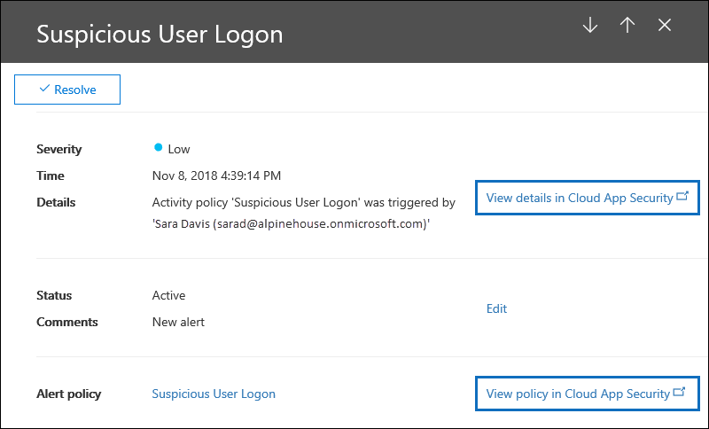

# <a name="alert-policies-in-the-microsoft-365-compliance-center"></a>Waarschuwingsbeleid in de Microsoft 365-compliancecentrum

U kunt de hulpmiddelen voor waarschuwingsbeleid en waarschuwingsdashboards in de Microsoft 365-compliancecentrum gebruiken om waarschuwingsbeleid te maken en vervolgens de waarschuwingen weer te geven die worden gegenereerd wanneer gebruikers activiteiten uitvoeren die voldoen aan de voorwaarden van een waarschuwingsbeleid. Er zijn verschillende standaardwaarschuwingsbeleidsregels die u helpen bij het controleren van activiteiten, zoals het toewijzen van beheerdersbevoegdheden in Exchange Online, malwareaanvallen, phishingcampagnes en ongebruikelijke niveaus van bestandsverwijding en extern delen.

Met waarschuwingsbeleid kunt u de waarschuwingen categoriseren die worden geactiveerd door een beleid, het beleid toepassen op alle gebruikers in uw organisatie, een drempelniveau instellen voor wanneer een waarschuwing wordt geactiveerd en bepalen of u e-mailmeldingen wilt ontvangen wanneer waarschuwingen worden geactiveerd. Er is ook  een pagina Waarschuwingen in het compliancecentrum waar u waarschuwingen kunt bekijken en filteren, een waarschuwingsstatus kunt instellen om waarschuwingen te beheren en waarschuwingen kunt verwijderen nadat u het onderliggende incident hebt opgelost of hebt opgelost.

> [!NOTE]
> Waarschuwingsbeleid is beschikbaar voor organisaties met een Microsoft 365 Enterprise-, Office 365 Enterprise- of Office 365 Us Government E1/F1/G1, E3/F3/G3- of E5/G5-abonnement. Geavanceerde functionaliteit is alleen beschikbaar voor organisaties met een E5/G5-abonnement of voor organisaties met een E1/F1/G1- of E3/F3/G3-abonnement en een Microsoft Defender voor Office 365 P2 of een Microsoft 365 E5 Compliance of een E5 eDiscovery- en Audit-invoegabonnement. De functionaliteit die een E5/G5- of invoegabonnement vereist, is gemarkeerd in dit onderwerp. Houd er ook rekening mee dat waarschuwingsbeleid beschikbaar is in Office 365 GCC, GCC High en DoD Us government environments.

## <a name="how-alert-policies-work"></a>Hoe waarschuwingsbeleid werkt

Hier wordt een kort overzicht gegeven van hoe waarschuwingsbeleid werkt en de waarschuwingen die worden triggers wanneer gebruikers- of beheerdersactiviteit overeenkomt met de voorwaarden van een waarschuwingsbeleid.


1. Een beheerder in uw organisatie maakt, configureert en schakelt een waarschuwingsbeleid in met behulp van de pagina **Waarschuwingsbeleid** in het compliancecentrum. U kunt ook waarschuwingsbeleid maken met de [cmdlet New-ProtectionAlert](/powershell/module/exchange/new-protectionalert) in Security & Compliance Center PowerShell.

   Als u waarschuwingsbeleid wilt maken, moet u de rol Waarschuwingen beheren of de rol Organisatieconfiguratie in het compliancecentrum krijgen toegewezen.

   > [!NOTE]
   > Het duurt maximaal 24 uur nadat u een waarschuwingsbeleid hebt gemaakt of bijgewerkt voordat waarschuwingen kunnen worden geactiveerd door het beleid. Dit komt omdat het beleid moet worden gesynchroniseerd met de waarschuwingsdetectie-engine.

2. Een gebruiker voert een activiteit uit die overeenkomt met de voorwaarden van een waarschuwingsbeleid. In het geval van malwareaanvallen worden geïnfecteerde e-mailberichten die naar gebruikers in uw organisatie worden verzonden, een waarschuwing uitgevoerd.

3. Microsoft 365 genereert een waarschuwing die wordt weergegeven op de pagina **Waarschuwingen** in Microsoft 365-compliancecentrum. Als e-mailmeldingen zijn ingeschakeld voor het waarschuwingsbeleid, stuurt Microsoft een melding naar een lijst met geadresseerden. De waarschuwingen die een beheerder of andere gebruikers kunnen zien, worden op de pagina Waarschuwingen bepaald door de rollen die aan de gebruiker zijn toegewezen. Zie [RBAC-machtigingen die nodig zijn om](#rbac-permissions-required-to-view-alerts)waarschuwingen weer te geven voor meer informatie.

4. Een beheerder beheert waarschuwingen in het compliancecentrum. Het beheren van waarschuwingen bestaat uit het toewijzen van een waarschuwingsstatus om een onderzoek bij te houden en te beheren.

## <a name="alert-policy-settings"></a>Instellingen voor waarschuwingsbeleid

Een waarschuwingsbeleid bestaat uit een set regels en voorwaarden die de activiteit van de gebruiker of beheerder definiëren die een waarschuwing genereert, een lijst met gebruikers die de waarschuwing activeren als ze de activiteit uitvoeren, en een drempelwaarde die bepaalt hoe vaak de activiteit moet plaatsvinden voordat een waarschuwing wordt geactiveerd. U categoriseert ook het beleid en wijst het een ernstniveau toe. Met deze twee instellingen kunt u waarschuwingsbeleid beheren (en de waarschuwingen die worden geactiveerd wanneer de beleidsvoorwaarden overeenkomen) omdat u op deze instellingen kunt filteren bij het beheren van beleidsregels en het weergeven van waarschuwingen in het compliancecentrum. U kunt bijvoorbeeld waarschuwingen weergeven die overeenkomen met de voorwaarden uit dezelfde categorie of waarschuwingen met hetzelfde ernstsniveau weergeven.

**Waarschuwingsbeleid weergeven en maken:**

Ga naar <https://compliance.microsoft.com> en selecteer **beleidsregels voor**  >    >  **waarschuwingsbeleid**. U kunt ook rechtstreeks naar <https://compliance.microsoft.com/alertpolicies> .


Een waarschuwingsbeleid bestaat uit de volgende instellingen en voorwaarden.

- **Activiteit die de waarschuwing bij het bijhouden is.** U maakt een beleid voor het bijhouden van een activiteit of in sommige gevallen een aantal verwante activiteiten, zoals het delen van een bestand met een externe gebruiker door het te delen, toegangsmachtigingen toe te wijzen of een anonieme koppeling te maken. Wanneer een gebruiker de activiteit uitvoert die door het beleid is gedefinieerd, wordt een waarschuwing geactiveerd op basis van de instellingen voor de drempelwaarde voor waarschuwingen.

    > [!NOTE]
    > De activiteiten die u kunt bijhouden, zijn afhankelijk van het Office 365 Enterprise of Office 365 amerikaanse overheidsplan. Voor activiteiten met betrekking tot malwarecampagnes en phishingaanvallen is over het algemeen een E5/G5-abonnement of een E1/F1/G1- of E3/F3/G3-abonnement met een Defender voor [Office 365](../security/office-365-security/defender-for-office-365.md) Abonnement 2-invoegabonnement vereist.

- **Activiteitsvoorwaarden**. Voor de meeste activiteiten kunt u aanvullende voorwaarden definiëren waar aan moet worden voldaan om een waarschuwing te activeren. Veelvoorkomende voorwaarden zijn IP-adressen (zodat een waarschuwing wordt geactiveerd wanneer de gebruiker de activiteit uitvoert op een computer met een specifiek IP-adres of binnen een IP-adresbereik), of een waarschuwing wordt geactiveerd als een specifieke gebruiker of gebruikers die activiteit uitvoeren en of de activiteit wordt uitgevoerd op een specifieke bestandsnaam of URL. U kunt ook een voorwaarde configureren die een waarschuwing activeert wanneer de activiteit wordt uitgevoerd door een gebruiker in uw organisatie. De beschikbare voorwaarden zijn afhankelijk van de geselecteerde activiteit.

- **Wanneer de waarschuwing wordt geactiveerd.** U kunt een instelling configureren die definieert hoe vaak een activiteit kan plaatsvinden voordat een waarschuwing wordt geactiveerd. Op deze manier kunt u een beleid instellen om een waarschuwing te genereren telkens wanneer een activiteit overeenkomt met de beleidsvoorwaarden, wanneer een bepaalde drempel wordt overschreden of wanneer het voorkomen van de activiteit die de waarschuwing bijwerkt ongebruikelijk wordt voor uw organisatie.

    

    Als u de instelling selecteert op basis van ongebruikelijke activiteit, stelt Microsoft een basislijnwaarde in die de normale frequentie voor de geselecteerde activiteit definieert. Het duurt maximaal zeven dagen om deze basislijn vast te stellen, waarbij waarschuwingen niet worden gegenereerd. Nadat de basislijn is ingesteld, wordt een waarschuwing geactiveerd wanneer de frequentie van de activiteit die door het waarschuwingsbeleid wordt bijgespoord, de basislijnwaarde sterk overschrijdt. Voor auditgerelateerde activiteiten (zoals bestands- en mapactiviteiten) kunt u een basislijn instellen op basis van één gebruiker of op basis van alle gebruikers in uw organisatie. voor malwaregerelateerde activiteiten kunt u een basislijn instellen op basis van één malwarefamilie, één geadresseerde of alle berichten in uw organisatie.

    > [!NOTE]
    > Voor het configureren van waarschuwingsbeleid op basis van een drempel of op basis van ongebruikelijke activiteiten is een E5/G5-abonnement of een E1/F1/G1- of E3/F3/G3-abonnement vereist met een Microsoft Defender-abonnement voor Office 365 P2, Microsoft 365 E5 Compliance of Microsoft 365 eDiscovery- en Audit-invoegabonnement. Organisaties met een E1/F1/G1- en E3/F3/G3-abonnement kunnen alleen waarschuwingsbeleid maken waarbij een waarschuwing wordt geactiveerd telkens wanneer een activiteit plaatsvindt.

- **Waarschuwingscategorie**. Als u wilt helpen bij het bijhouden en beheren van de waarschuwingen die door een beleid worden gegenereerd, kunt u een van de volgende categorieën aan een beleid toewijzen.

  - Preventie van gegevensverlies

  - Informatiebeheer

  - E-mailstroom

  - Machtigingen

  - Bedreigingsbeheer

  - Anderen

  Wanneer een activiteit plaatsvindt die overeenkomt met de voorwaarden van het waarschuwingsbeleid, wordt de gegenereerde waarschuwing gelabeld met de categorie die in deze instelling is gedefinieerd. Hiermee kunt u waarschuwingen bijhouden en beheren die  dezelfde categorieinstelling hebben op de pagina Waarschuwingen in het compliancecentrum, omdat u waarschuwingen kunt sorteren en filteren op basis van categorie.

- **Ernst van waarschuwing**. Net als bij de waarschuwingscategorie wijst u een ernstkenmerk **(Laag,** **Gemiddeld,** Hoog of **Informatief)** toe aan waarschuwingsbeleid. Net als bij de waarschuwingscategorie wordt, wanneer een activiteit plaatsvindt die overeenkomt met de voorwaarden van het waarschuwingsbeleid, de gegenereerde waarschuwing gelabeld met hetzelfde ernstsniveau dat is ingesteld voor het waarschuwingsbeleid. Nogmaals, hiermee kunt u waarschuwingen met dezelfde ernst op de pagina Waarschuwingen bijhouden **en** beheren. U kunt bijvoorbeeld de lijst met waarschuwingen filteren,  zodat alleen waarschuwingen met een hoge ernst worden weergegeven.

    > [!TIP]
    > Bij het instellen van een waarschuwingsbeleid kunt u overwegen om een hogere ernst toe te wijzen aan activiteiten die ernstige negatieve gevolgen kunnen hebben, zoals het opsporen van malware na de bezorging aan gebruikers, het weergeven van gevoelige of geclassificeerde gegevens, het delen van gegevens met externe gebruikers of andere activiteiten die kunnen leiden tot gegevensverlies of beveiligingsrisico's. Hiermee kunt u prioriteit geven aan waarschuwingen en de acties die u ondernomen om de onderliggende oorzaken te onderzoeken en op te lossen.

- **E-mailmeldingen**. U kunt het beleid zo instellen dat e-mailmeldingen worden verzonden (of niet) naar een lijst met gebruikers wanneer een waarschuwing wordt geactiveerd. U kunt ook een dagelijkse meldingslimiet instellen, zodat wanneer het maximum aantal meldingen is bereikt, er gedurende die dag geen meldingen meer worden verzonden voor de waarschuwing. Naast e-mailmeldingen kunnen u of andere beheerders de waarschuwingen bekijken die worden geactiveerd door een beleid op de **pagina Waarschuwingen.** U kunt e-mailmeldingen inschakelen voor waarschuwingsbeleid van een specifieke categorie of met een hogere ernst.

## <a name="default-alert-policies"></a>Standaardwaarschuwingsbeleid

Microsoft biedt ingebouwde waarschuwingsbeleiden die helpen bij het identificeren Exchange beheerdersmachtigingen misbruik, malwareactiviteit, potentiële externe en interne bedreigingen en risico's voor informatiebeheer. Op de **pagina Waarschuwingsbeleid** zijn de namen van deze ingebouwde beleidsregels vetgedrukt en wordt het beleidstype gedefinieerd als **Systeem.** Deze beleidsregels zijn standaard ingeschakeld. U kunt dit beleid uitschakelen (of opnieuw in- of uitschakelen), een lijst met geadresseerden instellen om e-mailmeldingen naar te verzenden en een dagelijkse meldingslimiet instellen. De andere instellingen voor dit beleid kunnen niet worden bewerkt.

In de volgende tabel worden het beschikbare standaardwaarschuwingsbeleid en de categorie aan elk beleid beschreven. De categorie wordt gebruikt om te bepalen welke waarschuwingen een gebruiker kan weergeven op de pagina Waarschuwingen. Zie [RBAC-machtigingen die nodig zijn om](#rbac-permissions-required-to-view-alerts)waarschuwingen weer te geven voor meer informatie.

In de tabel wordt ook aangegeven welke Office 365 Enterprise en Office 365 amerikaanse overheidsplan vereist zijn voor elk plan. Sommige standaardwaarschuwingsbeleidsregels zijn beschikbaar als uw organisatie het juiste invoegabonnement heeft naast een E1/F1/G1- of E3/F3/G3-abonnement.

| Standaardwaarschuwingsbeleid | Beschrijving | Categorie | Enterprise-abonnement |
|:-----|:-----|:-----|:-----|
|**Er is een potentieel schadelijke URL-klik gedetecteerd**|Genereert een waarschuwing wanneer een gebruiker die is beveiligd Safe [koppelingen](../security/office-365-security/safe-links.md) in uw organisatie op een schadelijke koppeling klikt. Deze gebeurtenis wordt geactiveerd wanneer url-wijzigingswijzigingen worden geïdentificeerd door Microsoft Defender voor Office 365 of wanneer gebruikers de pagina's Safe Koppelingen overschrijven (op basis van het Microsoft 365 voor bedrijven Safe Koppelingenbeleid van uw organisatie). Dit waarschuwingsbeleid heeft een **instelling met** hoge ernst. Voor Klanten van Defender Office 365 P2, E5, G5, worden met deze waarschuwing automatisch automatisch onderzoek en antwoord [in](../security/office-365-security/office-365-air.md)Office 365. Zie Beleidsregels voor koppelingen instellen Safe voor meer informatie over gebeurtenissen [die deze waarschuwing activeren.](../security/office-365-security/set-up-safe-links-policies.md)|Bedreigingsbeheer|E5/G5 of Defender voor Office 365 P2-invoegabonnement|
|**Resultaat van indiening door beheerder voltooid**|Genereert een waarschuwing wanneer een [beheerdersinzending](../security/office-365-security/admin-submission.md) de herscan van de ingediende entiteit voltooit. Er wordt een waarschuwing geactiveerd telkens wanneer een rescanresultaat wordt weergegeven vanuit een beheerdersinzending. Deze waarschuwingen zijn bedoeld om u eraan te herinneren om de resultaten van eerdere inzendingen te bekijken, gerapporteerde berichten van gebruikers in te dienen om de meest recente beleidscontrole te krijgen en vonnissen opnieuw te scannen, en u te helpen bepalen [of](https://protection.office.com/reportsubmission)het filterbeleid in uw organisatie het beoogde effect heeft. Dit beleid heeft een **instelling voor** de ernst van de informatie.|Bedreigingsbeheer|E1/F1, E3/F3 of E5|
|**Beheerder heeft handmatig onderzoek naar e-mail getriggerd**|Genereert een waarschuwing wanneer een beheerder het handmatige onderzoek van een e-mailbericht vanuit Threat Explorer activeert. Zie Voorbeeld: Een beveiligingsbeheerder activeert een onderzoek [vanuit Threat Explorer voor meer informatie.](../security/office-365-security/automated-investigation-response-office.md#example-a-security-administrator-triggers-an-investigation-from-threat-explorer) Deze waarschuwing meldt uw organisatie dat het onderzoek is gestart. De waarschuwing bevat informatie over wie de melding heeft geactiveerd en bevat een koppeling naar het onderzoek. Dit beleid heeft een **instelling voor** de ernst van de informatie.|Bedreigingsbeheer| E5/G5 of Microsoft Defender voor Office 365 P2-invoegabonnement| 
|**Doorstuur/omleidingsregel maken**|Hiermee wordt een waarschuwing gegenereerd wanneer iemand in uw organisatie een regel voor het Postvak IN maakt voor het postvak waarin berichten worden doorgestuurd of omgeleid naar een ander e-mailaccount. Met dit beleid worden alleen regels voor postvak IN bijgemaakt die worden gemaakt met webversie van Outlook (voorheen bekend als Outlook Web App) of Exchange Online PowerShell. Dit beleid heeft een **instelling voor** de ernst van de informatie. Zie Regels in webversie van Outlook gebruiken om berichten automatisch door te sturen naar een ander [account](https://support.office.com/article/1433e3a0-7fb0-4999-b536-50e05cb67fed)voor meer informatie over het gebruik van regels voor postvak IN voor het doorsturen en omleiden van e-mail in webversie van Outlook.|Bedreigingsbeheer|E1/F1/G1, E3/F3/G3 of E5/G5|
|**eDiscovery-zoekopdracht gestart of geëxporteerd**|Hiermee wordt een waarschuwing gegenereerd wanneer iemand het zoekprogramma Inhoud gebruikt in het beveiligings- en compliancecentrum. Er wordt een waarschuwing geactiveerd wanneer de volgende inhoudszoekactiviteiten worden uitgevoerd: <br/><br/>* Er wordt een inhoudszoekactie gestart<br/>* De resultaten van een inhoudszoekactie worden geëxporteerd<br/>* Een inhoudszoekrapport wordt geëxporteerd<br/><br/>Waarschuwingen worden ook geactiveerd wanneer de vorige inhoudszoekactiviteiten worden uitgevoerd in samenwerking met een eDiscovery-zaak. Dit beleid heeft een **instelling voor** de ernst van de informatie. Zie [EDiscovery-activiteiten](search-for-ediscovery-activities-in-the-audit-log.md#ediscovery-activities)zoeken in het auditlogboek voor meer informatie over inhoudszoekactiviteiten.|Bedreigingsbeheer|E1/F1/G1, E3/F3/G3 of E5/G5|
|**Verheffing van Exchange beheerdersvoorrechten**|Genereert een waarschuwing wanneer iemand beheerdersmachtigingen heeft toegewezen in uw Exchange Online organisatie. Bijvoorbeeld wanneer een gebruiker wordt toegevoegd aan de rollengroep Organisatiebeheer in Exchange Online. Dit beleid heeft de **instelling Lage** ernst.|Machtigingen|E1/F1/G1, E3/F3/G3 of E5/G5|
|**E-mailberichten met malware verwijderd na bezorging**|Genereert een waarschuwing wanneer berichten met malware worden bezorgd in postvakken in uw organisatie. Als deze gebeurtenis optreedt, verwijdert Microsoft de geïnfecteerde berichten uit Exchange Online postvakken met [automatische nul-uurs purge](../security/office-365-security/zero-hour-auto-purge.md). Dit beleid heeft een **instelling voor informationele** ernst en activeert automatisch automatisch onderzoek en [antwoord in Office 365.](../security/office-365-security/office-365-air.md)|Bedreigingsbeheer|E5/G5 of Microsoft Defender voor Office 365 P2-invoegabonnement|
|**E-mailberichten met schadelijke phishing-URL verwijderd na bezorging**|Genereert een waarschuwing wanneer berichten met phish worden bezorgd in postvakken in uw organisatie. Als deze gebeurtenis optreedt, verwijdert Microsoft de geïnfecteerde berichten uit Exchange Online postvakken met [automatische nul-uurs purge](../security/office-365-security/zero-hour-auto-purge.md). Dit beleid heeft een **instelling voor informationele** ernst en activeert automatisch automatisch onderzoek en [antwoord in Office 365.](../security/office-365-security/office-365-air.md)|Bedreigingsbeheer|E5/G5 of Defender voor Office 365 P2-invoegabonnement|
|**E-mail die door de gebruiker is gerapporteerd als malware of phishing**|Genereert een waarschuwing wanneer gebruikers in uw organisatie berichten rapporteren als phishing-e-mail met behulp van de invoeging Rapportbericht. Dit beleid heeft de **instelling Lage** ernst. Zie De invoeging Rapportbericht gebruiken voor meer informatie over [deze invoeging.](https://support.office.com/article/b5caa9f1-cdf3-4443-af8c-ff724ea719d2) Voor Klanten van Defender Office 365 P2, E5, G5, worden met deze waarschuwing automatisch automatisch onderzoek en antwoord [in](../security/office-365-security/office-365-air.md)Office 365.|Bedreigingsbeheer|E1/F1/G1, E3/F3/G3 of E5/G5|
|**Limiet voor het verzenden van e-mail overschreden**|Genereert een waarschuwing wanneer iemand in uw organisatie meer e-mail heeft verzonden dan is toegestaan door het uitgaande spambeleid. Dit is meestal een indicatie dat de gebruiker te veel e-mail verstuurt of dat het account mogelijk wordt gehackt. Dit beleid heeft de **instelling Gemiddelde** ernst. Als u een waarschuwing krijgt gegenereerd door dit waarschuwingsbeleid, is het een goed idee om te controleren of het [gebruikersaccount is gecompromitteerd.](../security/office-365-security/responding-to-a-compromised-email-account.md)|Bedreigingsbeheer|E1/F1/G1, E3/F3/G3 of E5/G5|
|**Formulier geblokkeerd vanwege mogelijke phishingpoging**|Genereert een waarschuwing wanneer iemand in uw organisatie is beperkt tot het delen van formulieren en het verzamelen van antwoorden met Microsoft Forms vanwege het gedetecteerde herhaalde phishinggedrag. Dit beleid heeft een **instelling met hoge ernst.**|Bedreigingsbeheer|E1, E3/F3 of E5|
|**Formulier gemarkeerd en bevestigd als phishing**|Genereert een waarschuwing wanneer een formulier dat is gemaakt in Microsoft Forms vanuit uw organisatie is geïdentificeerd als potentiële phishing via Misbruik van rapport en is bevestigd als phishing door Microsoft. Dit beleid heeft een **instelling met** hoge ernst.|Bedreigingsbeheer|E1, E3/F3 of E5|
|**Berichten zijn vertraagd**|Genereert een waarschuwing wanneer Microsoft geen e-mailberichten kan verzenden naar uw on-premises organisatie of een partnerserver met behulp van een verbindingslijn. Wanneer dit gebeurt, wordt het bericht in de wachtrij Office 365. Deze waarschuwing wordt geactiveerd wanneer er meer dan 2000 berichten in de wachtrij staan die langer dan een uur in de wachtrij staan. Dit beleid heeft een **instelling met** hoge ernst.|E-mailstroom|E1/F1/G1, E3/F3/G3 of E5/G5|
|**Malwarecampagne gedetecteerd na bezorging**|Genereert een waarschuwing wanneer een ongebruikelijk groot aantal berichten met malware wordt bezorgd in postvakken in uw organisatie. Als deze gebeurtenis optreedt, verwijdert Microsoft de geïnfecteerde berichten uit Exchange Online postvakken. Dit beleid heeft een **instelling met** hoge ernst.|Bedreigingsbeheer|E5/G5 of Microsoft Defender voor Office 365 P2-invoegabonnement|
|**Malwarecampagne gedetecteerd en geblokkeerd**|Genereert een waarschuwing wanneer iemand heeft geprobeerd een ongebruikelijk groot aantal e-mailberichten met een bepaald type malware naar gebruikers in uw organisatie te verzenden. Als deze gebeurtenis optreedt, worden de geïnfecteerde berichten geblokkeerd door Microsoft en niet bezorgd in postvakken. Dit beleid heeft de **instelling Lage** ernst.|Bedreigingsbeheer|E5/G5 of Defender voor Office 365 P2-invoegabonnement|
|**Malwarecampagne gedetecteerd in SharePoint en OneDrive**|Genereert een waarschuwing wanneer er een ongebruikelijk hoog volume malware of virussen wordt gedetecteerd in bestanden op SharePoint sites of OneDrive accounts in uw organisatie. Dit beleid heeft een **instelling met** hoge ernst.|Bedreigingsbeheer|E5/G5 of Defender voor Office 365 P2-invoegabonnement|
|**Malware niet gezapeerd omdat ZAP is uitgeschakeld**| Genereert een waarschuwing wanneer Microsoft de bezorging van een malwarebericht in een postvak detecteert omdat Zero-Hour Automatisch verwijderen voor Phish-berichten is uitgeschakeld. Dit beleid heeft een **instelling voor** de ernst van de informatie. |Bedreigingsbeheer|E5/G5 of Defender voor Office 365 P2-invoegabonnement|
|**Phish bezorgd omdat de map Ongewenste e-mail van een gebruiker is uitgeschakeld**|Genereert een waarschuwing wanneer Microsoft detecteert dat de map Ongewenste e-mail van een gebruiker is uitgeschakeld, zodat een phishingbericht met veel vertrouwen wordt bezorgd in een postvak. Dit beleid heeft een **instelling voor** de ernst van de informatie.|Bedreigingsbeheer|E5/G5 of Defender voor Office 365 P1- of P2-invoegabonnement|
|**Phish geleverd vanwege een ETR-override**|Genereert een waarschuwing wanneer Microsoft een Exchange transportregel (ETR) detecteert die het verzenden van een phishingbericht met veel vertrouwen naar een postvak heeft toegestaan. Dit beleid heeft een **instelling voor** de ernst van de informatie. Zie E-mailstroomregels [(transportregels) in](/exchange/security-and-compliance/mail-flow-rules/mail-flow-rules)Exchange Online voor meer informatie over Exchange Transportregels (E-mailstroomregels).|Bedreigingsbeheer|E5/G5 of Defender voor Office 365 P1- of P2-invoegabonnement|
|**Phish geleverd vanwege een IP-beleid voor toestaan**|Genereert een waarschuwing wanneer Microsoft een IP-beleid voor toestaan detecteert waarmee een phishingbericht met veel vertrouwen in een postvak kan worden bezorgd. Dit beleid heeft een **instelling voor** de ernst van de informatie. Zie Het standaardbeleid voor verbindingsfilter configureren - Office 365 voor meer informatie over het beleid [voor ip-toestaan (verbindingsfilters).](../security/office-365-security/configure-the-connection-filter-policy.md)|Bedreigingsbeheer|E5/G5 of Defender voor Office 365 P1- of P2-invoegabonnement|
|**Phish niet gezapig omdat ZAP is uitgeschakeld**| Genereert een waarschuwing wanneer Microsoft de bezorging van een phishingbericht met veel vertrouwen detecteert in een postvak omdat Zero-Hour automatisch verwijderen voor Phish-berichten is uitgeschakeld. Dit beleid heeft een **instelling voor** de ernst van de informatie.|Bedreigingsbeheer|E5/G5 of Defender voor Office 365 P2-invoegabonnement|
|**Phish geleverd vanwege tenant of gebruiker overschrijven**<sup>1</sup>|Genereert een waarschuwing wanneer Microsoft detecteert dat een beheerder of gebruiker de bezorging van een phishingbericht in een postvak heeft overschrijven. Voorbeelden van overschrijven zijn een regel voor postvak IN of e-mailstroom waarmee berichten van een specifieke afzender of domein kunnen worden verzonden, of een antispambeleid waarmee berichten van specifieke afzenders of domeinen kunnen worden verzonden. Dit beleid heeft een **instelling met** hoge ernst.|Bedreigingsbeheer|E5/G5 of Defender voor Office 365 P2-invoegabonnement|
|**Doorstuuractiviteit verdachte e-mail**|Genereert een waarschuwing wanneer iemand in uw organisatie automatisch e-mail heeft verzonden naar een verdacht extern account. Dit is een vroegtijdige waarschuwing voor gedrag dat kan aangeven dat het account is gehackt, maar niet ernstig genoeg om de gebruiker te beperken. Dit beleid heeft een **instelling met** hoge ernst. Hoewel dit zeldzaam is, kan een waarschuwing die door dit beleid wordt gegenereerd, een afwijking zijn. Het is een goed idee om te [controleren of het gebruikersaccount is gehackt.](../security/office-365-security/responding-to-a-compromised-email-account.md)|Bedreigingsbeheer|E1/F1/G1, E3/F3/G3 of E5/G5|
|**Verdachte e-mail verzenden patronen gedetecteerd**|Genereert een waarschuwing wanneer iemand in uw organisatie verdachte e-mail heeft verzonden en het risico loopt dat het verzenden van e-mail wordt beperkt. Dit is een vroegtijdige waarschuwing voor gedrag dat kan aangeven dat het account is gehackt, maar niet ernstig genoeg om de gebruiker te beperken. Dit beleid heeft de **instelling Gemiddelde** ernst. Hoewel dit zeldzaam is, kan een waarschuwing die door dit beleid wordt gegenereerd, een afwijking zijn. Het is echter een goed idee om te [controleren of het gebruikersaccount is gehackt.](../security/office-365-security/responding-to-a-compromised-email-account.md)|Bedreigingsbeheer|E1/F1/G1, E3/F3/G3 of E5/G5  |
|**Tenant beperkt tot het verzenden van e-mail**|Genereert een waarschuwing wanneer het grootste deel van het e-mailverkeer van uw organisatie is gedetecteerd als verdacht en Microsoft uw organisatie heeft beperkt om e-mail te verzenden. Onderzoek eventuele mogelijk gecompromitteerde gebruikers- en beheerdersaccounts, nieuwe connectors of open relays en neem vervolgens contact op met Microsoft Support om de blokkering van uw organisatie op te geven. Dit beleid heeft een **instelling met** hoge ernst. Zie Problemen met e-mailbezorging oplossen voor [foutcode 5.7.7xx in](/Exchange/mail-flow-best-practices/non-delivery-reports-in-exchange-online/fix-error-code-5-7-700-through-5-7-750)Exchange Online.|Bedreigingsbeheer|E1/F1/G1, E3/F3/G3 of E5/G5|
|**Ongebruikelijke externe gebruikersbestandsactiviteiten**|Genereert een waarschuwing wanneer een ongebruikelijk groot aantal activiteiten wordt uitgevoerd op bestanden in SharePoint of OneDrive door gebruikers buiten uw organisatie. Dit omvat activiteiten zoals het openen van bestanden, het downloaden van bestanden en het verwijderen van bestanden. Dit beleid heeft een **instelling met** hoge ernst.|Informatiebeheer|E5/G5, Microsoft Defender voor Office 365 P2 of Microsoft 365 E5 invoegabonnement|
|**Ongebruikelijk volume van extern delen van bestanden**|Genereert een waarschuwing wanneer een ongebruikelijk groot aantal bestanden in SharePoint of OneDrive worden gedeeld met gebruikers buiten uw organisatie. Dit beleid heeft de **instelling Gemiddelde** ernst.|Informatiebeheer|E5/G5, Defender voor Office 365 P2 of Microsoft 365 E5 invoegabonnement|
|**Ongebruikelijk volume van het verwijderen van bestanden**|Genereert een waarschuwing wanneer een ongebruikelijk groot aantal bestanden in een SharePoint of OneDrive binnen een korte periode wordt verwijderd. Dit beleid heeft de **instelling Gemiddelde** ernst.|Informatiebeheer|E5/G5, Defender voor Office 365 P2 of Microsoft 365 E5 invoegabonnement|
|**Ongebruikelijke toename van het aantal e-mails dat als phishing wordt gerapporteerd**|Genereert een waarschuwing wanneer het aantal personen in uw organisatie aanzienlijk is toegenomen met behulp van de invoeging Rapportbericht in Outlook om berichten te rapporteren als phishing-e-mail. Dit beleid heeft de **instelling Gemiddelde** ernst. Zie De invoeging Rapportbericht gebruiken voor meer informatie over [deze invoeging.](https://support.office.com/article/b5caa9f1-cdf3-4443-af8c-ff724ea719d2)|Bedreigingsbeheer|E5/G5 of Defender voor Office 365 P2-invoegabonnement|
|**User impersonation phish delivered to InBox/folder**<sup>1,</sup><sup>2</sup>|Genereert een waarschuwing wanneer Microsoft detecteert dat een beheerder of gebruiker die overschrijven heeft toegestaan dat een gebruiker een phishingbericht heeft bezorgd in het Postvak IN (of een andere map die toegankelijk is voor gebruikers) van een postvak. Voorbeelden van overschrijven zijn een regel voor postvak IN of e-mailstroom waarmee berichten van een specifieke afzender of domein kunnen worden verzonden, of een antispambeleid waarmee berichten van specifieke afzenders of domeinen kunnen worden verzonden. Dit beleid heeft de **instelling Gemiddelde** ernst.|Bedreigingsbeheer|E5/G5 of Defender voor Office 365 P2-invoegabonnement|
|**Gebruiker kan geen e-mail verzenden**|Genereert een waarschuwing wanneer iemand in uw organisatie geen uitgaande e-mail mag verzenden. Dit resulteert meestal wanneer een account wordt gecompromitteerd en de gebruiker wordt weergegeven op de pagina Beperkte gebruikers in de Microsoft 365-compliancecentrum.  (Als u deze pagina wilt openen, gaat u naar **Threat management > Review > Restricted Users**). Dit beleid heeft een **instelling met** hoge ernst. Zie Een gebruiker, domein of IP-adres verwijderen uit een bloklijst na het verzenden van [spam-e-mail](/office365/securitycompliance/removing-user-from-restricted-users-portal-after-spam)voor meer informatie over beperkte gebruikers.|Bedreigingsbeheer|E1/F1/G1, E3/F3/G3 of E5/G5|
|**Gebruiker beperkt tot het delen van formulieren en het verzamelen van antwoorden**|Genereert een waarschuwing wanneer iemand in uw organisatie is beperkt tot het delen van formulieren en het verzamelen van antwoorden met Microsoft Forms vanwege het gedetecteerde herhaalde phishinggedrag. Dit beleid heeft een **instelling met** hoge ernst.|Bedreigingsbeheer|E1, E3/F3 of E5|
|||||

> [!NOTE]
> <sup>1</sup> Dit standaardwaarschuwingsbeleid is tijdelijk verwijderd op basis van feedback van klanten. We werken aan een verbetering en vervangen deze in de nabije toekomst door een nieuwe versie. Tot die tijd kunt u een aangepast waarschuwingsbeleid maken om deze functionaliteit te vervangen met de volgende instellingen:<br/>&nbsp; * Activiteit is Phish-e-mail gedetecteerd op het moment van bezorging<br/>&nbsp; * Mail is niet ZAP'd<br/>&nbsp; * Mail direction is Inbound<br/>&nbsp; * De bezorgingsstatus voor e-mail wordt bezorgd<br/>&nbsp; * Detectietechnologie is Malicious URL retention, URL detonation, Advanced phish filter, General phish filter, Domain impersonation, User impersonation, and Brand impersonation<br/><br/>&nbsp;&nbsp;&nbsp;Zie [Anti-phishing- en anti-phishingbeleid](../security/office-365-security/set-up-anti-phishing-policies.md)instellen voor meer informatie over anti-phishing in Office 365 e-mail.<br/><br/><sup>2</sup> Als u dit waarschuwingsbeleid opnieuw wilt maken, volgt u de richtlijnen in de vorige voetnoot, maar kiest u Gebruikers-imitatie als de enige detectietechnologie.

De ongebruikelijke activiteit die door sommige van de ingebouwde beleidsregels wordt gecontroleerd, is gebaseerd op hetzelfde proces als de instelling voor de waarschuwingsdrempel die eerder is beschreven. Microsoft stelt een basislijnwaarde in waarmee de normale frequentie voor 'gebruikelijke' activiteit wordt bepaald. Waarschuwingen worden vervolgens geactiveerd wanneer de frequentie van activiteiten die door het ingebouwde waarschuwingsbeleid worden bijgespoord, de basislijnwaarde sterk overschrijdt.

## <a name="viewing-alerts"></a>Waarschuwingen weergeven

Wanneer een activiteit die door gebruikers in uw organisatie wordt uitgevoerd, overeenkomt met  de instellingen van een waarschuwingsbeleid, wordt er een waarschuwing gegenereerd en weergegeven op de pagina Waarschuwingen in het compliancecentrum. Afhankelijk van de instellingen van een waarschuwingsbeleid wordt er ook een e-mailmelding verzonden naar een lijst met opgegeven gebruikers wanneer een waarschuwing wordt geactiveerd. Voor elke waarschuwing worden  in het dashboard op de pagina Waarschuwingen de naam weergegeven van het bijbehorende waarschuwingsbeleid, de ernst en categorie van de waarschuwing (gedefinieerd in het waarschuwingsbeleid) en het aantal keren dat een activiteit heeft plaatsgevonden waardoor de waarschuwing werd gegenereerd. Deze waarde is gebaseerd op de drempelwaarde van het waarschuwingsbeleid. Het dashboard toont ook de status voor elke waarschuwing. Zie Waarschuwingen beheren voor meer informatie over het gebruik van de status-eigenschap voor het beheren [van waarschuwingen.](#managing-alerts)

Als u waarschuwingen wilt weergeven, gaat <https://compliance.microsoft.com> u naar en selecteert u Vervolgens **Waarschuwingen.** U kunt ook rechtstreeks naar <https://compliance.microsoft.com/compliancealerts> .


U kunt de volgende filters gebruiken om een subset van alle waarschuwingen op de pagina **Waarschuwingen weer te** geven.

- **Status.** Gebruik dit filter om waarschuwingen weer te geven die aan een bepaalde status zijn toegewezen. De standaardstatus is **Actief.** U of andere beheerders kunnen de statuswaarde wijzigen.

- **Beleid.** Gebruik dit filter om waarschuwingen weer te geven die overeenkomen met de instelling van een of meer waarschuwingsbeleidsregels. U kunt ook alle waarschuwingen weergeven voor alle waarschuwingsbeleidsregels.

- **Tijdsbereik.** Gebruik dit filter om waarschuwingen weer te geven die binnen een bepaald datum- en tijdbereik zijn gegenereerd.

- **Ernst.** Gebruik dit filter om waarschuwingen weer te geven die een bepaalde ernst hebben gekregen.

- **Categorie.** Gebruik dit filter om waarschuwingen uit een of meer waarschuwingscategorieën weer te geven.

- **Tags.** Gebruik dit filter om waarschuwingen van een of meer gebruikerslabels weer te geven. Tags worden weergegeven op basis van gelabelde postvakken of gebruikers die worden weergegeven in de waarschuwingen. Zie [Gebruikerslabels in Office 356 ATP](../security/office-365-security/user-tags.md) voor meer informatie.

- **Bron.** Gebruik dit filter om waarschuwingen weer te geven die worden geactiveerd door waarschuwingsbeleid in het compliancecentrum of waarschuwingen die worden geactiveerd door Office 365 Cloud App Security beleid, of beide. Zie Office 365 Cloud App Security waarschuwingen [weergeven voor meer informatie over Cloud App Security waarschuwingen.](#viewing-cloud-app-security-alerts)

> [!IMPORTANT]
> Filteren en sorteren op gebruikerslabels is momenteel in een openbaar voorbeeld.
> Het kan aanzienlijk worden gewijzigd voordat deze commercieel wordt uitgebracht. Microsoft biedt geen garanties, uitdrukkelijk of impliciet, met betrekking tot de informatie die erover wordt verstrekt.

## <a name="alert-aggregation"></a>Waarschuwingsaggregatie

Wanneer meerdere gebeurtenissen die overeenkomen met de voorwaarden van een waarschuwingsbeleid, in een korte periode plaatsvinden, worden ze toegevoegd aan een bestaande waarschuwing door een proces genaamd *waarschuwingsaggregatie.* Wanneer een gebeurtenis een waarschuwing activeert, wordt de  waarschuwing gegenereerd en weergegeven op de pagina Waarschuwingen en wordt er een melding verzonden. Als dezelfde gebeurtenis zich binnen het aggregatieinterval voordoet, wordt Microsoft 365 details over de nieuwe gebeurtenis toegevoegd aan de bestaande waarschuwing in plaats van een nieuwe waarschuwing te activeren. Het doel van een waarschuwingsaggregatie is om de waarschuwing 'vermoeidheid' te verminderen en u te laten focussen en actie te ondernemen op minder waarschuwingen voor dezelfde gebeurtenis.

De lengte van het aggregatieinterval is afhankelijk van uw Office 365 of Microsoft 365 abonnement.

|Abonnement|Aggregatieinterval|
|:---------|:---------:|
|Office 365 of Microsoft 365 E5/G5|1 minuut|
|Defender voor Office 365 Abonnement 2 |1 minuut|
|E5 Compliance add-on of E5 Discovery and Audit add-on|1 minuut|
|Office 365 of Microsoft 365 E1/F1/G1 of E3/F3/G3|15 minuten|
|Defender voor Office 365 Plan 1 of Exchange Online Protection|15 minuten|
|||

Wanneer gebeurtenissen die overeenkomen met hetzelfde waarschuwingsbeleid plaatsvinden binnen het aggregatieinterval, worden details over de volgende gebeurtenis toegevoegd aan de oorspronkelijke waarschuwing. Voor alle gebeurtenissen wordt informatie over samengevoegde gebeurtenissen weergegeven in het detailveld en wordt het aantal keren dat een gebeurtenis heeft plaatsgevonden met het aggregatieinterval weergegeven in het veld activiteit/aantal treffers. U kunt meer informatie over alle samengevoegde gebeurtenissen weergeven door de lijst met activiteiten weer te geven.

In de volgende schermafbeelding ziet u een waarschuwing met vier samengevoegde gebeurtenissen. De lijst met activiteiten bevat informatie over de vier e-mailberichten die relevant zijn voor de waarschuwing.


Houd rekening met de volgende zaken bij het aggregeren van waarschuwingen:

- Waarschuwingen die worden geactiveerd door **de klik op de A-potentieel schadelijke URL, zijn gedetecteerd** als standaardwaarschuwingsbeleid, worden niet samengevoegd. [](#default-alert-policies) Dit komt omdat waarschuwingen die door dit beleid worden geactiveerd, uniek zijn voor elke gebruiker en elk e-mailbericht.

- Op dit moment geeft de **eigenschap Hit count** alert niet het aantal samengevoegde gebeurtenissen voor alle waarschuwingsbeleidsregels aan. Voor waarschuwingen die worden geactiveerd door dit waarschuwingsbeleid, kunt u de samengevoegde gebeurtenissen bekijken door te klikken op **Berichtenlijst** weergeven of **Activiteit weergeven** in de waarschuwing. We werken aan het beschikbaar maken van het aantal samengevoegde gebeurtenissen dat wordt vermeld in de eigenschap **Hit count** alert voor alle waarschuwingsbeleidsregels.

## <a name="rbac-permissions-required-to-view-alerts"></a>RBAC-machtigingen die nodig zijn om waarschuwingen weer te geven

De RBAC-machtigingen (Role Based Access Control) die zijn toegewezen aan gebruikers in uw organisatie bepalen welke waarschuwingen een gebruiker kan zien op de **pagina Waarschuwingen.** Hoe wordt dit bereikt? De beheerrollen die aan gebruikers zijn toegewezen (op basis van hun lidmaatschap in rollengroepen in de Microsoft 365-compliancecentrum) bepalen welke waarschuwingscategorieën een gebruiker kan zien op de **pagina Waarschuwingen.** Dit zijn enkele voorbeelden:

- Leden van de rollengroep Recordsbeheer kunnen alleen de waarschuwingen bekijken die worden gegenereerd door waarschuwingsbeleid dat is toegewezen aan de categorie **Informatiebeheer.**

- Leden van de rollengroep Compliancebeheerder kunnen geen waarschuwingen weergeven die worden  gegenereerd door waarschuwingsbeleid dat is toegewezen aan de categorie Bedreigingsbeheer.

- Leden van de rollengroep eDiscovery Manager kunnen geen waarschuwingen weergeven omdat geen van de toegewezen rollen machtigingen biedt voor het weergeven van waarschuwingen vanuit een waarschuwingscategorie.

Met dit ontwerp (op basis van RBAC-machtigingen) kunt u bepalen welke waarschuwingen kunnen worden bekeken (en beheerd) door gebruikers in specifieke functierollen in uw organisatie.

In de volgende tabel worden de rollen vermeld die nodig zijn om waarschuwingen uit de zes verschillende waarschuwingscategorieën weer te geven. De eerste kolom in de tabellen bevat alle rollen in de Microsoft 365-compliancecentrum.  Een vinkje geeft aan dat een gebruiker aan wie deze rol is toegewezen, waarschuwingen kan weergeven uit de bijbehorende waarschuwingscategorie die in de bovenste rij wordt weergegeven.

Zie de tabel in [Standaardwaarschuwingsbeleid](#default-alert-policies)als u wilt zien aan welke categorie een standaardwaarschuwingsbeleid is toegewezen.

|Rol|Informatiebeheer|Preventie van gegevensverlies|E-mailstroom|Machtigingen|Bedreigingsbeheer|Anderen|
|:---------|:---------:|:---------:|:---------:|:---------:|:---------:|:---------:|
|Auditlogboeken|||||||
|Case Management|||||||
|Compliancebeheerder|||||||
|Compliancezoekactie|||||||
|Apparaatbeheer|||||||
|Disposition Management|||||||
|DLP-compliancebeheer|||||||
|Exporteren|||||||
|Wacht houden|||||||
|Waarschuwingen beheren|||||||
|Organisatieconfiguratie|||||||
|Voorbeeld|||||||
|Recordbeheer|||||||
|Bewaarbeheer|||||||
|Beoordelen|||||||
|RMS Decrypt|||||||
|Rollenbeheer|||||||
|Zoeken en zuiveren|||||||
|Beveiligingsadministrator|||||||
|Beveiligingslezer||||||
|Servicecontroleweergave|||||||
|Controlebeheerder|||||||
|View-Only auditlogboeken|||||||
|View-Only Apparaatbeheer|||||||
|View-Only DLP Compliance Management|||||||
|View-Only Waarschuwingen beheren|||||||
|View-Only Geadresseerden|||||||
|View-Only recordbeheer|||||||
|View-Only Bewaarbeheer|||||||
|||||||

> [!TIP]
> Als u de rollen wilt weergeven die aan elk van de standaardrolgroepen zijn toegewezen, voert u de volgende opdrachten uit in Beveiligings- & Compliancecentrum PowerShell:
> 
> ```powershell
> $RoleGroups = Get-RoleGroup
> ```
> 
> ```powershell
> $RoleGroups | foreach {Write-Output -InputObject `r`n,$_.Name,"-----------------------"; Get-RoleGroup $_.Identity | Select-Object -ExpandProperty Roles}
> ```
>
> U kunt ook de rollen weergeven die zijn toegewezen aan een rollengroep in de Microsoft 365-compliancecentrum. Ga naar de **pagina Machtigingen** en selecteer een rollengroep. De toegewezen rollen worden weergegeven op de flyoutpagina.

## <a name="managing-alerts"></a>Waarschuwingen beheren

Nadat waarschuwingen zijn gegenereerd en  weergegeven op de pagina Waarschuwingen in het compliancecentrum, kunt u deze triage, onderzoeken en oplossen. Hier zijn enkele taken die u kunt uitvoeren om waarschuwingen te beheren.

- **Een status toewijzen aan waarschuwingen.** U kunt een van de volgende statussen toewijzen aan waarschuwingen: **Actief** (de standaardwaarde), **Onderzoeken,** Opgelost **of** **Uitgeschakeld.** Vervolgens kunt u filteren op deze instelling om waarschuwingen weer te geven met dezelfde statusinstelling. Met deze statusinstelling kunt u het proces voor het beheren van waarschuwingen bijhouden.

- **Details van waarschuwingen weergeven.** U kunt een waarschuwing selecteren om een flyoutpagina weer te geven met informatie over de waarschuwing. De gedetailleerde informatie is afhankelijk van het bijbehorende waarschuwingsbeleid, maar bevat meestal het volgende:

  - De naam van de werkelijke bewerking die de waarschuwing heeft geactiveerd, zoals een cmdlet of een auditlogboekbewerking.

  - Een beschrijving van de activiteit die de waarschuwing heeft geactiveerd.

  - De gebruiker (of de lijst met gebruikers) die de waarschuwing heeft geactiveerd. Dit is alleen beschikbaar voor waarschuwingsbeleid dat is ingesteld voor het bijhouden van één gebruiker of één activiteit.

  - Het aantal keren dat de activiteit die door de waarschuwing is bijgespoord, is uitgevoerd. Dit aantal komt mogelijk niet overeen met het werkelijke aantal gerelateerde waarschuwingen dat op de pagina Waarschuwingen wordt vermeld, omdat er mogelijk meer waarschuwingen zijn geactiveerd.

  - Een koppeling naar een activiteitenlijst met een item voor elke activiteit die is uitgevoerd die de waarschuwing heeft geactiveerd. Elke vermelding in deze lijst geeft aan wanneer de activiteit heeft plaatsgevonden, de naam van de werkelijke bewerking (zoals 'FileDeleted'), de gebruiker die de activiteit heeft uitgevoerd, het object (zoals een bestand, een eDiscovery-zaak of een postvak) waarop de activiteit is uitgevoerd en het IP-adres van de computer van de gebruiker. Voor waarschuwingen die betrekking hebben op malware, wordt er een koppeling naar een berichtenlijst weergegeven.

  - De naam (en koppeling) van het bijbehorende waarschuwingsbeleid.

- **E-mailmeldingen onderdrukken.** U kunt e-mailmeldingen uitschakelen (of onderdrukken) vanaf de flyoutpagina voor een waarschuwing. Wanneer u e-mailmeldingen onderdrukt, verzendt Microsoft geen meldingen wanneer activiteiten of gebeurtenissen plaatsvinden die voldoen aan de voorwaarden van het waarschuwingsbeleid. Waarschuwingen worden echter geactiveerd wanneer activiteiten die door gebruikers worden uitgevoerd, voldoen aan de voorwaarden van het waarschuwingsbeleid. U kunt e-mailmeldingen ook uitschakelen door het waarschuwingsbeleid te bewerken.

- **Waarschuwingen oplossen.** U kunt een waarschuwing markeren als opgelost op de flyoutpagina voor een waarschuwing (waarmee de status van de waarschuwing wordt in stellen op **Opgelost).** Tenzij u het filter wijzigt, worden opgeloste waarschuwingen niet weergegeven op de **pagina Waarschuwingen.**

## <a name="viewing-cloud-app-security-alerts"></a>Waarschuwingen Cloud App Security weergeven

Waarschuwingen die worden geactiveerd door Office 365 Cloud App Security beleid, worden nu weergegeven op de **pagina Waarschuwingen** in het compliancecentrum. Dit geldt ook voor waarschuwingen die worden geactiveerd door activiteitenbeleid en waarschuwingen die worden geactiveerd door anomalydetectiebeleid in Office 365 Cloud App Security. Dit betekent dat u alle waarschuwingen in het compliancecentrum kunt bekijken. Office 365 Cloud App Security is alleen beschikbaar voor organisaties met een Office 365 Enterprise E5- of Office 365 Us Government G5-abonnement. Zie Overzicht van [Cloud App Security.](/cloud-app-security/what-is-cloud-app-security)

Organisaties die Microsoft Cloud App Security als onderdeel van een Enterprise Mobility + Security E5-abonnement of als zelfstandige service hebben, kunnen ook Cloud App Security-waarschuwingen weergeven die betrekking hebben op Microsoft 365-apps en -services in de Microsoft 365-compliancecentrum.

Als u alleen waarschuwingen Cloud App Security in het compliancecentrum wilt weergeven, gebruikt u **het** filter Bron en **selecteert u Cloud App Security.**


Net als bij een waarschuwing die is geactiveerd door een waarschuwingsbeleid in het compliancecentrum, kunt u een waarschuwing Cloud App Security om een flyoutpagina weer te geven met informatie over de waarschuwing. De waarschuwing bevat een koppeling om de details weer te geven en de waarschuwing te beheren in de Cloud App Security portal en een koppeling naar het bijbehorende Cloud App Security beleid dat de waarschuwing heeft geactiveerd. Zie [Waarschuwingen in Cloud App Security.](/cloud-app-security/monitor-alerts)



> [!IMPORTANT]
> Als u de status van een Cloud App Security in het compliancecentrum verandert, wordt de resolutiestatus voor dezelfde waarschuwing niet bijgewerkt in de Cloud App Security portal. Als u bijvoorbeeld de status van de waarschuwing als Opgelost **in** het compliancecentrum aanmerkt, blijft de status van de waarschuwing in de Cloud App Security portal ongewijzigd. Als u een waarschuwing wilt oplossen Cloud App Security sluiten, beheert u de waarschuwing in de Cloud App Security portal.
