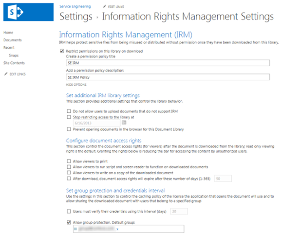

# IRM (Information Rights Management) toepassen op een lijst of bibliotheekApply Information Rights Management (IRM) to a list or library

U kunt IRM (Information Rights Management) gebruiken om bestanden te beheren en te beveiligen die worden gedownload uit lijsten of bibliotheken.You can use Information Rights Management (IRM) to help control and protect files that are downloaded from lists or libraries. Deze functie wordt alleen ondersteund in de globale microsoft-cloud.This feature is only supported in the Microsoft global cloud. IRM wordt niet ondersteund voor SharePoint lijsten en bibliotheken in nationale cloudimplementaties.IRM is not supported for SharePoint lists and libraries in national cloud deployments.
  
## Voorbereidingen voor beheerders voordat u IRM toe te passenAdministrator preparations before applying IRM

- De Azure Rights Management service (Azure RMS) van Azure Information Protection en het on-premises equivalent, Active Directory Rights Management Services (AD RMS), ondersteunen Information Rights Management voor sites.The Azure Rights Management service (Azure RMS) from Azure Information Protection, and the on-premises equivalent, Active Directory Rights Management Services (AD RMS), support Information Rights Management for sites. Er zijn geen afzonderlijke of extra installaties vereist.No separate or additional installations are required.

- Voordat u IRM op een lijst of bibliotheek gaat toepassen, moet u IRM voor uw site inschakelen.Before you apply IRM to a list or library, you need to enable IRM for your site. U hebt beheerdersmachtigingen nodig om IRM in te stellen.You'll need administrator permissions to enable IRM.

- Als u IRM wilt toepassen op een lijst of bibliotheek, moet u beheerdersmachtigingen hebben voor die lijst of bibliotheek.To apply IRM to a list or library, you must have administrator permissions for that list or library.

- Als u gebruik maakt van SharePoint Online, kunnen uw gebruikers time-outs ervaren bij het downloaden van grotere met IRM beveiligde bestanden.If you're using SharePoint Online, your users might experience timeouts when downloading larger IRM-protected files. Als u time-outs wilt voorkomen, gebruikt u uw Office programma's om IRM-beveiliging toe te passen en grotere bestanden op te slaan in een SharePoint bibliotheek die geen IRM gebruikt.To avoid timeouts, use your Office programs to apply IRM protection, and store larger files in a SharePoint library that doesn't use IRM.

> [!NOTE]
> Als u SharePoint Server 2013 gebruikt, moet een serverbeheerder beschermers installeren op alle front-endwebservers voor elk bestandstype dat de personen in uw organisatie willen beveiligen met behulp van IRM.If you're using SharePoint Server 2013, a server administrator must install protectors on all front-end Web servers for every file type that the people in your organization want to protect by using IRM.
  
## IRM toepassen op een lijst of bibliotheekApply IRM to a list or library

  
1. Ga naar de lijst of bibliotheek waarvoor u IRM wilt configureren.Go to the list or library for which you want to configure IRM.

2. Selecteer op het lint het tabblad **Bibliotheek** en selecteer vervolgens **Bibliotheek Instellingen.**On the ribbon, select the **Library** tab, and then select **Library Settings**. (Als u in een lijst werkt, selecteert u **het** tabblad Lijst en selecteert u **vervolgens Lijst Instellingen).**(If you're working in a list, select the **List** tab, and then select **List Settings**).
    
    
  
3. Selecteer **onder Machtigingen en beheer** de optie Information Rights **Management**.Under **Permissions and Management**, select **Information Rights Management**. Als de koppeling Information Rights Management niet wordt weergegeven, is IRM mogelijk niet ingeschakeld voor uw site.If the Information Rights Management link doesn't appear, IRM might not be enabled for your site. Neem contact op met de serverbeheerder om te kijken of u IRM voor uw site kunt inschakelen.Contact your server administrator to see if you can enable IRM for your site. De **koppeling Information Rights Management** wordt niet weergegeven voor afbeeldingsbibliotheken.The **Information Rights Management** link doesn't appear for picture libraries.

4. Schakel op **de pagina Information Rights Management Instellingen** het selectievakje Machtiging beperken voor documenten in deze bibliotheek bij **downloaden** in om beperkte machtigingen toe te passen op documenten die gebruikers uit deze lijst of bibliotheek downloaden.On the **Information Rights Management Settings** page, select the **Restrict permission to documents in this library on download** check box to apply restricted permission to documents users download from this list or library.

5. Voer in **het vak Titel van** machtigingsbeleid maken een beschrijvende naam voor het beleid in.In the **Create a permission policy title** box, enter a descriptive name for the policy. Gebruik een naam waarmee u dit beleid kunt identificeren op basis van andere beleidsregels.Use a name that helps you identify this policy from other policies. Gebruik bijvoorbeeld Bedrijfs **vertrouwelijk om** beperkte machtigingen toe te passen op een lijst of bibliotheek met vertrouwelijke bedrijfsdocumenten.For example, use **Company Confidential** to apply restricted permissions to a list or library that contains confidential company documents.

6. Typ in **het** vak Beschrijving van machtigingsbeleid toevoegen een beschrijving die wordt weergegeven voor personen die deze lijst of bibliotheek gebruiken, waarin wordt uitgelegd hoe ze de documenten in deze lijst of bibliotheek moeten verwerken.In the **Add a permission policy description** box, type a description that will appear to people who use this list or library that explains how they should handle the documents in this list or library. U kunt bijvoorbeeld alleen de inhoud van dit document bespreken typen **met** andere werknemers als u de toegang tot de informatie in deze documenten wilt beperken tot interne werknemers.For example, you can type **Discuss the contents of this document only with other employees** if you want to restrict access to the information in these documents to internal employees. 

7. Als u extra beperkingen wilt toepassen op de documenten in deze lijst of bibliotheek, **selecteert** u Opties tonen en doet u een van de volgende opties:To apply additional restrictions to the documents in this list or library, select **Show Options**, and do any of the following:

|**Ga als volgende te werk:****To do this:**|**Ga als volgende te werk:****Do this:**|
|:-----|:-----|
|Personen toestaan documenten uit deze lijst of bibliotheek af te drukkenAllow people to print documents from this list or library|Schakel het **selectievakje Toestaan dat gebruikers kunnen afdrukken** in.Select the **Allow viewers to print** check box.|
|Sta personen met ten minste de machtiging Items weergeven toe om ingesloten code of macro's in een document uit te voeren.Allow people with at least the View Items permission to run embedded code or macros on a document.|Schakel het **selectievakje Toestaan dat gebruikers script en schermlezer** kunnen uitvoeren in voor gedownloade documenten in. Als u deze optie selecteert, kunnen gebruikers code uitvoeren om de inhoud van een document op te halen.Select the **Allow viewers to run script and screen reader to function on downloaded documents** check box.If you select this option, users could run code to extract the contents of a document.           |
|Selecteer deze optie als u de toegang tot inhoud tot een bepaalde periode wilt beperken.Select this option if you want to restrict access to content to a specified period of time. Als u deze optie selecteert, verlopen de uitgiftelicenties van personen voor toegang tot de inhoud na het opgegeven aantal dagen en moeten personen terugkeren naar de server om hun referenties te verifiëren en een nieuw exemplaar te downloaden.If you select this option, people's issuance licenses to access the content will expire after the specified number of days, and people will be required to return to the server to verify their credentials and download a new copy.|Schakel het selectievakje Na het downloaden de rechten voor documenttoegang na dit aantal dagen **(1-365)** in en geef vervolgens het aantal dagen op waarvoor u wilt dat het document kan worden bekeken.Select the **After download, document access rights will expire after these number of days (1-365)** check box, and then specify the number of days for which you want the document to be viewable.|
| Voorkomen dat personen documenten uploaden die geen ondersteuning bieden voor IRM naar deze lijst of bibliotheek.Prevent people from uploading documents that do not support IRM to this list or library. Als u deze optie selecteert, kunnen personen geen van de volgende bestandstypen uploaden: Bestandstypen waarop geen bijbehorende IRM-beschermers zijn geïnstalleerd op alle front-endwebservers.If you select this option, people will not be able to upload any of the following file types: File types that do not have corresponding IRM protectors installed on all of the front-end web servers. Bestandstypen die SharePoint Server 2010 kunnen niet worden ontsleuteld.File types that SharePoint Server 2010 cannot decrypt. Bestandstypen die IRM-beveiligd zijn in een ander programma.File types that are IRM protected in another program.|Schakel het selectievakje Geen gebruikers toestaan om documenten te uploaden die geen **ondersteuning bieden voor IRM** in.Select the **Do not allow users to upload documents that do not support IRM** check box.|
|Verwijder beperkte machtigingen uit deze lijst of bibliotheek op een bepaalde datum.Remove restricted permissions from this list or library on a specific date.|Schakel het **selectievakje Toegang beperken tot de bibliotheek** stoppen bij in en selecteer vervolgens de juiste datum.Select the **Stop restricting access to the library at** check box, and then select the date that you want.|
|Besturingselement het interval dat referenties in de cache worden opgeslagen voor het programma dat is gelicentieerd om het document te openen.Control the interval that credentials are cached for the program that is licensed to open the document.|Schakel het selectievakje Gebruikers moeten hun referenties verifiëren met behulp van dit **interval (dagen)** in en voer vervolgens het interval in voor cachingreferenties in het aantal dagen.Select the **Users must verify their credentials using this interval (days)** check box, then enter the interval for caching credentials in number of days.|
|Groepsbeveiliging toestaan, zodat gebruikers kunnen delen met leden van dezelfde groep.Allow group protection so that users can share with members of the same group.|Selecteer **Groepsbeveiliging toestaan** en voer de naam van de groep in voor delen.Select **Allow group protection**, and enter the group's name for sharing.|

8. Nadat u klaar bent met het selecteren van de opties die u wilt selecteren, selecteert u **OK.**After you finish selecting the options you want, select **OK**.
  
## Wat is Information Rights Management?What is Information Rights Management?

Met IRM (Information Rights Management) kunt u de acties beperken die gebruikers kunnen uitvoeren op bestanden die zijn gedownload uit lijsten of bibliotheken.Information Rights Management (IRM) enables you to limit the actions that users can take on files that have been downloaded from lists or libraries. IRM versleutelt de gedownloade bestanden en beperkt de set gebruikers en programma's die deze bestanden mogen ontsleutelen.IRM encrypts the downloaded files and limits the set of users and programs that are allowed to decrypt these files. IRM kan ook de rechten beperken van de gebruikers die bestanden mogen lezen, zodat ze geen acties kunnen uitvoeren, zoals kopieën van de bestanden afdrukken of tekst ervan kopiëren.IRM can also limit the rights of the users who are allowed to read files, so that they cannot take actions such as print copies of the files or copy text from them.
  
U kunt IRM in lijsten of bibliotheken gebruiken om de verspreiding van gevoelige inhoud te beperken.You can use IRM on lists or libraries to limit the dissemination of sensitive content. Als u bijvoorbeeld een documentbibliotheek maakt om informatie over toekomstige producten te delen met geselecteerde marketingvertegenwoordigers, kunt u IRM gebruiken om te voorkomen dat deze personen deze inhoud delen met andere werknemers in het bedrijf.For example, if you are creating a document library to share information about upcoming products with selected marketing representatives, you can use IRM to prevent these individuals from sharing this content with other employees in the company.
  
Op een site kunt u IRM toepassen op een hele lijst of bibliotheek, in plaats van op afzonderlijke bestanden.On a site, you apply IRM to an entire list or library, rather than to individual files. Hierdoor kunt u eenvoudiger een consistent beveiligingsniveau voor een hele set documenten of bestanden garanderen.This makes it easier to ensure a consistent level of protection for an entire set of documents or files. IRM kan uw organisatie helpen bij het afdwingen van bedrijfsbeleid dat van toepassing is op het gebruik en de verspreiding van vertrouwelijke of bedrijfseigen informatie.IRM can thus help your organization to enforce corporate policies that govern the use and dissemination of confidential or proprietary information.
  
> [!NOTE]
> De informatie op deze pagina met betrekking tot Information Rights Management komt boven alle voorwaarden die verwijzen naar 'Information Rights Management' in een licentieovereenkomst van Microsoft SharePoint Server 2013 en SharePoint Server 2016.The information on this page regarding Information Rights Management supersedes any terms that reference 'Information Rights Management' in any Microsoft SharePoint Server 2013 and SharePoint Server 2016 license term agreements. 
  
### Hoe IRM inhoud kan beschermenHow IRM can help protect content

IRM helpt om beperkte inhoud op de volgende manieren te beveiligen:IRM helps to protect restricted content in the following ways:
  
- Hiermee voorkomt u dat een geautoriseerde viewer de inhoud kopieert, wijzigt, afdrukt, faxt of kopieert en kopieert voor niet-geautoriseerd gebruikHelps to prevent an authorized viewer from copying, modifying, printing, faxing, or copying and pasting the content for unauthorized use
    
- Hiermee voorkomt u dat een geautoriseerde viewer de inhoud kopieert met de functie Scherm afdrukken in Microsoft WindowsHelps to prevent an authorized viewer from copying the content by using the Print Screen feature in Microsoft Windows
    
- Hiermee voorkomt u dat een niet-geautoriseerde viewer de inhoud kan bekijken als deze per e-mail wordt verzonden nadat deze van de server is gedownloadHelps to prevent an unauthorized viewer from viewing the content if it is sent in e-mail after it is downloaded from the server
    
- Beperkt de toegang tot inhoud tot een bepaalde periode, waarna gebruikers hun referenties moeten bevestigen en de inhoud opnieuw moeten downloadenRestricts access to content to a specified period of time, after which users must confirm their credentials and download the content again
    
- Helpt bij het afdwingen van bedrijfsbeleid dat van toepassing is op het gebruik en de verspreiding van inhoud binnen uw organisatieHelps to enforce corporate policies that govern the use and dissemination of content within your organization
    
### Hoe IRM inhoud niet kan beschermenHow IRM cannot help protect content

IRM kan beperkte inhoud niet als volgt beveiligen:IRM cannot protect restricted content from the following:
  
- Wissen, diefstal, vastleggen of verzenden door schadelijke programma's zoals Trojaanse paarden, toetsaanslagloggers en bepaalde typen spywareErasure, theft, capture, or transmission by malicious programs such as Trojan horses, keystroke loggers, and certain types of spyware
    
- Verlies of beschadiging vanwege de acties van computervirussenLoss or corruption because of the actions of computer viruses
    
- Handmatig kopiëren of opnieuwtyping van inhoud vanuit de weergave op een schermManual copying or retyping of content from the display on a screen
    
- Digitale of filmfoto's van inhoud die wordt weergegeven op een schermDigital or film photography of content that is displayed on a screen
    
- Kopiëren via het gebruik van schermopnameprogramma's van derdenCopying through the use of third-party screen-capture programs
    
- Kopiëren van metagegevens van inhoud (kolomwaarden) via het gebruik van programma's voor schermopname van derden of kopieer- en plakactieCopying of content metadata (column values) through the use of third-party screen-capture programs or copy-and-paste action
  
## Hoe IRM werkt voor lijsten en bibliothekenHow IRM works for lists and libraries

IRM-beveiliging wordt toegepast op bestanden op lijst- of bibliotheekniveau.IRM protection is applied to files at the list or library level. Wanneer IRM is ingeschakeld voor een bibliotheek, is rechtenbeheer van toepassing op alle bestanden in die bibliotheek.When IRM is enabled for a library, rights management applies to all of the files in that library. Wanneer IRM is ingeschakeld voor een lijst, is rechtenbeheer alleen van toepassing op bestanden die zijn gekoppeld aan lijstitems, niet de werkelijke lijstitems.When IRM is enabled for a list, rights management applies only to files that are attached to list items, not the actual list items.
  
Wanneer personen bestanden downloaden in een lijst of bibliotheek met IRM-functie, worden de bestanden versleuteld, zodat alleen geautoriseerde personen ze kunnen bekijken.When people download files in an IRM-enabled list or library, the files are encrypted so that only authorized people can view them. Elk door rechten beheerd bestand bevat ook een uitgiftelicentie die beperkingen oplegt aan de personen die het bestand bekijken.Each rights-managed file also contains an issuance license that imposes restrictions on the people who view the file. Typische beperkingen zijn het maken van een bestand alleen-lezen, het uitschakelen van het kopiëren van tekst, het voorkomen dat personen een lokale kopie opslaan en voorkomen dat personen het bestand afdrukken.Typical restrictions include making a file read-only, disabling the copying of text, preventing people from saving a local copy, and preventing people from printing the file. Clientprogramma's die door IRM ondersteunde bestandstypen kunnen lezen, gebruiken de uitgiftelicentie in het door rechten beheerde bestand om deze beperkingen af te dwingen.Client programs that can read IRM-supported file types use the issuance license within the rights-managed file to enforce these restrictions. Op deze manier behoudt een door rechten beheerd bestand de beveiliging ervan, zelfs nadat het van de server is gedownload.This is how a rights-managed file retains its protection even after it is downloaded from the server.
  
De typen beperkingen die worden toegepast op een bestand wanneer het wordt gedownload uit een lijst of bibliotheek, zijn gebaseerd op de machtigingen van de afzonderlijke gebruiker op de site die het bestand bevat.The types of restrictions that are applied to a file when it is downloaded from a list or library are based on the individual user's permissions on the site that contains the file. In de volgende tabel wordt uitgelegd hoe de machtigingen op sites overeenkomen met IRM-machtigingen.The following table explains how the permissions on sites correspond to IRM permissions.
  
|**Machtigingen****Permissions**|**IRM-machtigingen****IRM Permissions**|
|:-----|:-----|
|Machtigingen beheren, website beherenManage Permissions, Manage Web Site|**Volledig beheer** (zoals gedefinieerd door het clientprogramma): Met deze machtiging kan een gebruiker over het algemeen machtigingen voor door rechten beheerde inhoud lezen, bewerken, kopiëren, opslaan en wijzigen.**Full control** (as defined by the client program): This permission generally allows a user to read, edit, copy, save, and modify permissions of rights-managed content.|
|Items bewerken, Lijsten beheren, Pagina's toevoegen en aanpassenEdit Items, Manage Lists, Add and Customize Pages|**Bewerken,** **kopiëren** en **opslaan:** een gebruiker kan  een bestand alleen afdrukken als het selectievakje Gebruikers toestaan documenten af te drukken is ingeschakeld op de pagina Information Rights Management Instellingen voor de lijst of bibliotheek.**Edit**, **Copy**, and **Save**: A user can print a file only if the **Allow users to print documents** check box is selected on the Information Rights Management Settings page for the list or library.|
|Items weergevenView Items|**Lezen:** Een gebruiker kan het document lezen, maar kan de inhoud ervan niet kopiëren of wijzigen.**Read**: A user can read the document, but cannot copy or modify its content. Een gebruiker kan alleen afdrukken als het selectievakje **Gebruikers toestaan** documenten af te drukken is ingeschakeld op de pagina Information Rights Management Instellingen voor de lijst of bibliotheek.A user can print only if the **Allow users to print documents** check box is selected on the Information Rights Management Settings page for the list or library.|
|OverigeOther|Geen andere machtigingen komen rechtstreeks overeen met IRM-machtigingen.No other permissions correspond directly to IRM permissions.|
   
Wanneer u IRM inschakelen voor een lijst of bibliotheek in SharePoint Server 2013, kunt u alleen bestandstypen in die lijst of bibliotheek beveiligen waarvoor een protector is geïnstalleerd op alle front-endwebservers.When you enable IRM for a list or library in SharePoint Server 2013, you can only protect file types in that list or library for which a protector is installed on all front-end web servers. Een protector is een programma dat de versleuteling en ontsleuteling van door rechten beheerde bestanden van een specifieke bestandsindeling regelt.A protector is a program that controls the encryption and decryption of rights-managed files of a specific file format. SharePoint bevat beschermers voor de volgende bestandstypen:SharePoint includes protectors for the following file types:
  
- Microsoft Office InfoPath-formulierenMicrosoft Office InfoPath forms
    
- De bestandsindelingen 97-2003 voor de volgende Microsoft Office: Word, Excel en PowerPointThe 97-2003 file formats for the following Microsoft Office programs: Word, Excel, and PowerPoint
    
- De Office XML-indelingen openen voor de volgende Microsoft Office: Word, Excel en PowerPointThe Office Open XML Formats for the following Microsoft Office programs: Word, Excel, and PowerPoint
    
- De XPS-indeling (XML Paper Specification)The XML Paper Specification (XPS) format
    
Als uw organisatie van plan is IRM te gebruiken om andere bestandstypen te beveiligen, moet uw serverbeheerder beschermers installeren voor deze extra bestandsindelingen.If your organization plans to use IRM to protect any other file types in addition to those listed above, your server administrator must install protectors for these additional file formats.
  

