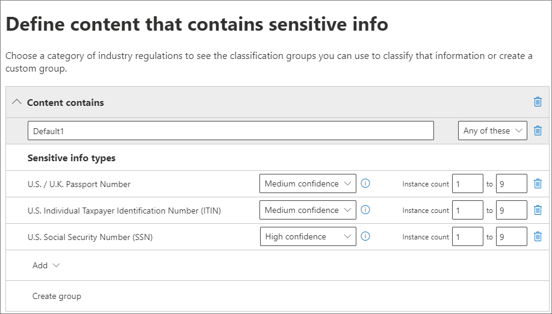
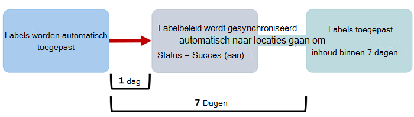

# <a name="automatically-apply-a-retention-label-to-retain-or-delete-content"></a><span data-ttu-id="8e47d-103">Automatisch een retentielabel toepassen om inhoud te behouden of te verwijderen</span><span class="sxs-lookup"><span data-stu-id="8e47d-103">Automatically apply a retention label to retain or delete content</span></span>

><span data-ttu-id="8e47d-104">*[Richtlijnen voor Microsoft 365-licenties voor beveiliging en compliance](/office365/servicedescriptions/microsoft-365-service-descriptions/microsoft-365-tenantlevel-services-licensing-guidance/microsoft-365-security-compliance-licensing-guidance).*</span><span class="sxs-lookup"><span data-stu-id="8e47d-104">*[Microsoft 365 licensing guidance for security & compliance](/office365/servicedescriptions/microsoft-365-service-descriptions/microsoft-365-tenantlevel-services-licensing-guidance/microsoft-365-security-compliance-licensing-guidance).*</span></span>

> [!NOTE]
> <span data-ttu-id="8e47d-105">Dit scenario wordt niet ondersteund voor [wettelijk verplichte records](records-management.md#records).</span><span class="sxs-lookup"><span data-stu-id="8e47d-105">This scenario is not supported for [regulatory records](records-management.md#records).</span></span>

<span data-ttu-id="8e47d-106">Een van de krachtigste functies van [retentielabels](retention.md) is de mogelijkheid om deze automatisch toe te passen op inhoud die aan bepaalde voorwaarden voldoet.</span><span class="sxs-lookup"><span data-stu-id="8e47d-106">One of the most powerful features of [retention labels](retention.md) is the ability to apply them automatically to content that matches specified conditions.</span></span> <span data-ttu-id="8e47d-107">In dit geval hoeven personen in uw organisatie de retentielabels niet toe te passen.</span><span class="sxs-lookup"><span data-stu-id="8e47d-107">In this case, people in your organization don't need to apply the retention labels.</span></span> <span data-ttu-id="8e47d-108">Microsoft 365 doet het werk voor hen.</span><span class="sxs-lookup"><span data-stu-id="8e47d-108">Microsoft 365 does the work for them.</span></span>
  
<span data-ttu-id="8e47d-109">Het automatisch toepassen van retentielabels is een krachtige functie omdat:</span><span class="sxs-lookup"><span data-stu-id="8e47d-109">Auto-applying retention labels are powerful because:</span></span>
  
- <span data-ttu-id="8e47d-110">U uw gebruikers niet hoeft te trainen in al uw classificaties.</span><span class="sxs-lookup"><span data-stu-id="8e47d-110">You don't need to train your users on all of your classifications.</span></span>
    
- <span data-ttu-id="8e47d-111">U niet hoeft te vertrouwen op gebruikers om alle inhoud op de juiste manier te classificeren.</span><span class="sxs-lookup"><span data-stu-id="8e47d-111">You don't need to rely on users to classify all content correctly.</span></span>
    
- <span data-ttu-id="8e47d-112">Gebruikers hoeven niet langer meer op de hoogte te zijn van beleidsregels voor gegevensbeheer. Ze kunnen zich op hun werk concentreren.</span><span class="sxs-lookup"><span data-stu-id="8e47d-112">Users no longer need to know about data governance policies - they can focus on their work.</span></span>
    
<span data-ttu-id="8e47d-113">U kunt retentielabels automatisch toepassen op inhoud wanneer deze inhoud gevoelige informatie, trefwoorden of doorzoekbare eigenschappen of een overeenkomst voor [trainbare classificaties](classifier-get-started-with.md) bevat.</span><span class="sxs-lookup"><span data-stu-id="8e47d-113">You can apply retention labels to content automatically when that content contains sensitive information, keywords or searchable properties, or a match for [trainable classifiers](classifier-get-started-with.md).</span></span>

> [!TIP]
> <span data-ttu-id="8e47d-114">Gebruik de onlangs uitgebrachte doorzoekbare eigenschappen om [opnamen van een Teams-vergadering](#microsoft-teams-meeting-recordings) te herkennen.</span><span class="sxs-lookup"><span data-stu-id="8e47d-114">Recently released, use searchable properties to identify [Teams meeting recordings](#microsoft-teams-meeting-recordings).</span></span>

<span data-ttu-id="8e47d-115">De processen voor het automatisch toepassen van een bewaarlabel op basis van deze voorwaarden:</span><span class="sxs-lookup"><span data-stu-id="8e47d-115">The processes to automatically apply a retention label based on these conditions:</span></span>


<span data-ttu-id="8e47d-117">Gebruik de volgende instructies voor de twee beheerstappen.</span><span class="sxs-lookup"><span data-stu-id="8e47d-117">Use the following instructions for the two admin steps.</span></span>

> [!NOTE]
> <span data-ttu-id="8e47d-118">Bij automatisch beleid wordt labelen aan servicezijde gebruikt met voorwaarden om automatisch bewaarlabels toe te passen.</span><span class="sxs-lookup"><span data-stu-id="8e47d-118">Auto-policies use service-side labeling with conditions to automatically apply retention labels.</span></span> <span data-ttu-id="8e47d-119">U kunt ook automatisch een bewaarlabel met een labelbeleid toepassen wanneer u het volgende doet:</span><span class="sxs-lookup"><span data-stu-id="8e47d-119">You can also automatically apply a retention label with a label policy when you do the following:</span></span> 
>
> - <span data-ttu-id="8e47d-120">Een bewaarlabel toepassen op een document met een model voor het begrijpen van informatie in SharePoint Syntex</span><span class="sxs-lookup"><span data-stu-id="8e47d-120">Apply a retention label to a document understanding model in SharePoint Syntex</span></span>
> - <span data-ttu-id="8e47d-121">Een standaard retentielabel toepassen voor SharePoint en Outlook</span><span class="sxs-lookup"><span data-stu-id="8e47d-121">Apply a default retention label for SharePoint and Outlook</span></span>
>- <span data-ttu-id="8e47d-122">Een retentielabel toepassen op e-mail met behulp van Outlook-regels</span><span class="sxs-lookup"><span data-stu-id="8e47d-122">Apply a retention label to email by using Outlook rules</span></span>
>
> <span data-ttu-id="8e47d-123">Zie [Labels voor bewaarbeleid maken en toepassen in apps](create-apply-retention-labels.md) voor deze scenario's.</span><span class="sxs-lookup"><span data-stu-id="8e47d-123">For these scenarios, see [Create and apply retention labels in apps](create-apply-retention-labels.md).</span></span>

## <a name="before-you-begin"></a><span data-ttu-id="8e47d-124">Voordat u begint</span><span class="sxs-lookup"><span data-stu-id="8e47d-124">Before you begin</span></span>

<span data-ttu-id="8e47d-125">De globale beheerder voor uw organisatie heeft volledige machtigingen om retentielabels en hun beleid te maken en te bewerken.</span><span class="sxs-lookup"><span data-stu-id="8e47d-125">The global admin for your organization has full permissions to create and edit retention labels and their policies.</span></span> <span data-ttu-id="8e47d-126">Zie [Vereiste machtigingen om bewaarbeleid en bewaarlabels te maken en te beheren](get-started-with-retention.md#permissions-required-to-create-and-manage-retention-policies-and-retention-labels) als u niet bent aangemeld als globale beheerder.</span><span class="sxs-lookup"><span data-stu-id="8e47d-126">If you aren't signing in as a global admin, see [Permissions required to create and manage retention policies and retention labels](get-started-with-retention.md#permissions-required-to-create-and-manage-retention-policies-and-retention-labels).</span></span>

## <a name="how-to-auto-apply-a-retention-label"></a><span data-ttu-id="8e47d-127">Automatisch een retentielabel toepassen</span><span class="sxs-lookup"><span data-stu-id="8e47d-127">How to auto-apply a retention label</span></span>

<span data-ttu-id="8e47d-128">Maak eerst uw retentielabel.</span><span class="sxs-lookup"><span data-stu-id="8e47d-128">First, create your retention label.</span></span> <span data-ttu-id="8e47d-129">Maak vervolgens een beleid om dat label automatisch toe te passen.</span><span class="sxs-lookup"><span data-stu-id="8e47d-129">Then create an auto-policy to apply that label.</span></span> <span data-ttu-id="8e47d-130">Ga verder naar [Een automatisch beleid maken](#step-2-create-an-auto-apply-policy) als u het retentielabel al hebt gemaakt.</span><span class="sxs-lookup"><span data-stu-id="8e47d-130">If you have already created your retention label, skip to [creating an auto-policy](#step-2-create-an-auto-apply-policy).</span></span>

<span data-ttu-id="8e47d-131">De navigatie-instructies zijn afhankelijk van of u al dan niet [recordbeheer](records-management.md) gebruikt.</span><span class="sxs-lookup"><span data-stu-id="8e47d-131">Navigation instructions depend on whether you're using [records management](records-management.md) or not.</span></span> <span data-ttu-id="8e47d-132">Er worden instructies gegeven voor beide scenario's.</span><span class="sxs-lookup"><span data-stu-id="8e47d-132">Instructions are provided for both scenarios.</span></span>

### <a name="step-1-create-a-retention-label"></a><span data-ttu-id="8e47d-133">Stap 1: maak een retentielabel</span><span class="sxs-lookup"><span data-stu-id="8e47d-133">Step 1: Create a retention label</span></span>

1. <span data-ttu-id="8e47d-134">Ga in het [Microsoft 365-compliancecentrum](https://compliance.microsoft.com/) naar een van de volgende locaties:</span><span class="sxs-lookup"><span data-stu-id="8e47d-134">In the [Microsoft 365 compliance center](https://compliance.microsoft.com/), navigate to one of the following locations:</span></span>
    
    - <span data-ttu-id="8e47d-135">Als u recordbeheer gebruikt:</span><span class="sxs-lookup"><span data-stu-id="8e47d-135">If you are using records management:</span></span>
        - <span data-ttu-id="8e47d-136">**Oplossingen** > **Recordbeheer** > **Bestandsplan** > **+ Een label maken** > **Retentielabel**</span><span class="sxs-lookup"><span data-stu-id="8e47d-136">**Solutions** > **Records management** > **File plan** tab > **+ Create a label** > **Retention label**</span></span>
        
    - <span data-ttu-id="8e47d-137">Als u geen recordbeheer gebruikt:</span><span class="sxs-lookup"><span data-stu-id="8e47d-137">If you are not using records management:</span></span>
       - <span data-ttu-id="8e47d-138">**Oplossingen** > **Informatiebeheer** > **Labels** > + **Een label maken**</span><span class="sxs-lookup"><span data-stu-id="8e47d-138">**Solutions** > **Information governance** > **Labels** tab > + **Create a label**</span></span>
    
    <span data-ttu-id="8e47d-139">Ziet u de optie niet direct?</span><span class="sxs-lookup"><span data-stu-id="8e47d-139">Don't immediately see your option?</span></span> <span data-ttu-id="8e47d-140">Selecteer eerst **Alles weergeven**.</span><span class="sxs-lookup"><span data-stu-id="8e47d-140">First select **Show all**.</span></span> 

2. <span data-ttu-id="8e47d-141">Volg de aanwijzingen in de wizard.</span><span class="sxs-lookup"><span data-stu-id="8e47d-141">Follow the prompts in the wizard.</span></span> <span data-ttu-id="8e47d-142">Als u recordbeheer gebruikt:</span><span class="sxs-lookup"><span data-stu-id="8e47d-142">If you are using records management:</span></span>
    
    - <span data-ttu-id="8e47d-143">Zie [Bestandsplan gebruiken voor het beheren van retentielabels](file-plan-manager.md) voor meer informatie over de beschrijvingen van het bestandsplan</span><span class="sxs-lookup"><span data-stu-id="8e47d-143">For information about the file plan descriptors, see [Use file plan to manage retention labels](file-plan-manager.md)</span></span>
    
    - <span data-ttu-id="8e47d-144">Schakel **Items markeren als records** of **Items markeren als wettelijke records** in als u het bewaarlabel wilt gebruiken om records te declareren.</span><span class="sxs-lookup"><span data-stu-id="8e47d-144">To use the retention label to declare records, select **Mark items as records**, or **Mark items as regulatory records**.</span></span> <span data-ttu-id="8e47d-145">Zie het artikel [Retentielabels configureren om records te declareren](declare-records.md#configuring-retention-labels-to-declare-records) voor meer informatie.</span><span class="sxs-lookup"><span data-stu-id="8e47d-145">For more information, see [Configuring retention labels to declare records](declare-records.md#configuring-retention-labels-to-declare-records).</span></span>

3. <span data-ttu-id="8e47d-146">Nadat u het label hebt gemaakt en de opties voor het publiceren van het label ziet, kunt u het label automatisch toepassen of gewoon opslaan: Selecteer **Dit label automatisch toepassen op een specifiek type inhoud** en selecteer vervolgens **Gereed** om de wizard Automatisch labelen te starten. U gaat daarna direct naar stap 2 in de volgende procedure.</span><span class="sxs-lookup"><span data-stu-id="8e47d-146">After you have created the label and you see the options to publish the label, auto-apply the label, or just save the label: Select **Auto-apply this label to a specific type of content**, and then select **Done** to start the Create auto-labeling wizard that takes you directly to step 2 in the following procedure.</span></span>

<span data-ttu-id="8e47d-147">Als u een bestaand label wilt bewerken, selecteert u het en selecteert u vervolgens de optie **Label bewerken** om de wizard Bewaarbeleid bewerken te starten. U kunt daarin de labelbeschrijvingen en eventuele [in aanmerking komende instellingen](#updating-retention-labels-and-their-policies) wijzigen vanaf stap 2.</span><span class="sxs-lookup"><span data-stu-id="8e47d-147">To edit an existing label, select it, and then select the **Edit label** option to start the Edit retention wizard that lets you change the label descriptions and any [eligible settings](#updating-retention-labels-and-their-policies) from step 2.</span></span>

### <a name="step-2-create-an-auto-apply-policy"></a><span data-ttu-id="8e47d-148">Stap 2: maak een beleid voor automatisch toepassen</span><span class="sxs-lookup"><span data-stu-id="8e47d-148">Step 2: Create an auto-apply policy</span></span>

<span data-ttu-id="8e47d-149">Wanneer u een beleid voor automatisch toepassen maakt, selecteert u een bewaarlabel dat automatisch moet worden toegepast op inhoud op basis van de voorwaarden die u opgeeft.</span><span class="sxs-lookup"><span data-stu-id="8e47d-149">When you create an auto-apply policy, you select a retention label to automatically apply to content, based on the conditions that you specify.</span></span>

1. <span data-ttu-id="8e47d-150">Ga in het [Microsoft 365-compliancecentrum](https://compliance.microsoft.com/) naar een van de volgende locaties:</span><span class="sxs-lookup"><span data-stu-id="8e47d-150">In the [Microsoft 365 compliance center](https://compliance.microsoft.com/), navigate to one of the following locations:</span></span>
    
    - <span data-ttu-id="8e47d-151">Als u recordbeheer gebruikt: **Informatiebeheer**:</span><span class="sxs-lookup"><span data-stu-id="8e47d-151">If you are using records management: **Information governance**:</span></span>
        - <span data-ttu-id="8e47d-152">**Oplossingen** > **Recordbeheer** > **Labelbeleid** > **Een label automatisch toepassen**</span><span class="sxs-lookup"><span data-stu-id="8e47d-152">**Solutions** > **Records management** > **Label policies** tab > **Auto-apply a label**</span></span>
    
    - <span data-ttu-id="8e47d-153">Als u geen recordbeheer gebruikt:</span><span class="sxs-lookup"><span data-stu-id="8e47d-153">If you are not using records management:</span></span>
        - <span data-ttu-id="8e47d-154">**Oplossingen** > **Informatiebeheer** > **Labelbeleid** > **Een label automatisch toepassen**</span><span class="sxs-lookup"><span data-stu-id="8e47d-154">**Solutions** > **Information governance** > **Label policies** tab > **Auto-apply a label**</span></span>
    
    <span data-ttu-id="8e47d-155">Ziet u de optie niet direct?</span><span class="sxs-lookup"><span data-stu-id="8e47d-155">Don't immediately see your option?</span></span> <span data-ttu-id="8e47d-156">Selecteer eerst **Alles weergeven**.</span><span class="sxs-lookup"><span data-stu-id="8e47d-156">First select **Show all**.</span></span> 

2. <span data-ttu-id="8e47d-157">Volg de aanwijzingen in de wizard Automatisch labelen.</span><span class="sxs-lookup"><span data-stu-id="8e47d-157">Follow the prompts in the Create auto-labeling wizard.</span></span>
    
    <span data-ttu-id="8e47d-158">Zie de sectie [Voorwaarden configureren voor het automatisch toepassen van retentielabels](#configuring-conditions-for-auto-apply-retention-labels) op deze pagina voor informatie over het configureren van de voorwaarden voor het automatisch toepassen van het retentielabel.</span><span class="sxs-lookup"><span data-stu-id="8e47d-158">For information about configuring the conditions that automatically apply the retention label, see the [Configuring conditions for auto-apply retention labels](#configuring-conditions-for-auto-apply-retention-labels) section on this page.</span></span>
    
    <span data-ttu-id="8e47d-159">Zie de sectie [Retentielabels en -locaties](retention.md#retention-label-policies-and-locations) voor meer informatie over de locaties die door retentielabels worden ondersteund.</span><span class="sxs-lookup"><span data-stu-id="8e47d-159">For information about the locations supported by retention labels, see the [Retention labels and locations](retention.md#retention-label-policies-and-locations) section.</span></span>

<span data-ttu-id="8e47d-160">U kunt een bestaand beleid voor automatisch toepassen bewerken door het te selecteren, zodat de wizard Bewaarbeleid bewerken wordt gestart. Vanaf stap 2 kunt u het geselecteerde retentielabel en alle [in aanmerking komende instellingen](#updating-retention-labels-and-their-policies) wijzigen.</span><span class="sxs-lookup"><span data-stu-id="8e47d-160">To edit an existing auto-apply policy, select it to start the Edit retention policy wizard that lets you change the selected retention label and any [eligible settings](#updating-retention-labels-and-their-policies) from step 2.</span></span>

<span data-ttu-id="8e47d-161">Nadat inhoud is gelabeld met behulp van een beleid voor het automatisch toepassen van labels, kan het toegepaste label niet automatisch worden verwijderd of gewijzigd door de inhoud of het beleid te wijzigen of door een nieuw labelbeleid automatisch toe te passen.</span><span class="sxs-lookup"><span data-stu-id="8e47d-161">After content is labeled by using an auto-apply label policy, the applied label can't be automatically removed or changed by changing the content or the policy, or by a new auto-apply label policy.</span></span> <span data-ttu-id="8e47d-162">Zie [Slechts één bewaarlabel tegelijk](retention.md#only-one-retention-label-at-a-time) voor meer informatie.</span><span class="sxs-lookup"><span data-stu-id="8e47d-162">For more information, see [Only one retention label at a time](retention.md#only-one-retention-label-at-a-time).</span></span>

### <a name="configuring-conditions-for-auto-apply-retention-labels"></a><span data-ttu-id="8e47d-163">Voorwaarden configureren voor het automatisch toepassen van retentielabels</span><span class="sxs-lookup"><span data-stu-id="8e47d-163">Configuring conditions for auto-apply retention labels</span></span>

<span data-ttu-id="8e47d-164">U kunt retentielabels automatisch toepassen op inhoud wanneer deze inhoud het volgende bevat:</span><span class="sxs-lookup"><span data-stu-id="8e47d-164">You can apply retention labels to content automatically when that content contains:</span></span>

- [<span data-ttu-id="8e47d-165">Specifieke typen gevoelige informatie</span><span class="sxs-lookup"><span data-stu-id="8e47d-165">Specific types of sensitive information</span></span>](#auto-apply-labels-to-content-with-specific-types-of-sensitive-information)

- [<span data-ttu-id="8e47d-166">Specifieke trefwoorden of doorzoekbare eigenschappen die overeenkomen met een query die u maakt</span><span class="sxs-lookup"><span data-stu-id="8e47d-166">Specific keywords or searchable properties that match a query you create</span></span>](#auto-apply-labels-to-content-with-keywords-or-searchable-properties)

- [<span data-ttu-id="8e47d-167">Een overeenkomst voor trainbare classificaties</span><span class="sxs-lookup"><span data-stu-id="8e47d-167">A match for trainable classifiers</span></span>](#auto-apply-labels-to-content-by-using-trainable-classifiers)

#### <a name="auto-apply-labels-to-content-with-specific-types-of-sensitive-information"></a><span data-ttu-id="8e47d-168">Automatisch labels toepassen op inhoud met specifieke typen gevoelige informatie</span><span class="sxs-lookup"><span data-stu-id="8e47d-168">Auto-apply labels to content with specific types of sensitive information</span></span>

> [!WARNING]
> <span data-ttu-id="8e47d-169">Deze configuratie kent momenteel een bekende beperking, waarbij voor alle e-mailberichten zonder label altijd het geselecteerde bewaarlabel wordt toegepast wanneer er een overeenkomst is met de door u gekozen typen gevoelige informatie.</span><span class="sxs-lookup"><span data-stu-id="8e47d-169">This configuration currently has a known limitation where all unlabeled emails always have the selected retention label applied when there is a match for your chosen sensitive information types.</span></span> <span data-ttu-id="8e47d-170">Zelfs als u bijvoorbeeld het beleid voor automatisch toepassen op specifieke gebruikers of andere locaties dan Exchange selecteert, wordt het label altijd toegepast op e-mailberichten zonder label wanneer er een overeenkomst is.</span><span class="sxs-lookup"><span data-stu-id="8e47d-170">For example, even if you scope your auto-apply policy to specific users, or select locations other than Exchange for the policy, the label is always applied to unlabeled emails when there is a match.</span></span>

<span data-ttu-id="8e47d-171">Wanneer u beleid maakt om automatisch retentielabels toe te passen op gevoelige informatie, ziet u dezelfde lijst met beleidssjablonen als bij het maken van een DLP-beleid (preventie van gegevensverlies).</span><span class="sxs-lookup"><span data-stu-id="8e47d-171">When you create auto-apply retention label policies for sensitive information, you see the same list of policy templates as when you create a data loss prevention (DLP) policy.</span></span> <span data-ttu-id="8e47d-172">Elke sjabloon is vooraf geconfigureerd om te zoeken naar specifieke typen gevoelige informatie.</span><span class="sxs-lookup"><span data-stu-id="8e47d-172">Each template is preconfigured to look for specific types of sensitive information.</span></span> <span data-ttu-id="8e47d-173">In het volgende voorbeeld zijn de typen gevoelige informatie afkomstig uit de categorie **Privacy** en de sjabloon **PII-gegevens (persoonlijke gegevens)**:</span><span class="sxs-lookup"><span data-stu-id="8e47d-173">In the following example, the sensitive info types are from the **Privacy** category, and **U.S Personally Identifiable Information (PII) Data** template:</span></span>



<span data-ttu-id="8e47d-175">Zie [Entiteitsdefinities van typen gevoelige informatie](sensitive-information-type-entity-definitions.md) voor meer informatie over de typen gevoelige informatie.</span><span class="sxs-lookup"><span data-stu-id="8e47d-175">To learn more about the sensitivity information types, see [Sensitive information type entity definitions](sensitive-information-type-entity-definitions.md).</span></span> <span data-ttu-id="8e47d-176">Momenteel worden [exacte gegevensovereenkomsten](create-custom-sensitive-information-types-with-exact-data-match-based-classification.md) en [fingerprinting van documenten](document-fingerprinting.md) niet ondersteund voor dit scenario.</span><span class="sxs-lookup"><span data-stu-id="8e47d-176">Currently, [exact data matches](create-custom-sensitive-information-types-with-exact-data-match-based-classification.md) and [document fingerprinting](document-fingerprinting.md) are not supported for this scenario.</span></span>

<span data-ttu-id="8e47d-177">Nadat u een beleidssjabloon hebt geselecteerd, kunt u alle typen gevoelige informatie toevoegen of verwijderen en kunt u de betrouwbaarheidswaarde en het aantal exemplaren wijzigen.</span><span class="sxs-lookup"><span data-stu-id="8e47d-177">After you select a policy template, you can add or remove any types of sensitive information, and you can change the confidence level and instance count.</span></span> <span data-ttu-id="8e47d-178">In het vorige voorbeeld van een schermafbeelding zijn deze opties gewijzigd, zodat een retentielabel alleen automatisch wordt toegepast wanneer:</span><span class="sxs-lookup"><span data-stu-id="8e47d-178">In the previous example screenshot, these options have been changed so that a retention label will be auto-applied only when:</span></span>
  
- <span data-ttu-id="8e47d-179">Voor het gedetecteerde type gevoelige informatie is de nauwkeurigheid van de overeenkomst (of het [betrouwbaarheidsniveau](sensitive-information-type-learn-about.md#more-on-confidence-levels)) ten minste **Gemiddelde betrouwbaarheid** voor twee van de typen gevoelige informatie en **Hoge betrouwbaarheid** voor een type.</span><span class="sxs-lookup"><span data-stu-id="8e47d-179">The type of sensitive information that's detected has a match accuracy (or [confidence level](sensitive-information-type-learn-about.md#more-on-confidence-levels)) of at least **Medium confidence** for two of the sensitive info types, and **High confidence** for one.</span></span> <span data-ttu-id="8e47d-180">Veel typen gevoelige informatie worden gedefinieerd met meerdere patronen, waarbij voor een patroon met een hogere nauwkeurigheid meer bewijs (zoals trefwoorden, datums of adressen) nodig is, terwijl voor een patroon met een lagere nauwkeurigheid minder bewijs nodig is.</span><span class="sxs-lookup"><span data-stu-id="8e47d-180">Many sensitive information types are defined with multiple patterns, where a pattern with a higher match accuracy requires more evidence to be found (such as keywords, dates, or addresses), while a pattern with a lower match accuracy requires less evidence.</span></span> <span data-ttu-id="8e47d-181">Hoe lager het betrouwbaarheidsniveau, hoe eerder de inhoud overeenkomt met de voorwaarde, maar met een grotere kans op fout-positieven.</span><span class="sxs-lookup"><span data-stu-id="8e47d-181">The lower the confidence level, the easier it is for content to match the condition but with the potential for more false positives.</span></span>

- <span data-ttu-id="8e47d-182">De inhoud bevat 1 tot 9 exemplaren van elk van deze drie typen gevoelige informatie.</span><span class="sxs-lookup"><span data-stu-id="8e47d-182">The content contains between 1 and 9 instances of any of these three sensitive info types.</span></span> <span data-ttu-id="8e47d-183">De standaardinstelling voor de waarde **tot** is **Elke**.</span><span class="sxs-lookup"><span data-stu-id="8e47d-183">The default for the **to** value is **Any**.</span></span>

<span data-ttu-id="8e47d-184">Zie voor meer informatie over deze opties de volgende richtlijnen in de DLP-documentatie [Regels afstemmen zodat deze eenvoudiger of moeilijker overeenkomen](data-loss-prevention-policies.md#tuning-rules-to-make-them-easier-or-harder-to-match).</span><span class="sxs-lookup"><span data-stu-id="8e47d-184">For more information about these options, see the following guidance from the DLP documentation [Tuning rules to make them easier or harder to match](data-loss-prevention-policies.md#tuning-rules-to-make-them-easier-or-harder-to-match).</span></span>

<span data-ttu-id="8e47d-185">Overweeg het volgende wanneer u typen gevoelige informatie gebruikt om automatisch retentielabels toe te passen:</span><span class="sxs-lookup"><span data-stu-id="8e47d-185">To consider when using sensitive information types to auto-apply retention labels:</span></span>

- <span data-ttu-id="8e47d-186">Nieuwe en gewijzigde items kunnen automatisch worden gelabeld.</span><span class="sxs-lookup"><span data-stu-id="8e47d-186">New and modified items can be auto-labeled.</span></span>

#### <a name="auto-apply-labels-to-content-with-keywords-or-searchable-properties"></a><span data-ttu-id="8e47d-187">Pas automatisch labels toe op inhoud met trefwoorden of doorzoekbare eigenschappen</span><span class="sxs-lookup"><span data-stu-id="8e47d-187">Auto-apply labels to content with keywords or searchable properties</span></span>

<span data-ttu-id="8e47d-188">U kunt automatisch labels toepassen op inhoud door een query te gebruiken die specifieke woorden, woordgroepen of waarden van doorzoekbare eigenschappen bevat.</span><span class="sxs-lookup"><span data-stu-id="8e47d-188">You can auto-apply labels to content by using a query that contains specific words, phrases, or values of searchable properties.</span></span> <span data-ttu-id="8e47d-189">U kunt uw query verfijnen met behulp van zoekoperatoren zoals EN, OF en NIET.</span><span class="sxs-lookup"><span data-stu-id="8e47d-189">You can refine your query by using search operators such as AND, OR, and NOT.</span></span>


<span data-ttu-id="8e47d-191">Zie [Keyword Query Language-syntaxisverwijzing (KQL)](/sharepoint/dev/general-development/keyword-query-language-kql-syntax-reference) voor meer informatie over de querysyntaxis die KQL (Keyword Query Language) gebruikt.</span><span class="sxs-lookup"><span data-stu-id="8e47d-191">For more information about the query syntax that uses Keyword Query Language (KQL), see [Keyword Query Language (KQL) syntax reference](/sharepoint/dev/general-development/keyword-query-language-kql-syntax-reference).</span></span>

<span data-ttu-id="8e47d-192">Gebruik voor beleid voor het automatisch toepassen op basis van query'dezelfde zoekindex als voor het zoeken naar eDiscovery-inhoud om inhoud te identificeren.</span><span class="sxs-lookup"><span data-stu-id="8e47d-192">Query-based auto-apply policies use the same search index as eDiscovery content search to identify content.</span></span> <span data-ttu-id="8e47d-193">Raadpleeg [Trefwoordquery's en zoekvoorwaarden voor Inhoud zoeken](keyword-queries-and-search-conditions.md) voor meer informatie over de doorzoekbare eigenschappen die u kunt gebruiken.</span><span class="sxs-lookup"><span data-stu-id="8e47d-193">For more information about the searchable properties that you can use, see [Keyword queries and search conditions for Content Search](keyword-queries-and-search-conditions.md).</span></span>

<span data-ttu-id="8e47d-194">Enkele dingen waarmee u rekening moet houden bij het gebruik van trefwoorden of doorzoekbare eigenschappen om automatisch labels voor bewaarbeleid toe te passen:</span><span class="sxs-lookup"><span data-stu-id="8e47d-194">Some things to consider when using keywords or searchable properties to auto-apply retention labels:</span></span>

- <span data-ttu-id="8e47d-195">Nieuwe, gewijzigde en bestaande items worden automatisch gelabeld voor SharePoint, OneDrive en Exchange.</span><span class="sxs-lookup"><span data-stu-id="8e47d-195">New, modified, and existing items will be auto-labeled for SharePoint, OneDrive, and Exchange.</span></span>

- <span data-ttu-id="8e47d-196">SharePoint ondersteunt geen verkende en aangepaste eigenschappen voor deze KQL-query's en u moet alleen vooraf gedefinieerde beheerde eigenschappen voor documenten gebruiken.</span><span class="sxs-lookup"><span data-stu-id="8e47d-196">For SharePoint, crawled properties and custom properties aren't supported for these KQL queries and you must use only predefined managed properties for documents.</span></span> <span data-ttu-id="8e47d-197">U kunt echter toewijzingen op tenantniveau gebruiken met de vooraf gedefinieerde beheerde eigenschappen die standaard zijn ingeschakeld als verfijningen (RefinableDate00-19, RefinableString00-99, RefinableInt00-49, RefinableDecimals00-09 en RefinableDouble00-09).</span><span class="sxs-lookup"><span data-stu-id="8e47d-197">However, you can use mappings at the tenant level with the predefined managed properties that are enabled as refiners by default (RefinableDate00-19, RefinableString00-99, RefinableInt00-49, RefinableDecimals00-09, and RefinableDouble00-09).</span></span> <span data-ttu-id="8e47d-198">Zie [Overzicht van verkende en beheerde eigenschappen in SharePoint Server](/SharePoint/technical-reference/crawled-and-managed-properties-overview) voor meer informatie en zie [Een nieuwe beheerde eigenschap maken](/sharepoint/manage-search-schema#create-a-new-managed-property) voor instructies.</span><span class="sxs-lookup"><span data-stu-id="8e47d-198">For more information, see [Overview of crawled and managed properties in SharePoint Server](/SharePoint/technical-reference/crawled-and-managed-properties-overview), and for instructions, see [Create a new managed property](/sharepoint/manage-search-schema#create-a-new-managed-property).</span></span>

- <span data-ttu-id="8e47d-199">Als u een aangepaste eigenschap aan een van de verfijningseigenschappen toewijst, moet u 24 uur wachten voordat u deze in uw KQL-query kunt gebruiken voor een retentielabel.</span><span class="sxs-lookup"><span data-stu-id="8e47d-199">If you map a custom property to one of the refiner properties, wait 24 hours before you use it in your KQL query for a retention label.</span></span>

- <span data-ttu-id="8e47d-200">Beheerde eigenschappen in SharePoint kunnen worden gewijzigd door aliassen te gebruiken, maar u moet deze niet gebruiken voor KQL-query's in uw etiketten.</span><span class="sxs-lookup"><span data-stu-id="8e47d-200">Although SharePoint managed properties can be renamed by using aliases, don't use these for KQL queries in your labels.</span></span> <span data-ttu-id="8e47d-201">Geef altijd de feitelijke naam op van de beheerde eigenschap, bijvoorbeeld 'RefinableString01'.</span><span class="sxs-lookup"><span data-stu-id="8e47d-201">Always specify the actual name of the managed property, for example, "RefinableString01".</span></span>

- <span data-ttu-id="8e47d-202">Gebruik dubbele aanhalingstekens (`" "`) als u wilt zoeken naar waarden die spaties of speciale tekens bevatten; bijvoorbeeld `subject:"Financial Statements"`.</span><span class="sxs-lookup"><span data-stu-id="8e47d-202">To search for values that contain spaces or special characters, use double quotation marks (`" "`) to contain the phrase; for example, `subject:"Financial Statements"`.</span></span>

- <span data-ttu-id="8e47d-203">Gebruik de *Documentlink*-eigenschap in plaats van *pad* om een overeenkomst met een item te vinden op basis van de URL van het item.</span><span class="sxs-lookup"><span data-stu-id="8e47d-203">Use the *DocumentLink* property instead of *Path* to match an item based on its URL.</span></span> 

- <span data-ttu-id="8e47d-204">Er wordt geen ondersteuning geboden voor zoekopdrachten met een voorafgaand jokerteken (zoals `*cat`) of waarbij er behalve het jokerteken achter de tekenreeks een ander jokerteken wordt (zoals `*cat*`).</span><span class="sxs-lookup"><span data-stu-id="8e47d-204">Suffix wildcard searches ( such as `*cat`) or substring wildcard searches (such as `*cat*`) aren't supported.</span></span> <span data-ttu-id="8e47d-205">Zoekopdrachten met erachter een jokerteken (zoals `cat*`) worden wel ondersteund.</span><span class="sxs-lookup"><span data-stu-id="8e47d-205">However, prefix wildcard searches (such as `cat*`) are supported.</span></span>

- <span data-ttu-id="8e47d-206">Let op: gedeeltelijk geïndexeerde items kunnen ertoe leiden dat items niet worden gelabeld zoals u verwacht of dat items worden gelabeld waarvan u had verwacht dat ze zouden worden uitgesloten wanneer u de NOT-operator gebruikt.</span><span class="sxs-lookup"><span data-stu-id="8e47d-206">Be aware that partially indexed items can be responsible for not labeling items that you're expecting, or labeling items that you're expecting to be excluded from labeling when you use the NOT operator.</span></span> <span data-ttu-id="8e47d-207">Zie [Gedeeltelijk geïndexeerde items in Inhoud zoeken](partially-indexed-items-in-content-search.md) voor meer informatie.</span><span class="sxs-lookup"><span data-stu-id="8e47d-207">For more information, see [Partially indexed items in Content Search](partially-indexed-items-in-content-search.md).</span></span>


<span data-ttu-id="8e47d-208">Voorbeelden van query's:</span><span class="sxs-lookup"><span data-stu-id="8e47d-208">Examples queries:</span></span>

| <span data-ttu-id="8e47d-209">Workload</span><span class="sxs-lookup"><span data-stu-id="8e47d-209">Workload</span></span> | <span data-ttu-id="8e47d-210">Voorbeeld</span><span class="sxs-lookup"><span data-stu-id="8e47d-210">Example</span></span> |
|:-----|:-----|
|<span data-ttu-id="8e47d-211">Exchange</span><span class="sxs-lookup"><span data-stu-id="8e47d-211">Exchange</span></span>   | `subject:"Financial Statements"` |
|<span data-ttu-id="8e47d-212">Exchange</span><span class="sxs-lookup"><span data-stu-id="8e47d-212">Exchange</span></span>   | `recipients:garthf@contoso.com` |
|<span data-ttu-id="8e47d-213">SharePoint</span><span class="sxs-lookup"><span data-stu-id="8e47d-213">SharePoint</span></span> | `contenttype:document` |
|<span data-ttu-id="8e47d-214">SharePoint</span><span class="sxs-lookup"><span data-stu-id="8e47d-214">SharePoint</span></span> | `site:https://contoso.sharepoint.com/sites/teams/procurement AND contenttype:document`|
|<span data-ttu-id="8e47d-215">Exchange of SharePoint</span><span class="sxs-lookup"><span data-stu-id="8e47d-215">Exchange or SharePoint</span></span> | `"customer information" OR "private"`|

<span data-ttu-id="8e47d-216">Complexere voorbeelden:</span><span class="sxs-lookup"><span data-stu-id="8e47d-216">More complex examples:</span></span>

<span data-ttu-id="8e47d-217">Met de volgende query voor SharePoint worden Word-documenten of Excel-spreadsheets geïdentificeerd wanneer deze bestanden de trefwoorden **password**, **passwords** of **pw** bevatten:</span><span class="sxs-lookup"><span data-stu-id="8e47d-217">The following query for SharePoint identifies Word documents or Excel spreadsheets when those files contain the keywords **password**, **passwords**, or **pw**:</span></span>

```
(password OR passwords OR pw) AND (filetype:doc* OR filetype:xls*)
```

<span data-ttu-id="8e47d-218">Met de volgende query voor Exchange wordt elk Word-document of PDF-document geïdentificeerd dat het woord **nda** of de frase **non disclosure agreement** bevat wanneer deze documenten aan een e-mailbericht zijn gekoppeld:</span><span class="sxs-lookup"><span data-stu-id="8e47d-218">The following query for Exchange identifies any Word document or PDF that contains the word **nda** or the phrase **non disclosure agreement** when those documents are attached to an email:</span></span>

```
(nda OR "non disclosure agreement") AND (attachmentnames:.doc* OR attachmentnames:.pdf)
```

<span data-ttu-id="8e47d-219">Met de volgende query voor SharePoint worden documenten geïdentificeerd die een creditcardnummer bevatten:</span><span class="sxs-lookup"><span data-stu-id="8e47d-219">The following query for SharePoint identifies documents that contain a credit card number:</span></span> 

```
sensitivetype:"credit card number"
```

<span data-ttu-id="8e47d-220">De volgende query bevat enkele veelgebruikte trefwoorden om documenten of e-mailberichten met juridische inhoud te identificeren:</span><span class="sxs-lookup"><span data-stu-id="8e47d-220">The following query contains some typical keywords to help identify documents or emails that contain legal content:</span></span>

```
ACP OR (Attorney Client Privilege*) OR (AC Privilege)
```

<span data-ttu-id="8e47d-221">De volgende query bevat veelgebruikte trefwoorden om documenten of e-mailberichten voor personeelszaken te identificeren:</span><span class="sxs-lookup"><span data-stu-id="8e47d-221">The following query contains typical keywords to help identify documents or emails for human resources:</span></span> 

```
(resume AND staff AND employee AND salary AND recruitment AND candidate)
```

<span data-ttu-id="8e47d-222">Houd er rekening mee dat in dit laatste voorbeeld de beproefde methode wordt gebruikt om altijd operatoren tussen trefwoorden op te nemen.</span><span class="sxs-lookup"><span data-stu-id="8e47d-222">Note that this final example uses the best practice of always including  operators between keywords.</span></span> <span data-ttu-id="8e47d-223">Een spatie tussen trefwoorden (of twee expressies in de vorm eigenschap:waarde) is hetzelfde als het gebruik van AND.</span><span class="sxs-lookup"><span data-stu-id="8e47d-223">A space between keywords (or two property:value expressions) is the same as using AND.</span></span> <span data-ttu-id="8e47d-224">Door altijd operatoren toe te voegen, kunt u gemakkelijker zien dat met deze voorbeeldquery alleen inhoud wordt geïdentificeerd die al deze trefwoorden bevat in plaats van inhoud die een van de trefwoorden bevat.</span><span class="sxs-lookup"><span data-stu-id="8e47d-224">By always adding operators, it's easier to see that this example query will identify only content that contains all these keywords, instead of content that contains any of the keywords.</span></span> <span data-ttu-id="8e47d-225">Gebruik OR in plaats van AND als u inhoud wilt identificeren die een van de trefwoorden bevat.</span><span class="sxs-lookup"><span data-stu-id="8e47d-225">If your intention is to identify content that contains any of the keywords, specify OR instead of AND.</span></span> <span data-ttu-id="8e47d-226">Zoals u in dit voorbeeld ziet, kunt u de query gemakkelijker interpreteren wanneer u altijd de operatoren opgeeft.</span><span class="sxs-lookup"><span data-stu-id="8e47d-226">As this example shows, when you always specify the operators, it's easier to correctly interpret the query.</span></span> 

##### <a name="microsoft-teams-meeting-recordings"></a><span data-ttu-id="8e47d-227">Opnamen van Microsoft Teams-vergaderingen</span><span class="sxs-lookup"><span data-stu-id="8e47d-227">Microsoft Teams meeting recordings</span></span>

> [!NOTE]
> <span data-ttu-id="8e47d-228">De mogelijkheid om opnamen van Teams-vergaderingen te behouden en te verwijderen werkt niet voordat opnamen worden opgeslagen in OneDrive of SharePoint.</span><span class="sxs-lookup"><span data-stu-id="8e47d-228">The ability to retain and delete Teams meeting recordings won't work before recordings are saved to OneDrive or SharePoint.</span></span> <span data-ttu-id="8e47d-229">Zie [OneDrive voor Bedrijven en SharePoint Online of Stream gebruiken om vergaderingen op te nemen](/MicrosoftTeams/tmr-meeting-recording-change) voor meer informatie.</span><span class="sxs-lookup"><span data-stu-id="8e47d-229">For more information, see [Use OneDrive for Business and SharePoint Online or Stream for meeting recordings](/MicrosoftTeams/tmr-meeting-recording-change).</span></span>

<span data-ttu-id="8e47d-230">Geef het volgende op voor de **Keyword Query Editor** als u wilt weten welke opnamen van een vergadering in Microsoft Teams in de OneDrive-accounts van gebruikers of in SharePoint zijn opgeslagen:</span><span class="sxs-lookup"><span data-stu-id="8e47d-230">To identify Microsoft Teams meeting recordings that are stored in users' OneDrive accounts or in SharePoint, specify the following for the **Keyword query editor**:</span></span>

```
ProgID:Media AND ProgID:Meeting
```

<span data-ttu-id="8e47d-231">Meestal worden opnamen van een vergadering opgeslagen in OneDrive.</span><span class="sxs-lookup"><span data-stu-id="8e47d-231">Most of the time, meeting recordings are saved to OneDrive.</span></span> <span data-ttu-id="8e47d-232">Maar voor kanaalvergaderingen worden ze opgeslagen in SharePoint.</span><span class="sxs-lookup"><span data-stu-id="8e47d-232">But for channel meetings, they are saved in SharePoint.</span></span>


#### <a name="auto-apply-labels-to-content-by-using-trainable-classifiers"></a><span data-ttu-id="8e47d-233">Labels automatisch toepassen op inhoud met trainbare classificaties</span><span class="sxs-lookup"><span data-stu-id="8e47d-233">Auto-apply labels to content by using trainable classifiers</span></span>

<span data-ttu-id="8e47d-234">Wanneer u de optie voor een trainbare classificatie kiest, kunt u een van de ingebouwde classificaties of een aangepaste classificatie selecteren.</span><span class="sxs-lookup"><span data-stu-id="8e47d-234">When you choose the option for a trainable classifier, you can select one of the built-in classifiers, or a custom classifier.</span></span> <span data-ttu-id="8e47d-235">De ingebouwde classificaties zijn **cv's**, **broncode**, **gerichte intimidatie**, **grofheid** en **bedreiging**:</span><span class="sxs-lookup"><span data-stu-id="8e47d-235">The built-in classifiers include **Resumes**, **SourceCode**, **Targeted Harassment**, **Profanity**, and **Threat**:</span></span>


> [!CAUTION]
> <span data-ttu-id="8e47d-237">De ingebouwde classificatie **Grof taalgebruik** wordt afgeschaft omdat er veel fout-positieven worden geproduceerd.</span><span class="sxs-lookup"><span data-stu-id="8e47d-237">We are deprecating the **Offensive Language** built-in classifier because it has been producing a high number of false positives.</span></span> <span data-ttu-id="8e47d-238">Gebruik deze ingebouwde classificatie niet en mocht u deze momenteel gebruiken, moet u deze niet voor uw bedrijfsprocessen gebruiken.</span><span class="sxs-lookup"><span data-stu-id="8e47d-238">Don't use this built-in classifier and if you are currently using it, you should move your business processes off it.</span></span> <span data-ttu-id="8e47d-239">U wordt aangeraden in plaats daarvan de ingebouwde classificaties **Gerichte intimidatie**, **Scheldwoorden** en **Bedreiging** te gebruiken.</span><span class="sxs-lookup"><span data-stu-id="8e47d-239">We recommend using the **Targeted Harassment**, **Profanity**, and **Threat** built-in classifiers instead.</span></span>

<span data-ttu-id="8e47d-240">Als u deze optie wilt gebruiken om automatisch een label toe te passen, moeten SharePoint-sites en -postvakken minimaal 10 MB aan gegevens bevatten.</span><span class="sxs-lookup"><span data-stu-id="8e47d-240">To automatically apply a label by using this option, SharePoint sites and mailboxes must have at least 10 MB of data.</span></span>

<span data-ttu-id="8e47d-241">Zie [Informatie over trainbare classificaties](classifier-learn-about.md) voor meer informatie over trainbare classificaties.</span><span class="sxs-lookup"><span data-stu-id="8e47d-241">For more information about trainable classifiers, see [Learn about trainable classifiers](classifier-learn-about.md).</span></span>

> [!TIP]
> <span data-ttu-id="8e47d-242">Raadpleeg [Een classificatie opnieuw trainen voor de inhoudsverkenner](classifier-how-to-retrain-content-explorer.md) als u trainbare classificaties voor Exchange gebruikt.</span><span class="sxs-lookup"><span data-stu-id="8e47d-242">If you use trainable classifiers for Exchange, see [How to retrain a classifier in content explorer](classifier-how-to-retrain-content-explorer.md).</span></span>

<span data-ttu-id="8e47d-243">Overweeg het volgende wanneer u trainbare classificaties gebruikt om automatisch retentielabels toe te passen:</span><span class="sxs-lookup"><span data-stu-id="8e47d-243">To consider when using trainable classifiers to auto-apply retention labels:</span></span>

- <span data-ttu-id="8e47d-244">Nieuwe en gewijzigde items en bestaande items uit de afgelopen zes maanden kunnen automatisch worden gelabeld.</span><span class="sxs-lookup"><span data-stu-id="8e47d-244">New and modified items can be auto-labeled, and existing items from the last six months.</span></span>

## <a name="how-long-it-takes-for-retention-labels-to-take-effect"></a><span data-ttu-id="8e47d-245">Hoe lang het duurt voordat retentielabels van kracht worden</span><span class="sxs-lookup"><span data-stu-id="8e47d-245">How long it takes for retention labels to take effect</span></span>

<span data-ttu-id="8e47d-246">Wanneer u automatisch retentielabels toepast, kan het maximaal zeven dagen duren voordat de labels zijn toegepast op alle bestaande inhoud die aan de voorwaarden voldoet.</span><span class="sxs-lookup"><span data-stu-id="8e47d-246">When you auto-apply retention labels, it can take up to seven days for the retention labels to be applied to all existing content that matches the conditions.</span></span>
  


<span data-ttu-id="8e47d-248">Controleer de **Status** van het beleid voor het automatisch aanbrengen van labels door dit te selecteren op de pagina **Labelbeleid** in het compliancecentrum als de verwachte labels na zeven dagen niet worden weergegeven.</span><span class="sxs-lookup"><span data-stu-id="8e47d-248">If the expected labels don't appear after seven days, check the **Status** of the auto-apply policy by selecting it from the **Label policies** page in the compliance center.</span></span> <span data-ttu-id="8e47d-249">Als u de status **Uit (Fout)** ziet en in de details voor de locaties een bericht wordt weergegeven dat het langer duurt dan verwacht om het beleid te implementeren (voor SharePoint) of dat moet worden geprobeerd om het beleid opnieuw te implementeren (voor OneDrive), kunt u de PowerShell-opdracht [Set-RetentionCompliancePolicy](/powershell/module/exchange/set-retentioncompliancepolicy) uitvoeren om de beleidsdistributie opnieuw te proberen:</span><span class="sxs-lookup"><span data-stu-id="8e47d-249">If you see the status of **Off (Error)** and in the details for the locations see a message that it's taking longer than expected to deploy the policy (for SharePoint) or to try redeploying the policy (for OneDrive), try running the [Set-RetentionCompliancePolicy](/powershell/module/exchange/set-retentioncompliancepolicy) PowerShell command to retry the policy distribution:</span></span>

1. <span data-ttu-id="8e47d-250">[Verbinding maken met Beveiligings- en compliancecentrum van Powershell](/powershell/exchange/connect-to-scc-powershell).</span><span class="sxs-lookup"><span data-stu-id="8e47d-250">[Connect to Security & Compliance Center PowerShell](/powershell/exchange/connect-to-scc-powershell).</span></span>

2. <span data-ttu-id="8e47d-251">Voer de volgende opdracht uit:</span><span class="sxs-lookup"><span data-stu-id="8e47d-251">Run the following command:</span></span>
    
    ``` PowerShell
    Set-RetentionCompliancePolicy -Identity <policy name> -RetryDistribution
   ```

## <a name="updating-retention-labels-and-their-policies"></a><span data-ttu-id="8e47d-252">Retentielabels en hun beleid bijwerken</span><span class="sxs-lookup"><span data-stu-id="8e47d-252">Updating retention labels and their policies</span></span>

<span data-ttu-id="8e47d-253">Wanneer u een retentielabel of beleid voor het automatisch toepassen van labels bewerkt en het retentielabel al op inhoud is toegepast, worden de bijgewerkte instellingen automatisch toegepast op deze inhoud, naast de nieuw vastgestelde inhoud.</span><span class="sxs-lookup"><span data-stu-id="8e47d-253">When you edit a retention label or auto-apply policy, and the retention label is already applied to content, your updated settings will automatically be applied to this content in addition to content that's newly identified.</span></span>

<span data-ttu-id="8e47d-254">Sommige instellingen kunnen niet worden gewijzigd nadat het label of beleid is gemaakt en opgeslagen, waaronder:</span><span class="sxs-lookup"><span data-stu-id="8e47d-254">Some settings can't be changed after the label or policy is created and saved, which include:</span></span>
- <span data-ttu-id="8e47d-255">De naam van het retentielabel en bewaarbeleid, en de bewaarinstellingen met uitzondering van de retentieperiode.</span><span class="sxs-lookup"><span data-stu-id="8e47d-255">The retention label and policy name, and the retention settings except the retention period.</span></span> <span data-ttu-id="8e47d-256">U kunt de retentieperiode echter niet wijzigen wanneer de retentieperiode is gebaseerd op het moment waarop een label aan items werd toegekend.</span><span class="sxs-lookup"><span data-stu-id="8e47d-256">However, you can't change the retention period when the retention period is based on when items were labeled.</span></span>
- <span data-ttu-id="8e47d-257">De optie voor het markeren van items als een record.</span><span class="sxs-lookup"><span data-stu-id="8e47d-257">The option to mark items as a record.</span></span>

### <a name="deleting-retention-labels"></a><span data-ttu-id="8e47d-258">Retentielabels verwijderen</span><span class="sxs-lookup"><span data-stu-id="8e47d-258">Deleting retention labels</span></span>

<span data-ttu-id="8e47d-259">U kunt retentielabels die momenteel niet zijn opgenomen in een retentielabelbeleid, die niet zijn geconfigureerd voor bewaren op basis van gebeurtenissen, of die items markeren als wettelijke records verwijderen.</span><span class="sxs-lookup"><span data-stu-id="8e47d-259">You can delete retention labels that aren't currently included in any retention label policies, that aren't configured for event-based retention, or mark items as regulatory records.</span></span>

<span data-ttu-id="8e47d-260">Het verwijderen van retentielabels die u kunt verwijderen mislukt als ze op items zijn toegepast. U ziet dan een koppeling naar de inhoudsverkenner om de gelabelde items te identificeren.</span><span class="sxs-lookup"><span data-stu-id="8e47d-260">For retention labels that you can delete, if they have been applied to items, the deletion fails and you see a link to content explorer to identify the labeled items.</span></span>

<span data-ttu-id="8e47d-261">Het kan echter maximaal twee dagen duren voordat de items met een label in de inhoudsverkenner worden weergegeven.</span><span class="sxs-lookup"><span data-stu-id="8e47d-261">However, it can take up to two days for content explorer to show the items that are labeled.</span></span> <span data-ttu-id="8e47d-262">In dit scenario wordt het retentielabel mogelijk verwijderd zonder dat u de koppeling naar de inhoudsverkenner ziet.</span><span class="sxs-lookup"><span data-stu-id="8e47d-262">In this scenario, the retention label might be deleted without showing you the link to content explorer.</span></span>

## <a name="locking-the-policy-to-prevent-changes"></a><span data-ttu-id="8e47d-263">Het beleid vergrendelen om wijzigingen te voorkomen</span><span class="sxs-lookup"><span data-stu-id="8e47d-263">Locking the policy to prevent changes</span></span>

<span data-ttu-id="8e47d-264">Zie [Behoudvergrendeling gebruiken om wijzigingen in bewaarbeleid en bewaarlabelbeleid te beperken](retention-preservation-lock.md) als u ervoor wilt zorgen dat niemand het beleid kan uitschakelen, verwijderen of verruimen.</span><span class="sxs-lookup"><span data-stu-id="8e47d-264">If you need to ensure that no one can turn off the policy, delete the policy, or make it less restrictive, see [Use Preservation Lock to restrict changes to retention policies and retention label policies](retention-preservation-lock.md).</span></span>

## <a name="next-steps"></a><span data-ttu-id="8e47d-265">Volgende stappen</span><span class="sxs-lookup"><span data-stu-id="8e47d-265">Next steps</span></span>

<span data-ttu-id="8e47d-266">Zie [Retentielabels gebruiken voor het beheren van de levenscyclus van documenten die zijn opgeslagen in SharePoint](auto-apply-retention-labels-scenario.md) voor een voorbeeldscenario waarin automatisch een retentielabelbeleid wordt toegepast met beheerde eigenschappen in SharePoint en retentiebeleid op basis van gebeurtenissen om de retentieperiode te starten.</span><span class="sxs-lookup"><span data-stu-id="8e47d-266">See [Use retention labels to manage the lifecycle of documents stored in SharePoint](auto-apply-retention-labels-scenario.md) for an example scenario that uses an auto-apply retention label policy with managed properties in SharePoint, and event-based retention to start the retention period.</span></span>