# <a name="apply-a-sensitivity-label-to-content-automatically"></a><span data-ttu-id="ff766-103">Een vertrouwelijkheidslabel automatisch toepassen op inhoud</span><span class="sxs-lookup"><span data-stu-id="ff766-103">Apply a sensitivity label to content automatically</span></span>

><span data-ttu-id="ff766-104">*[Richtlijnen voor Microsoft 365-licenties voor beveiliging en compliance](/office365/servicedescriptions/microsoft-365-service-descriptions/microsoft-365-tenantlevel-services-licensing-guidance/microsoft-365-security-compliance-licensing-guidance).*</span><span class="sxs-lookup"><span data-stu-id="ff766-104">*[Microsoft 365 licensing guidance for security & compliance](/office365/servicedescriptions/microsoft-365-service-descriptions/microsoft-365-tenantlevel-services-licensing-guidance/microsoft-365-security-compliance-licensing-guidance).*</span></span>

> [!NOTE]
> <span data-ttu-id="ff766-105">Zie [Uw inhoud automatisch labelen in Azure Purview](/azure/purview/create-sensitivity-label) voor informatie over het automatisch toepassen van een vertrouwelijkheidslabel in Azure Purview (preview).</span><span class="sxs-lookup"><span data-stu-id="ff766-105">For information about automatically applying a sensitivity label in Azure Purview (preview), see [Automatically label your content in Azure Purview](/azure/purview/create-sensitivity-label).</span></span>

<span data-ttu-id="ff766-106">Wanneer u een vertrouwelijkheidslabel maakt, kunt u dat label automatisch toewijzen aan bestanden en e-mailberichten wanneer het overeenkomt met de voorwaarden die u opgeeft.</span><span class="sxs-lookup"><span data-stu-id="ff766-106">When you create a sensitivity label, you can automatically assign that label to files and emails when it matches conditions that you specify.</span></span>

<span data-ttu-id="ff766-107">Deze mogelijkheid om automatisch vertrouwelijkheidslabels toe te passen op inhoud is belangrijk vanwege de volgende redenen:</span><span class="sxs-lookup"><span data-stu-id="ff766-107">This ability to apply sensitivity labels to content automatically is important because:</span></span>

- <span data-ttu-id="ff766-108">Het is niet nodig om uw gebruikers te trainen wanneer ze een van uw classificaties moeten gebruiken.</span><span class="sxs-lookup"><span data-stu-id="ff766-108">You don't need to train your users when to use each of your classifications.</span></span>

- <span data-ttu-id="ff766-109">U hoeft niet te vertrouwen op gebruikers om alle inhoud op de juiste manier te classificeren.</span><span class="sxs-lookup"><span data-stu-id="ff766-109">You don't need to rely on users to classify all content correctly.</span></span>

- <span data-ttu-id="ff766-110">Gebruikers hoeven niet meer op de hoogte te zijn van uw beleid, maar kunnen zich op hun werk richten.</span><span class="sxs-lookup"><span data-stu-id="ff766-110">Users no longer need to know about your policies—they can instead focus on their work.</span></span>

<span data-ttu-id="ff766-111">Wanneer inhoud handmatig is gelabeld, wordt dat label nooit vervangen door automatisch labelen.</span><span class="sxs-lookup"><span data-stu-id="ff766-111">When content has been manually labeled, that label will never be replaced by automatic labeling.</span></span> <span data-ttu-id="ff766-112">Automatisch labelen kan echter wel een [label met een lagere prioriteit](sensitivity-labels.md#label-priority-order-matters) vervangen dat automatisch is toegepast.</span><span class="sxs-lookup"><span data-stu-id="ff766-112">However, automatic labeling can replace a [lower priority label](sensitivity-labels.md#label-priority-order-matters) that was automatically applied.</span></span>

<span data-ttu-id="ff766-113">Er zijn twee verschillende methoden voor het automatisch toepassen van een vertrouwelijkheidslabel op inhoud in Microsoft 365:</span><span class="sxs-lookup"><span data-stu-id="ff766-113">There are two different methods for automatically applying a sensitivity label to content in Microsoft 365:</span></span>

- <span data-ttu-id="ff766-114">**Labelen aan de clientzijde wanneer gebruikers documenten bewerken of e-mailberichten opstellen (of beantwoorden of doorsturen)**: gebruik een label dat is geconfigureerd voor het automatisch labelen van bestanden en e-mailberichten (inclusief Word, Excel, PowerPoint en Outlook).</span><span class="sxs-lookup"><span data-stu-id="ff766-114">**Client-side labeling when users edit documents or compose (also reply or forward) emails**: Use a label that's configured for auto-labeling for files and emails (includes Word, Excel, PowerPoint, and Outlook).</span></span> 
    
    <span data-ttu-id="ff766-115">Deze methode ondersteunt het aanbevelen van een label aan gebruikers en het automatisch toepassen van een label.</span><span class="sxs-lookup"><span data-stu-id="ff766-115">This method supports recommending a label to users, as well as automatically applying a label.</span></span> <span data-ttu-id="ff766-116">Maar in beide gevallen besluit de gebruiker of het label wordt geaccepteerd of geweigerd, om ervoor te zorgen dat inhoud beter wordt gelabeld.</span><span class="sxs-lookup"><span data-stu-id="ff766-116">But in both cases, the user decides whether to accept or reject the label, to help ensure the correct labeling of content.</span></span> <span data-ttu-id="ff766-117">Dit labelen aan clientzijde heeft een minimale vertraging voor documenten tot gevolg, omdat het label kan worden aangebracht voordat het document wordt opgeslagen.</span><span class="sxs-lookup"><span data-stu-id="ff766-117">This client-side labeling has minimal delay for documents because the label can be applied even before the document is saved.</span></span> <span data-ttu-id="ff766-118">Niet alle client-apps ondersteunen echter automatisch labelen.</span><span class="sxs-lookup"><span data-stu-id="ff766-118">However, not all client apps support auto-labeling.</span></span> <span data-ttu-id="ff766-119">Deze functionaliteit wordt ondersteund door de geïntegreerde Azure Information Protection-labelclient en [sommige versies van Office-apps](sensitivity-labels-office-apps.md#support-for-sensitivity-label-capabilities-in-apps).</span><span class="sxs-lookup"><span data-stu-id="ff766-119">This capability is supported by the Azure Information Protection unified labeling client, and [some versions of Office](sensitivity-labels-office-apps.md#support-for-sensitivity-label-capabilities-in-apps).</span></span> 
    
    <span data-ttu-id="ff766-120">Zie [Configuratie van automatische labels voor Office-apps](#how-to-configure-auto-labeling-for-office-apps) op deze pagina voor configuratie-instructies.</span><span class="sxs-lookup"><span data-stu-id="ff766-120">For configuration instructions, see [How to configure auto-labeling for Office apps](#how-to-configure-auto-labeling-for-office-apps) on this page.</span></span>

- <span data-ttu-id="ff766-121">**Labelen aan servicezijde wanneer inhoud al is opgeslagen (in SharePoint of OneDrive) of per e-mail is verzonden (verwerkt door Exchange Online)**: gebruik een beleid voor automatisch labelen.</span><span class="sxs-lookup"><span data-stu-id="ff766-121">**Service-side labeling when content is already saved (in SharePoint or OneDrive) or emailed (processed by Exchange Online)**: Use an auto-labeling policy.</span></span> 
    
    <span data-ttu-id="ff766-p103">Soms wordt deze methode ook wel automatisch labelen voor data-at-rest genoemd (documenten in SharePoint en OneDrive) of data-in-transit (e-mail die wordt verzonden of ontvangen door Exchange). Voor Exchange bevat dit niet e-mail-at-rest (postvakken).</span><span class="sxs-lookup"><span data-stu-id="ff766-p103">You might also hear this method referred to as auto-labeling for data at rest (documents in SharePoint and OneDrive) and data in transit (email that is sent or received by Exchange). For Exchange, it doesn't include emails at rest (mailboxes).</span></span>
    
    <span data-ttu-id="ff766-124">Het labelen wordt door de service zelf toegepast en niet door de toepassingen. U hoeft zich dus geen zorgen te maken over welke apps en welke versie gebruikers hebben.</span><span class="sxs-lookup"><span data-stu-id="ff766-124">Because this labeling is applied by services rather than by applications, you don't need to worry about what apps users have and what version.</span></span> <span data-ttu-id="ff766-125">Hierdoor is deze functionaliteit direct beschikbaar binnen uw gehele organisatie en geschikt om op schaal te labelen.</span><span class="sxs-lookup"><span data-stu-id="ff766-125">As a result, this capability is immediately available throughout your organization and suitable for labeling at scale.</span></span> <span data-ttu-id="ff766-126">Beleid voor automatisch labelen ondersteunt geen aanbevolen labels, omdat de gebruiker geen interactie heeft met het labelproces.</span><span class="sxs-lookup"><span data-stu-id="ff766-126">Auto-labeling policies don't support recommended labeling because the user doesn't interact with the labeling process.</span></span> <span data-ttu-id="ff766-127">In plaats daarvan voert de beheerder het beleid in de simulatiemodus uit, om ervoor te zorgen dat de inhoud juist wordt gelabeld voordat het label werkelijk wordt toegepast.</span><span class="sxs-lookup"><span data-stu-id="ff766-127">Instead, the administrator runs the policies in simulation mode to help ensure the correct labeling of content before actually applying the label.</span></span>
    
    <span data-ttu-id="ff766-128">Zie [Beleidsregels configureren voor automatisch labelen voor SharePoint, OneDrive en Exchange](#how-to-configure-auto-labeling-policies-for-sharepoint-onedrive-and-exchange) op deze pagina voor configuratie-instructies.</span><span class="sxs-lookup"><span data-stu-id="ff766-128">For configuration instructions, see [How to configure auto-labeling policies for SharePoint, OneDrive, and Exchange](#how-to-configure-auto-labeling-policies-for-sharepoint-onedrive-and-exchange) on this page.</span></span>
    
    <span data-ttu-id="ff766-129">Specifiek voor automatisch labelen voor SharePoint en OneDrive:</span><span class="sxs-lookup"><span data-stu-id="ff766-129">Specific to auto-labeling for SharePoint and OneDrive:</span></span>
    - <span data-ttu-id="ff766-p105">Office-bestanden voor Word, PowerPoint en Excel worden ondersteund. Open XML-indeling wordt ondersteund (zoals .docx en .xlsx), maar niet de Microsoft Office 97-2003-indeling (zoals .doc en .xls).</span><span class="sxs-lookup"><span data-stu-id="ff766-p105">Office files for Word, PowerPoint, and Excel are supported. Open XML format is supported (such as .docx and .xlsx) but not Microsoft Office 97-2003 format (such as .doc and .xls).</span></span>
        - <span data-ttu-id="ff766-132">Deze bestanden kunnen automatisch at rest worden gelabeld voor of nadat de beleidsregels voor automatisch labelen worden gemaakt.</span><span class="sxs-lookup"><span data-stu-id="ff766-132">These files can be auto-labeled at rest before or after the auto-labeling policies are created.</span></span> <span data-ttu-id="ff766-133">Bestanden kunnen niet automatisch worden gelabeld als ze deel uitmaken van een geopende sessie (het bestand is geopend).</span><span class="sxs-lookup"><span data-stu-id="ff766-133">Files cannot be auto-labeled if they are part of an open session (the file is open).</span></span>
        - <span data-ttu-id="ff766-134">Momenteel worden bijlagen bij lijstitems niet ondersteund en niet automatisch gelabeld.</span><span class="sxs-lookup"><span data-stu-id="ff766-134">Currently, attachments to list items aren't supported and won't be auto-labeled.</span></span>
    - <span data-ttu-id="ff766-135">Maximaal 25.000 automatisch gelabelde bestanden in uw tenant per dag.</span><span class="sxs-lookup"><span data-stu-id="ff766-135">Maximum of 25,000 automatically labeled files in your tenant per day.</span></span>
    - <span data-ttu-id="ff766-136">Maximaal tien beleidsregels voor automatisch labelen per tenant, elk voorzien voor maximaal tien sites (SharePoint of OneDrive).</span><span class="sxs-lookup"><span data-stu-id="ff766-136">Maximum of 10 auto-labeling policies per tenant, each targeting up to 10 sites (SharePoint or OneDrive).</span></span>
    - <span data-ttu-id="ff766-137">Bestaande waarden voor gewijzigd, gewijzigd door en de datum worden niet gewijzigd als gevolg van beleidsregels voor automatisch labelen, voor de simulatiemodus en wanneer labels worden toegepast.</span><span class="sxs-lookup"><span data-stu-id="ff766-137">Existing values for modified, modified by, and the date are not changed as a result of auto-labeling policies—for both simulation mode and when labels are applied.</span></span>
    - <span data-ttu-id="ff766-138">Wanneer het label versleuteling toepast, is [Rights Management-uitgever en -eigenaar](/azure/information-protection/configure-usage-rights#rights-management-issuer-and-rights-management-owner) het account waaronder het bestand het laatst is gewijzigd.</span><span class="sxs-lookup"><span data-stu-id="ff766-138">When the label applies encryption, the [Rights Management issuer and Rights Management owner](/azure/information-protection/configure-usage-rights#rights-management-issuer-and-rights-management-owner) is the account that last modified the file.</span></span>

    <span data-ttu-id="ff766-139">Specifiek voor automatisch labelen voor Exchange:</span><span class="sxs-lookup"><span data-stu-id="ff766-139">Specific to auto-labeling for Exchange:</span></span>
    - <span data-ttu-id="ff766-p107">In tegenstelling tot handmatig labelen of automatisch labelen met Office-apps, worden zowel PDF-bijlagen als Office-bijlagen (Word-, Excel- en PowerPoint-bestanden) ook gescand op de voorwaarden die u opgeeft in uw beleid voor automatisch labelen. Als er een overeenkomst is, wordt de e-mail gelabeld, maar niet de bijlage.</span><span class="sxs-lookup"><span data-stu-id="ff766-p107">Unlike manual labeling or auto-labeling with Office apps, PDF attachments as well as Office attachments (Word, Excel, and PowerPoint files) are also scanned for the conditions you specify in your auto-labeling policy. When there is a match, the email is labeled but not the attachment.</span></span>
        - <span data-ttu-id="ff766-142">Als voor PDF-bestanden versleuteling wordt toegepast op het label, worden deze bestanden versleuteld wanneer uw tenant is [ingeschakeld voor PDF-bijlagen](ome-faq.yml#are-pdf-file-attachments-supported-).</span><span class="sxs-lookup"><span data-stu-id="ff766-142">For PDF files, if the label applies encryption, these files are encrypted when your tenant is [enabled for PDF attachments](ome-faq.yml#are-pdf-file-attachments-supported-).</span></span>
        - <span data-ttu-id="ff766-p108">Voor deze Office-bestanden wordt de Open XML-indeling ondersteund (zoals .docx en .xlsx), maar niet de Microsoft Office 97-2003-indeling (zoals .doc en .xls). Als het label versleuteling toepast, worden deze bestanden versleuteld.</span><span class="sxs-lookup"><span data-stu-id="ff766-p108">For these Office files, Open XML format is supported (such as .docx and .xlsx) but not Microsoft Office 97-2003 format (such as .doc and .xls). If the label applies encryption, these files are encrypted.</span></span>
    - <span data-ttu-id="ff766-145">Als u beschikt over regels voor de Exchange-e-mailstroom of beleidsregels voor preventie van gegevensverlies (DLP) waarmee IRM-versleuteling wordt toegepast: wanneer inhoud door deze regels of beleidsregels en een beleid voor automatisch labelen wordt geïdentificeerd, wordt het label toegepast.</span><span class="sxs-lookup"><span data-stu-id="ff766-145">If you have Exchange mail flow rules or data loss prevention (DLP) policies that apply IRM encryption: When content is identified by these rules or policies and an auto-labeling policy, the label is applied.</span></span> <span data-ttu-id="ff766-146">Als dit label versleuteling toepast, worden de IRM-instellingen van de regels voor de Exchange-e-mailstroom of de DLP-beleidsregels genegeerd.</span><span class="sxs-lookup"><span data-stu-id="ff766-146">If that label applies encryption, the IRM settings from the Exchange mail flow rules or DLP policies are ignored.</span></span> <span data-ttu-id="ff766-147">Als dit label echter geen versleuteling toepast, worden de IRM-instellingen van de regels voor de e-mailstroom of de DLP-beleidsregels ook toegepast.</span><span class="sxs-lookup"><span data-stu-id="ff766-147">However, if that label doesn't apply encryption, the IRM settings from the mail flow rules or DLP policies are applied in addition to the label.</span></span>
    - <span data-ttu-id="ff766-148">E-mail met IRM-versleuteling zonder label wordt vervangen door een label met versleutelingsinstellingen wanneer er een overeenkomst is door gebruik te maken van automatisch labelen.</span><span class="sxs-lookup"><span data-stu-id="ff766-148">Email that has IRM encryption with no label will be replaced by a label with any encryption settings when there is a match by using auto-labeling.</span></span>
    - <span data-ttu-id="ff766-149">Binnenkomende e-mail wordt gelabeld wanneer er een overeenkomst is met de voorwaarden voor automatisch labelen:</span><span class="sxs-lookup"><span data-stu-id="ff766-149">Incoming email is labeled when there is a match with your auto-labeling conditions:</span></span>
        - <span data-ttu-id="ff766-150">Als het label is geconfigureerd voor [versleuteling](encryption-sensitivity-labels.md), wordt deze versleuteling niet toegepast.</span><span class="sxs-lookup"><span data-stu-id="ff766-150">If the label is configured for [encryption](encryption-sensitivity-labels.md), that encryption isn't applied.</span></span>
        - <span data-ttu-id="ff766-151">Als het label is geconfigureerd voor het toepassen van [dynamische markeringen](sensitivity-labels-office-apps.md#dynamic-markings-with-variables), moet u er rekening mee houden dat dit namen van personen van buiten uw organisatie kan opleveren.</span><span class="sxs-lookup"><span data-stu-id="ff766-151">If the label is configured to apply [dynamic markings](sensitivity-labels-office-apps.md#dynamic-markings-with-variables), be aware that this can result in the names of people outside your organization.</span></span>
    - <span data-ttu-id="ff766-152">Wanneer het label versleuteling toepast, is de [Rights Management-uitgever en -eigenaar](/azure/information-protection/configure-usage-rights#rights-management-issuer-and-rights-management-owner) de persoon die het e-mailbericht verzendt.</span><span class="sxs-lookup"><span data-stu-id="ff766-152">When the label applies encryption, the [Rights Management issuer and Rights Management owner](/azure/information-protection/configure-usage-rights#rights-management-issuer-and-rights-management-owner) is the person who sends the email.</span></span> <span data-ttu-id="ff766-153">Er is momenteel geen manier om een Rights Manager-eigenaar in te stellen voor alle binnenkomende e-mailberichten die automatisch worden versleuteld.</span><span class="sxs-lookup"><span data-stu-id="ff766-153">There currently isn't a way to set a Rights Manager owner for all incoming email messages that are automatically encrypted.</span></span>
    

## <a name="compare-auto-labeling-for-office-apps-with-auto-labeling-policies"></a><span data-ttu-id="ff766-154">Automatisch labelen voor Office-apps vergelijken met beleidsregels voor automatisch labelen</span><span class="sxs-lookup"><span data-stu-id="ff766-154">Compare auto-labeling for Office apps with auto-labeling policies</span></span>

<span data-ttu-id="ff766-155">Gebruik de volgende tabel om de verschillen in gedrag te herkennen voor de twee aanvullende methoden voor automatisch labelen:</span><span class="sxs-lookup"><span data-stu-id="ff766-155">Use the following table to help you identify the differences in behavior for the two complementary automatic labeling methods:</span></span>

|<span data-ttu-id="ff766-156">Functie of gedrag</span><span class="sxs-lookup"><span data-stu-id="ff766-156">Feature or behavior</span></span>|<span data-ttu-id="ff766-157">Labelinstelling: automatisch labelen voor bestanden en e-mailberichten</span><span class="sxs-lookup"><span data-stu-id="ff766-157">Label setting: Auto-labeling for files and emails</span></span>  |<span data-ttu-id="ff766-158">Beleid: automatisch labelen</span><span class="sxs-lookup"><span data-stu-id="ff766-158">Policy: Auto-labeling</span></span>|
|:-----|:-----|:-----|
|<span data-ttu-id="ff766-159">App-afhankelijkheid</span><span class="sxs-lookup"><span data-stu-id="ff766-159">App dependency</span></span>|[<span data-ttu-id="ff766-160">Ja</span><span class="sxs-lookup"><span data-stu-id="ff766-160">Yes</span></span>](sensitivity-labels-office-apps.md#support-for-sensitivity-label-capabilities-in-apps) |<span data-ttu-id="ff766-161">Nee \*</span><span class="sxs-lookup"><span data-stu-id="ff766-161">No \*</span></span> |
|<span data-ttu-id="ff766-162">Beperken per locatie</span><span class="sxs-lookup"><span data-stu-id="ff766-162">Restrict by location</span></span>|<span data-ttu-id="ff766-163">Nee</span><span class="sxs-lookup"><span data-stu-id="ff766-163">No</span></span> |<span data-ttu-id="ff766-164">Ja</span><span class="sxs-lookup"><span data-stu-id="ff766-164">Yes</span></span> |
|<span data-ttu-id="ff766-165">Voorwaarden: trainbare classificaties</span><span class="sxs-lookup"><span data-stu-id="ff766-165">Conditions: Trainable classifiers</span></span>|<span data-ttu-id="ff766-166">Ja</span><span class="sxs-lookup"><span data-stu-id="ff766-166">Yes</span></span> |<span data-ttu-id="ff766-167">Nee</span><span class="sxs-lookup"><span data-stu-id="ff766-167">No</span></span> |
|<span data-ttu-id="ff766-168">Voorwaarden: opties voor delen en extra opties voor e-mail</span><span class="sxs-lookup"><span data-stu-id="ff766-168">Conditions: Sharing options and additional options for email</span></span>|<span data-ttu-id="ff766-169">Nee</span><span class="sxs-lookup"><span data-stu-id="ff766-169">No</span></span> |<span data-ttu-id="ff766-170">Ja</span><span class="sxs-lookup"><span data-stu-id="ff766-170">Yes</span></span> |
|<span data-ttu-id="ff766-171">Aanbevelingen, beleidsinfo en overschrijvingen door gebruikers</span><span class="sxs-lookup"><span data-stu-id="ff766-171">Recommendations, policy tooltip, and user overrides</span></span>|<span data-ttu-id="ff766-172">Ja</span><span class="sxs-lookup"><span data-stu-id="ff766-172">Yes</span></span> |<span data-ttu-id="ff766-173">Nee</span><span class="sxs-lookup"><span data-stu-id="ff766-173">No</span></span> |
|<span data-ttu-id="ff766-174">Simulatiemodus</span><span class="sxs-lookup"><span data-stu-id="ff766-174">Simulation mode</span></span>|<span data-ttu-id="ff766-175">Nee</span><span class="sxs-lookup"><span data-stu-id="ff766-175">No</span></span> |<span data-ttu-id="ff766-176">Ja</span><span class="sxs-lookup"><span data-stu-id="ff766-176">Yes</span></span> |
|<span data-ttu-id="ff766-177">Exchange-bijlagen gecontroleerd op voorwaarden</span><span class="sxs-lookup"><span data-stu-id="ff766-177">Exchange attachments checked for conditions</span></span>|<span data-ttu-id="ff766-178">Nee</span><span class="sxs-lookup"><span data-stu-id="ff766-178">No</span></span> | <span data-ttu-id="ff766-179">Ja</span><span class="sxs-lookup"><span data-stu-id="ff766-179">Yes</span></span>|
|<span data-ttu-id="ff766-180">Visuele markeringen toepassen</span><span class="sxs-lookup"><span data-stu-id="ff766-180">Apply visual markings</span></span> |<span data-ttu-id="ff766-181">Ja</span><span class="sxs-lookup"><span data-stu-id="ff766-181">Yes</span></span> |<span data-ttu-id="ff766-182">Ja (alleen e-mail)</span><span class="sxs-lookup"><span data-stu-id="ff766-182">Yes (email only)</span></span> |
|<span data-ttu-id="ff766-183">Toepassen van IRM-versleuteling zonder label overschrijven</span><span class="sxs-lookup"><span data-stu-id="ff766-183">Override IRM encryption applied without a label</span></span>|<span data-ttu-id="ff766-184">Ja, als de gebruiker het minimale gebruiksrecht voor exporteren heeft</span><span class="sxs-lookup"><span data-stu-id="ff766-184">Yes if the user has the minimum usage right of Export</span></span> |<span data-ttu-id="ff766-185">Ja (alleen e-mail)</span><span class="sxs-lookup"><span data-stu-id="ff766-185">Yes (email only)</span></span> |
|<span data-ttu-id="ff766-186">Labelen van binnenkomende e-mail</span><span class="sxs-lookup"><span data-stu-id="ff766-186">Label incoming email</span></span>|<span data-ttu-id="ff766-187">Nee</span><span class="sxs-lookup"><span data-stu-id="ff766-187">No</span></span> |<span data-ttu-id="ff766-188">Ja</span><span class="sxs-lookup"><span data-stu-id="ff766-188">Yes</span></span>|

<span data-ttu-id="ff766-189">\* Automatisch labelen is momenteel niet in alle regio's beschikbaar.</span><span class="sxs-lookup"><span data-stu-id="ff766-189">\* Auto-labeling isn't currently available in all regions.</span></span> <span data-ttu-id="ff766-190">Als uw tenant deze functionaliteit niet ondersteunt, is het tabblad Automatisch labelen niet zichtbaar in het labelcentrum voor beheerders.</span><span class="sxs-lookup"><span data-stu-id="ff766-190">If your tenant can't support this functionality, the Auto-labeling tab isn't visible in the admin labeling center.</span></span>

## <a name="how-multiple-conditions-are-evaluated-when-they-apply-to-more-than-one-label"></a><span data-ttu-id="ff766-191">Hoe meerdere voorwaarden worden geëvalueerd wanneer ze van toepassing zijn op meer dan één label</span><span class="sxs-lookup"><span data-stu-id="ff766-191">How multiple conditions are evaluated when they apply to more than one label</span></span>

<span data-ttu-id="ff766-192">De labels worden voor evaluatie gerangschikt op basis van hun positie die u in het beleid opgeeft: het label dat het eerst wordt geplaatst, heeft de laagste prioriteit (minst gevoelig) en het label dat het laatst wordt geplaatst, heeft de hoogste prioriteit (meest gevoelig).</span><span class="sxs-lookup"><span data-stu-id="ff766-192">The labels are ordered for evaluation according to their position that you specify in the policy: The label positioned first has the lowest position (least sensitive) and the label positioned last has the highest position (most sensitive).</span></span> <span data-ttu-id="ff766-193">Zie [Labelprioriteit (volgorde is van belang)](sensitivity-labels.md#label-priority-order-matters) voor meer informatie over prioriteit.</span><span class="sxs-lookup"><span data-stu-id="ff766-193">For more information on priority, see [Label priority (order matters)](sensitivity-labels.md#label-priority-order-matters).</span></span>

## <a name="dont-configure-a-parent-label-to-be-applied-automatically-or-recommended"></a><span data-ttu-id="ff766-194">Configureer geen bovenliggend label dat automatisch moet worden toegepast of dat wordt aanbevolen om te worden toegepast</span><span class="sxs-lookup"><span data-stu-id="ff766-194">Don't configure a parent label to be applied automatically or recommended</span></span>

<span data-ttu-id="ff766-195">Vergeet niet dat u geen bovenliggend label (een label met sublabels) op inhoud kunt toepassen.</span><span class="sxs-lookup"><span data-stu-id="ff766-195">Remember, you can't apply a parent label (a label with sublabels) to content.</span></span> <span data-ttu-id="ff766-196">Zorg ervoor dat u geen bovenliggend label zodanig configureert dat het automatisch moet worden toegepast of aanbevolen in Office-apps, en selecteer geen bovenliggend label voor een beleid voor automatisch labelen.</span><span class="sxs-lookup"><span data-stu-id="ff766-196">Make sure that you don't configure a parent label to be auto-applied or recommended in Office apps, and don't select a parent label for an auto-labeling policy.</span></span> <span data-ttu-id="ff766-197">Als u dit wel doet, wordt het bovenliggende label niet op inhoud toegepast.</span><span class="sxs-lookup"><span data-stu-id="ff766-197">If you do, the parent label won't be applied to content.</span></span>

<span data-ttu-id="ff766-198">Als u automatisch labelen met sublabels wilt gebruiken, moet u zowel het bovenliggende label als het sublabel publiceren.</span><span class="sxs-lookup"><span data-stu-id="ff766-198">To use automatic labeling with sublabels, make sure you publish both the parent label and the sublabel.</span></span>

<span data-ttu-id="ff766-199">Zie [Sublabels (groeperingslabels)](sensitivity-labels.md#sublabels-grouping-labels) voor meer informatie over bovenliggende labels en sublabels.</span><span class="sxs-lookup"><span data-stu-id="ff766-199">For more information on parent labels and sublabels, see [Sublabels (grouping labels)](sensitivity-labels.md#sublabels-grouping-labels).</span></span>

## <a name="how-to-configure-auto-labeling-for-office-apps"></a><span data-ttu-id="ff766-200">Automatisch labelen configureren voor Office-apps</span><span class="sxs-lookup"><span data-stu-id="ff766-200">How to configure auto-labeling for Office apps</span></span>

<span data-ttu-id="ff766-201">Automatisch labelen in Office-apps voor Windows wordt ondersteund door de geïntegreerde Azure Information Protection-labelclient.</span><span class="sxs-lookup"><span data-stu-id="ff766-201">Automatic labeling in Office apps for Windows is supported by the Azure Information Protection unified labeling client.</span></span> <span data-ttu-id="ff766-202">Voor ingebouwd labelen in Office-apps is deze functionaliteit beschikbaar in [verschillende fasen van beschikbaarheid voor verschillende apps](sensitivity-labels-office-apps.md#support-for-sensitivity-label-capabilities-in-apps).</span><span class="sxs-lookup"><span data-stu-id="ff766-202">For built-in labeling in Office apps, this capability is in [different stages of availability for different apps](sensitivity-labels-office-apps.md#support-for-sensitivity-label-capabilities-in-apps).</span></span>

<span data-ttu-id="ff766-203">De instellingen voor automatisch labelen voor Office-apps zijn beschikbaar wanneer u [een vertrouwelijkheidslabel wilt maken of bewerken](create-sensitivity-labels.md).</span><span class="sxs-lookup"><span data-stu-id="ff766-203">The auto-labeling settings for Office apps are available when you [create or edit a sensitivity label](create-sensitivity-labels.md).</span></span> <span data-ttu-id="ff766-204">Zorg ervoor dat **Bestanden en e-mailberichten** is geselecteerd voor het bereik van het label:</span><span class="sxs-lookup"><span data-stu-id="ff766-204">Make sure **Files & emails** is selected for the label's scope:</span></span> 

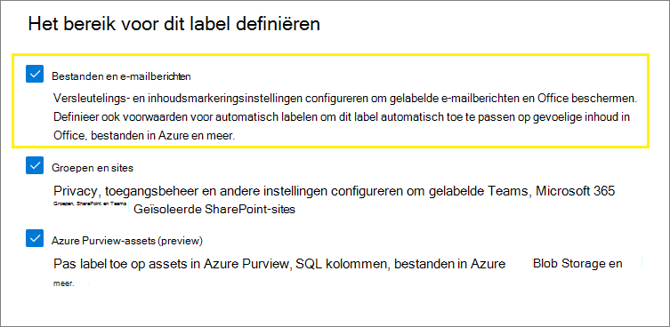

<span data-ttu-id="ff766-206">Terwijl u de wizard doorloopt, ziet u de pagina **Automatisch labelen voor bestanden en e-mailberichten**. Hier kunt u kiezen uit een lijst met typen gevoelige informatie of trainbare classificaties:</span><span class="sxs-lookup"><span data-stu-id="ff766-206">As you move through the wizard, you see the **Auto-labeling for files and emails** page where you can choose from a list of sensitive info types or trainable classifiers:</span></span>

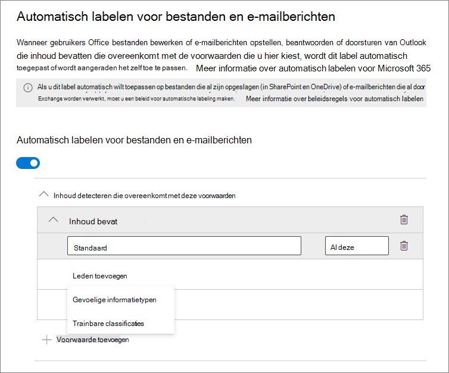

<span data-ttu-id="ff766-p116">Wanneer dit vertrouwelijkheidslabel automatisch wordt toegepast, ziet de gebruiker een melding in de Office-app. Bijvoorbeeld:</span><span class="sxs-lookup"><span data-stu-id="ff766-p116">When this sensitivity label is automatically applied, the user sees a notification in their Office app. For example:</span></span>

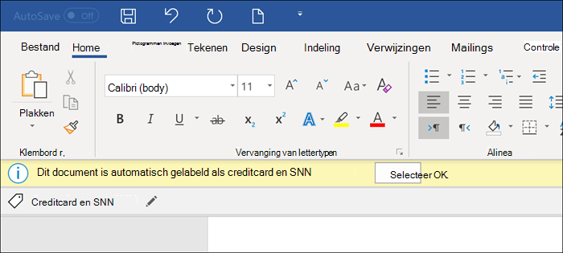

### <a name="configuring-sensitive-info-types-for-a-label"></a><span data-ttu-id="ff766-211">Het configureren van typen gevoelige informatie voor een label</span><span class="sxs-lookup"><span data-stu-id="ff766-211">Configuring sensitive info types for a label</span></span>

<span data-ttu-id="ff766-212">Wanneer u de optie **Typen gevoelige informatie** selecteert, ziet u dezelfde lijst met typen gevoelige informatie als wanneer u een beleid voor preventie van gegevensverlies (DLP) maakt.</span><span class="sxs-lookup"><span data-stu-id="ff766-212">When you select the **Sensitive info types** option, you see the same list of sensitive information types as when you create a data loss prevention (DLP) policy.</span></span> <span data-ttu-id="ff766-213">Zo kunt u bijvoorbeeld automatisch het label Zeer vertrouwelijk toepassen op inhoud die persoonlijke gegevens van klanten bevat, zoals creditcard-, bsn- of paspoortnummers:</span><span class="sxs-lookup"><span data-stu-id="ff766-213">So you can, for example, automatically apply a Highly Confidential label to any content that contains customers' personal information, such as credit card numbers, social security numbers, or passport numbers:</span></span>

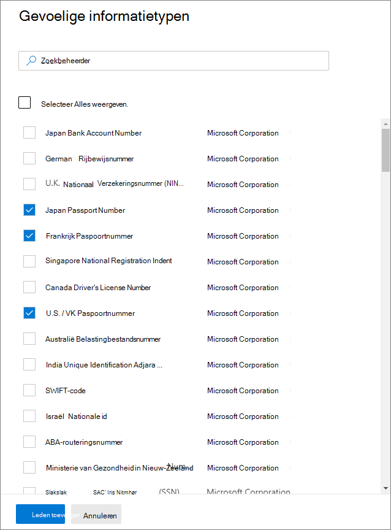

<span data-ttu-id="ff766-p118">Net zoals wanneer u DLP-beleid configureert, kunt u vervolgens de voorwaarde verfijnen door het aantal exemplaren en de nauwkeurigheid van de overeenstemming te wijzigen. Bijvoorbeeld:</span><span class="sxs-lookup"><span data-stu-id="ff766-p118">Similarly to when you configure DLP policies, you can then refine your condition by changing the instance count and match accuracy. For example:</span></span>


<span data-ttu-id="ff766-218">U vindt meer informatie over deze configuratieopties in de DLP-documentatie: [Regels afstemmen om ze eenvoudiger of moeilijker overeen te laten komen](data-loss-prevention-policies.md#tuning-rules-to-make-them-easier-or-harder-to-match).</span><span class="sxs-lookup"><span data-stu-id="ff766-218">You can learn more about these configuration options from the DLP documentation: [Tuning rules to make them easier or harder to match](data-loss-prevention-policies.md#tuning-rules-to-make-them-easier-or-harder-to-match).</span></span>

<span data-ttu-id="ff766-219">Net als bij de configuratie van DLP-beleid kunt u ook kiezen of alle typen gevoelige informatie moeten worden gedetecteerd door een voorwaarde of slechts één van deze typen.</span><span class="sxs-lookup"><span data-stu-id="ff766-219">Also similarly to DLP policy configuration, you can choose whether a condition must detect all sensitive information types, or just one of them.</span></span> <span data-ttu-id="ff766-220">En als u uw voorwaarden flexibeler of complexer wilt maken, kunt u [groepen toevoegen en logische operatoren tussen de groepen gebruiken](data-loss-prevention-policies.md#grouping-and-logical-operators).</span><span class="sxs-lookup"><span data-stu-id="ff766-220">And to make your conditions more flexible or complex, you can add [groups and use logical operators between the groups](data-loss-prevention-policies.md#grouping-and-logical-operators).</span></span>

### <a name="configuring-trainable-classifiers-for-a-label"></a><span data-ttu-id="ff766-221">Trainbare classificaties voor een label configureren</span><span class="sxs-lookup"><span data-stu-id="ff766-221">Configuring trainable classifiers for a label</span></span>

<span data-ttu-id="ff766-222">Deze optie is momenteel in preview.</span><span class="sxs-lookup"><span data-stu-id="ff766-222">This option is currently in preview.</span></span> <span data-ttu-id="ff766-223">Als u deze optie gebruikt, moet u in uw tenant ten minste één ander vertrouwelijkheidslabel hebben gepubliceerd dat is geconfigureerd voor automatisch labelen en de optie [Typen gevoelige informatie](#configuring-sensitive-info-types-for-a-label).</span><span class="sxs-lookup"><span data-stu-id="ff766-223">If you use this option, make sure you have published in your tenant at least one other sensitivity label that's configured for auto-labeling and the [sensitive info types option](#configuring-sensitive-info-types-for-a-label).</span></span>

<span data-ttu-id="ff766-224">Wanneer u de optie **Trainbare classificaties** selecteert, selecteert u een of meer ingebouwde, trainbare classificaties van Microsoft.</span><span class="sxs-lookup"><span data-stu-id="ff766-224">When you select the **Trainable classifiers** option, select one or more of the built-in trainable classifiers from Microsoft.</span></span> <span data-ttu-id="ff766-225">Als u uw eigen aangepaste, trainbare classificaties hebt gemaakt, kunt u deze ook selecteren:</span><span class="sxs-lookup"><span data-stu-id="ff766-225">If you've created your own custom trainable classifiers, these are also available to select:</span></span>

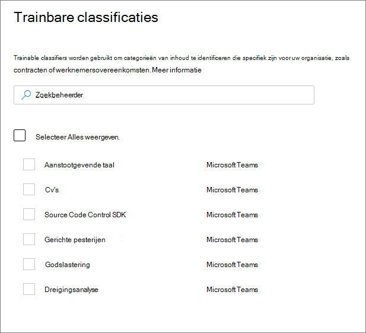

> [!CAUTION]
> <span data-ttu-id="ff766-227">De ingebouwde classificatie **Grof taalgebruik** wordt afgeschaft omdat er veel fout-positieven worden geproduceerd.</span><span class="sxs-lookup"><span data-stu-id="ff766-227">We are deprecating the **Offensive Language** built-in classifier because it has been producing a high number of false positives.</span></span> <span data-ttu-id="ff766-228">Gebruik deze ingebouwde classificatie niet en mocht u deze momenteel gebruiken, moet u deze niet voor uw bedrijfsprocessen gebruiken.</span><span class="sxs-lookup"><span data-stu-id="ff766-228">Don't use this built-in classifier and if you are currently using it, you should move your business processes off it.</span></span> <span data-ttu-id="ff766-229">U wordt aangeraden in plaats daarvan de ingebouwde classificaties **Gerichte intimidatie**, **Scheldwoorden** en **Bedreiging** te gebruiken.</span><span class="sxs-lookup"><span data-stu-id="ff766-229">We recommend using the **Targeted Harassment**, **Profanity**, and **Threat** built-in classifiers instead.</span></span>

<span data-ttu-id="ff766-230">Zie [Informatie over trainbare classificaties](classifier-learn-about.md) voor meer informatie over deze classificaties.</span><span class="sxs-lookup"><span data-stu-id="ff766-230">For more information about these classifiers, see [Learn about trainable classifiers](classifier-learn-about.md).</span></span>

<span data-ttu-id="ff766-231">Tijdens de previewperiode van deze optie worden trainbare classificatiess voor vertrouwelijkheidslabels ondersteund door de volgende apps:</span><span class="sxs-lookup"><span data-stu-id="ff766-231">During the preview period for this option, the following apps support trainable classifiers for sensitivity labels:</span></span>

- <span data-ttu-id="ff766-232">Microsoft 365-apps voor ondernemingen ([voorheen Office 365 ProPlus](/deployoffice/name-change)) voor Windows, nu geïmplementeerd voor het [Huidig kanaal](/deployoffice/overview-update-channels#current-channel-overview) in versie 2006 en hoger:</span><span class="sxs-lookup"><span data-stu-id="ff766-232">Microsoft 365 Apps for enterprise ([formerly Office 365 ProPlus](/deployoffice/name-change)) for Windows, now rolling out to the [Current Channel](/deployoffice/overview-update-channels#current-channel-overview) in version 2006 and later:</span></span>
    - <span data-ttu-id="ff766-233">Word</span><span class="sxs-lookup"><span data-stu-id="ff766-233">Word</span></span>
    - <span data-ttu-id="ff766-234">Excel</span><span class="sxs-lookup"><span data-stu-id="ff766-234">Excel</span></span>
    - <span data-ttu-id="ff766-235">PowerPoint</span><span class="sxs-lookup"><span data-stu-id="ff766-235">PowerPoint</span></span>

- <span data-ttu-id="ff766-236">Webversie van Office-apps, als u de [vertrouwelijkheidslabels voor Office-bestanden in SharePoint en OneDrive hebt ingeschakeld](sensitivity-labels-sharepoint-onedrive-files.md):</span><span class="sxs-lookup"><span data-stu-id="ff766-236">Office for the web apps, when you have [enabled sensitivity labels for Office files in SharePoint and OneDrive](sensitivity-labels-sharepoint-onedrive-files.md):</span></span>
    - <span data-ttu-id="ff766-237">Word</span><span class="sxs-lookup"><span data-stu-id="ff766-237">Word</span></span>
    - <span data-ttu-id="ff766-238">Excel</span><span class="sxs-lookup"><span data-stu-id="ff766-238">Excel</span></span>
    - <span data-ttu-id="ff766-239">PowerPoint</span><span class="sxs-lookup"><span data-stu-id="ff766-239">PowerPoint</span></span>
    - <span data-ttu-id="ff766-240">Outlook</span><span class="sxs-lookup"><span data-stu-id="ff766-240">Outlook</span></span>

### <a name="recommend-that-the-user-applies-a-sensitivity-label"></a><span data-ttu-id="ff766-241">Aanbevelen dat de gebruiker een vertrouwelijkheidslabel toepast</span><span class="sxs-lookup"><span data-stu-id="ff766-241">Recommend that the user applies a sensitivity label</span></span>

<span data-ttu-id="ff766-242">Als u wilt, kunt u uw gebruikers aanraden het label toe te passen.</span><span class="sxs-lookup"><span data-stu-id="ff766-242">If you prefer, you can recommend to your users that they apply the label.</span></span> <span data-ttu-id="ff766-243">Met deze optie kunnen uw gebruikers de classificatie en eventuele bijbehorende beveiliging accepteren of de aanbeveling negeren als het label niet geschikt is voor hun inhoud.</span><span class="sxs-lookup"><span data-stu-id="ff766-243">With this option, your users can accept the classification and any associated protection, or dismiss the recommendation if the label isn't suitable for their content.</span></span>

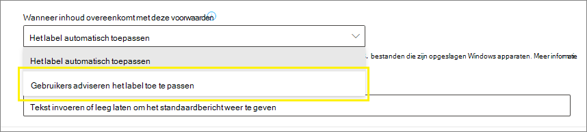

<span data-ttu-id="ff766-p124">Hier ziet u een voorbeeld van een prompt van de geïntegreerde Azure Information Protection-labelclient wanneer u een voorwaarde configureert om een label toe te passen als een aanbevolen actie, met een aangepaste beleidstip. U kunt kiezen wat voor tekst wordt weergegeven in de beleidstip.</span><span class="sxs-lookup"><span data-stu-id="ff766-p124">Here's an example of a prompt from the Azure Information Protection unified labeling client when you configure a condition to apply a label as a recommended action, with a custom policy tip. You can choose what text is displayed in the policy tip.</span></span>


### <a name="when-automatic-or-recommended-labels-are-applied"></a><span data-ttu-id="ff766-248">Wanneer automatische of aanbevolen labels worden toegepast</span><span class="sxs-lookup"><span data-stu-id="ff766-248">When automatic or recommended labels are applied</span></span>

<span data-ttu-id="ff766-p125">De implementatie van automatisch en aanbevolen labelen in Office-apps is afhankelijk van of u gebruikmaakt van labeling die in Office is ingebouwd of van de geïntegreerde Azure Information Protection-labelclient. Echter, in beide gevallen:</span><span class="sxs-lookup"><span data-stu-id="ff766-p125">The implementation of automatic and recommended labeling in Office apps depend on whether you're using labeling that's built into Office, or the Azure Information Protection unified labeling client. In both cases, however:</span></span>

- <span data-ttu-id="ff766-251">U kunt automatisch labelen niet gebruiken voor documenten en e-mailberichten die eerder handmatig zijn gelabeld of die eerder automatisch met een hogere vertrouwelijkheid zijn gelabeld.</span><span class="sxs-lookup"><span data-stu-id="ff766-251">You can't use automatic labeling for documents and emails that were previously manually labeled, or previously automatically labeled with a higher sensitivity.</span></span> <span data-ttu-id="ff766-252">Vergeet niet dat u slechts één vertrouwelijkheidslabel kunt toepassen op een document of e-mailbericht (naast één retentielabel).</span><span class="sxs-lookup"><span data-stu-id="ff766-252">Remember, you can only apply a single sensitivity label to a document or email (in addition to a single retention label).</span></span>

- <span data-ttu-id="ff766-253">U kunt aanbevolen labelen niet gebruiken voor documenten of e-mailberichten die eerder met een hogere vertrouwelijkheid zijn gelabeld.</span><span class="sxs-lookup"><span data-stu-id="ff766-253">You can't use recommended labeling for documents or emails that were previously labeled with a higher sensitivity.</span></span> <span data-ttu-id="ff766-254">Wanneer de inhoud al met een hogere vertrouwelijkheid is gelabeld, ziet de gebruiker de aanwijzing met de aanbeveling en beleidstip niet.</span><span class="sxs-lookup"><span data-stu-id="ff766-254">When the content's already labeled with a higher sensitivity, the user won't see the prompt with the recommendation and policy tip.</span></span>

<span data-ttu-id="ff766-255">Specifiek voor ingebouwd labelen:</span><span class="sxs-lookup"><span data-stu-id="ff766-255">Specific to built-in labeling:</span></span>

- <span data-ttu-id="ff766-256">Niet alle Office-apps ondersteunen automatisch (en aanbevolen) labelen.</span><span class="sxs-lookup"><span data-stu-id="ff766-256">Not all Office apps support automatic (and recommended) labeling.</span></span> <span data-ttu-id="ff766-257">Zie [Ondersteuning voor functies van vertrouwelijkheidslabels in apps](sensitivity-labels-office-apps.md#support-for-sensitivity-label-capabilities-in-apps) voor meer informatie.</span><span class="sxs-lookup"><span data-stu-id="ff766-257">For more information, see [Support for sensitivity label capabilities in apps](sensitivity-labels-office-apps.md#support-for-sensitivity-label-capabilities-in-apps).</span></span>

- <span data-ttu-id="ff766-258">Voor aanbevolen labels in de desktopversies van Word wordt de vertrouwelijke inhoud die de aanbeveling heeft geactiveerd, gemarkeerd, zodat gebruikers de gevoelige inhoud kunnen beoordelen en verwijderen in plaats van het aanbevolen vertrouwelijkheidslabel toe te passen.</span><span class="sxs-lookup"><span data-stu-id="ff766-258">For recommended labels in the desktop versions of Word, the sensitive content that triggered the recommendation is flagged so that users can review and remove the sensitive content instead of applying the recommended sensitivity label.</span></span>

- <span data-ttu-id="ff766-259">Zie [Automatisch vertrouwelijkheidslabels toepassen op of aanbevelen voor uw bestanden en e-mailberichten in Office](https://support.office.com/nl-NL/article/automatically-apply-or-recommend-sensitivity-labels-to-your-files-and-emails-in-office-622e0d9c-f38c-470a-bcdb-9e90b24d71a1) voor meer informatie over hoe deze labels worden toegepast in Office-apps, voorbeelden van schermafbeeldingen en hoe vertrouwelijke informatie wordt gedetecteerd.</span><span class="sxs-lookup"><span data-stu-id="ff766-259">For details about how these labels are applied in Office apps, example screenshots, and how sensitive information is detected, see [Automatically apply or recommend sensitivity labels to your files and emails in Office](https://support.office.com/nl-NL/article/automatically-apply-or-recommend-sensitivity-labels-to-your-files-and-emails-in-office-622e0d9c-f38c-470a-bcdb-9e90b24d71a1).</span></span>

<span data-ttu-id="ff766-260">Specifiek voor de geïntegreerde Azure Information Protection-labelclient:</span><span class="sxs-lookup"><span data-stu-id="ff766-260">Specific to the Azure Information Protection unified labeling client:</span></span>

-  <span data-ttu-id="ff766-261">Automatisch en aanbevolen labelen zijn van toepassing op Word, Excel en PowerPoint wanneer u een document opslaat, en op Outlook wanneer u een e-mailbericht verzendt.</span><span class="sxs-lookup"><span data-stu-id="ff766-261">Automatic and recommended labeling applies to Word, Excel, and PowerPoint when you save a document, and to Outlook when you send an email.</span></span>

- <span data-ttu-id="ff766-262">Outlook ondersteunt aanbevolen labelen als u eerst een [geavanceerde beleidsinstelling](/azure/information-protection/rms-client/clientv2-admin-guide-customizations#enable-recommended-classification-in-outlook) configureert.</span><span class="sxs-lookup"><span data-stu-id="ff766-262">For Outlook to support recommended labeling, you must first configure an [advanced policy setting](/azure/information-protection/rms-client/clientv2-admin-guide-customizations#enable-recommended-classification-in-outlook).</span></span>

- <span data-ttu-id="ff766-263">Er kan vertrouwelijke informatie worden gedetecteerd in de hoofdtekst van documenten en e-mailberichten, en in kop- en voetteksten, maar niet in de onderwerpregel of de bijlagen van e-mailberichten.</span><span class="sxs-lookup"><span data-stu-id="ff766-263">Sensitive information can be detected in the body text in documents and emails, and to headers and footers—but not in the subject line or attachments of email.</span></span>

## <a name="how-to-configure-auto-labeling-policies-for-sharepoint-onedrive-and-exchange"></a><span data-ttu-id="ff766-264">Beleid configureren voor automatisch labelen voor SharePoint, OneDrive en Exchange.</span><span class="sxs-lookup"><span data-stu-id="ff766-264">How to configure auto-labeling policies for SharePoint, OneDrive, and Exchange</span></span>

<span data-ttu-id="ff766-265">Zorg ervoor dat u op de hoogte bent van de vereisten voordat u beleid voor automatisch labelen configureert.</span><span class="sxs-lookup"><span data-stu-id="ff766-265">Make sure you're aware of the prerequisites before you configure auto-labeling policies.</span></span> 

### <a name="prerequisites-for-auto-labeling-policies"></a><span data-ttu-id="ff766-266">Vereisten voor beleid voor automatisch labelen</span><span class="sxs-lookup"><span data-stu-id="ff766-266">Prerequisites for auto-labeling policies</span></span>

- <span data-ttu-id="ff766-267">Simulatiemodus:</span><span class="sxs-lookup"><span data-stu-id="ff766-267">Simulation mode:</span></span>
    - <span data-ttu-id="ff766-268">Controle voor Microsoft 365 moet zijn ingeschakeld.</span><span class="sxs-lookup"><span data-stu-id="ff766-268">Auditing for Microsoft 365 must be turned on.</span></span> <span data-ttu-id="ff766-269">Zie [Zoeken in auditlogboek in- of uitschakelen](turn-audit-log-search-on-or-off.md) als u controle wilt in- of uitschakelen of niet zeker weet of de controle al is ingeschakeld.</span><span class="sxs-lookup"><span data-stu-id="ff766-269">If you need to turn on auditing or you're not sure whether auditing is already on, see [Turn audit log search on or off](turn-audit-log-search-on-or-off.md).</span></span>
    - <span data-ttu-id="ff766-270">Als u inhoud in bestanden of e-mailberichten wilt weergeven in de bronweergave, moet u de rol **Inhoudsviewer van Inhoudsverkenner** hebben.</span><span class="sxs-lookup"><span data-stu-id="ff766-270">To view file or email contents in the source view, you must have the **Content Explorer Content Viewer** role.</span></span> <span data-ttu-id="ff766-271">Globale beheerders hebben deze rol niet standaard.</span><span class="sxs-lookup"><span data-stu-id="ff766-271">Global admins don't have this role by default.</span></span> <span data-ttu-id="ff766-272">Als u deze machtiging niet hebt, wordt het voorbeeldvenster niet weergegeven wanneer u een item selecteert op het tabblad **Overeenkomende items**.</span><span class="sxs-lookup"><span data-stu-id="ff766-272">If you don't have this permission, you don't see the preview pane when you select an item from the **Matched Items** tab.</span></span>

- <span data-ttu-id="ff766-273">Bestanden automatisch labelen in SharePoint en OneDrive:</span><span class="sxs-lookup"><span data-stu-id="ff766-273">To auto-label files in SharePoint and OneDrive:</span></span>
    - <span data-ttu-id="ff766-274">U hebt [vertrouwelijkheidslabels ingeschakeld voor Office-bestanden in SharePoint en OneDrive](sensitivity-labels-sharepoint-onedrive-files.md).</span><span class="sxs-lookup"><span data-stu-id="ff766-274">You have [enabled sensitivity labels for Office files in SharePoint and OneDrive](sensitivity-labels-sharepoint-onedrive-files.md).</span></span>
    - <span data-ttu-id="ff766-275">Op het moment dat het beleid voor automatisch labelen wordt uitgevoerd, mag het bestand niet zijn geopend door een ander proces of een andere gebruiker.</span><span class="sxs-lookup"><span data-stu-id="ff766-275">At the time the auto-labeling policy runs, the file mustn't be open by another process or user.</span></span> <span data-ttu-id="ff766-276">Een bestand dat is uitgecheckt voor bewerking, valt in deze categorie.</span><span class="sxs-lookup"><span data-stu-id="ff766-276">A file that's checked out for editing falls into this category.</span></span>

- <span data-ttu-id="ff766-277">Als u van plan bent om [aangepaste typen gevoelige informatie](sensitive-information-type-learn-about.md) te gebruiken in plaats van de ingebouwde vertrouwelijkheidstypen:</span><span class="sxs-lookup"><span data-stu-id="ff766-277">If you plan to use [custom sensitive information types](sensitive-information-type-learn-about.md) rather than the built-in sensitivity types:</span></span> 
    - <span data-ttu-id="ff766-278">Aangepaste typen gevoelige informatie worden geëvalueerd op inhoud die wordt toegevoegd aan SharePoint of OneDrive nadat de aangepaste typen gevoelige informatie zijn opgeslagen.</span><span class="sxs-lookup"><span data-stu-id="ff766-278">Custom sensitivity information types are evaluated for content that is added to SharePoint or OneDrive after the custom sensitivity information types are saved.</span></span> 
    - <span data-ttu-id="ff766-279">Als u nieuwe aangepaste typen gevoelige informatie wilt testen, maakt u deze voordat u het beleid voor automatisch labelen maakt. Vervolgens maakt u nieuwe documenten met voorbeeldgegevens om te testen.</span><span class="sxs-lookup"><span data-stu-id="ff766-279">To test new custom sensitive information types, create them before you create your auto-labeling policy, and then create new documents with sample data for testing.</span></span>

- <span data-ttu-id="ff766-280">Er zijn een of meer vertrouwelijkheidslabels[gemaakt en gepubliceerd](create-sensitivity-labels.md) (voor ten minste één gebruiker) die u kunt selecteren voor uw beleid voor automatisch labelen.</span><span class="sxs-lookup"><span data-stu-id="ff766-280">One or more sensitivity labels [created and published](create-sensitivity-labels.md) (to at least one user) that you can select for your auto-labeling policies.</span></span> <span data-ttu-id="ff766-281">Voor deze labels geldt:</span><span class="sxs-lookup"><span data-stu-id="ff766-281">For these labels:</span></span>
    - <span data-ttu-id="ff766-282">Het maakt niet uit of de labelinstelling voor automatisch labelen in Office-apps is in- of uitgeschakeld, omdat deze labelinstelling een aanvulling vormt op het beleid voor automatisch labelen, zoals in de inleiding wordt uitgelegd.</span><span class="sxs-lookup"><span data-stu-id="ff766-282">It doesn't matter if the auto-labeling in Office apps label setting is turned on or off, because that label setting supplements auto-labeling policies, as explained in the introduction.</span></span>
    - <span data-ttu-id="ff766-283">Als de labels die u voor automatisch labelen wilt gebruiken, zijn geconfigureerd voor het gebruik van visuele markeringen (kopteksten, voetteksten en watermerken), worden deze niet op documenten toegepast.</span><span class="sxs-lookup"><span data-stu-id="ff766-283">If the labels you want to use for auto-labeling are configured to use visual markings (headers, footers, watermarks), note that these are not applied to documents.</span></span>
    - <span data-ttu-id="ff766-284">Als op de labels [versleuteling](encryption-sensitivity-labels.md) wordt toegepast:</span><span class="sxs-lookup"><span data-stu-id="ff766-284">If the labels apply [encryption](encryption-sensitivity-labels.md):</span></span>
        - <span data-ttu-id="ff766-285">Wanneer het beleid voor automatisch labelen locaties bevat voor SharePoint of OneDrive, moet het label zijn geconfigureerd voor de instelling **Nu machtigingen toewijzen**.</span><span class="sxs-lookup"><span data-stu-id="ff766-285">When the auto-labeling policy includes locations for SharePoint or OneDrive, the label must be configured for the **Assign permissions now** setting.</span></span>
        - <span data-ttu-id="ff766-286">Wanneer het beleid voor automatisch labelen alleen voor Exchange geldt, kan het label worden geconfigureerd voor **Nu machtigingen toewijzen** of **Gebruikers machtigingen laten toewijzen** (voor de opties Niet doorsturen of Alleen versleutelen).</span><span class="sxs-lookup"><span data-stu-id="ff766-286">When the auto-labeling policy is just for Exchange, the label can be configured for either **Assign permissions now** or **Let users assign permissions** (for the Do Not Forward or Encrypt-Only options).</span></span>

### <a name="learn-about-simulation-mode"></a><span data-ttu-id="ff766-287">Meer informatie over de simulatiemodus</span><span class="sxs-lookup"><span data-stu-id="ff766-287">Learn about simulation mode</span></span>

<span data-ttu-id="ff766-288">De simulatiemodus is uniek voor het beleid voor automatisch labelen en is in de werkstroom geïntegreerd.</span><span class="sxs-lookup"><span data-stu-id="ff766-288">Simulation mode is unique to auto-labeling policies and woven into the workflow.</span></span> <span data-ttu-id="ff766-289">U kunt documenten en e-mailberichten pas automatisch labelen als uw beleid ten minste één simulatie heeft uitgevoerd.</span><span class="sxs-lookup"><span data-stu-id="ff766-289">You can't automatically label documents and emails until your policy has run at least one simulation.</span></span>

<span data-ttu-id="ff766-290">Werkstroom voor beleid voor automatisch labelen:</span><span class="sxs-lookup"><span data-stu-id="ff766-290">Workflow for an auto-labeling policy:</span></span>

1. <span data-ttu-id="ff766-291">Beleid voor automatisch labelen maken en configureren.</span><span class="sxs-lookup"><span data-stu-id="ff766-291">Create and configure an auto-labeling policy.</span></span>

2. <span data-ttu-id="ff766-292">Voer het beleid uit in de simulatiemodus. Dit kan 48 uur duren.</span><span class="sxs-lookup"><span data-stu-id="ff766-292">Run the policy in simulation mode, which can take 48 hours to complete.</span></span>

3. <span data-ttu-id="ff766-293">Bekijk de resultaten en verfijn zo nodig uw beleid.</span><span class="sxs-lookup"><span data-stu-id="ff766-293">Review the results, and if necessary, refine your policy.</span></span> <span data-ttu-id="ff766-294">Voer de simulatiemodus opnieuw uit en wacht totdat deze is voltooid.</span><span class="sxs-lookup"><span data-stu-id="ff766-294">Rerun simulation mode and wait for it to complete again.</span></span>

4. <span data-ttu-id="ff766-295">Herhaal zo nodig stap 3.</span><span class="sxs-lookup"><span data-stu-id="ff766-295">Repeat step 3 as needed.</span></span>

5. <span data-ttu-id="ff766-296">Implementeer in productie.</span><span class="sxs-lookup"><span data-stu-id="ff766-296">Deploy in production.</span></span>

<span data-ttu-id="ff766-297">De gesimuleerde implementatie wordt uitgevoerd zoals de WhatIf-parameter voor PowerShell.</span><span class="sxs-lookup"><span data-stu-id="ff766-297">The simulated deployment runs like the WhatIf parameter for PowerShell.</span></span> <span data-ttu-id="ff766-298">Resultaten worden gerapporteerd alsof het geselecteerde label is toegepast door het beleid voor automatisch labelen met behulp van de door u gedefinieerde regels.</span><span class="sxs-lookup"><span data-stu-id="ff766-298">You see results reported as if the auto-labeling policy had applied your selected label, using the rules that you defined.</span></span> <span data-ttu-id="ff766-299">Vervolgens kunt u de regels zo nodig verfijnen qua nauwkeurigheid en de simulatie opnieuw uitvoeren.</span><span class="sxs-lookup"><span data-stu-id="ff766-299">You can then refine your rules for accuracy if needed, and rerun the simulation.</span></span> <span data-ttu-id="ff766-300">Echter, omdat automatisch labelen voor Exchange van toepassing is op e-mailberichten die worden verzonden en ontvangen, en niet op e-mailberichten die in postvakken zijn opgeslagen, kunt u niet verwachten dat resultaten voor e-mail in een simulatie consistent zijn, tenzij u exact dezelfde e-mailberichten kunt verzenden en ontvangen.</span><span class="sxs-lookup"><span data-stu-id="ff766-300">However, because auto-labeling for Exchange applies to emails that are sent and received, rather than emails stored in mailboxes, don't expect results for email in a simulation to be consistent unless you're able to send and receive the exact same email messages.</span></span>

<span data-ttu-id="ff766-301">Met de simulatiemodus kunt u ook het bereik van uw beleid voor automatisch labelen geleidelijk verhogen voordat implementatie plaatsvindt.</span><span class="sxs-lookup"><span data-stu-id="ff766-301">Simulation mode also lets you gradually increase the scope of your auto-labeling policy before deployment.</span></span> <span data-ttu-id="ff766-302">U kunt bijvoorbeeld beginnen met één locatie, zoals een SharePoint-site, met één documentbibliotheek.</span><span class="sxs-lookup"><span data-stu-id="ff766-302">For example, you might start with a single location, such as a SharePoint site, with a single document library.</span></span> <span data-ttu-id="ff766-303">Met iteratieve wijzigingen kunt u vervolgens het bereik uitbreiden tot meerdere sites en vervolgens naar een andere locatie, zoals OneDrive.</span><span class="sxs-lookup"><span data-stu-id="ff766-303">Then, with iterative changes, increase the scope to multiple sites, and then to another location, such as OneDrive.</span></span>

<span data-ttu-id="ff766-304">Ten slotte kunt u de simulatiemodus gebruiken om bij benadering de tijdsduur voor het uitvoeren van uw beleid voor automatisch labelen op te geven, zodat u kunt plannen wanneer het zonder simulatiemodus moet worden uitgevoerd.</span><span class="sxs-lookup"><span data-stu-id="ff766-304">Finally, you can use simulation mode to provide an approximation of the time needed to run your auto-labeling policy, to help you plan and schedule when to run it without simulation mode.</span></span>

### <a name="creating-an-auto-labeling-policy"></a><span data-ttu-id="ff766-305">Beleid voor automatisch labelen maken</span><span class="sxs-lookup"><span data-stu-id="ff766-305">Creating an auto-labeling policy</span></span>

1. <span data-ttu-id="ff766-306">Ga in het [Microsoft 365-compliancecentrum](https://compliance.microsoft.com/) naar vertrouwelijkheidslabels:</span><span class="sxs-lookup"><span data-stu-id="ff766-306">In the [Microsoft 365 compliance center](https://compliance.microsoft.com/), navigate to sensitivity labels:</span></span>
    
    - <span data-ttu-id="ff766-307">**Oplossingen** > **Informatiebescherming**</span><span class="sxs-lookup"><span data-stu-id="ff766-307">**Solutions** > **Information protection**</span></span>
    
    <span data-ttu-id="ff766-308">Als u deze optie niet meteen ziet, selecteert u eerst **Alles weergeven**.</span><span class="sxs-lookup"><span data-stu-id="ff766-308">If you don't immediately see this option, first select **Show all**.</span></span>

2. <span data-ttu-id="ff766-309">Selecteer het tabblad **Automatisch labelen**:</span><span class="sxs-lookup"><span data-stu-id="ff766-309">Select the **Auto-labeling** tab:</span></span>
    
    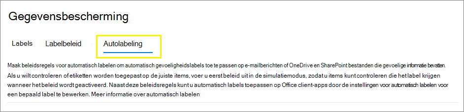
    
    > [!NOTE]
    > <span data-ttu-id="ff766-311">Als u het tabblad **Automatisch labelen** niet ziet, is deze functionaliteit momenteel niet beschikbaar in uw regio.</span><span class="sxs-lookup"><span data-stu-id="ff766-311">If you don't see the **Auto-labeling** tab, this functionality isn't currently available in your region.</span></span>

3. <span data-ttu-id="ff766-312">Selecteer **+ Beleid voor automatisch labelen maken**.</span><span class="sxs-lookup"><span data-stu-id="ff766-312">Select **+ Create auto-labeling policy**.</span></span> <span data-ttu-id="ff766-313">Hiermee wordt de wizard Nieuw beleid gestart:</span><span class="sxs-lookup"><span data-stu-id="ff766-313">This starts the New policy wizard:</span></span>
    
    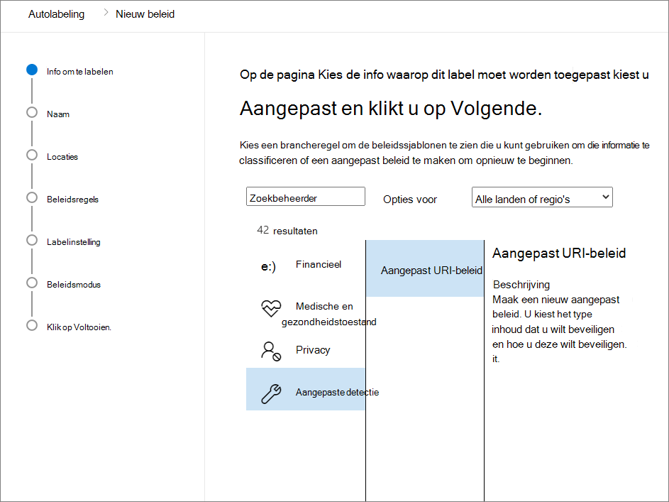

4. <span data-ttu-id="ff766-315">Voor de pagina **Informatie kiezen waarop u dit label wilt toepassen**: selecteer een van de sjablonen, bijvoorbeeld **Financieel** of **Privacy**.</span><span class="sxs-lookup"><span data-stu-id="ff766-315">For the page **Choose info you want this label applied to**: Select one of the templates, such as **Financial** or **Privacy**.</span></span> <span data-ttu-id="ff766-316">U kunt uw zoekopdracht verfijnen met behulp van het vervolgkeuzemenu **Opties weergeven voor**.</span><span class="sxs-lookup"><span data-stu-id="ff766-316">You can refine your search by using the **Show options for** dropdown.</span></span> <span data-ttu-id="ff766-317">Of selecteer **Aangepast beleid** als de sjablonen niet aan uw vereisten voldoen.</span><span class="sxs-lookup"><span data-stu-id="ff766-317">Or, select **Custom policy** if the templates don't meet your requirements.</span></span> <span data-ttu-id="ff766-318">Selecteer **Volgende**.</span><span class="sxs-lookup"><span data-stu-id="ff766-318">Select **Next**.</span></span>

5. <span data-ttu-id="ff766-319">Voor de pagina **Uw beleid voor automatisch labelen een naam geven**: geef een unieke naam op en eventueel een beschrijving om het automatisch toegepaste label te herkennen. Geef ook locaties en voorwaarden op waarmee de te labelen inhoud kan worden herkend.</span><span class="sxs-lookup"><span data-stu-id="ff766-319">For the page **Name your auto-labeling policy**: Provide a unique name, and optionally a description to help identify the automatically applied label, locations, and conditions that identify the content to label.</span></span>

6. <span data-ttu-id="ff766-320">Voor de pagina **Locaties kiezen waarop u het label wilt toepassen**: selecteer locaties voor Exchange, SharePoint-sites en OneDrive en geef deze op.</span><span class="sxs-lookup"><span data-stu-id="ff766-320">For the page **Choose locations where you want to apply the label**: Select and specify locations for Exchange, SharePoint sites, and OneDrive.</span></span> <span data-ttu-id="ff766-321">Selecteer **Volgende**.</span><span class="sxs-lookup"><span data-stu-id="ff766-321">Then select **Next**.</span></span>
    
    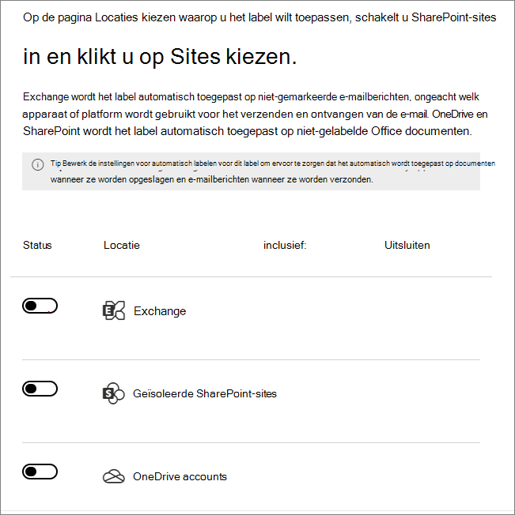
    
    <span data-ttu-id="ff766-323">U moet afzonderlijke SharePoint-sites en OneDrive-accounts opgeven.</span><span class="sxs-lookup"><span data-stu-id="ff766-323">You must specify individual SharePoint sites and OneDrive accounts.</span></span> <span data-ttu-id="ff766-324">Voor OneDrive heeft de URL van het OneDrive-account van een gebruiker de volgende indeling: `https://<tenant name>-my.sharepoint.com/personal/<user_name>_<tenant name>_com`</span><span class="sxs-lookup"><span data-stu-id="ff766-324">For OneDrive, the URL for a user's OneDrive account is in the following format: `https://<tenant name>-my.sharepoint.com/personal/<user_name>_<tenant name>_com`</span></span>
    
    <span data-ttu-id="ff766-325">Bijvoorbeeld voor een gebruiker in de contoso-tenant met de gebruikersnaam rismone: `https://contoso-my.sharepoint.com/personal/rsimone_contoso_onmicrosoft_com`</span><span class="sxs-lookup"><span data-stu-id="ff766-325">For example, for a user in the contoso tenant that has a user name of "rsimone": `https://contoso-my.sharepoint.com/personal/rsimone_contoso_onmicrosoft_com`</span></span>
    
    <span data-ttu-id="ff766-326">Zie [Een lijst met alle OneDrive-URL's van gebruikers in uw organisatie ophalen](/onedrive/list-onedrive-urls) om de syntaxis voor uw tenant te verifiëren en URL's voor gebruikers te identificeren.</span><span class="sxs-lookup"><span data-stu-id="ff766-326">To verify the syntax for your tenant and identify URLs for users, see [Get a list of all user OneDrive URLs in your organization](/onedrive/list-onedrive-urls).</span></span>

7. <span data-ttu-id="ff766-327">Voor de pagina **Algemene of geavanceerde regels instellen** : behoud de standaardinstelling **Algemene regels** voor het definiëren van regels die inhoud herkennen die in alle geselecteerde locaties moet worden gelabeld.</span><span class="sxs-lookup"><span data-stu-id="ff766-327">For the **Set up common or advanced rules** page: Keep the default of **Common rules** to define rules that identify content to label across all your selected locations.</span></span> <span data-ttu-id="ff766-328">Als u verschillende regels per locatie nodig hebt, selecteert u **Geavanceerde regels**.</span><span class="sxs-lookup"><span data-stu-id="ff766-328">If you need different rules per location, select **Advanced rules**.</span></span> <span data-ttu-id="ff766-329">Selecteer **Volgende**.</span><span class="sxs-lookup"><span data-stu-id="ff766-329">Then select **Next**.</span></span>
    
    <span data-ttu-id="ff766-330">De regels maken gebruik van voorwaarden die typen gevoelige informatie en opties voor delen omvatten:</span><span class="sxs-lookup"><span data-stu-id="ff766-330">The rules use conditions that include sensitive information types and sharing options:</span></span>
    - <span data-ttu-id="ff766-331">Voor typen gevoelige informatie kunt u zowel ingebouwde als aangepaste typen gevoelige informatie selecteren.</span><span class="sxs-lookup"><span data-stu-id="ff766-331">For sensitive information types, you can select both built-in and custom sensitive information types.</span></span>
    - <span data-ttu-id="ff766-332">Voor de opties voor delen kunt u kiezen voor **alleen met personen binnen mijn organisatie** of **met personen buiten mijn organisatie**.</span><span class="sxs-lookup"><span data-stu-id="ff766-332">For the shared options, you can choose **only with people inside my organization** or **with people outside my organization**.</span></span>
    
    <span data-ttu-id="ff766-333">Als uw enige locatie **Exchange** of als u **Geavanceerde regels** selecteert, zijn er aanvullende voorwaarden die u kunt selecteren:</span><span class="sxs-lookup"><span data-stu-id="ff766-333">If your only location is **Exchange**, or if you select **Advanced rules**, there are additional conditions that you can select:</span></span>
    - <span data-ttu-id="ff766-334">IP-adres van afzender is</span><span class="sxs-lookup"><span data-stu-id="ff766-334">Sender IP address is</span></span>
    - <span data-ttu-id="ff766-335">Domein van ontvanger is</span><span class="sxs-lookup"><span data-stu-id="ff766-335">Recipient domain is</span></span>
    - <span data-ttu-id="ff766-336">Ontvanger is</span><span class="sxs-lookup"><span data-stu-id="ff766-336">Recipient is</span></span>
    - <span data-ttu-id="ff766-337">Bestandsextensie van bijlage is</span><span class="sxs-lookup"><span data-stu-id="ff766-337">Attachment's file extension is</span></span>
    - <span data-ttu-id="ff766-338">Bijlage is met wachtwoord beveiligd</span><span class="sxs-lookup"><span data-stu-id="ff766-338">Attachment is password protected</span></span>
    - <span data-ttu-id="ff766-339">Inhoud van een e-mailbijlage kan niet worden gescand</span><span class="sxs-lookup"><span data-stu-id="ff766-339">Any email attachment's content could not be scanned</span></span>
    - <span data-ttu-id="ff766-340">Scannen van inhoud van een e-mailbijlage is niet voltooid</span><span class="sxs-lookup"><span data-stu-id="ff766-340">Any email attachment's content didn't complete scanning</span></span>

8. <span data-ttu-id="ff766-341">Afhankelijk van uw vorige keuzes hebt u nu de mogelijkheid nieuwe regels te maken aan de hand van voorwaarden en uitzonderingen.</span><span class="sxs-lookup"><span data-stu-id="ff766-341">Depending on your previous choices, you'll now have an opportunity to create new rules by using conditions and exceptions.</span></span>
    
    <span data-ttu-id="ff766-342">De configuratieopties voor typen gevoelige informatie zijn dezelfde als de opties die u selecteert voor automatisch labelen voor Office-apps.</span><span class="sxs-lookup"><span data-stu-id="ff766-342">The configuration options for sensitive information types are the same as those you select for auto-labeling for Office apps.</span></span> <span data-ttu-id="ff766-343">Zie [Typen gevoelige informatie voor een label configureren](#configuring-sensitive-info-types-for-a-label) voor meer informatie.</span><span class="sxs-lookup"><span data-stu-id="ff766-343">If you need more information, see [Configuring sensitive info types for a label](#configuring-sensitive-info-types-for-a-label).</span></span>
    
    <span data-ttu-id="ff766-344">Wanneer u alle regels hebt gedefinieerd die u nodig hebt en de status hebt bevestigd, selecteert u **Volgende** om een volgend label te kiezen dat u automatisch wilt toepassen.</span><span class="sxs-lookup"><span data-stu-id="ff766-344">When you have defined all the rules you need, and confirmed their status is on, select **Next** to move on to choosing a label to auto-apply.</span></span>

11. <span data-ttu-id="ff766-345">Voor de pagina **Een label kiezen om automatisch toe te passen**: selecteer **+ Label kiezen**, selecteer een label in het deelvenster **Vertrouwelijkheidslabel kiezen** en selecteer vervolgens **Volgende**.</span><span class="sxs-lookup"><span data-stu-id="ff766-345">For the **Choose a label to auto-apply** page: Select **+ Choose a label**, select a label from the **Choose a sensitivity label** pane, and then select **Next**.</span></span>

12. <span data-ttu-id="ff766-346">Voor de pagina **Bepalen of u het beleid nu of later wilt testen**: selecteer **Beleid uitvoeren in simulatiemodus** als u het beleid voor automatisch labelen nu in de simulatiemodus wilt uitvoeren.</span><span class="sxs-lookup"><span data-stu-id="ff766-346">For the **Decide if you want to test out the policy now or later** page: Select **Run policy in simulation mode** if you're ready to run the auto-labeling policy now, in simulation mode.</span></span> <span data-ttu-id="ff766-347">Of anders selecteert u **Beleid uitgeschakeld laten**.</span><span class="sxs-lookup"><span data-stu-id="ff766-347">Otherwise, select **Leave policy turned off**.</span></span> <span data-ttu-id="ff766-348">Selecteer **Volgende**:</span><span class="sxs-lookup"><span data-stu-id="ff766-348">Select **Next**:</span></span> 
    
    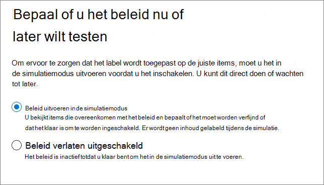

13. <span data-ttu-id="ff766-350">Voor de pagina **Overzicht**: controleer de configuratie van uw beleid voor automatisch labelen, breng eventueel wijzigingen aan en voltooi de wizard.</span><span class="sxs-lookup"><span data-stu-id="ff766-350">For the **Summary** page: Review the configuration of your auto-labeling policy and make any changes that needed, and complete the wizard.</span></span>

<span data-ttu-id="ff766-351">Op de pagina **Informatiebescherming** > **Automatisch labelen** ziet u het beleid voor automatisch labelen in de sectie **Simulatie** of **Uit**, afhankelijk van uw keuze het beleid al dan niet uit te voeren in de simulatiemodus.</span><span class="sxs-lookup"><span data-stu-id="ff766-351">Now on the **Information protection** > **Auto-labeling** page, you see your auto-labeling policy in the **Simulation** or **Off** section, depending on whether you chose to run it in simulation mode or not.</span></span> <span data-ttu-id="ff766-352">Selecteer uw beleid om de details van de configuratie en status te bekijken (bijvoorbeeld **Simulatie van beleid is nog steeds actief**).</span><span class="sxs-lookup"><span data-stu-id="ff766-352">Select your policy to see the details of the configuration and status (for example, **Policy simulation is still running**).</span></span> <span data-ttu-id="ff766-353">Voor beleidsregels in de simulatiemodus selecteert u het tabblad **Overeenkomende items** om te zien welke e-mailberichten of documenten overeenkomen met de regels die u hebt opgegeven.</span><span class="sxs-lookup"><span data-stu-id="ff766-353">For policies in simulation mode, select the **Matched items** tab to see which emails or documents matched the rules that you specified.</span></span>

<span data-ttu-id="ff766-354">U kunt uw beleid rechtstreeks wijzigen vanuit deze interface:</span><span class="sxs-lookup"><span data-stu-id="ff766-354">You can modify your policy directly from this interface:</span></span>

- <span data-ttu-id="ff766-355">Voor een beleidsregel in de sectie **Uit** selecteert u knop **Beleidsregel bewerken**.</span><span class="sxs-lookup"><span data-stu-id="ff766-355">For a policy in the **Off** section, select the **Edit policy** button.</span></span>

- <span data-ttu-id="ff766-356">Voor een beleidsregel in de sectie **Simulatie** selecteert u boven aan de pagina, op een van beide tabbladen, de optie **Beleidsregel bewerken**:</span><span class="sxs-lookup"><span data-stu-id="ff766-356">For policy in the **Simulation** section, select the **Edit policy** option at the top of the page, from either tab:</span></span>
    
    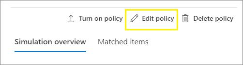
    
    <span data-ttu-id="ff766-358">Wanneer u klaar bent om het beleid zonder simulatie uit te voeren, selecteert u de optie **Beleid inschakelen**.</span><span class="sxs-lookup"><span data-stu-id="ff766-358">When you're ready to run the policy without simulation, select the **Turn on policy** option.</span></span>

<span data-ttu-id="ff766-359">Uw beleidsregels voor automatisch labelen worden continu uitgevoerd totdat ze worden verwijderd.</span><span class="sxs-lookup"><span data-stu-id="ff766-359">Your auto-policies run continuously until they are deleted.</span></span> <span data-ttu-id="ff766-360">Zo worden nieuwe en gewijzigde documenten opgenomen in de huidige beleidsinstellingen.</span><span class="sxs-lookup"><span data-stu-id="ff766-360">For example, new and modified documents will be included with the current policy settings.</span></span>

<span data-ttu-id="ff766-361">U kunt ook de resultaten van uw beleid voor automatisch labelen bekijken met behulp van [Inhoudsverkenner](data-classification-content-explorer.md) wanneer u over de juiste [machtigingen](data-classification-content-explorer.md#permissions) beschikt:</span><span class="sxs-lookup"><span data-stu-id="ff766-361">You can also see the results of your auto-labeling policy by using [content explorer](data-classification-content-explorer.md) when you have the appropriate [permissions](data-classification-content-explorer.md#permissions):</span></span>
- <span data-ttu-id="ff766-362">Met **Lijstviewer van Inhoudsverkenner** kunt u het label van een bestand zien, maar niet de inhoud van het bestand.</span><span class="sxs-lookup"><span data-stu-id="ff766-362">**Content Explorer List Viewer** lets you see a file's label but not the file's contents.</span></span>
- <span data-ttu-id="ff766-363">Met **Inhoudsviewer van Inhoudsverkenner** kunt u de inhoud van het bestand zien.</span><span class="sxs-lookup"><span data-stu-id="ff766-363">**Content Explorer Content Viewer** lets you see the file's contents.</span></span>

> [!TIP]
> <span data-ttu-id="ff766-364">U kunt Inhoudsverkenner ook gebruiken om locaties te identificeren met documenten met vertrouwelijke informatie, maar die geen label hebben.</span><span class="sxs-lookup"><span data-stu-id="ff766-364">You can also use content explorer to identify locations that have documents with sensitive information, but are unlabeled.</span></span> <span data-ttu-id="ff766-365">Met deze informatie kunt u overwegen deze locaties toe te voegen aan uw beleid voor automatisch labelen en de geïdentificeerde typen gevoelige informatie als regels op te nemen.</span><span class="sxs-lookup"><span data-stu-id="ff766-365">Using this information, consider adding these locations to your auto-labeling policy, and include the identified sensitive information types as rules.</span></span>

### <a name="use-powershell-for-auto-labeling-policies"></a><span data-ttu-id="ff766-366">PowerShell gebruiken voor beleid voor automatisch labelen</span><span class="sxs-lookup"><span data-stu-id="ff766-366">Use PowerShell for auto-labeling policies</span></span>

<span data-ttu-id="ff766-367">U kunt [Beveiligings- en compliancecentrum PowerShell](/powershell/exchange/scc-powershell) gebruiken om beleid voor automatisch labelen te maken en configureren.</span><span class="sxs-lookup"><span data-stu-id="ff766-367">You can use [Security & Compliance Center PowerShell](/powershell/exchange/scc-powershell) to create and configure auto-labeling policies.</span></span> <span data-ttu-id="ff766-368">Dit betekent dat u het maken en onderhouden van uw beleid voor automatisch labelen volledig met behulp van scripts kunt uitvoeren. Het biedt ook een efficiëntere methode voor het opgeven van meerdere URL's voor OneDrive- en SharePoint-locaties.</span><span class="sxs-lookup"><span data-stu-id="ff766-368">This means you can fully script the creation and maintenance of your auto-labeling policies, which also provides a more efficient method of specifying multiple URLs for OneDrive and SharePoint locations.</span></span>

<span data-ttu-id="ff766-369">Voordat u de opdrachten in PowerShell kunt uitvoeren, moet u eerst [verbinding maken met het Beveiligings- en compliancecentrum PowerShell](/powershell/exchange/connect-to-scc-powershell).</span><span class="sxs-lookup"><span data-stu-id="ff766-369">Before you run the commands in PowerShell, you must first [connect to Security & Compliance Center PowerShell](/powershell/exchange/connect-to-scc-powershell).</span></span>

<span data-ttu-id="ff766-370">Nieuw beleid voor automatisch labelen maken:</span><span class="sxs-lookup"><span data-stu-id="ff766-370">To create a new auto-labeling policy:</span></span> 

```powershell
New-AutoSensitivityLabelPolicy -Name <AutoLabelingPolicyName> -SharePointLocation "<SharePointSiteLocation>" -ApplySensitivityLabel <Label> -Mode TestWithoutNotifications
```
<span data-ttu-id="ff766-371">Met deze opdracht maakt u een beleid voor automatisch labelen voor een SharePoint-site die u opgeeft.</span><span class="sxs-lookup"><span data-stu-id="ff766-371">This command creates an auto-labeling policy for a SharePoint site that you specify.</span></span> <span data-ttu-id="ff766-372">Voor een OneDrive-locatie gebruikt u echter de parameter *OneDriveLocation*.</span><span class="sxs-lookup"><span data-stu-id="ff766-372">For a OneDrive location, use the *OneDriveLocation* parameter, instead.</span></span> 

<span data-ttu-id="ff766-373">Extra sites toevoegen aan bestaand beleid voor automatisch labelen:</span><span class="sxs-lookup"><span data-stu-id="ff766-373">To add additional sites to an existing auto-labeling policy:</span></span>

```powershell
$spoLocations = @("<SharePointSiteLocation1>","<SharePointSiteLocation2>")
Set-AutoSensitivityLabelPolicy -Identity <AutoLabelingPolicyName> -AddSharePointLocation $spoLocations -ApplySensitivityLabel <Label> -Mode TestWithoutNotifications
```

<span data-ttu-id="ff766-374">Met deze opdracht worden de extra SharePoint-URL's opgegeven in een variabele die vervolgens wordt toegevoegd aan een bestaand beleid voor automatisch labelen.</span><span class="sxs-lookup"><span data-stu-id="ff766-374">This command specifies the additional SharePoint URLs in a variable that is then added to an existing auto-labeling policy.</span></span> <span data-ttu-id="ff766-375">Als u in plaats daarvan OneDrive-locaties wilt toevoegen, gebruikt u de parameter *AddOneDriveLocation* met een andere variabele, bijvoorbeeld *$OneDriveLocations*.</span><span class="sxs-lookup"><span data-stu-id="ff766-375">To add OneDrive locations instead, use the *AddOneDriveLocation* parameter with a different variable, such as *$OneDriveLocations*.</span></span>

<span data-ttu-id="ff766-376">Nieuwe beleidsregel voor automatisch labelen maken:</span><span class="sxs-lookup"><span data-stu-id="ff766-376">To create a new auto-labeling policy rule:</span></span>

```powershell
New-AutoSensitivityLabelRule -Policy <AutoLabelingPolicyName> -Name <AutoLabelingRuleName> -ContentContainsSensitiveInformation @{"name"= "a44669fe-0d48-453d-a9b1-2cc83f2cba77"; "mincount" = "2"} -Workload SharePoint
```

<span data-ttu-id="ff766-377">Voor een bestaand beleid voor automatisch labelen wordt met deze opdracht een nieuwe beleidsregel gemaakt voor het detecteren van het type gevoelige informatie **Amerikaans burgerservicenummer (BSN)**, dat de entiteit-id a44669fe-0d48-453d-a9b1-2cc83f2cba77 heeft.</span><span class="sxs-lookup"><span data-stu-id="ff766-377">For an existing auto-labeling policy, this command creates a new policy rule to detect the sensitive information type of **U.S. social security number (SSN)**, which has an entity ID of a44669fe-0d48-453d-a9b1-2cc83f2cba77.</span></span> <span data-ttu-id="ff766-378">Zie [Entiteitsdefinities voor het type gevoelige informatie](sensitive-information-type-entity-definitions.md) om entiteits-id's voor overige typen gevoelige informatie te vinden.</span><span class="sxs-lookup"><span data-stu-id="ff766-378">To find the entity IDs for other sensitive information types, refer to [Sensitive information type entity definitions](sensitive-information-type-entity-definitions.md).</span></span>

<span data-ttu-id="ff766-379">Zie de volgende help voor cmdlets voor meer informatie over de PowerShell-cmdlets die ondersteuning bieden voor beleid voor automatisch labelen, de beschikbare parameters en enkele voorbeelden:</span><span class="sxs-lookup"><span data-stu-id="ff766-379">For more information about the PowerShell cmdlets that support auto-labeling policies, their available parameters and some examples, see the following cmdlet help:</span></span>

- [<span data-ttu-id="ff766-380">Get-AutoSensitivityLabelPolicy</span><span class="sxs-lookup"><span data-stu-id="ff766-380">Get-AutoSensitivityLabelPolicy</span></span>](/powershell/module/exchange/get-autosensitivitylabelpolicy)
- [<span data-ttu-id="ff766-381">New-AutoSensitivityLabelPolicy</span><span class="sxs-lookup"><span data-stu-id="ff766-381">New-AutoSensitivityLabelPolicy</span></span>](/powershell/module/exchange/new-autosensitivitylabelpolicy)
- [<span data-ttu-id="ff766-382">New-AutoSensitivityLabelRule</span><span class="sxs-lookup"><span data-stu-id="ff766-382">New-AutoSensitivityLabelRule</span></span>](/powershell/module/exchange/new-autosensitivitylabelrule)
- [<span data-ttu-id="ff766-383">Remove-AutoSensitivityLabelPolicy</span><span class="sxs-lookup"><span data-stu-id="ff766-383">Remove-AutoSensitivityLabelPolicy</span></span>](/powershell/module/exchange/remove-autosensitivitylabelpolicy)
- [<span data-ttu-id="ff766-384">Remove-AutoSensitivityLabelRule</span><span class="sxs-lookup"><span data-stu-id="ff766-384">Remove-AutoSensitivityLabelRule</span></span>](/powershell/module/exchange/remove-autosensitivitylabelrule)
- [<span data-ttu-id="ff766-385">Set-AutoSensitivityLabelPolicy</span><span class="sxs-lookup"><span data-stu-id="ff766-385">Set-AutoSensitivityLabelPolicy</span></span>](/powershell/module/exchange/set-autosensitivitylabelpolicy)
- [<span data-ttu-id="ff766-386">Set-AutoSensitivityLabelRule</span><span class="sxs-lookup"><span data-stu-id="ff766-386">Set-AutoSensitivityLabelRule</span></span>](/powershell/module/exchange/set-autosensitivitylabelrule)

## <a name="tips-to-increase-labeling-reach"></a><span data-ttu-id="ff766-387">Tips om het labelbereik te vergroten</span><span class="sxs-lookup"><span data-stu-id="ff766-387">Tips to increase labeling reach</span></span>

<span data-ttu-id="ff766-388">Hoewel automatisch labelen een van de meest efficiënte manieren is om Office-bestanden waarvan uw organisatie eigenaar is te classificeren, labelen en beveiligen, controleer of u deze kunt aanvullen met een van de aanvullende methoden om uw labelbereik te vergroten:</span><span class="sxs-lookup"><span data-stu-id="ff766-388">Although auto-labeling is one of the most efficient ways to classify, label, and protect Office files that your organization owns, check whether you can supplement it with any of the additional methods to increase your labeling reach:</span></span>

- <span data-ttu-id="ff766-389">Als u de geïntegreerde [Azure Information Protection-labelclient](/azure/information-protection/rms-client/aip-clientv2) gebruikt:</span><span class="sxs-lookup"><span data-stu-id="ff766-389">When you use the [Azure Information Protection unified labeling client](/azure/information-protection/rms-client/aip-clientv2):</span></span>
    
    - <span data-ttu-id="ff766-390">Voor bestanden in on-premises gegevensarchieven, zoals netwerkshares en SharePoint Server-bibliotheken: gebruik de [scanner](/azure/information-protection/deploy-aip-scanner) om gevoelige informatie in deze bestanden te ontdekken en deze op de juiste wijze te labelen.</span><span class="sxs-lookup"><span data-stu-id="ff766-390">For files in on-premises data stores such as network shares and SharePoint Server libraries: Use the [scanner](/azure/information-protection/deploy-aip-scanner) to discover sensitive information in these files and label them appropriately.</span></span> <span data-ttu-id="ff766-391">Als u van plan bent om deze bestanden te migreren of uploaden naar SharePoint in Microsoft 365, gebruikt u de scanner om de bestanden te labelen voordat u ze naar de cloud verplaatst.</span><span class="sxs-lookup"><span data-stu-id="ff766-391">If you are planning to migrate or upload these files to SharePoint in Microsoft 365, use the scanner to label the files before you move them to the cloud.</span></span>
    
    - <span data-ttu-id="ff766-392">Als u een andere labeloplossing hebt gebruikt voordat u vertrouwelijkheidslabels gebruikt: gebruik PowerShell en [een geavanceerde instelling om labels opnieuw te gebruiken](/azure/information-protection/rms-client/clientv2-admin-guide-customizations#migrate-labels-from-secure-islands-and-other-labeling-solutions) uit deze oplossingen.</span><span class="sxs-lookup"><span data-stu-id="ff766-392">If you have used another labeling solution before using sensitivity labels: Use PowerShell and [an advanced setting to reuse labels](/azure/information-protection/rms-client/clientv2-admin-guide-customizations#migrate-labels-from-secure-islands-and-other-labeling-solutions) from these solutions.</span></span>

- <span data-ttu-id="ff766-393">Stimuleer [handmatig labelen](https://support.microsoft.com/office/apply-sensitivity-labels-to-your-files-and-email-in-office-2f96e7cd-d5a4-403b-8bd7-4cc636bae0f9) nadat u gebruikers hebt getraind welke vertrouwelijkheidslabels moeten worden toegepast.</span><span class="sxs-lookup"><span data-stu-id="ff766-393">Encourage [manual labeling](https://support.microsoft.com/office/apply-sensitivity-labels-to-your-files-and-email-in-office-2f96e7cd-d5a4-403b-8bd7-4cc636bae0f9) after providing users with training which sensitivity labels to apply.</span></span> <span data-ttu-id="ff766-394">Wanneer u zeker weet dat gebruikers begrijpen welk label ze moeten toepassen, kunt u overwegen om een standaardlabel en verplicht labelen te configureren als [beleidsinstellingen](sensitivity-labels.md#what-label-policies-can-do).</span><span class="sxs-lookup"><span data-stu-id="ff766-394">When you're confident that users understand which label to apply, consider configuring a default label and mandatory labeling as [policy settings](sensitivity-labels.md#what-label-policies-can-do).</span></span> 

<span data-ttu-id="ff766-395">U kunt ook [nieuwe bestanden standaard markeren als gevoelig](/sharepoint/sensitive-by-default) in SharePoint om te voorkomen dat gasten toegang krijgen tot nieuw toegevoegde bestanden totdat ten minste één DLP-beleidsregel de inhoud van het bestand scant.</span><span class="sxs-lookup"><span data-stu-id="ff766-395">Additionally, consider [marking new files as sensitive by default](/sharepoint/sensitive-by-default) in SharePoint to prevent guests from accessing newly added files until at least one DLP policy scans the content of the file.</span></span>
