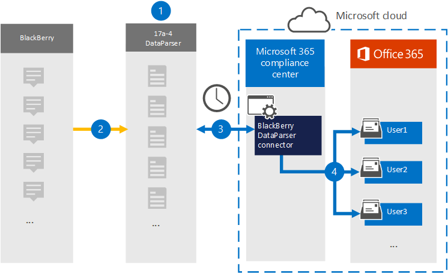

# Een verbindingslijn instellen om BlackBerry-gegevens te archiveren (voorbeeld)

Gebruik de [BlackBerry DataParser](https://www.17a-4.com/BlackBerry-dataparser/) van 17a-4 LLC om bedrijfsgegevens van BlackBerry te importeren en te archiveren in gebruikerspostvakken in uw Microsoft 365 organisatie. De DataParser bevat een BlackBerry-connector die is geconfigureerd om items uit een externe gegevensbron vast te leggen en deze items te importeren in Microsoft 365. De BlackBerry DataParser-connector converteert BlackBerry-gegevens naar een e-mailberichtindeling en importeert deze items vervolgens in gebruikerspostvakken in Microsoft 365.

Nadat BlackBerry-gegevens zijn opgeslagen in gebruikerspostvakken, kunt u Microsoft 365 compliancefuncties toepassen, zoals Litigation Hold, eDiscovery, bewaarbeleid en bewaarlabels en communicatie compliance. Als u een BlackBerry-connector gebruikt voor het importeren en archiveren van gegevens in Microsoft 365 uw organisatie kan voldoen aan overheids- en regelgevingsbeleid.

## Overzicht van het archiveren van BlackBerry-gegevens

In het volgende overzicht wordt uitgelegd hoe u een gegevensconnector gebruikt om BlackBerry-gegevens te archiveren in Microsoft 365.

1. Uw organisatie werkt met 17a-4 om de BlackBerry DataParser in te stellen en te configureren.

2. BlackBerry-items worden regelmatig verzameld door de DataParser. De Gegevensparser converteert ook de inhoud van een bericht naar een e-mailberichtindeling.

3. De BlackBerry DataParser-connector die u in het Microsoft 365-compliancecentrum maakt, maakt verbinding met DataParser en brengt de berichten over naar een veilige Azure Storage locatie in de Microsoft-cloud.

4. Er wordt een submap in de map Postvak IN met de naam **BlackBerry DataParser** gemaakt in de postvakken van gebruikers en de BlackBerry-items worden geïmporteerd in die map. De verbindingslijn bepaalt in welk postvak items moeten worden geïmporteerd met behulp van de waarde van de eigenschap *E-mail.* Elk BlackBerry-item bevat deze eigenschap, die wordt ingevuld met het e-mailadres van elke deelnemer.

## Voordat u een verbindingslijn in stelt

- Maak een DataParser-account voor Microsoft-connectors. Neem hiervoor contact op [met 17a-4 LLC.](https://www.17a-4.com/contact/) U moet zich aanmelden bij dit account wanneer u de verbindingslijn maakt in stap 1.

- De gebruiker die de BlackBerry DataParser-connector maakt in stap 1 (en deze voltooit in stap 3), moet worden toegewezen aan de rol Postvak importeren exporteren in Exchange Online. Deze rol is vereist om verbindingslijnen toe te voegen op de pagina **Gegevensconnectors** in de Microsoft 365-compliancecentrum. Deze rol is standaard niet toegewezen aan een rollengroep in Exchange Online. U kunt de rol Postvak importeren exporteren toevoegen aan de rollengroep Organisatiebeheer in Exchange Online. U kunt ook een rollengroep maken, de rol Postvak importeren exporteren toewijzen en vervolgens de juiste gebruikers toevoegen als leden. Zie de secties  Rollengroepen  maken of Rollengroepen wijzigen in het artikel 'Rollengroepen beheren in Exchange Online'.

## Stap 1: Een BlackBerry DataParser-connector instellen

De eerste stap is toegang tot de pagina Gegevensconnectoren in de Microsoft 365-compliancecentrum en een 17a-4-connector voor BlackBerry-gegevens te maken.

1. Ga naar <https://compliance.microsoft.com> en klik vervolgens op **Gegevensconnectoren**  >  **BlackBerry DataParser**.

2. Klik op **de pagina Productbeschrijving van BlackBerry DataParser** op **Verbindingslijn toevoegen.**

3. Klik op **de pagina Servicevoorwaarden** op **Accepteren.**

4. Voer een unieke naam in die de verbindingslijn identificeert en klik vervolgens op **Volgende.**

5. Meld u aan bij uw 17a-4-account en voltooi de stappen in de wizard BlackBerry DataParser-verbinding.

## Stap 2: De BlackBerry DataParser-connector configureren

Werk met 17a-4 Ondersteuning om de BlackBerry DataParser-connector te configureren.

## Stap 3: Gebruikers in kaart brengen

De BlackBerry DataParser-connector zal gebruikers automatisch aan hun e-mailadressen Microsoft 365 voordat ze gegevens importeren in Microsoft 365.

## Stap 4: De BlackBerry DataParser-connector controleren

Nadat u een BlackBerry DataParser-verbindingslijn hebt aan Microsoft 365-compliancecentrum.

1. Ga naar <https://compliance.microsoft.com> en klik op **Gegevensconnectoren** in het linkernavigatievenster.

2. Klik op het tabblad **Connectors** en selecteer vervolgens de BlackBerry DataParser-connector die u hebt gemaakt om de flyoutpagina weer te geven, die de eigenschappen en informatie over de verbindingslijn bevat.

3. Klik **onder Verbindingsstatus met bron** op de koppeling Logboek **downloaden** om het statuslogboek voor de verbindingslijn te openen (of op te slaan). Dit logboek bevat gegevens die zijn geïmporteerd in de Microsoft-cloud.

## Bekende problemen

Op dit moment bieden we geen ondersteuning voor het importeren van bijlagen of items die groter zijn dan 10 MB. Ondersteuning voor grotere items is op een later tijdstip beschikbaar.