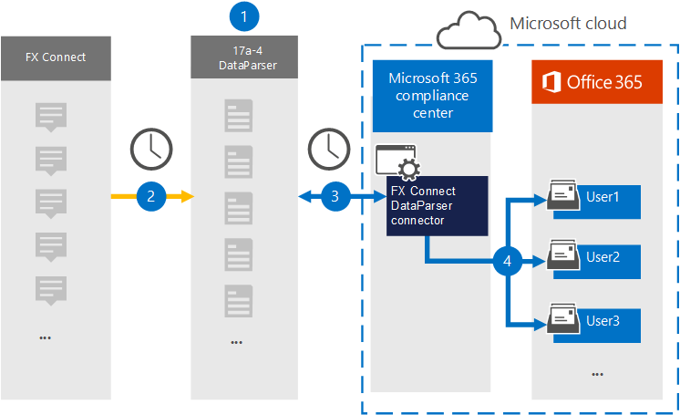

# Een connector instellen om gegevens van FX-Verbinding maken

Gebruik de [FX Verbinding maken DataParser](https://www.17a-4.com/dataparser-roadmap/) van 17a-4 LLC om gegevens uit FX-Verbinding maken te importeren en te archiveren in postvakken van gebruikers in uw Microsoft 365 organisatie. De DataParser bevat een FX-Verbinding maken-connector die is geconfigureerd om items uit een externe gegevensbron vast te leggen en deze items te importeren in Microsoft 365. De FX Verbinding maken DataParser-connector converteert FX-Verbinding maken-gegevens naar een e-mailberichtindeling en importeert deze items vervolgens in gebruikerspostvakken in Microsoft 365.

Nadat FX-Verbinding maken gegevens zijn opgeslagen in postvakken van gebruikers, kunt u Microsoft 365 compliancefuncties toepassen, zoals Litigation Hold, eDiscovery, bewaarbeleid en bewaarlabels en communicatie compliance. Als u een FX-Verbinding maken gebruikt om gegevens in Microsoft 365 te importeren en te archiveren, kan uw organisatie voldoen aan het overheids- en regelgevingsbeleid.

## Overzicht van het archiveren van FX-Verbinding maken gegevens

In het volgende overzicht wordt uitgelegd hoe het gebruik van een gegevensconnector voor het archiveren van FX-Verbinding maken gegevens in Microsoft 365.

1. Uw organisatie werkt met 17a-4 om de FX-Verbinding maken DataParser in te stellen en te configureren.

2. Op regelmatige basis worden FX-Verbinding maken door de DataParser verzameld. De Gegevensparser converteert ook de inhoud van een bericht naar een e-mailberichtindeling.

3. De FX Verbinding maken DataParser-connector die u in de Microsoft 365-compliancecentrum maakt, maakt verbinding met DataParser en brengt de berichten over naar een veilige Azure Storage locatie in de Microsoft-cloud.

4. Een submap in de map Postvak IN met de naam **FX Verbinding maken DataParser** wordt gemaakt in de postvakken van de gebruiker en de FX-Verbinding maken-items worden geïmporteerd in die map. De verbindingslijn bepaalt in welk postvak items moeten worden geïmporteerd met behulp van de waarde van de eigenschap *E-mail.* Elk FX-Verbinding maken bevat deze eigenschap, die wordt gevuld met het e-mailadres van elke deelnemer.

## Voordat u een verbindingslijn in stelt

- Maak een DataParser-account voor Microsoft-connectors. Neem hiervoor contact op [met 17a-4 LLC.](https://www.17a-4.com/contact/) U moet zich aanmelden bij dit account wanneer u de verbindingslijn maakt in stap 1.

- De gebruiker die de FX Verbinding maken DataParser-connector maakt in stap 1 (en deze voltooit in stap 3), moet worden toegewezen aan de rol Postvak importeren exporteren in Exchange Online. Deze rol is vereist om verbindingslijnen toe te voegen op de pagina **Gegevensconnectors** in de Microsoft 365-compliancecentrum. Deze rol is standaard niet toegewezen aan een rollengroep in Exchange Online. U kunt de rol Postvak importeren exporteren toevoegen aan de rollengroep Organisatiebeheer in Exchange Online. U kunt ook een rollengroep maken, de rol Postvak importeren exporteren toewijzen en vervolgens de juiste gebruikers toevoegen als leden. Zie de secties  Rollengroepen  maken of Rollengroepen wijzigen in het artikel 'Rollengroepen beheren in Exchange Online'.

## Stap 1: Een FX-verbindingslijn Verbinding maken DataParser instellen

De eerste stap is toegang tot de pagina Gegevensconnectoren in de Microsoft 365-compliancecentrum en een 17a-4-connector voor FX-Verbinding maken maken.

1. Ga naar <https://compliance.microsoft.com> en klik vervolgens op Data **connectors**  >  **FX Verbinding maken DataParser**.

2. Klik op **de pagina FX Verbinding maken DataParser-productbeschrijving** op **Verbindingslijn toevoegen.**

3. Klik op **de pagina Servicevoorwaarden** op **Accepteren.**

4. Voer een unieke naam in die de verbindingslijn identificeert en klik vervolgens op **Volgende.**

5. Meld u aan bij uw 17a-4-account en voltooi de stappen in de wizard VERBINDING MAKEN DataParser-verbinding.

## Stap 2: De FX-Verbinding maken DataParser-connector configureren

Werk met 17a-4 Ondersteuning om de FX-Verbinding maken DataParser-connector te configureren.

## Stap 3: Gebruikers in kaart brengen

Met de FX Verbinding maken DataParser-connector worden gebruikers automatisch aan hun e-mailadressen Microsoft 365 voordat ze gegevens importeren in Microsoft 365.

## Stap 4: De FX-Verbinding maken DataParser-connector controleren

Nadat u een FX-Verbinding maken DataParser-connector hebt Microsoft 365-compliancecentrum.

1. Ga naar <https://compliance.microsoft.com> en klik op **Gegevensconnectoren** in het linkernavigatievenster.

2. Klik op het tabblad **Connectors** en selecteer vervolgens de FX Verbinding maken DataParser-connector die u hebt gemaakt om de flyoutpagina weer te geven, die de eigenschappen en informatie over de verbindingslijn bevat.

3. Klik **onder Verbindingsstatus met bron** op de koppeling Logboek **downloaden** om het statuslogboek voor de verbindingslijn te openen (of op te slaan). Dit logboek bevat gegevens die zijn geïmporteerd in de Microsoft-cloud.

## Bekende problemen

Op dit moment bieden we geen ondersteuning voor het importeren van bijlagen of items die groter zijn dan 10 MB. Ondersteuning voor grotere items is op een later tijdstip beschikbaar.
