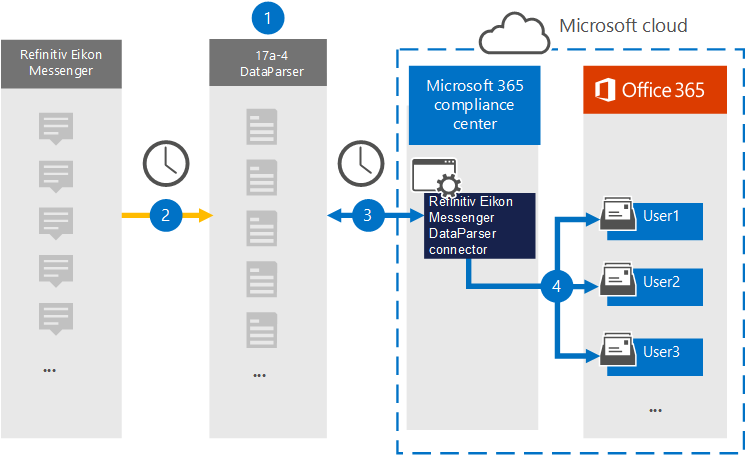

# Een connector instellen voor het archiveren van Refinitiv Eikon Messenger-gegevens (voorbeeld)

Gebruik [de Refinitiv Eikon Messenger DataParser](https://www.17a-4.com/refinitiv-messenger-dataparser/) van 17a-4 LLC om gegevens uit Refinitiv Eikon Messenger te importeren en te archiveren naar postvakken van gebruikers in uw Microsoft 365 organisatie. De DataParser bevat een Refinitiv Eikon Messenger-connector die is geconfigureerd om items uit een externe gegevensbron vast te leggen en deze items te importeren in Microsoft 365. De Refinitiv Eikon Messenger DataParser-connector converteert Refinitiv Eikon Messenger-gegevens naar een e-mailberichtindeling en importeert deze items vervolgens in gebruikerspostvakken in Microsoft 365.

Nadat Refinitiv Eikon Messenger-gegevens zijn opgeslagen in postvakken van gebruikers, kunt u Microsoft 365 compliancefuncties toepassen, zoals Litigation Hold, eDiscovery, bewaarbeleid en bewaarlabels en communicatie compliance. Met een Refinitiv Eikon Messenger-connector voor het importeren en archiveren van gegevens in Microsoft 365 kan uw organisatie voldoen aan overheids- en regelgevingsbeleid.

## Overzicht van het archiveren van Refinitiv Eikon Messenger-gegevens

In het volgende overzicht wordt uitgelegd hoe u een gegevensconnector gebruikt om Refinitiv Eikon Messenger-gegevens te archiveren in Microsoft 365.

1. Uw organisatie werkt met 17a-4 om de Refinitiv Eikon Messenger DataParser in te stellen en te configureren.

2. Regelmatig worden Refinitiv Eikon Messenger-items verzameld door de DataParser. De Gegevensparser converteert ook de inhoud van een bericht naar een e-mailberichtindeling.

3. De Refinitiv Eikon Messenger DataParser-connector die u in de Microsoft 365-compliancecentrum maakt, maakt verbinding met DataParser en brengt de berichten over naar een veilige Azure Storage locatie in de Microsoft-cloud.

4. Een submap in de map Postvak IN met de naam **Refinitiv Eikon Messenger DataParser** wordt gemaakt in de postvakken van de gebruiker en de Refinitiv Eikon Messenger-items worden geïmporteerd in die map. De verbindingslijn bepaalt in welk postvak items moeten worden geïmporteerd met behulp van de waarde van de eigenschap *E-mail.* Elk Refinitiv Eikon Messenger-item bevat deze eigenschap, die wordt gevuld met het e-mailadres van elke deelnemer.

## Voordat u een verbindingslijn in stelt

- Maak een DataParser-account voor Microsoft-connectors. Neem hiervoor contact op [met 17a-4 LLC.](https://www.17a-4.com/contact/) U moet zich aanmelden bij dit account wanneer u de verbindingslijn maakt in stap 1.

- De gebruiker die de Refinitiv Eikon Messenger DataParser-connector maakt in stap 1 (en deze voltooit in stap 3), moet worden toegewezen aan de rol Postvak importeren exporteren in Exchange Online. Deze rol is vereist om verbindingslijnen toe te voegen op de pagina **Gegevensconnectors** in de Microsoft 365-compliancecentrum. Deze rol is standaard niet toegewezen aan een rollengroep in Exchange Online. U kunt de rol Postvak importeren exporteren toevoegen aan de rollengroep Organisatiebeheer in Exchange Online. U kunt ook een rollengroep maken, de rol Postvak importeren exporteren toewijzen en vervolgens de juiste gebruikers toevoegen als leden. Zie de secties  Rollengroepen  maken of Rollengroepen wijzigen in het artikel 'Rollengroepen beheren in Exchange Online'.

## Stap 1: Een Refinitiv Eikon Messenger DataParser-connector instellen

De eerste stap is om toegang te krijgen tot de pagina Gegevensconnectors in de Microsoft 365-compliancecentrum en een 17a-4-connector te maken voor Refinitiv Eikon Messenger-gegevens.

1. Ga naar <https://compliance.microsoft.com> en klik vervolgens op **Gegevensconnectoren**  >  **Refinitiv Eikon Messenger DataParser**.

2. Klik op **de pagina Productbeschrijving van Refinitiv Eikon Messenger DataParser** op **Verbindingslijn toevoegen.**

3. Klik op **de pagina Servicevoorwaarden** op **Accepteren.**

4. Voer een unieke naam in die de verbindingslijn identificeert en klik vervolgens op **Volgende.**

5. Meld u aan bij uw 17a-4-account en voltooi de stappen in de wizard Refinitiv Eikon Messenger DataParser-verbinding.

## Stap 2: De Refinitiv Eikon Messenger DataParser-connector configureren

Werk met 17a-4 Ondersteuning om de Refinitiv Eikon Messenger DataParser-connector te configureren.

## Stap 3: Gebruikers in kaart brengen

De Refinitiv Eikon Messenger DataParser-connector zal gebruikers automatisch aan hun e-mailadressen Microsoft 365 voordat ze gegevens importeren in Microsoft 365.

## Stap 4: De Refinitiv Eikon Messenger DataParser-connector controleren

Nadat u een Refinitiv Eikon Messenger DataParser-connector hebt aan Microsoft 365-compliancecentrum.

1. Ga naar <https://compliance.microsoft.com> en klik op **Gegevensconnectoren** in het linkernavigatievenster.

2. Klik op het tabblad **Connectors** en selecteer vervolgens de Refinitiv Eikon Messenger DataParser-connector die u hebt gemaakt om de flyoutpagina weer te geven, die de eigenschappen en informatie over de verbindingslijn bevat.

3. Klik **onder Verbindingsstatus met bron** op de koppeling Logboek **downloaden** om het statuslogboek voor de verbindingslijn te openen (of op te slaan). Dit logboek bevat gegevens die zijn geïmporteerd in de Microsoft-cloud.

## Bekende problemen

Op dit moment bieden we geen ondersteuning voor het importeren van bijlagen of items die groter zijn dan 10 MB. Ondersteuning voor grotere items is op een later tijdstip beschikbaar.
