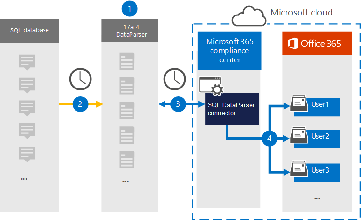

# Een verbindingslijn instellen om gegevens SQL archiveren (voorbeeld)

Gebruik de [SQL DataParser](https://www.17a-4.com/sql-dataparser/) van 17a-4 LLC om gegevens uit een SQL-database te importeren en te archiveren naar postvakken van gebruikers in uw Microsoft 365 organisatie. De DataParser bevat een SQL connector die is geconfigureerd om items uit een externe gegevensbron vast te leggen en deze items te importeren in Microsoft 365. De SQL DataParser-connector converteert SQL gegevens naar een e-mailberichtindeling en importeert deze items vervolgens in gebruikerspostvakken in Microsoft 365.

Nadat SQL gegevens zijn opgeslagen in gebruikerspostvakken, kunt u Microsoft 365 compliancefuncties toepassen, zoals Litigation Hold, eDiscovery, bewaarbeleid en bewaarlabels en communicatie compliance. Met een SQL verbindingslijn voor het importeren en archiveren van gegevens in Microsoft 365 kan uw organisatie voldoen aan overheids- en regelgevingsbeleid.

## Overzicht van het archiveren SQL gegevens

In het volgende overzicht wordt uitgelegd hoe u een gegevensconnector gebruikt om gegevens in SQL te Microsoft 365.

1. Uw organisatie werkt met 17a-4 om de SQL DataParser in te stellen en te configureren.

2. Op regelmatige basis worden SQL items verzameld door de DataParser. De Gegevensparser converteert ook de inhoud van een bericht naar een e-mailberichtindeling.

3. De SQL DataParser-connector die u in de Microsoft 365-compliancecentrum maakt, maakt verbinding met DataParser en draagt de berichten over naar een veilige locatie Azure Storage in de Microsoft-cloud.

4. Er wordt een submap in de **map Postvak SQL DataParser** gemaakt in de postvakken van de gebruiker en de SQL items worden geïmporteerd in die map. De verbindingslijn bepaalt in welk postvak items moeten worden geïmporteerd met behulp van de waarde van de eigenschap *E-mail.* Elk SQL item bevat deze eigenschap, die wordt gevuld met het e-mailadres van elke deelnemer.

## Voordat u een verbindingslijn in stelt

- Maak een DataParser-account voor Microsoft-connectors. Neem hiervoor contact op [met 17a-4 LLC.](https://www.17a-4.com/contact/) U moet zich aanmelden bij dit account wanneer u de verbindingslijn maakt in stap 1.

- De gebruiker die de SQL DataParser-connector maakt in stap 1 (en deze voltooit in stap 3), moet worden toegewezen aan de rol Postvak importeren exporteren in Exchange Online. Deze rol is vereist om verbindingslijnen toe te voegen op de pagina **Gegevensconnectors** in de Microsoft 365-compliancecentrum. Deze rol is standaard niet toegewezen aan een rollengroep in Exchange Online. U kunt de rol Postvak importeren exporteren toevoegen aan de rollengroep Organisatiebeheer in Exchange Online. U kunt ook een rollengroep maken, de rol Postvak importeren exporteren toewijzen en vervolgens de juiste gebruikers toevoegen als leden. Zie de secties  Rollengroepen  maken of Rollengroepen wijzigen in het artikel 'Rollengroepen beheren in Exchange Online'.

## Stap 1: Een SQL DataParser-connector instellen

De eerste stap is toegang tot de pagina Gegevensconnectors in de Microsoft 365-compliancecentrum en een 17a-4-connector maken voor SQL gegevens.

1. Ga naar <https://compliance.microsoft.com> en klik vervolgens op **Gegevensconnectoren SQL**  >  **DataParser**.

2. Klik op **SQL pagina Productbeschrijving van DataParser** op **Verbindingslijn toevoegen.**

3. Klik op **de pagina Servicevoorwaarden** op **Accepteren.**

4. Voer een unieke naam in die de verbindingslijn identificeert en klik vervolgens op **Volgende.**

5. Meld u aan bij uw 17a-4-account en voltooi de stappen in de wizard SQL DataParser-verbinding.

## Stap 2: De SQL DataParser-connector configureren

Werk met 17a-4 Ondersteuning om de SQL DataParser-connector te configureren.

## Stap 3: Gebruikers in kaart brengen

De SQL DataParser-connector zal gebruikers automatisch aan hun e-mailadressen Microsoft 365 voordat ze gegevens importeren in Microsoft 365.

## Stap 4: De SQL DataParser-connector controleren

Nadat u een SQL DataParser-verbindingslijn hebt Microsoft 365-compliancecentrum.

1. Ga naar <https://compliance.microsoft.com> en klik op **Gegevensconnectoren** in het linkernavigatievenster.

2. Klik op het tabblad **Verbindingslijnen** en selecteer vervolgens de SQL DataParser-connector die u hebt gemaakt om de flyoutpagina weer te geven, die de eigenschappen en informatie over de verbindingslijn bevat.

3. Klik **onder Verbindingsstatus met bron** op de koppeling Logboek **downloaden** om het statuslogboek voor de verbindingslijn te openen (of op te slaan). Dit logboek bevat gegevens die zijn geïmporteerd in de Microsoft-cloud.

## Bekende problemen

Op dit moment bieden we geen ondersteuning voor het importeren van bijlagen of items die groter zijn dan 10 MB. Ondersteuning voor grotere items is op een later tijdstip beschikbaar.
