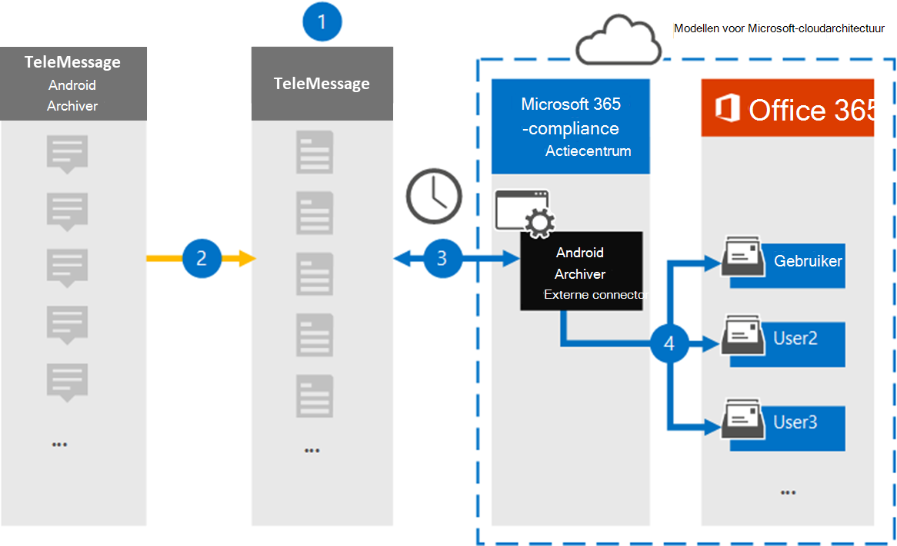

# Een connector instellen voor het archiveren van mobiele Android-gegevens

Gebruik een TeleMessage-connector in het Microsoft 365 compliancecentrum om Sms, MMS, spraakoproepen en oproeplogboeken van mobiele Android-telefoons te importeren en te archiveren. Nadat u een verbindingslijn hebt ingesteld en geconfigureerd, wordt er eenmaal per dag verbinding gemaakt met het TeleMessage-account van uw organisatie en wordt de mobiele communicatie van werknemers met de TeleMessage Android Archiver geïmporteerd naar postvakken in Microsoft 365.

Nadat gegevens van mobiele Android-telefoons zijn opgeslagen in postvakken van gebruikers, kunt u Microsoft 365 compliancefuncties zoals Litigation Hold, Content Search en Microsoft 365 bewaarbeleid toepassen op Android Archiver-gegevens. U kunt bijvoorbeeld zoeken in mobiele communicatie met Android Archiver met Inhoud zoeken of het postvak met de gegevens van de Android Archiver-connector koppelen aan een bewaarder in een Advanced eDiscovery geval. Als u een Android Archiver-connector gebruikt voor het importeren en archiveren van gegevens in Microsoft 365 kan uw organisatie voldoen aan overheids- en regelgevingsbeleid.

## Overzicht van het archiveren van mobiele Android-gegevens

In het volgende overzicht wordt uitgelegd hoe het gebruik van een connector voor het archiveren van mobiele Android-gegevens in Microsoft 365.

1. Uw organisatie werkt met TeleMessage om een Android Archiver-connector in te stellen. Zie Android Archiver voor [meer informatie.](https://www.telemessage.com/office365-activation-for-android-archiver/)

2. In realtime worden Sms, MMS, spraakoproepen en oproeplogboeken van de mobiele Android-telefoons van uw organisatie gekopieerd naar de TeleMessage-site.

3. De Android Archiver-connector die u maakt in het Microsoft 365 compliancecentrum maakt elke dag verbinding met de TeleMessage-site en draagt de Android-gegevens van de afgelopen 24 uur over naar een veilige Azure Storage-locatie in de Microsoft-cloud. De connector converteert ook de Android-gegevens naar een e-mailberichtindeling.

4. De verbindingslijn importeert de mobiele communicatie-items naar het postvak van een specifieke gebruiker. Er wordt een nieuwe map met de naam Android Archiver gemaakt in het postvak van de specifieke gebruiker en de items worden er in geïmporteerd. De verbindingslijn wordt toegewezen met behulp van de waarde van de eigenschap *E-mailadres van de* gebruiker. Elk e-mailbericht bevat deze eigenschap, die wordt gevuld met het e-mailadres van elke deelnemer van het e-mailbericht. Naast automatische gebruikerstoewijzing met  de waarde van de eigenschap E-mailadres van de gebruiker, kunt u ook een aangepaste toewijzing definiëren door een CSV-toewijzingsbestand te uploaden. Dit toewijzingsbestand moet het mobiele nummer en het bijbehorende Microsoft 365 voor elke gebruiker bevatten. Als u automatische gebruikerstoewijzing inschakelen en een aangepaste toewijzing biedt, wordt voor elk e-mailitem eerst naar aangepast toewijzingsbestand gekijken. Als er geen geldige Microsoft 365 wordt gevonden die overeenkomt met het mobiele nummer van een gebruiker, gebruikt de verbindingslijn de eigenschap e-mailadres van de gebruiker van het e-mailitem. Als de verbindingslijn geen geldige Microsoft 365 gebruiker vindt in het  aangepaste toewijzingsbestand of de eigenschap E-mailadres van het e-mailitem van de gebruiker, wordt het item niet geïmporteerd.

## Voordat u een verbindingslijn in stelt

Sommige implementatiestappen die nodig zijn om Android-communicatiegegevens te archiveren, zijn extern Microsoft 365 en moeten worden voltooid voordat u de verbindingslijn in het compliancecentrum kunt maken.

- Bestel de [Android Archiver-service bij TeleMessage](https://www.telemessage.com/mobile-archiver/order-mobile-archiver-for-o365) en ontvang een geldig beheeraccount voor uw organisatie. U moet zich aanmelden bij dit account wanneer u de verbindingslijn maakt.

- Registreer alle gebruikers die de Android Archiver-service nodig hebben in het TeleMessage-account. Wanneer u gebruikers registreert, moet u hetzelfde e-mailadres gebruiken dat wordt gebruikt voor hun Microsoft 365 account.

- Installeer en activeer de app TeleMessage Android Archiver op de mobiele telefoons van uw werknemers.

- De gebruiker die een Android Archiver-connector maakt, moet de rol Postvak importeren exporteren in Exchange Online. Dit is vereist om verbindingslijnen toe te voegen op de pagina **Gegevensconnectors** in het Microsoft 365 compliancecentrum. Deze rol is standaard niet toegewezen aan een rollengroep in Exchange Online. U kunt de rol Postvak importeren exporteren toevoegen aan de rollengroep Organisatiebeheer in Exchange Online. U kunt ook een rollengroep maken, de rol Postvak importeren exporteren toewijzen en vervolgens de juiste gebruikers toevoegen als leden. Zie de secties  Rollengroepen  maken of Rollengroepen wijzigen in het artikel 'Rollengroepen beheren in Exchange Online'.

- Deze gegevensconnector is beschikbaar in GCC omgevingen in de Microsoft 365 amerikaanse overheidscloud. Toepassingen en services van derden kunnen betrekking hebben op het opslaan, verzenden en verwerken van klantgegevens van uw organisatie op systemen van derden die buiten de Microsoft 365-infrastructuur vallen en daarom niet worden gedekt door de toezeggingen van Microsoft 365 compliance en gegevensbescherming. Microsoft geeft niet aan dat het gebruik van dit product om verbinding te maken met toepassingen van derden betekent dat deze toepassingen van derden compatibel zijn met FEDRAMP.

## Een Android Archiver-connector maken

De laatste stap is het maken van een Android Archiver-connector in het Microsoft 365 compliancecentrum. De connector gebruikt de informatie die u verstrekt om verbinding te maken met de TeleMessage-site en Android-communicatie over te brengen naar de bijbehorende postvakken van gebruikers in Microsoft 365.

1. Ga naar [https://compliance.microsoft.com](https://compliance.microsoft.com) en klik op **Gegevensconnectoren**  >  **Android Archiver.**

2. Klik op **de pagina Productbeschrijving van Android Archiver** op **Verbindingslijn toevoegen.**

3. Klik op **de pagina Servicevoorwaarden** op **Accepteren.**

4. Voer op de pagina Aanmelden bij **TeleMessage** onder Stap 3 de vereiste informatie in de volgende vakken in en klik vervolgens op **Volgende**.

   - **Gebruikersnaam:** Uw TeleMessage-gebruikersnaam.

   - **Wachtwoord:** Uw TeleMessage-wachtwoord.

5. Nadat de verbindingslijn is gemaakt, sluit u het pop-upvenster en klikt u op **Volgende.**

6. Schakel op **de pagina Gebruikerstoewijzing** automatische gebruikerstoewijzing in en klik op **Volgende.** Als u aangepaste toewijzing nodig hebt, uploadt u een CSV-bestand en klikt u op **Volgende.**

7. Controleer de instellingen en klik vervolgens op **Voltooien om** de verbindingslijn te maken.

8. Ga naar het tabblad Connectors op de pagina **Gegevensconnectors** om de voortgang van het importproces voor de nieuwe verbindingslijn te bekijken.

## Bekende problemen

- Op dit moment bieden we geen ondersteuning voor het importeren van bijlagen of items die groter zijn dan 10 MB. Ondersteuning voor grotere items is op een later tijdstip beschikbaar.
