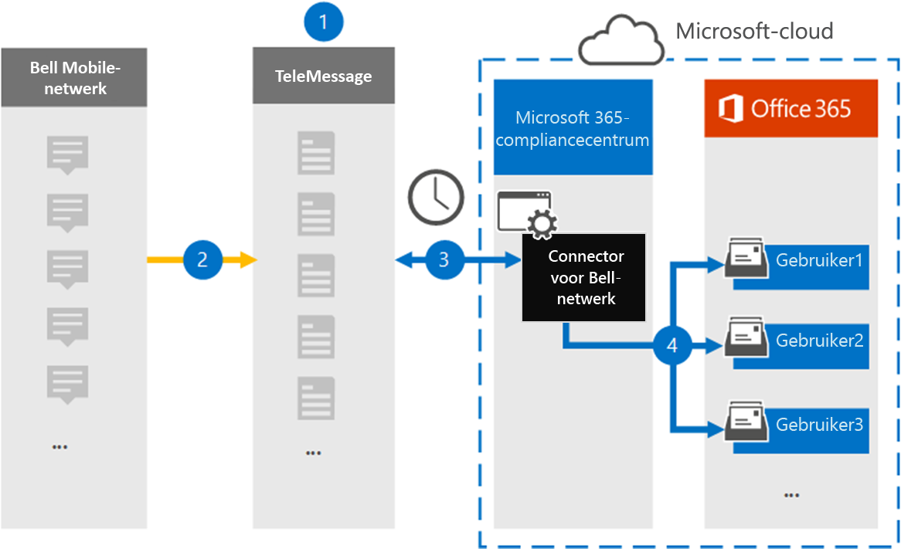

# Een verbindingslijn instellen voor het archiveren van Bell Network-gegevens

Gebruik een TeleMessage-connector in het Microsoft 365 compliancecentrum om berichten van de Short Messaging Service (Sms) en MMS-berichten (Multimedia Messaging Service) uit het Bell-netwerk te importeren en te archiveren. Nadat u een verbindingslijn hebt ingesteld en geconfigureerd, wordt er eenmaal per dag verbinding met het Bell Network van uw organisatie en worden Sms- en MMS-berichten geïmporteerd in postvakken in Microsoft 365.

Nadat de Sms- en MMS-berichten zijn opgeslagen in postvakken van gebruikers, kunt u Microsoft 365 compliancefuncties zoals Litigation Hold, Content Search en Microsoft 365 bewaarbeleid toepassen op Bell Network-gegevens. U kunt bijvoorbeeld zoeken in Bell Network Sms/MMS met Inhoud zoeken of het postvak met de gegevens van de Bell Network-verbindingslijn koppelen aan een bewaarder in een Advanced eDiscovery geval. Als u een Belnetwerkconnector gebruikt om gegevens te importeren en te archiveren in Microsoft 365 kan uw organisatie voldoen aan overheids- en regelgevingsbeleid.

## Overzicht van het archiveren van Bell Network-gegevens

In het volgende overzicht wordt uitgelegd hoe het gebruik van een verbindingslijn voor het archiveren van Bell Network-gegevens in Microsoft 365.

1. Uw organisatie werkt samen met TeleMessage en Bell om een Belnetwerkconnector in te stellen. Zie Bell Network Archiver voor [meer informatie.](https://www.telemessage.com/office365-activation-for-bell-network-archiver)

2. In realtime worden Sms en MMS-berichten van het Bell Network van uw organisatie gekopieerd naar de TeleMessage-site.

3. De Belnetwerkconnector die u in het Microsoft 365-compliancecentrum maakt, maakt elke dag verbinding met de TeleMessage-site en brengt de Sms- en MMS-berichten van de afgelopen 24 uur over naar een beveiligde Azure Storage-locatie in de Microsoft-cloud. De connector converteert ook de inhoud van Sms en MMS-berichten naar een e-mailberichtindeling.

4. De connector importeert de mobiele communicatie-items naar het postvak van specifieke gebruikers. Een nieuwe map genaamd **Bell Sms/MMS Network Archiver** wordt gemaakt in het postvak van een specifieke gebruiker en de items worden er in geïmporteerd. De connector doet deze toewijzing met behulp van de waarde van de *eigenschap E-mailadres van de* gebruiker. Elk Sms en MMS-bericht bevat deze eigenschap, die wordt gevuld met het e-mailadres van elke deelnemer aan het bericht.

   Naast automatische gebruikerstoewijzing met  de waarde van de eigenschap E-mailadres van de gebruiker, kunt u ook een aangepaste toewijzing definiëren door een CSV-toewijzingsbestand te uploaden. Dit toewijzingsbestand bevat het mobiele telefoonnummer en het bijbehorende Microsoft 365 e-mailadres voor gebruikers in uw organisatie. Als u zowel automatische gebruikerstoewijzing als aangepaste toewijzing inschakelen, wordt voor elk Bell Network-item eerst naar aangepast toewijzingsbestand gesurfd. Als er geen geldige Microsoft 365-gebruiker wordt gevonden die overeenkomt met het mobiele telefoonnummer van een gebruiker, gebruikt de verbindingslijn de waarden in de eigenschap e-mailadres van het item dat het probeert te importeren. Als de verbindingslijn geen geldige gebruiker Microsoft 365 in het aangepaste toewijzingsbestand of in de eigenschap e-mailadres van het Bell Network-item, wordt het item niet geïmporteerd.

## Voordat u een verbindingslijn in stelt

Sommige implementatiestappen die nodig zijn om Bell Network-gegevens te archiveren, zijn extern Microsoft 365 en moeten zijn voltooid voordat u een verbindingslijn kunt maken in het compliancecentrum.

- Bestel de [Bell Network Archiver-service bij TeleMessage](https://www.telemessage.com/mobile-archiver/order-mobile-archiver-for-o365/) en krijg een geldig beheeraccount voor uw organisatie. U moet zich aanmelden bij dit account wanneer u de verbindingslijn maakt in het compliancecentrum.

- Verkrijg uw Bell Network-account en factureringscontactgegevens, zodat u de onboardingformulieren voor TeleMessage kunt invullen en de berichtarchiveringsservice kunt bestellen bij Bell.

- Registreer alle gebruikers die bell-Sms/MMS-netwerkarchivering nodig hebben in het TeleMessage-account. Wanneer u gebruikers registreert, moet u hetzelfde e-mailadres gebruiken dat wordt gebruikt voor hun Microsoft 365 account.

- Uw werknemers moeten mobiele telefoons van het mobiele Bell-netwerk hebben die eigendom zijn van uw bedrijf en die aansprakelijk zijn voor bedrijven. Het archiveren van berichten in Microsoft 365 is niet beschikbaar voor byod-apparaten (Bring Your Own Devices).

- De gebruiker die een Belnetwerkconnector maakt, moet de rol Postvak importeren exporteren in Exchange Online. Dit is vereist om verbindingslijnen toe te voegen op de pagina **Gegevensconnectors** in het Microsoft 365 compliancecentrum. Deze rol is standaard niet toegewezen aan een rollengroep in Exchange Online. U kunt de rol Postvak importeren exporteren toevoegen aan de rollengroep Organisatiebeheer in Exchange Online. U kunt ook een rollengroep maken, de rol Postvak importeren exporteren toewijzen en vervolgens de juiste gebruikers toevoegen als leden. Zie de secties  Rollengroepen  maken of Rollengroepen wijzigen in het artikel 'Rollengroepen beheren in Exchange Online'.

- Deze gegevensconnector is beschikbaar in GCC omgevingen in de Microsoft 365 amerikaanse overheidscloud. Toepassingen en services van derden kunnen betrekking hebben op het opslaan, verzenden en verwerken van klantgegevens van uw organisatie op systemen van derden die buiten de Microsoft 365-infrastructuur vallen en daarom niet worden gedekt door de toezeggingen van Microsoft 365 compliance en gegevensbescherming. Microsoft geeft niet aan dat het gebruik van dit product om verbinding te maken met toepassingen van derden betekent dat deze toepassingen van derden compatibel zijn met FEDRAMP.

## Een Belnetwerkconnector maken

De laatste stap is het maken van een Belnetwerkconnector in het Microsoft 365 compliancecentrum. De verbindingslijn gebruikt de informatie die u verstrekt om verbinding te maken met de TeleMessage-site en om Sms/MMS-berichten over te brengen naar de bijbehorende postvakken van gebruikers in Microsoft 365.

1. Ga naar [https://compliance.microsoft.com](https://compliance.microsoft.com) en klik vervolgens op Data **connectors**  >  **Bell Sms/MMS Network Archiver**.

2. Klik op **de pagina Bell Network-productbeschrijving** op **Verbindingslijn toevoegen**

3. Klik op **de pagina Servicevoorwaarden** op **Accepteren.**

4. Voer op de pagina Aanmelden bij **TeleMessage** onder Stap 3 de vereiste informatie in de volgende vakken in en klik vervolgens op **Volgende**.

   - **Gebruikersnaam:** Uw TeleMessage-gebruikersnaam.

   - **Wachtwoord:** Uw TeleMessage-wachtwoord.

5. Nadat de verbindingslijn is gemaakt, kunt u het pop-upvenster sluiten en naar de volgende pagina gaan.

6. Schakel op **de pagina Gebruikerstoewijzing** automatische gebruikerstoewijzing in. Als u aangepaste toewijzing wilt inschakelen, uploadt u een CSV-bestand dat de gebruikerstoewijzingsgegevens bevat en klikt u vervolgens op **Volgende.**

7. Controleer de instellingen en klik vervolgens op **Voltooien om** de verbindingslijn te maken.

8. Ga naar het **tabblad Connectors** op de pagina Gegevensconnectoren in het compliancecentrum om de voortgang van het importproces voor de nieuwe **verbindingslijn** te bekijken.

## Bekende problemen

- Op dit moment bieden we geen ondersteuning voor het importeren van bijlagen of items die groter zijn dan 10 MB. Ondersteuning voor grotere items is op een later tijdstip beschikbaar.
