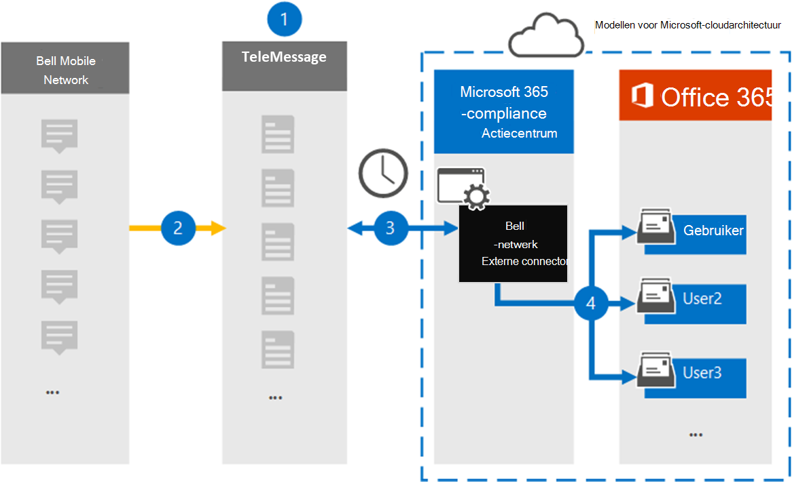

# Een verbindingslijn instellen voor het archiveren van Bell Network-gegevensSet up a connector to archive Bell Network data

Gebruik een TeleMessage-connector in het Microsoft 365 compliancecentrum om berichten van de Short Messaging Service (Sms) en MMS-berichten (Multimedia Messaging Service) uit het Bell-netwerk te importeren en te archiveren.Use a TeleMessage connector in the Microsoft 365 compliance center to import and archive Short Messaging Service (SMS) and Multimedia Messaging Service (MMS) messages from the Bell Network. Nadat u een verbindingslijn hebt ingesteld en geconfigureerd, wordt er eenmaal per dag verbinding met het Bell Network van uw organisatie en worden Sms- en MMS-berichten geïmporteerd in postvakken in Microsoft 365.After you set up and configure a connector, it connects to your organization's Bell Network once every day, and imports SMS and MMS messages to mailboxes in Microsoft 365.

Nadat de Sms- en MMS-berichten zijn opgeslagen in postvakken van gebruikers, kunt u Microsoft 365 compliancefuncties zoals Litigation Hold, Content Search en Microsoft 365 bewaarbeleid toepassen op Bell Network-gegevens.After the SMS and MMS messages are stored in user mailboxes, you can apply Microsoft 365 compliance features such as Litigation Hold, Content Search, and Microsoft 365 retention policies to Bell Network data. U kunt bijvoorbeeld zoeken in Bell Network Sms/MMS met Inhoud zoeken of het postvak met de gegevens van de Bell Network-verbindingslijn koppelen aan een bewaarder in een Advanced eDiscovery geval.For example, you can search Bell Network SMS/MMS using Content Search or associate the mailbox that contains the Bell Network connector data with a custodian in an Advanced eDiscovery case. Als u een Belnetwerkconnector gebruikt om gegevens te importeren en te archiveren in Microsoft 365 kan uw organisatie voldoen aan overheids- en regelgevingsbeleid.Using a Bell Network connector to import and archive data in Microsoft 365 can help your organization stay compliant with government and regulatory policies.

## Overzicht van het archiveren van Bell Network-gegevensOverview of archiving Bell Network data

In het volgende overzicht wordt uitgelegd hoe het gebruik van een verbindingslijn voor het archiveren van Bell Network-gegevens in Microsoft 365.The following overview explains the process of using a connector to archive Bell Network data in Microsoft 365.

1. Uw organisatie werkt samen met TeleMessage en Bell om een Belnetwerkconnector in te stellen.Your organization works with TeleMessage and Bell to set up a Bell Network connector. Zie Bell Network Archiver voor [meer informatie.](https://www.telemessage.com/office365-activation-for-bell-network-archiver)For more information, see [Bell Network Archiver](https://www.telemessage.com/office365-activation-for-bell-network-archiver).

2. In realtime worden Sms en MMS-berichten van het Bell Network van uw organisatie gekopieerd naar de TeleMessage-site.In real time, SMS and MMS messages from your organization's Bell Network are copied to the TeleMessage site.

3. De Belnetwerkconnector die u in het Microsoft 365-compliancecentrum maakt, maakt elke dag verbinding met de TeleMessage-site en brengt de Sms- en MMS-berichten van de afgelopen 24 uur over naar een beveiligde Azure Storage-locatie in de Microsoft-cloud.The Bell Network connector that you create in the Microsoft 365 compliance center connects to the TeleMessage site every day and transfers the SMS and MMS messages from the previous 24 hours to a secure Azure Storage location in the Microsoft cloud. De connector converteert ook de inhoud van Sms en MMS-berichten naar een e-mailberichtindeling.The connector also converts the content of SMS and MMS messages to an email message format.

4. De connector importeert de mobiele communicatie-items naar het postvak van specifieke gebruikers.The connector imports the mobile communication items to the mailbox of specific users. Een nieuwe map genaamd **Bell Sms/MMS Network Archiver** wordt gemaakt in het postvak van een specifieke gebruiker en de items worden er in geïmporteerd.A new folder named **Bell SMS/MMS Network Archiver** is created in a specific user's mailbox and the items are imported to it. De connector doet deze toewijzing met behulp van de waarde van de *eigenschap E-mailadres van de* gebruiker.The connector does this mapping by using the value of the *User's Email address* property. Elk Sms en MMS-bericht bevat deze eigenschap, die wordt gevuld met het e-mailadres van elke deelnemer aan het bericht.Every SMS and MMS message contains this property, which is populated with the email address of every participant of the message.

   Naast automatische gebruikerstoewijzing met  de waarde van de eigenschap E-mailadres van de gebruiker, kunt u ook een aangepaste toewijzing definiëren door een CSV-toewijzingsbestand te uploaden.In addition to automatic user mapping using the value of the *User’s Email address* property, you can also define a custom mapping by uploading a CSV mapping file. Dit toewijzingsbestand bevat het mobiele telefoonnummer en het bijbehorende Microsoft 365 e-mailadres voor gebruikers in uw organisatie.This mapping file contains the mobile phone number and corresponding Microsoft 365 email address for users in your organization. Als u zowel automatische gebruikerstoewijzing als aangepaste toewijzing inschakelen, wordt voor elk Bell Network-item eerst naar aangepast toewijzingsbestand gesurfd.If you enable both automatic user mapping and custom mapping, for every Bell Network item the connector first looks at custom mapping file. Als er geen geldige Microsoft 365-gebruiker wordt gevonden die overeenkomt met het mobiele telefoonnummer van een gebruiker, gebruikt de verbindingslijn de waarden in de eigenschap e-mailadres van het item dat het probeert te importeren.If it doesn't find a valid Microsoft 365 user that corresponds to a user's mobile phone number, the connector will use the values in the email address property of the item it's trying to import. Als de verbindingslijn geen geldige gebruiker Microsoft 365 in het aangepaste toewijzingsbestand of in de eigenschap e-mailadres van het Bell Network-item, wordt het item niet geïmporteerd.If the connector doesn't find a valid Microsoft 365 user in either the custom mapping file or in the email address property of the Bell Network item, the item won't be imported.

## Voordat u begintBefore you begin

Sommige implementatiestappen die nodig zijn om Bell Network-gegevens te archiveren, zijn extern Microsoft 365 en moeten zijn voltooid voordat u een verbindingslijn kunt maken in het compliancecentrum.Some of the implementation steps required to archive Bell Network data are external to Microsoft 365 and must be completed before you can create a connector in the compliance center.

- Bestel de [Bell Network Archiver-service bij TeleMessage](https://www.telemessage.com/mobile-archiver/order-mobile-archiver-for-o365/) en krijg een geldig beheeraccount voor uw organisatie.Order the [Bell Network Archiver service from TeleMessage](https://www.telemessage.com/mobile-archiver/order-mobile-archiver-for-o365/) and get a valid administration account for your organization. U moet zich aanmelden bij dit account wanneer u de verbindingslijn maakt in het compliancecentrum.You'll need to sign into this account when you create the connector in the compliance center.

- Verkrijg uw Bell Network-account en factureringscontactgegevens, zodat u de onboardingformulieren voor TeleMessage kunt invullen en de berichtarchiveringsservice kunt bestellen bij Bell.Obtain your Bell Network account and billing contact details so you can fill-out the TeleMessage onboarding forms and order the message archiving service from Bell.

- Registreer alle gebruikers die bell-Sms/MMS-netwerkarchivering nodig hebben in het TeleMessage-account.Register all users that require Bell SMS/MMS Network archiving in the TeleMessage account. Wanneer u gebruikers registreert, moet u hetzelfde e-mailadres gebruiken dat wordt gebruikt voor hun Microsoft 365 account.When registering users, be sure to use the same email address that's used for their Microsoft 365 account.

- Uw werknemers moeten mobiele telefoons van het mobiele Bell-netwerk hebben die eigendom zijn van uw bedrijf en die aansprakelijk zijn voor bedrijven.Your employees must have corporate-owned and corporate-liable mobile phones on the Bell mobile network. Het archiveren van berichten in Microsoft 365 is niet beschikbaar voor byod-apparaten (Bring Your Own Devices).Archiving messages in Microsoft 365 isn't available for employee-owned or "Bring Your Own Devices (BYOD) devices.

- De gebruiker die een Belnetwerkconnector maakt, moet de rol Postvak importeren exporteren in Exchange Online.The user who creates a Bell Network connector must be assigned the Mailbox Import Export role in Exchange Online. Dit is vereist om verbindingslijnen toe te voegen op de pagina **Gegevensconnectors** in het Microsoft 365 compliancecentrum.This is required to add connectors in the **Data connectors** page in the Microsoft 365 compliance center. Deze rol is standaard niet toegewezen aan een rollengroep in Exchange Online.By default, this role isn't assigned to any role group in Exchange Online. U kunt de rol Postvak importeren exporteren toevoegen aan de rollengroep Organisatiebeheer in Exchange Online.You can add the Mailbox Import Export role to the Organization Management role group in Exchange Online. U kunt ook een rollengroep maken, de rol Postvak importeren exporteren toewijzen en vervolgens de juiste gebruikers toevoegen als leden.Or you can create a role group, assign the Mailbox Import Export role, and then add the appropriate users as members. Zie de secties  Rollengroepen  maken of Rollengroepen wijzigen in het artikel 'Rollengroepen beheren in Exchange Online'.For more information, see the [Create role groups](/Exchange/permissions-exo/role-groups#create-role-groups) or [Modify role groups](/Exchange/permissions-exo/role-groups#modify-role-groups) sections in the article "Manage role groups in Exchange Online".

## Een Belnetwerkconnector makenCreate a Bell Network connector

De laatste stap is het maken van een Belnetwerkconnector in het Microsoft 365 compliancecentrum.The last step is to create a Bell Network connector in the Microsoft 365 compliance center. De verbindingslijn gebruikt de informatie die u verstrekt om verbinding te maken met de TeleMessage-site en om Sms/MMS-berichten over te brengen naar de bijbehorende postvakken van gebruikers in Microsoft 365.The connector uses the information you provide to connect to the TeleMessage site and transfer SMS/ MMS messages to the corresponding user mailbox boxes in Microsoft 365.

1. Ga naar [https://compliance.microsoft.com](https://compliance.microsoft.com) en klik vervolgens op Data **connectors**  >  **Bell Sms/MMS Network Archiver**.Go to [https://compliance.microsoft.com](https://compliance.microsoft.com) and then click **Data connectors** > **Bell SMS/MMS Network Archiver**.

2. Klik op **de pagina Bell Network-productbeschrijving** op **Verbindingslijn toevoegen**On the **Bell Network** product description page, click **Add connector**

3. Klik op **de pagina Servicevoorwaarden** op **Accepteren.**On the **Terms of service** page, click **Accept**.

4. Voer op de pagina Aanmelden bij **TeleMessage** onder Stap 3 de vereiste informatie in de volgende vakken in en klik vervolgens op **Volgende**.On the **Login to TeleMessage** page, under Step 3, enter the required information in the following boxes and then click **Next**.

   - **Gebruikersnaam:** Uw TeleMessage-gebruikersnaam.**Username:** Your TeleMessage username.

   - **Wachtwoord:** Uw TeleMessage-wachtwoord.**Password:** Your TeleMessage password.

5. Nadat de verbindingslijn is gemaakt, kunt u het pop-upvenster sluiten en naar de volgende pagina gaan.After the connector is created, you can close the pop-up window and go to the next page.

6. Schakel op **de pagina Gebruikerstoewijzing** automatische gebruikerstoewijzing in.On the **User mapping** page, enable automatic user mapping. Als u aangepaste toewijzing wilt inschakelen, uploadt u een CSV-bestand dat de gebruikerstoewijzingsgegevens bevat en klikt u vervolgens op **Volgende.**To enable custom mapping, upload a CSV file that contains the user mapping information, and then click **Next**.

7. Controleer de instellingen en klik vervolgens op **Voltooien om** de verbindingslijn te maken.Review your settings, and then click **Finish** to create the connector.

8. Ga naar het **tabblad Connectors** op de pagina Gegevensconnectoren in het compliancecentrum om de voortgang van het importproces voor de nieuwe **verbindingslijn** te bekijken.Go to the **Connectors** tab on the **Data connectors** page in the compliance center to see the progress of the import process for the new connector.

## Bekende problemenKnown issues

- Op dit moment bieden we geen ondersteuning voor het importeren van bijlagen of items die groter zijn dan 10 MB.At this time, we don't support importing attachments or items that are larger than 10 MB. Ondersteuning voor grotere items is op een later tijdstip beschikbaar.Support for larger items will be available at a later date.
