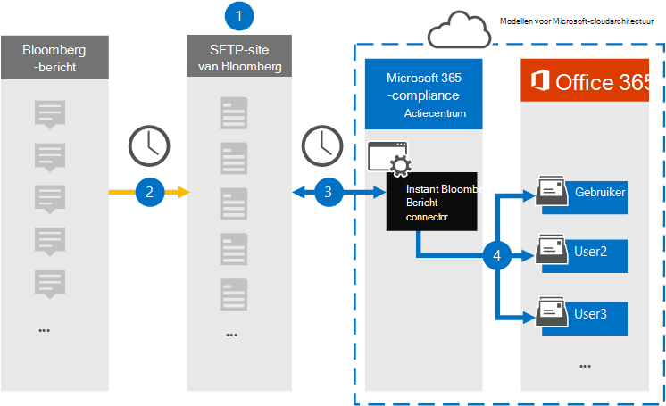
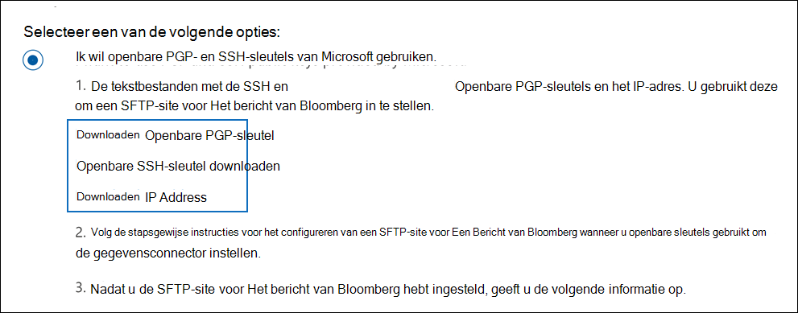

# Een verbindingslijn instellen voor het archiveren van Gegevens van Het bericht van BloombergSet up a connector to archive Bloomberg Message data

Gebruik een gegevensconnector in het Microsoft 365 compliancecentrum om e-mailgegevens van financiële services te importeren en te archiveren vanuit het samenwerkingshulpmiddel [Van Het bericht van Bloomberg.](https://www.bloomberg.com/professional/product/collaboration/)Use a data connector in the Microsoft 365 compliance center to import and archive financial services email data from the [Bloomberg Message](https://www.bloomberg.com/professional/product/collaboration/) collaboration tool. Nadat u een verbindingslijn hebt ingesteld en geconfigureerd, wordt er eenmaal per dag verbinding gemaakt met de beveiligde FTP-site (SFTP) van uw organisatie en worden e-mailitems geïmporteerd in postvakken in Microsoft 365.After you set up and configure a connector, it connects to your organization's Bloomberg secure FTP (SFTP) site once every day, and imports email items to mailboxes in Microsoft 365.

Nadat gegevens van Het bericht van Bloomberg zijn opgeslagen in postvakken van gebruikers, kunt u Microsoft 365 compliancefuncties zoals Bewaring van rechtszaken, inhoud zoeken, Archiveren, auditing, Communicatie compliance en Microsoft 365 bewaarbeleid toepassen op Gegevens van Het bericht van Bloomberg.After Bloomberg Message data is stored in user mailboxes, you can apply Microsoft 365 compliance features such as Litigation hold, content search, In-place archiving, auditing, Communication compliance, and Microsoft 365 retention policies to Bloomberg Message data. U kunt bijvoorbeeld e-mailberichten van Het Bericht van Bloomberg doorzoeken met behulp van het zoekprogramma voor inhoud of het postvak met de Gegevens van Het Bericht van Bloomberg koppelen aan een bewaarder in een Advanced eDiscovery geval.For example, you can search Bloomberg Message emails using the content search tool or associate the mailbox that contains the Bloomberg Message data with a custodian in an Advanced eDiscovery case. Als u een Verbindingslijn voor Het Bericht van Bloomberg gebruikt om gegevens te importeren en te archiveren in Microsoft 365 kan uw organisatie voldoen aan overheids- en regelgevingsbeleid.Using a Bloomberg Message connector to import and archive data in Microsoft 365 can help your organization stay compliant with government and regulatory policies.

## Overzicht van het archiveren van Gegevens van Het Bericht van BloombergOverview of archiving Bloomberg Message data

In het volgende overzicht wordt uitgelegd hoe het gebruik van een verbindingslijn voor het archiveren van Gegevens van Het Bericht van Bloomberg in een Microsoft 365.The following overview explains the process of using a connector to archive Bloomberg Message data in Microsoft 365.

1. Uw organisatie werkt samen met Bloomberg om een SFTP-site voor Bloomberg in te stellen.Your organization works with Bloomberg to set up a Bloomberg SFTP site. U werkt ook samen met Bloomberg om Het Bericht van Bloomberg te configureren om e-mailberichten te kopiëren naar de SFTP-site van Bloomberg.You'll also work with Bloomberg to configure Bloomberg Message to copy email messages to the Bloomberg SFTP site.

2. Elke 24 uur worden e-mailberichten van Het Bericht van Bloomberg gekopieerd naar de SFTP-site van Bloomberg.Once every 24 hours, email messages from Bloomberg Message are copied to the Bloomberg SFTP site.

3. De Verbindingslijn van Het Bericht van Bloomberg die u maakt in het Microsoft 365 compliancecentrum maakt elke dag verbinding met de SFTP-site van Bloomberg en brengt de e-mailberichten van de afgelopen 24 uur over naar een beveiligd Azure Storage-gebied in de Microsoft Cloud.The Bloomberg Message connector that you create in the Microsoft 365 compliance center connects to the Bloomberg SFTP site every day and transfers the email messages from the previous 24 hours to a secure Azure Storage area in the Microsoft Cloud.

4. De connector importeert de e-mailberichtitems naar het postvak van een specifieke gebruiker.The connector imports the email message items to the mailbox of a specific user. Er wordt een nieuwe map met de naam BloombergMessage gemaakt in het postvak van de specifieke gebruiker en de items worden in het postvak geïmporteerd.A new folder named BloombergMessage is created in the specific user's mailbox and the items will be imported to it.

   De verbindingslijn doet dit met behulp van de waarde van de eigenschap CorporateEmailAddress.The connector does this by using the value of the CorporateEmailAddress property. Elk e-mailbericht bevat deze eigenschap, die wordt gevuld met het e-mailadres van elke deelnemer van het e-mailbericht.Every email message contains this property, which is populated with the email address of every participant of the email message. Naast automatische gebruikerstoewijzing met de waarde van de *eigenschap CorporateEmailAddress,* kunt u ook een aangepaste toewijzing definiëren door een CSV-toewijzingsbestand te uploaden.In addition to automatic user mapping using the value of the *CorporateEmailAddress* property, you can also define a custom mapping by uploading a CSV mapping file. Dit toewijzingsbestand bevat een UUID van Bloomberg en het bijbehorende Microsoft 365 voor elke gebruiker in uw organisatie.This mapping file contains a Bloomberg UUID and the corresponding Microsoft 365 mailbox address for each user in your organization. Als u automatische gebruikerstoewijzing inschakelen en een aangepaste toewijzing biedt, wordt voor elk e-mailitem eerst het bestand voor aangepaste toewijzing door de verbindingslijn verkend.If you enable automatic user mapping and provide a custom mapping, for every email item the connector will first look at the custom-mapping file. Als er geen geldige Microsoft 365 wordt gevonden die overeenkomt met de UUID van Bloomberg van een gebruiker, gebruikt de connector de eigenschap *CorporateEmailAddress* van het e-mailitem.If it doesn't find a valid Microsoft 365 user that corresponds to a user's Bloomberg UUID, the connector uses the *CorporateEmailAddress* property of the email item. Als de verbindingslijn geen geldige Microsoft 365-gebruiker vindt in het bestand voor aangepaste toewijzing of de eigenschap *CorporateEmailAddress* van het e-mailitem, wordt het item niet geïmporteerd.If the connector doesn't find a valid Microsoft 365 user in either the custom-mapping file or the *CorporateEmailAddress* property of the email item, the item won't be imported.

## Voordat u een verbindingslijn in steltBefore you set up a connector

Sommige implementatiestappen die nodig zijn voor het archiveren van Gegevens van Het bericht van Bloomberg zijn extern Microsoft 365 en moeten zijn voltooid voordat u de verbindingslijn in het compliancecentrum kunt maken.Some of the implementation steps required to archive Bloomberg Message data are external to Microsoft 365 and must be completed before you can create the connector in the compliance center.

- Als u een Verbindingslijn voor Het Bericht van Bloomberg wilt instellen, moet u toetsen en wachtwoordzinnen gebruiken voor Pretty Good Privacy (PGP) en Secure Shell (SSH).To set up a Bloomberg Message connector, you have to use keys and key passphrases for Pretty Good Privacy (PGP) and Secure Shell (SSH). Deze sleutels worden gebruikt om de SFTP-site van Bloomberg te configureren en door de connector te gebruiken om verbinding te maken met de SFTP-site van Bloomberg om gegevens te importeren in Microsoft 365.These keys are used to configure the Bloomberg SFTP site and used by the connector to connect to the Bloomberg SFTP site to import data to Microsoft 365. De PGP-toets wordt gebruikt om de versleuteling te configureren van gegevens die worden overgebracht van de SFTP-site van Bloomberg naar Microsoft 365.The PGP key is used to configure the encryption of data that's transferred from the Bloomberg SFTP site to Microsoft 365. De SSH-toets wordt gebruikt om secure shell te configureren om een veilige externe aanmelding in te stellen wanneer de verbindingslijn verbinding maakt met de SFTP-site van Bloomberg.The SSH key is used to configure secure shell to enable a secure remote login when the connector connects to the Bloomberg SFTP site.

  Wanneer u een verbindingslijn instelt, hebt u de optie om openbare sleutels en wachtwoordzinnen van Microsoft te gebruiken of kunt u uw eigen privésleutels en wachtwoordzin gebruiken.When setting up a connector, you have the option to use public keys and key passphrases provided by Microsoft or you can use your own private keys and passphrases. U wordt aangeraden de openbare sleutels van Microsoft te gebruiken.We recommend that you use the public keys provided by Microsoft. Als uw organisatie echter al een SFTP-site van Bloomberg heeft geconfigureerd met privésleutels, kunt u een verbindingslijn maken met dezelfde persoonlijke sleutels.However, if your organization has already configured a Bloomberg SFTP site using private keys, then you can create a connector using these same private keys.

- Abonneer u op [Bloomberg Anywhere.](https://www.bloomberg.com/professional/product/remote-access/?bbgsum-page=DG-WS-PROF-PROD-BBA)Subscribe to [Bloomberg Anywhere](https://www.bloomberg.com/professional/product/remote-access/?bbgsum-page=DG-WS-PROF-PROD-BBA). Dit is vereist, zodat u zich kunt aanmelden bij Bloomberg Anywhere om toegang te krijgen tot de SFTP-site van Bloomberg die u moet instellen en configureren.This is required so that you can log in to Bloomberg Anywhere to access the Bloomberg SFTP site that you have to set up and configure.

- Een SFTP-site (Secure file transfer protocol) instellen.Set up a Bloomberg SFTP (Secure file transfer protocol) site. Nadat u met Bloomberg hebt gewerkt om de SFTP-site in te stellen, worden gegevens van Het Bericht van Bloomberg elke dag geüpload naar de SFTP-site.After working with Bloomberg to set up the SFTP site, data from Bloomberg Message is uploaded to the SFTP site every day. De verbindingslijn die u in stap 2 maakt, maakt verbinding met deze SFTP-site en draagt de e-mailgegevens over naar Microsoft 365 postvakken.The connector you create in Step 2 connects to this SFTP site and transfers the email data to Microsoft 365 mailboxes. SFTP versleutelt ook de Gegevens van het Bericht van Bloomberg die tijdens het overdrachtsproces naar postvakken worden verzonden.SFTP also encrypts the Bloomberg Message data that is sent to mailboxes during the transfer process.

  Voor informatie over Bloomberg SFTP (ook wel *BB-SFTP genoemd):*For information about Bloomberg SFTP (also called *BB-SFTP*):

  - Zie het document 'SFTP Connectivity Standards' bij [Ondersteuning voor Bloomberg.](https://www.bloomberg.com/professional/support/documentation/)See the "SFTP Connectivity Standards" document at [Bloomberg Support](https://www.bloomberg.com/professional/support/documentation/).

  - Neem contact [op met de klantenondersteuning van Bloomberg.](https://service.bloomberg.com/portal/sessions/new?utm_source=bloomberg-menu&utm_medium=csc)Contact [Bloomberg customer support](https://service.bloomberg.com/portal/sessions/new?utm_source=bloomberg-menu&utm_medium=csc).

- Nadat u met Bloomberg hebt gewerkt om een SFTP-site in te stellen, geeft Bloomberg u enkele informatie nadat u hebt gereageerd op het e-mailbericht van de Implementatie van Bloomberg.After you work with Bloomberg to set up an SFTP site, Bloomberg will provide some information to you after you respond to the Bloomberg implementation email message. Sla een kopie van de volgende gegevens op.Save a copy of the following information. U gebruikt deze verbindingslijn om een verbindingslijn in te stellen in stap 3.You use it to set up a connector in Step 3.

  - Vaste code, een id voor uw organisatie en wordt gebruikt om u aan te melden bij de SFTP-site van Bloomberg.Firm code, which is an ID for your organization and is used to log in to the Bloomberg SFTP site.

  - Wachtwoord voor uw SFTP-site van BloombergPassword for your Bloomberg SFTP site

  - URL voor De SFTP-site van Bloomberg (bijvoorbeeld sftp.bloomberg.com).URL for Bloomberg SFTP site (for example, sftp.bloomberg.com). Daarnaast kan Bloomberg ook een bijbehorend IP-adres opgeven voor de SFTP-site van Bloomberg, die ook kan worden gebruikt om de connector in te stellen.In addition, Bloomberg may also provide a corresponding IP address for the Bloomberg SFTP site, which also can be used to set up the connector.

  - Poortnummer voor SFTP-site van BloombergPort number for Bloomberg SFTP site

- Met de Verbindingslijn Bericht van Bloomberg kunt u in totaal 200.000 items in één dag importeren.The Bloomberg Message connector can import a total of 200,000 items in a single day. Als er meer dan 200.000 items op de SFTP-site staan, worden geen van deze items geïmporteerd in Microsoft 365.If there are more than 200,000 items on the SFTP site, none of those items will be imported to Microsoft 365.

- De gebruiker die een Connector voor Het bericht van Bloomberg maakt in stap 3 (en die de openbare sleutels en het IP-adres downloadt in stap 1), moet de rol Postvak importeren exporteren in Exchange Online.The user who creates a Bloomberg Message connector in Step 3 (and who downloads the public keys and IP address in Step 1) must be assigned the Mailbox Import Export role in Exchange Online. Dit is vereist om verbindingslijnen toe te voegen op de pagina **Gegevensconnectors** in het Microsoft 365 compliancecentrum.This is required to add connectors in the **Data connectors** page in the Microsoft 365 compliance center. Deze rol is standaard niet toegewezen aan een rollengroep in Exchange Online.By default, this role isn't assigned to any role group in Exchange Online. U kunt de rol Postvak importeren exporteren toevoegen aan de rollengroep Organisatiebeheer in Exchange Online.You can add the Mailbox Import Export role to the Organization Management role group in Exchange Online. U kunt ook een rollengroep maken, de rol Postvak importeren exporteren toewijzen en vervolgens de juiste gebruikers toevoegen als leden.Or you can create a role group, assign the Mailbox Import Export role, and then add the appropriate users as members. Zie de secties  Rollengroepen  maken of Rollengroepen wijzigen in het artikel 'Rollengroepen beheren in Exchange Online'.For more information, see the [Create role groups](/Exchange/permissions-exo/role-groups#create-role-groups) or [Modify role groups](/Exchange/permissions-exo/role-groups#modify-role-groups) sections in the article "Manage role groups in Exchange Online".

## Een verbindingslijn instellen met openbare sleutelsSet up a connector using public keys

In de stappen in deze sectie ziet u hoe u een Connector voor Een Bericht van Bloomberg in kunt stellen met de openbare sleutels voor Pretty Good Privacy (PGP) en Secure Shell (SSH).The steps in this section show you how to set up a Bloomberg Message connector using the public keys for Pretty Good Privacy (PGP) and Secure Shell (SSH).

### Stap 1: Openbare PGP- en SSH-sleutels verkrijgenStep 1: Obtain PGP and SSH public keys

De eerste stap is het verkrijgen van een kopie van de openbare PGP- en SSH-sleutels.The first step is to obtain a copy of the PGP and SSH public keys. U gebruikt deze sleutels in stap 2 om de SFTP-site van Bloomberg zo te configureren dat de verbindingslijn (die u maakt in stap 3) verbinding kan maken met de SFTP-site en de e-mailgegevens van Het Bericht van Bloomberg kan overbrengen naar Microsoft 365 postvakken.You use these keys in Step 2 to configure the Bloomberg SFTP site to allow the connector (that you create in Step 3) to connect to the SFTP site and transfer the Bloomberg Message email data to Microsoft 365 mailboxes. U verkrijgt ook een IP-adres in deze stap, dat u gebruikt bij het configureren van de SFTP-site van Bloomberg.You also obtain an IP address in this step, which you use when configuring the Bloomberg SFTP site.

1. Ga naar <https://compliance.microsoft.com> en klik op **Gegevensconnectoren** in het linkernavigatievenster.Go to <https://compliance.microsoft.com> and click **Data connectors** in the left nav.

2. Klik op **de pagina Gegevensconnectors** onder **Het bericht van Bloomberg** op **Weergeven.**On the **Data connectors** page under **Bloomberg Message**, click **View**.

3. Klik op **de pagina Productbeschrijving** van Het bericht van Bloomberg op **Verbindingslijn toevoegen**On the **Bloomberg Message** product description page, click **Add connector**

4. Klik op **de pagina Servicevoorwaarden** op **Accepteren.**On the **Terms of service** page, click **Accept**.

5. Klik op **de pagina Referenties toevoegen voor inhoudsbron** op Ik wil openbare PGP- en SSH-sleutels van **Microsoft gebruiken.**On the **Add credentials for content source** page, click **I want to use PGP and SSH public keys provided by Microsoft**.

   

6. Klik onder stap 1 op **de SSH-toets** Downloaden, **PGP-toets** downloaden en IP-adreskoppelingen downloaden om een kopie van elk bestand op uw lokale computer op te slaan. Under step 1, click the **Download SSH key**, **Download PGP key**, and **Download IP address** links to save a copy of each file to your local computer.

   

   Deze bestanden bevatten de volgende items die worden gebruikt om de SFTP-site van Bloomberg in stap 2 te configureren:These files contain the following items that are used to configure the Bloomberg SFTP site in Step 2:

   - Openbare PGP-sleutel: deze sleutel wordt gebruikt om de versleuteling te configureren van gegevens die worden overgebracht van de SFTP-site van Bloomberg naar Microsoft 365.PGP public key: This key is used to configure the encryption of data that's transferred from the Bloomberg SFTP site to Microsoft 365.

   - Openbare SSH-sleutel: deze sleutel wordt gebruikt om beveiligde shell te configureren om een veilige externe aanmelding in te stellen wanneer de verbindingslijn verbinding maakt met de SFTP-site van Bloomberg.SSH public key: This key is used to configure secure shell to enable a secure remote login when the connector connects to the Bloomberg SFTP site.

   - IP-adres: De SFTP-site van Bloomberg is geconfigureerd voor het accepteren van verbindingsaanvragen vanaf dit IP-adres.IP address: The Bloomberg SFTP site is configured to accept connection requests from this IP address. Hetzelfde IP-adres wordt door de Verbindingslijn van Het Bericht van Bloomberg gebruikt om verbinding te maken met de SFTP-site en om gegevens van Het Bericht van Bloomberg over te brengen naar Microsoft 365.The same IP address is used by the Bloomberg Message connector to connect to the SFTP site and transfer Bloomberg Message data to Microsoft 365.

7. Klik **op Annuleren** om de wizard te sluiten.Click **Cancel** to close the wizard. U gaat terug naar deze wizard in stap 3 om de verbindingslijn te maken.You come back to this wizard in Step 3 to create the connector.

### Stap 2: De SFTP-site van Bloomberg configurerenStep 2: Configure the Bloomberg SFTP site

> [!NOTE]
> Als uw organisatie eerder een SFTP-site van Bloomberg heeft ingesteld om Instant Bloomberg-gegevens te archiveren met openbare PGP- en SSH-sleutels, hoeft u geen andere site in te stellen.If your organization has previously set up a Bloomberg SFTP site to archive Instant Bloomberg data using public PGP and SSH keys, you don't have to set up another one. U kunt dezelfde SFTP-site opgeven wanneer u de verbindingslijn maakt in stap 3.You can specify the same SFTP site when you create the connector in Step 3.

De volgende stap is het gebruik van de openbare PGP- en SSH-sleutels en het IP-adres dat u hebt verkregen in stap 1 om PGP-versleuteling en SSH-verificatie te configureren voor de SFTP-site van Bloomberg.The next step is to use the PGP and SSH public keys and the IP address that you obtained in Step 1 to configure PGP encryption and SSH authentication for the Bloomberg SFTP site. Hierdoor kan de Verbindingslijn van Het Bericht van Bloomberg die u maakt in stap 3 verbinding maken met de SFTP-site van Bloomberg en de gegevens van het Bericht van Bloomberg overbrengen naar Microsoft 365.This lets the Bloomberg Message connector that you create in Step 3 connect to the Bloomberg SFTP site and transfer Bloomberg Message data to Microsoft 365. U moet samenwerken met de klantenondersteuning van Bloomberg om uw SFTP-site voor Bloomberg in te stellen.You need to work with Bloomberg customer support to set up your Bloomberg SFTP site. Neem contact [op met de klantenondersteuning](https://service.bloomberg.com/portal/sessions/new?utm_source=bloomberg-menu&utm_medium=csc) van Bloomberg voor hulp.Contact [Bloomberg customer support](https://service.bloomberg.com/portal/sessions/new?utm_source=bloomberg-menu&utm_medium=csc) for assistance.

> [!IMPORTANT]
> U wordt aangeraden de drie bestanden die u in stap 1 hebt gedownload, bij te koppelen aan een e-mailbericht en deze te verzenden naar het klantenserviceteam wanneer u met hen werkt om uw SFTP-site van Bloomberg in te stellen.Bloomberg recommends that you attach the three files that you downloaded in Step 1 to an email message and send it to their customer support team when working with them to set up your Bloomberg SFTP site.

### Stap 3: Een Verbindingslijn voor Het bericht van Bloomberg makenStep 3: Create a Bloomberg Message connector

De laatste stap is het maken van een Verbindingslijn voor Het Bericht van Bloomberg in het Microsoft 365 compliancecentrum.The last step is to create a Bloomberg Message connector in the Microsoft 365 compliance center. De connector gebruikt de informatie die u verstrekt om verbinding te maken met de SFTP-site van Bloomberg en e-mailberichten over te brengen naar de bijbehorende postvakken van gebruikers in Microsoft 365.The connector uses the information you provide to connect to the Bloomberg SFTP site and transfer email messages to the corresponding user mailbox boxes in Microsoft 365.

1. Ga naar <https://compliance.microsoft.com> en klik op **Gegevensconnectoren** in het linkernavigatievenster.Go to <https://compliance.microsoft.com> and click **Data connectors** in the left nav.

2. Klik op **de pagina Gegevensconnectors** onder **Het bericht van Bloomberg** op **Weergeven.**On the **Data connectors** page under **Bloomberg Message**, click **View**.

3. Klik op **de pagina Productbeschrijving** van Het bericht van Bloomberg op **Verbindingslijn toevoegen**On the **Bloomberg Message** product description page, click **Add connector**

4. Klik op **de pagina Servicevoorwaarden** op **Accepteren.**On the **Terms of service** page, click **Accept**.

5. Klik op **de pagina Referenties toevoegen voor inhoudsbron** op Ik wil openbare PGP- en SSH-sleutels van **Microsoft gebruiken.**On the **Add credentials for content source** page, click **I want to use PGP and SSH public keys provided by Microsoft**.

6. Voer onder Stap 3 de vereiste gegevens in de volgende vakken in en klik vervolgens **op Verbinding valideren**.Under Step 3, enter the required information in the following boxes and then click **Validate connection**.

      - **Naam:** De naam voor de verbindingslijn.**Name:** The name for the connector. Deze moet uniek zijn in uw organisatie.It must be unique in your organization.

      - **Vaste code:** De id voor uw organisatie die wordt gebruikt als gebruikersnaam voor de SFTP-site van Bloomberg.**Firm code:** The ID for your organization that is used as the username for the Bloomberg SFTP site.

      - **Wachtwoord:** Het wachtwoord voor de SFTP-site van Uw organisatie.**Password:** The password for your organization's Bloomberg SFTP site.

      - **SFTP-URL:** De URL voor de SFTP-site van Bloomberg `sftp.bloomberg.com` (bijvoorbeeld).**SFTP URL:** The URL for the Bloomberg SFTP site (for example, `sftp.bloomberg.com`). U kunt ook een IP-adres voor deze waarde gebruiken.You can also use an IP address for this value.

      - **SFTP-poort:** Het poortnummer voor de SFTP-site van Bloomberg.**SFTP port:** The port number for the Bloomberg SFTP site. De verbindingslijn gebruikt deze poort om verbinding te maken met de SFTP-site.The connector uses this port to connect to the SFTP site.

7. Nadat de verbinding is gevalideerd, klikt u op **Volgende.**After the connection is successfully validated, click **Next**.

8. Schakel op **de pagina Map Bloomberg Message-gebruikers Microsoft 365 automatische** gebruikerstoewijzing in en geef zo nodig aangepaste gebruikerstoewijzing aan.On the **Map Bloomberg Message users to Microsoft 365 users** page, enable automatic user mapping and provide custom user mapping as required.

   > [!NOTE]
   > De verbindingslijn importeert berichtitems naar het postvak van een specifieke gebruiker.The connector imports message items to the mailbox of a specific user. Er wordt een nieuwe map met de naam **BloombergMessage** gemaakt in het postvak van de specifieke gebruiker en de items worden in het postvak geïmporteerd.A new folder named **BloombergMessage** is created in the specific user's mailbox and the items will be imported to it. De verbindingslijn gebruikt de waarde van de *eigenschap CorporateEmailAddress.*The connector does by using the value of the *CorporateEmailAddress* property. Elk chatbericht bevat deze eigenschap en de eigenschap wordt gevuld met het e-mailadres van elke deelnemer aan het chatbericht.Every chat message contains this property, and the property is populated with the email address of every participant of the chat message. Naast automatische gebruikerstoewijzing met de waarde van de *eigenschap CorporateEmailAddress,* kunt u ook aangepaste toewijzing definiëren door een CSV-toewijzingsbestand te uploaden.In addition to automatic user mapping using the value of the *CorporateEmailAddress* property, you can also define custom mapping by uploading a CSV mapping file. Het toewijzingsbestand moet het UUID-adres van Bloomberg en het bijbehorende Microsoft 365 voor elke gebruiker bevatten.The mapping file should contain the Bloomberg UUID and corresponding Microsoft 365 mailbox address for each user. Als u automatische gebruikerstoewijzing inschakelen en een aangepaste toewijzing geeft, wordt voor elk berichtitem eerst naar aangepast toewijzingsbestand gekijken.If you enable automatic user mapping and provide a custom mapping, for every message item the connector will first look at custom mapping file. Als er geen geldige Microsoft 365 wordt gevonden die overeenkomt met de UUID van Bloomberg van een gebruiker, gebruikt de verbindingslijn de eigenschap *CorporateEmailAddress* van het chatitem.If it doesn't find a valid Microsoft 365 user that corresponds to a user's Bloomberg UUID, the connector will use the *CorporateEmailAddress* property of the chat item. Als de verbindingslijn geen geldige Microsoft 365 gebruiker vindt in het aangepaste toewijzingsbestand of de *eigenschap CorporateEmailAddress* van het berichtitem, wordt het item niet geïmporteerd.If the connector doesn't find a valid Microsoft 365 user in either the custom mapping file or the *CorporateEmailAddress* property of the message item, the item won't be imported.

9. Klik **op Volgende,** bekijk de instellingen en klik vervolgens **op Voltooien** om de verbindingslijn te maken.Click **Next**, review your settings, and then click **Finish** to create the connector.

10. Ga naar de **pagina Gegevensconnectors** om de voortgang van het importproces voor de nieuwe verbindingslijn te bekijken.Go to the **Data connectors** page to see the progress of the import process for the new connector. Klik op de verbindingslijn om de flyoutpagina weer te geven, die informatie over de verbindingslijn bevat.Click the connector to display the flyout page, which contains information about the connector.

## Een verbindingslijn instellen met behulp van persoonlijke sleutelsSet up a connector using private keys

In de stappen in deze sectie ziet u hoe u een Verbindingslijn voor Het Bericht van Bloomberg kunt instellen met PGP- en SSH-privésleutels.The steps in this section show you how to set up a Bloomberg Message connector using PGP and SSH private keys. Deze optie voor het instellen van verbindingslijnen is bedoeld voor organisaties die al een SFTP-site van Bloomberg hebben geconfigureerd met behulp van privésleutels.This connector setup option is intended for organizations that have already configured a Bloomberg SFTP site using private keys.

### Stap 1: Een IP-adres verkrijgen om de SFTP-site van Bloomberg te configurerenStep 1: Obtain an IP address to configure the Bloomberg SFTP site

> [!NOTE]
> Als uw organisatie eerder een SFTP-site van Bloomberg heeft geconfigureerd om Instant Bloomberg-gegevens te archiveren met PGP- en SSH-privésleutels, hoeft u geen andere site te configureren.If your organization has previously configured a Bloomberg SFTP site to archive Instant Bloomberg data using PGP and SSH private keys, you don't have to configure another one. U kunt dezelfde SFTP-site opgeven wanneer u de verbindingslijn maakt in stap 2.You can specify the same SFTP site when you create the connector in Step 2.

Als uw organisatie PGP- en SSH-privésleutels heeft gebruikt om een SFTP-site van Bloomberg in te stellen, moet u een IP-adres verkrijgen en dit aan de klantenondersteuning van Bloomberg verstrekken.If your organization has used PGP and SSH private keys to set up a Bloomberg SFTP site, then you have to obtain an IP address and provide it to Bloomberg customer support. De SFTP-site van Bloomberg moet zijn geconfigureerd om verbindingsaanvragen vanaf dit IP-adres te accepteren.The Bloomberg SFTP site must be configured to accept  connection requests from this IP address. Hetzelfde IP-adres wordt door de Verbindingslijn van Het Bericht van Bloomberg gebruikt om verbinding te maken met de SFTP-site en om gegevens van Het Bericht van Bloomberg over te brengen naar Microsoft 365.The same IP address is used by the Bloomberg Message connector to connect to the SFTP site and transfer Bloomberg Message data to Microsoft 365.

Het IP-adres verkrijgen:To obtain the IP address:

1. Ga naar <https://compliance.microsoft.com> en klik op **Gegevensconnectoren** in het linkernavigatievenster.Go to <https://compliance.microsoft.com> and click **Data connectors** in the left nav.

2. Klik op **de pagina Gegevensconnectors** onder **Het bericht van Bloomberg** op **Weergeven.**On the **Data connectors** page under **Bloomberg Message**, click **View**.

3. Klik op **de pagina Productbeschrijving** van Het bericht van Bloomberg op **Verbindingslijn toevoegen**On the **Bloomberg Message** product description page, click **Add connector**

4. Klik op **de pagina Servicevoorwaarden** op **Accepteren.**On the **Terms of service** page, click **Accept**.

5. Klik op **de pagina Referenties toevoegen voor inhoudsbron** op Ik wil PGP- en **SSH-persoonlijke** sleutels gebruiken.On the **Add credentials for content source** page, click **I want to use PGP and SSH private keys**.

6. Klik onder stap 1 op **IP-adres downloaden** om een kopie van het IP-adresbestand op uw lokale computer op te slaan.Under step 1, click **Download IP address** to save a copy of the IP address file to your local computer.

   

7. Klik **op Annuleren** om de wizard te sluiten.Click **Cancel** to close the wizard. U gaat terug naar deze wizard in stap 2 om de verbindingslijn te maken.You come back to this wizard in Step 2 to create the connector.

U moet samenwerken met de klantenondersteuning van Bloomberg om uw SFTP-site van Bloomberg te configureren om verbindingsaanvragen te accepteren vanaf dit IP-adres.You need to work with Bloomberg customer support to configure your Bloomberg SFTP site to accept connection requests from this IP address. Neem contact [op met de klantenondersteuning](https://service.bloomberg.com/portal/sessions/new?utm_source=bloomberg-menu&utm_medium=csc) van Bloomberg voor hulp.Contact [Bloomberg customer support](https://service.bloomberg.com/portal/sessions/new?utm_source=bloomberg-menu&utm_medium=csc) for assistance.

### Stap 2: Een Verbindingslijn voor Het bericht van Bloomberg makenStep 2: Create a Bloomberg Message connector

Nadat uw SFTP-site voor Bloomberg is geconfigureerd, is de volgende stap het maken van een Verbindingslijn voor Het Bericht van Bloomberg in het Microsoft 365 compliancecentrum.After your Bloomberg SFTP site is configured, the next step is to create a Bloomberg Message connector in the Microsoft 365 compliance center. De connector gebruikt de informatie die u verstrekt om verbinding te maken met de SFTP-site van Bloomberg en e-mailberichten over te brengen naar de bijbehorende postvakken van gebruikers in Microsoft 365.The connector uses the information you provide to connect to the Bloomberg SFTP site and transfer email messages to the corresponding user mailbox boxes in Microsoft 365. Als u deze stap wilt voltooien, moet u kopieën hebben van dezelfde privésleutels en wachtwoordzinnen die u hebt gebruikt om uw SFTP-site van Bloomberg in te stellen.To complete this step, be sure to have copies of the same private keys and key passphrases that you used to set up your Bloomberg SFTP site.

1. Ga naar <https://compliance.microsoft.com> en klik op **Gegevensconnectoren** in het linkernavigatievenster.Go to <https://compliance.microsoft.com> and click **Data connectors** in the left nav.

2. Klik op **de pagina Gegevensconnectors** onder **Het bericht van Bloomberg** op **Weergeven.**On the **Data connectors** page under **Bloomberg Message**, click **View**.

3. Klik op **de pagina Productbeschrijving** van Het bericht van Bloomberg op **Verbindingslijn toevoegen**On the **Bloomberg Message** product description page, click **Add connector**

4. Klik op **de pagina Servicevoorwaarden** op **Accepteren.**On the **Terms of service** page, click **Accept**.

5. Klik op **de pagina Referenties toevoegen voor inhoudsbron** op Ik wil PGP- en **SSH-persoonlijke** sleutels gebruiken.On the **Add credentials for content source** page, click **I want to use PGP and SSH private keys**.

   

6. Voer onder Stap 3 de vereiste gegevens in de volgende vakken in en klik vervolgens **op Verbinding valideren**.Under Step 3, enter the required information in the following boxes and then click **Validate connection**.

      - **Naam:** De naam voor de verbindingslijn.**Name:** The name for the connector. Deze moet uniek zijn in uw organisatie.It must be unique in your organization.

      - **Vaste code:** De id voor uw organisatie die wordt gebruikt als gebruikersnaam voor de SFTP-site van Bloomberg.**Firm code:** The ID for your organization that is used as the username for the Bloomberg SFTP site.

      - **Wachtwoord:** Het wachtwoord voor de SFTP-site van Uw organisatie.**Password:** The password for your organization's Bloomberg SFTP site.

      - **SFTP-URL:** De URL voor de SFTP-site van Bloomberg `sftp.bloomberg.com` (bijvoorbeeld).**SFTP URL:** The URL for the Bloomberg SFTP site (for example, `sftp.bloomberg.com`). U kunt ook een IP-adres voor deze waarde gebruiken.You can also use an IP address for this value.

      - **SFTP-poort:** Het poortnummer voor de SFTP-site van Bloomberg.**SFTP port:** The port number for the Bloomberg SFTP site. De verbindingslijn gebruikt deze poort om verbinding te maken met de SFTP-site.The connector uses this port to connect to the SFTP site.

      - **PGP-privésleutel:** De PGP-privésleutel voor de SFTP-site van Bloomberg.**PGP private key:** The PGP private key for the Bloomberg SFTP site. Zorg ervoor dat u de volledige persoonlijke sleutelwaarde op moet nemen, inclusief de begin- en eindlijnen van het sleutelblok.Be sure to include the entire private key value, including the beginning and ending lines of the key block.

      - **Wachtwoordzin PGP-toets:** De wachtwoordzin voor de persoonlijke PGP-sleutel.**PGP key passphrase:** The passphrase for the PGP private key.

      - **SSH-privésleutel:** De SSH-privésleutel voor de SFTP-site van Bloomberg.**SSH private key:** The SSH private key for the Bloomberg SFTP site. Zorg ervoor dat u de volledige persoonlijke sleutelwaarde op moet nemen, inclusief de begin- en eindlijnen van het sleutelblok.Be sure to include the entire private key value, including the beginning and ending lines of the key block.

      - **SSH-toets passphrase:** De wachtwoordzin voor de SSH-privésleutel.**SSH key passphrase:** The passphrase for the SSH private key.

7. Nadat de verbinding is gevalideerd, klikt u op **Volgende.**After the connection is successfully validated, click **Next**.

8. Schakel op **de pagina Map Bloomberg Message-gebruikers Microsoft 365 automatische** gebruikerstoewijzing in en geef zo nodig aangepaste gebruikerstoewijzing aan.On the **Map Bloomberg Message users to Microsoft 365 users** page, enable automatic user mapping and provide custom user mapping as required.

   > [!NOTE]
   > De verbindingslijn importeert berichtitems naar het postvak van een specifieke gebruiker.The connector imports message items to the mailbox of a specific user. Er wordt een nieuwe map met de naam **BloombergMessage** gemaakt in het postvak van de specifieke gebruiker en de items worden in het postvak geïmporteerd.A new folder named **BloombergMessage** is created in the specific user's mailbox and the items will be imported to it. De verbindingslijn gebruikt de waarde van de *eigenschap CorporateEmailAddress.*The connector does by using the value of the *CorporateEmailAddress* property. Elk chatbericht bevat deze eigenschap en de eigenschap wordt gevuld met het e-mailadres van elke deelnemer aan het chatbericht.Every chat message contains this property, and the property is populated with the email address of every participant of the chat message. Naast automatische gebruikerstoewijzing met de waarde van de *eigenschap CorporateEmailAddress,* kunt u ook aangepaste toewijzing definiëren door een CSV-toewijzingsbestand te uploaden.In addition to automatic user mapping using the value of the *CorporateEmailAddress* property, you can also define custom mapping by uploading a CSV mapping file. Het toewijzingsbestand moet het UUID-adres van Bloomberg en het bijbehorende Microsoft 365 voor elke gebruiker bevatten.The mapping file should contain the Bloomberg UUID and corresponding Microsoft 365 mailbox address for each user. Als u automatische gebruikerstoewijzing inschakelen en een aangepaste toewijzing geeft, wordt voor elk berichtitem eerst naar aangepast toewijzingsbestand gekijken.If you enable automatic user mapping and provide a custom mapping, for every message item the connector will first look at custom mapping file. Als er geen geldige Microsoft 365 wordt gevonden die overeenkomt met de UUID van Bloomberg van een gebruiker, gebruikt de verbindingslijn de eigenschap *CorporateEmailAddress* van het chatitem.If it doesn't find a valid Microsoft 365 user that corresponds to a user's Bloomberg UUID, the connector will use the *CorporateEmailAddress* property of the chat item. Als de verbindingslijn geen geldige Microsoft 365 gebruiker vindt in het aangepaste toewijzingsbestand of de *eigenschap CorporateEmailAddress* van het berichtitem, wordt het item niet geïmporteerd.If the connector doesn't find a valid Microsoft 365 user in either the custom mapping file or the *CorporateEmailAddress* property of the message item, the item won't be imported.

9. Klik **op Volgende,** bekijk de instellingen en klik vervolgens **op Voltooien** om de verbindingslijn te maken.Click **Next**, review your settings, and then click **Finish** to create the connector.

10. Ga naar de **pagina Gegevensconnectors** om de voortgang van het importproces voor de nieuwe verbindingslijn te bekijken.Go to the **Data connectors** page to see the progress of the import process for the new connector. Klik op de verbindingslijn om de flyoutpagina weer te geven, die informatie over de verbindingslijn bevat.Click the connector to display the flyout page, which contains information about the connector.

## Bekende problemenKnown issues

- Threading van e-mail van Het bericht van Bloomberg dat Microsoft 365 wordt niet ondersteund.Threading of Bloomberg Message email imported to Microsoft 365 isn't supported. Afzonderlijke berichten die naar een persoon worden verzonden, worden geïmporteerd, maar worden niet weergegeven in een discussielijngesprek.Individual messages sent to a person are imported, but they aren't presented in a threaded conversation. Microsoft werkt aan ondersteuning voor threading in latere versies van de Gegevensconnector van Het bericht van Bloomberg.Microsoft is working to support threading in later versions of the Bloomberg Message data connector.
