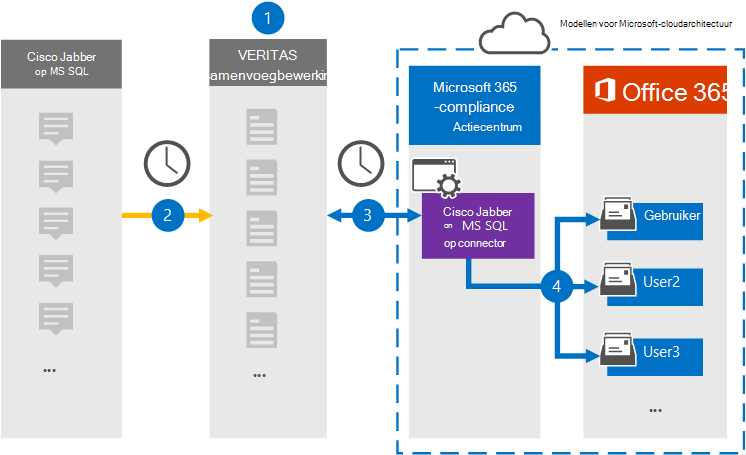

# Een connector instellen voor het archiveren van Cisco Jabber op MS-SQL gegevensSet up a connector to archive Cisco Jabber on MS SQL data

Gebruik een Veritas-connector in het Microsoft 365 compliancecentrum om gegevens van het Cisco Jabber-platform te importeren en te archiveren in gebruikerspostvakken in uw Microsoft 365 organisatie.Use a Veritas connector in the Microsoft 365 compliance center to import and archive data from the Cisco Jabber platform to user mailboxes in your Microsoft 365 organization. Veritas biedt u een [Cisco Jabber-connector](https://globanet.com/jabber/) die is geconfigureerd om items uit de MS-SQL Database van Jabber vast te leggen, zoals 1:1 chatberichten en groepschats en vervolgens deze items te importeren in Microsoft 365.Veritas provides you with a [Cisco Jabber](https://globanet.com/jabber/) connector that is configured to capture items from the Jabber's MS SQL Database, such as 1:1 chat messages and group chats and then import those items to Microsoft 365. De connector haalt gegevens op uit de MS-SQL Database van Cisco Jabber, verwerkt deze en converteert de inhoud van het Cisco Jabber-account van een gebruiker naar een e-mailberichtindeling en importeert deze items vervolgens in het postvak van de gebruiker in Microsoft 365.The connector retrieves data from the Cisco Jabber's MS SQL Database, processes it, and the converts the content from a user's Cisco Jabber account to an email message format and then imports those items to the user's mailbox in Microsoft 365.

Nadat Cisco Jabber-gegevens zijn opgeslagen in gebruikerspostvakken, kunt u Microsoft 365 compliancefuncties toepassen, zoals Litigation Hold, eDiscovery, bewaarbeleid en bewaarlabels en communicatie compliance.After Cisco Jabber data is stored in user mailboxes, you can apply Microsoft 365 compliance features such as Litigation Hold, eDiscovery, retention policies and retention labels, and communication compliance. Als u een Cisco Jabber-connector gebruikt voor het importeren en archiveren van gegevens in Microsoft 365 kan uw organisatie voldoen aan overheids- en regelgevingsbeleid.Using a Cisco Jabber connector to import and archive data in Microsoft 365 can help your organization stay compliant with government and regulatory policies.

## Overzicht van het archiveren van Cisco Jabber-gegevensOverview of archiving Cisco Jabber data

In het volgende overzicht wordt uitgelegd hoe u een connector gebruikt om Cisco Jabber te archiveren op MS-SQL gegevens in Microsoft 365.The following overview explains the process of using a connector to archive Cisco Jabber on MS SQL data in Microsoft 365.

1. Uw organisatie werkt samen met Cisco om een Cisco Jabber op MS-SQL Database.Your organization works with Cisco to set up and configure a Cisco Jabber on MS SQL Database.

2. Eenmaal per 24 uur worden Cisco Jabber-items gekopieerd van de MS-SQL Database naar de Veritas Merge1-site.Once every 24 hours, Cisco Jabber items are copied from the MS SQL Database to the Veritas Merge1 site. De connector converteert ook de inhoud van chatberichten naar een e-mailberichtindeling.The connector also converts the content of chat messages to an email message format.

3. De Cisco Jabber-connector die u in het Microsoft 365-compliancecentrum maakt, maakt elke dag verbinding met de Veritas Merge1-site en draagt de items over naar een veilige Azure Storage locatie in de Microsoft-cloud.The Cisco Jabber connector that you create in the Microsoft 365 compliance center connects to the Veritas Merge1 site every day and transfers the items to a secure Azure Storage location in the Microsoft cloud.

4. De automatische gebruikerstoewijzing als verbindingslijn importeert items naar de postvakken van specifieke gebruikers met behulp van de waarde van de eigenschap *E-mail* van de beschreven in [stap 3.](#step-3-map-users-and-complete-the-connector-setup)The automatic user mapping as connector imports items to the mailboxes of specific users by using the value of the *Email* property of the described in [Step 3](#step-3-map-users-and-complete-the-connector-setup). Een submap in de map Postvak IN met de naam **Cisco Jabber** op MS SQL wordt gemaakt in de postvakken van de gebruiker en de berichtitems worden geïmporteerd in die map.A subfolder in the Inbox folder named **Cisco Jabber on MS SQL** is created in the user mailboxes, and the message items are imported to that folder. De verbindingslijn bepaalt in welk postvak items moeten worden geïmporteerd met behulp van de waarde van de eigenschap *E-mail.*The connector determines which mailbox to import items to by using the value of the *Email* property. Elk Cisco Jabber-item bevat deze eigenschap, die wordt gevuld met het e-mailadres van elke deelnemer.Every Cisco Jabber item contains this property, which is populated with the email address of every participant.

## Voordat u begintBefore you begin

- Maak een Veritas Merge1-account voor Microsoft-connectors.Create a Veritas Merge1 account for Microsoft connectors. Neem contact op met [Veritas Customer Support](https://www.veritas.com/content/support/)om dit account te maken.To create this account, contact [Veritas Customer Support](https://www.veritas.com/content/support/). U meld u aan bij dit account wanneer u de verbindingslijn maakt in stap 1.You will sign into this account when you create the connector in Step 1.

- Stel een MS-SQL Database in om Jabber-items op te halen voordat u de verbindingslijn maakt in stap 1.Set up an MS SQL Database to retrieve Jabber items from before creating the connector in Step 1. U geeft de verbindingsinstellingen voor de MS-SQL Database bij het configureren van de Cisco Jabber-connector in stap 2.You will specify the connection settings for the MS SQL Database when configuring the Cisco Jabber connector in Step 2. Zie de gebruikershandleiding Connectors van derden [samenvoegen1 voor meer informatie.](https://docs.ms.merge1.globanetportal.com/Merge1%20Third-Party%20Connectors%20Cisco%20Jabber%20on%20MS%20SQL%20User%20Guide%20.pdf)For more information, see the [Merge1 Third-Party Connectors User Guide](https://docs.ms.merge1.globanetportal.com/Merge1%20Third-Party%20Connectors%20Cisco%20Jabber%20on%20MS%20SQL%20User%20Guide%20.pdf).

- De gebruiker die de Cisco Jabber-connector maakt in stap 1 (en deze voltooit in stap 3), moet worden toegewezen aan de rol Postvak importeren exporteren in Exchange Online.The user who creates the Cisco Jabber connector in Step 1 (and completes it in Step 3) must be assigned to the Mailbox Import Export role in Exchange Online. Deze rol is vereist om verbindingslijnen toe te voegen op de pagina **Gegevensconnectors** in het Microsoft 365 compliancecentrum.This role is required to add connectors on the **Data connectors** page in the Microsoft 365 compliance center. Deze rol is standaard niet toegewezen aan een rollengroep in Exchange Online.By default, this role is not assigned to a role group in Exchange Online. U kunt de rol Postvak importeren exporteren toevoegen aan de rollengroep Organisatiebeheer in Exchange Online.You can add the Mailbox Import Export role to the Organization Management role group in Exchange Online. U kunt ook een rollengroep maken, de rol Postvak importeren exporteren toewijzen en vervolgens de juiste gebruikers toevoegen als leden.Or you can create a role group, assign the Mailbox Import Export role, and then add the appropriate users as members. Zie de secties  Rollengroepen  maken of Rollengroepen wijzigen in het artikel 'Rollengroepen beheren in Exchange Online'.For more information, see the [Create role groups](/Exchange/permissions-exo/role-groups#create-role-groups) or [Modify role groups](/Exchange/permissions-exo/role-groups#modify-role-groups) sections in the article "Manage role groups in Exchange Online".

## Stap 1: De Cisco Jabber-connector instellen op MS SQL connectorStep 1: Set up the Cisco Jabber on MS SQL connector

De eerste stap is toegang tot de gegevensconnectoren **in** het Microsoft 365 compliancecentrum en een connector maken voor Cisco Jabber op MS-SQL gegevens.The first step is to access to the **Data Connectors** in the Microsoft 365 compliance center and create a connector for Cisco Jabber on MS SQL data.

1. Ga naar [https://compliance.microsoft.com](https://compliance.microsoft.com/) en klik vervolgens op **Gegevensconnectoren**  >  **Cisco Jabber op MS SQL.**Go to [https://compliance.microsoft.com](https://compliance.microsoft.com/)and then click **Data connectors** > **Cisco Jabber on MS SQL**.

2. Klik op **de pagina Cisco Jabber op MS SQL** productbeschrijving op **Verbindingslijn toevoegen.**On the **Cisco Jabber on MS SQL** product description page, click **Add connector**.

3. Klik op **de pagina Servicevoorwaarden** op **Accepteren.**On the **Terms of service** page, click **Accept**.

4. Voer een unieke naam in die de verbindingslijn identificeert en klik vervolgens op **Volgende.**Enter a unique name that identifies the connector and then click **Next**.

5. Meld u aan bij uw Merge1-account om de verbindingslijn te configureren.Sign in to your Merge1 account to configure the connector.

## Stap 2: De Cisco Jabber configureren op MS-SQL op de Veritas Merge1-siteStep 2: Configure the Cisco Jabber on MS SQL connector on the Veritas Merge1 site

De tweede stap is het configureren van de Cisco Jabber op MS-SQL verbindingslijn op de Veritas Merge1-site.The second step is to configure the Cisco Jabber on MS SQL connector on the Veritas Merge1 site. Zie Handleiding Connectors van derden samenvoegen voor meer informatie over het configureren van de Cisco Jabber op [MS-SQL](https://docs.ms.merge1.globanetportal.com/Merge1%20Third-Party%20Connectors%20Cisco%20Jabber%20on%20MS%20SQL%20User%20Guide%20.pdf)connector.For information about how to configure the Cisco Jabber on MS SQL connector, see [Merge1 Third-Party Connectors User Guide](https://docs.ms.merge1.globanetportal.com/Merge1%20Third-Party%20Connectors%20Cisco%20Jabber%20on%20MS%20SQL%20User%20Guide%20.pdf).

Nadat u op **Opslaan &** Voltooien  hebt geklikt, wordt de pagina Gebruikerstoewijzing in de wizard verbindingslijn in het Microsoft 365 compliancecentrum weergegeven.After you click **Save & Finish**, the **User mapping** page in the connector wizard in the Microsoft 365 compliance center is displayed.

## Stap 3: Gebruikers in kaart brengen en de configuratie van de connector voltooienStep 3: Map users and complete the connector setup

Als u gebruikers wilt in kaart brengen en de connector wilt voltooien die is ingesteld in het Microsoft 365 compliancecentrum, volgt u de volgende stappen:To map users and complete the connector set up in the Microsoft 365 compliance center, follow these steps:

1. Schakel op **de pagina Map Cisco Jabber op MS SQL gebruikers** Microsoft 365 gebruikers automatisch gebruikerstoewijzing in.On the **Map Cisco Jabber on MS SQL users to Microsoft 365 users** page, enable automatic user mapping. De Cisco Jabber op MS-SQL items bevatten een eigenschap met de naam E-mail, die e-mailadressen bevat voor gebruikers in uw organisatie.The Cisco Jabber on MS SQL items include a property called *Email*, which contains email addresses for users in your organization. Als de verbindingslijn dit adres kan koppelen aan Microsoft 365 gebruiker, worden de items geïmporteerd in het postvak van die gebruiker.If the connector can associate this address with a Microsoft 365 user, the items are imported to that user’s mailbox.

2. Klik **op Volgende,** bekijk uw instellingen en ga naar de pagina Gegevensconnectors om de voortgang van het importproces voor de nieuwe **verbindingslijn** te bekijken.Click **Next**, review your settings, and go to the **Data connectors** page to see the progress of the import process for the new connector.

## Stap 4: De Cisco Jabber-connector controlerenStep 4: Monitor the Cisco Jabber connector

Nadat u de Cisco Jabber op MS-verbindingslijn SQL, kunt u de connectorstatus bekijken in het Microsoft 365 compliancecentrum.After you create the Cisco Jabber on MS SQL connector, you can view the connector status in the Microsoft 365 compliance center.

1. Ga naar [https://compliance.microsoft.com](https://compliance.microsoft.com) en klik op **Gegevensconnectoren** in het linkernavigatievenster.Go to [https://compliance.microsoft.com](https://compliance.microsoft.com) and click **Data connectors** in the left nav.

2. Klik op **het tabblad Connectors** en selecteer vervolgens de Cisco Jabber op **MS-SQL** om de flyoutpagina weer te geven.Click the **Connectors** tab and then select the **Cisco Jabber on MS SQL** connector to display the flyout page. Deze pagina bevat de eigenschappen en informatie over de verbindingslijn.This page contains the properties and information about the connector.

3. Klik **onder Verbindingsstatus met bron** op de koppeling Logboek **downloaden** om het statuslogboek voor de verbindingslijn te openen (of op te slaan).Under **Connector status with source**, click the **Download log** link to open (or save) the status log for the connector. Dit logboek bevat gegevens die zijn geïmporteerd in de Microsoft-cloud.This log contains data that has been imported to the Microsoft cloud.

## Bekende problemenKnown issues

- Op dit moment bieden we geen ondersteuning voor het importeren van bijlagen of items die groter zijn dan 10 MB.At this time, we don't support importing attachments or items that are larger than 10 MB. Ondersteuning voor grotere items is op een later tijdstip beschikbaar.Support for larger items will be available at a later date.
