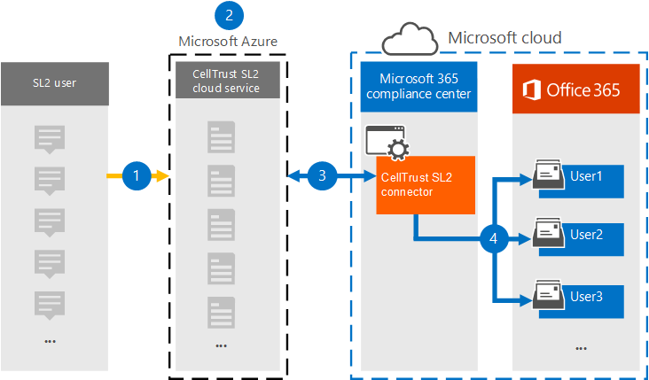

# Gegevens archiveren van CellTrust SL2 naar Microsoft 365

CellTrust SL2 legt mobiele communicatiegegevens vast en integreert met de toonaangevende archiveringstechnologieën om te voldoen aan de vereisten voor elektronische detectie voor regelgeving zoals FINRA, HIPAA, FOIA en TCPA. De SL2 Data Connector importeert mobiele communicatie-items naar Microsoft 365. In dit artikel wordt het proces beschreven voor het integreren van SL2 met Microsoft 365 met behulp van de CellTrust SL2 Data Connector voor archivering. Als u dit proces voltooit, gaat u ervan uit dat u zich hebt geabonneerd op de CellTrust SL2-service en bekend bent met de SL2-architectuur. Zie voor meer informatie over SL2 <www.celltrust.com>.

Nadat gegevens zijn geïmporteerd in gebruikerspostvakken in Microsoft 365, kunt u Microsoft 365 compliancefuncties toepassen, zoals Litigation Hold, eDiscovery, Microsoft 365 bewaarbeleid en communicatie compliance. Met de CellTrust SL2-gegevensconnector voor het importeren en archiveren van gegevens in Microsoft 365 kan uw organisatie voldoen aan overheids- en regelgevingsbeleid.

## Overzicht van archiveren met de CellTrust SL2-gegevensconnector

Het SL2-platform van CellTrust legt communicatiegegevens vast uit meerdere bronnen. SL2-gegevensbronnen zijn person-to-person (P2P) of Application-to-Person (A2P). Het proces dat in dit artikel wordt beschreven, heeft alleen betrekking op P2P-gegevensbronnen. Voor alle P2P-gegevensbronnen is ten minste één partij in de samenwerking een SL2-gebruiker die is geabonneerd op de SL2-service. In het volgende overzicht wordt uitgelegd hoe het gebruik van de CellTrust SL2-gegevensconnector in Microsoft 365.

1. SL2-gebruikers verzenden en ontvangen gegevens van en naar SL2-services in de Microsoft Azure cloud.

2. Uw organisatie heeft een SL2-domein in de SL2 Cloud Service-omgeving van CellTrust. Uw domein kan een of meer organisatie-eenheden (OUs) hebben. De SL2 Cloud Service brengt uw gegevens over naar een zeer veilig gebied in het Microsoft Azure platform, zodat uw gegevens nooit de Microsoft Azure omgeving. Afhankelijk van uw SL2-abonnement (Enterprise, SMB of Government), wordt uw domein gehost op Microsoft Azure Global of Microsoft Azure Government.

3. Nadat u de CellTrust SL2-gegevensconnector, uw domein en OUs (ongeacht uw SL2-abonnement) hebt gemaakt, begint u met het verzenden van gegevens naar Microsoft 365. De gegevensfeed is gestructureerd ter ondersteuning van rapportage op basis van gegevensbronnen, OE's of het domein zelf. Hierdoor heeft uw organisatie slechts één verbindingslijn nodig om al uw gegevensbronnen te Microsoft 365.

4. De verbindingslijn maakt een map onder elke kaartgebruiker met een Office 365 licentie met de titel **CellTrust SL2**. Met deze toewijzing wordt een CellTrust SL2-gebruiker verbonden met een Office 365 postvak met behulp van een e-mailadres. Als een gebruikers-id in CellTrust SL2 geen overeenkomst heeft in Office 365, worden de gegevens van de gebruiker niet gearchiveerd.

## Voordat u een verbindingslijn in stelt

- Controleer of u een domein hebt in de CellTrust SL2-cloudserviceomgeving. Neem contact op met [CellTrust](https://www.celltrust.com/contact-us/#form)voor meer informatie over het verkrijgen van een productie- of proef-SL2-domein.

- Verkrijg de referenties voor toegang tot het beheerdersaccount voor uw SL2-domein.

- De gebruiker die de gegevensconnector CellTrust SL2 maakt in stap 1 (en deze voltooit in stap 3), moet worden toegewezen aan de rol Postvak importeren exporteren in Exchange Online. Deze rol is vereist om verbindingslijnen toe te voegen op de pagina **Gegevensconnectors** in de Microsoft 365-compliancecentrum. Deze rol is standaard niet toegewezen aan een rollengroep in Exchange Online. U kunt de rol Postvak importeren exporteren toevoegen aan de rollengroep Organisatiebeheer in Exchange Online. U kunt ook een rollengroep maken, de rol Postvak importeren exporteren toewijzen en vervolgens de juiste gebruikers toevoegen als leden. Zie de secties  Rollengroepen  maken of Rollengroepen wijzigen in het artikel 'Rollengroepen beheren in Exchange Online'.

## Stap 1: Een CellTrust SL2-connector maken

De eerste stap is het maken van een gegevensconnector in de Microsoft 365-compliancecentrum.

1. Ga naar <https://compliance.microsoft.com> en klik op **Gegevensconnectoren** in het linkernavigatiedeelvenster.

2. Klik op **het** tabblad Overzicht op **Filteren** en selecteer **Op CellTrust** en pas het filter toe.

   

3. Klik **op CellTrust SL2 (voorbeeld).**

4. Klik op **de pagina CellTrust SL2 (preview)** op **Verbindingslijn toevoegen.**

5. Klik op **de pagina Servicevoorwaarden** op **Accepteren.**

6. Voer een unieke naam in die de verbindingslijn identificeert en klik vervolgens op **Volgende.** De naam die u opteert, identificeert de verbindingslijn op de pagina **Gegevensconnectors** nadat u deze hebt gemaakt.

7. Klik op **de pagina Aanmelden bij uw CellTrust-account** op Aanmelden bij **CellTrust.** U wordt omgeleid naar de **CellTrust-portal** voor Microsoft 365 in een nieuw browservenster.

## Stap 2: Selecteer de domeinen of OE's die u wilt archiveren

De volgende stap is om u aan te melden bij een beheerdersaccount voor uw CellTrust SL2-domein en de domeinen en OUs te selecteren die u wilt archiveren in Microsoft 365.

1. Selecteer op de pagina CellTrust **Microsoft 365 Connector** uw omgeving in de SL2-cloudservice om een aanmeldingspagina weer te geven.

   Meestal ziet u één optie voor uw omgeving. Als u echter domeinen in meerdere omgevingen hebt, ziet u opties voor elke omgeving. Nadat u een selectie hebt gemaakt, wordt u omgeleid naar de aanmeldingspagina SL2.

2. Meld u aan met uw domein- ofoubeheerdersaccountreferenties.

   Als u zich als SL2-domeinbeheerder aan melden, ziet u de naam van uw domein en de OUs in dat domein. Als u geen OUs hebt, ziet u alleen de naam van uw domein. Als u zich aanmeldt als OU-beheerder, ziet u alleen de naam van uwou.

3. Schakel de bedrijfseenheden in die u wilt archiveren. Als u het domein selecteert, worden de OUs niet automatisch geselecteerd. U moet elkeou afzonderlijk inschakelen om deze te archiveren.

   

4. Wanneer u klaar bent met uw selecties, sluit u het browservenster en gaat u terug naar de wizardpagina in Microsoft 365-compliancecentrum. Na enkele seconden gaat de wizard automatisch verder met de volgende stap voor het toewijzen van gebruikers.

## Stap 3: Gebruikers in kaart brengen en de configuratie van de connector voltooien

De laatste stap is het in kaart brengen van gebruikers en het voltooien van de configuratie van de verbindingslijn in de Microsoft 365-compliancecentrum.

1. Selecteer op **de pagina Gebruikerstoewijzing** de optie **Automatische** gebruikerstoewijzing inschakelen als het e-mailadres voor gebruikers hetzelfde is in zowel SL2 als Microsoft 365. Anders moet u handmatig e-mailadressen van gebruikers gebruiken door een CSV-bestand te uploaden dat het SL2-adres van gebruikers toewijst aan hun Microsoft 365 adres.

2. Klik **op Volgende,** bekijk de instellingen en klik vervolgens **op Voltooien** om de verbindingslijn te maken.

   De nieuwe verbindingslijn wordt toegevoegd aan de lijst op de **pagina Gegevensconnectors.**

## Hulp krijgen van CellTrust

Zie de [pagina Customer Support van CellTrust](https://www.celltrust.com/contact-us/#support) voor meer informatie over het contact opnemen met CellTrust voor hulp bij het instellen van een CellTrust SL2-gegevensconnector.

## Meer informatie

- Een domeinbeheerder kan een verbindingslijn instellen voor het domein of een OUs in dat domein. Als u het account van de OU-beheerder gebruikt, kunt u alleen een verbindingslijn instellen voor die specifiekeou.

- Als u de bovenstaande stappen wilt voltooien, moet u een licentie Microsoft 365 E5 en de juiste beheerdersrechten Microsoft Office hebben.

- Als u de nieuwe verbindingslijn wilt testen, verzendt u een sms-bericht met uw mobiele SL2-app of vanuit uw SL2-portal. Ga naar uw Microsoft 365 postvak en open de **map CellTrust SL2** in uw Postvak IN. Het kan enkele minuten duren voordat de tekstberichten in uw postvak worden gevonden.

- Voor veel wetten en voorschriften moet elektronische communicatie zo worden bewaard dat deze op verzoek als bewijs kan worden geproduceerd. Elektronische detectie (eDiscovery) wordt gebruikt om te voldoen aan de productie van elektronische communicatie. EIA-oplossingen (Enterprise Information Archiving) zijn ontworpen voor het uitvoeren van eDiscovery en bieden functies zoals bewaarbeleidsbeheer, gegevensclassificatie en toezicht op inhoud. Microsoft 365 biedt een langetermijnbewaringsoplossing voor naleving van de voorschriften en standaarden die van invloed zijn op uw organisatie.

- De term *archivering zoals* in dit document wordt gebruikt, verwijst naar archivering in de context van gebruik binnen een enterprise information archiving (EIA) oplossing. EIA-oplossingen bevatten eDiscovery-functies waarmee documenten worden geproduceerd voor juridische procedures, rechtszaken, audits en onderzoeken. Archiveren in de context van back-up en herstel die wordt gebruikt voor herstel na nood en bedrijfscontinuïteit is niet het beoogde gebruik van de term in dit document.
