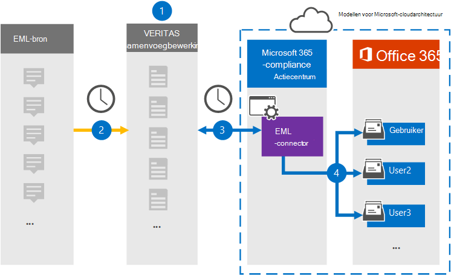

# Een verbindingslijn instellen voor het archiveren van EML-gegevens

Gebruik een Veritas-connector in het Microsoft 365 compliancecentrum om EML-gegevens te importeren en te archiveren naar postvakken van gebruikers in uw Microsoft 365 organisatie. EML is de bestandsextensie voor een e-mailbericht dat is opgeslagen in een bestand. De verbindingslijn converteert de inhoud van een item vanuit de bronindeling naar een e-mailberichtindeling en importeert het item vervolgens naar een gebruikerspostvak.

Nadat EML-berichten zijn opgeslagen in postvakken van gebruikers, kunt u Microsoft 365 compliancefuncties toepassen, zoals Litigation Hold, eDiscovery en bewaarbeleid en bewaarlabels. Als u een EML-connector gebruikt om gegevens te importeren en te archiveren in Microsoft 365 kan uw organisatie voldoen aan overheids- en regelgevingsbeleid.

## Overzicht van het archiveren van EML-gegevens

In het volgende overzicht wordt uitgelegd hoe het gebruik van een verbindingslijn voor het archiveren van EML-gegevens in Microsoft 365.

1. Uw organisatie werkt met de EML-bron om een EML-site in te stellen en te configureren.

2. Elke 24 uur worden inhoudsitems uit de EML-bron gekopieerd naar de Veritas Merge1-site. Tijdens dit proces wordt de inhoud van een EML-bestand geconverteerd naar een e-mailberichtindeling.

3. De EML-connector die u maakt in het Microsoft 365 compliancecentrum, maakt elke dag verbinding met de Veritas Merge1-site en brengt de berichten over naar een veilige Azure Storage-locatie in de Microsoft-cloud.

4. De connector importeert de geconverteerde berichtitems naar de postvakken van specifieke gebruikers met behulp van de waarde van de eigenschap *E-mail* van het automatische gebruikerstoewijzingsproces dat wordt beschreven in [stap 3.](#step-3-map-users-and-complete-the-connector-setup) Tijdens dit proces wordt een submap in de map Postvak IN met de naam **EML** gemaakt in de postvakken van de gebruiker en worden de EML-items geïmporteerd in die map. De verbindingslijn bepaalt in welk postvak items moeten worden geïmporteerd met behulp van de waarde van de eigenschap *E-mail.* Elk bericht bevat deze eigenschap, die wordt gevuld met het e-mailadres van elke deelnemer aan het inhoudsitem.

## Voordat u begint

- Maak een Veritas Merge1-account voor Microsoft-connectors. Neem contact op met [Veritas Customer Support](https://globanet.com/ms-connectors-contact)om een account te maken. U meld u aan bij dit account wanneer u de verbindingslijn maakt in stap 1.

- De gebruiker die de EML-connector maakt in stap 1 (en deze voltooit in stap 3), moet worden toegewezen aan de rol Postvak importeren exporteren in Exchange Online. Deze rol is vereist om verbindingslijnen toe te voegen op de pagina **Gegevensconnectors** in het Microsoft 365 compliancecentrum. Deze rol is standaard niet toegewezen aan een rollengroep in Exchange Online. U kunt de rol Postvak importeren exporteren toevoegen aan de rollengroep Organisatiebeheer in Exchange Online. U kunt ook een rollengroep maken, de rol Postvak importeren exporteren toewijzen en vervolgens de juiste gebruikers toevoegen als leden. Zie de secties  Rollengroepen  maken of Rollengroepen wijzigen in het artikel 'Rollengroepen beheren in Exchange Online'.

## Stap 1: Een EML-connector instellen

De eerste stap is toegang tot de pagina Gegevensconnectoren in het Microsoft 365 compliancecentrum en een **verbindingslijn** maken voor EML-gegevens.

1. Ga naar [https://compliance.microsoft.com](https://compliance.microsoft.com/) en klik vervolgens op **Gegevensconnectoren**  >  **EML**.

2. Klik op **de pagina EML-productbeschrijving** op **Verbindingslijn toevoegen.**

3. Klik op **de pagina Servicevoorwaarden** op **Accepteren.**

4. Voer een unieke naam in die de verbindingslijn identificeert en klik vervolgens op **Volgende.**

5. Meld u aan bij uw Merge1-account om de verbindingslijn te configureren.

## Stap 2: De EML-connector configureren op de Veritas Merge1-site

De tweede stap is het configureren van de EML-connector op de Veritas Merge1-site. Zie Gebruikershandleiding voor [connectors](https://docs.ms.merge1.globanetportal.com/Merge1%20Third-Party%20Connectors%20EML%20User%20Guide%20.pdf)van derden samenvoegen voor informatie over het configureren van de EML-connector.

Nadat u op **Opslaan &** Voltooien  hebt geklikt, wordt de pagina Gebruikerstoewijzing in de wizard verbindingslijn in het Microsoft 365 compliancecentrum weergegeven.

## Stap 3: Gebruikers in kaart brengen en de configuratie van de connector voltooien

Als u gebruikers wilt in kaart brengen en de configuratie van de verbindingslijn wilt voltooien in het Microsoft 365 compliancecentrum, volgt u de volgende stappen:

1. Schakel op **de pagina Externe gebruikers toewijzen Microsoft 365 gebruikers in,** automatische gebruikerstoewijzing in. De EML-bronitems bevatten een eigenschap *met* de naam E-mail, die e-mailadressen bevat voor gebruikers in uw organisatie. Als de verbindingslijn dit adres kan koppelen aan Microsoft 365 gebruiker, worden de EML-items geïmporteerd in het postvak van die gebruiker.

2. Klik **op Volgende,** controleer uw instellingen en ga naar de pagina Gegevensconnectors om de voortgang van het importproces voor de nieuwe **verbindingslijn** te bekijken.

## Stap 4: De EML-connector controleren

Nadat u de EML-verbindingslijn hebt maken, kunt u de verbindingslijnstatus bekijken in het Microsoft 365 compliancecentrum.

1. Ga naar [https://compliance.microsoft.com](https://compliance.microsoft.com) en klik op **Gegevensconnectoren** in het linkernavigatievenster.

2. Klik op **het tabblad Verbindingslijnen** en selecteer vervolgens de **EML-verbindingslijn** om de flyoutpagina weer te geven. Deze pagina bevat de eigenschappen en informatie over de verbindingslijn.

3. Klik **onder Verbindingsstatus met bron** op de koppeling Logboek **downloaden** om het statuslogboek voor de verbindingslijn te openen (of op te slaan). Dit logboek bevat informatie over de gegevens die zijn geïmporteerd in de Microsoft-cloud.

## Bekende problemen

- Op dit moment bieden we geen ondersteuning voor het importeren van bijlagen of items die groter zijn dan 10 MB. Ondersteuning voor grotere items is op een later tijdstip beschikbaar.