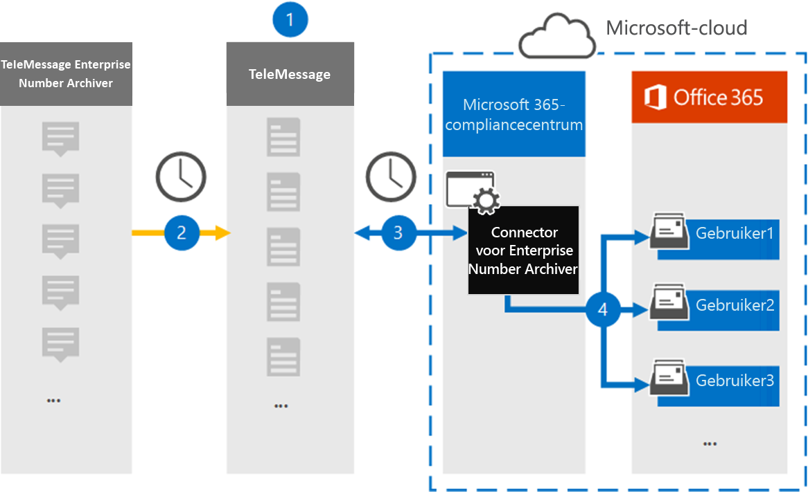

# Een verbindingslijn instellen voor het archiveren van enterprisenummergegevens

Gebruik een TeleMessage-verbindingslijn in het Microsoft 365 compliancecentrum om berichten, chatberichten, spraakopnamen en voicemaillogboeken Sms te importeren en te archiveren vanuit de Enterprise Number Archiver. Nadat u een verbindingslijn hebt ingesteld en geconfigureerd, wordt er eenmaal per dag verbinding gemaakt met het TeleMessage-account van uw organisatie en worden de mobiele communicatiegegevens van werknemers die de TeleMessage Enterprise Number Archiver gebruiken, geïmporteerd in postvakken in Microsoft 365.

Nadat de gegevens van de TeleMessage Enterprise Number Archiver-connector zijn opgeslagen in postvakken van gebruikers, kunt u Microsoft 365 compliancefuncties zoals Litigation Hold, Content Search, In-Place Archiving, Auditing, Communicatie compliance en Microsoft 365 bewaarbeleid toepassen op Enterprise Number Archiver-gegevens. U kunt bijvoorbeeld zoeken in de TeleMessage Enterprise Number Archiver Sms, MMS en Voice Call met Inhoud zoeken of het postvak met de connectorgegevens van de Enterprise Number Archiver koppelen aan een bewaarder in een Advanced eDiscovery geval. Als u een enterprise number archiver-connector gebruikt om gegevens te importeren en te archiveren in Microsoft 365 kan uw organisatie voldoen aan overheids- en regelgevingsbeleid.

## Overzicht van het archiveren van enterprisenummergegevens

In het volgende overzicht wordt uitgelegd hoe het gebruik van een connector voor het archiveren van Enterprise Network-gegevens in Microsoft 365.

1. Uw organisatie werkt met TeleMessage om een connector voor het archiveren van ondernemingsnummer in te stellen. Zie hier voor meer [informatie.](https://www.telemessage.com/office365-activation-for-enterprise-number-archiver/)

2. De connector Enterprise Number Archiver die u maakt in het Microsoft 365 compliancecentrum maakt elke dag verbinding met de TeleMessage-site en draagt de e-mailberichten van de afgelopen 24 uur over naar een beveiligd Azure Storage-gebied in de Microsoft Cloud.

3. De verbindingslijn importeert de mobiele communicatie-items naar het postvak van een specifieke gebruiker. Er wordt een nieuwe map met de naam Enterprise Number Archiver gemaakt in het postvak van de specifieke gebruiker en de items worden er in geïmporteerd. De verbindingslijn wordt toegewezen met behulp van de waarde van de eigenschap *E-mailadres van de* gebruiker. Elk e-mailbericht bevat deze eigenschap, die wordt gevuld met het e-mailadres van elke deelnemer van het e-mailbericht. Naast automatische gebruikerstoewijzing met  de waarde van de eigenschap E-mailadres van de gebruiker, kunt u ook een aangepaste toewijzing definiëren door een CSV-toewijzingsbestand te uploaden. Dit toewijzingsbestand moet het mobiele nummer van de gebruiker en het bijbehorende Microsoft 365 postvak voor elke gebruiker bevatten. Als u automatische gebruikerstoewijzing inschakelen en een aangepaste toewijzing biedt, wordt voor elk e-mailitem eerst naar aangepast toewijzingsbestand gekijken. Als er geen geldige Microsoft 365 wordt gevonden die overeenkomt met het mobiele nummer van een gebruiker, gebruikt de verbindingslijn de eigenschap E-mailadres van de gebruiker van het e-mailitem. Als de verbindingslijn geen geldige Microsoft 365-gebruiker vindt in het  aangepaste toewijzingsbestand of de eigenschap van het e-mailadres van het e-mailitem, wordt het item niet geïmporteerd.

## Voordat u een verbindingslijn in stelt

Enkele van de implementatiestappen die nodig zijn voor het archiveren van enterprise number archiver-gegevens zijn extern Microsoft 365 en moeten zijn voltooid voordat u de verbindingslijn in het compliancecentrum kunt maken.

- Bestel de [Enterprise Number Archiver-service bij TeleMessage](https://www.telemessage.com/mobile-archiver/order-mobile-archiver-for-o365) en ontvang een geldig beheeraccount voor uw organisatie. U moet zich aanmelden bij dit account wanneer u de verbindingslijn maakt in het compliancecentrum.

- Registreer alle gebruikers die enterprise number Sms/MMS Network archiveren in het TeleMessage-account. Wanneer u gebruikers registreert, moet u hetzelfde e-mailadres gebruiken dat wordt gebruikt voor hun Microsoft 365 account.

- Installeer en activeer de app TeleMessage Enterprise Number Archiver op de mobiele telefoons van uw werknemers.

- De gebruiker die een connector voor het archiveren van ondernemingsnummer maakt, moet de rol Postvak importeren exporteren in Exchange Online. Dit is vereist om verbindingslijnen toe te voegen op de pagina **Gegevensconnectors** in het Microsoft 365 compliancecentrum. Deze rol is standaard niet toegewezen aan een rollengroep in Exchange Online. U kunt de rol Postvak importeren exporteren toevoegen aan de rollengroep Organisatiebeheer in Exchange Online. U kunt ook een rollengroep maken, de rol Postvak importeren exporteren toewijzen en vervolgens de juiste gebruikers toevoegen als leden. Zie de secties  Rollengroepen  maken of Rollengroepen wijzigen in het artikel 'Rollengroepen beheren in Exchange Online'.

- Deze gegevensconnector is beschikbaar in GCC omgevingen in de Microsoft 365 amerikaanse overheidscloud. Toepassingen en services van derden kunnen betrekking hebben op het opslaan, verzenden en verwerken van klantgegevens van uw organisatie op systemen van derden die buiten de Microsoft 365-infrastructuur vallen en daarom niet worden gedekt door de toezeggingen van Microsoft 365 compliance en gegevensbescherming. Microsoft geeft niet aan dat het gebruik van dit product om verbinding te maken met toepassingen van derden betekent dat deze toepassingen van derden compatibel zijn met FEDRAMP.

## Een connector voor het archiveren van ondernemingsnummer maken

Nadat u de vereisten hebt voltooid die in de vorige sectie zijn beschreven, kunt u een connector voor het archiveren van ondernemingsnummer maken in het Microsoft 365 compliancecentrum. De verbindingslijn gebruikt de gegevens die u verstrekt om verbinding te maken met de TeleMessage-site en om Sms, MMS en voicemailberichten over te brengen naar de bijbehorende postvakken van gebruikerspostvakken in Microsoft 365.

1. Ga naar [https://compliance.microsoft.com](https://compliance.microsoft.com/) en klik vervolgens op **Gegevensconnectoren** \> **Enterprise Number Archiver**.

2. Klik op **de pagina Productbeschrijving ondernemingsnummerarchief** op **Verbindingslijn toevoegen**

3. Klik op **de pagina Servicevoorwaarden** op **Accepteren.**

4. Voer op de pagina Aanmelden bij **TeleMessage** onder Stap 3 de vereiste informatie in de volgende vakken in en klik vervolgens op **Volgende**.

   - **Gebruikersnaam:** Uw TeleMessage-gebruikersnaam.

   - **Wachtwoord:** Uw TeleMessage-wachtwoord.

5. Nadat de verbindingslijn is gemaakt, kunt u het pop-upvenster sluiten en naar de volgende pagina gaan.

6. Schakel op **de pagina Gebruikerstoewijzing** automatische gebruikerstoewijzing in. Als u aangepaste toewijzing wilt inschakelen, uploadt u een CSV-bestand dat de gebruikerstoewijzingsgegevens bevat en klikt u vervolgens op **Volgende.**

7. Controleer de instellingen en klik vervolgens op **Voltooien om** de verbindingslijn te maken.

8. Ga naar het tabblad Connectors op de pagina **Gegevensconnectors** om de voortgang van het importproces voor de nieuwe verbindingslijn te bekijken.

## Bekende problemen

- Op dit moment bieden we geen ondersteuning voor het importeren van bijlagen of items die groter zijn dan 10 MB. Ondersteuning voor grotere items is op een later tijdstip beschikbaar.