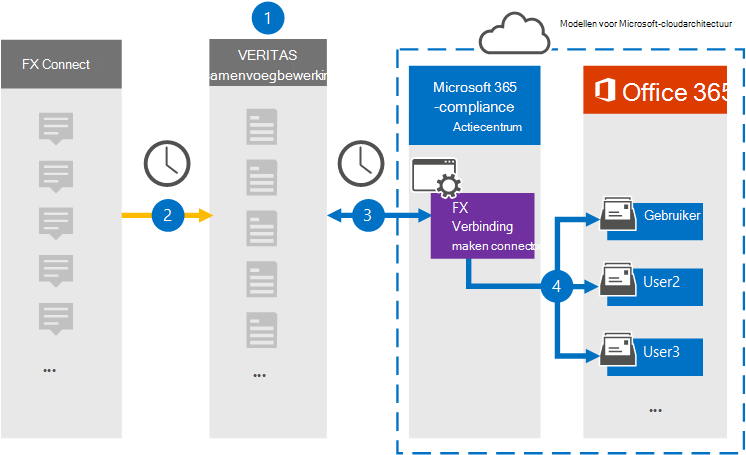

# Een connector instellen voor het archiveren van FX-Verbinding maken gegevens

Gebruik een Veritas-connector in het Microsoft 365 compliancecentrum om gegevens van het FX-Verbinding maken-samenwerkingsplatform te importeren en te archiveren naar postvakken van gebruikers in uw Microsoft 365 organisatie. Veritas biedt een [FX Verbinding maken](https://globanet.com/fx-connect/) connector die is geconfigureerd om FX-Verbinding maken vast te leggen en deze items te importeren in Microsoft 365. De connector converteert de inhoud van FX Verbinding maken, zoals transacties, berichten en andere gegevens uit het FX Verbinding maken-account van uw organisatie, naar een e-mailberichtindeling en importeert deze items vervolgens in het postvak van de gebruiker in Microsoft 365.

Nadat FX-Verbinding maken gegevens zijn opgeslagen in postvakken van gebruikers, kunt u Microsoft 365 compliancefuncties toepassen, zoals Litigation Hold, eDiscovery, bewaarbeleid en bewaarlabels en communicatie compliance. Als u een FX-Verbinding maken gebruikt om gegevens in Microsoft 365 te importeren en te archiveren, kan uw organisatie voldoen aan het overheids- en regelgevingsbeleid.

## Overzicht van het archiveren van FX-Verbinding maken gegevens

In het volgende overzicht wordt uitgelegd hoe u een verbindingslijn gebruikt om de FX-Verbinding maken te archiveren in Microsoft 365.

1. Uw organisatie werkt samen met FX Verbinding maken om een FX-Verbinding maken in te stellen en te configureren.

2. Eens in de 24 uur worden items Verbinding maken FX-accounts gekopieerd naar de Veritas Merge1-site. De connector converteert ook de FX-Verbinding maken items naar een e-mailberichtindeling.

3. De FX Verbinding maken-connector die u maakt in het Microsoft 365-compliancecentrum, maakt elke dag verbinding met de Veritas Merge1-site en draagt de FX-Verbinding maken-items over naar een veilige Azure Storage-locatie in de Microsoft-cloud.

4. De connector importeert items naar de postvakken van specifieke gebruikers met behulp van de waarde van de eigenschap *E-mail* van de automatische gebruikerstoewijzing, zoals beschreven in [stap 3.](#step-3-map-users-and-complete-the-connector-setup) Een submap in de map Postvak IN met **de naam FX Verbinding maken** wordt gemaakt in de postvakken van de gebruiker en de items worden geïmporteerd in die map. De verbindingslijn doet dit met behulp van de waarde van de eigenschap *E-mail.* Elk FX-Verbinding maken bevat deze eigenschap, die wordt gevuld met het e-mailadres van elke deelnemer van het item.

## Voordat u begint

- Maak een Veritas Merge1-account voor Microsoft-connectors.  Neem contact op met [Veritas Customer Support](https://globanet.com/ms-connectors-contact)om een account te maken. U meld u aan bij dit account wanneer u de verbindingslijn maakt in stap 1.

- De gebruiker die de FX-Verbinding maken maakt in stap 1 (en deze voltooit in stap 3), moet worden toegewezen aan de rol Postvak importeren exporteren in Exchange Online. Deze rol is vereist om verbindingslijnen toe te voegen op de pagina **Gegevensconnectors** in het Microsoft 365 compliancecentrum. Deze rol is standaard niet toegewezen aan een rollengroep in Exchange Online. U kunt de rol Postvak importeren exporteren toevoegen aan de rollengroep Organisatiebeheer in Exchange Online. U kunt ook een rollengroep maken, de rol Postvak importeren exporteren toewijzen en vervolgens de juiste gebruikers toevoegen als leden. Zie de secties  Rollengroepen  maken of Rollengroepen wijzigen in het artikel 'Rollengroepen beheren in Exchange Online'.

## Stap 1: de FX-verbindingslijn Verbinding maken instellen

De eerste stap is toegang tot de pagina Gegevensconnectoren in het Microsoft 365 compliancecentrum en een **verbindingslijn** maken voor FX-Verbinding maken gegevens.

1. Ga naar [https://compliance.microsoft.com](https://compliance.microsoft.com/) en klik vervolgens op Data **connectors**  >  **FX Verbinding maken.**

2. Klik op **de pagina FX Verbinding maken** productbeschrijving op **Verbindingslijn toevoegen.**

3. Klik op **de pagina Servicevoorwaarden** op **Accepteren.**

4. Voer een unieke naam in die de verbindingslijn identificeert en klik vervolgens op **Volgende.**

5. Meld u aan bij uw Merge1-account om de verbindingslijn te configureren.

## Stap 2: De FX-Verbinding maken configureren op de Veritas Merge1-site

De tweede stap is het configureren van de FX-Verbinding maken verbindingslijn op de site Samenvoegen1. Zie Handleiding Connectors van derden samenvoegen voor meer informatie over het configureren van de [FX-Verbinding maken](https://docs.ms.merge1.globanetportal.com/Merge1%20Third-Party%20Connectors%20FX%20Connect%20User%20Guide%20.pdf)connector.

Nadat u op **Opslaan &** Voltooien  hebt geklikt, wordt de pagina Gebruikerstoewijzing in de wizard verbindingslijn in het Microsoft 365 compliancecentrum weergegeven.

## Stap 3: Gebruikers in kaart brengen en de configuratie van de connector voltooien

Als u gebruikers wilt in kaart brengen en de configuratie van de verbindingslijn wilt voltooien in het Microsoft 365 compliancecentrum, volgt u de volgende stappen:

1. Schakel op **de pagina Map FX Verbinding maken gebruikers** automatisch toewijzen Microsoft 365 gebruikers in. De FX Verbinding maken items bevatten een eigenschap met de naam E-mail, die e-mailadressen bevat voor gebruikers in uw organisatie. Als de verbindingslijn dit adres kan koppelen aan Microsoft 365 gebruiker, worden de items geïmporteerd in het postvak van die gebruiker.

2. Klik **op Volgende,** controleer uw instellingen en ga naar de pagina Gegevensconnectors om de voortgang van het importproces voor de nieuwe **verbindingslijn** te bekijken.

## Stap 4: De FX-verbindingslijn Verbinding maken controleren

Nadat u de FX-verbindingslijn Verbinding maken, kunt u de connectorstatus bekijken in het Microsoft 365 compliancecentrum.

1. Ga naar <https://compliance.microsoft.com/> en klik op **Gegevensconnectoren** in het linkernavigatievenster.

2. Klik op **het tabblad Verbindingslijnen** en selecteer vervolgens de **FX-Verbinding maken** verbindingslijn om de flyoutpagina weer te geven. Deze pagina bevat de eigenschappen en informatie over de verbindingslijn.

3. Klik **onder Verbindingsstatus met bron** op de koppeling Logboek **downloaden** om het statuslogboek voor de verbindingslijn te openen (of op te slaan). Dit logboek bevat gegevens die zijn geïmporteerd in de Microsoft-cloud.

## Bekende problemen

- Op dit moment bieden we geen ondersteuning voor het importeren van bijlagen of items die groter zijn dan 10 MB. Ondersteuning voor grotere items is op een later tijdstip beschikbaar.