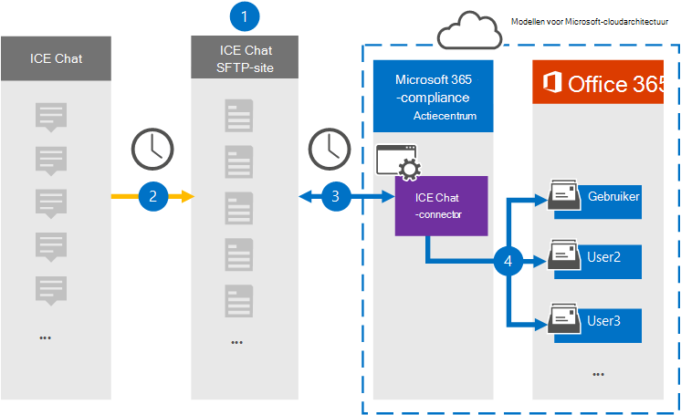
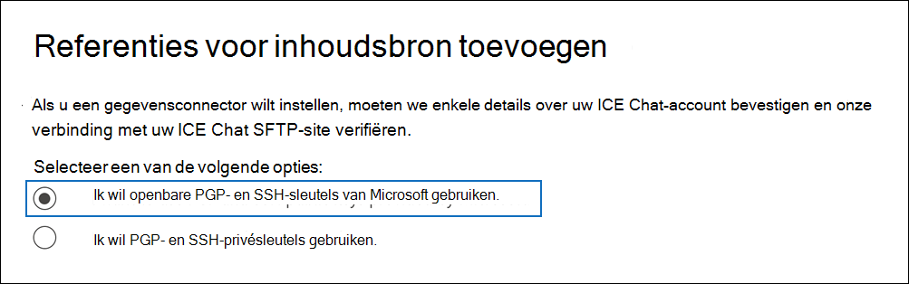
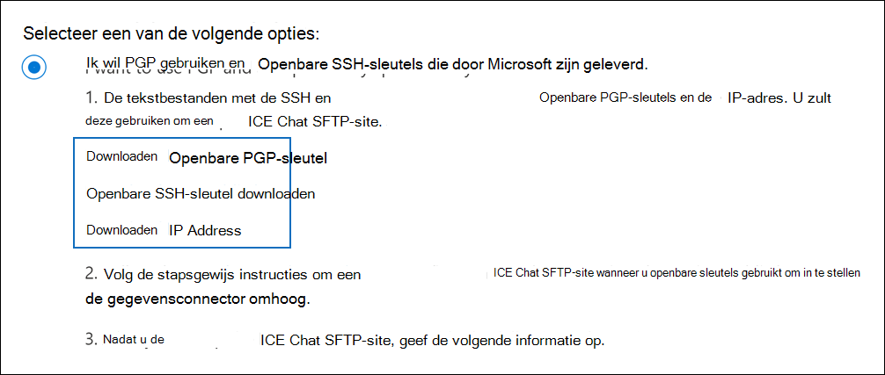
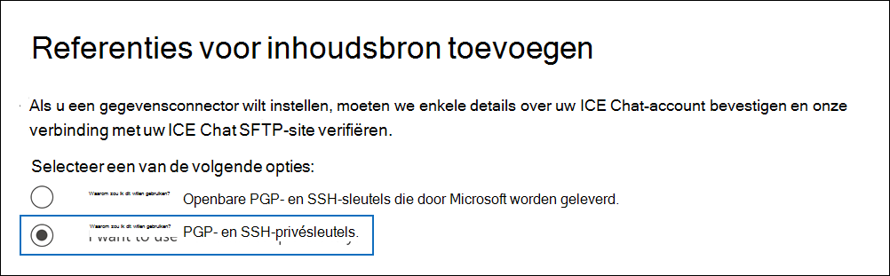
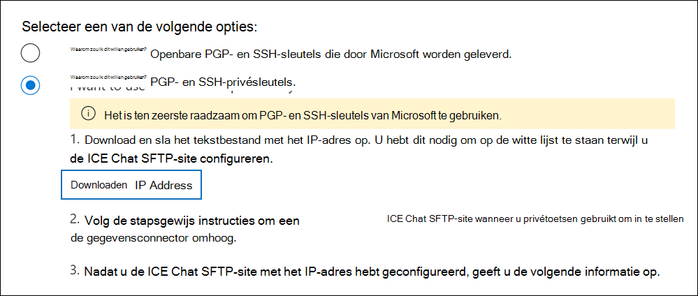

# Een connector instellen voor het archiveren van ICE Chat-gegevensSet up a connector to archive ICE Chat data

Gebruik een native connector in het Microsoft 365 compliancecentrum om chatgegevens van financiële services te importeren en te archiveren vanuit het samenwerkingshulpmiddel ICE Chat.Use a native connector in the Microsoft 365 compliance center to import and archive financial services chat data from the ICE Chat collaboration tool. Nadat u een verbindingslijn hebt ingesteld en geconfigureerd, maakt deze eenmaal per dag verbinding met de SFTP-site (ICE Chat secure FTP) van uw organisatie, converteert u de inhoud van chatberichten naar een e-mailberichtindeling en importeert u deze items vervolgens in postvakken in Microsoft 365.After you set up and configure a connector, it connects to your organization's ICE Chat secure FTP (SFTP) site once every day, converts the content of chat messages to an email message format, and then import those items to mailboxes in Microsoft 365.

Nadat ICE-chatgegevens zijn opgeslagen in gebruikerspostvakken, kunt u Microsoft 365 compliancefuncties zoals bewaring van rechtszaken, eDiscovery, archiveren, auditing, communicatie compliance en Microsoft 365 bewaarbeleid toepassen op ICE Chat-gegevens.After ICE chat data is stored in user mailboxes, you can apply Microsoft 365 compliance features such as litigation hold, eDiscovery, archiving, auditing, communication compliance, and Microsoft 365 retention policies to ICE Chat data. U kunt bijvoorbeeld zoeken in ICE Chat-berichten met inhoud zoeken of het postvak met de ICE Chat-gegevens koppelen aan een bewaarder in een Advanced eDiscovery geval.For example, you can search ICE Chat messages using content search or associate the mailbox that contains the ICE Chat data with a custodian in an Advanced eDiscovery case. Als u een ICE Chat-connector gebruikt om gegevens te importeren en te archiveren in Microsoft 365 kan uw organisatie voldoen aan overheids- en regelgevingsbeleid.Using an ICE Chat connector to import and archive data in Microsoft 365 can help your organization stay compliant with government and regulatory policies.

## Overzicht van het archiveren van ICE Chat-gegevensOverview of archiving ICE Chat data

In het volgende overzicht wordt uitgelegd hoe u een verbindingslijn gebruikt om ICE-chatgegevens te archiveren in Microsoft 365.The following overview explains the process of using a connector to archive ICE chat data in Microsoft 365.

1. Uw organisatie werkt samen met ICE Chat om een ICE Chat SFTP-site in te stellen.Your organization works with ICE Chat to set up an ICE Chat SFTP site. U werkt ook met ICE Chat om ICE Chat te configureren om chatberichten te kopiëren naar uw ICE Chat SFTP-site.You'll also work with ICE Chat to configure ICE Chat to copy chat messages to your ICE Chat SFTP site.

2. Elke 24 uur worden chatberichten van ICE Chat gekopieerd naar uw ICE Chat SFTP-site.Once every 24 hours, chat messages from ICE Chat are copied to your ICE Chat SFTP site.

3. De ICE Chat-connector die u maakt in het Microsoft 365 compliancecentrum maakt elke dag verbinding met de ICE Chat SFTP-site en brengt de chatberichten van de afgelopen 24 uur over naar een veilige Azure Storage-locatie in de Microsoft-cloud.The ICE Chat connector that you create in the Microsoft 365 compliance center connects to the ICE Chat SFTP site every day and transfers the chat messages from the previous 24 hours to a secure Azure Storage location in the Microsoft cloud. De connector converteert ook de inhoud van een chat masseerfunctie naar een e-mailberichtindeling.The connector also converts the content of a chat massage to an email message format.

4. De connector importeert chatberichten naar de postvakken van specifieke gebruikers.The connector imports chat message items to the mailboxes of specific users. Er wordt een nieuwe map met de naam **ICE Chat** gemaakt in de postvakken van de gebruiker en de chatberichten worden geïmporteerd in die map.A new folder named **ICE Chat** is created in the user mailboxes and the chat message items are imported to that folder. De verbindingslijn gebruikt de waarde van de eigenschappen *SenderEmail* *en RecipientEmail.*The connector does by using the value of the *SenderEmail* and *RecipientEmail* properties. Elk chatbericht bevat deze eigenschappen, die worden ingevuld met het e-mailadres van de afzender en elke geadresseerde/deelnemer van het chatbericht.Every chat message contains these properties, which are populated with email address of the sender and every recipient/participant of the chat message.

   Naast automatische gebruikerstoewijzing waarbij de waarden van de eigenschap *SenderEmail* en *RecipientEmail* worden gebruikt (wat betekent dat de connector een chatbericht importeert naar het postvak van de afzender en de postvakken van elke geadresseerde), kunt u ook aangepaste gebruikerstoewijzing definiëren door een CSV-toewijzingsbestand te uploaden.In addition to automatic user mapping that uses the values of the *SenderEmail* and *RecipientEmail* property (which means that the connector imports a chat message to the sender's mailbox and the mailboxes of every recipient), you can also define custom user mapping by uploading a CSV mapping file. Dit toewijzingsbestand bevat de ICE Chat *ImId* en het bijbehorende Microsoft 365 postvak voor elke gebruiker in uw organisatie.This mapping file contains the ICE Chat *ImId* and the corresponding Microsoft 365 mailbox address for every user in your organization. Als u automatische gebruikerstoewijzing inschakelen en een bestand voor aangepaste toewijzing op te geven, wordt voor elk chatitem eerst het bestand voor aangepaste toewijzing door de verbindingslijn verkend.If you enable automatic user mapping and provide a custom-mapping file, for every chat item the connector will first look at the custom-mapping file. Als er geen geldig Microsoft 365-gebruikersaccount wordt gevonden dat overeenkomt met de ICE Chat ImId van een gebruiker, gebruikt de verbindingslijn de eigenschappen *SenderEmail* en *RecipientEmail* van het chatitem om het item te importeren in de postvakken van de chatdeelnemers.If it doesn't find a valid Microsoft 365 user account that corresponds to a user's ICE Chat ImId, the connector will use the *SenderEmail* and *RecipientEmail* properties of the chat item to import the item to the mailboxes of the chat participants. Als de connector geen geldige Microsoft 365 in het bestand voor aangepaste toewijzing of de eigenschappen *SenderEmail* en *RecipientEmail* vindt, wordt het item niet geïmporteerd.If the connector doesn't find a valid Microsoft 365 user in either the custom-mapping file or the *SenderEmail* and *RecipientEmail* properties, the item won't be imported.

## Voordat u een verbindingslijn in steltBefore you set up a connector

Sommige implementatiestappen die nodig zijn om ICE Chat-gegevens te archiveren, zijn extern Microsoft 365 en moeten zijn voltooid voordat u de verbindingslijn in het compliancecentrum kunt maken.Some of the implementation steps required to archive ICE Chat data are external to Microsoft 365 and must be completed before you can create the connector in the compliance center.

- ICE Chat brengt hun klanten kosten in rekening voor externe naleving.ICE Chat charges their customers a fee for external compliance. Uw organisatie moet contact opnemen met de ICE Chat-verkoopgroep om te bespreken en de ICE Chat-gegevensservicesovereenkomst te ondertekenen, die u kunt verkrijgen op [https://www.theice.com/publicdocs/agreements/ICE\_Data\_Services\_Agreement.pdf](https://www.theice.com/publicdocs/agreements/ICE\_Data\_Services\_Agreement.pdf) .Your organization should contact the ICE Chat sales group to discuss, and to sign the ICE Chat data services agreement, which you can obtain at [https://www.theice.com/publicdocs/agreements/ICE\_Data\_Services\_Agreement.pdf](https://www.theice.com/publicdocs/agreements/ICE\_Data\_Services\_Agreement.pdf). Deze overeenkomst is tussen ICE Chat en uw organisatie en heeft geen betrekking op Microsoft.This agreement is between ICE Chat and your organization and does not involve Microsoft. Nadat u een ICE Chat SFTP-site hebt ingesteld in stap 2, biedt ICE Chat de FTP-referenties rechtstreeks aan uw organisatie.After you set up an ICE Chat SFTP site in Step 2, ICE Chat provides the FTP credentials directly to your organization. Vervolgens moet u die referenties aan Microsoft opgeven bij het instellen van de connector in stap 3.Then you who would provide those credentials to Microsoft when setting up the connector in Step 3.

- U moet een ICE Chat SFTP-site instellen voordat u de verbindingslijn maakt in stap 3.You must set up an ICE Chat SFTP site before creating the connector in Step 3. Nadat u met ICE Chat hebt gewerkt om de SFTP-site in te stellen, worden gegevens van ICE Chat elke dag geüpload naar de SFTP-site.After working with ICE Chat to set up the SFTP site, data from ICE Chat is uploaded to the SFTP site every day. De verbindingslijn die u in stap 3 maakt, maakt verbinding met deze SFTP-site en verplaatst de chatgegevens naar Microsoft 365 postvakken.The connector you create in Step 3 connects to this SFTP site and transfers the chat data to Microsoft 365 mailboxes. SFTP versleutelt ook de ICE Chat-gegevens die tijdens het overdrachtsproces naar postvakken worden verzonden.SFTP also encrypts the ICE Chat data that's sent to mailboxes during the transfer process.

- Als u een ICE Chat-connector wilt instellen, moet u toetsen en wachtwoordzinnen gebruiken voor Pretty Good Privacy (PGP) en Secure Shell (SSH).To set up an ICE Chat connector, you have to use keys and key passphrases for Pretty Good Privacy (PGP) and Secure Shell (SSH). Deze sleutels worden gebruikt om de ICE Chat SFTP-site te configureren en worden door de connector gebruikt om verbinding te maken met de ICE Chat SFTP-site om gegevens te importeren in Microsoft 365.These keys are used to configure the ICE Chat SFTP site and used by the connector to connect to the ICE Chat SFTP site to import data to Microsoft 365. De PGP-toets wordt gebruikt om de versleuteling te configureren van gegevens die worden overgebracht van de ICE Chat SFTP-site naar Microsoft 365.The PGP key is used to configure the encryption of data that's transferred from the ICE Chat SFTP site to Microsoft 365. De SSH-toets wordt gebruikt om beveiligde shell te configureren om een veilige externe aanmelding in te stellen wanneer de verbindingslijn verbinding maakt met de ICE Chat SFTP-site.The SSH key is used to configure secure shell to enable a secure remote login when the connector connects to the ICE Chat SFTP site.

  Wanneer u een verbindingslijn instelt, hebt u de optie om openbare sleutels en wachtwoordzinnen van Microsoft te gebruiken of kunt u uw eigen privésleutels en wachtwoordzin gebruiken.When setting up a connector, you have the option to use public keys and key passphrases provided by Microsoft or you can use your own private keys and passphrases. U wordt aangeraden de openbare sleutels van Microsoft te gebruiken.We recommend that you use the public keys provided by Microsoft. Als uw organisatie echter al een ICE Chat SFTP-site heeft geconfigureerd met privésleutels, kunt u een verbindingslijn maken met dezelfde persoonlijke sleutels.However, if your organization has already configured an ICE Chat SFTP site using private keys, then you can create a connector using these same private keys.

- De ICE Chat-connector kan in totaal 200.000 items in één dag importeren.The ICE Chat connector can import a total of 200,000 items in a single day. Als er meer dan 200.000 items op de SFTP-site staan, worden geen van deze items geïmporteerd in Microsoft 365.If there are more than 200,000 items on the SFTP site, none of those items will be imported to Microsoft 365.

- De beheerder die de ICE Chat-connector maakt in stap 3 (en die de openbare sleutels en het IP-adres downloadt in stap 1), moet de rol Postvak importeren exporteren in Exchange Online.The admin who creates the ICE Chat connector in Step 3 (and who downloads the public keys and IP address in Step 1) must be assigned the Mailbox Import Export role in Exchange Online. Deze rol is vereist om verbindingslijnen toe te voegen op de pagina **Gegevensconnectors** in het Microsoft 365 compliancecentrum.This role is required to add connectors on the **Data connectors** page in the Microsoft 365 compliance center. Deze rol is standaard niet toegewezen aan een rollengroep in Exchange Online.By default, this role isn't assigned to any role group in Exchange Online. U kunt de rol Postvak importeren exporteren toevoegen aan de rollengroep Organisatiebeheer in Exchange Online.You can add the Mailbox Import Export role to the Organization Management role group in Exchange Online. U kunt ook een rollengroep maken, de rol Postvak importeren exporteren toewijzen en vervolgens de juiste gebruikers toevoegen als leden.Or you can create a role group, assign the Mailbox Import Export role, and then add the appropriate users as members. Zie de secties  Rollengroepen  maken of Rollengroepen wijzigen in het artikel 'Rollengroepen beheren in Exchange Online'.For more information, see the [Create role groups](/Exchange/permissions-exo/role-groups#create-role-groups) or [Modify role groups](/Exchange/permissions-exo/role-groups#modify-role-groups) sections in the article "Manage role groups in Exchange Online".

## Een verbindingslijn instellen met openbare sleutelsSet up a connector using public keys

In de stappen in deze sectie ziet u hoe u een ICE Chat-connector kunt instellen met de openbare sleutels voor Pretty Good Privacy (PGP) en Secure Shell (SSH).The steps in this section show you how to set up an ICE Chat connector using the public keys for Pretty Good Privacy (PGP) and Secure Shell (SSH).

### Stap 1: Openbare PGP- en SSH-sleutels verkrijgenStep 1: Obtain PGP and SSH public keys

De eerste stap is het verkrijgen van een kopie van de openbare sleutels voor Pretty Good Privacy (PGP) en Secure Shell (SSH).The first step is to obtain a copy of the public keys for Pretty Good Privacy (PGP) and Secure Shell (SSH). U gebruikt deze toetsen in stap 2 om de ICE Chat SFTP-site zo te configureren dat de connector (die u maakt in stap 3) verbinding kan maken met de SFTP-site en de ICE Chat-gegevens kan overbrengen naar Microsoft 365 postvakken.You use these keys in Step 2 to configure the ICE Chat SFTP site to allow the connector (that you create in Step 3) to connect to the SFTP site and transfer the ICE Chat data to Microsoft 365 mailboxes. U krijgt ook een IP-adres in deze stap, dat u gebruikt bij het configureren van de ICE Chat SFTP-site.You will also obtain an IP address in this step, which you use when configuring the ICE Chat SFTP site.

1. Ga naar [https://compliance.microsoft.com](https://compliance.microsoft.com) en klik op **Gegevensconnectoren** in het linkernavigatievenster.Go to [https://compliance.microsoft.com](https://compliance.microsoft.com) and click **Data connectors** in the left nav.

2. Klik op **de pagina Gegevensconnectors** onder **ICE Chat** op **Weergeven.**On the **Data connectors** page under **ICE Chat**, click **View**.

3. Klik op **de pagina ICE-chat** op **Verbindingslijn toevoegen.**On the **ICE Chat** page, click **Add connector**.

4. Klik op **de pagina Servicevoorwaarden** op **Accepteren.**On the **Terms of service** page, click **Accept**.

5. Klik op **de pagina Referenties toevoegen voor inhoudsbron** op Ik wil openbare PGP- en SSH-sleutels van **Microsoft gebruiken.**On the **Add credentials for content source** page, click **I want to use PGP and SSH public keys provided by Microsoft**.

   

6. Klik onder stap 1 op **de SSH-toets** Downloaden, **PGP-toets** downloaden en IP-adreskoppelingen downloaden om een kopie van elk bestand op uw lokale computer op te slaan. Under step 1, click the **Download SSH key**, **Download PGP key**, and **Download IP address** links to save a copy of each file to your local computer.

   

   Deze bestanden bevatten de volgende items die worden gebruikt voor het configureren van de ICE Chat SFTP-site in stap 2:These files contain the following items that are used to configure the ICE Chat SFTP site in Step 2:

   - Openbare PGP-sleutel: deze sleutel wordt gebruikt om de versleuteling te configureren van gegevens die worden overgebracht van de ICE Chat SFTP-site naar Microsoft 365.PGP public key: This key is used to configure the encryption of data that's transferred from the ICE Chat SFTP site to Microsoft 365.

   - Openbare SSH-sleutel: deze sleutel wordt gebruikt om Secure SSH te configureren om een veilige externe aanmelding in te stellen wanneer de verbindingslijn verbinding maakt met de ICE Chat SFTP-site.SSH public key: This key is used to configure Secure SSH to enable a secure remote login when the connector connects to the ICE Chat SFTP site.

   - IP-adres: De ICE Chat SFTP-site is geconfigureerd om alleen een verbindingsaanvraag te accepteren vanaf dit IP-adres, dat wordt gebruikt door de ICE Chat-connector die u maakt in stap 3.IP address: The ICE Chat SFTP site is configured to accept a connection request only from this IP address, which is used by the ICE Chat connector that you create in Step 3.

7. Klik **op Annuleren** om de wizard te sluiten.Click **Cancel** to close the wizard. U gaat terug naar deze wizard in stap 3 om de verbindingslijn te maken.You come back to this wizard in Step 3 to create the connector.

### Stap 2: De ICE Chat SFTP-site configurerenStep 2: Configure the ICE Chat SFTP site

De volgende stap is het gebruik van de openbare PGP- en SSH-sleutels en het IP-adres dat u hebt verkregen in stap 1 om PGP-versleuteling en SSH-verificatie te configureren voor de ICE Chat SFTP-site.The next step is to use the PGP and SSH public keys and the IP address that you obtained in Step 1 to configure PGP encryption and SSH authentication for the ICE Chat SFTP site. Hierdoor kan de ICE Chat-connector die u maakt in stap 3 verbinding maken met de ICE Chat SFTP-site en ICE Chat-gegevens overbrengen naar Microsoft 365.This lets the ICE Chat connector that you create in Step 3 connect to the ICE Chat SFTP site and transfer ICE Chat data to Microsoft 365. U moet samenwerken met de klantenondersteuning van ICE Chat om uw ICE Chat SFTP-site in te stellen.You need to work with ICE Chat customer support to set up your ICE Chat SFTP site.

### Stap 3: Een ICE-chatconnector makenStep 3: Create an ICE Chat connector

De laatste stap is het maken van een ICE Chat-connector in het Microsoft 365 compliancecentrum.The last step is to create an ICE Chat connector in the Microsoft 365 compliance center. De connector gebruikt de informatie die u verstrekt om verbinding te maken met de ICE Chat SFTP-site en chatberichten over te brengen naar de bijbehorende postvakken van gebruikers in Microsoft 365.The connector uses the information you provide to connect to the ICE Chat SFTP site and transfer chat messages to the corresponding user mailbox boxes in Microsoft 365.

1. Ga naar [https://compliance.microsoft.com](https://compliance.microsoft.com) en klik op **Gegevensconnectoren** in het linkernavigatievenster.Go to [https://compliance.microsoft.com](https://compliance.microsoft.com) and click **Data connectors** in the left nav.

2. Klik op **de pagina Gegevensconnectors** onder **ICE Chat** op **Weergeven.**On the **Data connectors** page under **ICE Chat**, click **View**.

3. Klik op **de pagina ICE-chat** op **Verbindingslijn toevoegen.**On the **ICE Chat** page, click **Add connector**.

4. Klik op **de pagina Servicevoorwaarden** op **Accepteren.**On the **Terms of service** page, click **Accept**.

5. Klik op **de pagina Referenties toevoegen voor inhoudsbron** op Ik wil openbare PGP- en **SSH-sleutels gebruiken.**On the **Add credentials for content source** page, click **I want to use PGP and SSH public keys**.

6. Voer onder Stap 3 de vereiste gegevens in de volgende vakken in en klik vervolgens **op Verbinding valideren**.Under Step 3, enter the required information in the following boxes and then click **Validate connection**.

   - **Vaste code:** De id voor uw organisatie, die wordt gebruikt als gebruikersnaam voor de ICE Chat SFTP-site.**Firm code:** The ID for your organization, which is used as the username for the ICE Chat SFTP site.

   - **Wachtwoord:** Het wachtwoord voor uw ICE Chat SFTP-site.**Password:** The password for your ICE Chat SFTP site.

   - **SFTP-URL:** De URL voor de ICE Chat SFTP-site `sftp.theice.com` (bijvoorbeeld).**SFTP URL:** The URL for the ICE Chat SFTP site (for example, `sftp.theice.com`). U kunt ook een IP-adres voor deze waarde gebruiken.You can also use an IP address for this value.

   - **SFTP-poort:** Het poortnummer voor de ICE Chat SFTP-site.**SFTP port:** The port number for the ICE Chat SFTP site. De verbindingslijn gebruikt deze poort om verbinding te maken met de SFTP-site.The connector uses this port to connect to the SFTP site.

7. Nadat de verbinding is gevalideerd, klikt u op **Volgende.**After the connection is successfully validated, click **Next**.

8. Schakel op **de pagina Externe gebruikers toewijzen Microsoft 365 gebruikers in,** schakel automatische gebruikerstoewijzing in en geef zo nodig aangepaste gebruikerstoewijzing.On the **Map external users to Microsoft 365 users** page, enable automatic user mapping and provide custom user mapping as required. U kunt een kopie van het CSV-bestand voor gebruikerstoewijzing downloaden op deze pagina.You can download a copy of the user-mapping CSV file on this page. U kunt de gebruikerstoewijzingen aan het bestand toevoegen en vervolgens uploaden.You can add the user mappings to the file and then upload it.

   > [!NOTE]
   > Zoals eerder uitgelegd, bevat het CSV-bestand met aangepaste toewijzingsbestand de ICE Chat imid en het bijbehorende postvakadres Microsoft 365 elke gebruiker.As previously explained, custom mapping file CSV file contains the ICE Chat imid and corresponding Microsoft 365 mailbox address for each user. Als u automatische gebruikerstoewijzing inschakelen en een aangepaste toewijzing biedt, wordt in de verbindingslijn voor elk chatitem eerst naar aangepast toewijzingsbestand gekijken.If you enable automatic user mapping and provide a custom mapping, for every chat item, the connector will first look at custom mapping file. Als er geen geldige Microsoft 365-gebruiker wordt gevonden die overeenkomt met de ICE Chat-imid van een gebruiker, importeert de connector het item in de postvakken voor de gebruikers die zijn opgegeven in de eigenschappen *SenderEmail* en *RecipientEmail* van het chatitem.If it doesn't find a valid Microsoft 365 user that corresponds to a user's ICE Chat imid, the connector will import the item to the mailboxes for the users specified in the *SenderEmail* and *RecipientEmail* properties of the chat item. Als de connector geen geldige gebruiker Microsoft 365 door automatische of aangepaste gebruikerstoewijzing, wordt het item niet geïmporteerd.If the connector doesn't find a valid Microsoft 365 user by either automatic or custom user mapping, the item won't be imported.

9. Klik **op Volgende,** bekijk de instellingen en klik vervolgens **op Voltooien** om de verbindingslijn te maken.Click **Next**, review your settings, and then click **Finish** to create the connector.

10. Ga naar de **pagina Gegevensconnectors** om de voortgang van het importproces voor de nieuwe verbindingslijn te bekijken.Go to the **Data connectors** page to see the progress of the import process for the new connector.

## Een verbindingslijn instellen met behulp van persoonlijke sleutelsSet up a connector using private keys

In de stappen in deze sectie ziet u hoe u een ICE Chat-connector kunt instellen met PGP- en SSH-privétoetsen.The steps in this section show you how to set up an ICE Chat connector using PGP and SSH private keys. Deze optie voor het instellen van verbindingslijnen is bedoeld voor organisaties die al een ICE Chat SFTP-site hebben geconfigureerd met behulp van persoonlijke sleutels.This connector setup option is intended for organizations that have already configured an ICE Chat SFTP site using private keys.

### Stap 1: Een IP-adres verkrijgen om de ICE Chat SFTP-site te configurerenStep 1: Obtain an IP address to configure the ICE Chat SFTP site

Als uw organisatie PGP- en SSH-privésleutels heeft gebruikt om een ICE Chat SFTP-site in te stellen, moet u een IP-adres verkrijgen en dit opgeven bij de klantenondersteuning van ICE Chat.If your organization has used PGP and SSH private keys to set up an ICE Chat SFTP site, then you have to obtain an IP address and provide it to ICE Chat customer support. De ICE Chat SFTP-site moet zijn geconfigureerd voor het accepteren van verbindingsaanvragen vanaf dit IP-adres.The ICE Chat SFTP site must be configured to accept  connection requests from this IP address. Hetzelfde IP-adres wordt gebruikt door de ICE Chat-connector om verbinding te maken met de SFTP-site en ICE Chat-gegevens over te brengen naar Microsoft 365.The same IP address is used by the ICE Chat connector to connect to the SFTP site and transfer ICE Chat data to Microsoft 365.

Het IP-adres verkrijgen:To obtain the IP address:

1. Ga naar <https://compliance.microsoft.com> en klik op **Gegevensconnectoren** in het linkernavigatievenster.Go to <https://compliance.microsoft.com> and click **Data connectors** in the left nav.

2. Klik op **de pagina Gegevensconnectors** onder **ICE Chat** op **Weergeven.**On the **Data connectors** page under **ICE Chat**, click **View**.

3. Klik op **de pagina ICE Chat-productbeschrijving** op **Verbindingslijn toevoegen**On the **ICE Chat** product description page, click **Add connector**

4. Klik op **de pagina Servicevoorwaarden** op **Accepteren.**On the **Terms of service** page, click **Accept**.

5. Klik op **de pagina Referenties toevoegen voor inhoudsbron** op Ik wil PGP- en **SSH-persoonlijke** sleutels gebruiken.On the **Add credentials for content source** page, click **I want to use PGP and SSH private keys**.

   

6. Klik onder stap 1 op **IP-adres downloaden** om een kopie van het IP-adresbestand op uw lokale computer op te slaan.Under step 1, click **Download IP address** to save a copy of the IP address file to your local computer.

   

7. Klik **op Annuleren** om de wizard te sluiten.Click **Cancel** to close the wizard. U gaat terug naar deze wizard in stap 2 om de verbindingslijn te maken.You come back to this wizard in Step 2 to create the connector.

U moet werken met de klantenondersteuning van ICE Chat om uw ICE Chat SFTP-site te configureren om verbindingsaanvragen te accepteren vanaf dit IP-adres.You need to work with ICE Chat customer support to configure your ICE Chat SFTP site to accept connection requests from this IP address.

### Stap 2: Een ICE Chat-connector makenStep 2: Create an ICE Chat connector

Nadat uw ICE Chat SFTP-site is geconfigureerd, is de volgende stap het maken van een ICE Chat-connector in het Microsoft 365 compliancecentrum.After your ICE Chat SFTP site is configured, the next step is to create an ICE Chat connector in the Microsoft 365 compliance center. De connector gebruikt de informatie die u verstrekt om verbinding te maken met de ICE Chat SFTP-site en e-mailberichten over te brengen naar de bijbehorende postvakken van gebruikers in Microsoft 365.The connector uses the information you provide to connect to the ICE Chat SFTP site and transfer email messages to the corresponding user mailbox boxes in Microsoft 365. Als u deze stap wilt voltooien, moet u kopieën hebben van dezelfde privésleutels en wachtwoordzinnen die u hebt gebruikt om uw ICE Chat SFTP-site in te stellen.To complete this step, be sure to have copies of the same private keys and key passphrases that you used to set up your ICE Chat SFTP site.

1. Ga naar <https://compliance.microsoft.com> en klik op **Gegevensconnectoren** in het linkernavigatievenster.Go to <https://compliance.microsoft.com> and click **Data connectors** in the left nav.

2. Klik op **de pagina Gegevensconnectors** onder **ICE Chat** op **Weergeven.**On the **Data connectors** page under **ICE Chat**, click **View**.

3. Klik op **de pagina ICE Chat-productbeschrijving** op **Verbindingslijn toevoegen**On the **ICE Chat** product description page, click **Add connector**

4. Klik op **de pagina Servicevoorwaarden** op **Accepteren.**On the **Terms of service** page, click **Accept**.

5. Klik op **de pagina Referenties toevoegen voor inhoudsbron** op Ik wil PGP- en **SSH-persoonlijke** sleutels gebruiken.On the **Add credentials for content source** page, click **I want to use PGP and SSH private keys**.

6. Voer onder Stap 3 de vereiste gegevens in de volgende vakken in en klik vervolgens **op Verbinding valideren**.Under Step 3, enter the required information in the following boxes and then click **Validate connection**.

      - **Naam:** De naam voor de verbindingslijn.**Name:** The name for the connector. Deze moet uniek zijn in uw organisatie.It must be unique in your organization.

      - **Vaste code:** De id voor uw organisatie die wordt gebruikt als gebruikersnaam voor de ICE Chat SFTP-site.**Firm code:** The ID for your organization that is used as the username for the ICE Chat SFTP site.

      - **Wachtwoord:** Het wachtwoord voor de ICE Chat SFTP-site van uw organisatie.**Password:** The password for your organization's ICE Chat SFTP site.

      - **SFTP-URL:** De URL voor de ICE Chat SFTP-site `sftp.theice.com` (bijvoorbeeld).**SFTP URL:** The URL for the ICE Chat SFTP site (for example, `sftp.theice.com`). U kunt ook een IP-adres voor deze waarde gebruiken.You can also use an IP address for this value.

      - **SFTP-poort:** Het poortnummer voor de ICE Chat SFTP-site.**SFTP port:** The port number for the ICE Chat SFTP site. De verbindingslijn gebruikt deze poort om verbinding te maken met de SFTP-site.The connector uses this port to connect to the SFTP site.

      - **PGP-privésleutel:** De persoonlijke PGP-sleutel voor de ICE Chat SFTP-site.**PGP private key:** The PGP private key for the ICE Chat SFTP site. Zorg ervoor dat u de volledige persoonlijke sleutelwaarde op moet nemen, inclusief de begin- en eindlijnen van het sleutelblok.Be sure to include the entire private key value, including the beginning and ending lines of the key block.

      - **Wachtwoordzin PGP-toets:** De wachtwoordzin voor de persoonlijke PGP-sleutel.**PGP key passphrase:** The passphrase for the PGP private key.

      - **SSH-privésleutel:** De SSH-privésleutel voor de ICE Chat SFTP-site.**SSH private key:** The SSH private key for the ICE Chat SFTP site. Zorg ervoor dat u de volledige persoonlijke sleutelwaarde op moet nemen, inclusief de begin- en eindlijnen van het sleutelblok.Be sure to include the entire private key value, including the beginning and ending lines of the key block.

      - **SSH-toets passphrase:** De wachtwoordzin voor de SSH-privésleutel.**SSH key passphrase:** The passphrase for the SSH private key.

7. Nadat de verbinding is gevalideerd, klikt u op **Volgende.**After the connection is successfully validated, click **Next**.

8. Schakel op **de pagina ICE Chat-gebruikers** toewijzen Microsoft 365 gebruikers automatisch toewijzen in en geef zo nodig aangepaste gebruikerstoewijzing aan.On the **Map ICE Chat users to Microsoft 365 users** page, enable automatic user mapping and provide custom user mapping as required.

   > [!NOTE]
   > Zoals eerder uitgelegd, bevat het CSV-bestand met aangepaste toewijzingsbestand de ICE Chat imid en het bijbehorende postvakadres Microsoft 365 elke gebruiker.As previously explained, custom mapping file CSV file contains the ICE Chat imid and corresponding Microsoft 365 mailbox address for each user. Als u automatische gebruikerstoewijzing inschakelen en een aangepaste toewijzing biedt, wordt in de verbindingslijn voor elk chatitem eerst naar aangepast toewijzingsbestand gekijken.If you enable automatic user mapping and provide a custom mapping, for every chat item, the connector will first look at custom mapping file. Als er geen geldige Microsoft 365-gebruiker wordt gevonden die overeenkomt met de ICE Chat-imid van een gebruiker, importeert de connector het item in de postvakken voor de gebruikers die zijn opgegeven in de eigenschappen *SenderEmail* en *RecipientEmail* van het chatitem.If it doesn't find a valid Microsoft 365 user that corresponds to a user's ICE Chat imid, the connector will import the item to the mailboxes for the users specified in the *SenderEmail* and *RecipientEmail* properties of the chat item. Als de connector geen geldige gebruiker Microsoft 365 door automatische of aangepaste gebruikerstoewijzing, wordt het item niet geïmporteerd.If the connector doesn't find a valid Microsoft 365 user by either automatic or custom user mapping, the item won't be imported.

9. Klik **op Volgende,** bekijk de instellingen en klik vervolgens **op Voltooien** om de verbindingslijn te maken.Click **Next**, review your settings, and then click **Finish** to create the connector.

10. Ga naar de **pagina Gegevensconnectors** om de voortgang van het importproces voor de nieuwe verbindingslijn te bekijken.Go to the **Data connectors** page to see the progress of the import process for the new connector. Klik op de verbindingslijn om de flyoutpagina weer te geven, die informatie over de verbindingslijn bevat.Click the connector to display the flyout page, which contains information about the connector.
