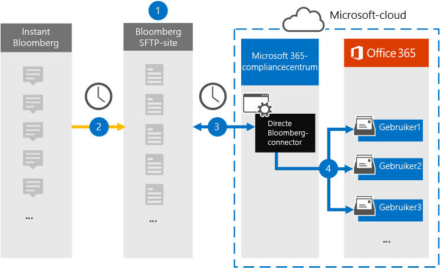
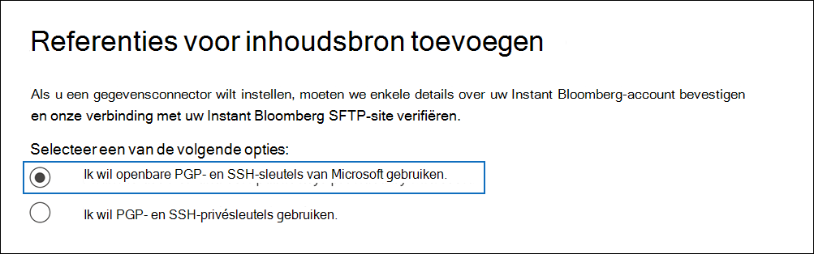
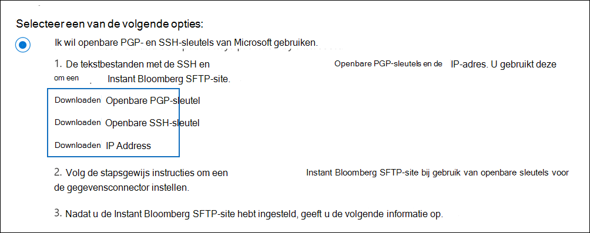
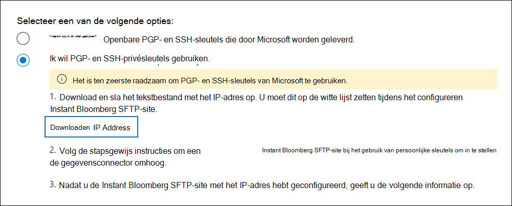

# Een connector instellen voor het archiveren van Instant Bloomberg-gegevens

Gebruik een native connector in het Microsoft 365 compliancecentrum om chatgegevens van financiële services te importeren en te archiveren vanuit het hulpprogramma Voor samenwerking met [Instant Bloomberg.](https://www.bloomberg.com/professional/product/collaboration/) Nadat u een verbindingslijn hebt ingesteld en geconfigureerd, wordt er eenmaal per dag verbinding gemaakt met de beveiligde FTP-site (SFTP) van uw organisatie, wordt de inhoud van chatberichten geconverkeerd naar een e-mailberichtindeling en worden deze items vervolgens geïmporteerd in postvakken in Microsoft 365.

Nadat Instant Bloomberg-gegevens zijn opgeslagen in postvakken van gebruikers, kunt u Microsoft 365 compliancefuncties zoals Litigation Hold, Content Search, In-Place Archiveren, Auditing, Communicatie compliance en Microsoft 365 bewaarbeleid toepassen op Instant Bloomberg-gegevens. U kunt bijvoorbeeld chatten via Chatberichten van Instant Bloomberg zoeken met Inhoud zoeken of het postvak met de Instant Bloomberg-gegevens koppelen aan een bewaarder in een Advanced eDiscovery geval. Met een Instant Bloomberg-connector voor het importeren en archiveren van gegevens in Microsoft 365 kan uw organisatie voldoen aan overheids- en regelgevingsbeleid.

## Overzicht van het archiveren van Instant Bloomberg-gegevens

In het volgende overzicht wordt uitgelegd hoe het gebruik van een verbindingslijn voor het archiveren van chatgegevens van Instant Bloomberg in Microsoft 365. 

1. Uw organisatie werkt samen met Bloomberg om een SFTP-site voor Bloomberg in te stellen. U werkt ook samen met Bloomberg om Instant Bloomberg te configureren om chatberichten te kopiëren naar uw SFTP-site van Bloomberg.

2. Eens in de 24 uur worden chatberichten van Instant Bloomberg gekopieerd naar de SFTP-site van Bloomberg.

3. De Instant Bloomberg-connector die u maakt in het Microsoft 365 compliancecentrum maakt elke dag verbinding met de SFTP-site van Bloomberg en brengt de chatberichten van de afgelopen 24 uur over naar een beveiligd Azure Storage-gebied in de Microsoft Cloud. De connector converteert ook de inhoud van een chat masseerfunctie naar een e-mailberichtindeling.

4. De verbindingslijn importeert de chatberichten naar het postvak van een specifieke gebruiker. Er wordt een nieuwe map met de naam InstantBloomberg gemaakt in het postvak van de specifieke gebruiker en de items worden in het postvak geïmporteerd. De verbindingslijn doet dit met behulp van de waarde van de *eigenschap CorporateEmailAddress.* Elk chatbericht bevat deze eigenschap, die wordt gevuld met het e-mailadres van elke deelnemer aan het chatbericht. Naast automatische gebruikerstoewijzing met de waarde van de *eigenschap CorporateEmailAddress,* kunt u ook een aangepaste toewijzing definiëren door een CSV-toewijzingsbestand te uploaden. Dit toewijzingsbestand moet een UUID van Bloomberg en het bijbehorende Microsoft 365 postvak voor elke gebruiker bevatten. Als u automatische gebruikerstoewijzing inschakelen en een aangepaste toewijzing biedt, wordt in de connector voor elk chatitem eerst naar het bestand voor aangepaste toewijzing gekijken. Als er geen geldige Microsoft 365 wordt gevonden die overeenkomt met de UUID van Bloomberg van een gebruiker, gebruikt de verbindingslijn de eigenschap *CorporateEmailAddress* van het chatitem. Als de connector geen geldige Microsoft 365 gebruiker vindt in het bestand voor aangepaste toewijzing of de eigenschap *CorporateEmailAddress* van het chatitem, wordt het item niet geïmporteerd.

## Voordat u een verbindingslijn in stelt

Sommige implementatiestappen die nodig zijn om Instant Bloomberg-gegevens te archiveren, zijn extern Microsoft 365 en moeten worden voltooid voordat u de verbindingslijn in het compliancecentrum kunt maken.

- Als u een Instant Bloomberg-connector wilt instellen, moet u toetsen en wachtwoordzinnen gebruiken voor Pretty Good Privacy (PGP) en Secure Shell (SSH). Deze sleutels worden gebruikt om de SFTP-site van Bloomberg te configureren en door de connector te gebruiken om verbinding te maken met de SFTP-site van Bloomberg om gegevens te importeren in Microsoft 365. De PGP-toets wordt gebruikt om de versleuteling te configureren van gegevens die worden overgebracht van de SFTP-site van Bloomberg naar Microsoft 365. De SSH-toets wordt gebruikt om secure shell te configureren om een veilige externe aanmelding in te stellen wanneer de verbindingslijn verbinding maakt met de SFTP-site van Bloomberg.

  Wanneer u een verbindingslijn instelt, hebt u de optie om openbare sleutels en wachtwoordzinnen van Microsoft te gebruiken of kunt u uw eigen privésleutels en wachtwoordzin gebruiken. U wordt aangeraden de openbare sleutels van Microsoft te gebruiken. Als uw organisatie echter al een SFTP-site van Bloomberg heeft geconfigureerd met privésleutels, kunt u een verbindingslijn maken met dezelfde persoonlijke sleutels.

- Abonneer u op [Bloomberg Anywhere.](https://www.bloomberg.com/professional/product/remote-access/?bbgsum-page=DG-WS-PROF-PROD-BBA) Dit is vereist, zodat u zich kunt aanmelden bij Bloomberg Anywhere om toegang te krijgen tot de SFTP-site van Bloomberg die u moet instellen en configureren.

- Een SFTP-site (Secure file transfer protocol) instellen. Nadat u met Bloomberg hebt gewerkt om de SFTP-site in te stellen, worden gegevens van Instant Bloomberg elke dag geüpload naar de SFTP-site. De verbindingslijn die u in stap 2 maakt, maakt verbinding met deze SFTP-site en verplaatst de chatgegevens naar Microsoft 365 postvakken. SFTP versleutelt ook de chatgegevens van Instant Bloomberg die tijdens het overdrachtsproces naar postvakken worden verzonden.

  Voor informatie over Bloomberg SFTP (ook wel *BB-SFTP genoemd):*

  - Zie het document 'SFTP Connectivity Standards' bij [Ondersteuning voor Bloomberg.](https://www.bloomberg.com/professional/support/documentation/)

  - Neem contact [op met de klantenondersteuning van Bloomberg.](https://service.bloomberg.com/portal/sessions/new?utm_source=bloomberg-menu&utm_medium=csc)

  Nadat u met Bloomberg hebt gewerkt om een SFTP-site in te stellen, geeft Bloomberg u enkele informatie nadat u hebt gereageerd op het e-mailbericht van de Implementatie van Bloomberg. Sla een kopie van de volgende gegevens op. U gebruikt deze verbindingslijn om een verbindingslijn in te stellen in stap 3.

  - Vaste code, een id voor uw organisatie en wordt gebruikt om u aan te melden bij de SFTP-site van Bloomberg.

  - Wachtwoord voor uw SFTP-site van Bloomberg

  - URL voor De SFTP-site van Bloomberg (bijvoorbeeld sftp.bloomberg.com)

  - Poortnummer voor SFTP-site van Bloomberg

- De Instant Bloomberg-connector kan in totaal 200.000 items in één dag importeren. Als er meer dan 200.000 items op de SFTP-site staan, worden geen van deze items geïmporteerd in Microsoft 365.

- De gebruiker die een Instant Bloomberg-connector maakt in stap 3 (en die de openbare sleutels en het IP-adres downloadt in stap 1), moet de rol Postvak importeren exporteren in Exchange Online. Dit is vereist om verbindingslijnen toe te voegen op de pagina **Gegevensconnectors** in het Microsoft 365 compliancecentrum. Deze rol is standaard niet toegewezen aan een rollengroep in Exchange Online. U kunt de rol Postvak importeren exporteren toevoegen aan de rollengroep Organisatiebeheer in Exchange Online. U kunt ook een rollengroep maken, de rol Postvak importeren exporteren toewijzen en vervolgens de juiste gebruikers toevoegen als leden. Zie de secties  Rollengroepen  maken of Rollengroepen wijzigen in het artikel 'Rollengroepen beheren in Exchange Online'.

## Een verbindingslijn instellen met openbare sleutels

In de stappen in deze sectie ziet u hoe u een Instant Bloomberg-connector kunt instellen met de openbare sleutels voor Pretty Good Privacy (PGP) en Secure Shell (SSH).

### Stap 1: PGP- en SSH- en openbare sleutels verkrijgen

De eerste stap is het verkrijgen van een kopie van de openbare sleutels voor Pretty Good Privacy (PGP) en Secure Shell (SSH). U gebruikt deze sleutels in stap 2 om de SFTP-site van Bloomberg zo te configureren dat de verbindingslijn (die u maakt in stap 3) verbinding kan maken met de SFTP-site en de chatgegevens van Instant Bloomberg kan overbrengen naar Microsoft 365 postvakken. U verkrijgt ook een IP-adres in deze stap, dat u gebruikt bij het configureren van de SFTP-site van Bloomberg.

1. Ga naar <https://compliance.microsoft.com> en klik op **Gegevensconnectoren** in het linkernavigatievenster.

2. Klik op **de pagina Gegevensconnectoren** onder **Instant Bloomberg** op **Weergeven.**

3. Klik op **de pagina Instant Bloomberg-productbeschrijving** op **Verbindingslijn toevoegen**

4. Klik op **de pagina Servicevoorwaarden** op **Accepteren.**

5. Klik op **de pagina Referenties toevoegen voor inhoudsbron** op Ik wil openbare PGP- en SSH-sleutels van **Microsoft gebruiken.**

   

6. Klik onder stap 1 op **de SSH-toets** Downloaden, **PGP-toets** downloaden en IP-adreskoppelingen downloaden om een kopie van elk bestand op uw lokale computer op te slaan. 

   

   Deze bestanden bevatten de volgende items die worden gebruikt om de SFTP-site van Bloomberg in stap 2 te configureren:

   - Openbare PGP-sleutel: deze sleutel wordt gebruikt om de versleuteling te configureren van gegevens die worden overgebracht van de SFTP-site van Bloomberg naar Microsoft 365.

   - Openbare SSH-sleutel: deze sleutel wordt gebruikt om beveiligde shell te configureren om een veilige externe aanmelding in te stellen wanneer de verbindingslijn verbinding maakt met de SFTP-site van Bloomberg.

   - IP-adres: De SFTP-site van Bloomberg is geconfigureerd voor het accepteren van verbindingsaanvragen vanaf dit IP-adres. Hetzelfde IP-adres wordt gebruikt door de Instant Bloomberg-connector om verbinding te maken met de SFTP-site en Instant Bloomberg-gegevens over te brengen naar Microsoft 365.

7. Klik **op Annuleren** om de wizard te sluiten. U gaat terug naar deze wizard in stap 3 om de verbindingslijn te maken.

### Stap 2: De SFTP-site van Bloomberg configureren

De volgende stap is het gebruik van de openbare PGP- en SSH-sleutels en het IP-adres dat u hebt verkregen in stap 1 om PGP-versleuteling en SSH-verificatie te configureren voor de SFTP-site van Bloomberg. Hierdoor kan de Instant Bloomberg-connector die u maakt in stap 3 verbinding maken met de SFTP-site van Bloomberg en Instant Bloomberg-gegevens overbrengen naar Microsoft 365. U moet samenwerken met de klantenondersteuning van Bloomberg om uw SFTP-site voor Bloomberg in te stellen. Neem contact [op met de klantenondersteuning](https://service.bloomberg.com/portal/sessions/new?utm_source=bloomberg-menu&utm_medium=csc) van Bloomberg voor hulp. 

> [!IMPORTANT]
> U wordt aangeraden de drie bestanden die u in stap 1 hebt gedownload, bij te koppelen aan een e-mailbericht en deze te verzenden naar het klantenserviceteam wanneer u met hen werkt om uw SFTP-site van Bloomberg in te stellen.

### Stap 3: Een Instant Bloomberg-connector maken

De laatste stap is het maken van een Instant Bloomberg-connector in het Microsoft 365 compliancecentrum. De connector gebruikt de informatie die u verstrekt om verbinding te maken met de SFTP-site van Bloomberg en chatberichten over te brengen naar de bijbehorende postvakken van gebruikers in Microsoft 365.

1. Ga naar <https://compliance.microsoft.com> en klik vervolgens op **Gegevensconnectoren**  >  **Instant Bloomberg**.

2. Klik op **de pagina Instant Bloomberg-productbeschrijving** op **Verbindingslijn toevoegen**

3. Klik op **de pagina Servicevoorwaarden** op **Accepteren.**

4. Voer op de pagina Referenties toevoegen voor **De SFTP-sitepagina** van Bloomberg onder Stap 3 de vereiste informatie in de volgende vakken in en klik vervolgens op **Volgende**.

    - **Vaste code:** De id voor uw organisatie die wordt gebruikt als gebruikersnaam voor de SFTP-site van Bloomberg.

    - **Wachtwoord:** Wachtwoord voor De SFTP-site van Bloomberg.

    - **SFTP-URL:** De URL voor de SFTP-site van Bloomberg `sftp.bloomberg.com` (bijvoorbeeld). U kunt ook een IP-adres voor deze waarde gebruiken.

    - **SFTP-poort:** Het poortnummer voor de SFTP-site van Bloomberg. De verbindingslijn gebruikt deze poort om verbinding te maken met de SFTP-site.

5. Selecteer op **de pagina Gegevenstypen selecteren** om te importeren de vereiste gegevenstypen die moeten worden geïmporteerd, behalve **Berichten**

6. Schakel op **de pagina Instant Bloomberg-gebruikers** toewijzen Microsoft 365 gebruikers in, schakel automatische gebruikerstoewijzing in en geef zo nodig aangepaste gebruikerstoewijzing aan

   > [!NOTE]
   > De verbindingslijn importeert de chatberichten naar het postvak van een specifieke gebruiker. Er wordt een nieuwe map met de naam **InstantBloomberg** gemaakt in het postvak van de specifieke gebruiker en de items worden in het postvak geïmporteerd. De verbindingslijn gebruikt de waarde van de *eigenschap CorporateEmailAddress.* Elk chatbericht bevat deze eigenschap en de eigenschap wordt gevuld met het e-mailadres van elke deelnemer aan het chatbericht. Naast automatische gebruikerstoewijzing met de waarde van de *eigenschap CorporateEmailAddress,* kunt u ook aangepaste toewijzing definiëren door een CSV-toewijzingsbestand te uploaden. Het toewijzingsbestand moet het UUID-adres van Bloomberg en het bijbehorende Microsoft 365 voor elke gebruiker bevatten. Als u automatische gebruikerstoewijzing inschakelen en een aangepaste toewijzing biedt, wordt voor elk chatitem eerst naar aangepast toewijzingsbestand gekijken. Als er geen geldige Microsoft 365 wordt gevonden die overeenkomt met de UUID van Bloomberg van een gebruiker, gebruikt de verbindingslijn de eigenschap *CorporateEmailAddress* van het chatitem. Als de connector geen geldige Microsoft 365 gebruiker vindt in het aangepaste toewijzingsbestand of de *eigenschap CorporateEmailAddress* van het chatitem, wordt het item niet geïmporteerd.

7. Klik **op Volgende,** bekijk de instellingen en klik vervolgens **op Voltooien** om de verbindingslijn te maken.

8. Ga naar de **pagina Gegevensconnectors** om de voortgang van het importproces voor de nieuwe verbindingslijn te bekijken. Klik op de verbindingslijn om de flyoutpagina weer te geven, die informatie over de verbindingslijn bevat.

## Een verbindingslijn instellen met behulp van persoonlijke sleutels

In de stappen in deze sectie ziet u hoe u een Instant Bloomberg-connector kunt instellen met PGP- en SSH-privétoetsen. Deze optie voor het instellen van verbindingslijnen is bedoeld voor organisaties die al een SFTP-site van Bloomberg hebben geconfigureerd met behulp van privésleutels.

### Stap 1: Een IP-adres verkrijgen om de SFTP-site van Bloomberg te configureren

> [!NOTE]
> Als uw organisatie eerder een SFTP-site van Bloomberg heeft geconfigureerd om Gegevens van Het Bericht van Bloomberg te archiveren met PGP- en SSH-privésleutels, hoeft u geen andere site te configureren. U kunt dezelfde SFTP-site opgeven wanneer u de verbindingslijn maakt in stap 2.

Als uw organisatie PGP- en SSH-privésleutels heeft gebruikt om een SFTP-site van Bloomberg in te stellen, moet u een IP-adres verkrijgen en dit aan de klantenondersteuning van Bloomberg verstrekken. De SFTP-site van Bloomberg moet zijn geconfigureerd om verbindingsaanvragen vanaf dit IP-adres te accepteren. Hetzelfde IP-adres wordt gebruikt door de Instant Bloomberg-connector om verbinding te maken met de SFTP-site en Instant Bloomberg-gegevens over te brengen naar Microsoft 365.

Het IP-adres verkrijgen:

1. Ga naar <https://compliance.microsoft.com> en klik op **Gegevensconnectoren** in het linkernavigatievenster.

2. Klik op **de pagina Gegevensconnectoren** onder **Instant Bloomberg** op **Weergeven.**

3. Klik op **de pagina Instant Bloomberg-productbeschrijving** op **Verbindingslijn toevoegen**

4. Klik op **de pagina Servicevoorwaarden** op **Accepteren.**

5. Klik op **de pagina Referenties toevoegen voor inhoudsbron** op Ik wil PGP- en **SSH-persoonlijke** sleutels gebruiken.

6. Klik onder stap 1 op **IP-adres downloaden** om een kopie van het IP-adresbestand op uw lokale computer op te slaan.

   

7. Klik **op Annuleren** om de wizard te sluiten. U gaat terug naar deze wizard in stap 2 om de verbindingslijn te maken.

U moet samenwerken met de klantenondersteuning van Bloomberg om uw SFTP-site van Bloomberg te configureren om verbindingsaanvragen te accepteren vanaf dit IP-adres. Neem contact [op met de klantenondersteuning](https://service.bloomberg.com/portal/sessions/new?utm_source=bloomberg-menu&utm_medium=csc) van Bloomberg voor hulp.

### Stap 2: Een Instant Bloomberg-connector maken

Nadat uw SFTP-site voor Bloomberg is geconfigureerd, is de volgende stap het maken van een Instant Bloomberg-connector in het Microsoft 365 compliancecentrum. De connector gebruikt de informatie die u verstrekt om verbinding te maken met de SFTP-site van Bloomberg en e-mailberichten over te brengen naar de bijbehorende postvakken van gebruikers in Microsoft 365. Als u deze stap wilt voltooien, moet u kopieën hebben van dezelfde privésleutels en wachtwoordzinnen die u hebt gebruikt om uw SFTP-site van Bloomberg in te stellen.

1. Ga naar <https://compliance.microsoft.com> en klik op **Gegevensconnectoren** in het linkernavigatievenster.

2. Klik op **de pagina Gegevensconnectoren** onder **Instant Bloomberg** op **Weergeven.**

3. Klik op **de pagina Instant Bloomberg-productbeschrijving** op **Verbindingslijn toevoegen**

4. Klik op **de pagina Servicevoorwaarden** op **Accepteren.**

5. Klik op **de pagina Referenties toevoegen voor inhoudsbron** op Ik wil PGP- en **SSH-persoonlijke** sleutels gebruiken.

   

6. Voer onder Stap 3 de vereiste gegevens in de volgende vakken in en klik vervolgens **op Verbinding valideren**.

      - **Naam:** De naam voor de verbindingslijn. Deze moet uniek zijn in uw organisatie.

      - **Vaste code:** De id voor uw organisatie die wordt gebruikt als gebruikersnaam voor de SFTP-site van Bloomberg.

      - **Wachtwoord:** Het wachtwoord voor de SFTP-site van Uw organisatie.

      - **SFTP-URL:** De URL voor de SFTP-site van Bloomberg `sftp.bloomberg.com` (bijvoorbeeld). U kunt ook een IP-adres voor deze waarde gebruiken.

      - **SFTP-poort:** Het poortnummer voor de SFTP-site van Bloomberg. De verbindingslijn gebruikt deze poort om verbinding te maken met de SFTP-site.

      - **PGP-privésleutel:** De PGP-privésleutel voor de SFTP-site van Bloomberg. Zorg ervoor dat u de volledige persoonlijke sleutelwaarde op moet nemen, inclusief de begin- en eindlijnen van het sleutelblok.

      - **Wachtwoordzin PGP-toets:** De wachtwoordzin voor de persoonlijke PGP-sleutel.

      - **SSH-privésleutel:** De SSH-privésleutel voor de SFTP-site van Bloomberg. Zorg ervoor dat u de volledige persoonlijke sleutelwaarde op moet nemen, inclusief de begin- en eindlijnen van het sleutelblok.

      - **SSH-toets passphrase:** De wachtwoordzin voor de SSH-privésleutel.

7. Nadat de verbinding is gevalideerd, klikt u op **Volgende.**

8. Schakel op **de pagina Gebruikers** van Instant Bloomberg toewijzen Microsoft 365 automatische gebruikerstoewijzing in en geef zo nodig aangepaste gebruikerstoewijzing aan.

   > [!NOTE]
   > De verbindingslijn importeert de chatberichten naar het postvak van een specifieke gebruiker. Er wordt een nieuwe map met de naam **InstantBloomberg** gemaakt in het postvak van de specifieke gebruiker en de items worden in het postvak geïmporteerd. De verbindingslijn gebruikt de waarde van de *eigenschap CorporateEmailAddress.* Elk chatbericht bevat deze eigenschap en de eigenschap wordt gevuld met het e-mailadres van elke deelnemer aan het chatbericht. Naast automatische gebruikerstoewijzing met de waarde van de *eigenschap CorporateEmailAddress,* kunt u ook aangepaste toewijzing definiëren door een CSV-toewijzingsbestand te uploaden. Het toewijzingsbestand moet het UUID-adres van Bloomberg en het bijbehorende Microsoft 365 voor elke gebruiker bevatten. Als u automatische gebruikerstoewijzing inschakelen en een aangepaste toewijzing biedt, wordt voor elk chatitem eerst naar aangepast toewijzingsbestand gekijken. Als er geen geldige Microsoft 365 wordt gevonden die overeenkomt met de UUID van Bloomberg van een gebruiker, gebruikt de verbindingslijn de eigenschap *CorporateEmailAddress* van het chatitem. Als de connector geen geldige Microsoft 365 gebruiker vindt in het aangepaste toewijzingsbestand of de *eigenschap CorporateEmailAddress* van het chatitem, wordt het item niet geïmporteerd.

9. Klik **op Volgende,** bekijk de instellingen en klik vervolgens **op Voltooien** om de verbindingslijn te maken.

10. Ga naar de **pagina Gegevensconnectors** om de voortgang van het importproces voor de nieuwe verbindingslijn te bekijken. Klik op de verbindingslijn om de flyoutpagina weer te geven, die informatie over de verbindingslijn bevat.
