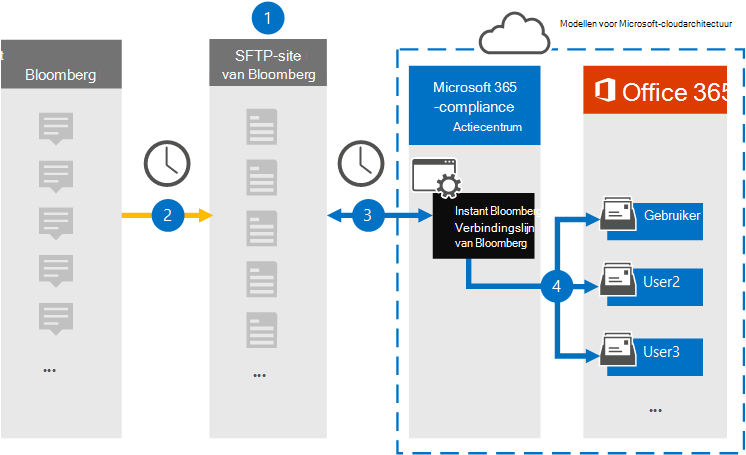

# Een connector instellen voor het archiveren van Instant Bloomberg-gegevensSet up a connector to archive Instant Bloomberg data

Gebruik een native connector in het Microsoft 365 compliancecentrum om chatgegevens van financiële services te importeren en te archiveren vanuit het hulpprogramma Voor samenwerking met [Instant Bloomberg.](https://www.bloomberg.com/professional/product/collaboration/)Use a native connector in the Microsoft 365 compliance center to import and archive financial services chat data from the [Instant Bloomberg](https://www.bloomberg.com/professional/product/collaboration/) collaboration tool. Nadat u een verbindingslijn hebt ingesteld en geconfigureerd, wordt er eenmaal per dag verbinding gemaakt met de beveiligde FTP-site (SFTP) van uw organisatie, wordt de inhoud van chatberichten geconverkeerd naar een e-mailberichtindeling en worden deze items vervolgens geïmporteerd in postvakken in Microsoft 365.After you set up and configure a connector, it connects to your organization's Bloomberg secure FTP site (SFTP) once every day, converts the content of chat messages to an email message format, and then imports those items to mailboxes in Microsoft 365.

Nadat Instant Bloomberg-gegevens zijn opgeslagen in postvakken van gebruikers, kunt u Microsoft 365 compliancefuncties zoals Litigation Hold, Content Search, In-Place Archiveren, Auditing, Communicatie compliance en Microsoft 365 bewaarbeleid toepassen op Instant Bloomberg-gegevens.After Instant Bloomberg data is stored in user mailboxes, you can apply Microsoft 365 compliance features such as Litigation Hold, Content Search, In-Place Archiving, Auditing, Communication compliance, and Microsoft 365 retention policies to Instant Bloomberg data. U kunt bijvoorbeeld chatten via Chatberichten van Instant Bloomberg zoeken met Inhoud zoeken of het postvak met de Instant Bloomberg-gegevens koppelen aan een bewaarder in een Advanced eDiscovery geval.For example, you can search Instant Bloomberg chat messages using Content Search or associate the mailbox that contains the Instant Bloomberg data with a custodian in an Advanced eDiscovery case. Met een Instant Bloomberg-connector voor het importeren en archiveren van gegevens in Microsoft 365 kan uw organisatie voldoen aan overheids- en regelgevingsbeleid.Using an Instant Bloomberg connector to import and archive data in Microsoft 365 can help your organization stay compliant with government and regulatory policies.

## Overzicht van het archiveren van Instant Bloomberg-gegevensOverview of archiving Instant Bloomberg data

In het volgende overzicht wordt uitgelegd hoe het gebruik van een verbindingslijn voor het archiveren van chatgegevens van Instant Bloomberg in Microsoft 365.The following overview explains the process of using a connector to archive Instant Bloomberg chat data in Microsoft 365. 

1. Uw organisatie werkt samen met Bloomberg om een SFTP-site voor Bloomberg in te stellen.Your organization works with Bloomberg to set up a Bloomberg SFTP site. U werkt ook samen met Bloomberg om Instant Bloomberg te configureren om chatberichten te kopiëren naar uw SFTP-site van Bloomberg.You'll also work with Bloomberg to configure Instant Bloomberg to copy chat messages to your Bloomberg SFTP site.

2. Eens in de 24 uur worden chatberichten van Instant Bloomberg gekopieerd naar de SFTP-site van Bloomberg.Once every 24 hours, chat messages from Instant Bloomberg are copied to the Bloomberg SFTP site.

3. De Instant Bloomberg-connector die u maakt in het Microsoft 365 compliancecentrum maakt elke dag verbinding met de SFTP-site van Bloomberg en brengt de chatberichten van de afgelopen 24 uur over naar een beveiligd Azure Storage-gebied in de Microsoft Cloud.The Instant Bloomberg connector that you create in the Microsoft 365 compliance center connects to the Bloomberg SFTP site every day and transfers the chat messages from the previous 24 hours to a secure Azure Storage area in the Microsoft Cloud. De connector converteert ook de inhoud van een chat masseerfunctie naar een e-mailberichtindeling.The connector also converts the content of a chat massage to an email message format.

4. De verbindingslijn importeert de chatberichten naar het postvak van een specifieke gebruiker.The connector imports the chat message items to the mailbox of a specific user. Er wordt een nieuwe map met de naam InstantBloomberg gemaakt in het postvak van de specifieke gebruiker en de items worden in het postvak geïmporteerd.A new folder named InstantBloomberg is created in the specific user's mailbox and the items will be imported to it. De verbindingslijn doet dit met behulp van de waarde van de *eigenschap CorporateEmailAddress.*The connector does this by using the value of the *CorporateEmailAddress* property. Elk chatbericht bevat deze eigenschap, die wordt gevuld met het e-mailadres van elke deelnemer aan het chatbericht.Every chat message contains this property, which is populated with the email address of every participant of the chat message. Naast automatische gebruikerstoewijzing met de waarde van de *eigenschap CorporateEmailAddress,* kunt u ook een aangepaste toewijzing definiëren door een CSV-toewijzingsbestand te uploaden.In addition to automatic user mapping using the value of the *CorporateEmailAddress* property, you can also define a custom mapping by uploading a CSV mapping file. Dit toewijzingsbestand moet een UUID van Bloomberg en het bijbehorende Microsoft 365 postvak voor elke gebruiker bevatten.This mapping file should contain a Bloomberg UUID and the corresponding Microsoft 365 mailbox address for each user. Als u automatische gebruikerstoewijzing inschakelen en een aangepaste toewijzing biedt, wordt in de connector voor elk chatitem eerst naar het bestand voor aangepaste toewijzing gekijken.If you enable automatic user mapping and provide a custom mapping, for every chat item the connector will first look at custom-mapping file. Als er geen geldige Microsoft 365 wordt gevonden die overeenkomt met de UUID van Bloomberg van een gebruiker, gebruikt de verbindingslijn de eigenschap *CorporateEmailAddress* van het chatitem.If it doesn't find a valid Microsoft 365 user that corresponds to a user's Bloomberg UUID, the connector will use the *CorporateEmailAddress* property of the chat item. Als de connector geen geldige Microsoft 365 gebruiker vindt in het bestand voor aangepaste toewijzing of de eigenschap *CorporateEmailAddress* van het chatitem, wordt het item niet geïmporteerd.If the connector doesn't find a valid Microsoft 365 user in either the custom-mapping file or the *CorporateEmailAddress* property of the chat item, the item won't be imported.

## Voordat u een verbindingslijn in steltBefore you set up a connector

Sommige implementatiestappen die nodig zijn om Instant Bloomberg-gegevens te archiveren, zijn extern Microsoft 365 en moeten worden voltooid voordat u de verbindingslijn in het compliancecentrum kunt maken.Some of the implementation steps required to archive Instant Bloomberg data are external to Microsoft 365 and must be completed before you can create the connector in the compliance center.

- Als u een Instant Bloomberg-connector wilt instellen, moet u toetsen en wachtwoordzinnen gebruiken voor Pretty Good Privacy (PGP) en Secure Shell (SSH).To set up an Instant Bloomberg connector, you have to use keys and key passphrases for Pretty Good Privacy (PGP) and Secure Shell (SSH). Deze sleutels worden gebruikt om de SFTP-site van Bloomberg te configureren en door de connector te gebruiken om verbinding te maken met de SFTP-site van Bloomberg om gegevens te importeren in Microsoft 365.These keys are used to configure the Bloomberg SFTP site and used by the connector to connect to the Bloomberg SFTP site to import data to Microsoft 365. De PGP-toets wordt gebruikt om de versleuteling te configureren van gegevens die worden overgebracht van de SFTP-site van Bloomberg naar Microsoft 365.The PGP key is used to configure the encryption of data that's transferred from the Bloomberg SFTP site to Microsoft 365. De SSH-toets wordt gebruikt om secure shell te configureren om een veilige externe aanmelding in te stellen wanneer de verbindingslijn verbinding maakt met de SFTP-site van Bloomberg.The SSH key is used to configure secure shell to enable a secure remote login when the connector connects to the Bloomberg SFTP site.

  Wanneer u een verbindingslijn instelt, hebt u de optie om openbare sleutels en wachtwoordzinnen van Microsoft te gebruiken of kunt u uw eigen privésleutels en wachtwoordzin gebruiken.When setting up a connector, you have the option to use public keys and key passphrases provided by Microsoft or you can use your own private keys and passphrases. U wordt aangeraden de openbare sleutels van Microsoft te gebruiken.We recommend that you use the public keys provided by Microsoft. Als uw organisatie echter al een SFTP-site van Bloomberg heeft geconfigureerd met privésleutels, kunt u een verbindingslijn maken met dezelfde persoonlijke sleutels.However, if your organization has already configured a Bloomberg SFTP site using private keys, then you can create a connector using these same private keys.

- Abonneer u op [Bloomberg Anywhere.](https://www.bloomberg.com/professional/product/remote-access/?bbgsum-page=DG-WS-PROF-PROD-BBA)Subscribe to [Bloomberg Anywhere](https://www.bloomberg.com/professional/product/remote-access/?bbgsum-page=DG-WS-PROF-PROD-BBA). Dit is vereist, zodat u zich kunt aanmelden bij Bloomberg Anywhere om toegang te krijgen tot de SFTP-site van Bloomberg die u moet instellen en configureren.This is required so that you can log in to Bloomberg Anywhere to access the Bloomberg SFTP site that you have to set up and configure.

- Een SFTP-site (Secure file transfer protocol) instellen.Set up a Bloomberg SFTP (Secure file transfer protocol) site. Nadat u met Bloomberg hebt gewerkt om de SFTP-site in te stellen, worden gegevens van Instant Bloomberg elke dag geüpload naar de SFTP-site.After working with Bloomberg to set up the SFTP site, data from Instant Bloomberg is uploaded to the SFTP site every day. De verbindingslijn die u in stap 2 maakt, maakt verbinding met deze SFTP-site en verplaatst de chatgegevens naar Microsoft 365 postvakken.The connector you create in Step 2 connects to this SFTP site and transfers the chat data to Microsoft 365 mailboxes. SFTP versleutelt ook de chatgegevens van Instant Bloomberg die tijdens het overdrachtsproces naar postvakken worden verzonden.SFTP also encrypts the Instant Bloomberg chat data that is sent to mailboxes during the transfer process.

  Voor informatie over Bloomberg SFTP (ook wel *BB-SFTP genoemd):*For information about Bloomberg SFTP (also called *BB-SFTP*):

  - Zie het document 'SFTP Connectivity Standards' bij [Ondersteuning voor Bloomberg.](https://www.bloomberg.com/professional/support/documentation/)See the "SFTP Connectivity Standards" document at [Bloomberg Support](https://www.bloomberg.com/professional/support/documentation/).

  - Neem contact [op met de klantenondersteuning van Bloomberg.](https://service.bloomberg.com/portal/sessions/new?utm_source=bloomberg-menu&utm_medium=csc)Contact [Bloomberg customer support](https://service.bloomberg.com/portal/sessions/new?utm_source=bloomberg-menu&utm_medium=csc).

  Nadat u met Bloomberg hebt gewerkt om een SFTP-site in te stellen, geeft Bloomberg u enkele informatie nadat u hebt gereageerd op het e-mailbericht van de Implementatie van Bloomberg.After you work with Bloomberg to set up an SFTP site, Bloomberg will provide some information to you after you respond to the Bloomberg implementation email message. Sla een kopie van de volgende gegevens op.Save a copy of the following information. U gebruikt deze verbindingslijn om een verbindingslijn in te stellen in stap 3.You use it to set up a connector in Step 3.

  - Vaste code, een id voor uw organisatie en wordt gebruikt om u aan te melden bij de SFTP-site van Bloomberg.Firm code, which is an ID for your organization and is used to log in to the Bloomberg SFTP site.

  - Wachtwoord voor uw SFTP-site van BloombergPassword for your Bloomberg SFTP site

  - URL voor De SFTP-site van Bloomberg (bijvoorbeeld sftp.bloomberg.com)URL for Bloomberg SFTP site (for example, sftp.bloomberg.com)

  - Poortnummer voor SFTP-site van BloombergPort number for Bloomberg SFTP site

- De Instant Bloomberg-connector kan in totaal 200.000 items in één dag importeren.The Instant Bloomberg connector can import a total of 200,000 items in a single day. Als er meer dan 200.000 items op de SFTP-site staan, worden geen van deze items geïmporteerd in Microsoft 365.If there are more than 200,000 items on the SFTP site, none of those items will be imported to Microsoft 365.

- De gebruiker die een Instant Bloomberg-connector maakt in stap 3 (en die de openbare sleutels en het IP-adres downloadt in stap 1), moet de rol Postvak importeren exporteren in Exchange Online.The user who creates an Instant Bloomberg connector in Step 3 (and who downloads the public keys and IP address in Step 1) must be assigned the Mailbox Import Export role in Exchange Online. Dit is vereist om verbindingslijnen toe te voegen op de pagina **Gegevensconnectors** in het Microsoft 365 compliancecentrum.This is required to add connectors in the **Data connectors** page in the Microsoft 365 compliance center. Deze rol is standaard niet toegewezen aan een rollengroep in Exchange Online.By default, this role isn't assigned to any role group in Exchange Online. U kunt de rol Postvak importeren exporteren toevoegen aan de rollengroep Organisatiebeheer in Exchange Online.You can add the Mailbox Import Export role to the Organization Management role group in Exchange Online. U kunt ook een rollengroep maken, de rol Postvak importeren exporteren toewijzen en vervolgens de juiste gebruikers toevoegen als leden.Or you can create a role group, assign the Mailbox Import Export role, and then add the appropriate users as members. Zie de secties  Rollengroepen  maken of Rollengroepen wijzigen in het artikel 'Rollengroepen beheren in Exchange Online'.For more information, see the [Create role groups](/Exchange/permissions-exo/role-groups#create-role-groups) or [Modify role groups](/Exchange/permissions-exo/role-groups#modify-role-groups) sections in the article "Manage role groups in Exchange Online".

## Een verbindingslijn instellen met openbare sleutelsSet up a connector using public keys

In de stappen in deze sectie ziet u hoe u een Instant Bloomberg-connector kunt instellen met de openbare sleutels voor Pretty Good Privacy (PGP) en Secure Shell (SSH).The steps in this section show you how to set up an Instant Bloomberg connector using the public keys for Pretty Good Privacy (PGP) and Secure Shell (SSH).

### Stap 1: PGP- en SSH- en openbare sleutels verkrijgenStep 1: Obtain PGP and SSH and public keys

De eerste stap is het verkrijgen van een kopie van de openbare sleutels voor Pretty Good Privacy (PGP) en Secure Shell (SSH).The first step is to obtain a copy of the public keys for Pretty Good Privacy (PGP) and Secure Shell (SSH). U gebruikt deze sleutels in stap 2 om de SFTP-site van Bloomberg zo te configureren dat de verbindingslijn (die u maakt in stap 3) verbinding kan maken met de SFTP-site en de chatgegevens van Instant Bloomberg kan overbrengen naar Microsoft 365 postvakken.You use these keys in Step 2 to configure the Bloomberg SFTP site to allow the connector (that you create in Step 3) to connect to the SFTP site and transfer the Instant Bloomberg chat data to Microsoft 365 mailboxes. U verkrijgt ook een IP-adres in deze stap, dat u gebruikt bij het configureren van de SFTP-site van Bloomberg.You also obtain an IP address in this step, which you use when configuring the Bloomberg SFTP site.

1. Ga naar <https://compliance.microsoft.com> en klik op **Gegevensconnectoren** in het linkernavigatievenster.Go to <https://compliance.microsoft.com> and click **Data connectors** in the left nav.

2. Klik op **de pagina Gegevensconnectoren** onder **Instant Bloomberg** op **Weergeven.**On the **Data connectors** page under **Instant Bloomberg**, click **View**.

3. Klik op **de pagina Instant Bloomberg-productbeschrijving** op **Verbindingslijn toevoegen**On the **Instant Bloomberg** product description page, click **Add connector**

4. Klik op **de pagina Servicevoorwaarden** op **Accepteren.**On the **Terms of service** page, click **Accept**.

5. Klik op **de pagina Referenties toevoegen voor inhoudsbron** op Ik wil openbare PGP- en SSH-sleutels van **Microsoft gebruiken.**On the **Add credentials for content source** page, click **I want to use PGP and SSH public keys provided by Microsoft**.

   

6. Klik onder stap 1 op **de SSH-toets** Downloaden, **PGP-toets** downloaden en IP-adreskoppelingen downloaden om een kopie van elk bestand op uw lokale computer op te slaan. Under step 1, click the **Download SSH key**, **Download PGP key**, and **Download IP address** links to save a copy of each file to your local computer.

   

   Deze bestanden bevatten de volgende items die worden gebruikt om de SFTP-site van Bloomberg in stap 2 te configureren:These files contain the following items that are used to configure the Bloomberg SFTP site in Step 2:

   - Openbare PGP-sleutel: deze sleutel wordt gebruikt om de versleuteling te configureren van gegevens die worden overgebracht van de SFTP-site van Bloomberg naar Microsoft 365.PGP public key: This key is used to configure the encryption of data that's transferred from the Bloomberg SFTP site to Microsoft 365.

   - Openbare SSH-sleutel: deze sleutel wordt gebruikt om beveiligde shell te configureren om een veilige externe aanmelding in te stellen wanneer de verbindingslijn verbinding maakt met de SFTP-site van Bloomberg.SSH public key: This key is used to configure secure shell to enable a secure remote login when the connector connects to the Bloomberg SFTP site.

   - IP-adres: De SFTP-site van Bloomberg is geconfigureerd voor het accepteren van verbindingsaanvragen vanaf dit IP-adres.IP address: The Bloomberg SFTP site is configured to accept connection requests from this IP address. Hetzelfde IP-adres wordt gebruikt door de Instant Bloomberg-connector om verbinding te maken met de SFTP-site en Instant Bloomberg-gegevens over te brengen naar Microsoft 365.The same IP address is used by the Instant Bloomberg connector to connect to the SFTP site and transfer Instant Bloomberg data to Microsoft 365.

7. Klik **op Annuleren** om de wizard te sluiten.Click **Cancel** to close the wizard. U gaat terug naar deze wizard in stap 3 om de verbindingslijn te maken.You come back to this wizard in Step 3 to create the connector.

### Stap 2: De SFTP-site van Bloomberg configurerenStep 2: Configure the Bloomberg SFTP site

De volgende stap is het gebruik van de openbare PGP- en SSH-sleutels en het IP-adres dat u hebt verkregen in stap 1 om PGP-versleuteling en SSH-verificatie te configureren voor de SFTP-site van Bloomberg.The next step is to use the PGP and SSH public keys and the IP address that you obtained in Step 1 to configure PGP encryption and SSH authentication for the Bloomberg SFTP site. Hierdoor kan de Instant Bloomberg-connector die u maakt in stap 3 verbinding maken met de SFTP-site van Bloomberg en Instant Bloomberg-gegevens overbrengen naar Microsoft 365.This lets the Instant Bloomberg connector that you create in Step 3 connect to the Bloomberg SFTP site and transfer Instant Bloomberg data to Microsoft 365. U moet samenwerken met de klantenondersteuning van Bloomberg om uw SFTP-site voor Bloomberg in te stellen.You need to work with Bloomberg customer support to set up your Bloomberg SFTP site. Neem contact [op met de klantenondersteuning](https://service.bloomberg.com/portal/sessions/new?utm_source=bloomberg-menu&utm_medium=csc) van Bloomberg voor hulp.Contact [Bloomberg customer support](https://service.bloomberg.com/portal/sessions/new?utm_source=bloomberg-menu&utm_medium=csc) for assistance. 

> [!IMPORTANT]
> U wordt aangeraden de drie bestanden die u in stap 1 hebt gedownload, bij te koppelen aan een e-mailbericht en deze te verzenden naar het klantenserviceteam wanneer u met hen werkt om uw SFTP-site van Bloomberg in te stellen.Bloomberg recommends that you attach the three files that you downloaded in Step 1 to an email message and send it to their customer support team when working with them to set up your Bloomberg SFTP site.

### Stap 3: Een Instant Bloomberg-connector makenStep 3: Create an Instant Bloomberg connector

De laatste stap is het maken van een Instant Bloomberg-connector in het Microsoft 365 compliancecentrum.The last step is to create an Instant Bloomberg connector in the Microsoft 365 compliance center. De connector gebruikt de informatie die u verstrekt om verbinding te maken met de SFTP-site van Bloomberg en chatberichten over te brengen naar de bijbehorende postvakken van gebruikers in Microsoft 365.The connector uses the information you provide to connect to the Bloomberg SFTP site and transfer chat messages to the corresponding user mailbox boxes in Microsoft 365.

1. Ga naar <https://compliance.microsoft.com> en klik vervolgens op **Gegevensconnectoren**  >  **Instant Bloomberg**.Go to <https://compliance.microsoft.com> and then click **Data connectors** > **Instant Bloomberg**.

2. Klik op **de pagina Instant Bloomberg-productbeschrijving** op **Verbindingslijn toevoegen**On the **Instant Bloomberg** product description page, click **Add connector**

3. Klik op **de pagina Servicevoorwaarden** op **Accepteren.**On the **Terms of service** page, click **Accept**.

4. Voer op de pagina Referenties toevoegen voor **De SFTP-sitepagina** van Bloomberg onder Stap 3 de vereiste informatie in de volgende vakken in en klik vervolgens op **Volgende**.On the **Add credentials for Bloomberg SFTP site** page, under Step 3, enter the required information in the following boxes and then click **Next**.

    - **Vaste code:** De id voor uw organisatie die wordt gebruikt als gebruikersnaam voor de SFTP-site van Bloomberg.**Firm code:** The ID for your organization that is used as the username for the Bloomberg SFTP site.

    - **Wachtwoord:** Wachtwoord voor De SFTP-site van Bloomberg.**Password:** Password for Bloomberg SFTP site.

    - **SFTP-URL:** De URL voor de SFTP-site van Bloomberg `sftp.bloomberg.com` (bijvoorbeeld).**SFTP URL:** The URL for Bloomberg SFTP site (for example, `sftp.bloomberg.com`). U kunt ook een IP-adres voor deze waarde gebruiken.You can also use an IP address for this value.

    - **SFTP-poort:** Het poortnummer voor de SFTP-site van Bloomberg.**SFTP port:** The port number for Bloomberg SFTP site. De verbindingslijn gebruikt deze poort om verbinding te maken met de SFTP-site.The connector uses this port to connect to the SFTP site.

5. Selecteer op **de pagina Gegevenstypen selecteren** om te importeren de vereiste gegevenstypen die moeten worden geïmporteerd, behalve **Berichten**On the **Select data types to import** page, select the required data types to be imported apart from **Messages**

6. Schakel op **de pagina Instant Bloomberg-gebruikers** toewijzen Microsoft 365 gebruikers in, schakel automatische gebruikerstoewijzing in en geef zo nodig aangepaste gebruikerstoewijzing aanOn the **Map Instant Bloomberg users to Microsoft 365 users** page, enable automatic user mapping and provide custom user mapping as required

   > [!NOTE]
   > De verbindingslijn importeert de chatberichten naar het postvak van een specifieke gebruiker.The connector imports the chat message items to the mailbox of a specific user. Er wordt een nieuwe map met de naam **InstantBloomberg** gemaakt in het postvak van de specifieke gebruiker en de items worden in het postvak geïmporteerd.A new folder named **InstantBloomberg** is created in the specific user's mailbox and the items will be imported to it. De verbindingslijn gebruikt de waarde van de *eigenschap CorporateEmailAddress.*The connector does by using the value of the *CorporateEmailAddress* property. Elk chatbericht bevat deze eigenschap en de eigenschap wordt gevuld met het e-mailadres van elke deelnemer aan het chatbericht.Every chat message contains this property, and the property is populated with the email address of every participant of the chat message. Naast automatische gebruikerstoewijzing met de waarde van de *eigenschap CorporateEmailAddress,* kunt u ook aangepaste toewijzing definiëren door een CSV-toewijzingsbestand te uploaden.In addition to automatic user mapping using the value of the *CorporateEmailAddress* property, you can also define custom mapping by uploading a CSV mapping file. Het toewijzingsbestand moet het UUID-adres van Bloomberg en het bijbehorende Microsoft 365 voor elke gebruiker bevatten.The mapping file should contain the Bloomberg UUID and corresponding Microsoft 365 mailbox address for each user. Als u automatische gebruikerstoewijzing inschakelen en een aangepaste toewijzing biedt, wordt voor elk chatitem eerst naar aangepast toewijzingsbestand gekijken.If you enable automatic user mapping and provide a custom mapping, for every chat item the connector will first look at custom mapping file. Als er geen geldige Microsoft 365 wordt gevonden die overeenkomt met de UUID van Bloomberg van een gebruiker, gebruikt de verbindingslijn de eigenschap *CorporateEmailAddress* van het chatitem.If it doesn't find a valid Microsoft 365 user that corresponds to a user's Bloomberg UUID, the connector will use the *CorporateEmailAddress* property of the chat item. Als de connector geen geldige Microsoft 365 gebruiker vindt in het aangepaste toewijzingsbestand of de *eigenschap CorporateEmailAddress* van het chatitem, wordt het item niet geïmporteerd.If the connector doesn't find a valid Microsoft 365 user in either the custom mapping file or the *CorporateEmailAddress* property of the chat item, the item won't be imported.

7. Klik **op Volgende,** bekijk de instellingen en klik vervolgens **op Voltooien** om de verbindingslijn te maken.Click **Next**, review your settings, and then click **Finish** to create the connector.

8. Ga naar de **pagina Gegevensconnectors** om de voortgang van het importproces voor de nieuwe verbindingslijn te bekijken.Go to the **Data connectors** page to see the progress of the import process for the new connector. Klik op de verbindingslijn om de flyoutpagina weer te geven, die informatie over de verbindingslijn bevat.Click the connector to display the flyout page, which contains information about the connector.

## Een verbindingslijn instellen met behulp van persoonlijke sleutelsSet up a connector using private keys

In de stappen in deze sectie ziet u hoe u een Instant Bloomberg-connector kunt instellen met PGP- en SSH-privétoetsen.The steps in this section show you how to set up an Instant Bloomberg connector using PGP and SSH private keys. Deze optie voor het instellen van verbindingslijnen is bedoeld voor organisaties die al een SFTP-site van Bloomberg hebben geconfigureerd met behulp van privésleutels.This connector setup option is intended for organizations that have already configured a Bloomberg SFTP site using private keys.

### Stap 1: Een IP-adres verkrijgen om de SFTP-site van Bloomberg te configurerenStep 1: Obtain an IP address to configure the Bloomberg SFTP site

> [!NOTE]
> Als uw organisatie eerder een SFTP-site van Bloomberg heeft geconfigureerd om Gegevens van Het Bericht van Bloomberg te archiveren met PGP- en SSH-privésleutels, hoeft u geen andere site te configureren.If your organization has previously configured a Bloomberg SFTP site to archive Bloomberg Message data using PGP and SSH private keys, you don't have to configure another one. U kunt dezelfde SFTP-site opgeven wanneer u de verbindingslijn maakt in stap 2.You can specify the same SFTP site when you create the connector in Step 2.

Als uw organisatie PGP- en SSH-privésleutels heeft gebruikt om een SFTP-site van Bloomberg in te stellen, moet u een IP-adres verkrijgen en dit aan de klantenondersteuning van Bloomberg verstrekken.If your organization has used PGP and SSH private keys to set up a Bloomberg SFTP site, then you have to obtain an IP address and provide it to Bloomberg customer support. De SFTP-site van Bloomberg moet zijn geconfigureerd om verbindingsaanvragen vanaf dit IP-adres te accepteren.The Bloomberg SFTP site must be configured to accept  connection requests from this IP address. Hetzelfde IP-adres wordt gebruikt door de Instant Bloomberg-connector om verbinding te maken met de SFTP-site en Instant Bloomberg-gegevens over te brengen naar Microsoft 365.The same IP address is used by the Instant Bloomberg connector to connect to the SFTP site and transfer Instant Bloomberg data to Microsoft 365.

Het IP-adres verkrijgen:To obtain the IP address:

1. Ga naar <https://compliance.microsoft.com> en klik op **Gegevensconnectoren** in het linkernavigatievenster.Go to <https://compliance.microsoft.com> and click **Data connectors** in the left nav.

2. Klik op **de pagina Gegevensconnectoren** onder **Instant Bloomberg** op **Weergeven.**On the **Data connectors** page under **Instant Bloomberg**, click **View**.

3. Klik op **de pagina Instant Bloomberg-productbeschrijving** op **Verbindingslijn toevoegen**On the **Instant Bloomberg** product description page, click **Add connector**

4. Klik op **de pagina Servicevoorwaarden** op **Accepteren.**On the **Terms of service** page, click **Accept**.

5. Klik op **de pagina Referenties toevoegen voor inhoudsbron** op Ik wil PGP- en **SSH-persoonlijke** sleutels gebruiken.On the **Add credentials for content source** page, click **I want to use PGP and SSH private keys**.

6. Klik onder stap 1 op **IP-adres downloaden** om een kopie van het IP-adresbestand op uw lokale computer op te slaan.Under step 1, click **Download IP address** to save a copy of the IP address file to your local computer.

   

7. Klik **op Annuleren** om de wizard te sluiten.Click **Cancel** to close the wizard. U gaat terug naar deze wizard in stap 2 om de verbindingslijn te maken.You come back to this wizard in Step 2 to create the connector.

U moet samenwerken met de klantenondersteuning van Bloomberg om uw SFTP-site van Bloomberg te configureren om verbindingsaanvragen te accepteren vanaf dit IP-adres.You need to work with Bloomberg customer support to configure your Bloomberg SFTP site to accept connection requests from this IP address. Neem contact [op met de klantenondersteuning](https://service.bloomberg.com/portal/sessions/new?utm_source=bloomberg-menu&utm_medium=csc) van Bloomberg voor hulp.Contact [Bloomberg customer support](https://service.bloomberg.com/portal/sessions/new?utm_source=bloomberg-menu&utm_medium=csc) for assistance.

### Stap 2: Een Instant Bloomberg-connector makenStep 2: Create an Instant Bloomberg connector

Nadat uw SFTP-site voor Bloomberg is geconfigureerd, is de volgende stap het maken van een Instant Bloomberg-connector in het Microsoft 365 compliancecentrum.After your Bloomberg SFTP site is configured, the next step is to create an Instant Bloomberg connector in the Microsoft 365 compliance center. De connector gebruikt de informatie die u verstrekt om verbinding te maken met de SFTP-site van Bloomberg en e-mailberichten over te brengen naar de bijbehorende postvakken van gebruikers in Microsoft 365.The connector uses the information you provide to connect to the Bloomberg SFTP site and transfer email messages to the corresponding user mailbox boxes in Microsoft 365. Als u deze stap wilt voltooien, moet u kopieën hebben van dezelfde privésleutels en wachtwoordzinnen die u hebt gebruikt om uw SFTP-site van Bloomberg in te stellen.To complete this step, be sure to have copies of the same private keys and key passphrases that you used to set up your Bloomberg SFTP site.

1. Ga naar <https://compliance.microsoft.com> en klik op **Gegevensconnectoren** in het linkernavigatievenster.Go to <https://compliance.microsoft.com> and click **Data connectors** in the left nav.

2. Klik op **de pagina Gegevensconnectoren** onder **Instant Bloomberg** op **Weergeven.**On the **Data connectors** page under **Instant Bloomberg**, click **View**.

3. Klik op **de pagina Instant Bloomberg-productbeschrijving** op **Verbindingslijn toevoegen**On the **Instant Bloomberg** product description page, click **Add connector**

4. Klik op **de pagina Servicevoorwaarden** op **Accepteren.**On the **Terms of service** page, click **Accept**.

5. Klik op **de pagina Referenties toevoegen voor inhoudsbron** op Ik wil PGP- en **SSH-persoonlijke** sleutels gebruiken.On the **Add credentials for content source** page, click **I want to use PGP and SSH private keys**.

   

6. Voer onder Stap 3 de vereiste gegevens in de volgende vakken in en klik vervolgens **op Verbinding valideren**.Under Step 3, enter the required information in the following boxes and then click **Validate connection**.

      - **Naam:** De naam voor de verbindingslijn.**Name:** The name for the connector. Deze moet uniek zijn in uw organisatie.It must be unique in your organization.

      - **Vaste code:** De id voor uw organisatie die wordt gebruikt als gebruikersnaam voor de SFTP-site van Bloomberg.**Firm code:** The ID for your organization that is used as the username for the Bloomberg SFTP site.

      - **Wachtwoord:** Het wachtwoord voor de SFTP-site van Uw organisatie.**Password:** The password for your organization's Bloomberg SFTP site.

      - **SFTP-URL:** De URL voor de SFTP-site van Bloomberg `sftp.bloomberg.com` (bijvoorbeeld).**SFTP URL:** The URL for the Bloomberg SFTP site (for example, `sftp.bloomberg.com`). U kunt ook een IP-adres voor deze waarde gebruiken.You can also use an IP address for this value.

      - **SFTP-poort:** Het poortnummer voor de SFTP-site van Bloomberg.**SFTP port:** The port number for the Bloomberg SFTP site. De verbindingslijn gebruikt deze poort om verbinding te maken met de SFTP-site.The connector uses this port to connect to the SFTP site.

      - **PGP-privésleutel:** De PGP-privésleutel voor de SFTP-site van Bloomberg.**PGP private key:** The PGP private key for the Bloomberg SFTP site. Zorg ervoor dat u de volledige persoonlijke sleutelwaarde op moet nemen, inclusief de begin- en eindlijnen van het sleutelblok.Be sure to include the entire private key value, including the beginning and ending lines of the key block.

      - **Wachtwoordzin PGP-toets:** De wachtwoordzin voor de persoonlijke PGP-sleutel.**PGP key passphrase:** The passphrase for the PGP private key.

      - **SSH-privésleutel:** De SSH-privésleutel voor de SFTP-site van Bloomberg.**SSH private key:** The SSH private key for the Bloomberg SFTP site. Zorg ervoor dat u de volledige persoonlijke sleutelwaarde op moet nemen, inclusief de begin- en eindlijnen van het sleutelblok.Be sure to include the entire private key value, including the beginning and ending lines of the key block.

      - **SSH-toets passphrase:** De wachtwoordzin voor de SSH-privésleutel.**SSH key passphrase:** The passphrase for the SSH private key.

7. Nadat de verbinding is gevalideerd, klikt u op **Volgende.**After the connection is successfully validated, click **Next**.

8. Schakel op **de pagina Gebruikers** van Instant Bloomberg toewijzen Microsoft 365 automatische gebruikerstoewijzing in en geef zo nodig aangepaste gebruikerstoewijzing aan.On the **Map Instant Bloomberg users to Microsoft 365 users** page, enable automatic user mapping and provide custom user mapping as required.

   > [!NOTE]
   > De verbindingslijn importeert de chatberichten naar het postvak van een specifieke gebruiker.The connector imports the chat message items to the mailbox of a specific user. Er wordt een nieuwe map met de naam **InstantBloomberg** gemaakt in het postvak van de specifieke gebruiker en de items worden in het postvak geïmporteerd.A new folder named **InstantBloomberg** is created in the specific user's mailbox and the items will be imported to it. De verbindingslijn gebruikt de waarde van de *eigenschap CorporateEmailAddress.*The connector does by using the value of the *CorporateEmailAddress* property. Elk chatbericht bevat deze eigenschap en de eigenschap wordt gevuld met het e-mailadres van elke deelnemer aan het chatbericht.Every chat message contains this property, and the property is populated with the email address of every participant of the chat message. Naast automatische gebruikerstoewijzing met de waarde van de *eigenschap CorporateEmailAddress,* kunt u ook aangepaste toewijzing definiëren door een CSV-toewijzingsbestand te uploaden.In addition to automatic user mapping using the value of the *CorporateEmailAddress* property, you can also define custom mapping by uploading a CSV mapping file. Het toewijzingsbestand moet het UUID-adres van Bloomberg en het bijbehorende Microsoft 365 voor elke gebruiker bevatten.The mapping file should contain the Bloomberg UUID and corresponding Microsoft 365 mailbox address for each user. Als u automatische gebruikerstoewijzing inschakelen en een aangepaste toewijzing biedt, wordt voor elk chatitem eerst naar aangepast toewijzingsbestand gekijken.If you enable automatic user mapping and provide a custom mapping, for every chat item the connector will first look at custom mapping file. Als er geen geldige Microsoft 365 wordt gevonden die overeenkomt met de UUID van Bloomberg van een gebruiker, gebruikt de verbindingslijn de eigenschap *CorporateEmailAddress* van het chatitem.If it doesn't find a valid Microsoft 365 user that corresponds to a user's Bloomberg UUID, the connector will use the *CorporateEmailAddress* property of the chat item. Als de connector geen geldige Microsoft 365 gebruiker vindt in het aangepaste toewijzingsbestand of de *eigenschap CorporateEmailAddress* van het chatitem, wordt het item niet geïmporteerd.If the connector doesn't find a valid Microsoft 365 user in either the custom mapping file or the *CorporateEmailAddress* property of the chat item, the item won't be imported.

9. Klik **op Volgende,** bekijk de instellingen en klik vervolgens **op Voltooien** om de verbindingslijn te maken.Click **Next**, review your settings, and then click **Finish** to create the connector.

10. Ga naar de **pagina Gegevensconnectors** om de voortgang van het importproces voor de nieuwe verbindingslijn te bekijken.Go to the **Data connectors** page to see the progress of the import process for the new connector. Klik op de verbindingslijn om de flyoutpagina weer te geven, die informatie over de verbindingslijn bevat.Click the connector to display the flyout page, which contains information about the connector.
