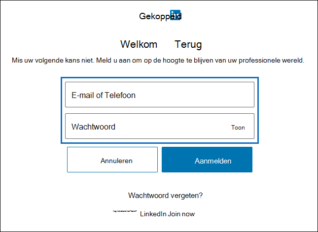
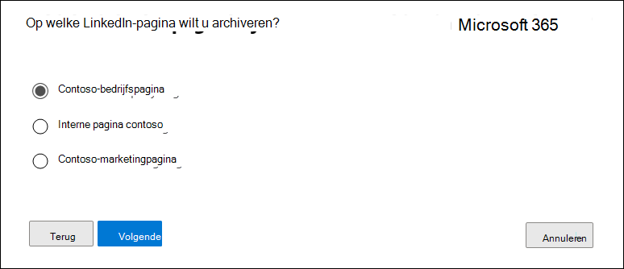

# Een connector instellen voor het archiveren van LinkedIn-gegevens

Gebruik een connector in het Microsoft 365 compliancecentrum om gegevens te importeren en te archiveren van LinkedIn Company-pagina's. Nadat u een verbindingslijn hebt ingesteld en geconfigureerd, wordt er eenmaal per 24 uur verbinding gemaakt met het account voor de specifieke pagina LinkedIn Company. De verbindingslijn converteert de berichten die zijn gepost naar de pagina Bedrijf naar een e-mailbericht en importeert deze items vervolgens in een postvak in Microsoft 365.

Nadat de paginagegevens van LinkedIn Company zijn opgeslagen in een postvak, kunt u Microsoft 365 compliancefuncties zoals Proces bewaring, Inhoud zoeken, In-Place Archiveren, Controleren en Microsoft 365 bewaarbeleid toepassen op LinkedIn-gegevens. U kunt bijvoorbeeld zoeken naar deze items met Inhoud zoeken of het opslagpostvak koppelen aan een bewaarder in een Advanced eDiscovery geval. Als u een verbindingslijn maakt om LinkedIn-gegevens te importeren en te archiveren in Microsoft 365, kan uw organisatie voldoen aan overheids- en regelgevingsbeleid.

## Voordat u een verbindingslijn in stelt

- Aan de gebruiker die een LinkedIn-verbindingslijn voor bedrijfspagina's maakt, moet de rol Postvak importeren exporteren in Exchange Online. Dit is vereist om verbindingslijnen toe te voegen op de pagina **Gegevensconnectors** in het Microsoft 365 compliancecentrum. Deze rol is standaard niet toegewezen aan een rollengroep in Exchange Online. U kunt de rol Postvak importeren exporteren toevoegen aan de rollengroep Organisatiebeheer in Exchange Online. U kunt ook een rollengroep maken, de rol Postvak importeren exporteren toewijzen en vervolgens de juiste gebruikers toevoegen als leden. Zie de secties  Rollengroepen  maken of Rollengroepen wijzigen in het artikel 'Rollengroepen beheren in Exchange Online'.

- U moet de aanmeldingsreferenties (e-mailadres of telefoonnummer en wachtwoord) van een LinkedIn-gebruikersaccount hebben dat een beheerder is voor de LinkedIn-bedrijfspagina die u wilt archiveren. U gebruikt deze referenties om u aan te melden bij LinkedIn bij het instellen van de verbindingslijn.

- De LinkedIn-connector kan in totaal 200.000 items in één dag importeren. Als er meer dan 200.000 LinkedIn-items in een dag zijn, worden geen van deze items geïmporteerd in Microsoft 365.

## Een LinkedIn-verbindingslijn maken

1. Ga naar <https://compliance.microsoft.com> en klik vervolgens op **Pagina's van**  >  **LinkedIn Company voor gegevensconnectoren.**

2. Klik op **de productpagina's** van LinkedIn op **Verbindingslijn toevoegen.**

3. Selecteer accepteren op de pagina **Servicevoorwaarden.**

4. Klik op **de pagina Aanmelden met LinkedIn** op Aanmelden met **LinkedIn**.

   De linkedin-aanmeldingspagina wordt weergegeven.

   

5. Voer op de pagina LinkedIn-aanmelding het e-mailadres (of telefoonnummer) en het wachtwoord in voor het LinkedIn-account dat is gekoppeld aan de bedrijfspagina die u wilt archiveren en klik vervolgens op **Aanmelden.**

   Er wordt een wizardpagina weergegeven met een lijst met alle LinkedIn-bedrijfspagina's die zijn gekoppeld aan het account waarin u zich hebt aangemeld. Een verbindingslijn kan slechts voor één bedrijfspagina worden geconfigureerd. Als uw organisatie meerdere LinkedIn-bedrijfspagina's heeft, moet u voor elke pagina een verbindingslijn maken.

   

6. Selecteer de bedrijfspagina van waar u items wilt archiveren en klik vervolgens op **Volgende.**

7. Klik op **de pagina** Opslaglocatie kiezen in het vak, selecteer het e-mailadres van een Microsoft 365-postvak waarin de LinkedIn-items worden geïmporteerd en klik vervolgens op **Volgende.** Items worden geïmporteerd in de map Postvak IN in dit postvak.

8. Klik **op Volgende** om de connectorinstellingen te bekijken en klik vervolgens op **Voltooien** om de connectorconfiguratie te voltooien.

Nadat u de verbindingslijn hebt gemaakt, kunt u teruggaan naar de pagina Gegevensconnectors om de voortgang van het importproces voor de nieuwe verbindingslijn te bekijken (selecteer indien nodig Vernieuwen om de lijst met **verbindingslijnen** bij te werken).  De waarde in de **kolom Status** is Wachten om **te beginnen.** Het duurt maximaal 24 uur voordat het eerste importproces is gestart. Nadat de connector voor het eerst wordt uitgevoerd en de LinkedIn-items wordt geïmporteerd, wordt de verbindingslijn eenmaal per 24 uur uitgevoerd en worden nieuwe items geïmporteerd die in de afgelopen 24 uur zijn gemaakt op de LinkedIn-bedrijfspagina.

Als u meer details wilt weergeven, selecteert u de verbindingslijn in de lijst op de pagina **Gegevensconnectors** om de flyoutpagina weer te geven. Onder **Status** geeft het datumbereik dat wordt weergegeven het leeftijdsfilter aan dat is geselecteerd toen de verbindingslijn werd gemaakt.

## Meer informatie

LinkedIn-items worden geïmporteerd in de LinkedIn-submap in het Postvak IN van het opslagpostvak in Microsoft 365. Ze worden weergegeven als e-mailberichten.