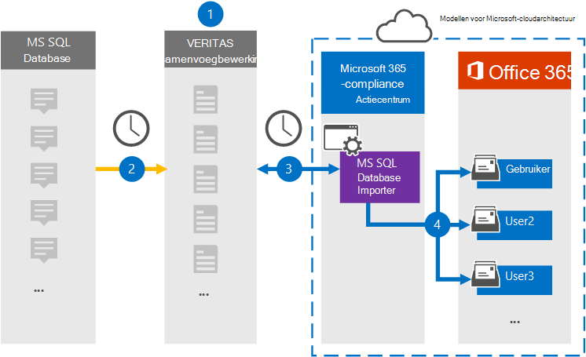

# Een verbindingslijn instellen voor het archiveren van gegevens van MS-SQL DatabaseSet up a connector to archive data from MS SQL Database

Gebruik een Veritas-connector in het Microsoft 365 compliancecentrum om gegevens uit MS-SQL Database te importeren en te archiveren in gebruikerspostvakken in uw Microsoft 365 organisatie.Use a Veritas connector in the Microsoft 365 compliance center to import and archive data from MS SQL Database to user mailboxes in your Microsoft 365 organization. Veritas biedt u een MS-SQL Database Importer-connector die is geconfigureerd om items uit een database vast te leggen met behulp van een XML-configuratiebestand en deze items te importeren in Microsoft 365.Veritas provides you with an MS SQL Database Importer connector that's configured to capture items from a database using an XML configuration file and import those items to Microsoft 365. De verbindingslijn converteert inhoud van MS-SQL Database naar een e-mailberichtindeling en importeert deze items vervolgens in gebruikerspostvakken in Microsoft 365.The connector converts content from MS SQL Database to an email message format and then imports those items to user mailboxes in Microsoft 365.

Nadat inhoud van MS SQL Database is opgeslagen in gebruikerspostvakken, kunt u Microsoft 365 compliancefuncties toepassen, zoals Litigation Hold, eDiscovery, bewaarbeleid en bewaarlabels.After content from MS SQL Database stored in user mailboxes, you can apply Microsoft 365 compliance features such as Litigation Hold, eDiscovery, retention policies and retention labels. Als u een MS-verbindingslijn SQL Database om gegevens te importeren en te archiveren in Microsoft 365, kan uw organisatie voldoen aan het overheids- en regelgevingsbeleid.Using an MS SQL Database connector to import and archive data in Microsoft 365 can help your organization stay compliant with government and regulatory policies.

## Overzicht van het archiveren van ms-SQL gegevensOverview of archiving the MS SQL data

In het volgende overzicht wordt uitgelegd hoe het gebruik van een verbindingslijn voor het archiveren van MS-SQL gegevens in Microsoft 365.The following overview explains the process of using a connector to archive MS SQL data in Microsoft 365.

1. Uw organisatie werkt samen met een MS-SQL Database voor het instellen en configureren van een MS-SQL Database site.Your organization works with an MS SQL Database provider to set up and configure an MS SQL Database site.

2. Elke 24 uur worden MS-SQL Database gekopieerd naar de Veritas Merge1-site.Once every 24 hours, MS SQL Database items are copied to the Veritas Merge1 site. De connector converteert deze inhoud ook naar een e-mailberichtindeling.The connector also converts this content to an email message format.

3. De MS SQL Database Importer-connector die u maakt in het Microsoft 365-compliancecentrum, maakt elke dag verbinding met de Veritas Merge1-site en draagt de berichten over naar een veilige Azure Storage-locatie in de Microsoft-cloud.The MS SQL Database Importer connector that you create in the Microsoft 365 compliance center, connects to the Veritas Merge1 site every day and transfers the messages to a secure Azure Storage location in the Microsoft cloud.

4. De connector importeert de geconverteerde MS-SQL Database items in de postvakken van specifieke gebruikers met behulp van de waarde van de eigenschap *E-mail* van de automatische gebruikerstoewijzing, zoals beschreven in [stap 3.](#step-3-map-users-and-complete-the-connector-setup)The connector imports the converted MS SQL Database items to the mailboxes of specific users using the value of the *Email* property of the automatic user mapping as described in [Step 3](#step-3-map-users-and-complete-the-connector-setup). Een submap in de map Postvak IN met de naam **MS SQL Database Importer** wordt gemaakt in de postvakken van gebruikers en de items worden geïmporteerd in die map.A subfolder in the Inbox folder named **MS SQL Database Importer** is created in the user mailboxes, and the items are imported to that folder. De verbindingslijn bepaalt in welk postvak items moeten worden geïmporteerd met behulp van de waarde van de eigenschap *E-mail.*The connector determines which mailbox to import items to by using the value of the *Email* property. Elk item uit de MS-SQL Database bevat deze eigenschap, die wordt gevuld met het e-mailadres van elke deelnemer van het item.Every item from the MS SQL Database contains this property, which is populated with the email address of every participant of the item.

## Voordat u begintBefore you begin

- Maak een Veritas Merge1-account voor Microsoft-connectors.Create a Veritas Merge1 account for Microsoft connectors. Neem contact op met [Veritas Customer Support](https://www.veritas.com/content/support/)om een account te maken.To create an account, contact [Veritas Customer Support](https://www.veritas.com/content/support/). U moet zich aanmelden bij dit account wanneer u de verbindingslijn maakt in stap 1.You need to sign into this account when you create the connector in Step 1.

- De gebruiker die de MS-SQL Database Importer-connector maakt in stap 1 (en deze in stap 3 voltooit), moet worden toegewezen aan de rol Postvak importeren exporteren in Exchange Online.The user who creates the MS SQL Database Importer connector in Step 1 (and completes it in Step 3) must be assigned to the Mailbox Import Export role in Exchange Online. Deze rol is vereist om verbindingslijnen toe te voegen op de pagina Gegevensconnectors in het Microsoft 365 compliancecentrum.This role is required to add connectors on the Data connectors page in the Microsoft 365 compliance center. Deze rol is standaard niet toegewezen aan een rollengroep in Exchange Online.By default, this role is not assigned to any role group in Exchange Online. U kunt de rol Postvak importeren exporteren toevoegen aan de rollengroep Organisatiebeheer in Exchange Online.You can add the Mailbox Import Export role to the Organization Management role group in Exchange Online. U kunt ook een rollengroep maken, de rol Postvak importeren exporteren toewijzen en vervolgens de juiste gebruikers toevoegen als leden.Or you can create a role group, assign the Mailbox Import Export role, and then add the appropriate users as members. Zie de secties  Rollengroepen  maken of Rollengroepen wijzigen in het artikel 'Rollengroepen beheren in Exchange Online'.For more information, see the [Create role groups](/Exchange/permissions-exo/role-groups#create-role-groups) or [Modify role groups](/Exchange/permissions-exo/role-groups#modify-role-groups) sections in the article "Manage role groups in Exchange Online".

## Stap 1: De connector ms-SQL Database Importer instellenStep 1: Set up the MS SQL Database Importer connector

De eerste stap is toegang tot de pagina Gegevensconnectoren in het Microsoft365-compliancecentrum en het maken van een **verbindingslijn** voor de MS-SQL Database.The first step is to access to the **Data Connectors** page in the Microsoft365 compliance center and create a connector for the MS SQL Database.

1. Ga naar [https://compliance.microsoft.com](https://compliance.microsoft.com) en klik vervolgens op **Gegevensconnectoren**  >  **MS SQL Database Importer**.Go to [https://compliance.microsoft.com](https://compliance.microsoft.com) and then click **Data connectors** > **MS SQL Database Importer**.

2. Klik op **de pagina MS SQL Database Productbeschrijving van Importer** op Nieuwe **verbindingslijn toevoegen.**On the **MS SQL Database Importer** product description page, click **Add new connector**.

3. Klik op **de pagina Servicevoorwaarden** op **Accepteren.**On the **Terms of service** page, click **Accept**.

4. Voer een unieke naam in die de verbindingslijn identificeert en klik vervolgens op **Volgende.**Enter a unique name that identifies the connector, and then click **Next**.

5. Meld u aan bij uw Merge1-account om de verbindingslijn te configureren.Sign in to your Merge1 account to configure the connector.

## Stap 2: De MS-connector SQL Database importer configureren op de Veritas Merge1-siteStep 2: Configure the MS SQL Database Importer connector on the Veritas Merge1 site

De tweede stap is het configureren van de MS-SQL Database Importer-connector op de site Samenvoegen1.The second step is to configure the MS SQL Database Importer connector on the Merge1 site. Zie Gebruikershandleiding voor connectors van derden samenvoegen voor informatie over het configureren van de [MS-SQL Database](https://docs.ms.merge1.globanetportal.com/Merge1%20Third-Party%20Connectors%20MS%20SQL%20Database%20Importer%20User%20Guide%20.pdf)Importer.For information about how to configure the MS SQL Database Importer, see [Merge1 Third-Party Connectors User Guide](https://docs.ms.merge1.globanetportal.com/Merge1%20Third-Party%20Connectors%20MS%20SQL%20Database%20Importer%20User%20Guide%20.pdf).

Nadat u op **Opslaan &** Voltooien  hebt geklikt, wordt de pagina Gebruikerstoewijzing in de wizard verbindingslijn in het Microsoft 365 compliancecentrum weergegeven.After you click **Save & Finish**, the **User mapping** page in the connector wizard in the Microsoft 365 compliance center is displayed.

## Stap 3: Gebruikers in kaart brengen en de configuratie van de connector voltooienStep 3: Map users and complete the connector setup

Als u gebruikers wilt in kaart brengen en de configuratie van de verbindingslijn wilt voltooien, volgt u de volgende stappen:To map users and complete the connector setup, follow these steps:

1. Schakel op **de pagina Ms-SQL Database gebruikers van Importer Microsoft 365** gebruikers in om automatische gebruikerstoewijzing in te stellen.On the **Map MS SQL Database Importer users to Microsoft 365 users** page, enable automatic user mapping. De MS-SQL Database items bevatten een eigenschap met de naam E-mail, die e-mailadressen bevat voor gebruikers in uw organisatie.The MS SQL Database items include a property called *Email*, which contains email addresses for users in your organization. Als de verbindingslijn dit adres kan koppelen aan Microsoft 365 gebruiker, worden de items geïmporteerd in het postvak van die gebruiker.If the connector can associate this address with a Microsoft 365 user, the items are imported to that user’s mailbox.

2. Klik **op Volgende,** bekijk uw instellingen en ga naar de pagina Gegevensconnectors om de voortgang van het importproces voor de nieuwe **verbindingslijn** te bekijken.Click **Next**, review your settings, and go to the **Data connectors** page to see the progress of the import process for the new connector.

## Stap 4: De MS-connector SQL Database Importer controlerenStep 4: Monitor the MS SQL Database Importer connector

Nadat u de MS-verbindingslijn SQL Database Importer, kunt u de connectorstatus bekijken in het Microsoft 365 compliancecentrum.After you create the MS SQL Database Importer connector, you can view the connector status in the Microsoft 365 compliance center.

1. Ga naar <https://compliance.microsoft.com/> en klik op **Gegevensconnectoren** in het linkernavigatievenster.Go to <https://compliance.microsoft.com/> and click **Data connectors** in the left nav.

2. Klik op **het tabblad Verbindingslijnen** en selecteer vervolgens de **MS-SQL Database** **Importer-connector** om de flyoutpagina weer te geven, die de eigenschappen en informatie over de verbindingslijn bevat.Click the **Connectors** tab and then select the **MS SQL Database** **Importer** connector to display the flyout page, which contains the properties and information about the connector.

3. Klik **onder Verbindingsstatus met bron** op de koppeling Logboek **downloaden** om het statuslogboek voor de verbindingslijn te openen (of op te slaan).Under **Connector status with source**, click the **Download log** link to open (or save) the status log for the connector. Dit logboek bevat gegevens die zijn geïmporteerd in de Microsoft-cloud.This log contains data that has been imported to the Microsoft cloud.

## Bekende problemenKnown issues

- Op dit moment bieden we geen ondersteuning voor het importeren van bijlagen of items die groter zijn dan 10 MB.At this time, we don't support importing attachments or items that are larger than 10 MB. Ondersteuning voor grotere items is op een later tijdstip beschikbaar.Support for larger items will be available at a later date.