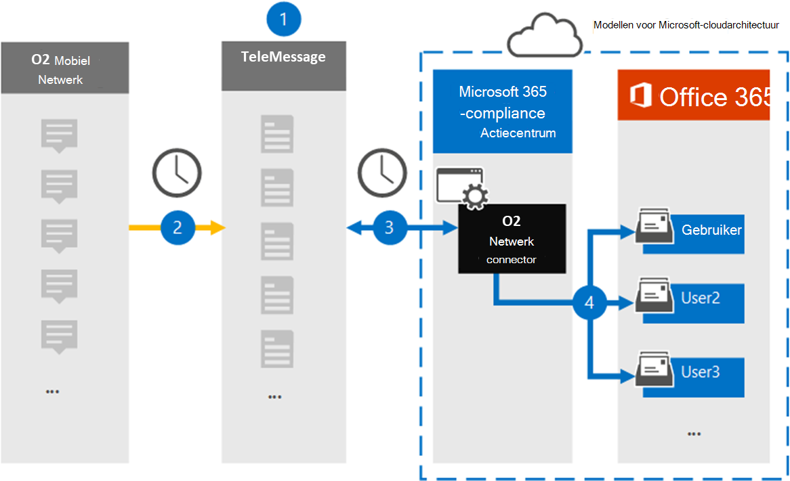

# Een verbindingslijn instellen voor het archiveren van O2-netwerkgegevensSet up a connector to archive O2 Network data

Gebruik een TeleMessage-verbindingslijn in het Microsoft 365 compliancecentrum om berichten en voicemailberichten (Sms) van het mobiele O2-netwerk te importeren en te archiveren.Use a TeleMessage connector in the Microsoft 365 compliance center to import and archive Short Messaging Service (SMS) messages and voice calls from the O2 mobile network. Nadat u een verbindingslijn hebt ingesteld en geconfigureerd, wordt er eenmaal per dag verbinding met het O2-netwerk van uw organisatie en worden Sms en spraakoproepen geïmporteerd naar postvakken in Microsoft 365.After you set up and configure a connector, it connects to your organization's O2 Network once every day, and imports SMS and voice calls to mailboxes in Microsoft 365.

Nadat Sms berichten en spraakoproepen zijn opgeslagen in postvakken van gebruikers, kunt u Microsoft 365 compliancefuncties zoals Litigation Hold, Inhoud zoeken en Microsoft 365 bewaarbeleid toepassen op O2 Netwerkgegevens.After SMS messages and voice calls are stored in user mailboxes, you can apply Microsoft 365 compliance features such as Litigation Hold, Content Search, and Microsoft 365 retention policies to O2 Network data. U kunt bijvoorbeeld zoeken in O2 Network Sms berichten en spraakoproepen met Inhoud zoeken of het postvak met O2-netwerkgegevens koppelen aan een bewaarder in een Advanced eDiscovery geval.For example, you can search O2 Network SMS messages and voice calls using Content Search or associate the mailbox that contains O2 Network data with a custodian in an Advanced eDiscovery case. Met een O2-netwerkconnector voor het importeren en archiveren van gegevens in Microsoft 365 kan uw organisatie voldoen aan overheids- en regelgevingsbeleid.Using an O2 Network connector to import and archive data in Microsoft 365 can help your organization stay compliant with government and regulatory policies.

## Overzicht van het archiveren van O2-netwerkgegevensOverview of archiving O2 Network data

In het volgende overzicht wordt uitgelegd hoe het gebruik van een verbindingslijn voor het archiveren van O2-netwerkgegevens in Microsoft 365.The following overview explains the process of using a connector to archive O2 Network data in Microsoft 365.

1. Uw organisatie werkt samen met TeleMessage en O2 om een O2-netwerkconnector in te stellen.Your organization works with TeleMessage and O2 to set up an O2 Network connector. Zie [O2 Network Archiver](https://www.telemessage.com/office365-activation-for-o2-network-archiver)voor meer informatie.For more information, see [O2 Network Archiver](https://www.telemessage.com/office365-activation-for-o2-network-archiver).

2. Eenmaal per 24 uur worden Sms berichten en spraakoproepen vanuit het O2-netwerk van uw organisatie gekopieerd naar de TeleMessage-site.Once every 24 hours, SMS messages and voice calls from your organization’s O2 Network are copied to the TeleMessage site.

3. De O2-netwerkconnector die u maakt in het Microsoft 365-compliancecentrum maakt elke dag verbinding met de TeleMessage-site en brengt de Sms-berichten en spraakoproepen van de afgelopen 24 uur over naar een veilige Azure Storage-locatie in de Microsoft-cloud.The O2 Network connector that you create in the Microsoft 365 compliance center connects to the TeleMessage site every day and transfers the SMS messages and voice calls from the previous 24 hours to a secure Azure Storage location in the Microsoft cloud. De verbindingslijn converteert ook de inhoud van Sms berichten en spraakoproepen naar een e-mailberichtindeling.The connector also converts the content of SMS messages and voice calls to an email message format.

4. De connector importeert de mobiele communicatie-items naar het postvak van specifieke gebruikers.The connector imports the mobile communication items to the mailbox of specific users. Een nieuwe map **met de Sms O2** en Voice Network Archiver wordt gemaakt in het postvak van een specifieke gebruiker en de items worden er in geïmporteerd.A new folder named **O2 SMS and Voice Network Archiver** is created in a specific user's mailbox and the items are imported to it. De connector doet deze toewijzing met behulp van de waarde van de *eigenschap E-mailadres van de* gebruiker.The connector does this mapping by using the value of the *User’s Email address* property. Elke Sms en gesproken oproep bevat deze eigenschap, die wordt gevuld met het e-mailadres van elke deelnemer van het bericht.Every SMS message and voice call contains this property, which is populated with the email address of every participant of the message.

   Naast automatische gebruikerstoewijzing met  de waarde van de eigenschap E-mailadres van de gebruiker, kunt u ook een aangepaste toewijzing definiëren door een CSV-toewijzingsbestand te uploaden.In addition to automatic user mapping using the value of the *User’s Email address* property, you can also define a custom mapping by uploading a CSV mapping file. Dit toewijzingsbestand bevat het mobiele telefoonnummer en het bijbehorende Microsoft 365 e-mailadres voor gebruikers in uw organisatie.This mapping file contains the mobile phone number and corresponding Microsoft 365 email address for users in your organization. Als u zowel automatische gebruikerstoewijzing als aangepaste toewijzing inschakelen, wordt voor elk O2-item eerst naar aangepast toewijzingsbestand gesurfd.If you enable both automatic user mapping and custom mapping, for every O2 item the connector first looks at custom mapping file. Als er geen geldige Microsoft 365-gebruiker wordt gevonden die overeenkomt met het mobiele telefoonnummer van een gebruiker, gebruikt de verbindingslijn de waarden in de eigenschap e-mailadres van het item dat het probeert te importeren.If it doesn't find a valid Microsoft 365 user that corresponds to a user's mobile phone number, the connector will use the values in the email address property of the item it's trying to import. Als de verbindingslijn geen geldige Microsoft 365 in het aangepaste toewijzingsbestand of in de eigenschap e-mailadres van het O2-item vindt, wordt het item niet geïmporteerd.If the connector doesn't find a valid Microsoft 365 user in either the custom mapping file or in the email address property of the O2 item, the item won't be imported.

## Voordat u begintBefore you begin

Sommige implementatiestappen die nodig zijn om O2-netwerkgegevens te archiveren, zijn extern Microsoft 365 en moeten worden voltooid voordat u een verbindingslijn kunt maken in het compliancecentrum.Some of the implementation steps required to archive O2 Network data are external to Microsoft 365 and must be completed before you can create a connector in the compliance center.

- Bestel de [O2 Network Archiver-service bij TeleMessage](https://www.telemessage.com/mobile-archiver/order-mobile-archiver-for-o365/) en ontvang een geldig beheeraccount voor uw organisatie.Order the [O2 Network Archiver service from TeleMessage](https://www.telemessage.com/mobile-archiver/order-mobile-archiver-for-o365/) and get a valid administration account for your organization. U moet zich aanmelden bij dit account wanneer u de verbindingslijn maakt in het compliancecentrum.You'll need to sign into this account when you create the connector in the compliance center.

- Verkrijg uw O2 Network-account en factureringscontactgegevens, zodat u de onboardingformulieren voor TeleMessage kunt invullen en de berichtarchiveringsservice kunt bestellen bij O2.Obtain your O2 Network account and billing contact details so you can fill-out the TeleMessage onboarding forms and order the message archiving service from O2.

- Registreer alle gebruikers die O2-Sms en Spraaknetwerkarchivering nodig hebben in het TeleMessage-account.Register all users that require O2 SMS and Voice Network archiving in the TeleMessage account. Wanneer u gebruikers registreert, moet u hetzelfde e-mailadres gebruiken dat wordt gebruikt voor hun Microsoft 365 account.When registering users, be sure to use the same email address that's used for their Microsoft 365 account.

- Uw werknemers moeten mobiele telefoons van het mobiele O2-netwerk hebben die eigendom zijn van uw bedrijf en die aansprakelijk zijn voor bedrijven.Your employees must have corporate-owned and corporate-liable mobile phones on the O2 mobile network. Het archiveren van berichten in Microsoft 365 is niet beschikbaar voor byod-apparaten (Bring Your Own Devices).Archiving messages in Microsoft 365 isn't available for employee-owned or "Bring Your Own Devices (BYOD) devices.

- De gebruiker die een O2-netwerkconnector maakt, moet de rol Postvak importeren exporteren in Exchange Online.The user who creates an O2 Network connector must be assigned the Mailbox Import Export role in Exchange Online. Dit is vereist om verbindingslijnen toe te voegen op de pagina **Gegevensconnectors** in het Microsoft 365 compliancecentrum.This is required to add connectors in the **Data connectors** page in the Microsoft 365 compliance center. Deze rol is standaard niet toegewezen aan een rollengroep in Exchange Online.By default, this role isn't assigned to any role group in Exchange Online. U kunt de rol Postvak importeren exporteren toevoegen aan de rollengroep Organisatiebeheer in Exchange Online.You can add the Mailbox Import Export role to the Organization Management role group in Exchange Online. U kunt ook een rollengroep maken, de rol Postvak importeren exporteren toewijzen en vervolgens de juiste gebruikers toevoegen als leden.Or you can create a role group, assign the Mailbox Import Export role, and then add the appropriate users as members. Zie de secties  Rollengroepen  maken of Rollengroepen wijzigen in het artikel 'Rollengroepen beheren in Exchange Online'.For more information, see the [Create role groups](/Exchange/permissions-exo/role-groups#create-role-groups) or [Modify role groups](/Exchange/permissions-exo/role-groups#modify-role-groups) sections in the article "Manage role groups in Exchange Online".

## Een O2-netwerkconnector makenCreate an O2 Network connector

Nadat u de vereisten hebt voltooid die in de vorige sectie zijn beschreven, kunt u een O2-netwerkconnector maken in het Microsoft 365 compliancecentrum.After you've completed the prerequisites described in the previous section, you can create an O2 Network connector in the Microsoft 365 compliance center. De verbindingslijn gebruikt de informatie die u verstrekt om verbinding te maken met de TeleMessage-site en Sms berichten en spraakoproepen over te brengen naar de bijbehorende postvakken van gebruikers in Microsoft 365.The connector uses the information you provide to connect to the TeleMessage site and transfer SMS messages and voice calls to the corresponding user mailbox boxes in Microsoft 365.

1. Ga naar [https://compliance.microsoft.com](https://compliance.microsoft.com/) en klik vervolgens op **Gegevensconnectoren** \> **O2 Network**.Go to [https://compliance.microsoft.com](https://compliance.microsoft.com/) and then click **Data connectors** \> **O2 Network**.

2. Klik op **de pagina Productbeschrijving** van O2 Network op **Verbindingslijn toevoegen**On the **O2 Network** product description page, click **Add connector**

3. Klik op **de pagina Servicevoorwaarden** op **Accepteren.**On the **Terms of service** page, click **Accept**.

4. Voer op de pagina Aanmelden bij **TeleMessage** onder Stap 3 de vereiste informatie in de volgende vakken in en klik vervolgens op **Volgende**.On the **Login to TeleMessage** page, under Step 3, enter the required information in the following boxes and then click **Next**.

   - **Gebruikersnaam:** Uw TeleMessage-gebruikersnaam.**Username:** Your TeleMessage username.

   - **Wachtwoord:** Uw TeleMessage-wachtwoord.**Password:** Your TeleMessage password.

5. Nadat de verbindingslijn is gemaakt, kunt u het pop-upvenster sluiten en naar de volgende pagina gaan.After the connector is created, you can close the pop-up window and go to the next page.

6. Schakel op **de pagina Gebruikerstoewijzing** automatische gebruikerstoewijzing in en klik op **Volgende.**On the **User mapping** page, enable automatic user mapping and click **Next**. Als u aangepaste toewijzing nodig hebt, uploadt u een CSV-bestand en klikt u op **Volgende.**In case you need custom mapping upload a CSV file, and click **Next**.

7. Controleer de instellingen en klik vervolgens op **Voltooien om** de verbindingslijn te maken.Review your settings, and then click **Finish** to create the connector.

8. Ga naar het tabblad Connectors op de pagina **Gegevensconnectors** om de voortgang van het importproces voor de nieuwe verbindingslijn te bekijken.Go to the Connectors tab in **Data connectors** page to see the progress of the import process for the new connector.

## Bekende problemenKnown issues

- Op dit moment bieden we geen ondersteuning voor het importeren van bijlagen of items die groter zijn dan 10 MB.At this time, we don't support importing attachments or items that are larger than 10 MB. Ondersteuning voor grotere items is op een later tijdstip beschikbaar.Support for larger items will be available at a later date.