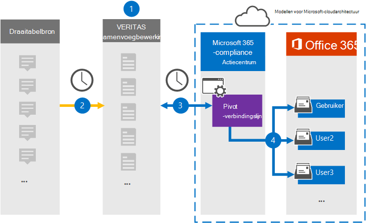

# Een verbindingslijn instellen voor het archiveren van draaitabelgegevensSet up a connector to archive Pivot data

Gebruik een Veritas-connector in het Microsoft 365 compliancecentrum om gegevens van het draaitabelplatform te importeren en te archiveren naar postvakken van gebruikers in uw Microsoft 365 organisatie.Use a Veritas connector in the Microsoft 365 compliance center to import and archive data from the Pivot platform to user mailboxes in your Microsoft 365 organization. Veritas biedt u  een draailijnconnector die is geconfigureerd om items uit de gegevensbron van derden vast te leggen (op regelmatige basis) en deze items vervolgens te importeren in Microsoft 365.Veritas provides you with a [Pivot](https://globanet.com/pivot/) connector that is configured to capture items from the third-party data source (on a regular basis) and then import those items to Microsoft 365. Pivot is een chatplatform waarmee kan worden samengewerkt met deelnemers aan de financiële markt.Pivot is an instant messaging platform that allows collaboration with financial market participants. De verbindingslijn converteert items zoals chatberichten, van de pivot-accounts van een gebruiker naar een e-mailberichtindeling en importeert deze items vervolgens in de postvakken van gebruikers in Microsoft 365.The connector converts items such as chat messages, from a users' Pivot accounts to an email message format and then imports those items to the user mailboxes in Microsoft 365.

Nadat draaitabelgegevens zijn opgeslagen in gebruikerspostvakken, kunt u Microsoft 365 compliancefuncties toepassen, zoals Litigation Hold, eDiscovery, bewaarbeleid en bewaarlabels en communicatie compliance.After Pivot data is stored in user mailboxes, you can apply Microsoft 365 compliance features such as Litigation Hold, eDiscovery, retention policies and retention labels, and communication compliance. Als u een pivot-verbindingslijn gebruikt om gegevens te importeren en te archiveren in Microsoft 365 kan uw organisatie voldoen aan het overheids- en regelgevingsbeleid.Using a Pivot connector to import and archive data in Microsoft 365 can help your organization stay compliant with government and regulatory policies.

## Overzicht van het archiveren van draaitabelgegevensOverview of archiving Pivot data

In het volgende overzicht wordt uitgelegd hoe het gebruik van een verbindingslijn voor het archiveren van de draaitabelgegevens in Microsoft 365.The following overview explains the process of using a connector to archive the Pivot data in Microsoft 365.

1. Uw organisatie werkt samen met Pivot om een pivotbronsite in te stellen en te configureren.Your organization works with Pivot to set up and configure a Pivot source site.

2. Eens in de 24 uur worden draaititems gekopieerd naar de Veritas Merge1-site.Once every 24 hours, Pivot items are copied to the Veritas Merge1 site. De verbindingslijn converteert ook de draaititems naar een e-mailberichtindeling.The connector also converts the Pivot items to an email message format.

3. De draaipuntconnector die u maakt in het Microsoft 365 compliancecentrum, maakt elke dag verbinding met de Veritas Merge1-site en draagt de draaititems over naar een veilige Azure Storage-locatie in de Microsoft-cloud.The Pivot connector that you create in the Microsoft 365 compliance center, connects to the Veritas Merge1 site every day and transfers the Pivot items to a secure Azure Storage location in the Microsoft cloud.

4. De verbindingslijn importeert de draaititems naar de postvakken van specifieke gebruikers met behulp van de waarde van de eigenschap *E-mail* van de automatische gebruikerstoewijzing, zoals beschreven in [stap 3.](#step-3-map-users-and-complete-the-connector-setup)The connector imports the Pivot items to the mailboxes of specific users by using the value of the *Email* property of the automatic user mapping as described in [Step 3](#step-3-map-users-and-complete-the-connector-setup). Er wordt een submap in de map Postvak IN met de naam **Pivot** gemaakt in de postvakken van de gebruiker en de items worden geïmporteerd in die map.A subfolder in the Inbox folder named **Pivot** is created in the user mailboxes, and the items are imported to that folder. De verbindingslijn doet dit met behulp van de waarde van de eigenschap *E-mail.*The connector does this by using the value of the *Email* property. Elk draaitabelitem bevat deze eigenschap, die wordt gevuld met het e-mailadres van elke deelnemer aan het item.Every Pivot item contains this property, which is populated with the email address of every participant of the item.

## Voordat u begintBefore you begin

- Maak een Veritas Merge1-account voor Microsoft-connectors.Create a Veritas Merge1 account for Microsoft connectors. Neem contact op met [Veritas Customer Support](https://www.veritas.com/content/support/)om dit account te maken.To create this account, contact [Veritas Customer Support](https://www.veritas.com/content/support/). U meld u aan bij dit account wanneer u de verbindingslijn maakt in stap 1.You will sign into this account when you create the connector in Step 1.

- De gebruiker die de draailijnconnector maakt in stap 1 (en deze voltooit in stap 3), moet worden toegewezen aan de rol Postvak importeren exporteren in Exchange Online.The user who creates the Pivot connector in Step 1 (and completes it in Step 3) must be assigned to the Mailbox Import Export role in Exchange Online. Deze rol is vereist om verbindingslijnen toe te voegen op de pagina Gegevensconnectors in het Microsoft 365 compliancecentrum.This role is required to add connectors on the Data connectors page in the Microsoft 365 compliance center. Deze rol is standaard niet toegewezen aan een rollengroep in Exchange Online.By default, this role is not assigned to a role group in Exchange Online. U kunt de rol Postvak importeren exporteren toevoegen aan de rollengroep Organisatiebeheer in Exchange Online.You can add the Mailbox Import Export role to the Organization Management role group in Exchange Online. U kunt ook een rollengroep maken, de rol Postvak importeren exporteren toewijzen en vervolgens de juiste gebruikers toevoegen als leden.Or you can create a role group, assign the Mailbox Import Export role, and then add the appropriate users as members. Zie de secties  Rollengroepen  maken of Rollengroepen wijzigen in het artikel 'Rollengroepen beheren in Exchange Online'.For more information, see the [Create role groups](/Exchange/permissions-exo/role-groups#create-role-groups) or [Modify role groups](/Exchange/permissions-exo/role-groups#modify-role-groups) sections in the article "Manage role groups in Exchange Online".

## Stap 1: De pivot-verbindingslijn instellenStep 1: Set up the Pivot connector

De eerste stap is toegang tot de pagina Gegevensconnectoren in het Microsoft-compliancecentrum en het maken van een **verbindingslijn** voor draaigegevens.The first step is to access to the **Data Connectors** page in the Microsoft compliance center and create a connector for Pivot data.

1. Ga naar [https://compliance.microsoft.com](https://compliance.microsoft.com/) en klik vervolgens op **Gegevensconnectors**  >  **Pivot**.Go to [https://compliance.microsoft.com](https://compliance.microsoft.com/) and then click **Data connectors** > **Pivot**.

2. Klik op **de pagina Productbeschrijving** van draaipunt op **Verbindingslijn toevoegen.**On the **Pivot** product description page, click **Add connector**.

3. Klik op **de pagina Servicevoorwaarden** op **Accepteren.**On the **Terms of service** page, click **Accept**.

4. Voer een unieke naam in die de verbindingslijn identificeert en klik vervolgens op **Volgende.**Enter a unique name that identifies the connector and then click **Next**.

5. Meld u aan bij uw Merge1-account om de verbindingslijn te configureren.Sign in to your Merge1 account to configure the connector.

## Stap 2: De draailijnconnector configureren op de Veritas Merge1-siteStep 2: Configure the Pivot connector on the Veritas Merge1 site

De tweede stap is het configureren van de pivot-verbindingslijn op de site Samenvoegen1.The second step is to configure the Pivot connector on the Merge1 site. Zie Gebruikershandleiding voor [connectors](https://docs.ms.merge1.globanetportal.com/Merge1%20Third-Party%20Connectors%20Pivot%20User%20Guide%20.pdf)van derden samenvoegen voor informatie over het configureren van de draailijnconnector op de site Veritas Merge1.For information about how to configure the Pivot connector on the Veritas Merge1 site, see [Merge1 Third-Party Connectors User Guide](https://docs.ms.merge1.globanetportal.com/Merge1%20Third-Party%20Connectors%20Pivot%20User%20Guide%20.pdf).

Nadat u op **Opslaan &** Voltooien  hebt geklikt, wordt de pagina Gebruikerstoewijzing in de wizard verbindingslijn in het Microsoft 365 compliancecentrum weergegeven.After you click **Save & Finish**, the **User mapping** page in the connector wizard in the Microsoft 365 compliance center is displayed.

## Stap 3: Gebruikers in kaart brengen en de configuratie van de connector voltooienStep 3: Map users and complete the connector setup

Als u gebruikers wilt in kaart brengen en de configuratie van de connector wilt voltooien in het Microsoft 356-compliancecentrum, volgt u de volgende stappen:To map users and complete the connector setup in the Microsoft 356 compliance center, follow these steps:

1. Schakel automatische **gebruikerstoewijzing** in op de pagina Microsoft 365 gebruikers toewijzen.On the **Map Pivot users to Microsoft 365 users** page, enable automatic user mapping. De draaititems bevatten een eigenschap met de naam *E-mail,* die e-mailadressen bevat voor gebruikers in uw organisatie.The Pivot items include a property called *Email*, which contains email addresses for users in your organization. Als de verbindingslijn dit adres kan koppelen aan Microsoft 365 gebruiker, worden de items geïmporteerd in het postvak van die gebruiker.If the connector can associate this address with a Microsoft 365 user, the items are imported to that user's mailbox.

2. Klik **op Volgende,** bekijk uw instellingen en ga naar de pagina Gegevensconnectors om de voortgang van het importproces voor de nieuwe **verbindingslijn** te bekijken.Click **Next**, review your settings, and go to the **Data connectors** page to see the progress of the import process for the new connector.

## Stap 4: De pivot-verbindingslijn controlerenStep 4: Monitor the Pivot connector

Nadat u de pivot-verbindingslijn hebt maakt, kunt u de status van de verbindingslijn bekijken in het Microsoft 365 compliancecentrum.After you create the Pivot connector, you can view the connector status in the Microsoft 365 compliance center.

1. Ga naar [https://compliance.microsoft.com](https://compliance.microsoft.com) en klik op **Gegevensconnectoren** in het linkernavigatievenster.Go to [https://compliance.microsoft.com](https://compliance.microsoft.com) and click **Data connectors** in the left nav.

2. Klik op **het tabblad Verbindingslijnen** en selecteer vervolgens de **draailijnconnector** om de flyoutpagina weer te geven.Click the **Connectors** tab and then select the **Pivot** connector to display the flyout page. Deze pagina bevat de eigenschappen en informatie over de verbindingslijn.This page contains the properties and information about the connector.

3. Klik **onder Verbindingsstatus met bron** op de koppeling Logboek **downloaden** om het statuslogboek voor de verbindingslijn te openen (of op te slaan).Under **Connector status with source**, click the **Download log** link to open (or save) the status log for the connector. Dit logboek bevat gegevens die zijn geïmporteerd in de Microsoft-cloud.This log contains data that has been imported to the Microsoft cloud.

## Bekende problemenKnown issues

- Op dit moment bieden we geen ondersteuning voor het importeren van bijlagen of items die groter zijn dan 10 MB.At this time, we don't support importing attachments or items that are larger than 10 MB. Ondersteuning voor grotere items is op een later tijdstip beschikbaar.Support for larger items will be available at a later date.