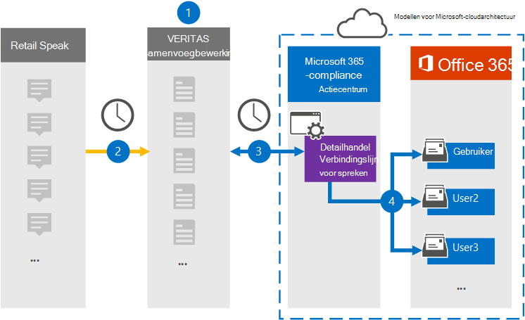

# Een connector instellen voor het archiveren van Redtail Speak-gegevensSet up a connector to archive Redtail Speak data

Gebruik een Veritas-connector in het Microsoft 365 compliancecentrum om gegevens te importeren en te archiveren vanuit de Redtail Speak to user mailboxes in your Microsoft 365 organization.Use a Veritas connector in the Microsoft 365 compliance center to import and archive data from the Redtail Speak to user mailboxes in your Microsoft 365 organization. Veritas biedt u een [Redtail Speak-connector](https://globanet.com/redtail/) die is geconfigureerd voor het vastleggen van items van de SFTP-server van uw organisatie waar de items worden ontvangen van Redtail.Veritas provides you with a [Redtail Speak](https://globanet.com/redtail/) connector that's configured to capture items from your organization’s SFTP server where the items are received from Redtail. De verbindingslijn converteert de inhoud van Redtail Speak naar een e-mailberichtindeling en importeert deze items vervolgens in het postvak van de gebruiker in Microsoft 365.The connector converts the content from Redtail Speak to an email message format and then imports those items to the user's mailbox in Microsoft 365.

Nadat Redtail Speak-gegevens zijn opgeslagen in gebruikerspostvakken, kunt u Microsoft 365 compliancefuncties toepassen, zoals Litigation Hold, eDiscovery, bewaarbeleid en bewaarlabels.After Redtail Speak data is stored in user mailboxes, you can apply Microsoft 365 compliance features such as Litigation Hold, eDiscovery, retention policies, and retention labels. Als u een Redtail Speak-verbindingslijn gebruikt om gegevens te importeren en te archiveren in Microsoft 365 kan uw organisatie voldoen aan overheids- en regelgevingsbeleid.Using a Redtail Speak connector to import and archive data in Microsoft 365 can help your organization stay compliant with government and regulatory policies.

## Overzicht van het archiveren van de Redtail Speak-gegevensOverview of archiving the Redtail Speak data

In het volgende overzicht wordt uitgelegd hoe u een verbindingslijn gebruikt om de Gegevens van Redtail Speak te archiveren in Microsoft 365.The following overview explains the process of using a connector to archive the Redtail Speak data in Microsoft 365.

1. Uw organisatie werkt samen met Redtail Speak om een SMTP-gateway in te stellen en te configureren waar berichten dagelijks worden doorgestuurd van Redtail Speak naar de SFTP-server van uw organisatie.Your organization works with Redtail Speak to set up and configure an SMTP gateway where messages are forwarded from Redtail Speak to your organization's SFTP server on a daily basis.

2. Elke 24 uur worden de Redtail Speak-items gekopieerd naar de Veritas Merge1-site.Once every 24 hours, the Redtail Speak items are copied to the Veritas Merge1 site. De connector converteert ook de Redtail Speak-items naar een e-mailberichtindeling.The connector also converts the Redtail Speak items to an email message format.

3. De Redtail Speak-connector die u maakt in het Microsoft 365 compliancecentrum, maakt elke dag verbinding met de Veritas Merge1-site en brengt de berichten over naar een veilige Azure Storage locatie in de Microsoft-cloud.The Redtail Speak connector that you create in the Microsoft 365 compliance center connects to the Veritas Merge1 site every day and transfers the messages to a secure Azure Storage location in the Microsoft cloud.

4. De connector importeert de geconverteerde Redtail Speak-items naar de postvakken van specifieke gebruikers met behulp van de waarde van de eigenschap *E-mail* van de automatische gebruikerstoewijzing, zoals beschreven in [stap 3.](#step-3-map-users-and-complete-the-connector-setup)The connector imports the converted Redtail Speak items to the mailboxes of specific users using the value of the *Email* property of the automatic user mapping as described in [Step 3](#step-3-map-users-and-complete-the-connector-setup). Er wordt een submap in de map Postvak IN met de naam **Redtail Speak** gemaakt in de postvakken van de gebruiker en de items worden geïmporteerd in die map.A subfolder in the Inbox folder named **Redtail Speak** is created in the user mailboxes, and the items are imported to that folder. De verbindingslijn bepaalt in welk postvak items moeten worden geïmporteerd met behulp van de waarde van de eigenschap *E-mail.*The connector determines which mailbox to import items to by using the value of the *Email* property. Elk Redtail Speak-item bevat deze eigenschap, die wordt gevuld met het e-mailadres van elke deelnemer aan het item.Every Redtail Speak item contains this property, which is populated with the email address of every participant of the item.

## Voordat u begintBefore you begin

- Maak een Veritas Merge1-account voor Microsoft-connectors.Create a Veritas Merge1 account for Microsoft connectors. Neem contact op met [Veritas Customer Support](https://www.veritas.com/content/support/)om een account te maken.To create an account, contact [Veritas Customer Support](https://www.veritas.com/content/support/). U moet zich aanmelden bij dit account wanneer u de verbindingslijn maakt in stap 1.You need to sign into this account when you create the connector in Step 1.

- In stap 2 moet u de SFTP-server van uw organisatie opgeven.In Step 2, you need to specify your organization's SFTP server. Deze stap is nodig zodat Veritas Merge1 contact kan opnemen om Redtail Speak-gegevens te verzamelen via SFTP.This step is necessary so that Veritas Merge1 can contact it to collect Redtail Speak data via SFTP.

- De gebruiker die de Connector Redtail Speak Importer maakt in stap 1 (en deze voltooit in stap 3), moet worden toegewezen aan de rol Postvak importeren exporteren in Exchange Online.The user who creates the Redtail Speak Importer connector in Step 1 (and completes it in Step 3) must be assigned to the Mailbox Import Export role in Exchange Online. Deze rol is vereist om verbindingslijnen toe te voegen op de pagina Gegevensconnectors in het Microsoft 365 compliancecentrum.This role is required to add connectors on the Data connectors page in the Microsoft 365 compliance center. Deze rol is standaard niet toegewezen aan een rollengroep in Exchange Online groep.This role is not assigned to any role group in Exchange Online by default. U kunt de rol Postvak importeren exporteren toevoegen aan de rollengroep Organisatiebeheer in Exchange Online.You can add the Mailbox Import Export role to the Organization Management role group in Exchange Online. U kunt ook een rollengroep maken, de rol Postvak importeren exporteren toewijzen en vervolgens de juiste gebruikers toevoegen als leden.Or you can create a role group, assign the Mailbox Import Export role, and then add the appropriate users as members. Zie de secties  Rollengroepen  maken of Rollengroepen wijzigen in het artikel 'Rollengroepen beheren in Exchange Online'.For more information, see the [Create role groups](/Exchange/permissions-exo/role-groups#create-role-groups) or [Modify role groups](/Exchange/permissions-exo/role-groups#modify-role-groups) sections in the article "Manage role groups in Exchange Online".

## Stap 1: De Verbindingslijn Redtail Speak instellenStep 1: Set up the Redtail Speak connector

De eerste stap is toegang tot de pagina Gegevensconnectoren in het Microsoft 365 compliancecentrum en een **verbindingslijn** maken voor de Gegevens van Redtail Speak.The first step is to access to the **Data Connectors** page in the Microsoft 365 compliance center and create a connector for the Redtail Speak data.

1. Ga naar [https://compliance.microsoft.com](https://compliance.microsoft.com/) en selecteer **Gegevensconnectoren** &gt; **Redtail Speak**.Go to [https://compliance.microsoft.com](https://compliance.microsoft.com/) and select **Data connectors** &gt; **Redtail Speak**.

2. Selecteer op **de pagina Redtail Speak** productbeschrijving de optie Nieuwe **verbindingslijn toevoegen.**On the **Redtail Speak** product description page, select **Add new connector**.

3. Selecteer accepteren op de pagina **Servicevoorwaarden.**On the **Terms of service** page, select **Accept**.

4. Voer een unieke naam in die de verbindingslijn identificeert en selecteer **volgende**.Enter a unique name that identifies the connector, and then select **Next**.

5. Meld u aan bij uw Merge1-account om de verbindingslijn te configureren.Sign in to your Merge1 account to configure the connector.

## Stap 2: De Verbindingslijn Redtail Speak configureren op de Veritas Merge1-siteStep 2: Configure the Redtail Speak connector on the Veritas Merge1 site

De tweede stap is het configureren van de Redtail Speak-verbindingslijn op de site Samenvoegen1.The second step is to configure the Redtail Speak connector on the Merge1 site. Zie Handleiding [Verbindingslijnen](https://docs.ms.merge1.globanetportal.com/Merge1%20Third-Party%20Connectors%20Redtail%20Speak%20User%20Guide%20.pdf)van derden samenvoegen voor informatie over het configureren van de Redtail Speak-connector.For information about how to configure the Redtail Speak connector, see [Merge1 Third-Party Connectors User Guide](https://docs.ms.merge1.globanetportal.com/Merge1%20Third-Party%20Connectors%20Redtail%20Speak%20User%20Guide%20.pdf).

Nadat u Opslaan & hebt  **geselecteerd,** wordt de pagina Gebruikerstoewijzing in de wizard Verbindingslijn in het Microsoft 365 weergegeven.After you select **Save & Finish**, the **User mapping** page in the connector wizard in the Microsoft 365 compliance center is displayed.

## Stap 3: Gebruikers in kaart brengen en de configuratie van de connector voltooienStep 3: Map users and complete the connector setup

Als u gebruikers wilt in kaart brengen en de configuratie van de verbindingslijn wilt voltooien, volgt u de volgende stappen:To map users and complete the connector setup, follow these steps:

1. Schakel automatische **gebruikerstoewijzing in op de pagina Map Redtail Speak Microsoft 365 gebruikers.**On the **Map Redtail Speak users to Microsoft 365 users** page, enable automatic user mapping. De Redtail Speak-items bevatten een eigenschap met de naam E-mail, die e-mailadressen bevat voor gebruikers in uw organisatie.The Redtail Speak items include a property called *Email*, which contains email addresses for users in your organization. Als de verbindingslijn dit adres kan koppelen aan Microsoft 365 gebruiker, worden de items geïmporteerd in het postvak van die gebruiker.If the connector can associate this address with a Microsoft 365 user, the items are imported to that user’s mailbox.

2. Selecteer **Volgende,** controleer uw instellingen en ga naar de pagina Gegevensconnectors om de voortgang van het importproces voor de nieuwe **verbindingslijn** te bekijken.Select **Next**, review your settings, and go to the **Data connectors** page to see the progress of the import process for the new connector.

## Stap 4: De Verbindingslijn Redtail Speak controlerenStep 4: Monitor the Redtail Speak connector

Nadat u de Verbindingslijn Redtail Speak hebt gebruikt, kunt u de verbindingslijnstatus weergeven in het Microsoft 365 compliancecentrum.After you create the Redtail Speak connector, you can view the connector status in the Microsoft 365 compliance center.

1. Ga naar [https://compliance.microsoft.com](https://compliance.microsoft.com/) en selecteer **Gegevensconnectoren** in de linkernavigatienavigatie.Go to [https://compliance.microsoft.com](https://compliance.microsoft.com/) and select **Data connectors** in the left nav.

2. Selecteer het **tabblad Verbindingslijnen** en selecteer vervolgens de **Verbindingslijn Redtail Speak** om de flyoutpagina weer te geven.Select the **Connectors** tab and then select the **Redtail Speak** connector to display the flyout page. Op deze pagina worden eigenschappen en informatie over de verbindingslijn weergegeven.This page displays properties and information about the connector.

3. Selecteer **onder Verbindingsstatus met bron** de koppeling **Logboek** downloaden om het statuslogboek voor de verbindingslijn te openen (of op te slaan).Under **Connector status with source**, select the **Download log** link to open (or save) the status log for the connector. Dit logboek bevat gegevens die zijn geïmporteerd in de Microsoft-cloud.This log contains data that has been imported to the Microsoft cloud.

## Bekende problemenKnown issues

- Op dit moment bieden we geen ondersteuning voor het importeren van bijlagen of items die groter zijn dan 10 MB.At this time, we don't support importing attachments or items that are larger than 10 MB. Ondersteuning voor grotere items is op een later tijdstip beschikbaar.Support for larger items will be available at a later date.