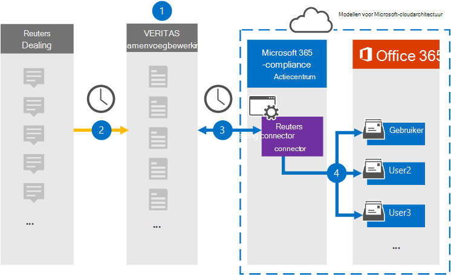

# Een connector instellen voor het archiveren van gegevens van Reuters DealingSet up a connector to archive Reuters Dealing data

Gebruik een Veritas-connector in het Microsoft 365 compliancecentrum om gegevens van het Reuters Dealing-platform te importeren en te archiveren naar postvakken van gebruikers in uw Microsoft 365 organisatie.Use a Veritas connector in the Microsoft 365 compliance center to import and archive data from the Reuters Dealing platform to user mailboxes in your Microsoft 365 organization. Veritas biedt u een [Reuters Dealing-connector](https://globanet.com/reuters-dealing/) die is geconfigureerd om items uit de gegevensbron van derden vast te leggen (op regelmatige basis) en deze items vervolgens te importeren in Microsoft 365.Veritas provides you with a [Reuters Dealing](https://globanet.com/reuters-dealing/) connector that's configured to capture items from the third-party data source (on a regular basis) and then import those items to Microsoft 365. De verbindingslijn converteert Communicatie tussen gebruikers van het account Reuters Dealing naar een e-mailberichtindeling en importeert deze items vervolgens in het postvak van de gebruiker in Microsoft 365.The connector converts Dealing communications from the Reuters Dealing account to an email message format and then imports those items to the user's mailbox in Microsoft 365.

Nadat Reuters Dealing-gegevens zijn opgeslagen in postvakken van gebruikers, kunt u Microsoft 365 compliancefuncties toepassen, zoals Litigation Hold, eDiscovery, bewaarbeleid en bewaarlabels en communicatie compliance.After Reuters Dealing data is stored in user mailboxes, you can apply Microsoft 365 compliance features such as Litigation Hold, eDiscovery, retention policies and retention labels, and communication compliance. Als u een Reuters Dealing-connector gebruikt om gegevens te importeren en te archiveren in Microsoft 365 kan uw organisatie voldoen aan overheids- en regelgevingsbeleid.Using a Reuters Dealing connector to import and archive data in Microsoft 365 can help your organization stay compliant with government and regulatory policies.

## Overzicht van het archiveren van Reuters Dealing-gegevensOverview of archiving Reuters Dealing data

In het volgende overzicht wordt uitgelegd hoe u een verbindingslijn gebruikt om de gegevens van Reuters Dealing te archiveren in Microsoft 365.The following overview explains the process of using a connector to archive the Reuters Dealing data in Microsoft 365.

1. Uw organisatie werkt samen met Reuters Dealing om een Reuters Dealing-site in te stellen en te configureren.Your organization works with Reuters Dealing to set up and configure a Reuters Dealing site.

2. Elke 24 uur worden de items van Reuters Dealing gekopieerd naar de Veritas Merge1-site.Once every 24 hours, Reuters Dealing items are copied to the Veritas Merge1 site. De verbindingslijn converteert de items ook naar een e-mailberichtindeling.The connector also converts the items to an email message format.

3. De Reuters Dealing-connector die u maakt in het Microsoft 365 compliancecentrum, maakt elke dag verbinding met de Veritas Merge1-site en draagt de inhoud over naar een veilige Azure Storage locatie in de Microsoft-cloud.The Reuters Dealing connector that you create in the Microsoft 365 compliance center connects to the Veritas Merge1 site every day and transfers the content to a secure Azure Storage location in the Microsoft cloud.

4. De connector importeert items naar de postvakken van specifieke gebruikers met behulp van de waarde van de eigenschap *E-mail* van de automatische gebruikerstoewijzing, zoals beschreven in [stap 3.](#step-3-map-users-and-complete-the-connector-setup)The connector imports items to the mailboxes of specific users by using the value of the *Email* property of the automatic user mapping as described in [Step 3](#step-3-map-users-and-complete-the-connector-setup). Een submap in de map Postvak IN met de naam **Reuters Dealing** wordt gemaakt in de postvakken van de gebruiker en de items worden geïmporteerd in die map.A subfolder in the Inbox folder named **Reuters Dealing** is created in the user mailboxes, and the items are imported to that folder. De verbindingslijn bepaalt in welk postvak items moeten worden geïmporteerd met behulp van de waarde van de eigenschap *E-mail.*The connector determines which mailbox to import items to by using the value of the *Email* property. Elk Reuters Dealing-item bevat deze eigenschap, die wordt gevuld met het e-mailadres van elke deelnemer van het item.Every Reuters Dealing item contains this property, which is populated with the email address of every participant of the item.

## Voordat u begintBefore you begin

- Maak een Veritas Merge1-account voor Microsoft-connectors.Create a Veritas Merge1 account for Microsoft connectors. Neem contact op met [Veritas Customer Support](https://globanet.com/contact-us)om een account te maken.To create an account, contact [Veritas Customer Support](https://globanet.com/contact-us). U moet zich aanmelden bij dit account wanneer u de verbindingslijn maakt in stap 1.You need to sign into this account when you create the connector in Step 1.

- De gebruiker die in stap 1 de Connector Voor Het dealen van Postvak maakt (en deze voltooit in stap 3), moet worden toegewezen aan de rol Postvak importeren exporteren in Exchange Online.The user who creates the Reuters Dealing connector in Step 1 (and completes it in Step 3) must be assigned to the Mailbox Import Export role in Exchange Online. Deze rol is vereist om verbindingslijnen toe te voegen op de pagina **Gegevensconnectors** in het Microsoft 365 compliancecentrum.This role is required to add connectors on the **Data connectors** page in the Microsoft 365 compliance center. Deze rol is standaard niet toegewezen aan een rollengroep in Exchange Online.By default, this role is not assigned to any role group in Exchange Online. U kunt de rol Postvak importeren exporteren toevoegen aan de rollengroep Organisatiebeheer in Exchange Online.You can add the Mailbox Import Export role to the Organization Management role group in Exchange Online. U kunt ook een rollengroep maken, de rol Postvak importeren exporteren toewijzen en vervolgens de juiste gebruikers toevoegen als leden.Or you can create a role group, assign the Mailbox Import Export role, and then add the appropriate users as members. Zie de secties  Rollengroepen  maken of Rollengroepen wijzigen in het artikel 'Rollengroepen beheren in Exchange Online'.For more information, see the [Create role groups](/Exchange/permissions-exo/role-groups#create-role-groups) or [Modify role groups](/Exchange/permissions-exo/role-groups#modify-role-groups) sections in the article “Manage role groups in Exchange Online”.

## Stap 1: De Connector voor Het omgaan met Reuters instellenStep 1: Set up the Reuters Dealing connector

De eerste stap is om toegang te krijgen tot de pagina Gegevensconnectoren in de Microsoft 365 en een **verbindingslijn** te maken voor gegevens van Reuters Dealing.The first step is to access to the **Data Connectors** page in the Microsoft 365 and create a connector for Reuters Dealing data.

1. Ga naar [https://compliance.microsoft.com](https://compliance.microsoft.com/) en klik vervolgens op **Gegevensconnectors**  >  **Reuters Dealing.**Go to [https://compliance.microsoft.com](https://compliance.microsoft.com/) and then click **Data connectors** > **Reuters Dealing**.

2. Klik op **de pagina Productbeschrijving van Reuters Dealing** op **Verbindingslijn toevoegen.**On the **Reuters Dealing** product description page, click **Add connector**.

3. Klik op **de pagina Servicevoorwaarden** op **Accepteren.**On the **Terms of service** page, click **Accept**.

4. Voer een unieke naam in die de verbindingslijn identificeert en klik vervolgens op **Volgende.**Enter a unique name that identifies the connector, and then click **Next**.

5. Meld u aan bij uw Merge1-account om de verbindingslijn te configureren.Sign to your Merge1 account to configure the connector.

## Stap 2: De Reuters Dealing-connector configureren op de Veritas Merge1-siteStep 2: Configure the Reuters Dealing connector on the Veritas Merge1 site

De tweede stap is het configureren van de Reuters Dealing-connector op Veritas de merge1-site.The second step is to configure the Reuters Dealing connector on Veritas the Merge1 site. Zie Gebruikershandleiding voor connectors van derden samenvoegen voor meer informatie over het configureren van de Connector voor Het dealen van [Reuters.](https://docs.ms.merge1.globanetportal.com/Merge1%20Third-Party%20Connectors%20Reuters%20Dealing%20User%20Guide%20.pdf)For information about configuring the Reuters Dealing connector, see [Merge1 Third-Party Connectors User Guide](https://docs.ms.merge1.globanetportal.com/Merge1%20Third-Party%20Connectors%20Reuters%20Dealing%20User%20Guide%20.pdf).

Nadat u op **Opslaan &** Voltooien  hebt geklikt, wordt de pagina Gebruikerstoewijzing in de wizard verbindingslijn in het Microsoft 365 compliancecentrum weergegeven.After you click **Save & Finish**, the **User mapping** page in the connector wizard in the Microsoft 365 compliance center is displayed.

## Stap 3: Gebruikers in kaart brengen en de configuratie van de connector voltooienStep 3: Map users and complete the connector setup

Als u gebruikers wilt in kaart brengen en de configuratie van de verbindingslijn wilt voltooien in het Microsoft 365 compliancecentrum, volgt u de volgende stappen:To map users and complete the connector setup in the Microsoft 365 compliance center, follow these steps:

1. Schakel op **de pagina Map Reuters Dealing-gebruikers Microsoft 365 gebruikers in** om automatische gebruikerstoewijzing in te stellen.On the **Map Reuters Dealing users to Microsoft 365 users** page, enable automatic user mapping.

   Reuters Dealing items include a property called *Email*, which contains email addresses for users in your organization.Reuters Dealing items include a property called *Email*, which contains email addresses for users in your organization. Als de verbindingslijn dit adres kan koppelen aan Microsoft 365 gebruiker, worden de items geïmporteerd in het postvak van die gebruiker.If the connector can associate this address with a Microsoft 365 user, the items are imported to that user’s mailbox.

2. Klik **op Volgende,** bekijk uw instellingen en ga naar de pagina Gegevensconnectors om de voortgang van het importproces voor de nieuwe **verbindingslijn** te bekijken.Click **Next**, review your settings, and go to the **Data connectors** page to see the progress of the import process for the new connector.

## Stap 4: De Connector voor Het omgaan met Reuters controlerenStep 4: Monitor the Reuters Dealing connector

Nadat u de Connector voor Het omgaan met Reuters hebt gebruikt, kunt u de status van de verbindingslijn weergeven in het Microsoft 365 compliancecentrum.After you create the Reuters Dealing connector, you can view the connector status in the Microsoft 365 compliance center.

1. Ga naar [https://compliance.microsoft.com](https://compliance.microsoft.com/) en klik op **Gegevensconnectoren** in het linkernavigatievenster.Go to [https://compliance.microsoft.com](https://compliance.microsoft.com/) and click **Data connectors** in the left nav.

2. Klik op **het tabblad Verbindingslijnen** en selecteer vervolgens de **verbindingslijn Voor Het** omgaan met Reuters om de flyoutpagina weer te geven, die de eigenschappen en informatie over de verbindingslijn bevat.Click the **Connectors** tab and then select the **Reuters Dealing** connector to display the flyout page, which contains the properties and information about the connector.

3. Klik **onder Verbindingsstatus met bron** op de koppeling Logboek **downloaden** om het statuslogboek voor de verbindingslijn te openen (of op te slaan).Under **Connector status with source**, click the **Download log** link to open (or save) the status log for the connector. Dit logboek bevat gegevens die zijn geïmporteerd in de Microsoft-cloud.This log contains data that has been imported to the Microsoft cloud.

## Bekende problemenKnown issues

- Op dit moment bieden we geen ondersteuning voor het importeren van bijlagen of items die groter zijn dan 10 MB.At this time, we don't support importing attachments or items that are larger than 10 MB. Ondersteuning voor grotere items is op een later tijdstip beschikbaar.Support for larger items will be available at a later date.