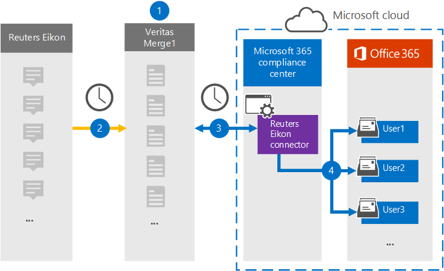

# Een connector instellen voor het archiveren van Reuters Eikon-gegevens

Gebruik een Veritas-connector in het Microsoft 365 compliancecentrum om gegevens van het Reuters Eikon-platform te importeren en te archiveren naar postvakken van gebruikers in uw Microsoft 365 organisatie. Veritas biedt een [Reuters Eikon-connector](https://globanet.com/eikon/) die is geconfigureerd om items uit de externe gegevensbron vast te leggen (op regelmatige basis) en deze items te importeren in Microsoft 365. De connector converteert de inhoud, zoals berichten van persoon tot persoon, groepschats, bijlagen en vrijwaringen van het Reuters Eikon-account van een gebruiker naar een e-mailberichtindeling en importeert deze items vervolgens in het postvak van de gebruiker in Microsoft 365.

Nadat Reuters Eikon-gegevens zijn opgeslagen in gebruikerspostvakken, kunt u Microsoft 365 compliancefuncties toepassen, zoals Litigation Hold, eDiscovery, bewaarbeleid en bewaarlabels en communicatie compliance. Als u een Reuters Eikon-connector gebruikt voor het importeren en archiveren van gegevens in Microsoft 365 kan uw organisatie voldoen aan overheids- en regelgevingsbeleid.

## Overzicht van het archiveren van Reuters Eikon-gegevens

In het volgende overzicht wordt uitgelegd hoe het gebruik van een verbindingslijn voor het archiveren van Reuters Eikon-gegevens in Microsoft 365.

1. Uw organisatie werkt samen met Reuters Eikon om een Reuters Eikon-site in te stellen en te configureren.

2. Elke 24 uur worden Reuters Eikon-items gekopieerd naar de Veritas Merge1-site. De connector converteert ook Reuters Eikon-items naar een e-mailberichtindeling.

3. De Reuters Eikon-connector die u maakt in het Microsoft 365 compliancecentrum, maakt elke dag verbinding met de Veritas Merge1-site en brengt de inhoud over naar een veilige Azure Storage-locatie in de Microsoft-cloud.

4. De connector importeert items naar de postvakken van specifieke gebruikers met behulp van de waarde van de eigenschap *E-mail* van de automatische gebruikerstoewijzing, zoals beschreven in [stap 3.](#step-3-map-users-and-complete-the-connector-setup) Een submap in de map Postvak IN met de naam **Reuters Eikon** wordt gemaakt in de postvakken van de gebruiker en de items worden geïmporteerd in die map. De verbindingslijn bepaalt in welk postvak items moeten worden geïmporteerd met behulp van de waarde van de eigenschap *E-mail.* Elk Reuters Eikon-item bevat deze eigenschap, die wordt gevuld met het e-mailadres van elke deelnemer van het item.

## Voordat u begint

- Maak een Veritas Merge1-account voor Microsoft-connectors. Neem contact op met [Veritas Customer Support](https://globanet.com/ms-connectors-contact)om een account te maken. U meld u aan bij dit account wanneer u de verbindingslijn maakt in stap 1.

- De gebruiker die de Reuters Eikon-connector maakt in stap 1 (en deze voltooit in stap 3), moet worden toegewezen aan de rol Postvak importeren exporteren in Exchange Online. Deze rol is vereist om verbindingslijnen toe te voegen op de pagina **Gegevensconnectors** in het Microsoft 365 compliancecentrum. Deze rol is standaard niet toegewezen aan een rollengroep in Exchange Online. U kunt de rol Postvak importeren exporteren toevoegen aan de rollengroep Organisatiebeheer in Exchange Online. U kunt ook een rollengroep maken, de rol Postvak importeren exporteren toewijzen en vervolgens de juiste gebruikers toevoegen als leden. Zie de secties  Rollengroepen  maken of Rollengroepen wijzigen in het artikel 'Rollengroepen beheren in Exchange Online'.

## Stap 1: De Reuters Eikon-connector instellen

De eerste stap is toegang tot de pagina Gegevensconnectoren in het Microsoft 365 compliancecentrum en een **verbindingslijn** maken voor Reuters Eikon-gegevens.

1. Ga naar [https://compliance.microsoft.com](https://compliance.microsoft.com/) en klik vervolgens op **Gegevensconnectoren**  >  **Reuters Eikon**.

2. Klik op **de pagina Productbeschrijving van Reuters Eikon** op **Verbindingslijn toevoegen.**

3. Klik op **de pagina Servicevoorwaarden** op **Accepteren.**

4. Voer een unieke naam in die de verbindingslijn identificeert en klik vervolgens op **Volgende.**

5. Meld u aan bij uw Merge1-account om de verbindingslijn te configureren.

## Stap 2: De Reuters Eikon-connector configureren op de Veritas Merge1-site

De tweede stap is het configureren van de Reuters Eikon-connector op de merge1-site. Zie Handleiding Connectors van derden samenvoegen voor informatie over het configureren van de Reuters [Eikon-connector](https://docs.ms.merge1.globanetportal.com/Merge1%20Third-Party%20Connectors%20Reuters%20Eikon%20User%20Guide%20.pdf)op de site Veritas Merge1.

Nadat u op **Opslaan &** Voltooien  hebt geklikt, wordt de pagina Gebruikerstoewijzing in de wizard verbindingslijn in het Microsoft 365 compliancecentrum weergegeven.

## Stap 3: Gebruikers in kaart brengen en de configuratie van de connector voltooien

Als u gebruikers wilt in kaart brengen en de configuratie van de verbindingslijn wilt voltooien in het Microsoft 365 compliancecentrum, volgt u de volgende stappen:

1. Schakel op **de pagina Externe gebruikers toewijzen Microsoft 365 gebruikers in,** automatische gebruikerstoewijzing in. De Reuters Eikon-items bevatten een eigenschap met de naam *E-mail,* die e-mailadressen bevat voor gebruikers in uw organisatie. Als de verbindingslijn dit adres kan koppelen aan Microsoft 365 gebruiker, worden de items geïmporteerd in het postvak van die gebruiker.

2. Klik **op Volgende,** controleer uw instellingen en ga naar de pagina Gegevensconnectors om de voortgang van het importproces voor de nieuwe **verbindingslijn** te bekijken.

## Stap 4: De Reuters Eikon-connector controleren

Nadat u de Reuters Eikon-connector hebt gebruikt, kunt u de verbindingslijnstatus weergeven in het Microsoft 365 compliancecentrum.

1. Ga naar [https://compliance.microsoft.com](https://compliance.microsoft.com) en klik op **Gegevensconnectoren** in het linkernavigatievenster.

2. Klik op **het tabblad Verbindingslijnen** en selecteer vervolgens de **Reuters Eikon-verbindingslijn** om de flyoutpagina weer te geven. Deze pagina bevat de eigenschappen en informatie over de verbindingslijn.

3. Klik **onder Verbindingsstatus met bron** op de koppeling Logboek **downloaden** om het statuslogboek voor de verbindingslijn te openen (of op te slaan). Dit logboek bevat informatie over de gegevens die zijn geïmporteerd in de Microsoft-cloud.

## Bekende problemen

- Op dit moment bieden we geen ondersteuning voor het importeren van bijlagen of items die groter zijn dan 10 MB. Ondersteuning voor grotere items is op een later tijdstip beschikbaar.