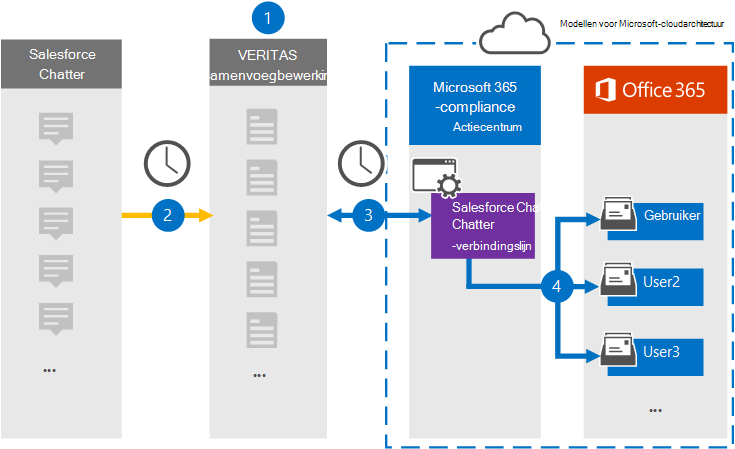

# Een connector instellen voor het archiveren van Salesforce Chatter-gegevensSet up a connector to archive Salesforce Chatter data

Gebruik een Veritas-connector in het Microsoft 365 compliancecentrum om gegevens van het Salesforce Chatter-platform te importeren en te archiveren in gebruikerspostvakken in uw Microsoft 365 organisatie.Use a Veritas connector in the Microsoft 365 compliance center to import and archive data from the Salesforce Chatter platform to user mailboxes in your Microsoft 365 organization. Veritas biedt een [Salesforce Chatter-connector](http://globanet.com/chatter/) die items uit de gegevensbron van derden vast legt en deze items importeert naar Microsoft 365.Veritas provides a [Salesforce Chatter](http://globanet.com/chatter/) connector that captures items from the third-party data source and imports those items to Microsoft 365. De connector converteert de inhoud, zoals chats, bijlagen en berichten van Salesforce Chatter naar een e-mailberichtindeling en importeert deze items vervolgens in het postvak van de gebruiker in Microsoft 365.The connector converts the content such as chats, attachments, and posts from Salesforce Chatter to an email message format and then imports those items to the user’s mailbox in Microsoft 365.

Nadat Salesforce Chatter-gegevens zijn opgeslagen in gebruikerspostvakken, kunt u Microsoft 365 compliancefuncties toepassen, zoals Litigation Hold, eDiscovery, bewaarbeleid en bewaarlabels.After Salesforce Chatter data is stored in user mailboxes, you can apply Microsoft 365 compliance features such as Litigation Hold, eDiscovery, retention policies and retention labels. Als u een Salesforce Chatter-connector gebruikt om gegevens te importeren en te archiveren in Microsoft 365 kan uw organisatie voldoen aan overheids- en regelgevingsbeleid.Using a Salesforce Chatter connector to import and archive data in Microsoft 365 can help your organization stay compliant with government and regulatory policies.

## Overzicht van het archiveren van Salesforce Chatter-gegevensOverview of archiving Salesforce Chatter data

In het volgende overzicht wordt uitgelegd hoe u een verbindingslijn gebruikt om de Salesforce Chatter-gegevens te archiveren in Microsoft 365.The following overview explains the process of using a connector to archive the Salesforce Chatter data in Microsoft 365.

1. Uw organisatie werkt samen met Salesforce Chatter om een Salesforce Chatter-site in te stellen en te configureren.Your organization works with Salesforce Chatter to set up and configure a Salesforce Chatter site.

2. Eens in de 24 uur worden Salesforce Chatter-items gekopieerd naar de Veritas Merge1-site.Once every 24 hours, Salesforce Chatter items are copied to the Veritas Merge1 site. De connector bevat ook Salesforce Chatter-items naar een e-mailberichtindeling.The connector also Salesforce Chatter items to an email message format.

3. De Salesforce Chatter-connector die u maakt in het Microsoft 365 compliancecentrum, maakt elke dag verbinding met de Veritas Merge1-site en draagt de Chatter-inhoud over naar een veilige Azure Storage-locatie in de Microsoft-cloud.The Salesforce Chatter connector that you create in the Microsoft 365 compliance center, connects to the Veritas Merge1 site every day and transfers the Chatter content to a secure Azure Storage location in the Microsoft cloud.

4. De connector importeert de geconverteerde items in de postvakken van specifieke gebruikers met behulp van de waarde van de eigenschap *E-mail* van de automatische gebruikerstoewijzing, zoals beschreven in [stap 3.](#step-3-map-users-and-complete-the-connector-setup)The connector imports the converted items to the mailboxes of specific users using the value of the *Email* property of the automatic user mapping as described in [Step 3](#step-3-map-users-and-complete-the-connector-setup). Een submap in de map Postvak IN met de naam **Salesforce Chatter** wordt gemaakt in de postvakken van gebruikers en items worden geïmporteerd in die map.A subfolder in the Inbox folder named **Salesforce Chatter** is created in the user mailboxes, and items are imported to that folder. De verbindingslijn bepaalt in welk postvak items moeten worden geïmporteerd met behulp van de waarde van de eigenschap *E-mail.*The connector determines which mailbox to import items to by using the value of the *Email* property. Elk Chatter-item bevat deze eigenschap, die wordt gevuld met het e-mailadres van elke deelnemer van het item.Every Chatter item contains this property, which is populated with the email address of every participant of the item.

## Voordat u begintBefore you begin

- Maak een Merge1-account voor Microsoft-connectors.Create a Merge1 account for Microsoft connectors. Neem contact op met [Veritas Customer Support](https://www.veritas.com/content/support/)om een account te maken.To create an account, contact [Veritas Customer Support](https://www.veritas.com/content/support/). U moet zich aanmelden bij dit account wanneer u de verbindingslijn maakt in stap 1.You need to sign into this account when you create the connector in Step 1.

- Maak een Salesforce-toepassing en verkrijg een token bij [https://salesforce.com](https://salesforce.com) .Create a Salesforce application and acquire a token at [https://salesforce.com](https://salesforce.com). U moet zich aanmelden bij het Salesforce-account als beheerder en een persoonlijk token van een gebruiker krijgen om gegevens te importeren.You'll need to log into the Salesforce account as an admin and get a user personal token to import data. Daarnaast moeten triggers worden gepubliceerd op de Chatter-site om updates, verwijderen en bewerken vast te leggen.Also, triggers need to be published on the Chatter site to capture updates, deletes, and edits. Deze triggers maken een bericht op een kanaal en Samenvoegen1 legt de informatie vast uit het kanaal.These triggers will create a post on a channel, and Merge1 will capture the information from the channel. Zie Gebruikershandleiding voor connectors van derden samenvoegen [voor stapsgewijs](https://docs.ms.merge1.globanetportal.com/Merge1%20Third-Party%20Connectors%20SalesForce%20Chatter%20User%20Guide%20.pdf)instructies over het maken van de toepassing en het verkrijgen van het token.For step-by-step instructions about how to create the application and acquire the token, see [Merge1 Third-Party Connectors User Guide](https://docs.ms.merge1.globanetportal.com/Merge1%20Third-Party%20Connectors%20SalesForce%20Chatter%20User%20Guide%20.pdf).

- De gebruiker die de Salesforce Chatter-connector maakt in stap 1 (en deze voltooit in stap 3), moet worden toegewezen aan de rol Postvak importeren exporteren in Exchange Online.The user who creates the Salesforce Chatter connector in Step 1 (and completes it in Step 3) must be assigned to the Mailbox Import Export role in Exchange Online. Deze rol is vereist om verbindingslijnen toe te voegen op de pagina **Gegevensconnectors** in het Microsoft 365 compliancecentrum.This role is required to add connectors on the **Data connectors** page in the Microsoft 365 compliance center. Deze rol is standaard niet toegewezen aan een rollengroep in Exchange Online.By default, this role isn’t assigned to any role group in Exchange Online. U kunt de rol Postvak importeren exporteren toevoegen aan de rollengroep Organisatiebeheer in Exchange Online.You can add the Mailbox Import Export role to the Organization Management role group in Exchange Online. U kunt ook een rollengroep maken, de rol Postvak importeren exporteren toewijzen en vervolgens de juiste gebruikers toevoegen als leden.Or you can create a role group, assign the Mailbox Import Export role, and then add the appropriate users as members. Zie de secties  Rollengroepen  maken of Rollengroepen wijzigen in het artikel 'Rollengroepen beheren in Exchange Online'.For more information, see the [Create role groups](/Exchange/permissions-exo/role-groups#create-role-groups) or [Modify role groups](/Exchange/permissions-exo/role-groups#modify-role-groups) sections in the article "Manage role groups in Exchange Online".

## Stap 1: De Salesforce Chatter-connector instellenStep 1: Set up the Salesforce Chatter connector

De eerste stap is toegang tot de pagina Gegevensconnectoren in het Microsoft 365 compliancecentrum en een **verbindingslijn** maken voor Chatter-gegevens.The first step is to access to the **Data Connectors** page in the Microsoft 365 compliance center and create a connector for Chatter data.

1. Ga naar [https://compliance.microsoft.com](https://compliance.microsoft.com/) en klik vervolgens op **Gegevensconnectoren**  >  **Salesforce Chatter**.Go to [https://compliance.microsoft.com](https://compliance.microsoft.com/) and then click **Data connectors** > **Salesforce Chatter**.

2. Klik op **de pagina Productbeschrijving van Salesforce Chatter** op **Verbindingslijn toevoegen.**On the **Salesforce Chatter** product description page, click **Add connector**.

3. Klik op **de pagina Servicevoorwaarden** op **Accepteren.**On the **Terms of service** page, click **Accept**.

4. Voer een unieke naam in die de verbindingslijn identificeert en klik vervolgens op **Volgende.**Enter a unique name that identifies the connector, and then click **Next**.

5. Meld u aan bij uw Merge1-account om de verbindingslijn te configureren.Sign in to your Merge1 account to configure the connector.

## Stap 2: De Salesforce-chatfunctie configureren op de Veritas Merge1-siteStep 2: Configure the Salesforce Chatter on the Veritas Merge1 site

De tweede stap is het configureren van de Salesforce Chatter-connector op de Veritas Merge1-site.The second step is to configure the Salesforce Chatter connector on the Veritas Merge1 site. Zie Gebruikershandleiding voor [connectors](https://docs.ms.merge1.globanetportal.com/Merge1%20Third-Party%20Connectors%20SalesForce%20Chatter%20User%20Guide%20.pdf)van derden samenvoegen voor informatie over het configureren van de Salesforce Chatter-connector.For information about how to configure the Salesforce Chatter connector, see [Merge1 Third-Party Connectors User Guide](https://docs.ms.merge1.globanetportal.com/Merge1%20Third-Party%20Connectors%20SalesForce%20Chatter%20User%20Guide%20.pdf).

Nadat u op Opslaan & Voltooien  hebt geklikt, wordt de pagina Gebruikerstoewijzing in de wizard Verbindingslijn in Microsoft 365 compliancecentrum weergegeven. After you click **Save & Finish,** the **User mapping** page in the connector wizard in the Microsoft 365 compliance center is displayed.

## Stap 3: Gebruikers in kaart brengen en de configuratie van de connector voltooienStep 3: Map users and complete the connector setup

Als u gebruikers wilt in kaart brengen en de configuratie van de verbindingslijn wilt voltooien in het Microsoft 365 compliancecentrum, volgt u de volgende stappen:To map users and complete the connector setup in the Microsoft 365 compliance center, follow these steps:

1. Schakel op **de pagina Gebruikers van Salesforce Chatter toewijzen Microsoft 365 gebruikers automatisch** toewijzen in.On the **Map Salesforce Chatter users to Microsoft 365 users** page, enable automatic user mapping. De Salesforce Chatter-items bevatten een eigenschap met de naam E-mail, die e-mailadressen bevat voor gebruikers in uw organisatie.The Salesforce Chatter items include a property called *Email*, which contains email addresses for users in your organization. Als de verbindingslijn dit adres kan koppelen aan Microsoft 365 gebruiker, worden de items geïmporteerd in het postvak van die gebruiker.If the connector can associate this address with a Microsoft 365 user, the items are imported to that user’s mailbox.

2. klik **op Volgende,** controleer uw instellingen en ga naar de pagina Gegevensconnectors om de voortgang van het importproces voor de nieuwe **verbindingslijn** te bekijken.click **Next**, review your settings, and then go to the **Data connectors** page to see the progress of the import process for the new connector.

## Stap 4: De Salesforce Chatter-connector controlerenStep 4: Monitor the Salesforce Chatter connector

Nadat u de Salesforce Chatter-connector hebt gebruikt, kunt u de verbindingslijnstatus bekijken in het Microsoft 365 compliancecentrum.After you create the Salesforce Chatter connector, you can view the connector status in the Microsoft 365 compliance center.

1. Ga naar [https://compliance.microsoft.com](https://compliance.microsoft.com/) en klik op **Gegevensconnectoren** in het linkernavigatievenster.Go to [https://compliance.microsoft.com](https://compliance.microsoft.com/) and click **Data connectors** in the left nav.

2. klik op **het tabblad Connectors** en klik vervolgens op de Salesforce **Chatter-verbindingslijn** om de flyoutpagina weer te geven, die de eigenschappen en informatie over de verbindingslijn bevat.click the **Connectors** tab and then click the **Salesforce Chatter** connector to display the flyout page, which contains the properties and information about the connector.

3. Klik **onder Verbindingsstatus met bron** op de koppeling Logboek **downloaden** om het statuslogboek voor de verbindingslijn te openen (of op te slaan).Under **Connector status with source**, click the **Download log** link to open (or save) the status log for the connector. Dit logboek bevat gegevens die zijn geïmporteerd in de Microsoft-cloud.This log contains data that's been imported to the Microsoft cloud.

## Bekende problemenKnown issues

- Op dit moment bieden we geen ondersteuning voor het importeren van bijlagen of items die groter zijn dan 10 MB.At this time, we don't support importing attachments or items that are larger than 10 MB. Ondersteuning voor grotere items is op een later tijdstip beschikbaar.Support for larger items will be available at a later date.