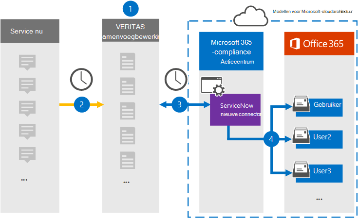

# Een verbindingslijn instellen voor het archiveren van ServiceNow-gegevensSet up a connector to archive ServiceNow data

Gebruik een Veritas-connector in het Microsoft 365 compliancecentrum om gegevens van het ServiceNow-platform te importeren en te archiveren naar postvakken van gebruikers in uw Microsoft 365 organisatie.Use a Veritas connector in the Microsoft 365 compliance center to import and archive data from the ServiceNow platform to user mailboxes in your Microsoft 365 organization. Veritas biedt een [ServiceNow-connector](https://globanet.com/servicenow/) die items uit de gegevensbron van derden vast legt en deze items importeert in Microsoft 365.Veritas provides a [ServiceNow](https://globanet.com/servicenow/) connector that captures items from the third-party data source and import those items to Microsoft 365. De connector converteert de inhoud, zoals liveberichten, bijlagen en berichten van ServiceNow naar een e-mailberichtindeling en importeert deze items vervolgens in postvakken van gebruikers in Microsoft 365.The connector converts the content such as live messages, attachments, and posts from ServiceNow to an email message format and then imports those items to user mailboxes in Microsoft 365.

Nadat ServiceNow-gegevens zijn opgeslagen in gebruikerspostvakken, kunt u Microsoft 365 compliancefuncties toepassen, zoals Litigation Hold, eDiscovery, bewaarbeleid en bewaarlabels.After ServiceNow data is stored in user mailboxes, you can apply Microsoft 365 compliance features such as Litigation Hold, eDiscovery, retention policies, and retention labels. Als u een ServiceNow-connector gebruikt voor het importeren en archiveren van gegevens in Microsoft 365 kan uw organisatie voldoen aan overheids- en regelgevingsbeleid.Using a ServiceNow connector to import and archive data in Microsoft 365 can help your organization stay compliant with government and regulatory policies.

## Overzicht van het archiveren van ServiceNow-gegevensOverview of archiving ServiceNow data

In het volgende overzicht wordt uitgelegd hoe u een verbindingslijn gebruikt om de ServiceNow-gegevens te archiveren in Microsoft 365.The following overview explains the process of using a connector to archive the ServiceNow data in Microsoft 365.

1. Uw organisatie werkt samen met ServiceNow om een ServiceNow-site in te stellen en te configureren.Your organization works with ServiceNow to set up and configure a ServiceNow site.

2. Eenmaal per 24 uur worden ServiceNow-items gekopieerd naar de Veritas Merge1-site.Once every 24 hours, ServiceNow items are copied to the Veritas Merge1 site. De connector converteert ook ServiceNow-items naar een e-mailberichtindeling.The connector also converts ServiceNow items to an email message format.

3. De ServiceNow-connector die u in het Microsoft 365-compliancecentrum maakt, maakt elke dag verbinding met de Veritas Merge1-site en draagt de ServiceNow-inhoud over naar een veilige Azure Storage-locatie in de Microsoft-cloud.The ServiceNow connector that you create in the Microsoft 365 compliance center connects to the Veritas Merge1 site every day and transfers the ServiceNow content to a secure Azure Storage location in the Microsoft cloud.

4. De connector importeert de geconverteerde items in de postvakken van specifieke gebruikers met behulp van de waarde van de eigenschap *E-mail* van de automatische gebruikerstoewijzing, zoals beschreven in [stap 3.](#step-3-map-users-and-complete-the-connector-setup)The connector imports the converted items to the mailboxes of specific users using the value of the *Email* property of the automatic user mapping as described in [Step 3](#step-3-map-users-and-complete-the-connector-setup). Er wordt een submap in de map Postvak IN met de naam **ServiceNow** gemaakt in de postvakken van de gebruiker en items worden geïmporteerd in die map.A subfolder in the Inbox folder named **ServiceNow** is created in the user mailboxes, and items are imported to that folder. De verbindingslijn bepaalt in welk postvak items moeten worden geïmporteerd met behulp van de waarde van de eigenschap *E-mail.*The connector determines which mailbox to import items to by using the value of the *Email* property. Elk ServiceNow-item bevat deze eigenschap, die wordt gevuld met het e-mailadres van elke deelnemer aan het item.Every ServiceNow item contains this property, which is populated with the email address of every participant of the item.

## Voordat u begintBefore you begin

- Maak een Merge1-account voor Microsoft-connectors.Create a Merge1 account for Microsoft connectors. Neem contact op met [Veritas Customer Support](https://www.veritas.com/content/support/)om een account te maken.To create an account, contact [Veritas Customer Support](https://www.veritas.com/content/support/). U moet zich aanmelden bij dit account wanneer u de verbindingslijn maakt in stap 1.You need to sign into this account when you create the connector in Step 1.

- Maak een ServiceNow-toepassing om gegevens op te halen uit uw ServiceNow-account.Create a ServiceNow application to fetch data from your ServiceNow account. Zie Gebruikershandleiding voor connectors van derden samenvoegen voor stapsgewijse instructies over het maken [van de toepassing.](https://docs.ms.merge1.globanetportal.com/Merge1%20Third-Party%20Connectors%20ServiceNow%20User%20Guide%20.pdf)For step-by step instructions about creating the application, see [Merge1 Third-Party Connectors User Guide](https://docs.ms.merge1.globanetportal.com/Merge1%20Third-Party%20Connectors%20ServiceNow%20User%20Guide%20.pdf).

- De gebruiker die de ServiceNow-connector maakt in stap 1 (en deze voltooit in stap 3), moet worden toegewezen aan de rol Postvak importeren exporteren in Exchange Online.The user who creates the ServiceNow connector in Step 1 (and completes it in Step 3) must be assigned to the Mailbox Import Export role in Exchange Online. Deze rol is vereist om verbindingslijnen toe te voegen op de pagina **Gegevensconnectors** in het Microsoft 365 compliancecentrum.This role is required to add connectors on the **Data connectors** page in the Microsoft 365 compliance center. Deze rol is standaard niet toegewezen aan een rollengroep in Exchange Online.By default, this role isn't assigned to any role group in Exchange Online. U kunt de rol Postvak importeren exporteren toevoegen aan de rollengroep Organisatiebeheer in Exchange Online.You can add the Mailbox Import Export role to the Organization Management role group in Exchange Online. U kunt ook een rollengroep maken, de rol Postvak importeren exporteren toewijzen en vervolgens de juiste gebruikers toevoegen als leden.Or you can create a role group, assign the Mailbox Import Export role, and then add the appropriate users as members. Zie de secties  Rollengroepen  maken of Rollengroepen wijzigen in het artikel 'Rollengroepen beheren in Exchange Online'.For more information, see the [Create role groups](/Exchange/permissions-exo/role-groups#create-role-groups) or [Modify role groups](/Exchange/permissions-exo/role-groups#modify-role-groups) sections in the article "Manage role groups in Exchange Online".

## Stap 1: De ServiceNow-connector instellenStep 1: Set up the ServiceNow connector

De eerste stap is toegang tot de pagina Gegevensconnectoren in het Microsoft 365 compliancecentrum en een **verbindingslijn** maken voor ServiceNow-gegevens.The first step is to access to the **Data Connectors** page in the Microsoft 365 compliance center and create a connector for ServiceNow data.

1. Ga naar [https://compliance.microsoft.com](https://compliance.microsoft.com/) en klik vervolgens op **Gegevensconnectoren**  >  **ServiceNow**.Go to [https://compliance.microsoft.com](https://compliance.microsoft.com/) and then click **Data connectors** > **ServiceNow**.

2. Klik op **de pagina ServiceNow-productbeschrijving** op **Verbindingslijn toevoegen.**On the **ServiceNow** product description page, click **Add connector**.

3. Klik op **de pagina Servicevoorwaarden** op **Accepteren.**On the **Terms of service** page, click **Accept**.

4. Voer een unieke naam in die de verbindingslijn identificeert en klik vervolgens op **Volgende.**Enter a unique name that identifies the connector, and then click **Next**.

5. Meld u aan bij uw Merge1-account om de verbindingslijn te configureren.Sign in to your Merge1 account to configure the connector.

## Stap 2: De ServiceNow configureren op de Veritas Merge1-siteStep 2: Configure the ServiceNow on the Veritas Merge1 site

De tweede stap is het configureren van de ServiceNow-connector op de Veritas Merge1-site.The second step is to configure the ServiceNow connector on the Veritas Merge1 site. Zie Gebruikershandleiding voor [connectors](https://docs.ms.merge1.globanetportal.com/Merge1%20Third-Party%20Connectors%20ServiceNow%20User%20Guide%20.pdf)van derden samenvoegen voor informatie over het configureren van de ServiceNow-connector.For information about how to configure the ServiceNow connector, see [Merge1 Third-Party Connectors User Guide](https://docs.ms.merge1.globanetportal.com/Merge1%20Third-Party%20Connectors%20ServiceNow%20User%20Guide%20.pdf).

Nadat u op Opslaan & Voltooien  hebt geklikt, wordt de pagina Gebruikerstoewijzing in de wizard Verbindingslijn in Microsoft 365 compliancecentrum weergegeven. After you click **Save & Finish,** the **User mapping** page in the connector wizard in the Microsoft 365 compliance center is displayed.

## Stap 3: Gebruikers in kaart brengen en de configuratie van de connector voltooienStep 3: Map users and complete the connector setup

Als u gebruikers wilt in kaart brengen en de configuratie van de verbindingslijn wilt voltooien in het Microsoft 365 compliancecentrum, volgt u de volgende stappen:To map users and complete the connector setup in the Microsoft 365 compliance center, follow these steps:

1. Schakel automatische gebruikerstoewijzing in **op de pagina Microsoft 365 Gebruikers** toewijzen.On the **Map ServiceNow users to Microsoft 365 users** page, enable automatic user mapping. De ServiceNow-items bevatten een eigenschap met de naam E-mail, die e-mailadressen bevat voor gebruikers in uw organisatie.The ServiceNow items include a property called *Email*, which contains email addresses for users in your organization. Als de verbindingslijn dit adres kan koppelen aan Microsoft 365 gebruiker, worden de items geïmporteerd in het postvak van die gebruiker.If the connector can associate this address with a Microsoft 365 user, the items are imported to that user's mailbox.

2. Klik **op Volgende,** controleer uw instellingen en ga naar de pagina Gegevensconnectors om de voortgang van het importproces voor de nieuwe **verbindingslijn** te bekijken.Click **Next**, review your settings, and then go to the **Data connectors** page to see the progress of the import process for the new connector.

## Stap 4: De ServiceNow-connector controlerenStep 4: Monitor the ServiceNow connector

Nadat u de ServiceNow-verbindingslijn hebt gebruikt, kunt u de status van de verbindingslijn weergeven in het Microsoft 365 compliancecentrum.After you create the ServiceNow connector, you can view the connector status in the Microsoft 365 compliance center.

1. Ga naar [https://compliance.microsoft.com](https://compliance.microsoft.com/) en klik op **Gegevensconnectoren** in het linkernavigatievenster.Go to [https://compliance.microsoft.com](https://compliance.microsoft.com/) and click **Data connectors** in the left nav.

2. Klik op **het tabblad Verbindingslijnen** en selecteer vervolgens de **ServiceNow-verbindingslijn** om de flyoutpagina weer te geven, die de eigenschappen en informatie over de verbindingslijn bevat.Click the **Connectors** tab and then select the **ServiceNow** connector to display the flyout page, which contains the properties and information about the connector.

3. Klik **onder Verbindingsstatus met bron** op de koppeling Logboek **downloaden** om het statuslogboek voor de verbindingslijn te openen (of op te slaan).Under **Connector status with source**, click the **Download log** link to open (or save) the status log for the connector. Dit logboek bevat gegevens die zijn geïmporteerd in de Microsoft-cloud.This log contains data that has been imported to the Microsoft cloud.

## Bekende problemenKnown issues

- Op dit moment bieden we geen ondersteuning voor het importeren van bijlagen of items die groter zijn dan 10 MB.At this time, we don't support importing attachments or items that are larger than 10 MB. Ondersteuning voor grotere items is op een later tijdstip beschikbaar.Support for larger items will be available at a later date.